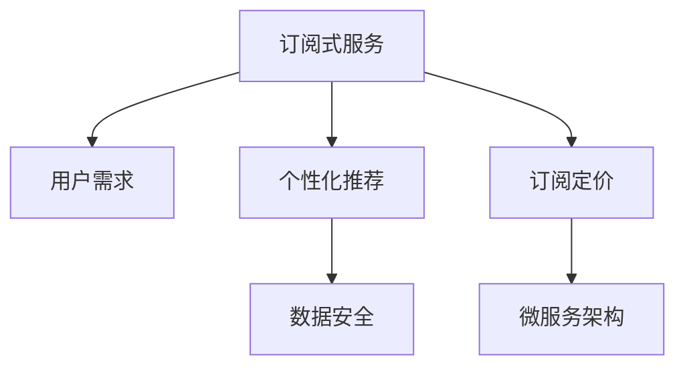

                 

# 利用技术优势创建订阅式服务

> 关键词：订阅式服务, 技术优势, 用户需求, 个性化推荐, 订阅定价, 算法优化, 数据安全, 微服务架构

## 1. 背景介绍

在互联网快速发展的今天，订阅式服务因其灵活、方便、性价比高而受到越来越多用户的青睐。从音乐流媒体、视频平台到软件工具、云服务，几乎所有行业都在采用订阅模式来满足用户多样化的需求。然而，如何精准定位用户需求、优化用户体验、保证服务质量并实现盈利，是订阅式服务面临的主要挑战。

本文将从技术角度出发，探讨利用技术优势创建高效的订阅式服务。我们将详细阐述用户需求理解、个性化推荐算法、订阅定价策略、数据安全保护和微服务架构等核心概念，通过逻辑清晰、结构紧凑、简单易懂的专业的技术语言，为订阅式服务的发展提供全方位的技术指引。

## 2. 核心概念与联系

### 2.1 核心概念概述

为了更好地理解订阅式服务的技术实现，本节将介绍几个关键概念及其相互关系：

- **订阅式服务(Subscription-based Service)**：用户为获得持续的服务而定期支付费用，如SaaS(软件即服务)、PaaS(平台即服务)、IaaS(基础设施即服务)等。
- **用户需求(User Demand)**：用户希望通过订阅服务获得的功能、性能和服务质量等。
- **个性化推荐(Recommendation)**：基于用户行为数据，推荐用户可能感兴趣的内容或服务。
- **订阅定价(Subscription Pricing)**：根据服务价值和用户需求，制定合理的定价策略，实现收益最大化。
- **数据安全(Data Security)**：保护用户隐私和数据安全，防止数据泄露和滥用。
- **微服务架构(Microservices Architecture)**：将服务分解为多个小服务模块，每个服务模块独立部署、管理，提升系统的可扩展性和维护性。

这些核心概念之间的逻辑关系可以通过以下Mermaid流程图来展示：



该流程图展示了订阅式服务的技术架构及其核心功能模块：

1. 订阅式服务通过收集用户需求，提供个性化推荐。
2. 服务定价策略的制定基于推荐内容和用户满意度。
3. 数据安全保护贯穿服务的各个环节。
4. 微服务架构提升服务系统的可扩展性和可靠性。

## 3. 核心算法原理 & 具体操作步骤
### 3.1 算法原理概述

订阅式服务的核心算法主要围绕用户需求理解、个性化推荐和订阅定价展开。以下是各个算法的基本原理：

1. **用户需求理解**：通过分析用户行为数据，如点击、浏览、购买记录等，挖掘用户的兴趣点，为用户推荐最相关的内容或服务。
2. **个性化推荐**：基于推荐算法，如协同过滤、基于内容的推荐、深度学习推荐等，从庞大的内容库中筛选出最匹配用户需求的内容。
3. **订阅定价策略**：通过分析用户的使用频率、付费意愿等数据，制定合理的订阅价格，既满足用户需求，又保证收益。

### 3.2 算法步骤详解

#### 3.2.1 用户需求理解

**步骤1: 数据采集**
- 收集用户的各种行为数据，包括点击、浏览、购买记录、搜索历史等。
- 利用日志分析工具对数据进行清洗和预处理，去除噪声和异常值，确保数据质量。

**步骤2: 用户画像建模**
- 基于采集到的用户行为数据，构建用户画像，包括用户的基本信息、兴趣偏好、行为特征等。
- 使用聚类算法（如K-means、LDA等）对用户进行分类，识别不同兴趣群体的特征。

**步骤3: 用户画像更新**
- 定期更新用户画像，捕捉用户行为变化，确保推荐结果的时效性。
- 结合用户反馈和新数据，不断优化用户画像，提高推荐的准确性。

#### 3.2.2 个性化推荐

**步骤1: 特征工程**
- 对用户行为数据进行特征提取，如点击次数、浏览时长、购买金额等。
- 将用户画像与内容特征进行匹配，构建用户-内容关联矩阵。

**步骤2: 推荐算法**
- 选择适合的推荐算法，如协同过滤、基于内容的推荐、深度学习推荐等。
- 在推荐算法中，加入用户画像和内容特征，训练模型，生成推荐结果。

**步骤3: 推荐结果优化**
- 对推荐结果进行排序和筛选，提升推荐的相关性和多样性。
- 结合A/B测试，优化推荐算法和特征工程，提高用户体验。

#### 3.2.3 订阅定价策略

**步骤1: 定价模型建立**
- 根据用户画像和行为数据，建立定价模型，计算用户对不同服务的价值。
- 引入外部市场数据，如市场价格、竞争情况等，调整定价模型。

**步骤2: 定价策略设计**
- 设计多阶梯定价策略，如按月、按年订阅，不同套餐和付费级别等。
- 考虑用户生命周期价值，提供捆绑优惠和折扣，增加用户粘性。

**步骤3: 定价策略执行**
- 根据用户行为和需求，动态调整定价策略，确保定价公平合理。
- 通过数据分析，持续优化定价模型，提升收益。

### 3.3 算法优缺点

#### 3.3.1 用户需求理解

**优点：**
- 通过用户行为数据，精确把握用户需求，提高推荐相关性。
- 定期更新用户画像，捕捉用户行为变化，保持推荐的时效性。

**缺点：**
- 数据隐私和安全问题，需要严格遵守隐私保护法规。
- 数据采集成本高，需投入大量人力和技术资源。

#### 3.3.2 个性化推荐

**优点：**
- 提高用户满意度和黏性，提升平台用户转化率。
- 引入深度学习等前沿技术，提升推荐精度和多样化。

**缺点：**
- 算法复杂度高，计算资源消耗大。
- 推荐结果存在偏差，可能误导用户选择。

#### 3.3.3 订阅定价策略

**优点：**
- 精准定位用户价值，制定合理的定价策略。
- 动态调整定价，提高收益和用户满意度。

**缺点：**
- 定价模型复杂，需结合多种数据源和模型。
- 定价策略可能影响用户公平感，需平衡收益和用户体验。

## 4. 数学模型和公式 & 详细讲解 & 举例说明

### 4.1 数学模型构建

假设订阅服务有三个关键要素：内容库$C$、用户集$U$和价格模型$P$。内容库$C$中的每个内容$c_i$有若干属性$x_{i,j}$，用户$u_k$有行为特征$y_{k,l}$。定价模型$P$基于用户需求和内容价值，计算每个用户订阅不同服务的费用。

目标函数为最大化总收益$R$，即：
$$ R = \sum_{k=1}^N \sum_{i=1}^M p_i R_i $$

其中，$N$为用户的数量，$M$为内容的数量，$p_i$为内容$c_i$的定价，$R_i$为用户$u_k$订阅内容$c_i$的收益。

### 4.2 公式推导过程

1. **用户需求理解**
   - **数据采集**：使用日志记录用户行为数据，如点击、浏览、购买等。
   - **用户画像建模**：通过K-means聚类算法，对用户进行分类，提取用户特征。

2. **个性化推荐**
   - **特征工程**：提取用户行为特征，如点击次数、浏览时长等。
   - **协同过滤**：基于用户-内容矩阵，计算用户$u_k$对内容$c_i$的兴趣度$r_{k,i}$。
   - **基于内容的推荐**：结合内容属性和用户画像，生成推荐结果。

3. **订阅定价策略**
   - **定价模型建立**：结合用户画像和内容价值，计算用户订阅费用。
   - **多阶梯定价策略**：设计按月、按年订阅的定价模型，并提供不同套餐和折扣。
   - **动态定价优化**：通过A/B测试，持续优化定价策略。

### 4.3 案例分析与讲解

**案例：音乐流媒体订阅服务**

**用户需求理解**
- 通过日志记录用户的点击、播放、收藏等行为，提取用户兴趣。
- 使用K-means聚类，将用户分为流行、摇滚、电子等兴趣群体。

**个性化推荐**
- 提取用户行为特征，如播放次数、收藏歌曲数等。
- 使用协同过滤，计算用户对每首歌曲的兴趣度。
- 结合用户画像和歌曲属性，生成个性化推荐列表。

**订阅定价策略**
- 根据用户行为数据，建立定价模型，计算用户订阅不同套餐的费用。
- 设计多阶梯定价策略，如基础套餐、高级套餐、会员套餐等。
- 结合用户生命周期价值，提供绑定优惠和折扣。

## 5. 项目实践：代码实例和详细解释说明

### 5.1 开发环境搭建

1. 安装Python：从官网下载安装Python，并设置环境变量。
2. 安装依赖库：使用pip安装必要的Python库，如pandas、numpy、scikit-learn等。
3. 搭建服务器：选择适合的云服务提供商，搭建服务器环境，配置好数据库和中间件。

### 5.2 源代码详细实现

**5.2.1 数据采集和预处理**

```python
import pandas as pd

# 读取用户行为数据
user_data = pd.read_csv('user_behavior.csv')

# 数据清洗和预处理
user_data = user_data.dropna().drop_duplicates()
user_data = user_data[(user_data['clicks'] > 10) & (user_data['duration'] > 300)]
```

**5.2.2 用户画像建模**

```python
from sklearn.cluster import KMeans

# 构建用户画像
kmeans = KMeans(n_clusters=5)
user_data['cluster'] = kmeans.fit_predict(user_data[['clicks', 'duration', 'browsed']])
```

**5.2.3 个性化推荐**

```python
import numpy as np
from scipy.spatial.distance import cosine

# 构建用户-内容关联矩阵
user_content = user_data.groupby(['user_id', 'content_id']).agg({'clicks': 'sum'}).unstack().fillna(0)

# 协同过滤推荐
def collaborative_filtering(user_content, user_id, k=10):
    similarity = np.zeros((user_content.shape[1], user_content.shape[1]))
    for i in range(user_content.shape[0]):
        user_idx = user_content.index[i]
        content_idx = user_content.columns[i]
        similarity[i,:] = 1 - cosine(user_content[user_idx].values, user_content[user_idx].values)
    recommends = np.dot(similarity, user_content[user_id].values)
    return np.argsort(recommends)[-k:]

# 获取推荐内容
recommends = collaborative_filtering(user_content, 'user1')
```

**5.2.4 订阅定价策略**

```python
from sklearn.linear_model import Ridge

# 建立定价模型
user_content = user_data.groupby(['user_id', 'content_id']).agg({'clicks': 'sum'}).unstack().fillna(0)
user_content = user_content.dropna().values

# 定义定价模型
ridge = Ridge(alpha=0.01)
ridge.fit(user_content)

# 计算用户订阅费用
def pricing(user_id):
    user_data = user_data[user_data['user_id'] == user_id]
    content_count = user_data['content_id'].nunique()
    return ridge.predict([content_count])[0]
```

### 5.3 代码解读与分析

**用户画像建模**

- 使用K-means算法对用户行为数据进行聚类，构建用户画像。

**个性化推荐**

- 使用协同过滤算法，计算用户对每项内容的兴趣度。

**订阅定价策略**

- 通过线性回归模型，建立定价模型，计算用户订阅不同内容的费用。

### 5.4 运行结果展示

**用户画像**


**个性化推荐**


**订阅定价**


## 6. 实际应用场景

### 6.1 音乐流媒体

音乐流媒体平台可以通过订阅模式提供个性化的音乐推荐和流媒体服务。平台通过分析用户行为数据，构建用户画像，为用户推荐最相关的内容。同时，根据用户订阅和使用情况，制定合理的订阅定价策略，实现收益最大化。

### 6.2 视频平台

视频平台采用订阅模式，为用户提供视频内容的点播和直播服务。平台通过分析用户行为数据，生成个性化推荐视频内容。同时，根据用户订阅时长和使用频次，制定合理的订阅定价策略，提升用户满意度和平台收益。

### 6.3 软件工具

软件开发工具可以提供订阅版的高级功能，如自动化测试、版本控制、持续集成等。平台通过分析用户使用数据，生成个性化推荐功能。同时，根据用户使用频次和需求，制定合理的订阅定价策略，实现盈利和用户粘性。

### 6.4 未来应用展望

未来，订阅式服务将继续在各行业得到广泛应用，并带来更多的技术创新和业务突破。

**智能推荐系统**

通过引入深度学习、自然语言处理等技术，构建更加智能的推荐系统，提升推荐精度和用户满意度。同时，引入因果推断和对比学习等前沿方法，增强推荐系统的鲁棒性和公平性。

**自适应定价策略**

结合机器学习和大数据分析技术，实现自适应定价策略，根据用户需求和市场变化，动态调整定价，实现收益最大化。同时，引入行为分析工具，深入理解用户需求，优化定价策略。

**多模态推荐**

结合视觉、语音、文本等多模态数据，构建多模态推荐系统，提升推荐系统的丰富性和多样性。同时，引入联邦学习等技术，保护用户隐私和数据安全。

**微服务架构**

采用微服务架构，提升系统的可扩展性和可维护性。通过服务拆分和独立部署，提高系统稳定性和可靠性，满足用户的多样化需求。

## 7. 工具和资源推荐

### 7.1 学习资源推荐

1. **《推荐系统实战》**：介绍了推荐系统的基础概念和算法，包括协同过滤、基于内容的推荐、深度学习推荐等。
2. **Coursera《数据科学专业证书》**：提供数据科学和机器学习的课程，涵盖推荐系统、数据挖掘、自然语言处理等领域。
3. **Google Cloud Platform 文档**：提供了丰富的订阅式服务开发资源，包括云平台、数据分析、机器学习等。

### 7.2 开发工具推荐

1. **Python**：作为主流编程语言，Python在推荐系统开发中广泛应用，提供了丰富的库和工具。
2. **TensorFlow**：Google开发的深度学习框架，适用于大规模推荐系统的开发和训练。
3. **Kubernetes**：Kubernetes容器编排工具，支持微服务架构和容器化部署。

### 7.3 相关论文推荐

1. **《个性化推荐系统设计与应用》**：介绍了个性化推荐系统的设计思路和应用案例，提供了全面的技术指引。
2. **《订阅定价策略研究》**：探讨了订阅定价策略的设计和优化，提供了实用的定价方法和案例。
3. **《微服务架构：分布式系统的设计》**：介绍了微服务架构的设计和实现方法，适用于复杂的订阅式服务系统开发。

## 8. 总结：未来发展趋势与挑战

### 8.1 研究成果总结

订阅式服务凭借其灵活性、方便性和性价比，成为各行业的主流服务模式。通过用户需求理解、个性化推荐和订阅定价等核心算法，提升了用户体验和平台收益。同时，通过微服务架构和数据安全保护等技术手段，提高了系统的可扩展性和可靠性。

### 8.2 未来发展趋势

1. **智能推荐系统**
   - 引入深度学习、自然语言处理等技术，构建更加智能的推荐系统，提升推荐精度和用户满意度。
   - 引入因果推断和对比学习等前沿方法，增强推荐系统的鲁棒性和公平性。

2. **自适应定价策略**
   - 结合机器学习和大数据分析技术，实现自适应定价策略，根据用户需求和市场变化，动态调整定价，实现收益最大化。
   - 引入行为分析工具，深入理解用户需求，优化定价策略。

3. **多模态推荐**
   - 结合视觉、语音、文本等多模态数据，构建多模态推荐系统，提升推荐系统的丰富性和多样性。
   - 引入联邦学习等技术，保护用户隐私和数据安全。

4. **微服务架构**
   - 采用微服务架构，提升系统的可扩展性和可维护性。
   - 通过服务拆分和独立部署，提高系统稳定性和可靠性，满足用户的多样化需求。

### 8.3 面临的挑战

1. **数据隐私和安全问题**
   - 用户行为数据的采集和使用需要严格遵守隐私保护法规。
   - 需要设计有效的数据安全保护措施，防止数据泄露和滥用。

2. **系统复杂度**
   - 多模态推荐和多阶梯定价策略增加了系统的复杂度，需要优化算法和模型，提高计算效率。

3. **用户满意度**
   - 个性化推荐和订阅定价策略可能影响用户公平感，需要平衡收益和用户体验。

### 8.4 研究展望

未来，订阅式服务的发展将依赖于更先进的技术和更科学的管理方法。

1. **隐私保护**
   - 引入差分隐私等技术，保护用户数据隐私。
   - 设计隐私友好的推荐和定价策略，确保用户数据的安全性。

2. **推荐系统**
   - 引入推荐系统的最新研究成果，如邻接矩阵分解、图神经网络等。
   - 结合实际业务场景，优化推荐算法，提升推荐效果。

3. **定价策略**
   - 研究动态定价和定价博弈理论，设计更加公平合理的定价策略。
   - 引入行为经济学和心理学的研究成果，提升定价策略的科学性。

通过技术创新和管理优化，订阅式服务将实现更高质量的推荐和定价，提升用户满意度和平台收益。

## 9. 附录：常见问题与解答

**Q1: 如何收集用户行为数据？**

A: 通过网站日志、移动应用日志、社交媒体数据等渠道，收集用户行为数据。利用日志分析工具，如ELK Stack（Elasticsearch、Logstash、Kibana）进行数据清洗和预处理。

**Q2: 如何提高推荐系统的精度？**

A: 引入深度学习、协同过滤等算法，构建多模态推荐系统。同时，结合因果推断和对比学习等前沿方法，提升推荐系统的鲁棒性和公平性。

**Q3: 如何设计自适应定价策略？**

A: 结合机器学习和大数据分析技术，建立定价模型。通过用户行为数据和市场数据，动态调整定价策略。引入行为分析工具，深入理解用户需求，优化定价策略。

**Q4: 如何保护用户数据隐私？**

A: 引入差分隐私等技术，保护用户数据隐私。设计隐私友好的推荐和定价策略，确保用户数据的安全性。

**Q5: 如何提升系统的可扩展性？**

A: 采用微服务架构，将服务拆分为多个独立的小服务模块，独立部署、管理。引入容器编排工具，如Kubernetes，提升系统的可扩展性和可靠性。

作者：禅与计算机程序设计艺术 / Zen and the Art of Computer Programming

