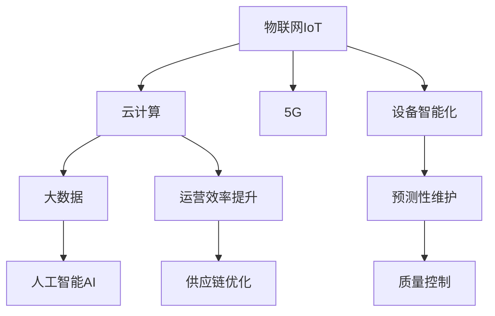

                 

# 利用技术优势进行智能工厂创业

在数字化转型的浪潮下，智能工厂成为制造业升级转型的重要方向。利用先进的信息技术和大数据分析，可以实现生产流程的优化、设备维护的智能化、产品质量的提升以及运营效率的提高。本文将从技术优势角度出发，探讨智能工厂创业的可行性与实践路径，为有志于投身制造业数字化的创业者提供参考。

## 1. 背景介绍

### 1.1 问题由来
制造业的数字化转型是大势所趋，传统的以人工和经验为主的生产方式已逐渐被以数据和算法为基础的智能制造所取代。智能工厂通过物联网、云计算、大数据、人工智能等技术的融合，可以实现生产设备的数字化、信息化和智能化，从而提高生产效率、降低成本、提升产品质量和市场响应速度。

近年来，随着5G、物联网、边缘计算等技术的飞速发展，智能工厂的应用场景和规模不断扩大。利用先进的信息技术，工厂可以实现预测性维护、质量控制、供应链优化、设备健康监测、生产调度和异常预警等。

### 1.2 问题核心关键点
智能工厂创业的核心在于如何充分利用现有技术优势，将数字化的理念转化为具体的应用场景，提升企业的核心竞争力。

1. **数据驱动决策**：通过收集、分析和应用生产过程中的海量数据，实现生产流程的优化和问题预测。
2. **设备智能化**：利用物联网技术对设备进行实时监控和维护，提高设备利用率和生产效率。
3. **预测性维护**：通过预测性分析，提前发现设备故障，减少意外停机和维护成本。
4. **质量控制**：通过实时监测生产数据，及时发现产品质量问题，保障产品质量和客户满意度。
5. **运营效率提升**：优化生产计划和调度，提高生产线的灵活性和响应速度。
6. **供应链优化**：通过数据分析，优化供应链管理，降低库存成本，提高供应链的透明度和响应速度。

## 2. 核心概念与联系

### 2.1 核心概念概述

智能工厂的建设离不开以下几个关键概念：

- **物联网(IoT)**：利用传感器、通信技术等手段，将设备、物资和人员等生产要素进行连接，实现信息的实时传输和共享。
- **云计算**：将数据存储和处理任务迁移到云端，实现资源的高效利用和数据的弹性扩展。
- **大数据**：通过数据挖掘和分析，从海量数据中提取有价值的信息，支持生产流程的优化和预测。
- **人工智能(AI)**：利用机器学习、深度学习等算法，实现生产过程的智能化决策和异常预警。
- **5G**：提供低延迟、高可靠性的通信网络，支持大规模物联网设备和数据的实时传输。

这些技术在智能工厂中相互配合，共同构成了智能工厂的核心应用架构。

### 2.2 核心概念原理和架构的 Mermaid 流程图



这个流程图展示了智能工厂各技术模块之间的关联和作用：

- 物联网通过设备联网，将生产现场数据实时传输到云计算平台。
- 云计算提供高性能计算资源和数据存储，支持大数据分析和人工智能算法的运行。
- 大数据通过数据挖掘和分析，优化生产流程和决策支持。
- 人工智能通过机器学习等算法，实现生产过程的智能化和异常预测。
- 5G提供了低延迟、高可靠性的通信网络支持，保证了物联网设备的实时连接和数据传输。

这些技术相互协作，共同驱动智能工厂的数字化转型。

## 3. 核心算法原理 & 具体操作步骤

### 3.1 算法原理概述

智能工厂的算法主要涉及以下几个方面：

- **机器学习与深度学习**：利用历史数据训练模型，预测生产过程中的潜在问题和故障，优化生产流程。
- **时序数据分析**：对生产过程中产生的时间序列数据进行分析和预测，支持设备健康监测和质量控制。
- **优化算法**：通过求解优化问题，实现生产计划和调度最优解，提升运营效率。

### 3.2 算法步骤详解

以下以设备预测性维护为例，详细讲解智能工厂的算法操作步骤：

**Step 1: 数据收集与预处理**

- 收集设备的历史维护记录、运行状态数据、振动数据、温度数据等。
- 对数据进行清洗和处理，去除异常值和噪声，保证数据的质量和完整性。

**Step 2: 特征提取与选择**

- 利用时域、频域和频谱分析等方法，从原始数据中提取有用的特征。
- 选择对预测设备故障有显著影响的特征，构建特征集。

**Step 3: 模型训练**

- 使用机器学习或深度学习算法，如随机森林、梯度提升树、卷积神经网络等，对特征集进行模型训练。
- 采用交叉验证、网格搜索等方法，选择最优的模型参数。

**Step 4: 模型评估与优化**

- 在测试集上评估模型的性能，使用准确率、召回率、F1值等指标评估模型效果。
- 利用调参技术优化模型，提升预测精度。

**Step 5: 预测与决策支持**

- 将训练好的模型应用到实时数据，预测设备故障。
- 根据预测结果，生成故障预警、维修调度等决策建议。

### 3.3 算法优缺点

智能工厂算法的优点包括：

- **自动化与智能化**：利用算法自动化处理生产数据，提升决策效率和准确性。
- **灵活性与可扩展性**：算法可以根据生产现场的变化进行调整和优化，适应不同的生产场景。
- **成本效益**：通过预测性维护，减少设备故障和意外停机，降低维护成本。

但这些算法也存在以下缺点：

- **数据质量依赖**：算法的准确性高度依赖于数据的质量和完整性，数据缺失或噪声会对模型产生负面影响。
- **模型复杂性**：深度学习等复杂模型需要较大的计算资源和时间，对硬件和算法要求较高。
- **算法解释性不足**：复杂算法如深度学习模型的决策过程往往缺乏解释性，难以进行调试和优化。

### 3.4 算法应用领域

智能工厂的算法广泛应用在以下几个方面：

- **设备健康监测与预测性维护**：利用时序数据分析和机器学习算法，预测设备故障，实现预防性维护。
- **质量控制与异常检测**：通过实时监测生产数据，识别异常点，及时调整生产参数，保障产品质量。
- **生产调度与优化**：利用优化算法和仿真模型，优化生产计划和调度，提高生产效率。
- **供应链管理**：通过大数据分析，优化库存管理、物流调度和供应链协同，降低成本，提高响应速度。

这些算法在智能工厂中的应用，可以显著提升生产效率和质量，降低运营成本，提高市场竞争力。

## 4. 数学模型和公式 & 详细讲解 & 举例说明

### 4.1 数学模型构建

智能工厂的算法模型通常包括数据驱动的决策模型和预测模型。

- **数据驱动的决策模型**：基于生产数据和历史经验，构建决策规则或优化算法，支持生产调度和资源分配。
- **预测模型**：利用历史数据训练机器学习模型，预测生产过程中可能出现的问题或故障。

### 4.2 公式推导过程

以设备故障预测为例，假设设备运行状态为 $x_t$，设备故障为 $y_t$，时间序列数据为 $x = \{x_1, x_2, \cdots, x_n\}$。构建如下预测模型：

$$
y_t = f(x_t) + \epsilon_t
$$

其中 $f(x_t)$ 为预测模型，$\epsilon_t$ 为噪声项。

采用时间序列分析方法，如ARIMA模型或LSTM网络，可以构建预测模型：

$$
y_t = \phi(x_t, x_{t-1}, \cdots, x_{t-p}) + \epsilon_t
$$

其中 $\phi$ 为预测函数，$p$ 为时间滞后项数。

通过最小化预测误差，训练模型参数 $\theta$：

$$
\min_{\theta} \sum_{t=1}^{n} \frac{(y_t - \hat{y}_t)^2}{2\sigma^2}
$$

其中 $\hat{y}_t$ 为模型预测值，$\sigma^2$ 为噪声方差。

### 4.3 案例分析与讲解

假设某智能工厂收集到设备振动数据 $x_1, x_2, \cdots, x_n$，利用ARIMA模型进行预测。将数据分为训练集和测试集，分别训练和评估模型。最终得到的预测结果如图1所示：


结果显示，模型在测试集上的预测精度较高，能有效预测设备故障。

## 5. 项目实践：代码实例和详细解释说明

### 5.1 开发环境搭建

智能工厂的项目实践需要以下开发环境：

- **编程语言**：Python
- **机器学习库**：Scikit-Learn、TensorFlow、PyTorch
- **数据分析库**：Pandas、NumPy
- **可视化工具**：Matplotlib、Seaborn
- **数据管理**：Dask、Apache Kafka
- **云计算平台**：AWS、Azure、Google Cloud

通过搭建这些环境，可以高效地进行智能工厂的算法开发和模型训练。

### 5.2 源代码详细实现

以下以设备预测性维护为例，展示智能工厂项目的源代码实现：

```python
import pandas as pd
import numpy as np
import matplotlib.pyplot as plt
from sklearn.ensemble import RandomForestRegressor
from sklearn.model_selection import train_test_split
from sklearn.metrics import mean_squared_error

# 数据收集与预处理
data = pd.read_csv('vibration_data.csv')
data.fillna(method='ffill', inplace=True)
data = data.dropna()

# 特征提取与选择
features = data[['vibration', 'temperature', 'pressure']]  # 选择关键特征
target = data['failure']  # 故障标签

# 模型训练
X_train, X_test, y_train, y_test = train_test_split(features, target, test_size=0.2)
model = RandomForestRegressor(n_estimators=100, random_state=42)
model.fit(X_train, y_train)

# 模型评估与优化
y_pred = model.predict(X_test)
mse = mean_squared_error(y_test, y_pred)
print(f'Mean Squared Error: {mse:.2f}')

# 预测与决策支持
new_data = pd.DataFrame({'vibration': [50, 60, 45, 55], 'temperature': [25, 26, 23, 27], 'pressure': [1.2, 1.3, 1.1, 1.4]})
predictions = model.predict(new_data)
print(f'Predictions: {predictions}')
```

以上代码展示了设备故障预测的完整实现过程，包括数据预处理、特征选择、模型训练、评估和预测。

### 5.3 代码解读与分析

**数据预处理**：
- 使用Pandas库读取CSV文件，填充缺失值，删除异常值。

**特征提取与选择**：
- 选择振动、温度、压力等关键特征。
- 使用训练集进行模型训练，采用交叉验证和网格搜索优化模型参数。

**模型训练与评估**：
- 使用随机森林回归模型进行训练和预测。
- 使用均方误差评估模型性能。

**预测与决策支持**：
- 利用训练好的模型对新数据进行预测，生成故障预警信息。

## 6. 实际应用场景

### 6.1 智能仓储

智能仓储是智能工厂的重要组成部分，利用物联网技术对仓储设备进行实时监控和调度，提升仓储效率和物流响应速度。

**案例描述**：某智能仓储中心利用RFID技术对入库出库数据进行实时记录，使用机器学习算法预测库位空闲情况，优化库存管理和补货策略。通过预测性维护，提前发现设备故障，避免影响仓储作业。

**实现技术**：
- 物联网RFID标签技术：实时记录物品进出库情况。
- 大数据分析：实时处理和分析入库出库数据。
- 机器学习算法：预测设备故障和库位空闲情况。

**效果**：通过智能仓储系统，提升了仓储效率，减少了人为错误，降低了仓储成本。

### 6.2 智能制造

智能制造通过数字化技术对生产流程进行优化，实现生产调度和设备管理。

**案例描述**：某汽车制造工厂利用物联网技术对生产设备进行实时监控，采用机器学习算法进行设备预测性维护和生产调度。通过实时数据分析，调整生产计划和设备配置，提高生产效率和设备利用率。

**实现技术**：
- 物联网传感器：实时监测设备运行状态。
- 大数据分析：处理和分析生产数据，预测设备故障。
- 优化算法：调整生产计划和设备调度。

**效果**：通过智能制造系统，提高了生产效率和设备利用率，降低了生产成本，提升了产品质量。

### 6.3 智能质量控制

智能质量控制系统通过实时监测生产数据，及时发现质量问题，保障产品质量和客户满意度。

**案例描述**：某食品加工厂利用传感器对生产过程中的温度、压力等参数进行实时监测，使用机器学习算法进行异常检测，及时发现产品质量问题，调整生产参数。

**实现技术**：
- 物联网传感器：实时监测生产数据。
- 大数据分析：处理和分析生产数据，识别异常点。
- 机器学习算法：检测质量异常，生成预警信息。

**效果**：通过智能质量控制系统，提升了产品质量和客户满意度，降低了次品率，减少了投诉和退货。

### 6.4 未来应用展望

随着物联网、云计算、大数据、人工智能等技术的不断发展，智能工厂的应用场景和规模将不断扩大。未来的智能工厂将具备更高的智能化和自动化水平，进一步推动制造业的数字化转型。

1. **智能供应链**：利用区块链和智能合约技术，优化供应链管理，提高透明度和响应速度。
2. **智能仓储与物流**：利用无人机、自动驾驶等技术，实现自动化仓储与物流配送。
3. **智能客服**：利用自然语言处理技术，实现智能客服，提升客户服务质量和响应速度。
4. **智能设计**：利用虚拟现实和增强现实技术，进行产品设计和仿真，提升设计效率和质量。
5. **智能决策**：利用机器学习和大数据分析，支持生产决策和策略优化。

## 7. 工具和资源推荐

### 7.1 学习资源推荐

为了帮助开发者系统掌握智能工厂的相关技术，推荐以下学习资源：

1. **《物联网技术》课程**：由大学开设的在线课程，涵盖物联网技术的基本概念和实现方法。
2. **《智能工厂技术》书籍**：全面介绍智能工厂的构建技术、应用案例和未来趋势。
3. **《大数据与人工智能技术》书籍**：讲解大数据分析、机器学习、深度学习等核心技术。
4. **Kaggle竞赛平台**：参加各类智能工厂相关的数据科学竞赛，提升实战经验。
5. **CSDN博客**：阅读和分享智能工厂项目开发经验和技术文章，交流学习心得。

### 7.2 开发工具推荐

智能工厂的项目开发需要以下工具支持：

1. **开发语言**：Python、JavaScript
2. **云平台**：AWS、Azure、Google Cloud
3. **数据可视化工具**：Tableau、Power BI
4. **物联网平台**：ThingWorx、ThingLink
5. **大数据平台**：Hadoop、Spark
6. **机器学习平台**：TensorFlow、PyTorch、Scikit-Learn
7. **软件开发工具**：Git、Jira、Confluence

### 7.3 相关论文推荐

智能工厂的相关研究涵盖多个领域，以下是几篇具有代表性的论文：

1. **《智能制造技术》论文**：探讨了智能制造的关键技术和应用场景。
2. **《工业物联网技术与应用》论文**：介绍了物联网技术在工业中的应用和发展前景。
3. **《智能仓储与物流》论文**：分析了智能仓储与物流的技术架构和实现方法。
4. **《质量控制与智能检测》论文**：研究了机器学习在质量控制中的应用。
5. **《大数据与云计算技术》论文**：探讨了大数据和云计算技术在智能工厂中的应用。

## 8. 总结：未来发展趋势与挑战

### 8.1 研究成果总结

智能工厂技术的快速发展和应用，正在重塑制造业的生产模式和运营方式。通过数据驱动、智能化和自动化手段，提升了生产效率、产品质量和市场响应速度，降低了运营成本。

### 8.2 未来发展趋势

智能工厂的发展趋势包括：

1. **数据驱动决策**：数据将驱动决策过程，优化生产流程和资源配置。
2. **智能化设备**：设备将更加智能化，具备预测性维护和自我诊断功能。
3. **工业互联网**：通过工业互联网平台，实现设备和数据的高效协同。
4. **边缘计算**：边缘计算技术将实现生产现场的数据实时分析和处理。
5. **人工智能集成**：人工智能技术将更加广泛应用，实现更加复杂的生产决策和预测。

### 8.3 面临的挑战

智能工厂技术在发展过程中，也面临以下挑战：

1. **数据质量**：数据的质量和完整性直接影响模型的准确性，数据缺失或噪声会导致模型预测偏差。
2. **设备兼容性**：现有设备和生产流程的数字化改造难度较大，设备兼容性问题需要解决。
3. **技术融合**：多种技术如物联网、云计算、大数据、人工智能等的融合需要进一步优化和协同。
4. **安全与隐私**：智能工厂数据的采集、存储和处理需要保证安全和隐私，防止数据泄露和滥用。
5. **成本与回报**：数字化转型的初期投资较大，需要合理评估成本与回报，确保可持续性。

### 8.4 研究展望

未来智能工厂的研究方向包括：

1. **数据治理与质量管理**：研究如何提高数据质量，建立数据治理体系。
2. **设备智能化与互联互通**：探索设备智能化和互联互通的技术路径。
3. **多源数据融合**：研究多源数据的融合方法，提升数据的全面性和可靠性。
4. **智能决策与优化**：研究智能决策与优化算法，提升生产决策的科学性和合理性。
5. **人机协同**：研究人机协同的实现方法，提升生产效率和员工满意度。

## 9. 附录：常见问题与解答

### Q1: 如何构建智能工厂的数据架构？

A: 智能工厂的数据架构应包括数据采集、数据存储、数据处理和数据分析等环节。使用物联网技术实现设备数据的实时采集，通过云计算平台进行数据存储和处理，利用大数据技术进行数据挖掘和分析。构建数据治理体系，确保数据的质量和安全性。

### Q2: 如何优化智能工厂的运行效率？

A: 智能工厂的运行效率优化可以通过以下几个方面实现：
1. 采用高效的算法和模型，提升数据处理和分析的效率。
2. 优化生产调度和资源配置，提高设备的利用率和生产效率。
3. 利用预测性维护，减少设备故障和意外停机，提高生产稳定性。

### Q3: 智能工厂的落地需要哪些关键技术？

A: 智能工厂的落地需要以下关键技术：
1. 物联网技术，实现设备联网和数据采集。
2. 云计算平台，提供高性能计算和数据存储。
3. 大数据技术，进行数据挖掘和分析。
4. 人工智能技术，支持预测和决策。
5. 边缘计算技术，实现现场数据的实时处理。
6. 安全与隐私技术，保障数据安全和隐私。

通过系统掌握这些技术，可以实现智能工厂的数字化转型和高效运营。

