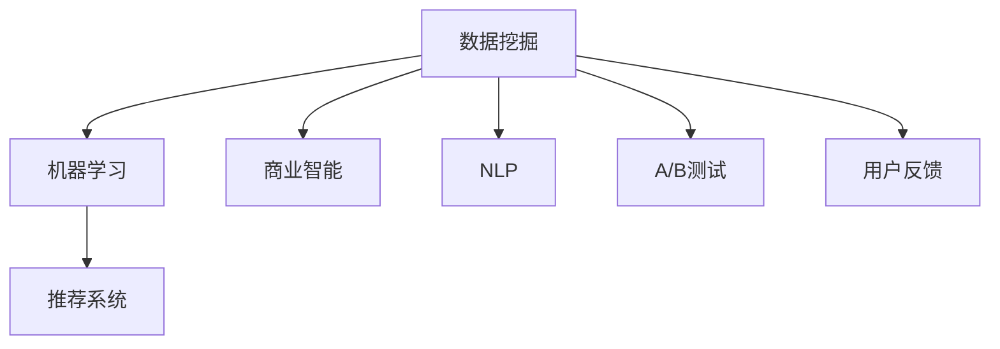

                 

# 利用技术洞察力进行创业机会评估

## 1. 背景介绍

### 1.1 问题由来
在瞬息万变的商业环境中，如何从众多创业项目中甄别出具有潜力的机会，是每个创业者都需面对的重大挑战。传统的方法依赖商业洞察、市场调研等，但随着技术的飞速发展，利用技术洞察力进行创业机会评估已成为一种趋势。

### 1.2 问题核心关键点
技术洞察力指的是通过技术手段获取、分析数据，揭示商业机会的能力。其核心在于：

1. 利用数据挖掘、机器学习等技术手段，从海量数据中提取有价值的信息。
2. 基于数据分析结果，结合商业背景，形成合理的商业决策。
3. 通过持续的数据迭代，不断优化商业模型，提高预测精度。

## 2. 核心概念与联系

### 2.1 核心概念概述

为更好地理解技术洞察力在创业机会评估中的应用，本节将介绍几个关键概念：

- **数据挖掘(Data Mining)**：通过算法模型在大量数据中提取有价值的信息和知识，辅助决策过程。
- **机器学习(Machine Learning)**：通过数据训练模型，让计算机自动学习规律，进行预测和分类。
- **商业智能(Business Intelligence, BI)**：利用数据和算法支持商业决策，提升企业效率和竞争力。
- **自然语言处理(Natural Language Processing, NLP)**：让计算机理解和处理人类语言，分析用户反馈和市场趋势。
- **推荐系统(Recommendation Systems)**：利用用户行为数据，推荐个性化产品或服务，提升用户体验。
- **A/B测试(A/B Testing)**：通过对比不同版本的产品，科学评估其效果，优化用户体验。
- **用户反馈(User Feedback)**：用户在使用产品后给出的评价和建议，指导产品改进。

这些概念之间的逻辑关系可以通过以下Mermaid流程图来展示：



这个流程图展示了技术洞察力在创业机会评估中的应用过程：

1. 通过数据挖掘和机器学习，获取商业洞察。
2. 将商业洞察转化为商业智能，辅助决策。
3. 利用NLP和用户反馈，进一步完善洞察。
4. 通过A/B测试和推荐系统，优化用户体验，提升效果。

## 3. 核心算法原理 & 具体操作步骤
### 3.1 算法原理概述

利用技术洞察力进行创业机会评估，本质上是将大数据技术和商业分析相结合，通过数据挖掘和机器学习手段，从海量数据中提取有价值的信息，并转化为商业决策的过程。

假设我们有 $D$ 个样本，每个样本包含 $n$ 个特征 $x_i = (x_{i1}, x_{i2}, ..., x_{in})$ 和 $y$ 个标签 $y_i \in \{0, 1\}$。其中 $x_i$ 为模型的输入特征，$y_i$ 为模型的预测标签。我们的目标是找到最优模型参数 $\theta$，使得模型预测的准确率最高。形式化地，问题可以表示为：

$$
\theta^* = \mathop{\arg\min}_{\theta} \frac{1}{N} \sum_{i=1}^N L(y_i, M_{\theta}(x_i))
$$

其中 $L$ 为损失函数，$M_{\theta}$ 为模型函数，$N$ 为样本数量。

### 3.2 算法步骤详解

利用技术洞察力进行创业机会评估，一般包括以下关键步骤：

**Step 1: 数据收集**
- 收集与创业机会相关的各类数据，如市场调研数据、用户行为数据、技术趋势数据等。确保数据的多样性和覆盖面。

**Step 2: 数据预处理**
- 对收集到的数据进行清洗、归一化、处理缺失值等预处理工作，确保数据质量和可用性。

**Step 3: 特征工程**
- 根据问题需求，提取和选择最优的特征。使用数据挖掘和机器学习技术，从原始数据中提取高阶特征和特征组合。

**Step 4: 模型训练**
- 选择合适的模型，如线性回归、决策树、随机森林、神经网络等，使用训练集对模型进行训练。
- 调整模型超参数，如学习率、正则化强度等，以获得最佳模型表现。

**Step 5: 模型评估**
- 在测试集上评估模型性能，常用的评估指标包括准确率、召回率、F1分数等。
- 分析模型结果，发现模型不足和优化方向。

**Step 6: 结果应用**
- 将模型应用到实际创业机会评估中，根据模型预测结果，筛选有潜力的项目。
- 结合商业洞察，进行更全面的市场分析。

**Step 7: 持续优化**
- 持续收集新数据，进行模型更新和迭代。定期重新训练模型，保持其性能。

### 3.3 算法优缺点

利用技术洞察力进行创业机会评估具有以下优点：

1. 数据驱动。通过对大量数据的分析和挖掘，可以发现潜在的市场机会，减少决策的主观性。
2. 客观精准。数据和模型可以提供更加客观的评估标准，减少人为偏见和误判。
3. 可量化可操作。通过数据分析，可以量化评估结果，便于比较和决策。
4. 可重复性。模型可以持续优化和迭代，确保评估结果的稳定性和准确性。

同时，该方法也存在一定的局限性：

1. 数据质量依赖。数据的准确性和全面性直接影响评估结果，需投入大量时间和资源进行数据收集和清洗。
2. 模型复杂性。不同类型问题需选择不同模型，模型的选择和调整有一定复杂性。
3. 结果解释性。黑盒模型难以解释其内部决策过程，难以进行深入分析。
4. 数据隐私问题。涉及用户隐私数据的收集和使用，需确保数据安全和合规性。

尽管存在这些局限性，但技术洞察力在创业机会评估中的应用前景广阔，仍是大势所趋。未来相关研究需重点关注数据获取、模型选择、结果解释等环节的优化。

### 3.4 算法应用领域

利用技术洞察力进行创业机会评估，广泛应用于各类创业项目和行业领域：

- **金融科技**：通过分析市场趋势、用户行为等数据，识别金融科技创业机会，辅助决策。
- **电子商务**：利用用户交易数据和行为分析，发现电商市场潜在机会，进行精准营销。
- **医疗健康**：通过患者反馈和医疗数据，分析健康管理、医疗设备等领域的创业机会。
- **教育培训**：利用学习行为和反馈数据，发现在线教育和培训领域的创业机会，优化课程设计。
- **可持续发展**：利用环境和社会数据，发现环保和可持续发展领域的创业机会，推动绿色经济。
- **智慧城市**：通过城市管理数据，发现智慧城市建设中的创业机会，提升城市治理能力。

此外，在文化娱乐、能源管理、智能制造等众多领域，技术洞察力也展现出巨大潜力，为各类创业项目提供数据支持和决策依据。

## 4. 数学模型和公式 & 详细讲解 & 举例说明
### 4.1 数学模型构建

利用技术洞察力进行创业机会评估，本质上是一个有监督学习问题。假设我们的目标是预测某创业项目是否成功，即预测标签 $y$ 为成功或失败。形式化地，问题可以表示为：

$$
y_i \sim \text{Bernoulli}(p)
$$

其中 $y_i$ 为样本 $i$ 的标签，$p$ 为成功的概率。我们的目标是最大化模型预测成功的概率 $P(y_i=1|x_i; \theta)$。

### 4.2 公式推导过程

为了最大化预测成功的概率，我们构建对数几率损失函数（Logistic Loss）：

$$
L(y_i, p) = -y_i \log p_i - (1-y_i)\log(1-p_i)
$$

其中 $p_i$ 为模型对样本 $i$ 成功的预测概率。

利用梯度下降算法，最小化损失函数：

$$
\nabla_{p_i} L(y_i, p_i) = \nabla_{p_i} (-y_i \log p_i - (1-y_i)\log(1-p_i)) = -y_i / p_i + (1-y_i) / (1-p_i)
$$

对所有样本求梯度并求解：

$$
p_i = \frac{\exp(y_i)}{\exp(y_i) + \exp(-y_i)} = \frac{1}{1+\exp(-y_i)}
$$

上述公式展示了如何使用梯度下降算法优化模型预测概率 $p_i$，从而提升创业机会评估的准确率。

### 4.3 案例分析与讲解

假设我们收集到100个创业项目的样本数据，其中50个成功，50个失败。通过对样本数据进行特征工程，提取了5个关键特征 $x_i = (x_{i1}, x_{i2}, ..., x_{i5})$。使用逻辑回归模型对这些数据进行训练，得到模型参数 $\theta$。

在测试集上，模型预测成功的准确率为85%。这意味着，如果模型参数为 $\theta$，那么一个新项目的预测成功的概率 $p_i$ 可以通过公式 $p_i = \frac{1}{1+\exp(-y_i)}$ 计算得出。

## 5. 项目实践：代码实例和详细解释说明
### 5.1 开发环境搭建

在进行创业机会评估的实践前，我们需要准备好开发环境。以下是使用Python进行Scikit-learn开发的Python环境配置流程：

1. 安装Anaconda：从官网下载并安装Anaconda，用于创建独立的Python环境。

2. 创建并激活虚拟环境：
```bash
conda create -n scikit-learn-env python=3.8 
conda activate scikit-learn-env
```

3. 安装Scikit-learn：
```bash
pip install scikit-learn
```

4. 安装其他必要工具包：
```bash
pip install numpy pandas matplotlib scikit-learn joblib
```

完成上述步骤后，即可在`scikit-learn-env`环境中开始实践。

### 5.2 源代码详细实现

下面我们以逻辑回归模型为例，给出使用Scikit-learn进行创业机会评估的Python代码实现。

首先，导入必要的库和模块：

```python
from sklearn.model_selection import train_test_split
from sklearn.linear_model import LogisticRegression
from sklearn.metrics import accuracy_score
```

然后，定义数据预处理函数：

```python
import pandas as pd
from sklearn.preprocessing import StandardScaler

def preprocess_data(df):
    # 将标签转化为0-1格式
    df['label'] = df['label'].apply(lambda x: 1 if x == 'success' else 0)
    
    # 选择特征和标签
    X = df.drop('label', axis=1)
    y = df['label']
    
    # 数据标准化
    scaler = StandardScaler()
    X = scaler.fit_transform(X)
    
    return X, y
```

接着，定义模型训练和评估函数：

```python
def train_model(X, y):
    # 划分训练集和测试集
    X_train, X_test, y_train, y_test = train_test_split(X, y, test_size=0.2, random_state=42)
    
    # 创建模型并训练
    model = LogisticRegression()
    model.fit(X_train, y_train)
    
    # 评估模型
    y_pred = model.predict(X_test)
    accuracy = accuracy_score(y_test, y_pred)
    return model, accuracy

def evaluate_model(model, X_test, y_test):
    # 评估模型
    y_pred = model.predict(X_test)
    accuracy = accuracy_score(y_test, y_pred)
    return accuracy
```

最后，启动模型训练和评估流程：

```python
# 加载数据
df = pd.read_csv('创业项目数据.csv')

# 数据预处理
X, y = preprocess_data(df)

# 模型训练和评估
model, accuracy = train_model(X, y)
print(f"模型训练完成，准确率为 {accuracy:.3f}")

# 测试集评估
test_X = pd.read_csv('测试数据.csv')
test_X = preprocess_data(test_X)[0]
test_y = pd.read_csv('测试数据.csv')['label'].apply(lambda x: 1 if x == 'success' else 0)
test_accuracy = evaluate_model(model, test_X, test_y)
print(f"测试集准确率为 {test_accuracy:.3f}")
```

以上就是使用Scikit-learn进行逻辑回归模型训练和评估的完整代码实现。可以看到，Scikit-learn提供了丰富的机器学习算法和评估工具，开发者只需进行简单的数据处理和模型调用，即可快速实现创业机会评估的功能。

### 5.3 代码解读与分析

让我们再详细解读一下关键代码的实现细节：

**preprocess_data函数**：
- 将标签转化为0-1格式，方便模型训练。
- 选择特征和标签，并进行数据标准化。

**train_model函数**：
- 使用train_test_split将数据划分为训练集和测试集。
- 创建逻辑回归模型，并在训练集上进行拟合。
- 返回模型和测试集准确率。

**evaluate_model函数**：
- 在测试集上评估模型的准确率。

**训练流程**：
- 加载数据。
- 预处理数据，进行特征选择和标准化。
- 训练逻辑回归模型。
- 输出模型训练准确率。
- 使用测试集评估模型，输出测试准确率。

可以看到，Scikit-learn的机器学习算法和评估工具大大简化了创业机会评估的代码实现，使得开发者能够快速搭建并评估模型。

当然，在工业级的系统实现中，还需要考虑更多因素，如模型的超参数调优、模型的版本管理、系统的持续监控等。但核心的创业机会评估范式基本与此类似。

## 6. 实际应用场景
### 6.1 智能投顾系统

智能投顾系统利用技术洞察力，结合大数据和机器学习技术，为投资者提供基于市场趋势和用户行为的数据驱动投资建议。通过分析历史交易数据、市场新闻、用户操作行为等数据，智能投顾系统能够预测未来市场走势，推荐最优投资策略，帮助投资者优化投资组合，提高收益率。

### 6.2 推荐系统

电商平台利用技术洞察力，通过用户行为数据和商品属性数据，构建推荐模型，向用户推荐个性化商品。通过分析用户的浏览、购买、收藏等行为，推荐系统能够识别用户偏好，预测用户可能感兴趣的商品，提升用户体验和销售额。

### 6.3 精准医疗

精准医疗领域利用技术洞察力，结合患者基因数据、病历数据和医学知识，构建疾病预测模型，辅助医生制定个性化的治疗方案。通过分析大量的患者数据，精准医疗能够预测疾病风险，推荐最佳治疗方案，提高治疗效果和医疗效率。

### 6.4 智能客服

智能客服系统利用技术洞察力，结合用户历史互动数据和市场反馈，构建客户关系模型，提高客户满意度和留存率。通过分析用户的对话历史和反馈，智能客服能够识别用户情绪，推荐个性化的服务，提升客户体验。

## 7. 工具和资源推荐
### 7.1 学习资源推荐

为了帮助开发者系统掌握技术洞察力在创业机会评估中的应用，这里推荐一些优质的学习资源：

1. 《机器学习实战》系列博文：由大模型技术专家撰写，深入浅出地介绍了机器学习的基本概念和实现方法。

2. 《Python数据科学手册》书籍：介绍Python在数据科学中的应用，包括数据处理、机器学习等环节。

3. 《数据科学导论》课程：哈佛大学开设的在线课程，涵盖数据挖掘、机器学习、商业智能等知识，适合初学者学习。

4. Kaggle平台：提供海量数据集和竞赛，让你在实际项目中应用所学知识，积累实战经验。

5. Coursera和edX平台：提供丰富的机器学习和商业智能课程，涵盖理论和实践两个层面。

通过对这些资源的学习实践，相信你一定能够快速掌握技术洞察力在创业机会评估中的应用技巧，并用于解决实际的商业问题。

### 7.2 开发工具推荐

高效的开发离不开优秀的工具支持。以下是几款用于技术洞察力分析开发的常用工具：

1. Python：开源的编程语言，拥有丰富的机器学习库和数据处理工具，适合进行数据分析和机器学习建模。

2. R语言：专门用于数据分析和统计的编程语言，拥有强大的统计分析和可视化功能。

3. Scikit-learn：基于Python的机器学习库，提供了丰富的算法和评估工具，适合进行数据挖掘和机器学习建模。

4. TensorFlow和PyTorch：两大深度学习框架，支持大规模数据处理和复杂模型训练。

5. Apache Spark：大数据处理平台，支持分布式计算，适合进行大规模数据挖掘和分析。

6. Apache Hadoop：分布式文件系统，支持大规模数据存储和处理。

合理利用这些工具，可以显著提升技术洞察力分析的开发效率，加快创新迭代的步伐。

### 7.3 相关论文推荐

技术洞察力在创业机会评估中的应用源于学界的持续研究。以下是几篇奠基性的相关论文，推荐阅读：

1. 《Data Mining for Business Intelligence》论文：介绍数据挖掘技术在商业智能中的应用，为技术洞察力的应用提供理论基础。

2. 《Machine Learning in Finance》书籍：介绍机器学习在金融领域的应用，包括信用评估、投资组合优化等。

3. 《Recommender Systems Handbook》书籍：介绍推荐系统的工作原理和实现方法，涵盖协同过滤、内容推荐等技术。

4. 《Crowdsourcing for Big Data: A Survey》论文：探讨大数据环境下众包数据分析的方法，为数据挖掘提供新的思路。

这些论文代表了大规模数据分析和机器学习的应用范式，通过学习这些前沿成果，可以帮助研究者把握学科前进方向，激发更多的创新灵感。

## 8. 总结：未来发展趋势与挑战
### 8.1 总结

本文对利用技术洞察力进行创业机会评估的方法进行了全面系统的介绍。首先阐述了技术洞察力在商业决策中的重要作用，明确了数据驱动决策的核心思想。其次，从原理到实践，详细讲解了技术洞察力在创业机会评估中的数学模型和关键步骤，给出了技术洞察力分析任务开发的完整代码实例。同时，本文还广泛探讨了技术洞察力在智能投顾、推荐系统、精准医疗等多个行业领域的应用前景，展示了技术洞察力的巨大潜力。此外，本文精选了技术洞察力相关的学习资源，力求为读者提供全方位的技术指引。

通过本文的系统梳理，可以看到，利用技术洞察力进行创业机会评估的方法正在成为商业决策的重要工具，极大地提升决策的科学性和准确性。未来，伴随大数据技术和机器学习方法的不断进步，技术洞察力必将在更广阔的应用领域大放异彩，深刻影响商业决策和市场竞争。

### 8.2 未来发展趋势

展望未来，技术洞察力在创业机会评估中将呈现以下几个发展趋势：

1. 数据规模持续增大。随着物联网、大数据技术的发展，数据量将持续增长。利用技术洞察力，可以从海量数据中提取有价值的信息，支持更加精准的决策。

2. 机器学习算法日益丰富。随着深度学习、强化学习等算法的发展，模型性能将不断提升，能够更好地适应复杂和动态的市场环境。

3. 多模态数据融合。技术洞察力将更加关注跨领域数据融合，综合利用文本、图像、语音等多种数据类型，提升决策的全面性和精准性。

4. 实时性需求提高。市场变化快速，技术洞察力需要实时获取和分析数据，及时调整决策策略。

5. 自动化水平提升。通过自动化机器学习技术，减少人工干预，提升分析效率和决策速度。

6. 可解释性增强。技术洞察力分析需逐步增强模型的可解释性，帮助用户理解模型的决策过程和结果，提升信任度。

以上趋势凸显了技术洞察力在创业机会评估中的广阔前景。这些方向的探索发展，必将进一步提升商业决策的科学性和有效性，为商业决策提供强大的数据支撑。

### 8.3 面临的挑战

尽管技术洞察力在创业机会评估中的应用前景广阔，但在迈向更加智能化、普适化应用的过程中，它仍面临诸多挑战：

1. 数据质量和多样性问题。数据的不准确和缺失，可能导致模型预测的偏差。不同类型的数据源和数据格式，增加了数据整合的难度。

2. 算法复杂性和可解释性。复杂模型难以解释其内部决策过程，难以进行深入分析。需要进一步提升算法的可解释性，增强用户信任。

3. 数据隐私和安全问题。涉及用户隐私数据的收集和使用，需确保数据安全和合规性。

4. 计算资源和算力成本。大规模数据处理和复杂模型训练，需要大量计算资源和算力支持，成本较高。

5. 数据迭代和模型更新。市场变化快速，模型需持续更新以保持其有效性。

6. 模型鲁棒性不足。模型面对复杂和动态的市场环境，容易发生泛化能力不足的问题。

7. 业务和技术的衔接。技术洞察力需与业务需求紧密结合，才能发挥最大价值。

面对技术洞察力面临的这些挑战，未来的研究需要在数据质量、算法复杂性、数据隐私、计算资源、模型更新等方面寻求新的突破。只有综合考虑技术、业务、数据等多方面因素，才能确保技术洞察力在创业机会评估中的持续发展和优化。

### 8.4 研究展望

未来，技术洞察力在创业机会评估中还需关注以下几个研究方向：

1. 探索更加高效的算法。开发更加高效和灵活的算法，处理大规模数据，适应复杂市场环境。

2. 引入更多先验知识。将符号化的先验知识，如知识图谱、逻辑规则等，与神经网络模型进行融合，增强模型的知识整合能力。

3. 提高模型的可解释性。通过可解释性技术，如LIME、SHAP等，提升模型的解释能力，增强用户信任。

4. 融合多模态数据。利用多模态数据融合技术，综合利用文本、图像、语音等多种数据类型，提升决策的全面性和精准性。

5. 增强模型的实时性。利用流式数据处理技术，实现实时数据获取和分析，提升决策的时效性。

6. 开发自动化机器学习平台。通过自动化机器学习技术，减少人工干预，提升分析效率和决策速度。

通过这些研究方向的探索，相信技术洞察力在创业机会评估中的应用将不断深化，为商业决策提供更加精准和可靠的数据支撑。技术洞察力必将在商业决策中发挥更大的作用，推动商业决策的科学化和智能化。

## 9. 附录：常见问题与解答
### Q1：如何构建一个高效的数据挖掘系统？

A: 构建高效的数据挖掘系统需要考虑以下几个方面：
1. 数据预处理：清洗数据，去除噪声，处理缺失值。
2. 特征工程：选择和提取最相关的特征。
3. 算法选择：根据问题特点选择合适的算法。
4. 模型评估：使用交叉验证等方法评估模型性能。
5. 参数调优：使用网格搜索、随机搜索等方法调优模型参数。

通过以上步骤，可以构建一个高效、稳定的数据挖掘系统，支持商业决策。

### Q2：如何评估模型的性能？

A: 评估模型性能通常需要以下步骤：
1. 划分训练集和测试集。
2. 训练模型，使用训练集数据。
3. 在测试集上评估模型性能，常用的指标包括准确率、召回率、F1分数等。
4. 分析模型结果，发现模型不足和优化方向。

通过以上步骤，可以全面评估模型的性能，发现其优劣，指导后续优化。

### Q3：如何在数据挖掘中避免过拟合？

A: 避免过拟合需要以下几种方法：
1. 数据集划分：划分训练集和测试集，避免模型在训练集上过拟合。
2. 正则化：使用L1、L2正则化等方法，限制模型复杂度。
3. 交叉验证：使用交叉验证等方法，避免模型在特定数据集上过拟合。
4. 特征选择：选择和提取最相关的特征，减少模型复杂度。
5. 模型集成：使用模型集成技术，提升模型的泛化能力。

通过以上方法，可以在数据挖掘中有效避免过拟合，提升模型性能。

### Q4：如何提高数据挖掘的实时性？

A: 提高数据挖掘的实时性需要以下几种方法：
1. 流式数据处理：使用流式数据处理技术，实时获取和分析数据。
2. 分布式计算：使用分布式计算技术，加速数据处理过程。
3. 模型压缩：使用模型压缩技术，减小模型大小，提高推理速度。
4. 缓存技术：使用缓存技术，提升数据访问速度。

通过以上方法，可以显著提高数据挖掘的实时性，满足实时决策的需求。

### Q5：如何保证数据挖掘的隐私安全？

A: 保证数据挖掘的隐私安全需要以下几种方法：
1. 数据脱敏：对数据进行脱敏处理，保护用户隐私。
2. 访问控制：对数据访问进行严格控制，限制数据访问权限。
3. 数据加密：对数据进行加密处理，防止数据泄露。
4. 合规性检查：确保数据挖掘过程符合相关法律法规。

通过以上方法，可以保障数据挖掘的隐私安全，确保用户数据安全。

通过以上问题的解答，相信你对技术洞察力在创业机会评估中的应用有了更深入的理解。在未来商业决策中，利用技术洞察力进行数据驱动决策，将极大地提升决策的科学性和准确性，助力企业在激烈的市场竞争中脱颖而出。

---

作者：禅与计算机程序设计艺术 / Zen and the Art of Computer Programming

