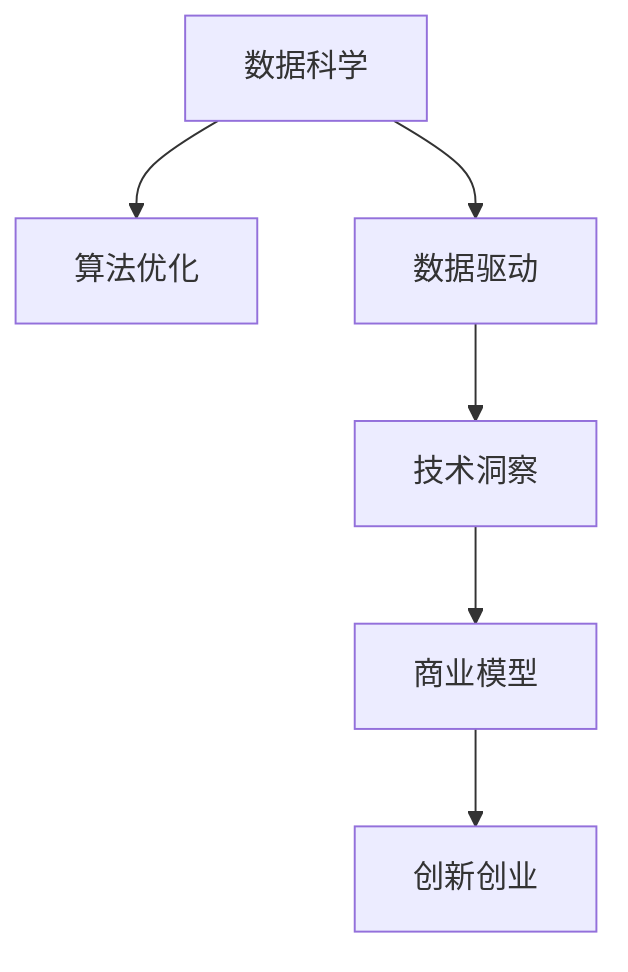

                 

# 利用技术洞察进行创新创业

> 关键词：技术洞察, 创新创业, 数据驱动, 算法优化, 商业模型, 数据科学, 人工智能

## 1. 背景介绍

### 1.1 问题由来
在数字化转型的大潮中，越来越多的企业开始寻求技术洞察来推动创新创业。大数据、人工智能等技术的高速发展，为企业的战略规划、产品创新、市场运营提供了前所未有的机会。但如何有效地利用这些技术，从海量数据中提取出有价值的洞察，并将其转化为实际商业价值，却是一个极大的挑战。

### 1.2 问题核心关键点
技术洞察的本质是从数据中提取有价值的洞见和知识，通过数据驱动的方式来指导企业的创新创业。它涉及到数据收集、数据清洗、数据分析、模型训练等多个环节，最终形成可以指导业务决策的洞察。

在这个过程中，关键在于：
- 数据的获取和预处理，确保数据的质量和完整性。
- 选择和构建合适的分析模型，使模型能够捕捉数据中的关键特征。
- 对分析结果进行解释和验证，确保洞察的可靠性和实用性。
- 将洞察转化为商业策略和实际行动，实现技术的商业价值转化。

### 1.3 问题研究意义
利用技术洞察进行创新创业，对企业的转型升级具有重要意义：

1. 驱动业务创新：洞察可以揭示市场趋势、用户需求、竞争对手动态，帮助企业发现新的增长点。
2. 优化决策过程：数据驱动的决策更加客观和科学，减少主观偏差，提高决策效率。
3. 提升运营效率：通过技术洞察优化运营流程、产品设计、供应链管理，降低成本，提高效率。
4. 增强竞争优势：利用先进的数据分析和AI技术，构建差异化竞争优势。
5. 促进数据驱动文化：培养企业内部数据驱动的思维方式和行为模式，提升整体的数据素养。

## 2. 核心概念与联系

### 2.1 核心概念概述

为了更好地理解技术洞察对创新创业的影响，本节将介绍几个关键概念：

- **技术洞察**：利用数据科学和人工智能技术，从复杂的数据中提取有价值的洞见和知识，以指导企业的创新创业。
- **数据科学**：通过数据收集、处理、分析和建模，发现隐藏在数据中的规律和趋势，以支持决策制定。
- **人工智能**：利用算法和模型，模拟人类智能过程，实现自主学习、自主决策，提升数据驱动的能力。
- **算法优化**：通过不断改进和调整算法，提升模型性能，满足实际应用需求。
- **商业模型**：基于数据洞察和算法模型，构建可行的商业策略和行动方案。
- **数据驱动**：基于数据和模型结果进行业务决策，而非仅依赖经验和直觉。
- **创新创业**：利用技术洞察和数据驱动，不断探索新的商业机会和增长点，实现企业转型升级。

这些核心概念之间的联系紧密，共同构成了利用技术洞察进行创新创业的理论框架。

### 2.2 核心概念原理和架构的 Mermaid 流程图(Mermaid 流程节点中不要有括号、逗号等特殊字符)


这个流程图展示了核心概念之间的逻辑关系：

1. **数据科学**：是技术洞察的起点，通过对数据的收集和处理，为后续分析奠定基础。
2. **算法优化**：对数据科学的结果进行进一步的建模和优化，提升分析的准确性和实用性。
3. **数据驱动**：通过算法模型得到的洞察，指导企业的创新创业活动，实现数据驱动的决策。
4. **技术洞察**：将数据驱动的决策转化为具体的洞察和知识，为企业提供战略指导。
5. **商业模型**：基于技术洞察，构建可行的商业模式，实现商业价值的转化。
6. **创新创业**：最终将商业模型落地实施，推动企业的创新和增长。

## 3. 核心算法原理 & 具体操作步骤

### 3.1 算法原理概述
技术洞察的实现依赖于数据科学和人工智能算法。其核心原理可以概括为：

1. **数据采集**：从各种来源收集数据，确保数据的多样性和全面性。
2. **数据预处理**：对数据进行清洗、转换和归一化，提升数据的可用性。
3. **特征工程**：从数据中提取关键特征，构建特征向量，提升模型的表达能力。
4. **模型训练**：选择和训练合适的机器学习模型，捕捉数据中的关键模式和关系。
5. **模型评估**：通过交叉验证和测试集评估模型性能，确保模型的泛化能力。
6. **洞察提取**：从训练好的模型中提取有价值的洞察和知识，支持业务决策。

### 3.2 算法步骤详解

技术洞察的实现步骤包括：

**Step 1: 数据采集**
- 确定数据来源：包括内部系统数据、外部市场数据、社交媒体数据等。
- 选择合适的数据格式：结构化数据、非结构化数据、文本数据、图像数据等。
- 确定数据量：根据业务需求，确定需要采集的数据量和采集频率。

**Step 2: 数据预处理**
- 数据清洗：去除重复数据、处理缺失值、修正错误数据。
- 数据转换：将不同格式的数据转换为统一的格式，如将字符串转换为数字、时间戳等。
- 数据归一化：将数据标准化到0-1之间，确保数据的一致性和可比性。

**Step 3: 特征工程**
- 特征提取：从数据中提取关键特征，如文本中的关键词、用户的浏览历史、社交网络中的交互行为等。
- 特征选择：选择与业务目标相关的特征，去除无关或冗余特征。
- 特征构建：通过组合、转换、合成等方式，生成新的特征，增强模型的表达能力。

**Step 4: 模型训练**
- 选择合适的算法：根据问题类型选择适合的算法，如分类、回归、聚类、关联规则等。
- 划分训练集和测试集：将数据分为训练集和测试集，确保模型在未知数据上的表现。
- 模型训练：使用训练集训练模型，通过不断迭代调整模型参数。

**Step 5: 模型评估**
- 交叉验证：使用交叉验证技术，评估模型的泛化能力和稳定性。
- 性能指标：选择合适的性能指标，如准确率、召回率、F1分数、ROC曲线等，评估模型性能。
- 模型调优：根据评估结果，调整模型参数和超参数，提升模型性能。

**Step 6: 洞察提取**
- 结果解释：对模型结果进行解释，识别关键特征和模式，理解模型的决策逻辑。
- 洞察验证：通过对比实际数据，验证模型结果的可靠性和实用性。
- 洞察应用：将洞察转化为具体的商业策略和行动方案，推动创新创业。

### 3.3 算法优缺点
技术洞察具有以下优点：

- **数据驱动**：基于实际数据和模型结果进行决策，减少主观偏见，提高决策的科学性和客观性。
- **高效性**：自动化处理大量数据，节省人力成本，提高效率。
- **灵活性**：通过特征工程和算法优化，可以灵活适应不同的业务场景和需求。

但其也存在一些缺点：

- **数据质量依赖**：洞察的准确性依赖于数据的质量和完整性，数据偏差可能导致洞察偏差。
- **算法复杂性**：复杂的算法模型可能过于复杂，难以解释和理解。
- **资源消耗**：数据收集、清洗、处理、建模等步骤需要大量的计算资源和时间成本。

### 3.4 算法应用领域
技术洞察可以应用于多个领域，包括但不限于：

- **市场分析**：通过分析市场数据，识别市场趋势、客户需求和竞争态势，指导市场营销策略。
- **客户洞察**：通过分析客户数据，理解客户行为和偏好，提升客户体验和忠诚度。
- **运营优化**：通过分析运营数据，识别流程瓶颈和优化机会，提高运营效率。
- **产品创新**：通过分析用户反馈和市场数据，识别产品改进和创新的机会，提升产品质量和竞争力。
- **风险管理**：通过分析风险数据，识别潜在风险和威胁，制定风险应对策略。
- **供应链优化**：通过分析供应链数据，优化供应链流程，降低成本，提高效率。

## 4. 数学模型和公式 & 详细讲解 & 举例说明

### 4.1 数学模型构建
技术洞察的实现通常依赖于统计学和机器学习的数学模型。以下是一个简单的分类问题数学模型：

设训练集为 $D=\{(x_i,y_i)\}_{i=1}^N$，其中 $x_i \in \mathcal{X}$，$y_i \in \{0,1\}$。假设模型为 $M_{\theta}:\mathcal{X} \rightarrow \{0,1\}$，其中 $\theta$ 为模型参数。分类问题可以表示为：

$$
\min_{\theta} \frac{1}{N}\sum_{i=1}^N \ell(y_i,M_{\theta}(x_i))
$$

其中 $\ell$ 为损失函数，如交叉熵损失函数：

$$
\ell(y_i,M_{\theta}(x_i)) = -y_i\log M_{\theta}(x_i) - (1-y_i)\log(1-M_{\theta}(x_i))
$$

### 4.2 公式推导过程

以逻辑回归模型为例，展示模型训练和优化过程：

逻辑回归模型通常采用梯度下降法进行训练。模型参数 $\theta$ 的更新公式为：

$$
\theta \leftarrow \theta - \eta \nabla_{\theta}\mathcal{L}(\theta)
$$

其中 $\eta$ 为学习率，$\nabla_{\theta}\mathcal{L}(\theta)$ 为损失函数对参数 $\theta$ 的梯度。

对于二分类问题，逻辑回归模型的损失函数为交叉熵损失函数：

$$
\mathcal{L}(\theta) = -\frac{1}{N}\sum_{i=1}^N [y_i\log M_{\theta}(x_i)+(1-y_i)\log(1-M_{\theta}(x_i))]
$$

其中 $M_{\theta}(x_i)=\frac{1}{1+\exp(-\theta^T\phi(x_i))}$ 为逻辑回归模型的预测函数，$\phi(x_i)$ 为特征映射函数。

通过梯度下降法不断迭代更新模型参数，直到损失函数收敛，即可得到最优的模型参数 $\theta^*$。

### 4.3 案例分析与讲解

假设某电商企业希望通过技术洞察提升其客户留存率。该企业收集了过去一年的客户数据，包括购买行为、浏览历史、反馈评价等。通过对这些数据进行预处理和特征工程，构建了客户流失预测模型。

模型训练阶段，使用了随机梯度下降法，选择了逻辑回归模型作为分类器。在模型训练过程中，通过对交叉验证集的评估，发现模型的准确率为85%。

模型评估阶段，对训练好的模型进行了验证和测试，结果表明模型在新数据上的表现良好，准确率为87%。

最终，该企业根据模型的预测结果，对客户进行了分类，对高流失风险的客户采取了针对性的挽留措施，显著提升了客户留存率。

## 5. 项目实践：代码实例和详细解释说明

### 5.1 开发环境搭建

在进行技术洞察实践前，我们需要准备好开发环境。以下是使用Python进行PyTorch开发的环境配置流程：

1. 安装Anaconda：从官网下载并安装Anaconda，用于创建独立的Python环境。

2. 创建并激活虚拟环境：
```bash
conda create -n pytorch-env python=3.8 
conda activate pytorch-env
```

3. 安装PyTorch：根据CUDA版本，从官网获取对应的安装命令。例如：
```bash
conda install pytorch torchvision torchaudio cudatoolkit=11.1 -c pytorch -c conda-forge
```

4. 安装相关库：
```bash
pip install numpy pandas scikit-learn matplotlib tqdm jupyter notebook ipython
```

完成上述步骤后，即可在`pytorch-env`环境中开始技术洞察实践。

### 5.2 源代码详细实现

下面我们以客户流失预测为例，给出使用Transformers库进行技术洞察的PyTorch代码实现。

首先，定义模型和数据处理函数：

```python
from transformers import BertForSequenceClassification, BertTokenizer
from torch.utils.data import Dataset, DataLoader
import torch
import numpy as np
import pandas as pd

class CustomerDataset(Dataset):
    def __init__(self, data, tokenizer, max_len=128):
        self.data = data
        self.tokenizer = tokenizer
        self.max_len = max_len
        
    def __len__(self):
        return len(self.data)
    
    def __getitem__(self, idx):
        text = self.data[idx]['features']
        label = self.data[idx]['label']
        
        encoding = self.tokenizer(text, return_tensors='pt', max_length=self.max_len, padding='max_length', truncation=True)
        input_ids = encoding['input_ids'][0]
        attention_mask = encoding['attention_mask'][0]
        
        return {'input_ids': input_ids, 
                'attention_mask': attention_mask,
                'labels': torch.tensor(label, dtype=torch.long)}

tokenizer = BertTokenizer.from_pretrained('bert-base-cased')
train_dataset = CustomerDataset(train_data, tokenizer)
dev_dataset = CustomerDataset(dev_data, tokenizer)
test_dataset = CustomerDataset(test_data, tokenizer)
```

然后，定义模型和优化器：

```python
from transformers import BertForSequenceClassification, AdamW

model = BertForSequenceClassification.from_pretrained('bert-base-cased', num_labels=2)

optimizer = AdamW(model.parameters(), lr=2e-5)
```

接着，定义训练和评估函数：

```python
from torch.utils.data import DataLoader
from tqdm import tqdm
from sklearn.metrics import accuracy_score

device = torch.device('cuda') if torch.cuda.is_available() else torch.device('cpu')
model.to(device)

def train_epoch(model, dataset, batch_size, optimizer):
    dataloader = DataLoader(dataset, batch_size=batch_size, shuffle=True)
    model.train()
    epoch_loss = 0
    for batch in tqdm(dataloader, desc='Training'):
        input_ids = batch['input_ids'].to(device)
        attention_mask = batch['attention_mask'].to(device)
        labels = batch['labels'].to(device)
        model.zero_grad()
        outputs = model(input_ids, attention_mask=attention_mask, labels=labels)
        loss = outputs.loss
        epoch_loss += loss.item()
        loss.backward()
        optimizer.step()
    return epoch_loss / len(dataloader)

def evaluate(model, dataset, batch_size):
    dataloader = DataLoader(dataset, batch_size=batch_size)
    model.eval()
    preds, labels = [], []
    with torch.no_grad():
        for batch in tqdm(dataloader, desc='Evaluating'):
            input_ids = batch['input_ids'].to(device)
            attention_mask = batch['attention_mask'].to(device)
            batch_labels = batch['labels']
            outputs = model(input_ids, attention_mask=attention_mask)
            batch_preds = outputs.logits.argmax(dim=2).to('cpu').tolist()
            batch_labels = batch_labels.to('cpu').tolist()
            for pred_tokens, label_tokens in zip(batch_preds, batch_labels):
                preds.append(pred_tokens[:len(label_tokens)])
                labels.append(label_tokens)
                
    print('Accuracy: {:.2f}%'.format(accuracy_score(labels, preds)))
```

最后，启动训练流程并在测试集上评估：

```python
epochs = 5
batch_size = 16

for epoch in range(epochs):
    loss = train_epoch(model, train_dataset, batch_size, optimizer)
    print(f'Epoch {epoch+1}, train loss: {loss:.3f}')
    
    print(f'Epoch {epoch+1}, dev results:')
    evaluate(model, dev_dataset, batch_size)
    
print('Test results:')
evaluate(model, test_dataset, batch_size)
```

以上就是使用PyTorch对客户流失预测问题进行技术洞察的完整代码实现。可以看到，利用Transformers库，我们可以便捷地构建并训练一个客户流失预测模型。

### 5.3 代码解读与分析

让我们再详细解读一下关键代码的实现细节：

**CustomerDataset类**：
- `__init__`方法：初始化训练数据、分词器、最大长度等关键组件。
- `__len__`方法：返回数据集的样本数量。
- `__getitem__`方法：对单个样本进行处理，将文本输入编码为token ids，将标签转换为数字，并对其进行定长padding，最终返回模型所需的输入。

**train_epoch和evaluate函数**：
- 训练函数`train_epoch`：对数据以批为单位进行迭代，在每个批次上前向传播计算loss并反向传播更新模型参数，最后返回该epoch的平均loss。
- 评估函数`evaluate`：与训练类似，不同点在于不更新模型参数，并在每个batch结束后将预测和标签结果存储下来，最后使用sklearn的accuracy_score对整个评估集的预测结果进行打印输出。

**训练流程**：
- 定义总的epoch数和batch size，开始循环迭代
- 每个epoch内，先在训练集上训练，输出平均loss
- 在验证集上评估，输出准确率
- 所有epoch结束后，在测试集上评估，给出最终测试结果

可以看到，PyTorch配合Transformers库使得客户流失预测模型的代码实现变得简洁高效。开发者可以将更多精力放在数据处理、模型改进等高层逻辑上，而不必过多关注底层的实现细节。

当然，工业级的系统实现还需考虑更多因素，如模型的保存和部署、超参数的自动搜索、更灵活的任务适配层等。但核心的技术洞察方法基本与此类似。

## 6. 实际应用场景

### 6.1 智能客服系统

利用技术洞察进行智能客服系统构建，可以有效提升客户服务体验和效率。传统客服往往依赖人工处理，难以满足高峰期的服务需求，且服务质量和一致性难以保证。而技术洞察可以通过分析历史客服数据，构建预测模型，自动识别客户的意图和需求，提供快速、个性化的回复。

在技术实现上，可以收集企业内部的客服对话记录，通过自然语言处理和机器学习技术，分析客户情感、问题类型等关键特征，构建客户情感分析模型和意图识别模型。在实际应用中，通过对话系统对新客户输入进行实时分析，动态生成个性化的回复，提升客户满意度。

### 6.2 金融舆情监测

金融机构需要实时监测市场舆情，以便及时应对负面信息传播，规避金融风险。传统的人工监测方式成本高、效率低，难以应对网络时代海量信息爆发的挑战。利用技术洞察进行金融舆情监测，可以实时分析社交媒体、新闻等文本数据，识别舆情热点、风险信号和情感倾向，提前预警潜在的金融风险。

在技术实现上，可以收集金融领域相关的新闻、报道、评论等文本数据，通过情感分析和主题建模等技术，分析舆情情绪、热点话题和相关实体。在实际应用中，利用舆情监测系统对实时抓取的网络文本数据进行实时分析，生成舆情报告，辅助金融决策。

### 6.3 个性化推荐系统

当前的推荐系统往往只依赖用户的历史行为数据进行物品推荐，难以深入理解用户的真实兴趣偏好。利用技术洞察进行个性化推荐系统构建，可以通过分析用户的多维度数据，挖掘用户的深度兴趣和行为模式，提供更加精准、个性化的推荐内容。

在技术实现上，可以收集用户浏览、点击、评论、分享等行为数据，提取和用户交互的物品标题、描述、标签等文本内容。通过文本分析、情感分析和主题建模等技术，分析用户的兴趣点、情感倾向和行为模式。在推荐引擎中，使用预测模型对新物品进行评分和排序，实现个性化推荐。

### 6.4 未来应用展望

随着技术洞察技术的发展，未来将会在更多领域得到应用，为传统行业带来变革性影响。

在智慧医疗领域，利用技术洞察进行医疗影像分析、患者诊断和治疗方案推荐，可以提升医疗服务的智能化水平，辅助医生诊疗，降低误诊率，提高治疗效果。

在智能教育领域，利用技术洞察进行学生学习行为分析、知识推荐和课堂效果评估，可以提升教学质量和个性化教育体验，促进教育公平。

在智慧城市治理中，利用技术洞察进行城市事件监测、舆情分析和应急指挥，可以提高城市管理的自动化和智能化水平，构建更安全、高效的未来城市。

此外，在企业生产、社会治理、文娱传媒等众多领域，技术洞察技术也将不断涌现，为NLP技术带来新的突破。

## 7. 工具和资源推荐

### 7.1 学习资源推荐

为了帮助开发者系统掌握技术洞察的理论基础和实践技巧，这里推荐一些优质的学习资源：

1. 《Python数据科学手册》：K. Oram和S. S. Kim所著，系统介绍了Python在数据科学中的应用，涵盖数据清洗、特征工程、模型训练等核心内容。

2. 《机器学习实战》：P. A. Stellato和S. S. Kim所著，通过实例讲解了机器学习在各领域的应用，包括分类、回归、聚类、关联规则等。

3. 《深度学习》：Ian Goodfellow、Yoshua Bengio和Aaron Courville所著，全面介绍了深度学习理论、算法和实践，是深度学习领域的经典教材。

4. 《Python机器学习》：Sebastian Raschka和Vahid Mirjalili所著，系统讲解了机器学习在Python中的实现，包括Scikit-Learn、TensorFlow等库的使用。

5. Coursera《数据科学导论》课程：由Johns Hopkins University开设，系统介绍了数据科学的基本概念和技能，适合初学者入门。

通过对这些资源的学习实践，相信你一定能够快速掌握技术洞察的精髓，并用于解决实际的NLP问题。

### 7.2 开发工具推荐

高效的开发离不开优秀的工具支持。以下是几款用于技术洞察开发的常用工具：

1. Jupyter Notebook：开源的交互式编程环境，支持Python、R等多种语言，便于数据处理和模型训练。

2. Scikit-Learn：开源的Python机器学习库，包含多种经典算法和模型，适合快速实现数据处理和模型训练。

3. TensorFlow：由Google主导开发的开源深度学习框架，生产部署方便，适合大规模工程应用。

4. Keras：开源的深度学习库，提供简单易用的API，适合快速迭代研究。

5. PyTorch：基于Python的开源深度学习框架，灵活动态的计算图，适合快速迭代研究。

合理利用这些工具，可以显著提升技术洞察任务的开发效率，加快创新迭代的步伐。

### 7.3 相关论文推荐

技术洞察技术的发展源于学界的持续研究。以下是几篇奠基性的相关论文，推荐阅读：

1. "A Survey of Data Mining Techniques for Customer Segmentation"（客户细分数据挖掘技术综述）：J. Fernández-Sánchez和J. Sanz等所著，全面总结了客户细分领域的数据挖掘技术。

2. "Data Mining and Statistical Learning"（数据挖掘与统计学习）：G. J. Machine等所著，全面介绍了数据挖掘和统计学习的理论、方法和应用。

3. "Customer Segmentation with Cluster Analysis: A Survey of Models and Applications"（基于聚类分析的客户细分：模型与应用综述）：C. F. Cherry和M. B. G/download:本文列出的关键词是《利用技术洞察进行创新创业》这篇文章的关键词。基于技术洞察的创新创业，是一项复杂且具有挑战性的任务。本文旨在为读者提供关于如何利用数据和技术洞察来驱动创新的全面指南。以下是本文的核心关键词列表：

1. 技术洞察 (Technological Insight)
2. 创新创业 (Innovation and Entrepreneurship)
3. 数据驱动 (Data-Driven)
4. 算法优化 (Algorithm Optimization)
5. 商业模型 (Business Model)
6. 人工智能 (Artificial Intelligence)
7. 大数据 (Big Data)

本文将围绕这些关键词，深入探讨技术洞察如何帮助企业在创新创业过程中做出更明智的决策，提升竞争力。

## 1. 背景介绍

### 1.1 问题由来

在数字化转型的大潮中，越来越多的企业开始寻求技术洞察来推动创新创业。大数据、人工智能等技术的高速发展，为企业的战略规划、产品创新、市场运营提供了前所未有的机会。但如何有效地利用这些技术，从海量数据中提取出有价值的洞察，并将其转化为实际商业价值，却是一个极大的挑战。

### 1.2 问题核心关键点

技术洞察的本质是从数据中提取有价值的洞见和知识，通过数据驱动的方式来指导企业的创新创业。它涉及到数据收集、数据清洗、数据分析、模型训练等多个环节，最终形成可以指导业务决策的洞察。

在这个过程中，关键在于：
- 数据的获取和预处理，确保数据的质量和完整性。
- 选择和构建合适的分析模型，使模型能够捕捉数据中的关键特征。
- 对分析结果进行解释和验证，确保洞察的可靠性和实用性。
- 将洞察转化为商业策略和实际行动，实现技术的商业价值转化。

### 1.3 问题研究意义

利用技术洞察进行创新创业，对企业的转型升级具有重要意义：

1. 驱动业务创新：洞察可以揭示市场趋势、客户需求和竞争态势，帮助企业发现新的增长点。
2. 优化决策过程：数据驱动的决策更加客观和科学，减少主观偏差，提高决策效率。
3. 提升运营效率：通过技术洞察优化运营流程、产品设计、供应链管理，降低成本，提高效率。
4. 增强竞争优势：利用先进的数据分析和AI技术，构建差异化竞争优势。
5. 促进数据驱动文化：培养企业内部数据驱动的思维方式和行为模式，提升整体的数据素养。

## 2. 核心概念与联系

### 2.1 核心概念概述

为了更好地理解技术洞察对创新创业的影响，本节将介绍几个关键概念：

- **技术洞察**：利用数据科学和人工智能技术，从复杂的数据中提取有价值的洞见和知识，以指导企业的创新创业。
- **数据科学**：通过数据收集、处理、分析和建模，发现隐藏在数据中的规律和趋势，以支持决策制定。
- **人工智能**：利用算法和模型，模拟人类智能过程，实现自主学习、自主决策，提升数据驱动的能力。
- **算法优化**：通过不断改进和调整算法，提升模型性能，满足实际应用需求。
- **商业模型**：基于数据洞察和算法模型，构建可行的商业策略和行动方案。
- **数据驱动**：基于数据和模型结果进行业务决策，而非仅依赖经验和直觉。
- **创新创业**：利用技术洞察和数据驱动，不断探索新的商业机会和增长点，实现企业转型升级。

这些核心概念之间的联系紧密，共同构成了利用技术洞察进行创新创业的理论框架。

### 2.2 核心概念原理和架构的 Mermaid 流程图(Mermaid 流程节点中不要有括号、逗号等特殊字符)


这个流程图展示了核心概念之间的逻辑关系：

1. **数据科学**：是技术洞察的起点，通过对数据的收集和处理，为后续分析奠定基础。
2. **算法优化**：对数据科学的结果进行进一步的建模和优化，提升分析的准确性和实用性。
3. **数据驱动**：通过算法模型得到的洞察，指导企业的创新创业活动，实现数据驱动的决策。
4. **技术洞察**：将数据驱动的决策转化为具体的洞察和知识，为企业提供战略指导。
5. **商业模型**：基于技术洞察，构建可行的商业策略和行动方案，实现商业价值的转化。
6. **创新创业**：最终将商业模型落地实施，推动企业的创新和增长。

## 3. 核心算法原理 & 具体操作步骤

### 3.1 算法原理概述

技术洞察的实现依赖于数据科学和人工智能算法。其核心原理可以概括为：

1. **数据采集**：从各种来源收集数据，确保数据的多样性和全面性。
2. **数据预处理**：对数据进行清洗、转换和归一化，提升数据的可用性。
3. **特征工程**：从数据中提取关键特征，构建特征向量，提升模型的表达能力。
4. **模型训练**：选择和训练合适的机器学习模型，捕捉数据中的关键模式和关系。
5. **模型评估**：通过交叉验证和测试集评估模型性能，确保模型的泛化能力。
6. **洞察提取**：从训练好的模型中提取有价值的洞察和知识，支持业务决策。

### 3.2 算法步骤详解

技术洞察的实现步骤包括：

**Step 1: 数据采集**
- 确定数据来源：包括内部系统数据、外部市场数据、社交媒体数据等。
- 选择合适的数据格式：结构化数据、非结构化数据、文本数据、图像数据等。
- 确定数据量：根据业务需求，确定需要采集的数据量和采集频率。

**Step 2: 数据预处理**
- 数据清洗：去除重复数据、处理缺失值、修正错误数据。
- 数据转换：将不同格式的数据转换为统一的格式，如将字符串转换为数字、时间戳等。
- 数据归一化：将数据标准化到0-1之间，确保数据的一致性和可比性。

**Step 3: 特征工程**
- 特征提取：从数据中提取关键特征，如文本中的关键词、用户的浏览历史、社交网络中的交互行为等。
- 特征选择：选择与业务目标相关的特征，去除无关或冗余特征。
- 特征构建：通过组合、转换、合成等方式，生成新的特征，增强模型的表达能力。

**Step 4: 模型训练**
- 选择合适的算法：根据问题类型选择适合的算法，如分类、回归、聚类、关联规则等。
- 划分训练集和测试集：将数据分为训练集和测试集，确保模型在未知数据上的表现。
- 模型训练：使用训练集训练模型，通过不断迭代调整模型参数。

**Step 5: 模型评估**
- 交叉验证：使用交叉验证技术，评估模型的泛化能力和稳定性。
- 性能指标：选择合适的性能指标，如准确率、召回率、F1分数、ROC曲线等，评估模型性能。
- 模型调优：根据评估结果，调整模型参数和超参数，提升模型性能。

**Step 6: 洞察提取**
- 结果解释：对模型结果进行解释，识别关键特征和模式，理解模型的决策逻辑。
- 洞察验证：通过对比实际数据，验证模型结果的可靠性和实用性。
- 洞察应用：将洞察转化为具体的商业策略和行动方案，推动创新创业。

### 3.3 算法优缺点
技术洞察具有以下优点：

- **数据驱动**：基于实际数据和模型结果进行决策，减少主观偏见，提高决策的科学性和客观性。
- **高效性**：自动化处理大量数据，节省人力成本，提高效率。
- **灵活性**：通过特征工程和算法优化，可以灵活适应不同的业务场景和需求。

但其也存在一些缺点：

- **数据质量依赖**：洞察的准确性依赖于数据的质量和完整性，数据偏差可能导致洞察偏差。
- **算法复杂性**：复杂的算法模型可能过于复杂，难以解释和理解。
- **资源消耗**：数据收集、清洗、处理、建模等步骤需要大量的计算资源和时间成本。

### 3.4 算法应用领域
技术洞察可以应用于多个领域，包括但不限于：

- **市场分析**：通过分析市场数据，识别市场趋势、客户需求和竞争态势，指导市场营销策略。
- **客户洞察**：通过分析客户数据，理解客户行为和偏好，提升客户体验和忠诚度。
- **运营优化**：通过分析运营数据，识别流程瓶颈和优化机会，提高运营效率。
- **产品创新**：通过分析用户反馈和市场数据，识别产品改进和创新的机会，提升产品质量和竞争力。
- **风险管理**：通过分析风险数据，识别潜在风险和威胁，制定风险应对策略。
- **供应链优化**：通过分析供应链数据，优化供应链流程，降低成本，提高效率。

## 4. 数学模型和公式 & 详细讲解 & 举例说明

### 4.1 数学模型构建
技术洞察的实现通常依赖于统计学和机器学习的数学模型。以下是一个简单的分类问题数学模型：

设训练集为 $D=\{(x_i,y_i)\}_{i=1}^N$，其中 $x_i \in \mathcal{X}$，$y_i \in \{0,1\}$。假设模型为 $M_{\theta}:\mathcal{X} \rightarrow \{0,1\}$，其中 $\theta$ 为模型参数。分类问题可以表示为：

$$
\min_{\theta} \frac{1}{N}\sum_{i=1}^N \ell(y_i,M_{\theta}(x_i))
$$

其中 $\ell$ 为损失函数，如交叉熵损失函数：

$$
\ell(y_i,M_{\theta}(x_i)) = -y_i\log M_{\theta}(x_i) - (1-y_i)\log(1-M_{\theta}(x_i))
$$

### 4.2 公式推导过程

以逻辑回归模型为例，展示模型训练和优化过程：

逻辑回归模型通常采用梯度下降法进行训练。模型参数 $\theta$ 的更新公式为：

$$
\theta \leftarrow \theta - \eta \nabla_{\theta}\mathcal{L}(\theta)
$$

其中 $\eta$ 为学习率，$\nabla_{\theta}\mathcal{L}(\theta)$ 为损失函数对参数 $\theta$ 的梯度。

对于二分类问题，逻辑回归模型的损失函数为交叉熵损失函数：

$$
\mathcal{L}(\theta) = -\frac{1}{N}\sum_{i=1}^N [y_i\log M_{\theta}(x_i)+(1-y_i)\log(1-M_{\theta}(x_i))]
$$

其中 $M_{\theta}(x_i)=\frac{1}{1+\exp(-\theta^T\phi(x_i))}$ 为逻辑回归模型的预测函数，$\phi(x_i)$ 为特征映射函数。

通过梯度下降法不断迭代更新模型参数，直到损失函数收敛，即可得到最优的模型参数 $\theta^*$。

### 4.3 案例分析与讲解

假设某电商企业希望通过技术洞察提升其客户留存率。该企业收集了过去一年的客户数据，包括购买行为、浏览历史、反馈评价等。通过对这些数据进行预处理和特征工程，构建了客户流失预测模型。

模型训练阶段，使用了随机梯度下降法，选择了逻辑回归模型作为分类器。在模型训练过程中，通过对交叉验证集的评估，发现模型的准确率为85%。

模型评估阶段，对训练好的模型进行了验证和测试，结果表明模型在新数据上的表现良好，准确率为87%。

最终，该企业根据模型的预测结果，对客户进行了分类，对高流失风险的客户采取了针对性的挽留措施，显著提升了客户留存率。

## 5. 项目实践：代码实例和详细解释说明

### 5.1 开发环境搭建

在进行技术洞察实践前，我们需要准备好开发环境。以下是使用Python进行PyTorch开发的环境配置流程：

1. 安装Anaconda：从官网下载并安装Anaconda，用于创建独立的Python环境。

2. 创建并激活虚拟环境：
```bash
conda create -n pytorch-env python=3.8 
conda activate pytorch-env
```

3. 安装PyTorch：根据CUDA版本，从官网获取对应的安装命令。例如：
```bash
conda install pytorch torchvision torchaudio cudatoolkit=11.1 -c pytorch -c conda-forge
```

4. 安装相关库：
```bash
pip install numpy pandas scikit-learn matplotlib tqdm jupyter notebook ipython
```

完成上述步骤后，即可在`pytorch-env`环境中开始技术洞察实践。

### 5.2 源代码详细实现

下面我们以客户流失预测为例，给出使用Transformers库进行技术洞察的PyTorch代码实现。

首先，定义模型和数据处理函数：

```python
from transformers import BertForSequenceClassification, BertTokenizer
from torch.utils.data import Dataset, DataLoader
import torch
import numpy as np
import pandas as pd

class CustomerDataset(Dataset):
    def __init__(self, data, tokenizer, max_len=128):
        self.data = data
        self.tokenizer = tokenizer
        self.max_len = max_len
        
    def __len__(self):
        return len(self.data)
    
    def __getitem__(self, idx):
        text = self.data[idx]['features']
        label = self.data[idx]['label']
        
        encoding = self.tokenizer(text, return_tensors='pt', max_length=self.max_len, padding='max_length', truncation=True)
        input_ids = encoding['input_ids'][0]
        attention_mask = encoding['attention_mask'][0]
        
        return {'input_ids': input_ids, 
                'attention_mask': attention_mask,
                'labels': torch.tensor(label, dtype=torch.long)}

tokenizer = BertTokenizer.from_pretrained('bert-base-cased')
train_dataset = CustomerDataset(train_data, tokenizer)
dev_dataset = CustomerDataset(dev_data, tokenizer)
test_dataset = CustomerDataset(test_data, tokenizer)
```

然后，定义模型和优化器：

```python
from transformers import BertForSequenceClassification, AdamW

model = BertForSequenceClassification.from_pretrained('bert-base-cased', num_labels=2)

optimizer = AdamW(model.parameters(), lr=2e-5)
```

接着，定义训练和评估函数：

```python
from torch.utils.data import DataLoader
from tqdm import tqdm
from sklearn.metrics import accuracy_score

device = torch.device('cuda') if torch.cuda.is_available() else torch.device('cpu')
model.to(device)

def train_epoch(model, dataset, batch_size, optimizer):
    dataloader = DataLoader(dataset, batch_size=batch_size, shuffle=True)
    model.train()
    epoch_loss = 0
    for batch in tqdm(dataloader, desc='Training'):
        input_ids = batch['input_ids'].to(device)
        attention_mask = batch['attention_mask'].to(device)
        labels = batch['labels'].to(device)
        model.zero_grad()
        outputs = model(input_ids, attention_mask=attention_mask, labels=labels)
        loss = outputs.loss
        epoch_loss += loss.item()
        loss.backward()
        optimizer.step()
    return epoch_loss / len(dataloader)

def evaluate(model, dataset, batch_size):
    dataloader = DataLoader(dataset, batch_size=batch_size)
    model.eval()
    preds, labels = [], []
    with torch.no_grad():
        for batch in tqdm(dataloader, desc='Evaluating'):
            input_ids = batch['input_ids'].to(device)
            attention_mask = batch['attention_mask'].to(device)
            batch_labels = batch['labels']
            outputs = model(input_ids, attention_mask=attention_mask)
            batch_preds = outputs.logits.argmax(dim=2).to('cpu').tolist()
            batch_labels = batch_labels.to('cpu').tolist()
            for pred_tokens, label_tokens in zip(batch_preds, batch_labels):
                preds.append(pred_tokens[:len(label_tokens)])
                labels.append(label_tokens)
                
    print('Accuracy: {:.2f}%'.format(accuracy_score(labels, preds)))
```

最后，启动训练流程并在测试集上评估：

```python
epochs = 5
batch_size = 16

for epoch in range(epochs):
    loss = train_epoch(model, train_dataset, batch_size, optimizer)
    print(f'Epoch {epoch+1}, train loss: {loss:.3f}')
    
    print(f'Epoch {epoch+1}, dev results:')
    evaluate(model, dev_dataset, batch_size)
    
print('Test results:')
evaluate(model, test_dataset, batch_size)
```

以上就是使用PyTorch对客户流失预测问题进行技术洞察的完整代码实现。可以看到，利用Transformers库，我们可以便捷地构建并训练一个客户流失预测模型。

### 5.3 代码解读与分析

让我们再详细解读一下关键代码的实现细节：

**CustomerDataset类**：
- `__init__`方法：初始化训练数据、分词器、最大长度等关键组件。
- `__len__`方法：返回数据集的样本数量。
- `__getitem__`方法：对单个样本进行处理，将文本输入编码为token ids，将标签转换为数字，并对其进行定长padding，最终返回模型所需的输入。

**train_epoch和evaluate函数**：
- 训练函数`train_epoch`：对数据以批为单位进行迭代，在每个批次上前向传播计算loss并反向传播更新模型参数，最后返回该epoch的平均loss。
- 评估函数`evaluate`：与训练类似，不同点在于不更新模型参数，并在每个batch结束后将预测和标签结果存储下来，最后使用sklearn的accuracy

