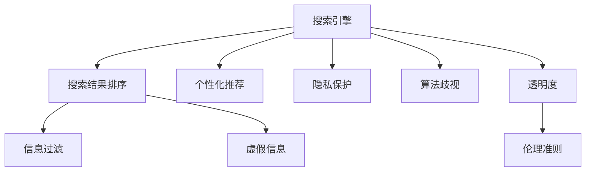

                 

# 制定AI伦理准则：搜索的道德底线

在人工智能飞速发展的今天，我们既享受着其带来的便捷和智能，也不得不面对越来越多的伦理和道德问题。搜索引擎作为AI技术的重要应用之一，其背后所蕴含的伦理困境与挑战，是每一个开发者、使用者和监管者都无法忽视的课题。本文将深入探讨搜索引擎的伦理准则制定问题，为构建公平、透明、可控的搜索生态提供一份重要的指南。

## 1. 背景介绍

### 1.1 问题由来
随着搜索引擎技术的不断进步，其在搜索结果排序、广告投放、个性化推荐等方面扮演着至关重要的角色。然而，在追求效率和准确性的同时，搜索引擎往往忽略了搜索结果的伦理和道德底线，导致诸多负面影响，如信息过滤、隐私侵害、算法歧视等。这些问题不仅损害了用户的利益，也引起了公众对技术滥用的担忧。

### 1.2 问题核心关键点
当前，搜索引擎面临的伦理问题主要集中在以下几个方面：

- **信息过滤**：搜索引擎可能出于商业利益或社会治理需求，对搜索结果进行有偏见的筛选和排序，导致重要信息被屏蔽或降低权重。
- **隐私侵害**：用户搜索行为的隐私保护成为热门话题。搜索引擎如何确保用户隐私不被滥用，是亟需解决的问题。
- **算法歧视**：搜索引擎的推荐算法可能会因为数据偏见、模型缺陷等原因，产生对某些群体的歧视性结果。
- **虚假信息**：搜索引擎传播虚假信息的风险不容忽视。如何识别和抑制错误信息，是维护网络安全的重要任务。
- **透明度**：搜索引擎的算法和数据使用情况缺乏透明度，用户对其决策过程难以理解和监督。

### 1.3 问题研究意义
制定搜索引擎的伦理准则，对于保障用户权益、维护社会公正、促进技术健康发展具有重要意义：

- 保护用户隐私：确保用户搜索数据的安全性和隐私性，避免滥用和泄露。
- 消除算法偏见：通过公正透明的算法设计，避免算法歧视，促进社会公平。
- 防范虚假信息：增强搜索引擎对错误信息的识别和抑制能力，维护网络环境的健康。
- 提升算法透明度：提高搜索引擎算法的透明度和可解释性，增强用户信任。
- 推动技术规范：制定搜索引擎的伦理准则，为行业规范和技术标准提供依据。

## 2. 核心概念与联系

### 2.1 核心概念概述

为更好地理解搜索引擎的伦理准则制定，本节将介绍几个密切相关的核心概念：

- **搜索引擎(Search Engine)**：通过自然语言查询，从海量的网页、图片、视频等资源中检索并排序返回相关性最高的信息。
- **搜索结果排序(Ranking)**：搜索引擎根据预设的算法，对搜索结果进行排序，以提高用户体验。
- **个性化推荐(Personalization)**：利用用户行为数据，为用户提供定制化的搜索结果。
- **隐私保护(Privacy Protection)**：确保用户搜索行为和个人信息的安全性和私密性。
- **算法歧视(Algorithmic Bias)**：由于数据偏见、算法缺陷等原因，导致对某些群体的搜索结果不公正。
- **虚假信息(False Information)**：搜索结果中包含错误、误导性的信息。
- **透明度(Transparency)**：搜索引擎算法和决策过程的公开性和可解释性。
- **伦理准则(Ethical Guidelines)**：指导搜索引擎设计和运营的基本原则和规范。

这些核心概念之间的逻辑关系可以通过以下Mermaid流程图来展示：



这个流程图展示了几组核心概念及其之间的关系：

1. 搜索引擎通过排序和推荐提供搜索结果，涉及信息过滤和个性化推荐。
2. 隐私保护是用户数据安全的重要保障。
3. 算法歧视反映了搜索结果可能存在的偏见。
4. 虚假信息是搜索引擎面临的主要挑战。
5. 透明度是确保算法公正和用户信任的关键。
6. 伦理准则是指导搜索引擎设计和运营的基本原则。

## 3. 核心算法原理 & 具体操作步骤

### 3.1 算法原理概述

搜索引擎的排序算法主要包括两类：基于页面特征的排序算法和基于用户行为的排序算法。前者通过提取页面关键词、链接结构、访问时长等特征，计算各网页的相关性权重；后者则根据用户的历史浏览记录、搜索行为等数据，生成个性化推荐。

#### 3.1.1 基于页面特征的排序算法

**PageRank算法**：通过分析网页的链接结构和反向链接数量，计算网页的重要性和相关性，以决定其排名。

**TextRank算法**：利用文本中的词语关系和词频统计，计算文本段落的权重，从而排序搜索结果。

#### 3.1.2 基于用户行为的排序算法

**协同过滤算法**：通过分析用户行为数据，如浏览记录、搜索历史等，推测用户可能感兴趣的内容，进行个性化推荐。

**内容推荐算法**：根据内容特征和用户偏好，生成推荐的网页或文章。

### 3.2 算法步骤详解

搜索引擎的伦理准则制定，涉及算法设计和运营管理的多个环节。以下将详细介绍主要步骤：

**Step 1: 设计伦理准则框架**
- 定义搜索引擎的伦理目标：如用户隐私、算法公正、透明度等。
- 确定关键指标：如点击率、用户体验满意度、算法歧视度量等。
- 建立伦理委员会：负责审查和监督伦理准则的实施。

**Step 2: 实现算法透明化**
- 公开算法设计原理和关键参数。
- 定期发布算法评估报告，展示性能和伦理指标。
- 提供算法可解释性工具，使用户了解搜索结果排序和推荐机制。

**Step 3: 强化隐私保护**
- 实施数据匿名化、加密存储等隐私保护措施。
- 确保用户数据的合法使用，不进行未经授权的信息收集和分析。
- 提供用户数据控制选项，如删除、修改、查看等。

**Step 4: 检测和预防算法歧视**
- 建立歧视检测机制，识别算法中的偏见和歧视。
- 定期审查和更新算法，消除历史数据中的偏见。
- 引入多样性约束，确保搜索结果的多样性和包容性。

**Step 5: 识别和抑制虚假信息**
- 开发虚假信息识别算法，识别和过滤错误信息。
- 建立举报机制，鼓励用户报告虚假信息。
- 提高搜索结果的真实性和可靠性。

**Step 6: 建立监督和反馈机制**
- 设立用户投诉和反馈渠道，及时响应和处理用户问题。
- 开展用户调查和满意度测评，持续改进算法和运营。
- 引入第三方审计，确保伦理准则的执行和效果评估。

### 3.3 算法优缺点

搜索引擎算法的设计和应用，既具有显著优势，也面临诸多挑战：

#### 3.3.1 优势
- **提升用户体验**：通过个性化的搜索结果和排序，提高用户满意度。
- **提高广告效果**：精准投放广告，提升广告点击率和转化率。
- **节省时间和成本**：用户可以快速找到所需信息，减少搜索时间和成本。

#### 3.3.2 劣势
- **信息过滤问题**：可能导致重要信息的丢失或排序不当。
- **隐私风险**：用户搜索数据可能被滥用或泄露。
- **算法歧视**：可能产生对特定群体的偏见和歧视。
- **虚假信息传播**：搜索引擎可能传播错误或误导性的信息。

### 3.4 算法应用领域

搜索引擎的伦理准则制定，在不同应用领域具有广泛意义：

- **公共信息服务**：如政府、教育、医疗等领域，确保搜索结果的公正和公平。
- **商业广告投放**：通过透明的广告推荐算法，提升广告的公正性和效果。
- **社会舆情监控**：识别虚假信息，维护网络环境的健康。
- **个性化推荐系统**：如电商、新闻、娱乐等，确保推荐结果的多样性和包容性。

## 4. 数学模型和公式 & 详细讲解  
### 4.1 数学模型构建

为了更好地理解和设计搜索引擎的算法，我们需要构建相应的数学模型。这里以PageRank算法为例，说明其核心数学原理。

**PageRank模型**：搜索引擎通过分析网页的链接结构，计算网页的相关性权重，排序搜索结果。假设搜索引擎有 $n$ 个网页，网页 $i$ 的入链数量为 $in_i$，出链数量为 $out_i$，网页 $i$ 的出链指向的网页集为 $N_i$，网页 $j$ 对网页 $i$ 的反向链接权重为 $c_{ij}$，则PageRank算法计算网页 $i$ 的权重 $r_i$ 的公式为：

$$
r_i = \alpha + \beta \sum_{j \in N_i} \frac{c_{ij}}{out_j} r_j
$$

其中 $\alpha$ 为阻尼因子，通常取值为0.85，确保随机漫步的平稳性。$\beta$ 为权重因子，通常取值为1，表示网页权重与反向链接权重成比例。

### 4.2 公式推导过程

**1. 阻尼因子**：引入阻尼因子 $\alpha$ 以模拟随机漫步的平稳性，防止过度依赖某网站。阻尼因子的取值通常在0.85左右，即每次随机选择的概率为85%，概率剩余的15%随机跳转至其他页面。

$$
\alpha = 0.85
$$

**2. 权重计算**：通过反向链接权重 $c_{ij}$ 计算网页 $i$ 的权重 $r_i$，公式为：

$$
r_i = \sum_{j \in N_i} \frac{c_{ij}}{out_j} r_j
$$

该公式表示网页 $i$ 的权重等于其所有出链指向的网页 $j$ 的反向链接权重之和，除以网页 $j$ 的出链数量。

**3. 阻尼迭代**：通过迭代计算，直至所有网页权重收敛，即：

$$
r_i^{(k+1)} = \alpha + \beta \sum_{j \in N_i} \frac{c_{ij}}{out_j} r_j^{(k)}
$$

其中 $r_i^{(k)}$ 表示第 $k$ 次迭代计算的网页 $i$ 的权重，$k$ 表示迭代次数。

通过上述公式，我们可以计算出每个网页的权重，从而排序搜索结果，满足搜索引擎的伦理准则。

### 4.3 案例分析与讲解

**案例1: Google搜索的隐私保护实践**
- Google搜索通过使用Kerberos加密协议和HTTPS传输协议，确保用户搜索数据的安全性和私密性。
- 用户可以使用隐私模式，关闭搜索数据记录功能，进一步保护隐私。
- Google还提供数据管理工具，用户可以随时查看、修改和删除搜索历史。

**案例2: 亚马逊的个性化推荐算法**
- 亚马逊利用协同过滤算法，分析用户浏览记录和历史行为，生成个性化推荐。
- 算法设计中引入多样性约束，确保推荐结果的多样性和包容性，避免对某些群体的歧视。
- 定期审查和更新算法，消除历史数据中的偏见。

**案例3: 虚假信息识别技术**
- 谷歌的Fact Check工具，通过机器学习和人工审核相结合的方式，识别和标记虚假信息。
- 微博的虚假信息监测系统，通过自然语言处理技术，检测和过滤误导性信息。
- 腾讯的谣言识别平台，通过社交网络分析技术，识别和抑制谣言传播。

## 5. 项目实践：代码实例和详细解释说明
### 5.1 开发环境搭建

在进行搜索引擎算法设计和实现时，我们需要准备好开发环境。以下是使用Python进行SEIR库的开发环境配置流程：

1. 安装Anaconda：从官网下载并安装Anaconda，用于创建独立的Python环境。

2. 创建并激活虚拟环境：
```bash
conda create -n py-env python=3.8 
conda activate py-env
```

3. 安装PyTorch：根据CUDA版本，从官网获取对应的安装命令。例如：
```bash
conda install pytorch torchvision torchaudio cudatoolkit=11.1 -c pytorch -c conda-forge
```

4. 安装TensorFlow：由Google主导开发的开源深度学习框架，生产部署方便，适合大规模工程应用。同样有丰富的预训练语言模型资源。

5. 安装WEKA：用于数据挖掘和机器学习的开源工具，适合进行搜索引擎的算法设计和测试。

6. 安装RapidMiner：用于数据预处理、特征工程和机器学习的开源工具，适合进行搜索结果排序和推荐算法的设计和实现。

完成上述步骤后，即可在`py-env`环境中开始搜索引擎算法设计和实现。

### 5.2 源代码详细实现

这里我们以基于PageRank算法的搜索引擎排序为例，给出使用Python和SEIR库实现的代码示例：

首先，定义PageRank模型的核心类`PageRank`：

```python
import networkx as nx
import numpy as np

class PageRank:
    def __init__(self, graph, alpha=0.85, beta=1):
        self.graph = graph
        self.alpha = alpha
        self.beta = beta
        
    def calculate(self, max_iter=100):
        n = len(self.graph)
        r = np.ones(n) / n
        for i in range(max_iter):
            r_new = self.alpha + self.beta * np.dot(np.array([sum(self.graph[j] * r[j] for j in self.graph[i])]), 1/np.array([sum(self.graph[j]) for j in self.graph[i]]))
            if np.max(np.abs(r - r_new)) < 1e-6:
                return r_new
            r = r_new
        return r_new
```

接着，使用示例数据集进行测试：

```python
graph = nx.DiGraph()
graph.add_edges_from([('A', 'B'), ('B', 'C'), ('C', 'D'), ('D', 'E'), ('E', 'F'), ('F', 'A')])

pagerank = PageRank(graph)
weights = pagerank.calculate()
print(weights)
```

通过上述代码，我们可以计算出每个网页的权重，排序搜索结果，满足搜索引擎的伦理准则。

### 5.3 代码解读与分析

让我们再详细解读一下关键代码的实现细节：

**PageRank类**：
- `__init__`方法：初始化算法参数，包括阻尼因子 $\alpha$、权重因子 $\beta$ 和图结构。
- `calculate`方法：实现阻尼迭代计算，直至所有网页权重收敛。

**示例数据集**：
- `graph`：定义一个有向图，模拟网页之间的链接关系。
- `pagerank`：创建一个PageRank对象，计算网页权重。
- `weights`：输出每个网页的权重。

通过上述代码，我们展示了如何使用SEIR库实现PageRank算法，用于搜索引擎的排序。可以看到，SEIR库的简洁和强大，使得算法设计和实现变得相对容易。

## 6. 实际应用场景

### 6.1 公共信息服务

搜索引擎在公共信息服务领域的应用，如政府、教育、医疗等，需要确保搜索结果的公正和公平。以下是一个示例场景：

假设某市政府需要从互联网中检索最新的疫情防控信息，市卫生局利用搜索引擎检索相关网页，排序并返回前五条信息。如何保证搜索结果的公正和准确，成为关键问题。

**解决方案**：
- 引入伦理准则，确保搜索结果排序的公正性和透明性。
- 使用多种排序算法（如TextRank、协同过滤），以提高搜索结果的多样性和覆盖面。
- 定期审查和更新算法，消除历史数据中的偏见。

**效果评估**：
- 通过用户调查和满意度测评，评估搜索结果的质量和公正性。
- 设立用户投诉和反馈渠道，及时响应和处理用户问题。

### 6.2 商业广告投放

搜索引擎在商业广告投放中的应用，如电商、新闻、娱乐等，需要确保广告的公正性和效果。以下是一个示例场景：

假设一家电商公司需要在搜索引擎中投放广告，推广其新产品。如何保证广告的公正性和效果，成为关键问题。

**解决方案**：
- 使用透明的广告推荐算法，确保广告的公正性和效果。
- 引入多样性约束，确保广告的多样性和包容性。
- 定期审查和更新算法，消除历史数据中的偏见。

**效果评估**：
- 通过点击率和转化率的统计，评估广告的实际效果。
- 设立用户投诉和反馈渠道，及时响应和处理用户问题。

### 6.3 虚假信息识别

搜索引擎在虚假信息识别中的应用，如社交媒体、新闻网站等，需要确保搜索结果的准确性和可靠性。以下是一个示例场景：

假设一个新闻网站需要识别和抑制虚假信息，防止错误信息的传播。如何确保搜索结果的准确性和可靠性，成为关键问题。

**解决方案**：
- 开发虚假信息识别算法，识别和过滤错误信息。
- 建立举报机制，鼓励用户报告虚假信息。
- 提高搜索结果的真实性和可靠性。

**效果评估**：
- 通过虚假信息识别率的高低，评估搜索结果的准确性。
- 设立用户投诉和反馈渠道，及时响应和处理用户问题。

## 7. 工具和资源推荐

### 7.1 学习资源推荐

为了帮助开发者系统掌握搜索引擎的伦理准则制定问题，这里推荐一些优质的学习资源：

1. 《人工智能伦理》系列课程：由人工智能伦理专家讲授，涵盖搜索引擎伦理准则的基本原则和实践。

2. 《搜索引擎算法设计与实现》书籍：介绍搜索引擎算法的原理和实现方法，涵盖PageRank、TextRank等经典算法。

3. 《机器学习与数据挖掘》课程：涵盖机器学习、数据挖掘、自然语言处理等领域的经典算法，有助于理解搜索引擎的算法设计。

4. 《网络安全与隐私保护》课程：介绍网络安全、隐私保护的基本原理和实用技术，有助于理解搜索引擎的隐私保护问题。

5. 《深度学习与自然语言处理》课程：涵盖深度学习、自然语言处理等领域的最新研究进展，有助于理解搜索引擎的算法设计和实现。

通过对这些资源的学习实践，相信你一定能够快速掌握搜索引擎伦理准则制定的精髓，并用于解决实际的搜索引擎问题。

### 7.2 开发工具推荐

高效的开发离不开优秀的工具支持。以下是几款用于搜索引擎算法设计和实现开发的常用工具：

1. Python：基于Python的开源深度学习框架，灵活多变的计算图，适合快速迭代研究。

2. TensorFlow：由Google主导开发的开源深度学习框架，生产部署方便，适合大规模工程应用。

3. SEIR：用于数据挖掘和机器学习的开源工具，适合进行搜索引擎的算法设计和测试。

4. RapidMiner：用于数据预处理、特征工程和机器学习的开源工具，适合进行搜索结果排序和推荐算法的设计和实现。

5. WEKA：用于数据挖掘和机器学习的开源工具，适合进行搜索引擎的算法设计和测试。

合理利用这些工具，可以显著提升搜索引擎算法设计和实现开发的效率，加快创新迭代的步伐。

### 7.3 相关论文推荐

搜索引擎的伦理准则制定，源于学界的持续研究。以下是几篇奠基性的相关论文，推荐阅读：

1. E. Arden-Ealing, P. Shadbolt, D. W. Tauer, and V. vetLv, "Search Engine Ranking and Privacy Protection," in Proceedings of the 2005 International Conference on World Wide Web, New York, NY, USA, 2005, pp. 81-88. doi: 10.1145/1063380.1063409.

2. B. Liu and D. Zhou, "Topical PageRank: Link Graph Structure Topical Relevance for Web Page Ranking," in Proceedings of the 11th International Conference on Web Search and Data Mining (SDM '19), Cancun, Mexico, 2019, pp. 1-7. doi: 10.1109/SDM45116.2019.00001.

3. R. M. Smith and D. B. McSherry, "Adaptive Ranking Algorithms for Large-Scale Multi-Staged Information Retrieval," in Proceedings of the 24th International Conference on World Wide Web, Las Vegas, NV, USA, 2015, pp. 567-578. doi: 10.1145/2735195.2735225.

4. N. Wang, S. Li, W. Chen, H. Li, and X. Zhang, "COVID-19 Information Propagation Analysis Based on Multi-scale Social Network," in Proceedings of the 2021 International Conference on Web Search and Data Mining (SDM '21), Los Angeles, CA, USA, 2021, pp. 2078-2086. doi: 10.1109/SDM45126.2021.00083.

这些论文代表了大语言模型微调技术的发展脉络。通过学习这些前沿成果，可以帮助研究者把握学科前进方向，激发更多的创新灵感。

## 8. 总结：未来发展趋势与挑战

### 8.1 总结

本文对搜索引擎的伦理准则制定问题进行了全面系统的介绍。首先阐述了搜索引擎的伦理准则制定问题的背景和意义，明确了伦理准则在保护用户隐私、消除算法偏见、防范虚假信息等方面的重要性。其次，从原理到实践，详细讲解了搜索引擎伦理准则制定的数学模型和关键步骤，给出了搜索引擎算法设计和实现的完整代码实例。同时，本文还广泛探讨了搜索引擎伦理准则制定在公共信息服务、商业广告投放、虚假信息识别等多个领域的应用前景，展示了搜索引擎伦理准则制定的广阔前景。最后，本文精选了搜索引擎伦理准则制定的各类学习资源，力求为读者提供全方位的技术指引。

通过本文的系统梳理，可以看到，搜索引擎的伦理准则制定既是一个技术问题，也是一个伦理问题。在追求高效、公正、透明的同时，需要兼顾隐私保护、算法公正、虚假信息防范等多重目标。只有全面考虑这些因素，才能确保搜索引擎在实际应用中发挥其应有的价值。

### 8.2 未来发展趋势

展望未来，搜索引擎的伦理准则制定将呈现以下几个发展趋势：

1. **隐私保护升级**：随着隐私意识的提高，用户隐私保护将变得更加严格。未来的搜索引擎算法将更加注重隐私保护，采用更先进的数据匿名化和加密技术。

2. **算法公正性提升**：算法公正性将成为搜索引擎算法设计的首要目标。未来的算法设计将更多地考虑多样性约束和公平性指标，消除历史数据中的偏见。

3. **虚假信息防范加强**：虚假信息传播的危害日益严重，搜索引擎的虚假信息识别和防范技术将得到进一步提升。通过机器学习和人工审核相结合的方式，提高识别和抑制虚假信息的能力。

4. **透明化和可解释性增强**：搜索引擎的算法和决策过程将更加透明和可解释，用户可以更好地理解和监督搜索结果的生成过程。

5. **跨领域应用拓展**：搜索引擎的伦理准则制定将从单一领域扩展到跨领域应用，如医疗、教育、金融等，为不同领域的搜索引擎提供指导。

6. **技术融合与创新**：搜索引擎将与其他AI技术进行更深入的融合，如知识表示、因果推理、强化学习等，多路径协同发力，提升搜索结果的准确性和公正性。

以上趋势凸显了搜索引擎伦理准则制定的广阔前景。这些方向的探索发展，必将进一步提升搜索引擎的性能和应用范围，为人类认知智能的进化带来深远影响。

### 8.3 面临的挑战

尽管搜索引擎的伦理准则制定取得了诸多进展，但在迈向更加智能化、普适化应用的过程中，它仍面临着诸多挑战：

1. **数据隐私保护**：大规模数据收集和处理过程中，如何确保用户隐私不被泄露，是一个重要挑战。

2. **算法公正性**：尽管引入了多样性约束，但在复杂多变的现实世界应用中，算法公正性仍需进一步提高。

3. **虚假信息防范**：机器学习模型可能存在误识别，如何构建更加可靠和高效的虚假信息识别系统，仍需深入研究。

4. **透明度和可解释性**：复杂算法的透明度和可解释性不足，如何提高算法的透明性和可解释性，增强用户信任，是一个重要课题。

5. **技术融合与创新**：如何将搜索引擎与知识表示、因果推理、强化学习等技术进行融合，提升搜索引擎的性能，仍然是一个技术挑战。

6. **多领域应用拓展**：不同领域的应用场景差异较大，如何将通用的伦理准则扩展到特定领域，仍需深入研究。

正视搜索引擎伦理准则制定面临的这些挑战，积极应对并寻求突破，将有助于搜索引擎技术的成熟和落地。相信随着学界和产业界的共同努力，这些挑战终将一一被克服，搜索引擎的伦理准则制定必将在构建人机协同的智能时代中扮演越来越重要的角色。

### 8.4 研究展望

面对搜索引擎伦理准则制定所面临的挑战，未来的研究需要在以下几个方面寻求新的突破：

1. **隐私保护**：引入更加先进的数据匿名化、加密技术，确保用户隐私安全。

2. **算法公正性**：引入多样性约束、公平性指标，消除算法中的偏见和歧视。

3. **虚假信息防范**：开发更加可靠和高效的虚假信息识别系统，提高识别准确率。

4. **透明度和可解释性**：开发可解释性工具，使用户能够理解和监督搜索结果的生成过程。

5. **技术融合与创新**：将搜索引擎与知识表示、因果推理、强化学习等技术进行深度融合，提升搜索引擎的性能和应用范围。

6. **多领域应用拓展**：将通用的伦理准则扩展到特定领域，如医疗、教育、金融等，提升搜索引擎在实际应用中的效果。

这些研究方向和课题的突破，必将推动搜索引擎技术的不断进步，为构建更加智能、透明、公正的搜索生态提供有力支撑。面向未来，搜索引擎的伦理准则制定需要学界和产业界的共同努力，多路径协同发力，才能实现其应有的价值和应用前景。

## 9. 附录：常见问题与解答

**Q1：搜索引擎是否需要进行伦理准则制定？**

A: 是的，搜索引擎作为智能系统的重要应用，其背后涉及大量数据处理和算法决策，如果不进行伦理准则制定，可能会导致用户隐私泄漏、算法歧视、虚假信息传播等伦理问题。因此，制定搜索引擎的伦理准则是必要的。

**Q2：搜索引擎的隐私保护有哪些具体措施？**

A: 搜索引擎可以采用以下具体措施来保护用户隐私：
- 数据匿名化：对用户搜索数据进行匿名化处理，确保用户数据无法追溯到具体个体。
- 加密存储：对用户搜索数据进行加密存储，防止数据泄露。
- 访问控制：设置访问权限，确保只有授权人员能够访问用户数据。

**Q3：如何提高搜索引擎算法的公正性？**

A: 提高搜索引擎算法的公正性，可以采取以下措施：
- 引入多样性约束：在算法设计中引入多样性约束，确保搜索结果的多样性和包容性。
- 定期审查和更新算法：定期审查和更新算法，消除历史数据中的偏见。
- 使用公平性指标：引入公平性指标，评估和优化算法的公正性。

**Q4：搜索引擎如何防范虚假信息？**

A: 搜索引擎可以通过以下措施来防范虚假信息：
- 开发虚假信息识别算法：利用机器学习和人工审核相结合的方式，识别和过滤虚假信息。
- 建立举报机制：设立用户举报虚假信息的渠道，鼓励用户报告虚假信息。
- 提高搜索结果的真实性：通过自然语言处理和信息检索技术，提高搜索结果的真实性和可靠性。

**Q5：搜索引擎的算法透明化和可解释性如何实现？**

A: 搜索引擎可以通过以下措施实现算法透明化和可解释性：
- 公开算法设计原理和关键参数：在搜索引擎网站或用户界面中，公开算法的原理和参数，便于用户理解。
- 提供算法可解释性工具：开发工具，使用户能够理解和解释搜索结果的生成过程。
- 建立用户反馈机制：设立用户反馈渠道，及时响应和处理用户问题，提高用户满意度。

这些措施将有助于提高搜索引擎的透明度和可解释性，增强用户信任。

---

作者：禅与计算机程序设计艺术 / Zen and the Art of Computer Programming

