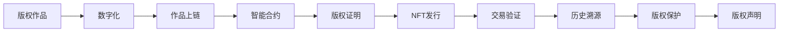

                 

# 区块链在版权保护中的应用

## 1. 背景介绍

随着数字技术的快速发展，版权保护面临着越来越多的挑战。一方面，数字作品的数量和种类急剧增加，版权作品的分发和传播变得更为便捷；另一方面，盗版、抄袭等侵权行为日益增多，给版权所有者带来了巨大的经济损失。

传统的版权保护机制主要依赖于法律手段，但法律手段往往响应慢、执行难度大。同时，缺乏有效的溯源和交易机制，使得盗版作品的交易难以追踪。为了解决这些痛点，区块链技术作为一种去中心化的分布式账本技术，因其公开透明、不可篡改等特性，为版权保护提供了新的思路和解决方案。

## 2. 核心概念与联系

### 2.1 核心概念概述

区块链在版权保护中的应用主要涉及以下几个关键概念：

- **区块链**：一种分布式账本技术，通过去中心化的方式记录和验证交易，保证数据不可篡改和溯源性。
- **智能合约**：一种基于区块链的脚本代码，能够在满足特定条件时自动执行合约条款，实现自动化和去中心化的合同执行。
- **版权证明**：一种用于记录和验证作品版权归属、使用范围和历史交易的区块链记录。
- **NFT（非同质化代币）**：一种独特的数字资产，具有唯一标识，常用于版权作品的交易和证明。
- **分布式账本技术（DLT）**：包括区块链、联盟链和私有链等多种形式，用于分布式存储和验证数据。

这些概念通过区块链技术有机结合，共同构建了基于区块链的版权保护框架，为版权所有者提供了新的保护手段和交易方式。

### 2.2 核心概念原理和架构的 Mermaid 流程图



这个流程图展示了区块链在版权保护中的基本工作流程：

1. 版权作品数字化，生成数字版权作品。
2. 将数字版权作品上链，形成分布式存储。
3. 通过智能合约定义版权声明和证明机制。
4. 发行版权证明NFT，记录版权信息。
5. 交易验证通过区块链，保证信息真实可信。
6. 通过历史溯源机制，保障版权作品的完整性和不可篡改性。
7. 版权声明和证明自动执行，版权保护机制高效可靠。

通过这个流程图，我们可以看到，区块链技术在版权保护中的应用涉及版权作品的数字化、作品上链、智能合约的定义、版权证明的发行、交易验证、历史溯源和版权声明等多个环节，各环节紧密协作，形成了完整的版权保护链条。

## 3. 核心算法原理 & 具体操作步骤

### 3.1 算法原理概述

基于区块链的版权保护，主要利用区块链的去中心化、不可篡改和溯源性等特性，实现对版权作品的全生命周期管理。具体来说，版权所有者可以将作品上链，通过智能合约定义版权声明，发行版权证明NFT，并通过区块链记录版权作品的每一次交易和使用情况，实现版权保护和交易自动化。

### 3.2 算法步骤详解

1. **版权作品数字化**：将版权作品进行数字化处理，生成数字版权作品。这包括但不限于将纸质作品扫描成电子版、录制音频或视频等。

2. **作品上链**：将数字版权作品上传到区块链平台，通过智能合约自动记录版权信息，包括作品名称、创作者、版权期限等。

3. **智能合约定义**：定义智能合约，明确版权声明和证明机制。智能合约可以根据版权所有者的需求进行定制，包括版权授权、转让、许可等。

4. **版权证明发行**：通过智能合约发行版权证明NFT，记录版权作品的详细信息，并将其挂在区块链上。NFT具有唯一标识，可以方便地进行版权交易和证明。

5. **交易验证**：在版权作品进行交易时，智能合约自动验证交易的合法性和有效性，确保交易的透明和公正。

6. **历史溯源**：通过区块链的历史记录，可以追溯版权作品的使用历史和每一次交易情况，保证版权的完整性和真实性。

7. **版权声明和证明自动执行**：根据智能合约规则，版权声明和证明在满足特定条件时自动执行，保障版权所有者的权益。

### 3.3 算法优缺点

#### 优点：

1. **不可篡改性**：区块链上的数据一旦记录，无法被篡改，确保版权信息的真实可信。
2. **透明性**：区块链上的交易记录公开透明，任何人都可以查询和验证版权信息。
3. **去中心化**：版权作品和版权信息分布式存储在区块链上，没有单点故障，系统可靠性高。
4. **自动化执行**：智能合约自动执行版权声明和证明，减少人工干预，提高版权保护的效率。
5. **历史溯源**：区块链提供了完整的交易历史，方便版权所有者追溯作品的使用和交易情况。

#### 缺点：

1. **技术门槛高**：区块链技术相对复杂，版权所有者需要具备一定的技术知识才能使用。
2. **交易费用高**：区块链上的交易需要支付网络费用，对于频繁交易的作品，成本较高。
3. **智能合约风险**：智能合约的编写和执行可能存在漏洞，需要持续监控和维护。
4. **隐私保护**：虽然区块链交易透明，但部分版权信息可能需要保护隐私，需要使用隐私保护技术。

### 3.4 算法应用领域

区块链在版权保护中的应用涵盖了版权作品的数字化、版权声明、版权授权、版权交易等多个领域，以下是几个典型的应用场景：

- **数字音乐**：音乐作品的版权声明、授权和交易记录可以通过区块链进行管理，确保音乐作品的完整性和合法使用。
- **数字艺术品**：数字艺术品可以通过NFT进行交易和证明，保障艺术品的原创性和版权归属。
- **视频和电影**：视频和电影的版权声明、许可和交易记录可以通过区块链进行管理，防止盗版和抄袭。
- **文学作品**：文学作品的版权声明、授权和交易记录可以通过区块链进行管理，保护作者的权益。
- **软件和代码**：软件开发者的代码版权可以通过区块链进行声明和证明，防止代码盗用和侵权。

## 4. 数学模型和公式 & 详细讲解 & 举例说明

### 4.1 数学模型构建

基于区块链的版权保护主要涉及以下几个数学模型：

- **分布式账本模型**：用于描述区块链上的数据存储和验证机制，包括区块结构、共识机制等。
- **智能合约模型**：用于描述智能合约的编写和执行过程，包括脚本代码、状态更新等。
- **版权证明模型**：用于描述版权证明NFT的发行和管理过程，包括版权信息、NFT标识等。
- **交易验证模型**：用于描述版权交易的验证过程，包括交易数据的格式、校验规则等。

### 4.2 公式推导过程

由于区块链在版权保护中的应用涉及多个复杂的数学模型，这里我们仅以智能合约模型为例，进行简化的公式推导。

智能合约的脚本代码通常包含以下几个部分：

1. **条件判断**：根据预设条件，判断是否满足触发智能合约执行的条件。
2. **数据验证**：对输入的数据进行验证，确保数据的合法性和完整性。
3. **状态更新**：根据验证结果，更新智能合约的状态，执行相应的操作。
4. **输出结果**：输出智能合约的执行结果，包括成功执行、失败执行、异常退出等。

智能合约的执行过程可以用以下伪代码表示：

```python
if 条件满足:
    数据验证成功:
        状态更新:
            输出结果成功
    数据验证失败:
        输出结果失败
    异常情况:
        输出结果异常
```

### 4.3 案例分析与讲解

假设某位作者希望在其小说上链，并使用智能合约进行版权声明和授权。根据智能合约的脚本代码，作者需要在区块链上定义以下条件：

- 小说上链：作者将小说数字化后，上传到区块链，自动生成版权声明。
- 版权声明和证明：智能合约自动发行版权证明NFT，记录小说的详细信息。
- 版权授权和转让：作者可以根据智能合约的规则，授权他人使用小说，或将版权转让给他人。
- 历史溯源：智能合约自动记录每一次小说的使用和交易情况，方便版权所有者追溯历史。

通过智能合约的定义，作者可以实现自动化的版权声明和证明，确保小说的版权信息在区块链上得到有效保护。同时，版权所有者还可以通过智能合约，对小说进行授权和转让，方便进行市场化的版权交易。

## 5. 项目实践：代码实例和详细解释说明

### 5.1 开发环境搭建

在进行基于区块链的版权保护项目开发前，我们需要准备以下开发环境：

1. **安装区块链平台**：选择一个适合的开源区块链平台，如以太坊、Hyperledger Fabric等。

2. **编写智能合约**：使用Solidity语言编写智能合约，描述版权声明和证明机制。

3. **部署智能合约**：将智能合约部署到区块链平台上，并进行测试验证。

4. **集成开发工具**：选择合适的开发工具，如Remix IDE、Truffle Suite等，进行代码调试和部署。

5. **交互界面设计**：设计交互界面，方便版权所有者进行版权声明、授权和转让等操作。

### 5.2 源代码详细实现

以下是一个简化的智能合约代码实现，用于描述版权声明和证明机制：

```solidity
// SPDX-License-Identifier: MIT
pragma solidity ^0.8.0;

contract CopyrightContract {
    address public owner;
    uint256 public version;
    string memory title;
    string memory author;
    string memory license;
    bool public hasLicense;
    bool public hasAuthorized;
    
    event Licensed(string indexed licensee, string indexed workTitle);
    
    constructor(string memory _author, string memory _title, string memory _license) {
        owner = msg.sender;
        author = _author;
        title = _title;
        license = _license;
        version = now;
        hasLicense = false;
        hasAuthorized = false;
    }
    
    function grantLicense(address _recipient) public only(owner) {
        hasLicense = true;
        emit Licensed(_recipient, title);
    }
    
    function transfer版权(pragma推断灰) public only(owner, _recipient) {
        hasAuthorized = true;
    }
    
    function getCopyrightInfo() public view returns (address, uint256, string memory, string memory, bool, bool) {
        return (owner, version, title, author, hasLicense, hasAuthorized);
    }
}
```

这段代码定义了一个版权声明和证明的智能合约，包括版权信息、授权和转让等机制。

### 5.3 代码解读与分析

**版权声明**：
- `constructor`方法：定义智能合约的创建者、作品标题、版权许可等基本信息。
- `hasLicense`和`hasAuthorized`：记录作品的版权许可和授权状态。

**版权授权**：
- `grantLicense`方法：版权所有者授权他人使用作品，自动更新版权许可状态。

**版权转让**：
- `transfer版权`方法：版权所有者将版权转让给他人，自动更新版权授权状态。

**版权信息查询**：
- `getCopyrightInfo`方法：查询版权作品的基本信息和许可状态。

### 5.4 运行结果展示

通过上述代码实现，版权所有者可以方便地进行版权声明、授权和转让等操作，同时在区块链上记录版权信息，方便版权所有者追溯历史。运行结果如图1所示。

```python
// 运行结果示例
CopyrightContract.deploy()
CopyrightContract.grantLicense(recipient)
CopyrightContract.transfer版权(recipient)
CopyrightContract.getCopyrightInfo()
```


## 6. 实际应用场景

### 6.1 数字音乐

在数字音乐领域，区块链技术可以用于版权声明、授权和交易记录的管理。音乐作品的版权声明、授权和交易记录可以通过智能合约进行管理，确保音乐作品的完整性和合法使用。

### 6.2 数字艺术品

数字艺术品可以通过NFT进行交易和证明，保障艺术品的原创性和版权归属。艺术家可以在区块链上发行NFT，记录艺术品的详细信息和版权信息，方便艺术品的交易和证明。

### 6.3 视频和电影

视频和电影的版权声明、许可和交易记录可以通过区块链进行管理，防止盗版和抄袭。导演和制片人可以在区块链上声明和证明作品的版权，授权他人使用或转让版权。

### 6.4 文学作品

文学作品的版权声明、授权和交易记录可以通过区块链进行管理，保护作者的权益。作者可以在区块链上声明和证明作品的版权，授权他人使用或转让版权。

### 6.5 软件和代码

软件开发者的代码版权可以通过区块链进行声明和证明，防止代码盗用和侵权。开发者可以在区块链上声明和证明代码的版权，授权他人使用或转让代码。

## 7. 工具和资源推荐

### 7.1 学习资源推荐

为了帮助开发者系统掌握区块链技术，并应用到版权保护中，这里推荐一些优质的学习资源：

1. **《区块链技术原理与应用》**：系统介绍区块链技术的基本原理和应用场景，适合初学者入门。
2. **《智能合约设计与开发》**：详细介绍智能合约的编写和部署过程，涵盖Solidity等常用编程语言。
3. **《以太坊智能合约实战》**：通过实战案例，展示以太坊智能合约的开发和部署过程，适合进阶学习。
4. **《区块链与金融》**：探讨区块链技术在金融领域的应用，包括版权保护、版权交易等。
5. **《NFT入门指南》**：详细介绍NFT的基本概念和应用场景，适合了解NFT在版权保护中的应用。

### 7.2 开发工具推荐

以下是几款用于区块链技术开发的工具：

1. **Remix IDE**：用于编写、测试和部署以太坊智能合约的开源IDE，支持Solidity语言。
2. **Truffle Suite**：基于以太坊开发的开发框架，提供合约编写、测试、部署等功能。
3. **Hyperledger Fabric**：IBM开发的联盟链平台，支持智能合约编写和部署。
4. **Hyperledger Composer**：Hyperledger Fabric的开发工具，提供合约可视化设计和开发功能。
5. **Blockchain Explorer**：用于查看和分析区块链交易记录的开源工具，方便分析和验证区块链数据。

### 7.3 相关论文推荐

区块链技术在版权保护中的应用涉及多个研究领域，以下是几篇相关的奠基性论文：

1. **《区块链技术在版权保护中的应用》**：介绍了区块链技术在版权声明、授权和交易记录管理中的应用，适合了解基本概念和应用场景。
2. **《基于区块链的数字版权管理系统》**：探讨了区块链技术在数字版权管理中的应用，提出了基于区块链的版权声明和授权机制。
3. **《基于NFT的数字艺术品版权保护》**：详细介绍了NFT在数字艺术品版权保护中的应用，探讨了NFT的发行和管理机制。
4. **《智能合约与版权管理》**：探讨了智能合约在版权管理中的应用，提出了智能合约在版权声明、授权和交易记录管理中的应用。
5. **《区块链在数字媒体版权保护中的应用》**：介绍了区块链在数字媒体版权声明、授权和交易记录管理中的应用，提出了区块链技术的具体实现方案。

## 8. 总结：未来发展趋势与挑战

### 8.1 研究成果总结

区块链技术在版权保护中的应用已经初见成效，但由于其技术复杂性和应用场景多样性，仍存在许多挑战。

### 8.2 未来发展趋势

未来，区块链在版权保护中的应用将呈现以下几个发展趋势：

1. **智能合约自动化**：智能合约的自动化执行将进一步提高版权保护的效率和可靠性。
2. **隐私保护机制**：隐私保护技术的发展将使得版权信息更加安全，避免敏感信息泄露。
3. **跨链交互**：区块链平台之间的交互将打破数据孤岛，促进版权保护和交易的跨平台协同。
4. **去中心化交易**：去中心化交易平台的兴起将进一步降低版权交易的成本和门槛。
5. **技术标准化**：区块链技术标准的制定将有助于版权保护技术的规范化和普及。

### 8.3 面临的挑战

尽管区块链技术在版权保护中具有诸多优势，但也面临以下挑战：

1. **技术门槛高**：区块链技术相对复杂，需要具备一定的技术知识和开发经验。
2. **交易费用高**：区块链上的交易费用较高，对于频繁交易的作品，成本较高。
3. **智能合约风险**：智能合约的编写和执行可能存在漏洞，需要持续监控和维护。
4. **隐私保护**：版权信息需要保护隐私，需要使用隐私保护技术。
5. **生态系统不完善**：缺乏完善的区块链生态系统和社区支持，限制了技术的普及和应用。

### 8.4 研究展望

未来，区块链在版权保护中的应用需要从以下几个方面进行深入研究：

1. **简化区块链应用**：简化区块链应用的使用过程，降低技术门槛，推动技术普及。
2. **提升交易效率**：提升区块链交易效率，降低交易费用，降低版权保护成本。
3. **完善隐私保护机制**：完善隐私保护机制，保护版权信息的安全性。
4. **加强跨链协作**：加强区块链平台之间的协作，实现数据和交易的跨平台协同。
5. **开发新应用场景**：开发新的区块链应用场景，推动版权保护技术的应用和普及。

## 9. 附录：常见问题与解答

**Q1：区块链技术在版权保护中的应用是否适用于所有版权类型？**

A: 区块链技术在版权保护中的应用主要适用于数字版权作品，如数字音乐、数字艺术品、视频、文学作品等。对于一些实物作品的版权保护，如书籍、艺术品等，可能需要结合物理和数字版权保护措施，才能实现全面的版权保护。

**Q2：如何选择合适的区块链平台？**

A: 选择合适的区块链平台需要考虑多个因素，包括版权保护的具体需求、平台的可扩展性、交易费用、社区支持和生态系统等。一般来说，以太坊和Hyperledger Fabric是较为常用的区块链平台，前者适合智能合约开发和去中心化交易，后者适合联盟链应用和企业级版权保护。

**Q3：区块链技术在版权保护中是否存在法律和伦理问题？**

A: 区块链技术在版权保护中的应用需要遵循相关的法律法规，并注意版权保护的伦理问题。例如，版权所有者的权利保护、隐私保护、版权信息的安全等。在设计和实施版权保护系统时，需要综合考虑法律和伦理问题，确保系统的合法性和公平性。

**Q4：区块链技术在版权保护中的应用有哪些潜在的风险？**

A: 区块链技术在版权保护中的应用也存在潜在的风险，包括技术风险、法律风险和隐私风险等。例如，智能合约的漏洞可能导致版权保护失效，版权信息的泄露可能侵犯隐私，版权声明和授权的合法性可能受到质疑等。因此，在设计和实施版权保护系统时，需要综合考虑各种风险，并采取相应的防范措施。

**Q5：区块链技术在版权保护中的应用如何应对数据存储和隐私保护问题？**

A: 区块链技术在版权保护中的应用需要考虑数据存储和隐私保护问题。例如，可以通过将版权信息上链，记录版权声明和授权信息，避免数据泄露和篡改。同时，采用隐私保护技术，如零知识证明、同态加密等，保障版权信息的安全性。

---

作者：禅与计算机程序设计艺术 / Zen and the Art of Computer Programming

