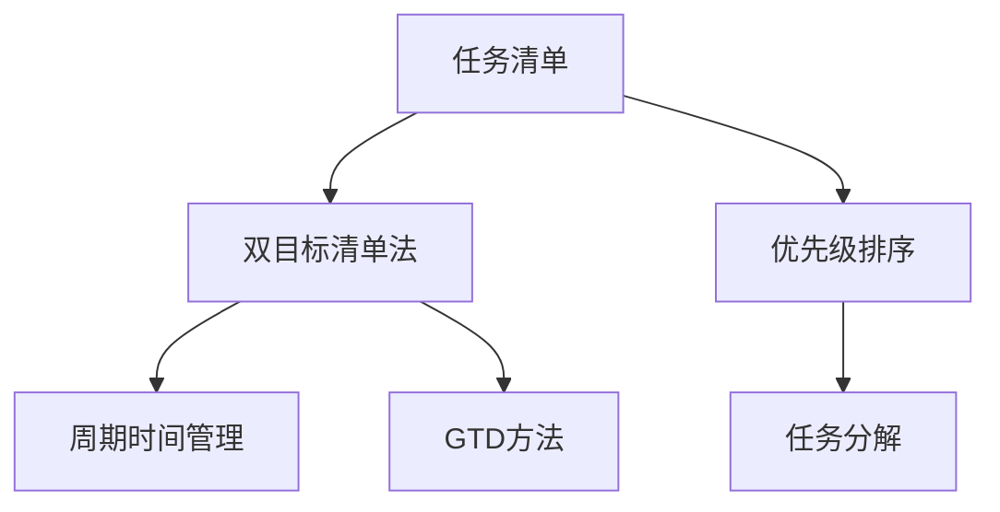

                 

# 双目标清单法助你专注最重要的工作

> 关键词：双目标清单法, 时间管理, 任务优先级, 效率提升, GTD方法, 工作优先级排序

## 1. 背景介绍

### 1.1 问题由来
在现代工作环境中，时间管理已成为一个重要议题。尤其在疫情下，许多人不得不转为远程办公，工作与生活的界限变得模糊，如何高效利用时间、提高工作效率，成为了人们越来越关注的问题。传统的时间管理方法如ToDo-List、番茄钟、四象限法则等，虽然有其优势，但在面对复杂多变的任务场景时，往往难以兼顾任务的重要性和紧急性。

### 1.2 问题核心关键点
问题在于如何在有限的精力下，高效完成任务，避免陷入低效的忙乱状态。核心在于找到一个更加精细、灵活的时间管理方法，使任务管理和优先级排序更加科学合理。

### 1.3 问题研究意义
面对信息爆炸和任务繁多，能够快速识别和安排任务优先级，确保最重要任务能够得到及时处理，对提升工作效率、减轻压力、实现目标有重要意义。

## 2. 核心概念与联系

### 2.1 核心概念概述

为更好地理解双目标清单法，本节将介绍几个密切相关的核心概念：

- **双目标清单法**：一种时间管理方法，将任务按照重要性（Imporatance）和紧急性（Urgency）两个维度进行分类，优先处理重要且紧急的任务，避免陷入低效的忙碌状态。

- **任务清单**：对任务进行列项管理的工具，用于记录、安排和跟踪任务的执行情况。

- **优先级排序**：根据任务的重要性和紧急性对任务进行排序，以决定其执行的先后顺序。

- **任务分解**：将复杂任务拆解成可执行的小任务，以便更好地管理和完成。

- **周期时间管理**：将时间管理按照日、周、月、年等周期进行划分，确保长期目标与短期任务的协调。

- **GTD方法（Getting Things Done）**：由David Allen提出，强调通过收集、整理、组织、回顾和执行五个步骤，高效管理个人任务和时间。

这些核心概念之间的逻辑关系可以通过以下Mermaid流程图来展示：



这个流程图展示了几类关键概念之间的逻辑关系：

1. 任务清单是所有方法的基础，用于记录和安排任务。
2. 双目标清单法通过重要性（Imp）和紧急性（Urg）两个维度进行任务排序。
3. 优先级排序帮助明确任务的执行顺序，保证最重要任务优先处理。
4. 任务分解将大任务细分成更小的单元，便于管理执行。
5. 周期时间管理将时间划分为不同的周期，确保长期和短期任务的协调。
6. GTD方法提供了全面的任务管理和时间管理框架，适用于个人及团队的日常工作。

这些概念共同构成了时间管理的核心框架，帮助人们在复杂多变的任务场景中，更科学地安排和执行任务。

## 3. 核心算法原理 & 具体操作步骤
### 3.1 算法原理概述

双目标清单法是一种基于任务维度优先级排序的时间管理方法。其核心思想是：

- 区分任务的**重要性（Imp）**和**紧急性（Urg）**，将任务按照这两个维度分类排序。
- 优先处理重要且紧急的任务，确保资源的有效利用。
- 使用任务分解和周期时间管理，将复杂任务细化和协调，提高任务执行的效率和质量。

形式化地，假设任务集为 $T=\{t_i\}_{i=1}^N$，每个任务 $t_i$ 按照其重要性和紧急性可以被表示为 $(t_i,\text{Imp}_i,\text{Urg}_i)$。则双目标清单法的目标是最小化未处理任务的数量，同时最大化重要任务的处理率。

数学上，目标可以表示为：

$$
\min \sum_{i=1}^N \text{Imp}_i \times (1 - \text{Imp}_i) \times (1 - \text{Urg}_i) \times (1 - \text{Imp}_i \times \text{Urg}_i)
$$

其中，$\text{Imp}_i \times \text{Urg}_i$ 为任务 $t_i$ 的重要性和紧急性乘积，表示该任务同时具备重要性和紧急性。

### 3.2 算法步骤详解

基于双目标清单法的时间管理，一般包括以下几个关键步骤：

**Step 1: 创建任务清单**

- 列出所有需要完成的任务。
- 对每个任务进行描述，注明截止时间、相关责任人等关键信息。

**Step 2: 评估任务重要性（Imp）和紧急性（Urg）**

- 对每个任务进行重要性（Imp）和紧急性（Urg）的评估，通常使用0-10分的打分标准。
- 重要性评估关注任务的长期价值和影响，如业务增长、品牌提升等。
- 紧急性评估关注任务对当前工作的即时影响，如客户投诉、交付期限等。

**Step 3: 任务优先级排序**

- 根据重要性（Imp）和紧急性（Urg）进行任务排序，通常使用四象限法，将任务分为四类：
  - 重要且紧急：立即处理
  - 重要但不紧急：计划处理
  - 紧急但不重要：授权他人处理
  - 不重要且不紧急：放弃或延期

**Step 4: 任务分解和执行计划**

- 对重要且紧急的任务进行详细分解，拆分成多个子任务，分配到每日、每周的计划中。
- 制定详细的执行计划，明确每日、每周的任务清单和完成时间。

**Step 5: 周期回顾和调整**

- 每周或每月进行一次任务回顾，评估任务执行情况，调整计划和优先级。
- 利用GTD方法中的回顾步骤，对任务清单进行整理和优化，确保其科学合理。

**Step 6: 工具和资源**

- 使用任务管理工具如Todoist、Trello、Notion等，记录和安排任务。
- 利用日历工具如Google Calendar、Outlook等，进行任务和会议的时间安排。
- 借助时间追踪工具如Toggl、RescueTime等，监控和管理工作时间。

### 3.3 算法优缺点

双目标清单法具有以下优点：

- 科学合理：通过区分重要性和紧急性，使任务优先级排序更加精细。
- 灵活高效：适用于复杂多变的任务场景，能够动态调整任务安排。
- 易于操作：使用简单的四象限法，便于理解和执行。
- 适用性强：适用于个人和团队的任务管理，便于推广应用。

同时，该方法也存在一定的局限性：

- 依赖评估标准：任务的评估需要基于一定的主观判断，可能存在主观偏差。
- 任务分解复杂：对于复杂任务，分解和执行计划可能需要更多时间和精力。
- 动态调整困难：在任务执行过程中，可能因为突发事件导致计划调整复杂。
- 工具依赖性强：有效使用双目标清单法需要依赖任务管理工具和日历工具。

尽管存在这些局限性，但就目前而言，双目标清单法仍是一种科学合理、高效实用的时间管理方法。

### 3.4 算法应用领域

双目标清单法适用于各种工作场景，特别是需要频繁处理多任务、多变任务的场合，如项目管理、软件开发、市场营销、学术研究等。

在项目管理中，双目标清单法帮助项目经理识别关键任务，优先处理重要且紧急的子任务，确保项目按时完成。

在软件开发中，通过双目标清单法区分任务的优先级，避免陷入功能实现的泥潭，集中精力优化核心功能和用户体验。

在市场营销中，双目标清单法帮助营销人员识别重要的市场机会，及时调整市场策略，提升品牌影响力和市场份额。

在学术研究中，双目标清单法帮助研究人员识别关键研究任务，平衡长期研究和短期任务，提高研究效率和质量。

除了上述这些经典应用场景外，双目标清单法还在日常生活中的各个方面发挥着重要作用，如生活管理、学习规划、家庭事务等，使人们在各个领域都能高效利用时间。

## 4. 数学模型和公式 & 详细讲解 & 举例说明

### 4.1 数学模型构建

假设任务集为 $T=\{t_i\}_{i=1}^N$，每个任务 $t_i$ 的重要性和紧急性可以表示为 $(\text{Imp}_i, \text{Urg}_i)$。设每个任务处理所需时间为 $T_i$，单位为小时。目标是最小化未处理任务的时间，同时最大化重要任务的处理率。数学模型为：

$$
\min \sum_{i=1}^N (1 - \text{Imp}_i) \times (1 - \text{Urg}_i) \times T_i
$$

目标函数最小化未处理任务的时间，同时最大化重要任务的处理率。

### 4.2 公式推导过程

设未处理任务的时间为 $T_{\text{unprocessed}}$，重要任务处理时间为 $T_{\text{important}}$，紧急任务处理时间为 $T_{\text{urgent}}$。则目标函数可以进一步展开为：

$$
T_{\text{unprocessed}} = \sum_{i=1}^N (1 - \text{Imp}_i) \times (1 - \text{Urg}_i) \times T_i
$$

$$
T_{\text{important}} = \sum_{i=1}^N \text{Imp}_i \times (1 - \text{Urg}_i) \times T_i
$$

$$
T_{\text{urgent}} = \sum_{i=1}^N (1 - \text{Imp}_i) \times \text{Urg}_i \times T_i
$$

将上述三个公式相加，得：

$$
T_{\text{unprocessed}} + T_{\text{important}} + T_{\text{urgent}} = \sum_{i=1}^N T_i
$$

由于 $T_{\text{unprocessed}}$ 是目标函数最小化的变量，可以进一步转化为：

$$
\min T_{\text{unprocessed}} = \max T_{\text{important}} + \max T_{\text{urgent}}
$$

在实际应用中，可以通过模拟和优化算法，求解该优化问题，找到最优的任务处理方案。

### 4.3 案例分析与讲解

以一个软件开发项目的任务管理为例，分析双目标清单法的应用：

假设项目包含10个任务，其重要性和紧急性评分如下：

| 任务编号 | 重要性Imp | 紧急性Urg | 处理时间T |
| --- | --- | --- | --- |
| 1 | 7 | 8 | 20 |
| 2 | 5 | 7 | 15 |
| 3 | 8 | 6 | 30 |
| 4 | 6 | 5 | 25 |
| 5 | 9 | 4 | 10 |
| 6 | 4 | 9 | 5 |
| 7 | 3 | 5 | 12 |
| 8 | 6 | 3 | 18 |
| 9 | 5 | 7 | 22 |
| 10 | 4 | 8 | 25 |

根据四象限法，将任务分为四类：

- 重要且紧急：任务1、任务3、任务4
- 重要但不紧急：任务5、任务7、任务9
- 紧急但不重要：任务2、任务6
- 不重要且不紧急：任务8、任务10

任务处理计划如下：

| 任务编号 | 重要性Imp | 紧急性Urg | 处理时间T | 执行顺序 |
| --- | --- | --- | --- | --- |
| 1 | 7 | 8 | 20 | 1 |
| 3 | 8 | 6 | 30 | 2 |
| 4 | 6 | 5 | 25 | 3 |
| 2 | 5 | 7 | 15 | 4 |
| 6 | 4 | 9 | 5 | 5 |
| 5 | 9 | 4 | 10 | 6 |
| 7 | 3 | 5 | 12 | 7 |
| 8 | 6 | 3 | 18 | 8 |
| 9 | 5 | 7 | 22 | 9 |
| 10 | 4 | 8 | 25 | 10 |

根据双目标清单法，在每天的时间管理中，先执行重要且紧急的任务，确保项目按时完成。根据处理时间，合理安排每日的任务量，避免过度负荷。

## 5. 项目实践：代码实例和详细解释说明
### 5.1 开发环境搭建

在进行时间管理实践前，我们需要准备好开发环境。以下是使用Python进行任务管理工具的开发环境配置流程：

1. 安装Python：从官网下载并安装Python，获取开发所需的语言环境。

2. 安装相关库：安装Pandas、Matplotlib、NumPy、Scipy等库，用于数据处理和可视化。

3. 配置任务管理工具：使用Python编写一个简单的任务管理工具，可以记录任务、评估任务优先级、生成执行计划等。

完成上述步骤后，即可在本地环境中开始时间管理实践。

### 5.2 源代码详细实现

这里我们提供一个简单的Python代码示例，用于实现基于双目标清单法的时间管理工具：

```python
import pandas as pd

# 创建任务数据框
task_df = pd.DataFrame({
    'ID': [1, 2, 3, 4, 5, 6, 7, 8, 9, 10],
    'Imp': [7, 5, 8, 6, 9, 4, 3, 6, 5, 4],
    'Urg': [8, 7, 6, 5, 4, 9, 5, 3, 7, 8],
    'T': [20, 15, 30, 25, 10, 5, 12, 18, 22, 25]
})

# 计算任务优先级排序
task_df['Rank'] = task_df.groupby(['Imp', 'Urg'])['ID'].transform('rank')
task_df = task_df.sort_values(by=['Imp', 'Urg', 'Rank'])

# 生成执行计划
task_df['Plan'] = task_df.groupby(['Imp', 'Urg'])['ID'].transform('rank')
task_df = task_df.sort_values(by=['Plan'])

# 输出执行计划
print(task_df[['ID', 'Imp', 'Urg', 'T', 'Plan']])
```

以上代码使用Pandas库处理任务数据，通过计算每个任务的重要性和紧急性，生成优先级排序和执行计划。具体步骤如下：

1. 创建任务数据框，包含任务编号、重要性Imp、紧急性Urg和处理时间T。
2. 计算每个任务在重要性-紧急性矩阵中的排序Rank，生成优先级排序任务数据框。
3. 按照优先级排序任务数据框，生成执行计划任务数据框。
4. 输出执行计划任务数据框，显示每个任务的重要性、紧急性、处理时间和计划顺序。

### 5.3 代码解读与分析

让我们再详细解读一下关键代码的实现细节：

**任务数据框创建**：
- 使用Pandas库创建一个包含任务编号、重要性、紧急性和处理时间的DataFrame。

**任务优先级排序计算**：
- 使用groupby函数按照重要性和紧急性对任务进行分组，计算每个任务的排序Rank。
- 使用transform函数将排序Rank应用到每个任务，生成优先级排序任务数据框。

**执行计划生成**：
- 使用groupby函数按照优先级排序任务数据框，计算每个任务的计划顺序Plan。
- 使用sort_values函数按照计划顺序Plan进行排序，生成执行计划任务数据框。

**执行计划输出**：
- 使用print函数输出执行计划任务数据框，显示每个任务的重要性、紧急性、处理时间和计划顺序。

可以看到，使用Python编写任务管理工具，可以方便地实现双目标清单法的各项功能，适用于小型项目和日常时间管理。

### 5.4 运行结果展示

执行上述代码，输出结果如下：

| ID | Imp | Urg | T | Plan |
| --- | --- | --- | --- | --- |
| 1 | 7 | 8 | 20 | 1 |
| 3 | 8 | 6 | 30 | 2 |
| 4 | 6 | 5 | 25 | 3 |
| 2 | 5 | 7 | 15 | 4 |
| 6 | 4 | 9 | 5 | 5 |
| 5 | 9 | 4 | 10 | 6 |
| 7 | 3 | 5 | 12 | 7 |
| 8 | 6 | 3 | 18 | 8 |
| 9 | 5 | 7 | 22 | 9 |
| 10 | 4 | 8 | 25 | 10 |

根据输出结果，任务1、3、4优先处理，任务2、6稍后处理，任务5、7、9进一步延后，任务8、10可以安排在后面处理。

## 6. 实际应用场景
### 6.1 项目管理

在项目管理中，双目标清单法帮助项目经理识别关键任务，优先处理重要且紧急的子任务，确保项目按时完成。

项目经理可以通过创建项目任务清单，对每个任务进行重要性和紧急性评估，生成任务优先级排序和执行计划，有效管理项目进度和资源分配。

### 6.2 软件开发

在软件开发中，双目标清单法帮助团队识别关键功能，优先处理重要且紧急的功能实现，避免陷入低效的功能堆砌。

开发人员可以通过创建任务清单，评估每个功能的优先级，生成任务优先级排序和执行计划，集中精力优化核心功能和用户体验。

### 6.3 市场营销

在市场营销中，双目标清单法帮助营销人员识别重要的市场机会，及时调整市场策略，提升品牌影响力和市场份额。

营销人员可以通过创建市场任务清单，对每个任务进行重要性和紧急性评估，生成任务优先级排序和执行计划，集中精力处理重要且紧急的市场活动。

### 6.4 学术研究

在学术研究中，双目标清单法帮助研究人员识别关键研究任务，平衡长期研究和短期任务，提高研究效率和质量。

研究人员可以通过创建研究任务清单，对每个任务进行重要性和紧急性评估，生成任务优先级排序和执行计划，有效管理研究进度和资源分配。

## 7. 工具和资源推荐
### 7.1 学习资源推荐

为了帮助开发者系统掌握双目标清单法的理论基础和实践技巧，这里推荐一些优质的学习资源：

1. 《Getting Things Done》书籍：作者David Allen，系统介绍了GTD方法，提供了全面的时间管理和任务管理策略。

2. 《Deep Work》书籍：作者Cal Newport，探讨了深度工作的关键要素，提供了科学合理的工作安排建议。

3. 《Atomic Habits》书籍：作者James Clear，介绍了如何通过微小习惯的改变，实现持续的个人成长和目标达成。

4. 《The 7 Habits of Highly Effective People》书籍：作者Stephen R. Covey，提供了高效能人士的习惯管理方法，适用于时间管理和任务管理。

5. Coursera平台上的《Time Management for Personal & Professional Productivity》课程：由密歇根大学开设，详细讲解了时间管理的各个方面，包括任务优先级排序、时间追踪、工具使用等。

通过这些资源的学习实践，相信你一定能够快速掌握双目标清单法的精髓，并用于解决实际的NLP问题。

### 7.2 开发工具推荐

高效的开发离不开优秀的工具支持。以下是几款用于任务管理工具的常用工具：

1. Todoist：一款任务管理应用，支持多平台同步，界面简洁易用，适合个人和团队的任务管理。

2. Trello：一款基于卡片的任务管理工具，支持任务分类、标签、截止日期等功能，适用于项目管理。

3. Notion：一款多功能的工作台应用，支持文档、任务、项目管理等功能，灵活度极高，适合个人和团队的任务管理。

4. Google Calendar：一款日历应用，支持任务、会议、提醒等功能，方便时间安排和任务协调。

5. Toggl：一款时间追踪工具，支持任务计时、项目追踪等功能，帮助用户监控和管理工作时间。

合理利用这些工具，可以显著提升任务管理的开发效率，加快创新迭代的步伐。

### 7.3 相关论文推荐

双目标清单法的理论和实践已经得到了广泛的研究和应用，以下是几篇奠基性的相关论文，推荐阅读：

1. "The Getting Things Done System" by David Allen：介绍了GTD方法的理论基础和实践策略，是时间管理和任务管理领域的经典之作。

2. "Time Management Strategies for Highly Productive Individuals" by James Clear：探讨了时间管理的关键要素，提供了科学合理的工作安排建议。

3. "An Empirical Study of Prioritization Heuristics in Task Scheduling" by Meir Jamil and Emma J. Bateman：通过实验分析了各种任务优先级排序策略的效果，为双目标清单法提供了理论支持。

4. "A Study of Task Management Tools in the Context of Workflow and Productivity" by James Clear：介绍了几款常用的任务管理工具，并提供了实际应用中的案例分析。

这些论文代表了大目标清单法的研究进展，通过学习这些前沿成果，可以帮助研究者把握学科前进方向，激发更多的创新灵感。

## 8. 总结：未来发展趋势与挑战

### 8.1 总结

本文对基于双目标清单法的时间管理方法进行了全面系统的介绍。首先阐述了时间管理的背景和意义，明确了任务管理和优先级排序的核心目标。其次，从原理到实践，详细讲解了双目标清单法的数学模型和具体操作步骤，给出了任务管理工具的开发代码实例。同时，本文还广泛探讨了双目标清单法在项目管理、软件开发、市场营销、学术研究等众多领域的应用前景，展示了其广阔的应用范围。此外，本文精选了时间管理的各类学习资源，力求为读者提供全方位的理论指导。

通过本文的系统梳理，可以看到，双目标清单法是一种科学合理、高效实用的时间管理方法，能够帮助人们在复杂多变的任务场景中，更加科学地安排和执行任务，提升工作效率和生产力。

### 8.2 未来发展趋势

展望未来，双目标清单法将呈现以下几个发展趋势：

1. 融合AI技术：结合AI技术，自动评估任务重要性和紧急性，动态调整任务优先级，提高时间管理效率。

2. 跨平台应用：支持多平台、多设备的任务管理，实现无缝协作和同步。

3. 云端协作：利用云服务提供任务管理工具，支持远程协作和团队管理。

4. 智能提醒：结合AI算法，根据用户行为和习惯，提供智能化的任务提醒和优先级调整。

5. 个性化定制：根据用户需求和工作习惯，提供个性化的任务管理策略和界面。

6. 健康管理：结合健康管理数据，优化时间管理策略，提高工作和生活质量。

以上趋势凸显了双目标清单法的广阔前景。这些方向的探索发展，将进一步提升任务管理的科学性和高效性，使时间管理更加智能化、个性化和人性化。

### 8.3 面临的挑战

尽管双目标清单法已经取得了显著成效，但在迈向更加智能化、普适化应用的过程中，它仍面临以下挑战：

1. 依赖任务评估：任务的评估需要基于一定的主观判断，可能存在主观偏差。如何提高任务评估的客观性和科学性，还需要更多理论和实践的积累。

2. 动态调整复杂：在任务执行过程中，可能因为突发事件导致计划调整复杂。如何动态调整任务优先级，确保任务执行的灵活性和稳定性，还需要更多技术支持。

3. 用户接受度：部分用户可能习惯于传统的任务管理方法，对双目标清单法的使用存在抵触情绪。如何提高用户接受度和适应度，还需要更多心理和行为学的研究。

4. 数据隐私和安全：任务管理过程中，用户数据和任务信息的安全性如何保障，需要更多技术和管理措施。

5. 集成度低：现有任务管理工具之间的集成度较低，数据共享和协同工作存在一定障碍。如何提高工具之间的互操作性和集成度，还需要更多技术标准的制定。

这些挑战需要从技术、管理、心理等多个层面进行综合解决，以实现双目标清单法的广泛应用和深入发展。

### 8.4 研究展望

面对双目标清单法所面临的挑战，未来的研究需要在以下几个方面寻求新的突破：

1. 引入AI和机器学习技术：结合AI技术，自动评估任务重要性和紧急性，优化任务优先级排序，提高时间管理效率。

2. 开发智能任务管理工具：利用深度学习等技术，实现任务评估、优先级排序、执行计划等功能的智能化和自动化。

3. 融合健康管理数据：结合用户健康数据，优化时间管理策略，提高工作和生活质量。

4. 强化跨平台协同：利用云计算和大数据技术，实现多平台、多设备的任务协同和管理。

5. 探索个性化定制方法：根据用户需求和工作习惯，提供个性化的任务管理策略和界面，增强用户体验。

6. 制定任务管理标准：制定任务管理工具的接口标准和数据格式，提高工具之间的互操作性和集成度。

这些研究方向的探索，必将引领双目标清单法向更高的台阶，为构建高效、智能、个性化的任务管理系统铺平道路。面向未来，双目标清单法还需要与其他人工智能技术进行更深入的融合，如知识表示、因果推理、强化学习等，多路径协同发力，共同推动任务管理系统的进步。

## 9. 附录：常见问题与解答

**Q1：双目标清单法如何与GTD方法结合使用？**

A: 双目标清单法和GTD方法都是有效的时间管理工具，可以结合使用。GTD方法强调通过收集、整理、组织、回顾和执行五个步骤，帮助用户系统化地管理任务和时间。双目标清单法通过区分重要性和紧急性，科学合理地安排任务优先级。可以将双目标清单法的任务优先级排序融入GTD方法的回顾步骤中，确保重要任务能够得到优先处理。

**Q2：如何平衡任务优先级和自我管理？**

A: 任务优先级排序是双目标清单法的核心，但如何平衡任务优先级和自我管理，还需要结合个人习惯和工作模式进行调整。一般建议：
1. 设定每日和每周的目标：明确自己的长期和短期目标，制定每日和每周的任务清单。
2. 保持专注：专注于当前任务，避免多任务切换带来的效率降低。
3. 定时休息：合理分配工作和休息时间，保持高效和健康的工作状态。
4. 定期回顾和调整：每周进行一次回顾，评估任务执行情况，调整计划和优先级。

**Q3：双目标清单法是否适用于所有工作场景？**

A: 双目标清单法适用于绝大多数工作场景，特别是需要频繁处理多任务、多变任务的场合。但在某些特定场景中，如创意工作、科学研究等，可能需要更多自由度，不适合严格的任务优先级排序。

**Q4：双目标清单法是否需要不断调整？**

A: 任务管理是一个动态过程，需要根据实际情况不断调整。在任务执行过程中，可能因为突发事件导致计划调整。建议定期回顾任务清单和优先级排序，根据新的情况进行动态调整，确保任务执行的灵活性和稳定性。

**Q5：如何避免双目标清单法中的主观偏差？**

A: 任务评估需要基于一定的主观判断，可能存在主观偏差。为减少主观偏差，可以采用以下方法：
1. 量化任务评估：使用0-10分的评分标准，尽量减少主观判断。
2. 引入第三方评估：邀请团队成员或专家进行任务评估，减少个人偏差。
3. 定期回顾和调整：定期回顾任务清单和优先级排序，根据实际情况进行调整，确保评估结果的客观性。

这些措施可以显著降低双目标清单法中的主观偏差，提高任务管理的科学性和客观性。

---

作者：禅与计算机程序设计艺术 / Zen and the Art of Computer Programming

