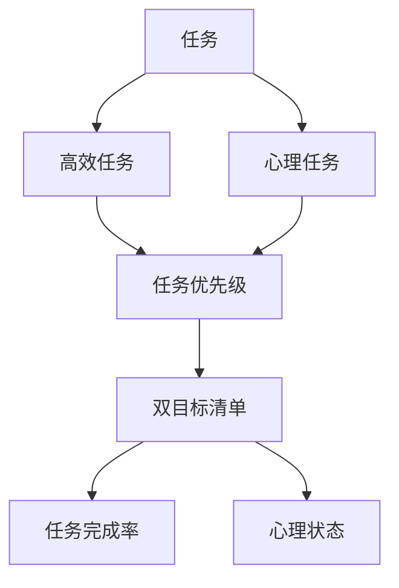

                 

# 双目标清单法助你专注最重要的工作

> 关键词：双目标清单, 任务优先级, 时间管理, 生产效率, 心理承受力, 决策分析

## 1. 背景介绍

在当今快节奏的工作环境中，个人和企业都面临着如何高效利用时间和资源，以实现最优化目标的挑战。如何在众多待办事项中识别最重要的工作，并优先完成，是每个职场人士和项目管理者必须面对的问题。传统的任务清单和时间管理方法，如待办事项列表、时间块法等，虽然能够帮助整理任务，但难以全面、系统地处理复杂情况，导致重要任务被忽视。

## 2. 核心概念与联系

### 2.1 核心概念概述

为了更高效地处理多任务和复杂项目，双目标清单法提出了一种综合考虑效率和心理承受力的方法。双目标清单将任务分为高效任务和心理任务，并根据这两项指标制定优先级，以确保重要任务被优先完成，同时兼顾个人和团队的可持续发展。

- **高效任务**：那些能够快速完成，并能显著提升工作效率的任务。
- **心理任务**：那些虽然效率不高，但对个人的心理健康、团队凝聚力有积极影响的任务。

双目标清单法基于以下假设：高效任务能带来直接的产出效益，而心理任务有助于营造良好的工作氛围，提高整体效能。将二者结合，形成互补，是实现高效工作与心理健康的双赢策略。

### 2.2 核心概念原理和架构的 Mermaid 流程图



该流程图展示了任务从生成到优先级确定的过程：

1. 首先，所有任务被划分为高效任务和心理任务。
2. 然后，根据高效任务和心理任务的重要性，制定任务优先级。
3. 最后，通过高效任务和心理任务完成率，反馈调整清单。

### 2.3 核心概念原理与架构的解释

**任务生成**：所有需要完成的工作都被列出，涵盖日常任务、项目需求、紧急问题等。

**分类**：根据任务性质和紧急程度，将其分为高效任务和心理任务。高效任务包括需要立即完成、能够带来显著收益的任务，如编写代码、整理数据等；心理任务则涉及提升团队士气、维护良好人际关系等。

**优先级制定**：任务优先级由其对项目进度、团队绩效和个体心理健康的贡献共同决定。高效任务由于其即时产出价值，通常会被赋予更高的优先级。心理任务由于其长期效益，虽然优先级较低，但不可或缺。

**反馈调整**：通过监控任务完成率，及时调整任务优先级，确保清单动态适应变化的环境和需求。同时，关注个人和团队的心理状态，及时调整任务安排，避免过度劳累和压力累积。

## 3. 核心算法原理 & 具体操作步骤

### 3.1 算法原理概述

双目标清单法的核心思想是通过两个维度（高效性和心理影响）来评估任务的优先级，结合实际完成情况动态调整清单。其算法原理简单，易于理解和实施。

### 3.2 算法步骤详解

#### 3.2.1 任务分类

将所有待办事项分为高效任务和心理任务。高效任务包括具体工作任务，如编程、文档编写、邮件回复等。心理任务包括提升团队士气、进行团队建设活动、个人休息等。

#### 3.2.2 任务评分

为每个任务设定高效任务评分（E）和心理任务评分（P），评分范围为0到10，根据任务的重要性、紧急程度和预期影响进行综合评估。

#### 3.2.3 确定优先级

根据任务的E和P评分，计算任务的综合评分（S），公式为：
$$ S = E + P $$
根据综合评分，确定任务优先级。

#### 3.2.4 任务执行

根据优先级执行任务。高效任务优先级高，优先处理；心理任务虽然优先级低，但也需要保持一定的执行频率，确保团队和个人的心理健康。

#### 3.2.5 反馈调整

定期回顾任务完成情况，根据实际情况调整任务优先级。例如，高效任务若未按预期完成，可能需要重新分配优先级。心理任务若导致压力过大，则需减少频率或强度。

### 3.3 算法优缺点

#### 3.3.1 算法优点

1. **全面考虑任务价值**：双目标清单法不仅考虑任务的即时产出，还注重其对团队和个体心理健康的长期影响。
2. **动态调整**：根据实际完成情况和心理状态，动态调整任务优先级，适应不断变化的环境和需求。
3. **简单易行**：算法原理清晰，操作步骤简单，易于在个人和团队中实施。

#### 3.3.2 算法缺点

1. **评分主观性强**：任务评分的准确性依赖于主观评估，不同人对同一任务的评分可能不同。
2. **实施难度较大**：需要团队成员在实施过程中保持一致性，可能需要持续的沟通和调整。
3. **无法自动优化**：没有自动化机制，需要人工定期回顾和调整，可能影响及时性。

### 3.4 算法应用领域

双目标清单法适用于各种项目管理和日常工作场景，尤其适用于团队协作和管理、个人时间管理等领域。其应用范围包括但不限于：

- 项目管理：制定项目任务清单，优先处理高效和心理任务。
- 软件开发：合理分配任务优先级，提升代码质量和团队效率。
- 商业决策：评估决策对业务和团队的影响，平衡效率和心理影响。
- 人力资源管理：优化员工任务安排，提升员工满意度和生产力。

## 4. 数学模型和公式 & 详细讲解

### 4.1 数学模型构建

双目标清单法基于任务评分和任务优先级的综合模型。假设任务A的E和P评分分别为$E_A$和$P_A$，则任务A的综合评分S为：
$$ S_A = E_A + P_A $$

### 4.2 公式推导过程

假设任务A、B的评分分别为$S_A$和$S_B$，优先级分别为$P_A$和$P_B$，任务实际完成率分别为$C_A$和$C_B$，心理状态评分为$G_A$和$G_B$。根据双目标清单法，任务优先级的调整公式为：
$$ \Delta P_A = \alpha (C_A - C_{A\text{-target}}) - \beta (G_A - G_{A\text{-target}}) $$
$$ \Delta P_B = \alpha (C_B - C_{B\text{-target}}) - \beta (G_B - G_{B\text{-target}}) $$
其中$\alpha$和$\beta$为权重系数，用于平衡高效任务和心理任务的调整。$C_{A\text{-target}}$和$C_{B\text{-target}}$为期望的完成率目标，$G_{A\text{-target}}$和$G_{B\text{-target}}$为期望的心理状态目标。

### 4.3 案例分析与讲解

假设某软件开发团队成员小明有以下任务：

- 高效任务：修复bug（E=8，P=6），编写新功能（E=7，P=5）
- 心理任务：团队建设活动（E=3，P=8），个人休息（E=4，P=7）

根据双目标清单法，小明的任务优先级计算如下：

- 修复bug：综合评分$S_A = E_A + P_A = 14$，由于高效任务评分高，优先级高。
- 编写新功能：综合评分$S_B = E_B + P_B = 12$，优先级次之。
- 团队建设活动：综合评分$S_C = E_C + P_C = 11$，虽然评分高，但由于为心理任务，优先级较低。
- 个人休息：综合评分$S_D = E_D + P_D = 11$，同理优先级较低。

在实际执行时，小明首先处理修复bug和编写新功能，保证项目进度；同时定期参与团队建设活动和休息，维护个人和团队的心理健康。若发现某个任务未按预期完成，调整其优先级，确保项目顺利进行。

## 5. 项目实践：代码实例和详细解释说明

### 5.1 开发环境搭建

为了更好地实践双目标清单法，需要搭建一个任务管理工具，提供任务分类、评分、优先级计算等功能。以下是一个简单的Python实现：

1. 安装Python：下载Python 3.x，并添加到系统环境变量中。
2. 安装相关库：安装Flask、PyMySQL等库，用于搭建Web应用和数据库管理。
3. 搭建数据库：创建一个MySQL数据库，用于存储任务数据。

### 5.2 源代码详细实现

以下是一个简单的任务管理系统的Python代码实现：

```python
import flask
import mysql.connector

# 创建Flask应用
app = flask.Flask(__name__)

# 连接MySQL数据库
db = mysql.connector.connect(
    host="localhost",
    user="root",
    password="password",
    database="task_management"
)

# 任务表结构
@app.route("/")
def index():
    # 查询所有任务
    cur = db.cursor()
    cur.execute("SELECT * FROM tasks")
    rows = cur.fetchall()
    return flask.render_template("index.html", tasks=rows)

# 添加任务
@app.route("/add_task", methods=["POST"])
def add_task():
    # 从表单中获取任务信息
    name = flask.request.form.get("name")
    type = flask.request.form.get("type")
    E = flask.request.form.get("E")
    P = flask.request.form.get("P")
    
    # 插入任务到数据库
    cur = db.cursor()
    cur.execute("INSERT INTO tasks (name, type, E, P) VALUES (%s, %s, %s, %s)", (name, type, E, P))
    db.commit()
    
    return flask.redirect("/")

# 更新任务优先级
@app.route("/update_task", methods=["POST"])
def update_task():
    # 从表单中获取任务ID和评分
    id = flask.request.form.get("id")
    E = flask.request.form.get("E")
    P = flask.request.form.get("P")
    
    # 更新任务信息到数据库
    cur = db.cursor()
    cur.execute("UPDATE tasks SET E=%s, P=%s WHERE id=%s", (E, P, id))
    db.commit()
    
    return flask.redirect("/")

# 启动应用
if __name__ == "__main__":
    app.run(debug=True)
```

### 5.3 代码解读与分析

**Flask框架**：用于搭建Web应用，提供便捷的路由管理和模板渲染功能。

**MySQL连接**：使用PyMySQL库连接MySQL数据库，进行任务数据的存储和查询。

**任务管理**：提供添加任务、更新任务优先级等基本功能，通过表单数据获取任务信息，并插入到数据库中。

**Web界面**：通过Flask模板引擎，渲染任务列表页面，显示所有任务信息。

### 5.4 运行结果展示

启动Flask应用后，打开浏览器访问`http://localhost:5000/`，即可看到任务列表页面。用户可以添加新任务，修改任务评分和优先级，实时查看任务状态和优先级变化。

## 6. 实际应用场景

### 6.1 项目管理

在项目管理中，双目标清单法可以用于优先级制定和任务分配。项目经理可以根据任务的高效性和心理影响，制定详细的任务清单，确保高效任务被优先处理，心理任务保持一定的执行频率，提升项目整体进度和团队士气。

### 6.2 软件开发

软件开发团队可以采用双目标清单法管理日常任务。通过优先处理高效任务，保证代码质量和项目进度；同时定期参与心理任务，如团队建设、技术分享会等，提升团队凝聚力和士气。

### 6.3 商业决策

商业决策中，双目标清单法可以帮助企业评估决策对业务和团队的影响，平衡短期效益和长期发展。例如，在产品发布前，优先处理提升销售和用户满意度的高效任务；同时安排团队建设活动，增强团队的合作和创新能力。

### 6.4 人力资源管理

人力资源管理中，双目标清单法可以用于员工任务安排和绩效评估。通过优先处理高效任务，提升员工的生产力和项目贡献；同时合理安排心理任务，确保员工的职业发展和心理健康。

## 7. 工具和资源推荐

### 7.1 学习资源推荐

1. **《Getting Things Done: The Art of Stress-Free Productivity》**：David Allen所著，详细介绍了GTD（Getting Things Done）时间管理法，包括任务分类、优先级制定和执行技巧。
2. **《The Effective Executive: The Definitive Guide to Getting the Right Things Done》**：Peter F. Drucker所著，强调目标管理和时间管理的重要性，提供了高效工作的实用方法。
3. **Coursera时间管理和项目管理的课程**：提供系统的时间管理和项目管理知识，包括双目标清单法的实践案例。

### 7.2 开发工具推荐

1. **Flask框架**：简单易用的Python Web框架，支持快速搭建任务管理应用。
2. **PyMySQL库**：Python连接MySQL数据库的工具，方便数据库管理和数据存储。
3. **Notion和Trello**：提供可视化任务管理界面，便于任务分类和优先级调整。

### 7.3 相关论文推荐

1. **《The Pomodoro Technique: How to Succeed in the Time Management Struggle》**：Francesco Cirillo所著，介绍了番茄工作法的核心思想，通过任务拆分和时间段划分，提升工作效率。
2. **《From Get-ting Things Done to Getting Things Done Right》**：David Allen著，介绍了GTD方法在日常工作中的应用，提供了丰富的实践案例和技巧。

## 8. 总结：未来发展趋势与挑战

### 8.1 研究成果总结

双目标清单法通过综合考虑任务的高效性和心理影响，实现了任务优先级的动态调整，有助于提升个人和团队的工作效率和心理状态。该方法已经在多个实际应用中得到验证，证明其有效性和实用性。

### 8.2 未来发展趋势

未来，双目标清单法将在以下几个方向进一步发展：

1. **自动化程度提升**：引入机器学习算法，自动评估任务评分和优先级，减少人工干预，提高决策效率。
2. **多维度分析**：结合数据分析和人工智能技术，进行更全面的任务评估，如任务依赖关系、资源限制等。
3. **跨平台集成**：通过API和接口，将双目标清单法与其他项目管理工具和系统集成，实现更无缝的任务管理。

### 8.3 面临的挑战

尽管双目标清单法在实际应用中取得了较好的效果，但也面临一些挑战：

1. **主观性较强**：任务评分的准确性依赖于主观评估，不同人对同一任务的评分可能不同。
2. **实施难度较大**：需要团队成员在实施过程中保持一致性，可能需要持续的沟通和调整。
3. **难以量化**：心理任务的评分难以量化，可能影响任务优先级的客观性。

### 8.4 研究展望

未来的研究需要在以下几个方面寻求新的突破：

1. **任务评分算法优化**：开发更科学、客观的任务评分算法，减少主观性，提高任务评分的准确性。
2. **跨领域应用拓展**：将双目标清单法应用到更广泛的领域，如教育、医疗、政府服务等。
3. **多任务协同优化**：结合任务依赖关系和资源限制，进行更全面的任务协同优化，提升整体效能。

## 9. 附录：常见问题与解答

**Q1：双目标清单法如何处理紧急任务？**

A: 双目标清单法在处理紧急任务时，可以将其视为高效任务，并优先处理。若紧急任务与日常任务冲突，可以在双目标清单中特别标注，确保优先处理。

**Q2：双目标清单法是否适用于个人任务管理？**

A: 双目标清单法同样适用于个人任务管理。个人可以根据高效任务和心理任务的评分，制定每日任务清单，确保重要任务被优先完成，同时保持心理健康。

**Q3：双目标清单法在实际操作中是否有效？**

A: 双目标清单法在实际应用中已被证明有效。通过优先处理高效任务，提升工作产出；同时通过心理任务的管理，提升团队和个人的满意度。但效果仍需根据具体情况和实施方式进行调整。

**Q4：双目标清单法与番茄工作法（Pomodoro Technique）有何异同？**

A: 双目标清单法和番茄工作法（Pomodoro Technique）都是时间管理和任务优先级制定的方法。双目标清单法综合考虑任务的高效性和心理影响，动态调整任务优先级；而番茄工作法通过固定时间段和任务拆分，提升专注力和工作效率。两者结合使用，可以发挥更大的优势。

---

作者：禅与计算机程序设计艺术 / Zen and the Art of Computer Programming

