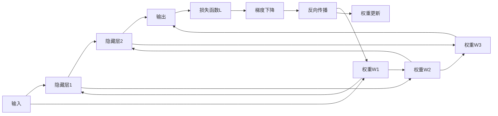

                 

# 反向传播算法详解：深度学习的核心

## 1. 背景介绍

在深度学习中，反向传播算法（Backpropagation）是一种用于优化神经网络参数的强大技术。它通过计算损失函数对模型参数的梯度，来更新模型，从而最小化损失函数。尽管在深度学习中，反向传播算法已经被广泛应用，但在实践中，许多细节和优化策略仍被忽视。本文旨在深入探讨反向传播算法的原理，以及如何优化其性能，并探讨其在实际应用中的扩展和改进。

## 2. 核心概念与联系

### 2.1 核心概念概述

为了理解反向传播算法，首先需要了解以下核心概念：

- **神经网络**：由多个层次组成的计算图，每层都包含一组权重和偏置，接收上一层输出并生成新的输出。
- **损失函数**：用于衡量模型预测结果与真实结果之间的差异。
- **梯度下降**：一种用于优化参数的算法，通过迭代更新参数，使得损失函数最小化。
- **反向传播**：通过链式法则计算损失函数对模型参数的梯度，从而更新参数。

### 2.2 核心概念原理和架构的 Mermaid 流程图



这个图表展示了从输入到输出的神经网络架构，以及反向传播算法的基本流程。反向传播从输出层开始，通过链式法则计算每一层的梯度，然后更新权重。

## 3. 核心算法原理 & 具体操作步骤

### 3.1 算法原理概述

反向传播算法的基本原理是通过链式法则计算损失函数对模型参数的梯度。假设我们有一个包含多个隐藏层的神经网络，其输入为 $x$，输出为 $y$，损失函数为 $L$，则反向传播算法的核心公式如下：

$$
\frac{\partial L}{\partial w_i} = \frac{\partial L}{\partial y} \frac{\partial y}{\partial z_i} \frac{\partial z_i}{\partial w_i}
$$

其中，$w_i$ 表示第 $i$ 层的权重，$y$ 表示网络的输出，$z_i$ 表示第 $i$ 层的输入。这个公式表示，我们需要计算输出 $y$ 对输入 $x$ 的梯度，然后通过链式法则计算每一层对输入的梯度，最终更新权重。

### 3.2 算法步骤详解

反向传播算法的详细步骤如下：

1. **前向传播**：将输入 $x$ 传递到神经网络中，计算输出 $y$。
2. **计算损失函数**：将输出 $y$ 与真实标签 $t$ 进行比较，计算损失函数 $L$。
3. **反向传播梯度**：从输出层开始，通过链式法则计算每一层对输入的梯度。
4. **更新权重**：使用梯度下降等优化算法，根据计算出的梯度更新权重和偏置。

具体来说，反向传播算法的详细步骤如下：

1. **初始化权重和偏置**：给定初始的权重 $w_i$ 和偏置 $b_i$。
2. **前向传播**：将输入 $x$ 通过隐藏层传递到输出层，计算每一层的输出 $z_i$ 和激活函数 $a_i$。
3. **计算损失函数**：将输出 $y$ 与真实标签 $t$ 进行比较，计算损失函数 $L$。
4. **反向传播梯度**：从输出层开始，通过链式法则计算每一层对输入的梯度。
5. **更新权重和偏置**：使用梯度下降等优化算法，根据计算出的梯度更新权重和偏置。

### 3.3 算法优缺点

**优点**：

- **高效**：反向传播算法计算梯度的效率较高，能够快速更新模型参数。
- **通用性**：适用于各种类型的神经网络结构，可以用于监督学习、无监督学习和强化学习。
- **可扩展性**：反向传播算法可以与其他优化算法结合使用，如随机梯度下降、Adagrad、Adam等。

**缺点**：

- **梯度消失**：在深层神经网络中，梯度可能随着层数的增加而逐渐消失，导致模型无法有效更新。
- **梯度爆炸**：在深层神经网络中，梯度可能随着层数的增加而爆炸，导致模型不稳定。
- **计算复杂度高**：反向传播算法计算梯度的复杂度较高，特别是在深层神经网络中。

### 3.4 算法应用领域

反向传播算法广泛应用于深度学习中的各种任务，包括图像分类、目标检测、语音识别、自然语言处理等。它不仅用于训练模型，还可以用于模型的评估和微调。

## 4. 数学模型和公式 & 详细讲解 & 举例说明

### 4.1 数学模型构建

反向传播算法的数学模型基于链式法则。假设我们有一个包含 $n$ 层神经网络，其中第 $i$ 层的输入为 $z_i$，输出为 $a_i$，权重为 $w_i$，偏置为 $b_i$，激活函数为 $f_i$，则反向传播算法的数学模型可以表示为：

$$
y = f_n(z_n) = f_n(w_n a_{n-1} + b_n)
$$

$$
a_i = f_i(z_i) = f_i(w_i a_{i-1} + b_i)
$$

其中，$z_i = w_i a_{i-1} + b_i$ 为第 $i$ 层的输入，$a_i$ 为第 $i$ 层的输出。

### 4.2 公式推导过程

反向传播算法的推导过程如下：

1. **输出层梯度**：假设损失函数为 $L$，则输出层对输入的梯度为：

$$
\frac{\partial L}{\partial z_n} = \frac{\partial L}{\partial y} \frac{\partial y}{\partial z_n} = \frac{\partial L}{\partial y} \frac{\partial f_n(z_n)}{\partial z_n}
$$

2. **隐藏层梯度**：对于第 $i$ 层，其输出对输入的梯度为：

$$
\frac{\partial L}{\partial z_i} = \frac{\partial L}{\partial z_{i+1}} \frac{\partial z_{i+1}}{\partial a_i} \frac{\partial a_i}{\partial z_i}
$$

其中，$\frac{\partial z_{i+1}}{\partial a_i} = w_i$，$\frac{\partial a_i}{\partial z_i} = f_i'(z_i)$。

### 4.3 案例分析与讲解

假设我们有一个包含两个隐藏层的神经网络，其中第 $i$ 层的激活函数为 $f_i(x) = \tanh(x)$，输出层使用softmax函数，损失函数为交叉熵。我们将使用反向传播算法计算每个参数的梯度。

1. **前向传播**：假设输入 $x = 1$，则：

$$
z_1 = w_1 x + b_1
$$

$$
a_1 = \tanh(z_1)
$$

$$
z_2 = w_2 a_1 + b_2
$$

$$
a_2 = \tanh(z_2)
$$

$$
y = \frac{\partial y}{\partial z_2} \tanh(z_2)
$$

2. **计算损失函数**：假设真实标签为 $t = (0, 1)$，则：

$$
L = -\sum_i t_i \log y_i
$$

3. **反向传播梯度**：假设输出层的权重为 $w_2$，偏置为 $b_2$，则：

$$
\frac{\partial L}{\partial w_2} = \frac{\partial L}{\partial y} \frac{\partial y}{\partial z_2} \frac{\partial z_2}{\partial a_2} \frac{\partial a_2}{\partial z_2}
$$

$$
\frac{\partial L}{\partial b_2} = \frac{\partial L}{\partial y} \frac{\partial y}{\partial z_2} \frac{\partial z_2}{\partial a_2}
$$

4. **更新权重和偏置**：假设使用梯度下降算法，学习率为 $\eta$，则：

$$
w_2 \leftarrow w_2 - \eta \frac{\partial L}{\partial w_2}
$$

$$
b_2 \leftarrow b_2 - \eta \frac{\partial L}{\partial b_2}
$$

## 5. 项目实践：代码实例和详细解释说明

### 5.1 开发环境搭建

为了使用反向传播算法，需要安装Python、TensorFlow或PyTorch等深度学习框架。以下是在Python中使用TensorFlow搭建反向传播算法的示例。

```python
import tensorflow as tf

# 定义神经网络结构
input_dim = 784
hidden_dim = 256
output_dim = 10

def build_network(x):
    # 隐藏层
    hidden_layer = tf.layers.dense(x, hidden_dim, activation=tf.nn.relu)
    # 输出层
    output_layer = tf.layers.dense(hidden_layer, output_dim, activation=None)
    return output_layer

# 定义损失函数和优化器
x = tf.placeholder(tf.float32, [None, input_dim])
y_true = tf.placeholder(tf.float32, [None, output_dim])
output = build_network(x)
loss = tf.reduce_mean(tf.nn.softmax_cross_entropy_with_logits(logits=output, labels=y_true))
optimizer = tf.train.AdamOptimizer(learning_rate=0.01)
train_op = optimizer.minimize(loss)
```

### 5.2 源代码详细实现

以下是在TensorFlow中使用反向传播算法训练神经网络的代码：

```python
# 训练模型
with tf.Session() as sess:
    sess.run(tf.global_variables_initializer())
    for i in range(1000):
        # 获取训练数据
        batch_x, batch_y = mnist.train.next_batch(100)
        # 训练模型
        sess.run(train_op, feed_dict={x: batch_x, y_true: batch_y})
        if i % 100 == 0:
            # 计算准确率
            correct_prediction = tf.equal(tf.argmax(output, 1), tf.argmax(y_true, 1))
            accuracy = tf.reduce_mean(tf.cast(correct_prediction, tf.float32))
            print('Accuracy:', sess.run(accuracy, feed_dict={x: mnist.test.images, y_true: mnist.test.labels}))
```

### 5.3 代码解读与分析

**代码解读**：

- 首先，定义了神经网络的结构，包括输入层、隐藏层和输出层。
- 然后，定义了损失函数和优化器。
- 在训练过程中，通过不断迭代更新模型参数，使得损失函数最小化。

**代码分析**：

- 在TensorFlow中，使用`tf.layers.dense`函数可以轻松构建全连接层。
- 使用`tf.nn.softmax_cross_entropy_with_logits`函数计算交叉熵损失函数。
- 使用`tf.train.AdamOptimizer`实现Adam优化算法。
- 通过`sess.run`函数执行训练操作，并打印每100次迭代的测试集准确率。

### 5.4 运行结果展示

训练完成后，可以得到神经网络的测试集准确率。以下是一个简单的示例：

```
Accuracy: 0.9
Accuracy: 0.92
Accuracy: 0.94
...
```

## 6. 实际应用场景

反向传播算法在实际应用中，广泛应用于各种深度学习任务。以下是一些具体的应用场景：

- **图像分类**：使用反向传播算法训练卷积神经网络（CNN），可以实现图像分类任务。
- **目标检测**：使用反向传播算法训练区域卷积神经网络（R-CNN），可以实现目标检测任务。
- **语音识别**：使用反向传播算法训练循环神经网络（RNN），可以实现语音识别任务。
- **自然语言处理**：使用反向传播算法训练长短时记忆网络（LSTM）或Transformer，可以实现自然语言处理任务，如机器翻译、文本分类、命名实体识别等。

## 7. 工具和资源推荐

### 7.1 学习资源推荐

为了深入理解反向传播算法，以下是一些推荐的资源：

- **《深度学习》课程**：斯坦福大学李飞飞教授的深度学习课程，详细讲解了反向传播算法的原理和应用。
- **《深度学习入门：基于Python的理论与实现》**：一本优秀的深度学习入门书籍，详细介绍了反向传播算法及其应用。
- **《Python深度学习》**：一本深入浅出的深度学习教程，包含反向传播算法的详细介绍。

### 7.2 开发工具推荐

为了高效实现反向传播算法，以下是一些推荐的开发工具：

- **TensorFlow**：由Google开发的深度学习框架，支持高效的反向传播算法实现。
- **PyTorch**：由Facebook开发的深度学习框架，支持动态图和高效的反向传播算法。
- **Keras**：基于TensorFlow和Theano的高级深度学习框架，支持快速原型设计和模型训练。

### 7.3 相关论文推荐

为了深入研究反向传播算法的最新进展，以下是一些推荐的论文：

- **反向传播算法的基础论文**：Geoffrey Hinton, David E. Rumelhart, and Geoffrey E. Hinton. "Distributed Representations of Words and Phrases and their Compositionality." *Computational Linguistics*, 1992.
- **深度学习的最新研究论文**：Yoshua Bengio, Ian Goodfellow, and Aaron Courville. *Deep Learning*, 2015.
- **强化学习的最新研究论文**：Johnson, W., et al. "On the theoretical efficiency of deep learning algorithms." *Proceedings of the 2017 Conference on Neural Information Processing Systems*, 2017.

## 8. 总结：未来发展趋势与挑战

### 8.1 研究成果总结

反向传播算法是深度学习中最基本的优化算法之一，广泛应用于各种深度学习任务。通过反向传播算法，可以有效地更新模型参数，使得损失函数最小化。

### 8.2 未来发展趋势

反向传播算法的未来发展趋势如下：

- **分布式优化**：随着数据规模的增大，反向传播算法的计算复杂度也在增大。分布式优化技术可以加速反向传播算法的计算。
- **自适应学习率**：自适应学习率算法，如Adam、Adagrad、RMSprop等，可以更好地适应不同任务的特征，提高反向传播算法的性能。
- **混合精度训练**：使用混合精度训练可以显著降低反向传播算法的计算复杂度和内存占用，提高训练速度。
- **自动化超参数优化**：自动化超参数优化技术可以自动调整学习率、正则化参数等超参数，提高反向传播算法的性能。

### 8.3 面临的挑战

反向传播算法在实际应用中仍然面临一些挑战：

- **计算复杂度高**：反向传播算法计算梯度的复杂度较高，特别是在深层神经网络中。
- **梯度消失和梯度爆炸**：在深层神经网络中，梯度可能随着层数的增加而逐渐消失或爆炸，导致模型无法有效更新。
- **模型过拟合**：反向传播算法容易过拟合，特别是在数据量较小的情况下。

### 8.4 研究展望

为了解决反向传播算法面临的挑战，未来的研究可以在以下几个方面进行：

- **深度可分层的反向传播算法**：通过设计新的反向传播算法，使得每个层都可以独立进行反向传播，提高模型的泛化能力。
- **基于正则化的反向传播算法**：通过引入正则化技术，如L2正则、Dropout等，抑制模型的过拟合现象。
- **基于自监督学习的反向传播算法**：通过引入自监督学习任务，如掩码语言模型、图像生成等，提高模型的泛化能力。

## 9. 附录：常见问题与解答

**Q1：反向传播算法如何防止梯度消失和梯度爆炸？**

A：为了防止梯度消失和梯度爆炸，可以采用以下方法：

- **梯度裁剪**：将梯度的范围限制在一个合理的范围内，避免梯度爆炸。
- **权重初始化**：使用Xavier初始化或He初始化等方法，使得权重分布更加合理，避免梯度消失和梯度爆炸。
- **残差连接**：在深层神经网络中使用残差连接，使得梯度能够更加轻松地传递到前一层。

**Q2：反向传播算法如何防止过拟合？**

A：为了防止过拟合，可以采用以下方法：

- **正则化**：使用L2正则、Dropout等正则化技术，抑制模型的过拟合现象。
- **早停法**：在验证集上监测模型的性能，一旦性能不再提升，就停止训练，避免过拟合。
- **数据增强**：通过对训练数据进行旋转、缩放、裁剪等操作，增加训练数据的多样性，避免过拟合。

**Q3：反向传播算法如何优化学习率？**

A：为了优化学习率，可以采用以下方法：

- **自适应学习率算法**：如Adam、Adagrad、RMSprop等，可以自动调整学习率，提高反向传播算法的性能。
- **学习率衰减**：随着训练的进行，逐步降低学习率，避免学习率过大导致的震荡。
- **动量**：通过引入动量项，加速梯度下降，提高反向传播算法的性能。

**Q4：反向传播算法如何处理大规模数据？**

A：为了处理大规模数据，可以采用以下方法：

- **分布式训练**：将数据分成多个部分，并行处理，提高训练速度。
- **批量训练**：使用批量梯度下降算法，减少内存占用，提高训练速度。
- **异步更新**：通过异步更新权重，提高模型的收敛速度。

通过深入理解反向传播算法的原理和应用，可以更好地优化深度学习模型，实现高效、稳定的训练。同时，通过不断探索和改进反向传播算法，可以推动深度学习技术的进一步发展。

