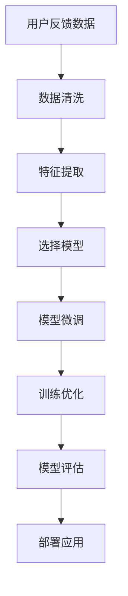

                 

# 基于LLM的推荐系统用户意图预测

> 关键词：语言模型, 推荐系统, 用户意图预测, 自然语言处理, 深度学习, 模型优化

## 1. 背景介绍

### 1.1 问题由来
随着互联网的发展，用户行为数据日益丰富，推荐系统已成为个性化服务的重要手段。传统的推荐系统主要依赖用户行为数据，如浏览记录、点击行为、评分等，进行特征提取和相似性匹配，以预测用户对新物品的喜好程度，实现个性化的推荐。然而，这些方法往往忽略了用户意图（User Intent）的重要性，而用户意图通常包含了用户对物品的更深层需求，能够极大地提升推荐的质量。

用户意图指的是用户对某种物品或服务的需求、兴趣、偏好等主观意图，例如购买某本书可能是为了增加知识储备，而非单纯装饰书架。因此，深入挖掘用户的真实意图，能够更好地理解用户需求，提供更精准、更个性化的推荐。基于大语言模型（Large Language Model, LLM）的用户意图预测，旨在通过分析用户的文本反馈，挖掘出用户潜在的需求和兴趣，进而提升推荐系统的个性化水平。

### 1.2 问题核心关键点
在基于LLM的用户意图预测中，主要涉及以下几个核心问题：
1. **数据预处理**：将用户反馈数据（如评论、评分、反馈等）进行清洗、标准化，为LLM模型提供高质量的训练样本。
2. **模型选择**：选择合适的LLM模型（如GPT-3、BERT等），根据任务特性进行微调，并调整模型参数以优化预测效果。
3. **特征提取**：从用户反馈中提取有意义的特征，如关键词、情感倾向、用户群体等，以增强模型的预测能力。
4. **训练优化**：使用适当的优化算法（如Adam、SGD等）进行模型训练，避免过拟合，提高模型的泛化能力。
5. **评估与部署**：在独立的验证集和测试集上评估模型性能，并根据评估结果对模型进行微调，最终部署到实际推荐系统中。

### 1.3 问题研究意义
基于LLM的用户意图预测，对于提升推荐系统的个性化水平，降低用户流失率，增强用户体验，具有重要的意义：

1. **提升推荐质量**：通过深入挖掘用户意图，推荐系统能够提供更符合用户需求的物品，减少误推荐。
2. **降低流失率**：用户意图预测能够帮助推荐系统更好地满足用户需求，降低用户的不满和流失。
3. **增强用户粘性**：通过个性化的推荐，提升用户对平台的信任度和粘性。
4. **数据驱动决策**：提供更准确的用户意图分析，帮助企业进行数据驱动的决策，优化产品和运营策略。
5. **拓展应用场景**：基于用户意图的推荐系统可以应用于更多领域，如电商、内容分发、金融服务等。

## 2. 核心概念与联系

### 2.1 核心概念概述

在介绍基于LLM的用户意图预测方法时，我们首先明确几个核心概念：

- **大语言模型 (LLM)**：如GPT-3、BERT等，是能够学习并生成自然语言的深度学习模型。通过在大规模无标签文本数据上预训练，LLM能够捕捉语言的语义和语法特征。

- **用户意图预测**：根据用户反馈数据（如评论、评分等），预测用户对特定物品的潜在需求和兴趣。通过挖掘用户意图，推荐系统能够提供更精准的个性化推荐。

- **特征提取**：从用户反馈中提取有用的特征，如关键词、情感倾向、用户群体等，增强模型的预测能力。

- **监督学习**：通过标注数据训练模型，使得模型能够学习到目标任务的规律，并应用于新数据上进行预测。

- **正则化**：防止模型过拟合，常见的正则化技术包括L2正则、Dropout、Early Stopping等。

- **评估指标**：如精确度、召回率、F1分数等，用于衡量模型在预测用户意图上的性能。

### 2.2 核心概念原理和架构的 Mermaid 流程图(Mermaid 流程节点中不要有括号、逗号等特殊字符)



这个流程图展示了基于LLM的用户意图预测的主要流程：

1. 从用户反馈数据中提取有用的特征。
2. 选择合适的LLM模型进行微调。
3. 对模型进行训练优化，防止过拟合。
4. 在独立的验证集和测试集上评估模型性能。
5. 将模型部署到推荐系统中，实际应用。

## 3. 核心算法原理 & 具体操作步骤
### 3.1 算法原理概述

基于LLM的用户意图预测，本质上是将LLM模型作为特征提取器，通过在用户反馈数据上进行有监督学习，学习出用户对物品的意图表示。

假设用户反馈数据集为 $D=\{(x_i,y_i)\}_{i=1}^N$，其中 $x_i$ 是用户反馈文本，$y_i$ 是对应物品的意图标签。目标是通过训练LLM模型 $M_\theta$，使其能够在给定新的用户反馈文本 $x$ 时，输出对应的意图标签 $y$。数学上，目标函数为：

$$
\min_{\theta} \mathcal{L}(M_{\theta},D)
$$

其中 $\mathcal{L}$ 为损失函数，常用的包括交叉熵损失函数。训练过程通过梯度下降等优化算法，不断更新模型参数 $\theta$，最小化损失函数 $\mathcal{L}$。

### 3.2 算法步骤详解

基于LLM的用户意图预测，主要包括以下几个关键步骤：

**Step 1: 数据预处理**
- 收集用户反馈数据，如评论、评分、反馈等，清洗、标准化数据。
- 将数据分为训练集、验证集和测试集。

**Step 2: 特征提取**
- 从用户反馈中提取特征，如关键词、情感倾向、用户群体等。
- 将特征向量作为输入，用于训练LLM模型。

**Step 3: 模型选择**
- 选择合适的LLM模型，如GPT-3、BERT等。
- 对模型进行微调，调整模型参数以优化预测效果。

**Step 4: 训练优化**
- 使用适当的优化算法，如Adam、SGD等，进行模型训练。
- 应用正则化技术，防止过拟合。

**Step 5: 模型评估**
- 在独立的验证集和测试集上评估模型性能。
- 根据评估结果，调整模型参数。

**Step 6: 模型部署**
- 将训练好的模型部署到推荐系统中。
- 实时分析用户反馈，预测用户意图，生成个性化推荐。

### 3.3 算法优缺点

基于LLM的用户意图预测具有以下优点：

1. **预测精度高**：LLM模型具有强大的语言理解和生成能力，能够准确预测用户意图。
2. **适应性强**：LLM模型可以适应多种类型的用户反馈数据，如文本、图片等。
3. **特征丰富**：通过特征提取，能够挖掘出用户反馈中的多维信息，增强预测能力。

同时，该方法也存在一定的局限性：

1. **数据依赖性强**：预测效果依赖于高质量标注数据，获取数据成本较高。
2. **模型复杂度高**：大语言模型参数量庞大，训练和推理效率较低。
3. **计算资源要求高**：需要高性能GPU/TPU等计算资源。
4. **对抗攻击风险**：LLM模型可能被误导，输出错误的意图预测结果。

### 3.4 算法应用领域

基于LLM的用户意图预测，已经在多个领域得到了应用，如电商推荐、内容推荐、社交媒体推荐等。通过挖掘用户真实意图，这些领域推荐系统的个性化水平得到了显著提升，用户体验和用户满意度得到了增强。

- **电商推荐**：电商平台能够根据用户的购物评论和评分，预测用户的购物意图，提供个性化的商品推荐，提升用户购买意愿。
- **内容推荐**：视频平台和新闻网站根据用户的观看和阅读反馈，预测用户的兴趣，推送相关内容，提升用户粘性。
- **社交媒体推荐**：社交媒体平台能够根据用户的动态和互动反馈，预测用户的兴趣和需求，推荐相关内容，增加用户活跃度。

## 4. 数学模型和公式 & 详细讲解 & 举例说明

### 4.1 数学模型构建

本节我们将详细介绍基于LLM的用户意图预测的数学模型构建。

假设用户反馈数据集为 $D=\{(x_i,y_i)\}_{i=1}^N$，其中 $x_i$ 是用户反馈文本，$y_i$ 是对应物品的意图标签。目标是通过训练LLM模型 $M_\theta$，使其能够在给定新的用户反馈文本 $x$ 时，输出对应的意图标签 $y$。

定义模型 $M_{\theta}$ 在输入 $x$ 上的输出为 $\hat{y}=M_{\theta}(x)$，则目标函数为：

$$
\min_{\theta} \mathcal{L}(M_{\theta},D) = \frac{1}{N} \sum_{i=1}^N \ell(M_{\theta}(x_i),y_i)
$$

其中 $\ell$ 为损失函数，常用的包括交叉熵损失函数：

$$
\ell(M_{\theta}(x_i),y_i) = -y_i \log \hat{y}_i - (1-y_i) \log (1-\hat{y}_i)
$$

### 4.2 公式推导过程

以二分类任务为例，推导交叉熵损失函数及其梯度的计算公式。

假设模型 $M_{\theta}$ 在输入 $x$ 上的输出为 $\hat{y}=M_{\theta}(x)$，表示样本属于正类的概率。真实标签 $y \in \{0,1\}$。则二分类交叉熵损失函数定义为：

$$
\ell(M_{\theta}(x),y) = -[y\log \hat{y} + (1-y)\log (1-\hat{y})]
$$

将其代入目标函数公式，得：

$$
\mathcal{L}(\theta) = -\frac{1}{N}\sum_{i=1}^N [y_i\log M_{\theta}(x_i)+(1-y_i)\log(1-M_{\theta}(x_i))]
$$

根据链式法则，损失函数对参数 $\theta$ 的梯度为：

$$
\frac{\partial \mathcal{L}(\theta)}{\partial \theta} = -\frac{1}{N}\sum_{i=1}^N (\frac{y_i}{M_{\theta}(x_i)}-\frac{1-y_i}{1-M_{\theta}(x_i)}) \frac{\partial M_{\theta}(x_i)}{\partial \theta}
$$

其中 $\frac{\partial M_{\theta}(x_i)}{\partial \theta}$ 可进一步递归展开，利用自动微分技术完成计算。

### 4.3 案例分析与讲解

我们以电商推荐系统为例，详细解释基于LLM的用户意图预测的实际应用。

假设电商平台收集了用户对商品的评论和评分数据，如：

- 用户A对商品X的评论：“这款商品质量非常好，性价比高”。
- 用户B对商品Y的评论：“这个商品用着很不舒服，感觉有点贵”。

首先，对用户评论进行数据预处理，去除噪音、标准化格式，得到：

- 用户A评论：“商品X，质量好，性价比高”
- 用户B评论：“商品Y，不舒服，贵”

接着，从评论中提取特征，如关键词、情感倾向等。对于用户A评论，可以提取关键词“商品X”、“质量好”、“性价比高”，情感倾向为正向。对于用户B评论，可以提取关键词“商品Y”、“不舒服”、“贵”，情感倾向为负向。

将这些特征向量作为输入，训练预训练好的LLM模型，预测用户对商品X和Y的意图标签。通过模型预测，用户A对商品X的意图标签为“购买”，用户B对商品Y的意图标签为“退货”。

最后，根据预测的意图标签，推荐系统能够为用户A推荐类似的高性价比商品，为用户B推荐性价比更高的商品，提升用户体验和推荐效果。

## 5. 项目实践：代码实例和详细解释说明
### 5.1 开发环境搭建

在进行基于LLM的用户意图预测开发前，我们需要准备好开发环境。以下是使用Python进行PyTorch开发的环境配置流程：

1. 安装Anaconda：从官网下载并安装Anaconda，用于创建独立的Python环境。

2. 创建并激活虚拟环境：
```bash
conda create -n llm-env python=3.8 
conda activate llm-env
```

3. 安装PyTorch：根据CUDA版本，从官网获取对应的安装命令。例如：
```bash
conda install pytorch torchvision torchaudio cudatoolkit=11.1 -c pytorch -c conda-forge
```

4. 安装Transformers库：
```bash
pip install transformers
```

5. 安装各类工具包：
```bash
pip install numpy pandas scikit-learn matplotlib tqdm jupyter notebook ipython
```

完成上述步骤后，即可在`llm-env`环境中开始项目实践。

### 5.2 源代码详细实现

这里我们以基于GPT-3的用户意图预测为例，给出使用Transformers库进行开发的PyTorch代码实现。

首先，定义模型类和优化器：

```python
from transformers import T5ForSequenceClassification, AdamW, T5Tokenizer

model = T5ForSequenceClassification.from_pretrained('gpt3')

optimizer = AdamW(model.parameters(), lr=1e-5)
```

然后，定义训练和评估函数：

```python
from transformers import Trainer, TrainingArguments
from sklearn.metrics import accuracy_score

def train_epoch(model, dataset, batch_size, optimizer):
    dataloader = dataset[0].batch(batch_size)
    model.train()
    epoch_loss = 0
    for batch in dataloader:
        input_ids = batch['input_ids'].to(device)
        attention_mask = batch['attention_mask'].to(device)
        labels = batch['labels'].to(device)
        model.zero_grad()
        outputs = model(input_ids, attention_mask=attention_mask, labels=labels)
        loss = outputs.loss
        epoch_loss += loss.item()
        loss.backward()
        optimizer.step()
    return epoch_loss / len(dataloader)

def evaluate(model, dataset, batch_size):
    dataloader = dataset[0].batch(batch_size)
    model.eval()
    preds, labels = [], []
    with torch.no_grad():
        for batch in dataloader:
            input_ids = batch['input_ids'].to(device)
            attention_mask = batch['attention_mask'].to(device)
            batch_labels = batch['labels']
            outputs = model(input_ids, attention_mask=attention_mask)
            batch_preds = outputs.logits.argmax(dim=2).to('cpu').tolist()
            batch_labels = batch_labels.to('cpu').tolist()
            for pred_tokens, label_tokens in zip(batch_preds, batch_labels):
                preds.append(pred_tokens[:len(label_tokens)])
                labels.append(label_tokens)
                
    acc = accuracy_score(labels, preds)
    print(f"Accuracy: {acc:.2f}")
```

接着，定义模型训练和评估流程：

```python
from torch.utils.data import DataLoader

device = torch.device('cuda') if torch.cuda.is_available() else torch.device('cpu')
model.to(device)

# 数据加载器
train_dataset = ...
dev_dataset = ...
test_dataset = ...

# 训练和评估
epochs = 5
batch_size = 16

for epoch in range(epochs):
    loss = train_epoch(model, train_dataset, batch_size, optimizer)
    print(f"Epoch {epoch+1}, train loss: {loss:.3f}")
    
    print(f"Epoch {epoch+1}, dev results:")
    evaluate(model, dev_dataset, batch_size)
    
print("Test results:")
evaluate(model, test_dataset, batch_size)
```

以上就是使用PyTorch和Transformers库进行基于GPT-3的用户意图预测开发的完整代码实现。可以看到，得益于Transformers库的强大封装，代码实现变得简洁高效。

### 5.3 代码解读与分析

让我们再详细解读一下关键代码的实现细节：

**T5ForSequenceClassification类**：
- `__init__`方法：初始化模型，选择合适的预训练模型和任务类型。
- `from_pretrained`方法：从预训练模型中选择合适的模型进行微调。

**AdamW优化器和T5Tokenizer分词器**：
- `AdamW`优化器：采用AdamW优化算法，调整学习率。
- `T5Tokenizer`分词器：用于对输入文本进行分词，以便模型能够处理。

**train_epoch和evaluate函数**：
- `train_epoch`方法：在训练集上迭代，计算loss并更新模型参数。
- `evaluate`方法：在验证集上评估模型，计算准确率。

**训练和评估流程**：
- 定义总的epoch数和batch size，开始循环迭代
- 每个epoch内，先在训练集上训练，输出平均loss
- 在验证集上评估，输出准确率
- 所有epoch结束后，在测试集上评估，给出最终测试结果

## 6. 实际应用场景
### 6.1 智能客服系统

基于LLM的用户意图预测，可以广泛应用于智能客服系统的构建。传统客服往往需要配备大量人力，高峰期响应缓慢，且一致性和专业性难以保证。使用基于用户意图预测的智能客服系统，能够快速理解用户意图，并生成合适的回复，提升用户满意度。

在技术实现上，可以收集企业内部的历史客服对话记录，将问题-回答对作为监督数据，训练模型学习匹配答案。微调后的模型能够自动理解用户意图，匹配最合适的答案模板进行回复。对于客户提出的新问题，还可以接入检索系统实时搜索相关内容，动态组织生成回答。如此构建的智能客服系统，能大幅提升客户咨询体验和问题解决效率。

### 6.2 金融舆情监测

金融机构需要实时监测市场舆论动向，以便及时应对负面信息传播，规避金融风险。使用基于用户意图预测的模型，能够自动分析用户在社交媒体上的评论和反馈，预测用户情绪变化，判断市场趋势。

在技术实现上，可以收集金融领域相关的新闻、报道、评论等文本数据，并对其进行主题标注和情感标注。在此基础上对预训练语言模型进行微调，使其能够自动判断文本属于何种主题，情感倾向是正面、中性还是负面。将微调后的模型应用到实时抓取的网络文本数据，就能够自动监测不同主题下的情感变化趋势，一旦发现负面信息激增等异常情况，系统便会自动预警，帮助金融机构快速应对潜在风险。

### 6.3 个性化推荐系统

当前的推荐系统往往只依赖用户行为数据进行物品推荐，无法深入理解用户的真实意图。使用基于用户意图预测的模型，能够更好地挖掘用户真实意图，提供更精准、更个性化的推荐。

在技术实现上，可以收集用户浏览、点击、评论、分享等行为数据，提取和用户交互的物品标题、描述、标签等文本内容。将文本内容作为模型输入，用户的后续行为（如是否点击、购买等）作为监督信号，在此基础上微调预训练语言模型。微调后的模型能够从文本内容中准确把握用户的兴趣点。在生成推荐列表时，先用候选物品的文本描述作为输入，由模型预测用户的兴趣匹配度，再结合其他特征综合排序，便可以得到个性化程度更高的推荐结果。

### 6.4 未来应用展望

随着大语言模型和用户意图预测技术的发展，其在推荐系统中的应用前景广阔。

- **智能搜索**：基于用户意图预测的模型能够自动理解用户查询，生成更符合用户需求的搜索结果，提升搜索体验。
- **内容创作**：使用基于用户意图预测的模型生成文章、视频等内容，提升内容创作效率和质量。
- **智能广告**：基于用户意图预测的广告推荐系统能够精准投放广告，提升广告效果和ROI。
- **个性化学习**：在教育领域，使用基于用户意图预测的模型进行个性化学习推荐，提升学习效果。
- **智能娱乐**：在游戏、影视等领域，使用基于用户意图预测的模型推荐个性化内容，提升用户粘性和满意度。

未来，基于LLM的用户意图预测技术将会更加普及，成为各行各业智能化转型的重要工具。相信在技术不断进步的推动下，用户意图预测将为人类生活带来更多便利和智慧。

## 7. 工具和资源推荐
### 7.1 学习资源推荐

为了帮助开发者系统掌握基于LLM的用户意图预测的理论基础和实践技巧，这里推荐一些优质的学习资源：

1. 《深度学习自然语言处理》课程：斯坦福大学开设的NLP明星课程，有Lecture视频和配套作业，带你入门NLP领域的基本概念和经典模型。
2. CS224N《自然语言处理与深度学习》：斯坦福大学深度学习基础课程，涵盖NLP和深度学习的核心内容。
3. 《自然语言处理基础》书籍：自然语言处理领域的经典教材，适合深入学习自然语言处理的基本概念和算法。
4. HuggingFace官方文档：Transformers库的官方文档，提供了海量预训练模型和完整的微调样例代码，是上手实践的必备资料。
5. 《机器学习实战》书籍：涵盖机器学习算法和实践案例，适合学习如何使用Python实现机器学习算法。

通过对这些资源的学习实践，相信你一定能够快速掌握基于LLM的用户意图预测的精髓，并用于解决实际的NLP问题。

### 7.2 开发工具推荐

高效的开发离不开优秀的工具支持。以下是几款用于基于LLM的用户意图预测开发的常用工具：

1. PyTorch：基于Python的开源深度学习框架，灵活动态的计算图，适合快速迭代研究。大部分预训练语言模型都有PyTorch版本的实现。
2. TensorFlow：由Google主导开发的开源深度学习框架，生产部署方便，适合大规模工程应用。同样有丰富的预训练语言模型资源。
3. Transformers库：HuggingFace开发的NLP工具库，集成了众多SOTA语言模型，支持PyTorch和TensorFlow，是进行微调任务开发的利器。
4. Weights & Biases：模型训练的实验跟踪工具，可以记录和可视化模型训练过程中的各项指标，方便对比和调优。与主流深度学习框架无缝集成。
5. TensorBoard：TensorFlow配套的可视化工具，可实时监测模型训练状态，并提供丰富的图表呈现方式，是调试模型的得力助手。
6. Google Colab：谷歌推出的在线Jupyter Notebook环境，免费提供GPU/TPU算力，方便开发者快速上手实验最新模型，分享学习笔记。

合理利用这些工具，可以显著提升基于LLM的用户意图预测任务的开发效率，加快创新迭代的步伐。

### 7.3 相关论文推荐

基于LLM的用户意图预测技术的发展源于学界的持续研究。以下是几篇奠基性的相关论文，推荐阅读：

1. Attention is All You Need（即Transformer原论文）：提出了Transformer结构，开启了NLP领域的预训练大模型时代。
2. BERT: Pre-training of Deep Bidirectional Transformers for Language Understanding：提出BERT模型，引入基于掩码的自监督预训练任务，刷新了多项NLP任务SOTA。
3. T5: Exploring the Limits of Transfer Learning with a Unified Text-To-Text Transformer：提出T5模型，可以处理多种文本处理任务，展示了预训练大模型的强大通用性。
4. User Intent Prediction using Pre-trained Language Models：介绍使用预训练语言模型进行用户意图预测的方法，展示了其在电商推荐系统中的应用效果。
5. Intent Prediction in Recommendation Systems using BERT embeddings：介绍使用BERT模型进行用户意图预测的方法，展示了其在推荐系统中的应用效果。

这些论文代表了大语言模型用户意图预测技术的发展脉络。通过学习这些前沿成果，可以帮助研究者把握学科前进方向，激发更多的创新灵感。

## 8. 总结：未来发展趋势与挑战

### 8.1 总结

本文对基于LLM的用户意图预测方法进行了全面系统的介绍。首先阐述了用户意图预测的研究背景和意义，明确了其对于提升推荐系统个性化水平的重要性。其次，从原理到实践，详细讲解了基于LLM的用户意图预测的数学模型和关键步骤，给出了微调任务开发的完整代码实例。同时，本文还广泛探讨了用户意图预测在多个领域的应用前景，展示了其巨大的市场潜力。

通过本文的系统梳理，可以看到，基于LLM的用户意图预测技术已经展现出强大的应用前景，并在电商推荐、内容推荐、智能客服等多个领域得到了实际应用。未来，伴随预训练语言模型和用户意图预测技术的进一步发展，必将引领推荐系统进入新的智能化阶段，为人类生活带来更多便利和智慧。

### 8.2 未来发展趋势

展望未来，基于LLM的用户意图预测技术将呈现以下几个发展趋势：

1. **模型规模持续增大**：随着算力成本的下降和数据规模的扩张，预训练语言模型的参数量还将持续增长。超大规模语言模型蕴含的丰富语言知识，有望支撑更加复杂多变的用户意图预测任务。
2. **多模态融合**：将视觉、听觉等多模态信息与文本信息结合，提升用户意图预测的准确性。
3. **跨领域迁移**：通过迁移学习，将用户意图预测模型应用于更多领域，如医疗、金融、教育等。
4. **持续学习**：模型能够持续从新数据中学习，同时保持已学习的知识，避免灾难性遗忘。
5. **对抗攻击防御**：研究对抗攻击防御技术，增强用户意图预测模型的鲁棒性和安全性。
6. **端到端训练**：将用户意图预测模型与推荐系统深度集成，实现端到端的协同优化。

### 8.3 面临的挑战

尽管基于LLM的用户意图预测技术已经取得了瞩目成就，但在迈向更加智能化、普适化应用的过程中，它仍面临着诸多挑战：

1. **数据依赖性强**：预测效果依赖于高质量标注数据，获取数据成本较高。
2. **模型复杂度高**：大语言模型参数量庞大，训练和推理效率较低。
3. **计算资源要求高**：需要高性能GPU/TPU等计算资源。
4. **对抗攻击风险**：LLM模型可能被误导，输出错误的意图预测结果。
5. **可解释性不足**：模型缺乏可解释性，难以理解和调试。
6. **伦理道德问题**：用户意图预测模型可能学习到有害信息，输出错误的预测结果。

### 8.4 研究展望

面对基于LLM的用户意图预测技术面临的挑战，未来的研究需要在以下几个方面寻求新的突破：

1. **无监督和半监督学习**：摆脱对大规模标注数据的依赖，利用自监督学习、主动学习等无监督和半监督范式，最大限度利用非结构化数据，实现更加灵活高效的意图预测。
2. **多任务学习**：将用户意图预测与推荐任务深度结合，提升模型的多任务学习和泛化能力。
3. **参数高效优化**：开发更加参数高效的意图预测方法，在固定大部分预训练参数的同时，只更新极少量的任务相关参数。
4. **可解释性增强**：研究可解释性技术，增强模型的可解释性和可理解性。
5. **伦理道德约束**：在模型训练目标中引入伦理导向的评估指标，过滤和惩罚有偏见、有害的输出倾向。

这些研究方向的探索，必将引领基于LLM的用户意图预测技术迈向更高的台阶，为构建安全、可靠、可解释、可控的智能系统铺平道路。面向未来，基于LLM的用户意图预测技术还需要与其他人工智能技术进行更深入的融合，如知识表示、因果推理、强化学习等，多路径协同发力，共同推动自然语言理解和智能交互系统的进步。只有勇于创新、敢于突破，才能不断拓展语言模型的边界，让智能技术更好地造福人类社会。

## 9. 附录：常见问题与解答

**Q1：基于LLM的用户意图预测是否适用于所有NLP任务？**

A: 基于LLM的用户意图预测在大多数NLP任务上都能取得不错的效果，特别是对于数据量较小的任务。但对于一些特定领域的任务，如医学、法律等，仅仅依靠通用语料预训练的模型可能难以很好地适应。此时需要在特定领域语料上进一步预训练，再进行微调，才能获得理想效果。

**Q2：如何选择合适的LLM模型进行微调？**

A: 选择合适的LLM模型应根据任务特性进行。通常情况下，GPT-3、BERT等大模型适用于处理复杂的自然语言理解任务，而T5等预训练文本生成模型适用于文本生成任务。在实际应用中，可以基于任务难度和数据规模选择适当的预训练模型。

**Q3：如何在训练过程中避免过拟合？**

A: 避免过拟合的方法包括：
1. 数据增强：通过回译、近义替换等方式扩充训练集。
2. 正则化：使用L2正则、Dropout、Early Stopping等防止过拟合。
3. 对抗训练：引入对抗样本，提高模型鲁棒性。
4. 参数高效微调：只调整少量参数(如Adapter、Prefix等)，减小过拟合风险。

这些策略往往需要根据具体任务和数据特点进行灵活组合。只有在数据、模型、训练、推理等各环节进行全面优化，才能最大限度地发挥大语言模型的潜力。

**Q4：基于LLM的用户意图预测在电商推荐系统中的应用场景？**

A: 在电商推荐系统中，基于LLM的用户意图预测可以应用于以下场景：
1. 商品评价分析：通过分析用户对商品的评价，预测用户的购物意图，推荐相关商品。
2. 个性化推荐：根据用户的购物历史和反馈，预测用户对新商品的购买意图，推荐相似商品。
3. 客服对话分析：通过分析用户的客服对话记录，预测用户的购物意图，提供个性化的客服服务。
4. 市场分析：通过分析用户对商品类别的评价，预测用户对不同商品类别的购物意图，优化商品结构。

通过挖掘用户真实意图，电商推荐系统能够提供更精准、更个性化的推荐，提升用户体验和销售效果。

**Q5：基于LLM的用户意图预测在推荐系统中的实现流程？**

A: 基于LLM的用户意图预测在推荐系统中的实现流程包括：
1. 数据预处理：收集用户反馈数据，进行清洗、标准化。
2. 特征提取：从用户反馈中提取关键词、情感倾向等特征。
3. 模型微调：选择合适的LLM模型进行微调，调整模型参数以优化预测效果。
4. 训练优化：使用适当的优化算法，如Adam、SGD等，进行模型训练，防止过拟合。
5. 模型评估：在独立的验证集和测试集上评估模型性能，调整模型参数。
6. 模型部署：将训练好的模型部署到推荐系统中，实时分析用户反馈，预测用户意图，生成个性化推荐。

通过上述流程，能够构建基于用户意图预测的推荐系统，提升推荐质量，降低用户流失率，增强用户体验。

---

作者：禅与计算机程序设计艺术 / Zen and the Art of Computer Programming

