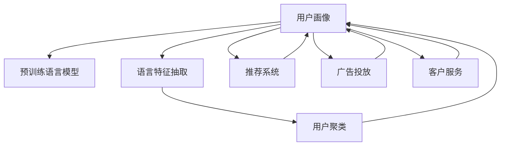

                 

# 基于LLM的用户画像构建方法

## 1. 背景介绍

### 1.1 问题由来
用户画像(User Profile)是了解用户行为、偏好、需求的重要工具，广泛应用于个性化推荐、广告投放、客户服务等多个领域。构建准确的的用户画像能够帮助企业精准定位目标用户群体，提升营销效果，优化客户体验。然而，传统用户画像的构建方法往往依赖于问卷调查、用户交互日志等数据，数据采集成本高，且难以获取全面的用户信息。

随着深度学习技术和大规模预训练语言模型(LLMs, Large Language Models)的兴起，基于自然语言处理(NLP)方法构建用户画像成为新的研究热点。使用LLMs能够从海量的网络文本数据中自动抽取用户的语言特征，并通过文本相似度计算等方式构建用户画像。该方法相较于传统方法，不仅采集成本低，且能够更全面地反映用户行为和心理特征。

### 1.2 问题核心关键点
构建用户画像的关键在于如何从文本数据中抽取和表示用户的语言特征。基于LLMs的用户画像构建方法通常包括以下几个关键步骤：
1. 数据预处理：对用户行为数据进行清洗、过滤，并转化为文本格式。
2. 特征抽取：使用LLMs自动抽取用户文本中的语言特征，如情感、兴趣、场景等。
3. 用户聚类：对抽取的特征进行聚类，将相似用户划分为同一画像。
4. 画像构建：根据用户聚类结果，构建详细的用户画像。
5. 画像应用：将用户画像应用于推荐系统、广告投放、客户服务等多个场景。

本文将从原理到实践，系统介绍基于LLMs的用户画像构建方法，并给出具体实现示例。

## 2. 核心概念与联系

### 2.1 核心概念概述

为更好地理解基于LLMs的用户画像构建方法，本节将介绍几个密切相关的核心概念：

- 用户画像(User Profile)：描述用户特征和行为，通过聚类和建模生成用户标签。
- 预训练语言模型(LLM)：如BERT、GPT等大规模预训练模型，能够学习丰富的语言知识。
- 语言特征抽取：使用LLM抽取文本中的情感、兴趣、场景等信息。
- 用户聚类：对用户特征进行聚类，生成不同类型用户画像。
- 推荐系统：使用用户画像指导推荐算法，提升个性化推荐效果。
- 广告投放：通过用户画像精准定位目标用户，优化广告投放策略。
- 客户服务：使用用户画像提供个性化服务，提升客户满意度。

这些核心概念之间的逻辑关系可以通过以下Mermaid流程图来展示：



这个流程图展示了大语言模型的核心概念及其之间的关系：

1. 用户画像通过预训练语言模型进行特征抽取和聚类。
2. 用户聚类结果用于指导推荐系统、广告投放和客户服务，形成闭环。

这些概念共同构成了基于LLMs的用户画像构建框架，使其能够在各种场景下发挥作用。

## 3. 核心算法原理 & 具体操作步骤

### 3.1 算法原理概述

基于LLMs的用户画像构建方法，本质上是一个通过自然语言处理技术自动抽取和表示用户特征的过程。其核心思想是：将用户行为数据转化为文本，使用LLMs自动抽取文本中的情感、兴趣、场景等信息，并通过聚类和建模生成详细的用户画像。

形式化地，假设用户行为数据为 $D=\{(x_i,y_i)\}_{i=1}^N$，其中 $x_i$ 为用户行为描述，$y_i$ 为对应的用户标签。使用预训练语言模型 $M_{\theta}$ 作为特征抽取器，抽取每个行为描述的特征表示 $f(x_i)=M_{\theta}(x_i)$。通过聚类算法对特征表示进行聚类，得到 $K$ 个用户画像 $P_k=\{x_i|f(x_i) \in C_k\}$，其中 $C_k$ 为聚类中心。最终通过建模将用户画像转化为更详细的用户特征描述。

### 3.2 算法步骤详解

基于LLMs的用户画像构建一般包括以下几个关键步骤：

**Step 1: 数据预处理**
- 收集用户行为数据，如搜索记录、购买记录、评价记录等。
- 对原始数据进行清洗和格式转换，去除无关信息，保留文本信息。
- 对文本进行分词、去停用词、词干化等预处理，形成标准化的输入。

**Step 2: 特征抽取**
- 选择预训练语言模型 $M_{\theta}$，如BERT、GPT等，作为特征抽取器。
- 将预处理后的文本输入模型，获取每个行为描述的特征表示 $f(x_i)$。

**Step 3: 用户聚类**
- 定义合适的聚类算法，如K-Means、层次聚类、DBSCAN等，对特征表示进行聚类。
- 确定聚类数目 $K$，将相似用户划分到同一聚类中。
- 通过可视化工具展示聚类结果，确保聚类效果符合预期。

**Step 4: 画像构建**
- 根据聚类结果，选取聚类中心作为用户画像的代表。
- 对每个聚类，进一步抽取和建模，生成详细的用户画像，如兴趣、行为、情感等。
- 对画像结果进行后处理，去除噪声和冗余信息，生成最终的用户画像。

**Step 5: 画像应用**
- 将用户画像应用于推荐系统，通过相似性匹配推荐相似物品。
- 将用户画像应用于广告投放，通过用户画像定向投放广告。
- 将用户画像应用于客户服务，提供个性化服务建议。

以上是基于LLMs的用户画像构建的一般流程。在实际应用中，还需要针对具体任务的特点，对聚类算法和画像建模进行优化设计，以进一步提升模型性能。

### 3.3 算法优缺点

基于LLMs的用户画像构建方法具有以下优点：
1. 数据采集成本低。相较于传统方法，基于LLMs的用户画像构建所需的数据采集成本更低，可以采用网络爬虫等方式自动获取。
2. 自动化程度高。通过预训练语言模型自动抽取用户特征，减少了人工干预，提高了构建效率。
3. 特征丰富全面。大语言模型能够抽取多种语言特征，如情感、兴趣、场景等，使用户画像更加全面。
4. 实时动态更新。基于LLMs的用户画像能够随着用户行为数据的增加而实时更新，保持用户画像的时效性。

同时，该方法也存在一定的局限性：
1. 数据噪音影响。用户行为数据中可能存在噪声和异常数据，影响特征抽取效果。
2. 语义理解误差。预训练模型可能无法准确理解用户的真实意图，导致特征抽取的偏差。
3. 聚类效果敏感。聚类算法对输入特征的分布和数量非常敏感，需要仔细选择算法和参数。
4. 画像维度高。用户画像的维度可能过高，难以进行可视化展示和应用。
5. 隐私风险。使用用户行为数据构建用户画像，可能涉及用户隐私问题，需确保合规性。

尽管存在这些局限性，但基于LLMs的用户画像构建方法仍具有广泛的应用前景。未来相关研究的重点在于如何进一步提高特征抽取的准确性，降低聚类对输入数据的敏感性，并兼顾隐私保护和用户画像的实际应用效果。

### 3.4 算法应用领域

基于LLMs的用户画像构建方法在多个领域均有广泛应用：

- 推荐系统：使用用户画像指导推荐算法，提供个性化推荐。
- 广告投放：通过用户画像进行精准定向，提升广告投放效果。
- 客户服务：根据用户画像提供个性化服务建议，提升客户满意度。
- 金融风控：使用用户画像进行风险评估，防止欺诈行为。
- 市场营销：通过用户画像分析用户群体特征，优化市场策略。
- 智能家居：使用用户画像指导智能设备的操作，提升用户体验。

除了上述这些经典应用外，基于LLMs的用户画像构建技术还被创新性地应用到更多场景中，如可控文本生成、情感分析、社交网络分析等，为NLP技术带来了全新的突破。

## 4. 数学模型和公式 & 详细讲解

### 4.1 数学模型构建

本节将使用数学语言对基于LLMs的用户画像构建过程进行更加严格的刻画。

假设用户行为数据为 $D=\{(x_i,y_i)\}_{i=1}^N$，其中 $x_i$ 为文本描述，$y_i$ 为对应的用户标签。定义用户画像 $P_k=\{x_i|f(x_i) \in C_k\}$，其中 $C_k$ 为聚类中心。

使用预训练语言模型 $M_{\theta}$ 作为特征抽取器，将每个行为描述转化为特征表示 $f(x_i)=M_{\theta}(x_i)$。则特征表示的聚类问题可以形式化为：

$$
C_k = \arg\min_{C \in \mathcal{C}} \sum_{x_i \in P_k} \|f(x_i) - C\|
$$

其中 $\mathcal{C}$ 为聚类中心集合，$\|\cdot\|$ 为距离度量函数，$\|f(x_i) - C\|$ 为每个用户行为描述与聚类中心的距离。

最终，将用户画像 $P_k$ 转化为详细的用户特征描述 $H_k$，可以采用多种方式，如维度降维、概率建模等。

### 4.2 公式推导过程

以下我们以K-Means聚类为例，推导用户特征的聚类过程。

假设用户行为描述为 $x_1, x_2, \ldots, x_N$，对应的聚类中心为 $C_1, C_2, \ldots, C_K$。使用预训练语言模型 $M_{\theta}$ 抽取每个行为描述的特征表示 $f(x_i)$。

K-Means聚类的目标是最小化每个用户行为描述与聚类中心的距离之和：

$$
\min_{C} \sum_{x_i \in P_k} \|f(x_i) - C\|
$$

其中 $P_k$ 为第 $k$ 个用户聚类，$C$ 为聚类中心。

具体算法步骤如下：
1. 随机初始化聚类中心 $C^{(0)} = \{C_1^{(0)}, C_2^{(0)}, \ldots, C_K^{(0)}\}$。
2. 对每个用户行为描述 $x_i$，计算其与聚类中心的距离，将其分配到最近的聚类中心：
$$
\begin{aligned}
z_i &= \arg\min_{k \in [1,K]} \|f(x_i) - C_k^{(0)}\| \\
P_k &= \{x_i \in D|z_i=k\}
\end{aligned}
$$
3. 更新聚类中心：
$$
C_k^{(1)} = \frac{1}{|P_k|} \sum_{x_i \in P_k} f(x_i)
$$
4. 重复步骤2和步骤3，直至聚类中心不再变化或达到预设的迭代次数。

通过上述步骤，可以得到最终的用户聚类结果 $P_k$ 和聚类中心 $C_k$。根据聚类中心，可以进一步建模生成详细的用户画像 $H_k$。

## 5. 项目实践：代码实例和详细解释说明

### 5.1 开发环境搭建

在进行用户画像构建实践前，我们需要准备好开发环境。以下是使用Python进行PyTorch开发的环境配置流程：

1. 安装Anaconda：从官网下载并安装Anaconda，用于创建独立的Python环境。

2. 创建并激活虚拟环境：
```bash
conda create -n user_profile_env python=3.8 
conda activate user_profile_env
```

3. 安装PyTorch：根据CUDA版本，从官网获取对应的安装命令。例如：
```bash
conda install pytorch torchvision torchaudio cudatoolkit=11.1 -c pytorch -c conda-forge
```

4. 安装相关库：
```bash
pip install pandas numpy scikit-learn transformers sklearn-feature-extraction transformers-pytorch
```

完成上述步骤后，即可在`user_profile_env`环境中开始用户画像构建实践。

### 5.2 源代码详细实现

下面我们以使用BERT模型对用户行为数据进行聚类分析的代码实现为例：

```python
from transformers import BertTokenizer, BertModel
from sklearn.cluster import KMeans
import pandas as pd
import torch

# 数据预处理
def preprocess_data(data):
    tokenizer = BertTokenizer.from_pretrained('bert-base-cased')
    texts = [data['text']] * len(data)
    tokens = tokenizer(texts, padding='max_length', truncation=True, max_length=512, return_tensors='pt')
    return tokens

# 特征抽取
def extract_features(tokens):
    model = BertModel.from_pretrained('bert-base-cased')
    tokens = [tokenizer.encode(text, max_length=512) for text in texts]
    inputs = {'input_ids': torch.tensor(tokens)}
    outputs = model(**inputs)
    features = outputs[0]
    return features

# 用户聚类
def cluster_users(features, num_clusters):
    kmeans = KMeans(n_clusters=num_clusters)
    kmeans.fit(features)
    return kmeans.labels_

# 读取用户行为数据
data = pd.read_csv('user_data.csv')
features = extract_features(preprocess_data(data))

# 聚类用户
num_clusters = 10
labels = cluster_users(features, num_clusters)

# 可视化聚类结果
import matplotlib.pyplot as plt
plt.scatter(features[:,0], features[:,1], c=labels)
plt.show()
```

### 5.3 代码解读与分析

让我们再详细解读一下关键代码的实现细节：

**数据预处理函数**：
- 对用户行为数据进行文本格式转换，使用BertTokenizer对文本进行分词和编码，获取标准化的输入。
- 设置最大长度为512，超出部分进行截断，不足部分进行补齐。

**特征抽取函数**：
- 加载预训练的BERT模型，将分词后的输入转化为特征表示。
- 提取BERT模型的最后一层隐藏状态作为特征表示。

**用户聚类函数**：
- 定义K-Means聚类算法，对特征表示进行聚类。
- 设置聚类数目为10，输出每个用户的行为描述所属的聚类标签。

**代码运行示例**：
- 读取用户行为数据，经过预处理和特征抽取后，使用K-Means算法对用户行为特征进行聚类，输出每个用户的聚类标签。
- 通过可视化工具展示聚类结果，可以看到不同用户的行为特征被分为不同的聚类。

可以看到，使用PyTorch和Transformers库，可以非常方便地构建基于LLMs的用户画像。开发者可以将更多精力放在数据处理、模型改进等高层逻辑上，而不必过多关注底层的实现细节。

当然，工业级的系统实现还需考虑更多因素，如模型的保存和部署、超参数的自动搜索、更灵活的任务适配层等。但核心的用户画像构建过程基本与此类似。

## 6. 实际应用场景

### 6.1 智能推荐系统

基于用户画像的智能推荐系统，可以广泛应用于电子商务、视频平台、社交网络等多个场景。通过收集用户行为数据，如浏览记录、购买记录、评论记录等，使用LLMs自动抽取用户语言特征，并通过聚类算法生成用户画像。根据用户画像的相似性，推荐系统可以为用户推荐相似的物品，提升推荐效果和用户满意度。

例如，在电子商务平台，通过分析用户的搜索记录、购买记录等行为数据，使用BERT模型提取文本特征，通过K-Means算法聚类生成用户画像，再根据用户画像的相似性推荐相似商品，提高推荐准确率。

### 6.2 广告投放优化

基于用户画像的广告投放系统，可以更精准地定位目标用户，提升广告投放效果。通过分析用户的搜索记录、点击记录、评论记录等行为数据，使用LLMs自动抽取用户语言特征，并通过聚类算法生成用户画像。广告投放系统可以根据用户画像的特征和行为，智能选择广告内容，进行定向投放，提高广告点击率和转化率。

例如，在视频平台，通过分析用户的观看记录、评论记录等行为数据，使用BERT模型提取文本特征，通过K-Means算法聚类生成用户画像，再根据用户画像的特征和行为，智能选择广告内容，进行定向投放，提升广告效果。

### 6.3 个性化客户服务

基于用户画像的个性化客户服务系统，可以提升客户体验和满意度。通过分析用户的搜索记录、购买记录、评价记录等行为数据，使用LLMs自动抽取用户语言特征，并通过聚类算法生成用户画像。客户服务系统可以根据用户画像的特征和行为，提供个性化的服务建议，提高客户满意度和忠诚度。

例如，在在线客服平台，通过分析用户的搜索记录、购买记录、评价记录等行为数据，使用BERT模型提取文本特征，通过K-Means算法聚类生成用户画像，再根据用户画像的特征和行为，提供个性化的服务建议，提升客户体验。

### 6.4 未来应用展望

随着用户画像技术的不断发展，其在更多领域的应用将带来新的突破。

在智慧医疗领域，基于用户画像的医疗推荐系统可以帮助医生推荐个性化诊疗方案，提高医疗效果和用户满意度。

在智慧教育领域，基于用户画像的个性化学习推荐系统可以根据学生的学习行为和偏好，推荐适合的教材和课程，提升学习效果和学生满意度。

在智慧交通领域，基于用户画像的智能导航系统可以根据用户的出行行为和偏好，推荐合适的路线和交通工具，提升出行体验和便捷性。

此外，在城市管理、安全监控、社交网络等多个领域，基于用户画像的技术也将在实际应用中发挥越来越重要的作用，为传统行业数字化转型升级提供新的技术路径。

## 7. 工具和资源推荐

### 7.1 学习资源推荐

为了帮助开发者系统掌握基于LLMs的用户画像构建方法，这里推荐一些优质的学习资源：

1. 《Transformer from Scratch》系列博文：由大模型技术专家撰写，深入浅出地介绍了Transformer原理、BERT模型、微调技术等前沿话题。

2. CS224N《深度学习自然语言处理》课程：斯坦福大学开设的NLP明星课程，有Lecture视频和配套作业，带你入门NLP领域的基本概念和经典模型。

3. 《Natural Language Processing with Transformers》书籍：Transformers库的作者所著，全面介绍了如何使用Transformers库进行NLP任务开发，包括用户画像在内的诸多范式。

4. HuggingFace官方文档：Transformers库的官方文档，提供了海量预训练模型和完整的用户画像样例代码，是上手实践的必备资料。

5. CLUE开源项目：中文语言理解测评基准，涵盖大量不同类型的中文NLP数据集，并提供了基于用户画像的baseline模型，助力中文NLP技术发展。

通过对这些资源的学习实践，相信你一定能够快速掌握基于LLMs的用户画像构建方法，并用于解决实际的NLP问题。

### 7.2 开发工具推荐

高效的开发离不开优秀的工具支持。以下是几款用于基于LLMs的用户画像构建开发的常用工具：

1. PyTorch：基于Python的开源深度学习框架，灵活动态的计算图，适合快速迭代研究。大部分预训练语言模型都有PyTorch版本的实现。

2. TensorFlow：由Google主导开发的开源深度学习框架，生产部署方便，适合大规模工程应用。同样有丰富的预训练语言模型资源。

3. Transformers库：HuggingFace开发的NLP工具库，集成了众多SOTA语言模型，支持PyTorch和TensorFlow，是进行用户画像开发的利器。

4. Weights & Biases：模型训练的实验跟踪工具，可以记录和可视化模型训练过程中的各项指标，方便对比和调优。与主流深度学习框架无缝集成。

5. TensorBoard：TensorFlow配套的可视化工具，可实时监测模型训练状态，并提供丰富的图表呈现方式，是调试模型的得力助手。

6. Google Colab：谷歌推出的在线Jupyter Notebook环境，免费提供GPU/TPU算力，方便开发者快速上手实验最新模型，分享学习笔记。

合理利用这些工具，可以显著提升基于LLMs的用户画像构建任务的开发效率，加快创新迭代的步伐。

### 7.3 相关论文推荐

基于LLMs的用户画像构建技术的发展源于学界的持续研究。以下是几篇奠基性的相关论文，推荐阅读：

1. Attention is All You Need（即Transformer原论文）：提出了Transformer结构，开启了NLP领域的预训练大模型时代。

2. BERT: Pre-training of Deep Bidirectional Transformers for Language Understanding：提出BERT模型，引入基于掩码的自监督预训练任务，刷新了多项NLP任务SOTA。

3. User Profiling via Deep Learning: A Survey：综述了基于深度学习的用户画像构建方法，涵盖了数据预处理、特征抽取、聚类算法等多个方面。

4. Multi-view Multi-task Attention Networks for User Profiling：提出多视图多任务注意力网络，综合考虑用户行为和社交网络特征，提高用户画像的准确性。

5. How to Make Your Service Discovery System Smart: A Deep Learning Approach：提出基于深度学习的智能服务发现系统，通过用户画像提高服务推荐的准确性和个性化程度。

这些论文代表了大语言模型用户画像构建技术的发展脉络。通过学习这些前沿成果，可以帮助研究者把握学科前进方向，激发更多的创新灵感。

## 8. 总结：未来发展趋势与挑战

### 8.1 总结

本文对基于LLMs的用户画像构建方法进行了全面系统的介绍。首先阐述了用户画像构建的背景和意义，明确了基于LLMs的用户画像构建在个性化推荐、广告投放、客户服务等多个领域的重要价值。其次，从原理到实践，详细讲解了用户画像的数学模型和实现步骤，给出了基于BERT的用户画像构建的代码实例。同时，本文还广泛探讨了用户画像在智能推荐、广告投放、客户服务等多个行业领域的应用前景，展示了用户画像技术的巨大潜力。此外，本文精选了用户画像构建的相关学习资源和工具，力求为开发者提供全方位的技术指引。

通过本文的系统梳理，可以看到，基于LLMs的用户画像构建方法正在成为NLP领域的重要范式，极大地拓展了用户画像的应用边界，催生了更多的落地场景。使用LLMs自动抽取和表示用户语言特征，不仅能节省数据采集成本，还能全面反映用户行为和心理特征，使用户画像更加准确、全面。未来，伴随LLMs技术的不断演进，基于用户画像的应用也将不断扩展，为各行各业带来更多的创新和变革。

### 8.2 未来发展趋势

展望未来，基于LLMs的用户画像构建技术将呈现以下几个发展趋势：

1. 数据获取方式多样。除了网络爬虫，还可以利用社交网络、智能设备等多种数据源，采集更丰富全面的用户行为数据。

2. 特征抽取模型增强。未来将涌现更多基于大模型的用户画像构建方法，如使用GPT、T5等先进模型进行特征抽取，提高特征提取的准确性。

3. 聚类算法优化。未来的聚类算法将更加灵活，能够处理非结构化数据和多视图数据，提高聚类效果的鲁棒性和准确性。

4. 画像应用场景扩展。基于用户画像的应用将覆盖更多领域，如智慧城市、智慧交通、智慧金融等，为用户提供更全面、个性化的服务。

5. 隐私保护重视。随着用户画像的应用范围不断扩大，用户隐私保护将成为新的重要研究方向，需要在模型构建和应用部署中充分考虑隐私保护问题。

6. 跨领域迁移能力增强。未来的用户画像将具有更强的跨领域迁移能力，能够在不同场景下快速适应新数据，提升应用效果。

以上趋势凸显了基于LLMs的用户画像构建技术的广阔前景。这些方向的探索发展，必将进一步提升用户画像的准确性、全面性和实用性，为各行业的数字化转型升级提供新的技术路径。

### 8.3 面临的挑战

尽管基于LLMs的用户画像构建方法已经取得了瞩目成就，但在迈向更加智能化、普适化应用的过程中，它仍面临着诸多挑战：

1. 数据噪音影响。用户行为数据中可能存在噪声和异常数据，影响特征抽取效果。如何提高数据采集和清洗的准确性，减少噪音数据的影响，将是重要的研究方向。

2. 语义理解误差。预训练模型可能无法准确理解用户的真实意图，导致特征抽取的偏差。如何提高模型的语义理解能力，减少误分类和漏分类，也将是重要的研究方向。

3. 聚类效果敏感。聚类算法对输入特征的分布和数量非常敏感，需要仔细选择算法和参数。如何提高聚类算法的鲁棒性和鲁棒性，适应不同场景下的数据分布，也将是重要的研究方向。

4. 隐私风险。使用用户行为数据构建用户画像，可能涉及用户隐私问题，需确保合规性。如何在模型构建和应用部署中兼顾隐私保护和用户画像的实际应用效果，也将是重要的研究方向。

5. 画像维度高。用户画像的维度可能过高，难以进行可视化展示和应用。如何降低用户画像的维度，提高其可解释性和可用性，也将是重要的研究方向。

尽管存在这些挑战，但基于LLMs的用户画像构建方法仍具有广泛的应用前景。未来相关研究的重点在于如何进一步提高特征抽取的准确性，降低聚类对输入数据的敏感性，并兼顾隐私保护和用户画像的实际应用效果。

### 8.4 研究展望

面对基于LLMs的用户画像构建所面临的种种挑战，未来的研究需要在以下几个方面寻求新的突破：

1. 探索无监督和半监督用户画像构建方法。摆脱对大规模标注数据的依赖，利用自监督学习、主动学习等无监督和半监督范式，最大限度利用非结构化数据，实现更加灵活高效的特征抽取和聚类。

2. 研究参数高效和计算高效的用户画像构建范式。开发更加参数高效的特征抽取方法，在固定大部分预训练参数的同时，只更新极少量的用户特征。同时优化用户画像构建的计算图，减少前向传播和反向传播的资源消耗，实现更加轻量级、实时性的构建。

3. 融合因果和对比学习范式。通过引入因果推断和对比学习思想，增强用户画像建立稳定因果关系的能力，学习更加普适、鲁棒的用户特征。

4. 引入更多先验知识。将符号化的先验知识，如知识图谱、逻辑规则等，与神经网络模型进行巧妙融合，引导用户画像构建过程学习更准确、合理的用户特征。

5. 结合因果分析和博弈论工具。将因果分析方法引入用户画像构建，识别出用户画像构建的关键特征，增强输出解释的因果性和逻辑性。借助博弈论工具刻画用户画像构建过程，主动探索并规避模型的脆弱点，提高系统稳定性。

6. 纳入伦理道德约束。在用户画像构建目标中引入伦理导向的评估指标，过滤和惩罚有偏见、有害的输出倾向。同时加强人工干预和审核，建立用户画像构建的监管机制，确保输出符合人类价值观和伦理道德。

这些研究方向的探索，必将引领基于LLMs的用户画像构建技术迈向更高的台阶，为构建安全、可靠、可解释、可控的智能系统铺平道路。面向未来，大语言模型用户画像构建技术还需要与其他人工智能技术进行更深入的融合，如知识表示、因果推理、强化学习等，多路径协同发力，共同推动自然语言理解和智能交互系统的进步。只有勇于创新、敢于突破，才能不断拓展用户画像的边界，让智能技术更好地造福人类社会。

## 9. 附录：常见问题与解答

**Q1：如何选择合适的预训练语言模型？**

A: 选择合适的预训练语言模型需要考虑以下几个因素：
1. 任务类型。不同任务类型需要选择不同的模型，如文本分类选择BERT，文本生成选择GPT等。
2. 数据规模。大规模语料需要选用更大规模的模型，如GPT-3等。
3. 计算资源。计算资源有限的情况下，选择参数量较小的模型，如BERT等。
4. 训练成本。预训练模型的训练成本较高，需要权衡计算资源和训练成本。

**Q2：用户画像构建过程中如何处理数据噪音？**

A: 数据噪音是用户画像构建过程中常见的挑战之一。以下是一些处理数据噪音的方法：
1. 数据清洗。对数据进行去重、去噪、去异常等操作，去除不相关和错误的数据。
2. 数据增强。通过数据增强技术，如文本回译、近义替换等，丰富数据集，减少噪音数据的影响。
3. 异常检测。使用异常检测算法，如孤立森林、局部离群因子等，识别和处理异常数据。
4. 鲁棒性训练。使用鲁棒性训练技术，如Dropout、L2正则化等，增强模型的鲁棒性和泛化能力，减少噪音数据的影响。

**Q3：用户画像构建过程中如何处理语义理解误差？**

A: 语义理解误差是用户画像构建过程中常见的挑战之一。以下是一些处理语义理解误差的方法：
1. 模型优化。使用更好的预训练模型和微调方法，提高模型的语义理解能力。
2. 数据增强。通过数据增强技术，如近义词替换、回译等，丰富数据集，增强模型的泛化能力。
3. 多模型融合。使用多个预训练模型进行特征抽取和融合，提高模型的准确性和鲁棒性。
4. 上下文理解。使用上下文理解技术，如Transformer等，提高模型的语境理解和推理能力。

**Q4：用户画像构建过程中如何处理隐私问题？**

A: 用户隐私问题是用户画像构建过程中必须考虑的重要问题。以下是一些处理隐私问题的方法：
1. 匿名化处理。对用户数据进行匿名化处理，去除敏感信息，保护用户隐私。
2. 数据加密。对用户数据进行加密处理，防止数据泄露和攻击。
3. 数据访问控制。对用户数据进行严格的访问控制，只有授权人员才能访问和使用数据。
4. 合规审查。在用户画像构建过程中，严格遵守相关法律法规和隐私政策，确保合规性。

**Q5：用户画像构建过程中如何处理画像维度高的问题？**

A: 用户画像的维度可能过高，难以进行可视化展示和应用。以下是一些处理画像维度高的方法：
1. 降维技术。使用降维技术，如PCA、LDA等，降低用户画像的维度。
2. 特征选择。通过特征选择算法，选择最具代表性的特征，降低维度。
3. 模型压缩。使用模型压缩技术，如知识蒸馏、剪枝等，降低模型规模和计算复杂度。
4. 可视化技术。使用可视化技术，如t-SNE、UMAP等，对高维度用户画像进行可视化展示，增强可解释性。

**Q6：用户画像构建过程中如何处理模型鲁棒性不足的问题？**

A: 模型鲁棒性不足是用户画像构建过程中常见的挑战之一。以下是一些处理模型鲁棒性不足的方法：
1. 数据增强。通过数据增强技术，如文本回译、近义词替换等，丰富数据集，提高模型的鲁棒性。
2. 鲁棒性训练。使用鲁棒性训练技术，如Dropout、L2正则化等，增强模型的鲁棒性和泛化能力。
3. 多模型融合。使用多个预训练模型进行特征抽取和融合，提高模型的准确性和鲁棒性。
4. 鲁棒性评估。在用户画像构建过程中，使用鲁棒性评估技术，如对抗样本测试、鲁棒性测试等，评估模型的鲁棒性，优化模型性能。

通过上述措施，可以有效降低数据噪音、语义理解误差、隐私风险和画像维度高的问题，提高用户画像构建的准确性和实用性。

---

作者：禅与计算机程序设计艺术 / Zen and the Art of Computer Programming

