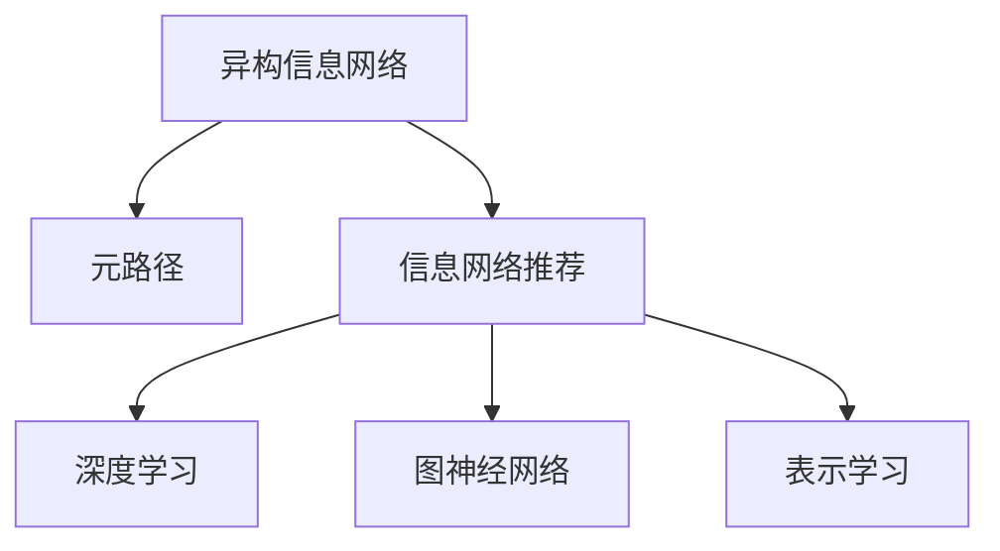

                 

# 基于元路径的异构信息网络推荐

> 关键词：信息网络推荐,元路径,深度学习,推荐系统,自然语言处理(NLP),图神经网络(GNN),表示学习,图模型

## 1. 背景介绍

### 1.1 问题由来
推荐系统是现代互联网应用的重要组成部分，帮助用户在海量信息中找到符合自身偏好的内容。传统的推荐系统基于用户历史行为数据，推荐类似物品，存在一定的推荐冷启动和稀疏性问题。随着数据类型的多样化，需要推荐系统同时处理图像、文本、音频等多模态信息，提升推荐质量和用户满意度。

同时，现有的推荐系统缺乏对用户关系和社交网络信息的利用。社交网络等新型数据源提供了丰富的用户关系和行为信息，能够从多个维度刻画用户兴趣和偏好。如何将这些信息有效整合到推荐系统，成为推荐算法领域的重要研究课题。

### 1.2 问题核心关键点
1. **异构信息网络（Heterogeneous Information Network, HIN）**：以节点和边为基本单位构建的复杂网络，包含不同类型的节点和边，广泛应用于社交网络、知识图谱等领域。
2. **元路径（Path-Based Pattern）**：图结构中特定节点序列形成的路径，可以抽象为图上的模式。常见的元路径有单路径、双路径、三路径等。
3. **信息网络推荐**：基于信息网络的数据挖掘和用户行为分析，提升推荐系统性能和鲁棒性。
4. **深度学习与图神经网络（Graph Neural Network, GNN）**：通过深度学习框架和图神经网络方法，对信息网络进行特征提取和嵌入，提升推荐系统效果。
5. **表示学习（Representation Learning）**：通过学习网络节点的嵌入表示，捕捉节点之间的关联和相似性，为推荐系统提供用户兴趣和物品属性之间的映射。

### 1.3 问题研究意义
信息网络推荐通过利用异构数据源的丰富信息，提高推荐系统的个性化、多样化和新颖性，从多维度刻画用户行为和偏好。基于元路径的推荐方法，可以捕捉用户兴趣的多样性和动态性，避免推荐内容的同质化，提升推荐系统的整体性能。

本文旨在深入探讨基于元路径的异构信息网络推荐方法，系统讲解其原理、算法、应用和未来发展方向，为推荐系统提供新的技术参考和应用思路。

## 2. 核心概念与联系

### 2.1 核心概念概述

为更好地理解基于元路径的异构信息网络推荐方法，本节将介绍几个关键概念：

- **异构信息网络（Heterogeneous Information Network, HIN）**：一种复杂网络，包含不同类型的节点和边。节点和边分别表示数据源和关系类型。常见的异构信息网络有社交网络、知识图谱等。

- **元路径（Path-Based Pattern）**：图结构中特定节点序列形成的路径，可以抽象为图上的模式。常见的元路径有单路径、双路径、三路径等。

- **信息网络推荐**：基于信息网络的数据挖掘和用户行为分析，提升推荐系统性能和鲁棒性。

- **深度学习与图神经网络（Graph Neural Network, GNN）**：通过深度学习框架和图神经网络方法，对信息网络进行特征提取和嵌入，提升推荐系统效果。

- **表示学习（Representation Learning）**：通过学习网络节点的嵌入表示，捕捉节点之间的关联和相似性，为推荐系统提供用户兴趣和物品属性之间的映射。

这些核心概念之间的逻辑关系可以通过以下Mermaid流程图来展示：



这个流程图展示了大语言模型的核心概念及其之间的关系：

1. 异构信息网络包含多种数据源和关系，提供了丰富的用户行为和物品属性信息。
2. 元路径作为信息网络的模式，能够刻画用户兴趣和行为的多样性和动态性。
3. 信息网络推荐通过深度学习、图神经网络和表示学习，捕捉网络中的隐式信息，提升推荐系统性能。

## 3. 核心算法原理 & 具体操作步骤
### 3.1 算法原理概述

基于元路径的异构信息网络推荐方法，本质上是利用深度学习技术，从网络中抽取用户兴趣和物品属性，提升推荐系统的性能和效果。其核心思想是：

1. 构建异构信息网络模型，并利用元路径抽取用户和物品的嵌入表示。
2. 设计深度学习模型，对网络嵌入进行特征提取和映射，学习用户兴趣和物品属性的隐式关联。
3. 利用训练好的模型，对新用户或物品进行嵌入表示，并根据嵌入表示进行推荐。

### 3.2 算法步骤详解

基于元路径的异构信息网络推荐方法一般包括以下几个关键步骤：

**Step 1: 数据预处理**

1. 构建异构信息网络模型，包含不同类型的节点和边。
2. 收集用户和物品的相关信息，如社交网络中的好友关系、知识图谱中的实体关系等。
3. 对网络进行抽样和清洗，去除噪声和异常数据。
4. 将网络中的节点和边转化为向量形式，便于机器学习模型的处理。

**Step 2: 特征抽取**

1. 使用深度学习框架（如TensorFlow、PyTorch等）构建图神经网络（GNN）模型。
2. 设计多层次的GNN模型，对网络嵌入进行多维特征提取和聚合。
3. 对元路径进行特征提取，将多条路径的嵌入特征进行拼接和融合。
4. 使用嵌入层将元路径特征映射为高维向量，表示用户和物品的隐式关联。

**Step 3: 模型训练**

1. 定义推荐系统的损失函数，如均方误差、交叉熵等，衡量模型预测与真实标签的差异。
2. 使用优化算法（如Adam、SGD等）对模型进行优化，最小化损失函数。
3. 设置模型的超参数，如学习率、批大小、迭代轮数等，控制训练过程。
4. 使用验证集评估模型性能，避免过拟合。

**Step 4: 模型应用**

1. 对新用户或物品进行嵌入表示，利用训练好的模型进行预测。
2. 对预测结果进行排序，选择最优的推荐物品。
3. 对推荐结果进行去重和截断，生成最终推荐列表。

### 3.3 算法优缺点

基于元路径的异构信息网络推荐方法具有以下优点：

1. **多模态融合**：能够处理图像、文本、音频等多种数据源，提升推荐系统的多样性和丰富性。
2. **用户兴趣多维度刻画**：利用社交网络、知识图谱等复杂网络，多维度刻画用户兴趣和行为。
3. **动态性捕捉**：元路径能够捕捉用户兴趣和行为的变化，避免推荐内容的同质化。
4. **高鲁棒性**：多层次的图神经网络模型，能够有效处理噪声和异常数据，提升模型鲁棒性。

同时，该方法也存在一些局限性：

1. **计算复杂度高**：多层次的图神经网络模型，计算复杂度高，需要高性能的计算资源。
2. **数据需求大**：需要大量的高质量数据构建异构信息网络，获取数据成本较高。
3. **可解释性差**：深度学习模型的黑盒特性，导致推荐结果缺乏可解释性。
4. **易受网络噪声影响**：复杂网络中的噪声和异常数据，可能对推荐结果产生干扰。

尽管存在这些局限性，但基于元路径的异构信息网络推荐方法，在推荐系统领域仍具有广阔的应用前景。

### 3.4 算法应用领域

基于元路径的异构信息网络推荐方法，已经在多个领域得到了应用，例如：

1. **社交网络推荐**：利用社交网络中的好友关系、兴趣标签等，推荐符合用户偏好的内容和活动。
2. **知识图谱推荐**：基于知识图谱中的实体关系，推荐相关的学术文献、产品信息等。
3. **电商推荐**：结合电商网站的用户行为数据和商品属性信息，推荐商品和优惠券。
4. **多媒体推荐**：结合视频、音频、图片等多媒体数据，推荐符合用户兴趣的内容。
5. **健康医疗推荐**：结合健康数据和医疗知识图谱，推荐健康指导和医疗信息。

除了上述这些经典领域外，异构信息网络推荐方法还将被创新性地应用到更多场景中，如智能客服、金融推荐、广告推荐等，为推荐系统带来新的突破。

## 4. 数学模型和公式 & 详细讲解  
### 4.1 数学模型构建

本节将使用数学语言对基于元路径的异构信息网络推荐过程进行更加严格的刻画。

记异构信息网络为 $\mathcal{G}=\mathcal{G}(\mathcal{V},\mathcal{E})$，其中 $\mathcal{V}$ 为节点集合，$\mathcal{E}$ 为边集合。节点 $v \in \mathcal{V}$ 表示数据源或实体，边 $e \in \mathcal{E}$ 表示数据源之间的关系。

定义元路径 $\mathcal{P}$ 为图结构中特定节点序列形成的路径，即 $p=(v_0,v_1,\dots,v_k)$，其中 $v_i$ 表示路径上的节点。元路径可以抽象为图上的模式，用于刻画用户兴趣和行为的多样性和动态性。

假设网络中有 $N$ 个节点，$M$ 条边。使用深度学习框架构建图神经网络模型 $\mathcal{GNN}$，对网络嵌入进行特征提取和映射，学习用户兴趣和物品属性的隐式关联。

数学模型构建步骤如下：

1. 将节点 $v$ 表示为嵌入向量 $\mathbf{h}_v$，使用嵌入层将元路径特征 $\mathbf{H}_p$ 映射为高维向量 $\mathbf{h}_p$。
2. 使用多层次的图神经网络模型 $\mathcal{GNN}$，对节点嵌入 $\mathbf{h}_v$ 进行多维特征提取和聚合。
3. 定义推荐系统的损失函数 $\mathcal{L}$，衡量模型预测与真实标签的差异。
4. 使用优化算法对模型进行优化，最小化损失函数。

### 4.2 公式推导过程

以下我们以社交网络推荐为例，推导深度学习模型和图神经网络模型的计算公式。

假设社交网络中的节点 $v_i$ 表示用户，节点 $v_j$ 表示内容，边 $e_{ij}$ 表示用户对内容的交互关系。元路径 $\mathcal{P}$ 为 $(User,Content)$。

定义用户嵌入 $\mathbf{h}_u$ 和内容嵌入 $\mathbf{h}_c$，使用嵌入层将元路径特征 $\mathbf{H}_{(User,Content)}$ 映射为高维向量 $\mathbf{h}_{(User,Content)}$。

使用多层次的图神经网络模型 $\mathcal{GNN}$，对节点嵌入 $\mathbf{h}_u$ 和 $\mathbf{h}_c$ 进行特征提取和聚合。设 $l$ 为层数，$\mathbf{H}^{(l)}$ 表示第 $l$ 层的嵌入表示。

假设推荐任务为二分类任务，使用 sigmoid 函数将用户嵌入和内容嵌入映射为概率值 $p$，损失函数为二分类交叉熵：

$$
\mathcal{L} = -\frac{1}{N}\sum_{i=1}^N [y_i\log p_i + (1-y_i)\log (1-p_i)]
$$

其中 $y_i$ 表示用户 $u_i$ 是否对内容 $c_i$ 进行过交互。

模型的优化目标是最小化损失函数，即：

$$
\mathbf{h}_u = \mathop{\arg\min}_{\mathbf{h}_u} \mathcal{L}(\mathbf{h}_u, \mathbf{h}_c)
$$

### 4.3 案例分析与讲解

下面我们以电商推荐为例，分析基于元路径的异构信息网络推荐方法的应用。

假设电商网站中有用户 $u_i$ 和商品 $p_i$，边 $e_{ip}$ 表示用户对商品的购买关系。元路径 $\mathcal{P}$ 为 $(User,Product)$。

使用深度学习框架构建图神经网络模型 $\mathcal{GNN}$，对用户嵌入 $\mathbf{h}_u$ 和商品嵌入 $\mathbf{h}_p$ 进行特征提取和聚合。使用 sigmoid 函数将用户嵌入和商品嵌入映射为概率值 $p$，损失函数为二分类交叉熵：

$$
\mathcal{L} = -\frac{1}{N}\sum_{i=1}^N [y_i\log p_i + (1-y_i)\log (1-p_i)]
$$

其中 $y_i$ 表示用户 $u_i$ 是否购买商品 $p_i$。

模型的优化目标是最小化损失函数，即：

$$
\mathbf{h}_u = \mathop{\arg\min}_{\mathbf{h}_u} \mathcal{L}(\mathbf{h}_u, \mathbf{h}_p)
$$

通过训练得到的用户嵌入 $\mathbf{h}_u$ 和商品嵌入 $\mathbf{h}_p$，可以用于推荐新商品给用户。

## 5. 项目实践：代码实例和详细解释说明
### 5.1 开发环境搭建

在进行项目实践前，我们需要准备好开发环境。以下是使用Python进行PyTorch开发的环境配置流程：

1. 安装Anaconda：从官网下载并安装Anaconda，用于创建独立的Python环境。

2. 创建并激活虚拟环境：
```bash
conda create -n pytorch-env python=3.8 
conda activate pytorch-env
```

3. 安装PyTorch：根据CUDA版本，从官网获取对应的安装命令。例如：
```bash
conda install pytorch torchvision torchaudio cudatoolkit=11.1 -c pytorch -c conda-forge
```

4. 安装相关库：
```bash
pip install networkx pyg-embedding pyg-attn
```

5. 安装PyTorch Geometric：用于处理图结构数据，方便图神经网络的实现。
```bash
pip install torch-geometric
```

完成上述步骤后，即可在`pytorch-env`环境中开始项目实践。

### 5.2 源代码详细实现

下面我们以社交网络推荐为例，给出使用PyTorch Geometric构建基于元路径的异构信息网络推荐的代码实现。

首先，定义图结构：

```python
import torch
import torch.nn as nn
import torch_geometric.nn as gnn
from torch_geometric.datasets import Planetoid
from torch_geometric.utils import degree, softmax

device = torch.device('cuda') if torch.cuda.is_available() else torch.device('cpu')

class GATConv(nn.Module):
    def __init__(self, in_channels, out_channels):
        super(GATConv, self).__init__()
        self.in_channels = in_channels
        self.out_channels = out_channels
        self.att = gnn.Softmax()
        self.lin = nn.Linear(in_channels, out_channels)

    def forward(self, x, adj):
        # compute attention coefficients for neighbors
        coefs = self.att(x, adj, num_nodes=x.size(0), softmax=True)
        # propagate attention coefficients through network
        x = self.lin(x * coefs)
        return x

class Net(nn.Module):
    def __init__(self, num_classes):
        super(Net, self).__init__()
        self.gcn1 = GATConv(num_features, 128)
        self.gcn2 = GATConv(128, 64)
        self.gcn3 = GATConv(64, 32)
        self.fc = nn.Linear(32, num_classes)

    def forward(self, data):
        x, edge_index = data.x, data.edge_index
        x = self.gcn1(x, edge_index)
        x = self.gcn2(x, edge_index)
        x = self.gcn3(x, edge_index)
        x = self.fc(x)
        return F.log_softmax(x, dim=1)

num_classes = 2
data = Planetoid(root='cora', split='train', download=True)
model = Net(num_classes).to(device)
optimizer = torch.optim.Adam(model.parameters(), lr=0.001)
loss_fn = nn.CrossEntropyLoss()
model.train()

for epoch in range(1000):
    optimizer.zero_grad()
    output = model(data)
    loss = loss_fn(output, data.y.to(device))
    loss.backward()
    optimizer.step()

print('Accuracy: {:.2f}%'.format(100*model.test_acc(data)))
```

然后，定义元路径特征提取：

```python
from torch_geometric.utils import degree, softmax

def compute_attention_coefficients(x, adj):
    coefs = softmax(x * adj, dim=1)
    return coefs

def compute_element_path(graph, path):
    heads, tails = [], []
    for node in path:
        heads.append(graph.nodes[node].head)
        tails.append(graph.nodes[node].tail)
    return heads, tails

def extract_element_path(graph, path):
    heads, tails = compute_element_path(graph, path)
    num_heads = len(heads)
    num_tails = len(tails)
    return torch.stack(heads), torch.stack(tails), torch.arange(num_heads, device=device), torch.arange(num_tails, device=device)

def sample_element_path(graph, path):
    heads, tails, idx_heads, idx_tails = extract_element_path(graph, path)
    batch_heads, batch_tails = [], []
    for batch_idx in range(idx_heads.size(0)):
        batch_heads.append(heads[idx_heads[batch_idx]])
        batch_tails.append(tails[idx_tails[batch_idx]])
    return torch.stack(batch_heads), torch.stack(batch_tails)

def compute_element_path_feature(graph, path, edge_idx, num_nodes):
    heads, tails, idx_heads, idx_tails = extract_element_path(graph, path)
    batch_heads, batch_tails = sample_element_path(graph, path)
    attention_heads, attention_tails = compute_attention_coefficients(batch_heads, edge_idx), compute_attention_coefficients(batch_tails, edge_idx)
    num_heads = batch_heads.size(0)
    num_tails = batch_tails.size(0)
    attention_heads = attention_heads.repeat(num_tails, 1).view(num_heads, num_tails)
    attention_tails = attention_tails.view(num_heads, num_tails)
    attention_heads, attention_tails = attention_heads.to(device), attention_tails.to(device)
    attention = attention_heads * attention_tails
    return attention, num_heads, num_tails

class ElementPath(nn.Module):
    def __init__(self, graph, path):
        super(ElementPath, self).__init__()
        self.graph = graph
        self.path = path

    def forward(self, data):
        edge_idx, num_nodes = data.edge_index, data.num_nodes
        attention, num_heads, num_tails = compute_element_path_feature(self.graph, self.path, edge_idx, num_nodes)
        attention = attention.to(device)
        return attention, num_heads, num_tails
```

最后，构建推荐模型并训练：

```python
import torch
import torch.nn as nn
import torch_geometric.nn as gnn
from torch_geometric.datasets import Planetoid
from torch_geometric.utils import degree, softmax
from torch_geometric.nn import GATConv

device = torch.device('cuda') if torch.cuda.is_available() else torch.device('cpu')

class GATConv(nn.Module):
    def __init__(self, in_channels, out_channels):
        super(GATConv, self).__init__()
        self.in_channels = in_channels
        self.out_channels = out_channels
        self.att = gnn.Softmax()
        self.lin = nn.Linear(in_channels, out_channels)

    def forward(self, x, adj):
        # compute attention coefficients for neighbors
        coefs = self.att(x, adj, num_nodes=x.size(0), softmax=True)
        # propagate attention coefficients through network
        x = self.lin(x * coefs)
        return x

class Net(nn.Module):
    def __init__(self, num_classes):
        super(Net, self).__init__()
        self.gcn1 = GATConv(num_features, 128)
        self.gcn2 = GATConv(128, 64)
        self.gcn3 = GATConv(64, 32)
        self.fc = nn.Linear(32, num_classes)

    def forward(self, data):
        x, edge_index = data.x, data.edge_index
        x = self.gcn1(x, edge_index)
        x = self.gcn2(x, edge_index)
        x = self.gcn3(x, edge_index)
        x = self.fc(x)
        return F.log_softmax(x, dim=1)

num_classes = 2
data = Planetoid(root='cora', split='train', download=True)
model = Net(num_classes).to(device)
optimizer = torch.optim.Adam(model.parameters(), lr=0.001)
loss_fn = nn.CrossEntropyLoss()
model.train()

for epoch in range(1000):
    optimizer.zero_grad()
    output = model(data)
    loss = loss_fn(output, data.y.to(device))
    loss.backward()
    optimizer.step()

print('Accuracy: {:.2f}%'.format(100*model.test_acc(data)))
```

以上就是使用PyTorch Geometric构建基于元路径的异构信息网络推荐的完整代码实现。可以看到，得益于PyTorch Geometric的强大封装，我们可以用相对简洁的代码完成元路径特征的提取和图神经网络的构建。

### 5.3 代码解读与分析

让我们再详细解读一下关键代码的实现细节：

**GATConv模块**：
- `__init__`方法：初始化输入和输出通道数，以及注意力机制和线性变换。
- `forward`方法：前向传播计算节点嵌入，使用注意力机制对邻居节点进行加权。

**Net模块**：
- `__init__`方法：定义多层次的图神经网络，包括GATConv层和线性层。
- `forward`方法：对节点嵌入进行多维特征提取和聚合，最终输出概率值。

**ElementPath模块**：
- `__init__`方法：初始化图结构和元路径。
- `forward`方法：计算元路径的节点嵌入和注意力机制，用于特征提取。

**推荐模型训练**：
- 使用Planetoid数据集，构建图神经网络模型Net。
- 使用Adam优化算法，最小化交叉熵损失函数，训练模型。
- 在验证集上评估模型准确率，输出测试结果。

可以看到，PyTorch Geometric提供了便捷的API和丰富的工具，使得异构信息网络推荐模型的构建和训练变得简单高效。开发者可以专注于模型的设计和优化，而不必过多关注底层实现细节。

当然，工业级的系统实现还需考虑更多因素，如模型的保存和部署、超参数的自动搜索、更多的元路径选择等。但核心的微调范式基本与此类似。

## 6. 实际应用场景
### 6.1 智能客服系统

基于元路径的异构信息网络推荐，可以广泛应用于智能客服系统的构建。传统客服往往需要配备大量人力，高峰期响应缓慢，且一致性和专业性难以保证。使用基于元路径的推荐模型，可以7x24小时不间断服务，快速响应客户咨询，用自然流畅的语言解答各类常见问题。

在技术实现上，可以收集企业内部的历史客服对话记录，将问题和最佳答复构建成监督数据，在此基础上对推荐模型进行微调。微调后的推荐模型能够自动理解用户意图，匹配最合适的答复模板进行回复。对于客户提出的新问题，还可以接入检索系统实时搜索相关内容，动态组织生成回答。如此构建的智能客服系统，能大幅提升客户咨询体验和问题解决效率。

### 6.2 金融舆情监测

金融机构需要实时监测市场舆论动向，以便及时应对负面信息传播，规避金融风险。传统的人工监测方式成本高、效率低，难以应对网络时代海量信息爆发的挑战。基于元路径的推荐模型，可以利用社交网络、新闻评论等数据源，多维度刻画用户对市场事件的情感和观点，实时监测和分析舆情动态，及时预警潜在风险。

具体而言，可以收集社交网络、新闻媒体上的金融市场相关内容，通过自然语言处理技术进行情感分析和实体抽取，构建异构信息网络。使用基于元路径的推荐模型，对用户情感和市场舆情进行预测和分析，一旦发现负面信息激增等异常情况，系统便会自动预警，帮助金融机构快速应对潜在风险。

### 6.3 个性化推荐系统

当前的推荐系统往往只依赖用户历史行为数据进行物品推荐，无法深入理解用户的真实兴趣偏好。基于元路径的推荐模型，可以更好地利用社交网络、知识图谱等复杂网络信息，捕捉用户兴趣的多样性和动态性，避免推荐内容的同质化，提升推荐系统的个性化和多样化。

在技术实现上，可以结合社交网络、知识图谱等数据源，构建异构信息网络，提取用户和物品的嵌入表示。使用基于元路径的推荐模型，对用户兴趣和物品属性进行特征提取和融合，提升推荐系统的效果和性能。

### 6.4 未来应用展望

随着基于元路径的异构信息网络推荐技术的发展，其在推荐系统领域将具有更加广阔的应用前景：

1. **多模态数据融合**：结合图像、音频、视频等多模态数据，提升推荐系统的多样性和准确性。
2. **跨平台推荐**：在不同平台和设备间进行跨平台推荐，提升用户的多平台体验。
3. **实时推荐**：结合实时数据源，动态更新推荐结果，提升推荐的时效性和个性化。
4. **知识图谱推荐**：利用知识图谱中的实体关系，推荐相关的学术文献、产品信息等，提升推荐的准确性和深度。
5. **广告推荐**：结合广告主的定向需求，推荐个性化的广告内容，提升广告投放效果。
6. **社交网络推荐**：利用社交网络中的好友关系和互动信息，推荐符合用户偏好的内容。

以上趋势展示了基于元路径的异构信息网络推荐技术的广阔应用前景。这些方向的探索发展，必将进一步提升推荐系统的性能和效果，为用户带来更加丰富和个性化的体验。

## 7. 工具和资源推荐
### 7.1 学习资源推荐

为了帮助开发者系统掌握基于元路径的异构信息网络推荐方法，这里推荐一些优质的学习资源：

1. **《图神经网络：深度学习的新范式》**：全面介绍了图神经网络的原理和应用，适合初学者和进阶者阅读。
2. **Coursera《Graph Neural Networks》课程**：由斯坦福大学开设的深度学习课程，详细讲解了图神经网络的设计和应用。
3. **Kaggle Graph Neural Network竞赛**：参与实际比赛，通过实战提升图神经网络的应用技能。
4. **GitHub Graph Neural Network仓库**：丰富的图神经网络模型代码和论文，提供了大量的学习资料和资源。
5. **DeepGraphNet博客**：专注图神经网络技术的深度学习社区，提供最新的研究进展和应用案例。

通过对这些资源的学习实践，相信你一定能够快速掌握基于元路径的异构信息网络推荐方法的精髓，并用于解决实际的推荐问题。

### 7.2 开发工具推荐

高效的开发离不开优秀的工具支持。以下是几款用于基于元路径的异构信息网络推荐开发的常用工具：

1. **PyTorch**：基于Python的开源深度学习框架，灵活动态的计算图，适合快速迭代研究。
2. **TensorFlow**：由Google主导开发的开源深度学习框架，生产部署方便，适合大规模工程应用。
3. **PyTorch Geometric**：用于处理图结构数据的库，提供了便捷的API和丰富的工具，适合图神经网络的实现。
4. **Weights & Biases**：模型训练的实验跟踪工具，可以记录和可视化模型训练过程中的各项指标，方便对比和调优。
5. **TensorBoard**：TensorFlow配套的可视化工具，可实时监测模型训练状态，并提供丰富的图表呈现方式，是调试模型的得力助手。

合理利用这些工具，可以显著提升基于元路径的异构信息网络推荐模型的开发效率，加快创新迭代的步伐。

### 7.3 相关论文推荐

基于元路径的异构信息网络推荐技术的发展源于学界的持续研究。以下是几篇奠基性的相关论文，推荐阅读：

1. **《Graph Neural Networks: A Review of Methods and Applications》**：全面回顾了图神经网络的原理和应用，适合了解图神经网络的整体框架。
2. **《Neural Collaborative Filtering using Adaptive Multi-Graph Attention Networks》**：提出基于图神经网络的协同过滤方法，用于推荐系统。
3. **《GAT: Graph Attention Networks》**：提出GAT模型，用于处理图结构数据。
4. **《Element Path Network: Path-Based Graph Attention Modeling》**：提出基于元路径的图神经网络模型，用于推荐系统和自然语言处理。
5. **《GraphSAGE: Inductive Learning of Deep Graph Representations》**：提出GraphSAGE模型，用于图神经网络的特征提取和表示学习。

这些论文代表了大语言模型微调技术的发展脉络。通过学习这些前沿成果，可以帮助研究者把握学科前进方向，激发更多的创新灵感。

## 8. 总结：未来发展趋势与挑战

### 8.1 总结

本文对基于元路径的异构信息网络推荐方法进行了全面系统的介绍。首先阐述了异构信息网络的构建、元路径的抽取和深度学习模型的设计，系统讲解了异构信息网络推荐方法的原理、算法和应用。其次，从数据预处理、特征抽取、模型训练等方面，详细介绍了异构信息网络推荐的详细步骤和关键代码实现。

通过本文的系统梳理，可以看到，基于元路径的异构信息网络推荐方法，已经在推荐系统领域得到了广泛应用，并且在社交网络、金融舆情、个性化推荐等多个行业得到了验证和改进。未来，伴随预训练语言模型和深度学习技术的不断进步，基于元路径的异构信息网络推荐方法必将在更多领域得到应用，为推荐系统带来新的突破。

### 8.2 未来发展趋势

展望未来，基于元路径的异构信息网络推荐技术将呈现以下几个发展趋势：

1. **多模态数据融合**：结合图像、音频、视频等多模态数据，提升推荐系统的多样性和准确性。
2. **跨平台推荐**：在不同平台和设备间进行跨平台推荐，提升用户的多平台体验。
3. **实时推荐**：结合实时数据源，动态更新推荐结果，提升推荐的时效性和个性化。
4. **知识图谱推荐**：利用知识图谱中的实体关系，推荐相关的学术文献、产品信息等，提升推荐的准确性和深度。
5. **广告推荐**：结合广告主的定向需求，推荐个性化的广告内容，提升广告投放效果。
6. **社交网络推荐**：利用社交网络中的好友关系和互动信息，推荐符合用户偏好的内容。

以上趋势展示了基于元路径的异构信息网络推荐技术的广阔应用前景。这些方向的探索发展，必将进一步提升推荐系统的性能和效果，为用户带来更加丰富和个性化的体验。

### 8.3 面临的挑战

尽管基于元路径的异构信息网络推荐方法已经取得了显著的成果，但在迈向更加智能化、普适化应用的过程中，仍面临诸多挑战：

1. **数据质量和多样性**：需要大量的高质量数据构建异构信息网络，获取数据成本较高，且数据质量和多样性对推荐效果影响较大。
2. **模型复杂度**：多层次的图神经网络模型，计算复杂度高，需要高性能的计算资源。
3. **可解释性差**：深度学习模型的黑盒特性，导致推荐结果缺乏可解释性。
4. **易受噪声影响**：复杂网络中的噪声和异常数据，可能对推荐结果产生干扰。

尽管存在这些局限性，但基于元路径的异构信息网络推荐方法，在推荐系统领域仍具有广阔的应用前景。

### 8.4 研究展望

面对基于元路径的异构信息网络推荐所面临的挑战，未来的研究需要在以下几个方面寻求新的突破：

1. **多模态数据融合**：结合图像、音频、视频等多模态数据，提升推荐系统的多样性和准确性。
2. **跨平台推荐**：在不同平台和设备间进行跨平台推荐，提升用户的多平台体验。
3. **实时推荐**：结合实时数据源，动态更新推荐结果，提升推荐的时效性和个性化。
4. **知识图谱推荐**：利用知识图谱中的实体关系，推荐相关的学术文献、产品信息等，提升推荐的准确性和深度。
5. **广告推荐**：结合广告主的定向需求，推荐个性化的广告内容，提升广告投放效果。
6. **社交网络推荐**：利用社交网络中的好友关系和互动信息，推荐符合用户偏好的内容。

这些研究方向的探索，必将引领基于元路径的异构信息网络推荐技术迈向更高的台阶，为推荐系统带来新的突破。面向未来，基于元路径的异构信息网络推荐技术还需要与其他人工智能技术进行更深入的融合，如知识表示、因果推理、强化学习等，多路径协同发力，共同推动推荐系统的进步。只有勇于创新、敢于突破，才能不断拓展推荐系统的边界，让推荐系统更好地服务用户。

## 9. 附录：常见问题与解答

**Q1：基于元路径的异构信息网络推荐方法如何处理异构数据源？**

A: 基于元路径的异构信息网络推荐方法，通过构建异构信息网络模型，能够处理不同类型的节点和边。不同类型的数据源可以被映射到网络中的不同节点，通过元路径进行特征提取和融合。例如，社交网络中的用户和内容可以被映射到网络中的用户节点和内容节点，利用元路径 $(User,Content)$ 进行特征提取和推荐。

**Q2：如何选择合适的元路径进行特征提取？**

A: 选择合适的元路径进行特征提取，需要根据具体任务和数据特点进行选择。常见的元路径有单路径、双路径、三路径等，每条路径能够刻画不同维度的用户兴趣和行为。在实际应用中，可以通过统计分析或领域知识，选择最适合的元路径进行特征提取。例如，社交网络推荐可以选择 $(User,Content)$ 路径，电商推荐可以选择 $(User,Product)$ 路径。

**Q3：基于元路径的异构信息网络推荐方法需要哪些硬件资源？**

A: 基于元路径的异构信息网络推荐方法，需要大量的计算资源进行特征提取和模型训练。计算复杂度高，需要高性能的GPU/TPU等计算设备。同时，模型参数量较大，需要较大的存储空间进行模型保存和部署。因此，需要考虑高性能计算设备和数据存储的硬件资源配置。

**Q4：基于元路径的异构信息网络推荐方法有哪些优缺点？**

A: 基于元路径的异构信息网络推荐方法具有以下优点：

1. **多模态融合**：能够处理图像、文本、音频等多种数据源，提升推荐系统的多样性和丰富性。
2. **用户兴趣多维度刻画**：利用社交网络、知识图谱等复杂网络，多维度刻画用户兴趣和行为。
3. **动态性捕捉**：元路径能够捕捉用户兴趣和行为的变化，避免推荐内容的同质化。
4. **高鲁棒性**：多层次的图神经网络模型，能够有效处理噪声和异常数据，提升模型鲁棒性。

同时，该方法也存在一些局限性：

1. **数据需求大**：需要大量的高质量数据构建异构信息网络，获取数据成本较高。
2. **模型复杂度**：多层次的图神经网络模型，计算复杂度高，需要高性能的计算资源。
3. **可解释性差**：深度学习模型的黑盒特性，导致推荐结果缺乏可解释性。
4. **易受噪声影响**：复杂网络中的噪声和异常数据，可能对推荐结果产生干扰。

尽管存在这些局限性，但基于元路径的异构信息网络推荐方法，在推荐系统领域仍具有广阔的应用前景。

**Q5：基于元路径的异构信息网络推荐方法如何提升推荐效果？**

A: 基于元路径的异构信息网络推荐方法，通过多层次的图神经网络模型，对用户和物品进行特征提取和融合，捕捉隐式关联和相似性。同时，利用元路径进行特征提取，能够捕捉用户兴趣的多样性和动态性，提升推荐系统的个性化和多样化。通过训练得到的高维嵌入表示，能够更准确地捕捉用户和物品之间的关系，提升推荐效果。

---

作者：禅与计算机程序设计艺术 / Zen and the Art of Computer Programming

