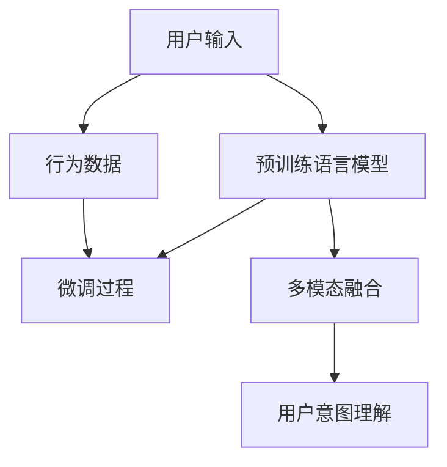

                 

# 基于大模型的电商平台用户意图理解

> 关键词：电商平台, 用户意图理解, 意图识别, 自然语言处理, 大模型, 深度学习, Transformer, BERT

## 1. 背景介绍

在数字化转型的今天，电商平台成为了人们获取商品信息、进行购物决策的重要渠道。电商平台不仅展示商品信息，更是通过用户行为数据、文本评论等多元化的用户反馈，理解用户意图，提供个性化服务。

### 1.1 问题由来

在电商平台的运营中，准确理解用户意图是提升用户体验、优化销售策略的基础。然而，随着用户行为和产品信息的日益丰富，理解复杂多变的用户意图成为一项挑战。传统的意图识别方法依赖规则和特征提取，难以处理文本语义的复杂性和多样性。而随着深度学习技术的发展，利用大模型进行用户意图理解成为新的趋势。

### 1.2 问题核心关键点

用户意图识别是大模型在电商平台的重要应用之一。其核心在于从用户输入的文本中提取信息，结合用户行为数据，推测用户的真实意图。与传统的文本分类不同，用户意图识别更注重捕捉用户的意图动因和情境上下文，并转化为相应的购物决策。

基于大模型的用户意图理解方法主要包括以下几个关键点：

- 预训练语言模型：通过大规模无标签数据预训练，学习语言和语义的通用表示。
- 微调过程：在大模型的基础上，通过标注数据进行微调，以适配电商平台的特定任务。
- 联合学习：结合用户行为数据，综合文本和行为信息，提高意图识别的准确性。
- 多模态融合：整合图片、视频等多模态信息，丰富用户意图识别的维度。

## 2. 核心概念与联系

### 2.1 核心概念概述

为更好地理解基于大模型的电商平台用户意图理解方法，本节将介绍几个核心概念：

- 用户意图理解(User Intent Understanding)：从用户输入的文本和行为数据中，提取信息推测用户的真实意图。
- 自然语言处理(Natural Language Processing, NLP)：研究如何使计算机处理、理解、生成人类语言的技术。
- 深度学习(Deep Learning)：利用多层神经网络进行复杂模式识别和决策的任务。
- 预训练语言模型(Pretrained Language Model)：在大规模无标签文本数据上进行自监督学习，学习语言的通用表示。
- 大模型(Large Model)：参数量庞大，通过大规模数据和复杂模型结构学习到丰富语义的深度学习模型。
- Transformer：一种基于自注意力机制的神经网络结构，广泛应用于深度学习模型。
- BERT: B bidirectional Encoder Representations from Transformers：由Google提出的大规模预训练语言模型，以双向Transformer进行预训练。

这些核心概念之间的逻辑关系可以通过以下Mermaid流程图来展示：



这个流程图展示了从用户输入到最终意图理解的一般流程：

1. 用户输入文本和行为数据。
2. 预训练语言模型对文本进行编码，学习语义表示。
3. 行为数据与文本编码结合，进行微调。
4. 结合多模态数据进行融合。
5. 输出用户意图理解结果。

## 3. 核心算法原理 & 具体操作步骤
### 3.1 算法原理概述

基于大模型的电商平台用户意图理解方法，本质上是通过预训练语言模型进行特征提取，再通过微调结合用户行为数据，学习到针对电商平台的意图表示。

形式化地，假设用户输入文本为 $x$，行为数据为 $c$，预训练语言模型为 $M_{\theta}$，微调后的模型为 $M_{\theta^*}$。则意图识别过程可以表示为：

$$
M_{\theta^*} = M_{\theta}(x, c)
$$

其中 $M_{\theta}$ 为预训练模型，学习到文本的语义表示。微调 $M_{\theta^*}$ 通过结合用户行为数据 $c$，学习到针对电商平台的意图表示。

### 3.2 算法步骤详解

基于大模型的电商平台用户意图理解方法，一般包括以下几个关键步骤：

**Step 1: 数据准备**

1. 收集电商平台的用户文本数据，如商品评论、搜索关键词等。
2. 收集用户行为数据，如浏览记录、购买历史等。
3. 将文本和行为数据进行合并，构造训练样本 $(x, c)$。

**Step 2: 预训练模型选择**

1. 选择大模型作为初始化参数，如BERT、GPT等。
2. 使用预训练模型的Tokenizer对文本进行分词编码。

**Step 3: 微调模型构建**

1. 在预训练模型的基础上，构建微调层，如分类器或回归器。
2. 选择合适的优化器，如AdamW、SGD等，设置学习率、批大小、迭代轮数等。
3. 在微调过程中，结合用户行为数据进行多任务学习，如浏览意图、购买意图、评价意图等。

**Step 4: 多模态融合**

1. 将用户评论、图片、视频等多模态数据进行编码，结合文本和行为信息。
2. 使用Attention机制等方法，对多模态数据进行融合，得到更加全面、准确的用户意图表示。

**Step 5: 模型评估与部署**

1. 在测试集上评估微调后的模型性能，使用如准确率、召回率、F1值等指标进行评估。
2. 将微调后的模型部署到电商平台的推荐系统中，实时处理用户意图。

### 3.3 算法优缺点

基于大模型的电商平台用户意图理解方法具有以下优点：

1. 通用性强。可以适配各种电商平台的意图识别任务，适应性广。
2. 高效准确。通过大模型的预训练和微调，能够快速提升模型性能。
3. 多模态融合。结合文本、行为、图片等多模态信息，提高意图识别的全面性和准确性。
4. 可解释性好。大模型提供的注意力机制，有助于解释模型决策过程。

同时，该方法也存在以下局限：

1. 数据依赖。需要大量的用户行为数据和标注数据，获取成本高。
2. 可解释性不足。模型的注意力机制虽然有助于解释，但黑盒模型的决策过程仍然难以理解。
3. 模型复杂。大模型参数量大，计算资源消耗高。

尽管存在这些局限，但总体而言，基于大模型的电商平台用户意图理解方法在处理复杂用户意图方面仍具有显著优势。

### 3.4 算法应用领域

基于大模型的电商平台用户意图理解方法，在电商平台的个性化推荐、智能客服、商品评论分析等多个领域得到了广泛应用。

- **个性化推荐**：结合用户评论、搜索记录、购买行为等数据，预测用户的购买意图，推荐合适的商品。
- **智能客服**：理解用户咨询的意图，自动回答常见问题，提升客服效率和用户体验。
- **商品评论分析**：分析用户评论中的情感和反馈，提取产品优缺点，指导商品优化。
- **搜索意图理解**：识别用户搜索词的意图，如比较、询问、购买等，提供精准的搜索结果。

这些应用场景展示了基于大模型的电商平台用户意图理解方法的强大潜力，为电商平台的智能化转型提供了重要支撑。

## 4. 数学模型和公式 & 详细讲解  
### 4.1 数学模型构建

假设电商平台用户输入文本为 $x$，用户行为数据为 $c$，预训练语言模型为 $M_{\theta}$，微调后的模型为 $M_{\theta^*}$。意图识别过程可以形式化表示为：

$$
M_{\theta^*}(x, c) = M_{\theta}(x) + f_{\text{intent}}(x, c)
$$

其中 $M_{\theta}$ 为预训练模型，$f_{\text{intent}}$ 为意图识别函数，用于将用户输入和行为数据转化为意图表示。

### 4.2 公式推导过程

对于用户意图识别任务，假设 $y \in \{buy, compare, ask, complain\}$ 为意图标签。则意图识别模型的预测函数可以表示为：

$$
y = \text{softmax}(f_{\text{intent}}(M_{\theta}(x), c))
$$

其中 $f_{\text{intent}}$ 为意图表示函数，通常采用如下形式：

$$
f_{\text{intent}}(x, c) = \langle M_{\theta}(x), \text{softmax}(M_{\theta}(c)) \rangle
$$

上式中 $\langle \cdot, \cdot \rangle$ 表示向量点积，$\text{softmax}$ 表示softmax函数。

在训练过程中，使用交叉熵损失函数来衡量模型预测和真实标签之间的差距：

$$
\mathcal{L}(M_{\theta^*}, D) = -\frac{1}{N}\sum_{i=1}^N \sum_{y \in \{buy, compare, ask, complain\}} y_i \log p_i + (1-y_i) \log (1-p_i)
$$

其中 $p_i = \text{softmax}(f_{\text{intent}}(M_{\theta}(x_i), c_i))$，$y_i$ 为真实标签。

### 4.3 案例分析与讲解

以电商平台商品评论分析为例，分析用户评论中的情感和反馈，提取产品优缺点。

假设评论文本为 $x = "商品质量很好，但物流速度太慢了。" $，行为数据为 $c = \{浏览记录, 评分, 评论时间\}$。则意图识别过程可以表示为：

1. 使用BERT对评论文本 $x$ 进行编码，得到语义表示 $z_x = M_{\theta}(x)$。
2. 将行为数据 $c$ 编码为向量表示 $z_c = M_{\theta}(c)$。
3. 通过向量点积，结合文本和行为数据，计算意图表示 $f_{\text{intent}}(z_x, z_c) = \langle z_x, \text{softmax}(z_c) \rangle$。
4. 使用softmax函数，将意图表示转化为意图标签 $y = \text{softmax}(f_{\text{intent}}(z_x, z_c))$。

通过这种方式，可以精确地分析用户评论中的情感和反馈，提取产品优缺点，为产品优化和市场策略提供依据。

## 5. 项目实践：代码实例和详细解释说明
### 5.1 开发环境搭建

在进行用户意图理解实践前，我们需要准备好开发环境。以下是使用Python进行PyTorch开发的环境配置流程：

1. 安装Anaconda：从官网下载并安装Anaconda，用于创建独立的Python环境。

2. 创建并激活虚拟环境：
```bash
conda create -n intent-env python=3.8 
conda activate intent-env
```

3. 安装PyTorch：根据CUDA版本，从官网获取对应的安装命令。例如：
```bash
conda install pytorch torchvision torchaudio cudatoolkit=11.1 -c pytorch -c conda-forge
```

4. 安装Transformers库：
```bash
pip install transformers
```

5. 安装各类工具包：
```bash
pip install numpy pandas scikit-learn matplotlib tqdm jupyter notebook ipython
```

完成上述步骤后，即可在`intent-env`环境中开始用户意图理解实践。

### 5.2 源代码详细实现

下面我们以电商平台的商品评论分析为例，给出使用Transformers库对BERT模型进行用户意图理解的PyTorch代码实现。

首先，定义商品评论数据处理函数：

```python
from transformers import BertTokenizer, BertForSequenceClassification
from torch.utils.data import Dataset, DataLoader
import torch

class ReviewDataset(Dataset):
    def __init__(self, reviews, labels, tokenizer, max_len=128):
        self.reviews = reviews
        self.labels = labels
        self.tokenizer = tokenizer
        self.max_len = max_len
        
    def __len__(self):
        return len(self.reviews)
    
    def __getitem__(self, item):
        review = self.reviews[item]
        label = self.labels[item]
        
        encoding = self.tokenizer(review, return_tensors='pt', max_length=self.max_len, padding='max_length', truncation=True)
        input_ids = encoding['input_ids'][0]
        attention_mask = encoding['attention_mask'][0]
        
        encoded_labels = torch.tensor(label, dtype=torch.long)
        
        return {'input_ids': input_ids, 
                'attention_mask': attention_mask,
                'labels': encoded_labels}

# 标签与id的映射
label2id = {'buy': 0, 'compare': 1, 'ask': 2, 'complain': 3}
id2label = {v: k for k, v in label2id.items()}

# 创建dataset
tokenizer = BertTokenizer.from_pretrained('bert-base-cased')

train_dataset = ReviewDataset(train_reviews, train_labels, tokenizer)
dev_dataset = ReviewDataset(dev_reviews, dev_labels, tokenizer)
test_dataset = ReviewDataset(test_reviews, test_labels, tokenizer)
```

然后，定义模型和优化器：

```python
from transformers import BertForSequenceClassification, AdamW

model = BertForSequenceClassification.from_pretrained('bert-base-cased', num_labels=len(label2id))

optimizer = AdamW(model.parameters(), lr=2e-5)
```

接着，定义训练和评估函数：

```python
from torch.utils.data import DataLoader
from tqdm import tqdm
from sklearn.metrics import classification_report

device = torch.device('cuda') if torch.cuda.is_available() else torch.device('cpu')
model.to(device)

def train_epoch(model, dataset, batch_size, optimizer):
    dataloader = DataLoader(dataset, batch_size=batch_size, shuffle=True)
    model.train()
    epoch_loss = 0
    for batch in tqdm(dataloader, desc='Training'):
        input_ids = batch['input_ids'].to(device)
        attention_mask = batch['attention_mask'].to(device)
        labels = batch['labels'].to(device)
        model.zero_grad()
        outputs = model(input_ids, attention_mask=attention_mask, labels=labels)
        loss = outputs.loss
        epoch_loss += loss.item()
        loss.backward()
        optimizer.step()
    return epoch_loss / len(dataloader)

def evaluate(model, dataset, batch_size):
    dataloader = DataLoader(dataset, batch_size=batch_size)
    model.eval()
    preds, labels = [], []
    with torch.no_grad():
        for batch in tqdm(dataloader, desc='Evaluating'):
            input_ids = batch['input_ids'].to(device)
            attention_mask = batch['attention_mask'].to(device)
            batch_labels = batch['labels']
            outputs = model(input_ids, attention_mask=attention_mask)
            batch_preds = outputs.logits.argmax(dim=1).to('cpu').tolist()
            batch_labels = batch_labels.to('cpu').tolist()
            for pred, label in zip(batch_preds, batch_labels):
                preds.append(id2label[pred])
                labels.append(id2label[label])
                
    print(classification_report(labels, preds))
```

最后，启动训练流程并在测试集上评估：

```python
epochs = 5
batch_size = 16

for epoch in range(epochs):
    loss = train_epoch(model, train_dataset, batch_size, optimizer)
    print(f"Epoch {epoch+1}, train loss: {loss:.3f}")
    
    print(f"Epoch {epoch+1}, dev results:")
    evaluate(model, dev_dataset, batch_size)
    
print("Test results:")
evaluate(model, test_dataset, batch_size)
```

以上就是使用PyTorch对BERT进行商品评论分析任务用户意图理解的完整代码实现。可以看到，得益于Transformers库的强大封装，我们可以用相对简洁的代码完成BERT模型的加载和微调。

### 5.3 代码解读与分析

让我们再详细解读一下关键代码的实现细节：

**ReviewDataset类**：
- `__init__`方法：初始化评论文本、标签、分词器等关键组件。
- `__len__`方法：返回数据集的样本数量。
- `__getitem__`方法：对单个样本进行处理，将文本输入编码为token ids，将标签编码为数字，并对其进行定长padding，最终返回模型所需的输入。

**label2id和id2label字典**：
- 定义了标签与数字id之间的映射关系，用于将文本-标签映射。

**训练和评估函数**：
- 使用PyTorch的DataLoader对数据集进行批次化加载，供模型训练和推理使用。
- 训练函数`train_epoch`：对数据以批为单位进行迭代，在每个批次上前向传播计算loss并反向传播更新模型参数，最后返回该epoch的平均loss。
- 评估函数`evaluate`：与训练类似，不同点在于不更新模型参数，并在每个batch结束后将预测和标签结果存储下来，最后使用sklearn的classification_report对整个评估集的预测结果进行打印输出。

**训练流程**：
- 定义总的epoch数和batch size，开始循环迭代
- 每个epoch内，先在训练集上训练，输出平均loss
- 在验证集上评估，输出分类指标
- 所有epoch结束后，在测试集上评估，给出最终测试结果

可以看到，PyTorch配合Transformers库使得BERT微调的代码实现变得简洁高效。开发者可以将更多精力放在数据处理、模型改进等高层逻辑上，而不必过多关注底层的实现细节。

当然，工业级的系统实现还需考虑更多因素，如模型的保存和部署、超参数的自动搜索、更灵活的任务适配层等。但核心的用户意图理解过程基本与此类似。

## 6. 实际应用场景
### 6.1 电商平台个性化推荐

基于大模型的电商平台用户意图理解方法，可以广泛应用于个性化推荐系统。传统的推荐系统往往只依赖用户的历史行为数据进行物品推荐，无法深入理解用户的兴趣偏好。

在实践中，可以收集用户浏览、点击、评分等行为数据，提取和用户交互的物品标题、描述、标签等文本内容。将文本内容作为模型输入，用户的后续行为（如是否点击、评分等）作为监督信号，在此基础上微调预训练语言模型。微调后的模型能够从文本内容中准确把握用户的兴趣点。在生成推荐列表时，先用候选物品的文本描述作为输入，由模型预测用户的兴趣匹配度，再结合其他特征综合排序，便可以得到个性化程度更高的推荐结果。

### 6.2 智能客服系统

电商平台智能客服系统通过用户意图理解技术，可以自动识别用户的咨询意图，自动回答常见问题，提供精准服务。例如，对于用户咨询"如何查看订单状态"，智能客服可以直接返回相关链接或文字说明。对于复杂问题，可以将其转发给人工客服处理，减少人工客服的负担，提升客户体验。

在技术实现上，可以收集用户咨询记录，将问题-回答对作为监督数据，训练大模型进行意图识别。微调后的模型能够自动理解用户意图，匹配最合适的回答，甚至动态生成新的回答。如此构建的智能客服系统，能大幅提升客服效率和用户满意度。

### 6.3 搜索意图理解

电商平台的搜索系统通过用户意图理解技术，可以自动识别用户搜索词的意图，如比较、询问、购买等，提供精准的搜索结果。例如，对于用户搜索"iPhone 12 价格"，系统可以自动推荐相似的商品搜索结果，并给出价格比较。对于搜索"iPhone 12 最新评价"，系统可以提供最新的用户评价信息。

在技术实现上，可以将用户搜索词和搜索行为数据作为模型输入，微调大模型进行意图识别。微调后的模型能够识别出搜索词的意图，匹配最合适的搜索结果，提供更加个性化、精准的搜索体验。

### 6.4 未来应用展望

随着大语言模型和用户意图理解技术的发展，未来的电商平台将能够提供更加智能、个性化的服务，提升用户体验，增加销售额。

在智慧医疗领域，基于用户意图理解技术的智能健康管理系统，能够根据用户的健康数据，自动生成个性化的健康建议，提高用户的健康管理水平。

在智能教育领域，基于用户意图理解技术的个性化学习系统，能够根据学生的学习行为和反馈，自动调整教学内容和策略，提升学习效果。

在智能交通领域，基于用户意图理解技术的导航系统，能够根据用户的出行意图和偏好，自动生成最优的路线规划，提升用户的出行体验。

此外，在金融、媒体、旅游等多个领域，基于用户意图理解技术的智能系统也将不断涌现，为各行各业带来新的创新应用。

## 7. 工具和资源推荐
### 7.1 学习资源推荐

为了帮助开发者系统掌握用户意图理解技术的理论基础和实践技巧，这里推荐一些优质的学习资源：

1. 《Transformer从原理到实践》系列博文：由大模型技术专家撰写，深入浅出地介绍了Transformer原理、BERT模型、意图识别技术等前沿话题。

2. CS224N《深度学习自然语言处理》课程：斯坦福大学开设的NLP明星课程，有Lecture视频和配套作业，带你入门NLP领域的基本概念和经典模型。

3. 《Natural Language Processing with Transformers》书籍：Transformers库的作者所著，全面介绍了如何使用Transformers库进行NLP任务开发，包括意图识别在内的诸多范式。

4. HuggingFace官方文档：Transformers库的官方文档，提供了海量预训练模型和完整的意图识别样例代码，是上手实践的必备资料。

5. CLUE开源项目：中文语言理解测评基准，涵盖大量不同类型的中文NLP数据集，并提供了基于用户意图理解的baseline模型，助力中文NLP技术发展。

通过对这些资源的学习实践，相信你一定能够快速掌握用户意图理解技术的精髓，并用于解决实际的NLP问题。
###  7.2 开发工具推荐

高效的开发离不开优秀的工具支持。以下是几款用于用户意图理解开发的常用工具：

1. PyTorch：基于Python的开源深度学习框架，灵活动态的计算图，适合快速迭代研究。大部分预训练语言模型都有PyTorch版本的实现。

2. TensorFlow：由Google主导开发的开源深度学习框架，生产部署方便，适合大规模工程应用。同样有丰富的预训练语言模型资源。

3. Transformers库：HuggingFace开发的NLP工具库，集成了众多SOTA语言模型，支持PyTorch和TensorFlow，是进行用户意图理解开发的利器。

4. Weights & Biases：模型训练的实验跟踪工具，可以记录和可视化模型训练过程中的各项指标，方便对比和调优。与主流深度学习框架无缝集成。

5. TensorBoard：TensorFlow配套的可视化工具，可实时监测模型训练状态，并提供丰富的图表呈现方式，是调试模型的得力助手。

6. Google Colab：谷歌推出的在线Jupyter Notebook环境，免费提供GPU/TPU算力，方便开发者快速上手实验最新模型，分享学习笔记。

合理利用这些工具，可以显著提升用户意图理解任务的开发效率，加快创新迭代的步伐。

### 7.3 相关论文推荐

用户意图理解技术的发展源于学界的持续研究。以下是几篇奠基性的相关论文，推荐阅读：

1. Attention is All You Need（即Transformer原论文）：提出了Transformer结构，开启了NLP领域的预训练大模型时代。

2. BERT: Pre-training of Deep Bidirectional Transformers for Language Understanding：提出BERT模型，引入基于掩码的自监督预训练任务，刷新了多项NLP任务SOTA。

3. Sequence to Sequence Learning with Neural Networks：提出了Seq2Seq框架，为机器翻译、语音识别等任务提供了新范式。

4. Seq2Seq Model for Automatic Summary Generation：提出Seq2Seq模型进行自动摘要任务，为NLP任务提供了新的解决思路。

5. Intent Recognition with Attention-based Bi-RNN Model：提出基于注意力机制的双循环神经网络模型，提高了意图识别的准确性。

6. Multimodal Attention-based Model for Intent Recognition：提出多模态注意力机制的模型，结合文本和行为数据进行意图识别。

这些论文代表了大模型用户意图理解技术的发展脉络。通过学习这些前沿成果，可以帮助研究者把握学科前进方向，激发更多的创新灵感。

## 8. 总结：未来发展趋势与挑战

### 8.1 总结

本文对基于大模型的电商平台用户意图理解方法进行了全面系统的介绍。首先阐述了用户意图理解技术的研究背景和意义，明确了意图理解在电商平台的重要价值。其次，从原理到实践，详细讲解了用户意图识别的数学模型和核心步骤，给出了用户意图理解任务开发的完整代码实例。同时，本文还广泛探讨了意图理解在电商平台个性化推荐、智能客服、搜索意图理解等多个领域的应用前景，展示了意图理解技术的强大潜力。最后，本文精选了意图理解技术的各类学习资源，力求为开发者提供全方位的技术指引。

通过本文的系统梳理，可以看到，基于大模型的电商平台用户意图理解技术正在成为电商平台智能化转型的重要驱动力，为电商平台的个性化推荐、智能客服、搜索优化提供了有力支撑。未来，伴随大语言模型和意图理解技术的不断进步，基于大模型的电商平台用户意图理解技术将进一步发展，为用户带来更加智能、个性化的购物体验。

### 8.2 未来发展趋势

展望未来，大语言模型用户意图理解技术将呈现以下几个发展趋势：

1. 模型规模持续增大。随着算力成本的下降和数据规模的扩张，预训练语言模型的参数量还将持续增长。超大模型的语言理解能力将进一步提升，为用户意图识别提供更丰富的语义表示。

2. 意图识别更加多样化。结合多模态数据和多任务学习，意图识别将变得更加全面和准确。从商品评论、搜索记录到行为数据，多维度的融合将大幅提升意图识别的精度。

3. 联合学习成为主流。结合用户行为数据，联合学习能够更好地捕捉用户的实时意图，实时更新模型参数，提升个性化推荐和智能客服的效果。

4. 跨领域迁移能力增强。预训练模型在多个领域进行微调，将大幅提升跨领域的意图识别能力，拓展意图理解技术的应用范围。

5. 低资源应用成为可能。针对小样本数据和少标签任务，无监督和半监督学习将成为新的趋势，利用多源异构数据，提升意图识别的泛化能力。

6. 深度融合其他AI技术。结合知识图谱、因果推理、强化学习等技术，将进一步提升意图识别的准确性和实时性，提供更精准、可靠的用户意图理解。

以上趋势凸显了大语言模型用户意图理解技术的广阔前景。这些方向的探索发展，必将进一步提升意图识别技术的性能和应用范围，为电商平台的智能化转型提供更多可能性。

### 8.3 面临的挑战

尽管用户意图理解技术已经取得了显著成果，但在迈向更加智能化、普适化应用的过程中，它仍面临着诸多挑战：

1. 数据依赖。高质量的标注数据对于意图识别至关重要，但获取标注数据的过程往往耗时耗力，成本高昂。如何高效地获取和使用标注数据，是未来亟待解决的问题。

2. 模型复杂。大语言模型参数量庞大，计算资源消耗高。如何在保证精度的同时，降低计算资源消耗，是一个重要研究方向。

3. 可解释性不足。意图识别的黑盒模型，难以解释其决策过程，缺乏透明性和可信度。如何提高模型的可解释性，是一个重要的研究方向。

4. 鲁棒性不足。在面对新数据和噪声干扰时，意图识别模型的鲁棒性仍有待提升。如何提高模型对异常数据和噪声的抵抗能力，是一个亟待解决的问题。

5. 安全性不足。用户意图识别技术的应用可能涉及用户隐私和安全，如何保护用户隐私，确保数据安全，是一个重要的研究方向。

6. 跨领域迁移能力不足。不同领域的用户意图识别，往往依赖于特定的训练数据和任务，跨领域迁移能力有限。如何提升模型的跨领域迁移能力，是一个重要的研究方向。

这些挑战凸显了用户意图理解技术在实际应用中的复杂性。只有不断克服这些挑战，用户意图理解技术才能更好地服务于电商平台，提升用户体验，实现智能化转型。

### 8.4 研究展望

面对用户意图理解技术所面临的挑战，未来的研究需要在以下几个方面寻求新的突破：

1. 探索无监督和半监督学习范式。摆脱对大规模标注数据的依赖，利用多源异构数据，提升意图识别的泛化能力。

2. 研究参数高效和计算高效的模型结构。开发更加参数高效的模型，减少计算资源消耗，提高推理速度。

3. 引入多模态和跨领域数据融合。结合用户行为数据、多模态数据和跨领域数据，提升意图识别的全面性和准确性。

4. 提高模型的可解释性和鲁棒性。引入因果分析和博弈论工具，增强模型的可解释性和鲁棒性，确保模型决策的透明性和可信度。

5. 提升模型的跨领域迁移能力。通过联合学习、多任务学习和跨领域迁移学习，提升模型在不同领域的泛化能力。

6. 引入多领域知识库。结合知识图谱、逻辑规则等专家知识，提升模型的知识整合能力，增强模型的智能性。

这些研究方向的探索，必将引领用户意图理解技术的进一步发展，为用户带来更加智能、个性化的电商平台体验，推动电商平台的智能化转型。

## 9. 附录：常见问题与解答

**Q1：大语言模型用户意图理解是否适用于所有电商平台？**

A: 大语言模型用户意图理解方法适用于大多数电商平台的用户意图识别任务，特别是数据量较小、领域特定的电商平台。但对于一些特定领域的电商平台，如金融、医疗等，可能需要进行领域特定的大模型预训练，以提高模型在该领域的适应性。

**Q2：如何选择合适的学习率？**

A: 学习率的选择对于意图识别的效果至关重要。通常建议从小学习率开始，逐步增加，观察验证集上的性能变化。可以使用warmup策略，即在开始阶段使用较小的学习率，再逐渐过渡到预设值，以减少模型波动。

**Q3：如何缓解模型过拟合问题？**

A: 过拟合是意图识别面临的主要问题之一。缓解过拟合的方法包括：
1. 数据增强：通过回译、近义替换等方式扩充训练集。
2. 正则化：使用L2正则、Dropout、Early Stopping等技术，防止模型过度适应训练集。
3. 对抗训练：引入对抗样本，提高模型鲁棒性。
4. 参数高效微调：只调整少量参数，减少过拟合风险。

这些方法需要根据具体任务和数据特点进行灵活组合，才能最大限度地提高模型的泛化能力。

**Q4：如何评估意图识别模型？**

A: 意图识别的评估通常使用准确率、召回率、F1值等指标。在测试集上评估模型的性能，使用混淆矩阵等工具分析模型的预测效果。还可以结合用户行为数据，评估模型的实际效果，如点击率、转化率等。

**Q5：如何部署意图识别模型？**

A: 将意图识别模型部署到电商平台的推荐系统中，实时处理用户意图。通常需要考虑模型的保存和部署、超参数的自动搜索、模型的优化等问题。可以使用TensorFlow Serving、Amazon SageMaker等工具进行模型的部署和调用。

通过合理部署，可以在保证模型性能的同时，提高推理速度和系统稳定性，为用户提供实时、个性化的服务。

---

作者：禅与计算机程序设计艺术 / Zen and the Art of Computer Programming

