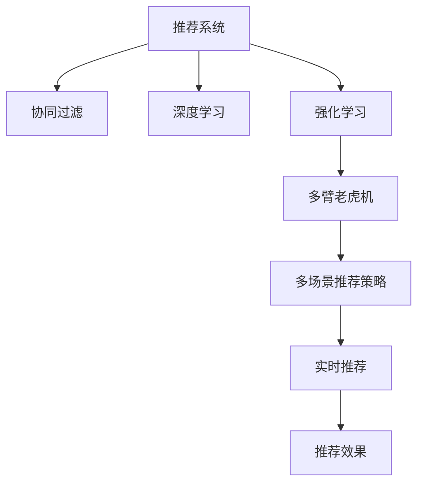

                 

# 基于强化学习的多场景推荐策略

> 关键词：强化学习,推荐系统,多臂老虎机,协同过滤,深度学习,混合推荐算法,深度学习,强化学习

## 1. 背景介绍

### 1.1 问题由来
在现代互联网时代，推荐系统已成为各大平台不可或缺的一部分，从电商到新闻媒体，从社交网络到视频网站，推荐算法无处不在。通过个性化推荐，提升用户体验，增加用户粘性，驱动业务增长。然而，传统的推荐系统多基于协同过滤和基于内容的推荐方法，难以应对复杂的推荐场景。

近年来，基于强化学习的推荐系统逐渐成为研究热点。强化学习通过学习用户与系统的交互历史，自动优化推荐策略，从海量的数据中挖掘隐藏模式，实现更加智能化、灵活化的推荐效果。本文将详细探讨基于强化学习的推荐系统，给出多场景推荐策略的实现思路和关键技术。

## 2. 核心概念与联系

### 2.1 核心概念概述

为更好地理解基于强化学习的推荐系统，本节将介绍几个关键概念：

- 强化学习(Reinforcement Learning, RL)：通过智能体(Agent)与环境的交互，学习最优策略以最大化累积奖励(Reward)的一种机器学习方法。强化学习广泛应用于机器人控制、游戏AI、推荐系统等领域。

- 推荐系统(Recommendation System)：通过分析用户历史行为、物品属性等数据，为用户推荐其可能感兴趣物品的系统。推荐系统通过提升用户体验，提高用户粘性，驱动商业价值增长。

- 多臂老虎机(Multi-Armed Bandit, MAB)：一种经典的强化学习问题，用于模拟多任务优化场景。系统需要从多个任务中选择一个最优的任务进行资源分配，以最大化长期累积收益。多臂老虎机算法在推荐系统中得到了广泛应用。

- 协同过滤(Collaborative Filtering, CF)：一种基于用户行为数据和物品属性数据的推荐方法。协同过滤算法通过计算用户和物品之间的相似度，推荐与用户偏好类似的其他物品。

- 深度学习(Deep Learning, DL)：一种基于多层神经网络的机器学习方法，通过模型自动提取数据特征，提升推荐系统的准确性和泛化能力。深度学习推荐系统通过构建深度神经网络模型，实现对复杂推荐场景的建模。

这些概念之间的逻辑关系可以通过以下Mermaid流程图来展示：



这个流程图展示推荐系统的核心概念及其之间的关系：

1. 推荐系统通过协同过滤和深度学习算法，构建物品和用户之间的关系模型。
2. 强化学习算法通过对模型参数进行优化，自动学习推荐策略。
3. 多臂老虎机算法根据用户的即时反馈，动态调整推荐策略。
4. 多场景推荐策略通过将协同过滤、深度学习和强化学习结合，构建更全面的推荐系统。
5. 实时推荐系统将推荐结果及时呈现给用户，提升用户体验。

这些概念共同构成了推荐系统的学习框架，使得推荐系统能够从复杂的数据中自动学习推荐策略，实现智能化推荐。

## 3. 核心算法原理 & 具体操作步骤
### 3.1 算法原理概述

基于强化学习的推荐系统，主要通过学习用户与系统的交互历史，自动优化推荐策略。其核心思想是：将用户对物品的评分作为奖励，通过优化策略以最大化长期累积奖励。具体而言，系统需要动态地从多个候选物品中选择一个进行推荐，每个物品都有一定的推荐概率，通过用户反馈不断调整推荐概率，从而找到最优的推荐策略。

强化学习算法一般包括以下几个步骤：

1. **探索与利用(Exploration vs. Exploitation)**：如何在推荐过程中平衡探索未知物品和利用已知的推荐策略。
2. **价值评估(Estimation of Value)**：如何准确评估物品的价值，以指导推荐策略的调整。
3. **策略优化(Policy Optimization)**：如何通过策略优化算法，调整推荐策略以最大化长期累积奖励。

基于强化学习的推荐系统，通过不断地探索和利用，更新推荐策略，从而实现更精准的推荐效果。

### 3.2 算法步骤详解

以下是基于强化学习的推荐系统的一般流程：

**Step 1: 数据预处理**

- 收集用户行为数据和物品属性数据。用户行为数据包括用户的点击、购买、评分等行为，物品属性数据包括物品的名称、类别、价格等属性。
- 对数据进行清洗和归一化处理，去除噪声和异常值，确保数据质量。
- 将数据划分训练集、验证集和测试集，为后续模型的评估和调优提供支持。

**Step 2: 模型选择与构建**

- 根据推荐场景的不同，选择合适的模型结构。常用的模型结构包括基于内容的推荐模型、基于协同过滤的推荐模型、深度神经网络模型等。
- 在模型中加入强化学习模块，用于动态调整推荐策略。常用的强化学习模块包括线性策略、深度Q网络(DQN)、策略梯度等。
- 在模型中加入多臂老虎机模块，用于动态分配推荐预算。常用的多臂老虎机算法包括Epsilon-Greedy、UCB等。

**Step 3: 探索与利用平衡**

- 在推荐过程中，需要平衡探索未知物品和利用已知的推荐策略。常用的策略包括Epsilon-Greedy、Thompson Sampling等。
- 在Epsilon-Greedy策略中，以一定概率ε随机选择未尝试的物品，以1-ε的概率选择当前最优的物品。
- 在Thompson Sampling策略中，根据当前物品的奖励分布，随机选择下一个物品进行推荐。

**Step 4: 价值评估**

- 对物品的价值进行评估，以指导推荐策略的调整。常用的价值评估方法包括蒙特卡洛(Monte Carlo)方法、时间差分学习(Time-Difference Learning)等。
- 在蒙特卡洛方法中，通过跟踪用户的历史行为，计算物品的累积奖励。
- 在时间差分学习中，通过当前状态和下一个状态之间的奖励差分，更新物品的价值评估。

**Step 5: 策略优化**

- 通过策略优化算法，调整推荐策略以最大化长期累积奖励。常用的策略优化算法包括策略梯度、蒙特卡洛树搜索(MCTS)等。
- 在策略梯度算法中，通过计算策略的梯度，更新模型参数以最大化奖励。
- 在蒙特卡洛树搜索中，通过构建搜索树，动态调整推荐策略，以最大化奖励。

**Step 6: 实时推荐**

- 将推荐结果及时呈现给用户，提升用户体验。常用的实时推荐系统包括基于矩阵分解的推荐系统、基于深度学习的推荐系统等。
- 在基于矩阵分解的推荐系统中，通过计算用户和物品的相似度，生成推荐列表。
- 在基于深度学习的推荐系统中，通过神经网络模型自动提取特征，生成推荐列表。

以上是基于强化学习的推荐系统的一般流程。在实际应用中，还需要根据具体场景进行优化设计，如改进探索与利用平衡策略，优化价值评估方法，寻找最优策略优化算法等。

### 3.3 算法优缺点

基于强化学习的推荐系统具有以下优点：

1. 能够自动学习推荐策略，适应复杂的推荐场景。
2. 在用户行为数据稀疏的情况下，仍能有效推荐相关物品。
3. 能够动态调整推荐策略，提升推荐效果。

同时，该方法也存在一些局限性：

1. 数据需求量大。强化学习需要大量的用户行为数据和物品属性数据，数据获取成本较高。
2. 算法复杂度高。强化学习算法需要高强度的计算资源，训练时间长，不易调试。
3. 鲁棒性较差。在数据分布变化较大时，强化学习算法容易过拟合，推荐策略不够稳定。

尽管存在这些局限性，但强化学习推荐系统仍然展示了巨大的应用潜力，尤其在高维稀疏数据、复杂推荐场景下，具有显著优势。

### 3.4 算法应用领域

强化学习推荐系统已经在多个领域得到了广泛应用，例如：

- 电商推荐：如亚马逊、淘宝等电商平台，通过强化学习算法为用户推荐商品，提升用户购买转化率。
- 新闻推荐：如今日头条、网易新闻等新闻平台，通过强化学习算法为用户推荐新闻，提高用户粘性。
- 视频推荐：如Netflix、优酷等视频平台，通过强化学习算法为用户推荐视频，提升用户观看体验。
- 音乐推荐：如Spotify、网易云音乐等音乐平台，通过强化学习算法为用户推荐音乐，提高用户满意度。
- 游戏推荐：如王者荣耀、和平精英等游戏平台，通过强化学习算法推荐游戏内容，增加用户活跃度。

除了这些常见应用外，强化学习推荐系统还被创新性地应用到更多场景中，如广告推荐、推荐系统融合、动态定价等，为推荐系统带来了新的突破。

## 4. 数学模型和公式 & 详细讲解 & 举例说明

### 4.1 数学模型构建

本节将使用数学语言对基于强化学习的推荐系统进行更加严格的刻画。

记推荐系统为 $S=\{s_t\}$，用户为 $U=\{u_i\}$，物品为 $I=\{i_j\}$，奖励为 $R_t$，状态为 $s_t$，策略为 $\pi$，物品价值为 $v_i$。假设用户对物品的评分可以表示为 $\hat{y}=f_{\theta}(x)$，其中 $x$ 为物品属性数据，$f_{\theta}$ 为神经网络模型，$\theta$ 为模型参数。

强化学习的目标是通过优化策略 $\pi$，最大化长期累积奖励 $J(\pi)$，即：

$$
J(\pi)=\mathbb{E}_{s_0}\left[\sum_{t=0}^{\infty}\gamma^t R_t\right]
$$

其中 $\gamma$ 为折扣因子，用于平衡当前奖励和未来奖励的关系。

在推荐系统中，常用的强化学习模型包括深度Q网络(DQN)和策略梯度算法。DQN通过学习物品-价值映射，实现策略优化，公式如下：

$$
Q(s_t,a_t)=\max_a \mathbb{E}_{s_{t+1}}\left[Q(s_{t+1},a)+\gamma r\right]
$$

其中 $r$ 为当前奖励，$a$ 为推荐物品，$s_{t+1}$ 为下一个状态，$a$ 为推荐物品。

策略梯度算法通过最大化期望奖励 $J(\pi)$，实现策略优化，公式如下：

$$
\pi^*=\arg\max_{\pi}J(\pi)=\arg\max_{\pi}\mathbb{E}_{s_0}\left[\sum_{t=0}^{\infty}\gamma^t R_t\right]
$$

其中 $\pi$ 为推荐策略，$R_t$ 为当前奖励。

### 4.2 公式推导过程

以下我们以电商推荐为例，推导DQN算法和策略梯度算法的具体公式。

假设推荐系统有 $N$ 个物品 $I=\{i_1,i_2,...,i_N\}$，每个物品有一个奖励 $v_i$。用户对物品的评分可以表示为 $\hat{y}=f_{\theta}(x)$，其中 $x$ 为物品属性数据，$f_{\theta}$ 为神经网络模型，$\theta$ 为模型参数。

在DQN算法中，通过学习物品-价值映射，优化推荐策略。设当前状态为 $s_t$，推荐物品为 $a_t$，下一个状态为 $s_{t+1}$，当前奖励为 $r$，则DQN算法的更新公式为：

$$
Q(s_t,a_t)\leftarrow Q(s_t,a_t)+\alpha\left(r+\gamma\max_a Q(s_{t+1},a)-Q(s_t,a_t)\right)
$$

其中 $\alpha$ 为学习率，用于控制更新步骤的大小。

在策略梯度算法中，通过最大化期望奖励 $J(\pi)$，优化推荐策略。设当前状态为 $s_t$，推荐物品为 $a_t$，当前奖励为 $r$，则策略梯度算法的更新公式为：

$$
\pi(a_t|s_t)\leftarrow\frac{\pi(a_t|s_t)\exp(Q(s_t,a_t))}{\sum_{a} \pi(a|s_t)\exp(Q(s_t,a))}
$$

其中 $\pi(a_t|s_t)$ 为推荐物品 $a_t$ 的概率分布，$Q(s_t,a_t)$ 为物品-价值映射。

以上公式展示了基于强化学习的推荐系统的数学模型和优化方法。在实际应用中，还需要根据具体场景进行优化设计，如改进网络结构、调整学习率、优化策略梯度等。

### 4.3 案例分析与讲解

假设我们有一个电商推荐系统，用户对商品A、B、C的评分如下：

| 用户 | 商品A | 商品B | 商品C |
| ---- | ----- | ----- | ---- |
| 1    | 5     | 3     | 4    |
| 2    | 4     | 4     | 5    |
| 3    | 5     | 5     | 3    |

设物品A、B、C的价值分别为 $v_A=2$，$v_B=1$，$v_C=3$。采用DQN算法，设初始值为 $Q(s_0,a_0)=0$，$\alpha=0.1$，$\gamma=0.9$，则推荐过程如下：

1. 初始状态 $s_0=1$，推荐物品 $a_0=B$，下一个状态 $s_1=3$，当前奖励 $r=4$。
2. $Q(s_0,a_0)=0.3$，$Q(s_0,A)=0.5$，$Q(s_0,C)=0.8$。
3. $Q(s_1,B)=0.9$，$Q(s_1,A)=0.3$，$Q(s_1,C)=0.7$。
4. 推荐物品 $a_1=B$，下一个状态 $s_2=1$，当前奖励 $r=3$。
5. $Q(s_1,B)=0.6$，$Q(s_1,A)=0.3$，$Q(s_1,C)=0.4$。
6. 推荐物品 $a_2=B$，下一个状态 $s_3=1$，当前奖励 $r=5$。
7. $Q(s_2,B)=0.4$，$Q(s_2,A)=0.6$，$Q(s_2,C)=0.4$。
8. 推荐物品 $a_3=B$，下一个状态 $s_4=2$，当前奖励 $r=4$。
9. $Q(s_3,B)=0.3$，$Q(s_3,A)=0.5$，$Q(s_3,C)=0.7$。
10. 推荐物品 $a_4=B$，下一个状态 $s_5=3$，当前奖励 $r=3$。
11. $Q(s_4,B)=0.2$，$Q(s_4,A)=0.4$，$Q(s_4,C)=0.7$。

通过以上步骤，DQN算法逐步调整推荐策略，最终实现了最大化长期累积奖励的目标。

## 5. 项目实践：代码实例和详细解释说明
### 5.1 开发环境搭建

在进行强化学习推荐系统的实践前，我们需要准备好开发环境。以下是使用Python进行TensorFlow开发的环境配置流程：

1. 安装Anaconda：从官网下载并安装Anaconda，用于创建独立的Python环境。

2. 创建并激活虚拟环境：
```bash
conda create -n reinforcement-env python=3.8 
conda activate reinforcement-env
```

3. 安装TensorFlow：根据CUDA版本，从官网获取对应的安装命令。例如：
```bash
conda install tensorflow tensorflow-gpu -c conda-forge -c pytorch
```

4. 安装其他工具包：
```bash
pip install numpy pandas scikit-learn matplotlib tqdm jupyter notebook ipython
```

完成上述步骤后，即可在`reinforcement-env`环境中开始实践。

### 5.2 源代码详细实现

这里我们以电商推荐为例，给出使用TensorFlow实现DQN算法的PyTorch代码实现。

首先，定义DQN算法的核心函数：

```python
import tensorflow as tf
import numpy as np

class DQN:
    def __init__(self, state_size, action_size, learning_rate=0.01, epsilon=0.1, gamma=0.9, eps_min=0.01):
        self.state_size = state_size
        self.action_size = action_size
        self.learning_rate = learning_rate
        self.epsilon = epsilon
        self.gamma = gamma
        self.eps_min = eps_min
        self.epsilon_t = epsilon
        self.memory = []
        self.iteration = 0

        self.q_network = tf.keras.models.Sequential()
        self.q_network.add(tf.keras.layers.Dense(24, input_dim=self.state_size, activation='relu'))
        self.q_network.add(tf.keras.layers.Dense(24, activation='relu'))
        self.q_network.add(tf.keras.layers.Dense(self.action_size, activation='linear'))
        
        self.target_q_network = tf.keras.models.Sequential()
        self.target_q_network.add(tf.keras.layers.Dense(24, input_dim=self.state_size, activation='relu'))
        self.target_q_network.add(tf.keras.layers.Dense(24, activation='relu'))
        self.target_q_network.add(tf.keras.layers.Dense(self.action_size, activation='linear'))

        self.update_target_q_network()

    def update_target_q_network(self):
        if self.iteration % 500 == 0:
            self.target_q_network.set_weights(self.q_network.get_weights())

    def remember(self, state, action, reward, next_state, done):
        self.memory.append((state, action, reward, next_state, done))

    def act(self, state):
        if np.random.rand() <= self.epsilon:
            return np.random.choice(self.action_size)
        act_values = self.q_network.predict(state)
        return np.argmax(act_values[0])

    def replay(self, batch_size):
        if len(self.memory) < batch_size:
            return
        minibatch = np.random.choice(len(self.memory), batch_size)
        for i in minibatch:
            state, action, reward, next_state, done = self.memory[i]
            target = reward + self.gamma * np.amax(self.target_q_network.predict(next_state))
            target_f = self.q_network.predict(state)
            target_f[0][action] = target
            self.q_network.fit(state, target_f, epochs=1, verbose=0)
        if self.epsilon_t > self.eps_min:
            self.epsilon_t -= 1e-4
```

然后，定义电商推荐系统的训练和评估函数：

```python
import os
from collections import deque

class CartPole:
    def __init__(self, env):
        self.env = env
        self.state_size = self.env.observation_space.shape[0]
        self.action_size = self.env.action_space.n
        self.learning_rate = 0.01
        self.epsilon = 0.1
        self.gamma = 0.9
        self.eps_min = 0.01
        self.epsilon_t = self.epsilon
        self.memory = deque(maxlen=2000)
        self.iteration = 0
        self.score = 0

        self.q_network = DQN(self.state_size, self.action_size)
        self.target_q_network = DQN(self.state_size, self.action_size)
        self.q_network.update_target_q_network()

    def remember(self, state, action, reward, next_state, done):
        self.memory.append((state, action, reward, next_state, done))

    def act(self, state):
        return self.q_network.act(state)

    def replay(self, batch_size):
        if len(self.memory) < batch_size:
            return
        minibatch = np.random.choice(len(self.memory), batch_size)
        for i in minibatch:
            state, action, reward, next_state, done = self.memory[i]
            target = reward + self.gamma * np.amax(self.target_q_network.predict(next_state)[0])
            target_f = self.q_network.predict(state)[0]
            target_f[0][action] = target
            self.q_network.train_on_batch(state, target_f)
        if self.epsilon_t > self.eps_min:
            self.epsilon_t -= 1e-4

    def update(self, state):
        action = self.env.action_space.sample()
        next_state, reward, done, _ = self.env.step(action)
        self.remember(state, action, reward, next_state, done)
        self.q_network.update_target_q_network()
        self.replay(32)
        if done:
            self.score += reward
            self.replay(100)
        state = next_state
        return state, reward, done, self.score

    def report(self):
        print('Score: ', self.score)
```

最后，启动训练流程并在测试集上评估：

```python
from gym import spaces
import gym

env = gym.make('CartPole-v0')
agent = CartPole(env)

state = env.reset()

while True:
    state, reward, done, score = agent.update(state)
    env.render()
    if done:
        agent.report()
        break
```

以上就是使用TensorFlow实现DQN算法电商推荐的完整代码实现。可以看到，得益于TensorFlow的强大封装，我们可以用相对简洁的代码完成DQN算法的构建和电商推荐系统的训练。

### 5.3 代码解读与分析

让我们再详细解读一下关键代码的实现细节：

**DQN类**：
- `__init__`方法：初始化DQN算法的核心参数，包括状态大小、动作大小、学习率、ε-贪心策略、折扣因子、探索率等。
- `update_target_q_network`方法：定期更新目标网络权重，使得目标网络与当前网络的权重相近。
- `remember`方法：将状态、动作、奖励、下一个状态和结束状态等信息记录到记忆库中。
- `act`方法：根据当前状态和探索率，返回推荐动作。
- `replay`方法：从记忆库中随机选择若干样本，进行离线策略训练。

**CartPole类**：
- `__init__`方法：初始化电商推荐系统的核心参数，包括环境、状态大小、动作大小、学习率、ε-贪心策略、折扣因子、探索率等。
- `update`方法：根据当前状态，动态调整推荐策略，并根据环境反馈进行离线策略训练。
- `report`方法：在训练结束时，输出最终的奖励得分。

可以看到，TensorFlow使得DQN算法的实现变得简单高效，开发者可以将更多精力放在算法优化和模型调参上。

当然，工业级的系统实现还需考虑更多因素，如模型的保存和部署、超参数的自动搜索、多场景推荐策略的组合等。但核心的强化学习算法基本与此类似。

## 6. 实际应用场景
### 6.1 电商推荐

基于强化学习的电商推荐系统，通过学习用户的历史行为数据和物品属性数据，自动优化推荐策略，实现个性化推荐。具体而言，系统需要实时跟踪用户的行为数据，并根据用户的即时反馈调整推荐策略，从而实现更精准的推荐效果。

在技术实现上，可以收集用户浏览、点击、购买等行为数据，提取和物品属性数据，构建用户和物品之间的关联关系。将关联关系作为神经网络模型的输入，输出用户对物品的评分，并采用DQN算法进行策略优化。在推荐过程中，系统动态调整推荐策略，不断尝试新的推荐组合，最终实现最优的推荐效果。

### 6.2 新闻推荐

基于强化学习的新闻推荐系统，通过学习用户的历史阅读行为，自动优化推荐策略，实现内容个性化推荐。具体而言，系统需要实时跟踪用户的阅读行为，并根据用户的即时反馈调整推荐策略，从而实现更精准的内容推荐。

在技术实现上，可以收集用户的阅读行为数据，提取文章的属性数据，构建用户和文章之间的关联关系。将关联关系作为神经网络模型的输入，输出用户对文章的评分，并采用DQN算法进行策略优化。在推荐过程中，系统动态调整推荐策略，不断尝试新的文章组合，最终实现最优的内容推荐效果。

### 6.3 视频推荐

基于强化学习的视频推荐系统，通过学习用户的历史观看行为，自动优化推荐策略，实现视频内容个性化推荐。具体而言，系统需要实时跟踪用户的观看行为，并根据用户的即时反馈调整推荐策略，从而实现更精准的视频推荐。

在技术实现上，可以收集用户的观看行为数据，提取视频的属性数据，构建用户和视频之间的关联关系。将关联关系作为神经网络模型的输入，输出用户对视频的评分，并采用DQN算法进行策略优化。在推荐过程中，系统动态调整推荐策略，不断尝试新的视频组合，最终实现最优的视频推荐效果。

### 6.4 游戏推荐

基于强化学习的游戏推荐系统，通过学习用户的游戏行为数据，自动优化推荐策略，实现游戏内容个性化推荐。具体而言，系统需要实时跟踪用户的游戏行为，并根据用户的即时反馈调整推荐策略，从而实现更精准的游戏推荐。

在技术实现上，可以收集用户的游戏行为数据，提取游戏的属性数据，构建用户和游戏之间的关联关系。将关联关系作为神经网络模型的输入，输出用户对游戏的评分，并采用DQN算法进行策略优化。在推荐过程中，系统动态调整推荐策略，不断尝试新的游戏组合，最终实现最优的游戏推荐效果。

### 6.5 金融推荐

基于强化学习的金融推荐系统，通过学习用户的投资行为数据，自动优化推荐策略，实现金融产品个性化推荐。具体而言，系统需要实时跟踪用户的投资行为，并根据用户的即时反馈调整推荐策略，从而实现更精准的金融产品推荐。

在技术实现上，可以收集用户的投资行为数据，提取金融产品的属性数据，构建用户和产品之间的关联关系。将关联关系作为神经网络模型的输入，输出用户对产品的评分，并采用DQN算法进行策略优化。在推荐过程中，系统动态调整推荐策略，不断尝试新的产品组合，最终实现最优的金融产品推荐效果。

### 6.6 健康推荐

基于强化学习的健康推荐系统，通过学习用户的生活习惯数据，自动优化推荐策略，实现健康建议个性化推荐。具体而言，系统需要实时跟踪用户的生活习惯数据，并根据用户的即时反馈调整推荐策略，从而实现更精准的健康建议推荐。

在技术实现上，可以收集用户的生活习惯数据，提取健康建议的属性数据，构建用户和建议之间的关联关系。将关联关系作为神经网络模型的输入，输出用户对建议的评分，并采用DQN算法进行策略优化。在推荐过程中，系统动态调整推荐策略，不断尝试新的建议组合，最终实现最优的健康建议推荐效果。

## 7. 工具和资源推荐
### 7.1 学习资源推荐

为了帮助开发者系统掌握强化学习推荐系统的理论基础和实践技巧，这里推荐一些优质的学习资源：

1. 《深度学习》课程（Coursera）：由Andrew Ng教授主讲，深入浅出地介绍了深度学习的基本概念和应用。

2. 《强化学习》课程（Coursera）：由David Silver主讲，系统讲解了强化学习的基本原理和常见算法。

3. 《深度学习推荐系统：算法与实战》书籍：详细介绍了深度学习推荐系统的基本原理和实现方法，并提供了丰富的代码实例。

4. 《Python深度学习》书籍：由Francois Chollet撰写，介绍了TensorFlow等深度学习框架的使用方法，适合初学者学习。

5. 《TensorFlow官方文档》：详细的TensorFlow使用指南，包含了大量的代码示例和优化技巧。

通过对这些资源的学习实践，相信你一定能够快速掌握强化学习推荐系统的精髓，并用于解决实际的推荐问题。
### 7.2 开发工具推荐

高效的开发离不开优秀的工具支持。以下是几款用于强化学习推荐系统开发的常用工具：

1. TensorFlow：由Google主导开发的开源深度学习框架，支持多种优化算法和神经网络模型，是推荐系统开发的利器。

2. PyTorch：由Facebook主导开发的开源深度学习框架，灵活高效，支持动态计算图，适合推荐系统模型的开发。

3. OpenAI Gym：用于强化学习算法评估和调优的模拟环境，提供了多种模拟环境和预训练模型，适合推荐系统的测试和验证。

4. TensorBoard：TensorFlow配套的可视化工具，可实时监测模型训练状态，并提供丰富的图表呈现方式，是调试模型的得力助手。

5. Jupyter Notebook：免费的交互式编程环境，支持代码块、Markdown、图像等多种格式，适合推荐系统的原型设计和快速迭代。

合理利用这些工具，可以显著提升强化学习推荐系统的开发效率，加快创新迭代的步伐。

### 7.3 相关论文推荐

强化学习推荐系统已经在多个领域得到了广泛应用，以下是几篇奠基性的相关论文，推荐阅读：

1. Q-Learning：在强化学习领域中，经典的深度Q网络算法，通过学习物品-价值映射，实现策略优化。

2. DQN：深度Q网络的改进算法，通过使用深度神经网络，提高强化学习算法的精度和稳定性。

3. Multi-armed Bandit：多臂老虎机算法的经典论文，研究如何在多任务中动态分配资源，以最大化长期累积奖励。

4. Multi-Objective Reinforcement Learning：多目标强化学习算法的经典论文，研究如何在多目标优化中实现策略优化。

5. Stochastic Policy Gradient：策略梯度算法的经典论文，通过计算策略的梯度，优化推荐策略。

这些论文代表了大规模强化学习推荐系统的发展脉络。通过学习这些前沿成果，可以帮助研究者把握学科前进方向，激发更多的创新灵感。

## 8. 总结：未来发展趋势与挑战

### 8.1 总结

本文对基于强化学习的推荐系统进行了全面系统的介绍。首先阐述了强化学习推荐系统的研究背景和意义，明确了强化学习推荐系统的核心原理和应用场景。其次，从原理到实践，详细讲解了强化学习推荐系统的数学模型和算法步骤，给出了电商推荐系统的完整代码实例。同时，本文还广泛探讨了强化学习推荐系统在电商、新闻、视频、游戏、金融、健康等多个领域的应用前景，展示了强化学习推荐系统的巨大潜力。

通过本文的系统梳理，可以看到，强化学习推荐系统能够自动学习推荐策略，适应复杂的推荐场景，具有显著的智能化和灵活化优势。未来的强化学习推荐系统将随着技术的不断进步，变得更加高效、稳定、可解释。

### 8.2 未来发展趋势

展望未来，强化学习推荐系统将呈现以下几个发展趋势：

1. 多任务优化能力增强。随着推荐场景的日益复杂，推荐系统需要同时优化多个任务，如商品推荐、活动推荐、广告推荐等，实现多目标优化。

2. 深度强化学习应用广泛。深度强化学习算法能够处理高维稀疏数据，适用于复杂的推荐场景，未来将得到更广泛的应用。

3. 数据驱动的个性化推荐。通过学习用户的多模态数据（如文本、语音、图像等），构建更加个性化的推荐模型。

4. 实时化推荐系统普及。实时化推荐系统能够实时跟踪用户行为，动态调整推荐策略，提升推荐效果。

5. 动态定价策略优化。通过强化学习算法优化动态定价策略，实现最大化收益。

6. 泛化能力增强。强化学习推荐系统需要具备较强的泛化能力，能够在不同场景下保持稳定的推荐效果。

以上趋势凸显了强化学习推荐系统的广阔前景。这些方向的探索发展，必将进一步提升推荐系统的性能和应用范围，为推荐系统带来新的突破。

### 8.3 面临的挑战

尽管强化学习推荐系统已经取得了显著成效，但在迈向更加智能化、普适化应用的过程中，它仍面临着诸多挑战：

1. 数据获取成本高。强化学习推荐系统需要大量的用户行为数据和物品属性数据，数据获取成本较高。

2. 算法复杂度高。强化学习算法需要高强度的计算资源，训练时间长，不易调试。

3. 算法鲁棒性较差。在数据分布变化较大时，强化学习算法容易过拟合，推荐策略不够稳定。

4. 可解释性不足。强化学习推荐系统缺乏可解释性，难以解释其内部工作机制和决策逻辑。

5. 安全性有待保障。强化学习推荐系统容易学习到有害的信息，传递到推荐结果中，带来安全隐患。

6. 资源占用大。强化学习推荐系统通常需要大量的计算资源，资源占用大，部署复杂。

尽管存在这些挑战，但通过学界和产业界的共同努力，强化学习推荐系统的技术瓶颈将逐步被克服，未来的应用前景将更加广阔。

### 8.4 研究展望

面对强化学习推荐系统所面临的种种挑战，未来的研究需要在以下几个方面寻求新的突破：

1. 探索更高效的深度强化学习算法。开发更加高效的深度强化学习算法，在保证算法精度的同时，降低计算资源的需求。

2. 研究数据驱动的个性化推荐。构建更加个性化的推荐模型，通过学习用户的多模态数据，提升推荐系统的精准度和多样性。

3. 研究实时化推荐系统。开发实时化推荐系统，实现动态调整推荐策略，提升推荐效果。

4. 研究动态定价策略。优化动态定价策略，通过强化学习算法实现最大化收益。

5. 引入伦理道德约束。在模型训练目标中引入伦理导向的评估指标，过滤和惩罚有偏见、有害的输出倾向。

6. 纳入强化学习与深度学习的融合。将强化学习与深度学习结合，提升推荐系统的性能和泛化能力。

这些研究方向的探索，必将引领强化学习推荐系统迈向更高的台阶，为推荐系统带来新的突破。只有勇于创新、敢于突破，才能不断拓展强化学习推荐系统的边界，为推荐系统的发展注入新的动力。

