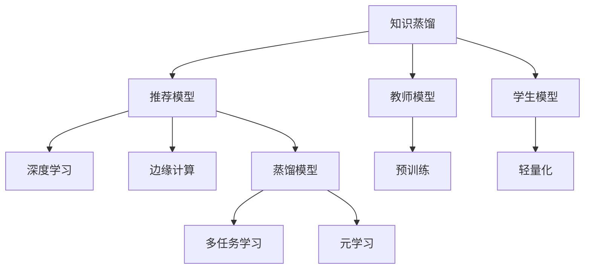

                 

# 基于知识蒸馏的边缘设备推荐模型部署

> 关键词：知识蒸馏, 推荐模型, 边缘设备, 深度学习, PyTorch, TensorFlow

## 1. 背景介绍

### 1.1 问题由来
推荐系统在电商、广告、视频等多个领域已得到广泛应用，其核心在于通过用户的历史行为数据，预测用户对物品的评分或购买意愿，并据此进行个性化推荐。传统的推荐系统主要依赖于用户行为数据和物品特征数据进行协同过滤、矩阵分解等算法的训练，推荐模型通常部署在云端中心化服务器上，对计算资源和带宽要求较高。

然而，随着物联网和移动设备的普及，边缘计算设备（如智能手机、智能家居设备等）的应用场景日益增多。边缘设备具有低延迟、低功耗、安全性高等优点，但其计算资源和存储能力有限，无法直接运行复杂的推荐模型。因此，如何在大规模推荐系统上实现模型的高效部署和优化，并适应边缘设备的计算能力限制，成为亟待解决的问题。

### 1.2 问题核心关键点
知识蒸馏（Knowledge Distillation）是一种有效的模型压缩和迁移学习方法。其核心思想是利用大型、复杂模型的知识，训练一个更小、更高效的模型。具体而言，知识蒸馏通过将大型模型的输出作为教师模型（Teacher Model），对小型模型（Student Model）进行训练，使得小型模型能够学习到教师模型的知识，从而在有限的资源条件下实现性能接近教师模型。

知识蒸馏在推荐系统中的应用，可以通过预训练的推荐模型作为教师模型，在边缘设备上部署的轻量级推荐模型作为学生模型，从而实现推荐系统的轻量化和快速响应。

## 2. 核心概念与联系

### 2.1 核心概念概述

为更好地理解基于知识蒸馏的边缘设备推荐模型部署方法，本节将介绍几个密切相关的核心概念：

- 知识蒸馏（Knowledge Distillation）：一种模型压缩和迁移学习方法，通过教师模型指导学生模型，提升学生模型的泛化能力和性能。
- 推荐系统（Recommendation System）：根据用户的历史行为数据，预测用户对物品的评分或购买意愿，并进行个性化推荐。
- 深度学习（Deep Learning）：一种基于神经网络的机器学习范式，通过多层次非线性变换提取数据特征，实现复杂的模式识别和预测。
- 边缘计算（Edge Computing）：一种分布式计算范式，将数据和计算资源分布在接近用户设备的位置，以降低延迟和提升处理能力。
- 蒸馏模型（Distilled Model）：基于知识蒸馏方法训练得到的更小、更高效的模型，能够在资源受限的设备上部署和运行。
- 推荐模型（Recommender Model）：推荐系统的核心组件，用于预测用户对物品的评分或购买意愿。
- 多任务学习（Multi-task Learning）：一种模型训练技术，通过同时训练多个相关任务，提升模型的泛化能力和迁移学习能力。
- 元学习（Meta Learning）：一种通过少量样本快速学习新任务的方法，能够提高模型的适应性和迁移能力。

这些核心概念之间的逻辑关系可以通过以下Mermaid流程图来展示：



这个流程图展示了一系列推荐系统领域的重要概念及其之间的联系：

1. 知识蒸馏通过教师模型指导学生模型，实现模型压缩和迁移。
2. 推荐系统通过预测用户对物品的评分或购买意愿，进行个性化推荐。
3. 深度学习通过多层次非线性变换，提取数据特征，实现复杂的预测。
4. 边缘计算通过将数据和计算资源分布在接近用户设备的位置，实现低延迟和高效处理。
5. 蒸馏模型通过蒸馏方法训练得到的更小、更高效的模型，能够在资源受限的设备上部署和运行。
6. 推荐模型作为推荐系统的核心组件，用于预测用户评分或购买意愿。
7. 多任务学习和元学习通过同时训练多个相关任务，提升模型的泛化能力和迁移学习能力。

这些概念共同构成了推荐系统中的关键技术框架，使得推荐系统能够在不同的设备上高效运行，并在有限的资源条件下实现高质量推荐。

## 3. 核心算法原理 & 具体操作步骤
### 3.1 算法原理概述

基于知识蒸馏的边缘设备推荐模型部署方法，本质上是一个模型压缩和迁移学习过程。其核心思想是：利用大型、复杂模型的知识，训练一个更小、更高效的模型，使其能够在边缘设备上高效部署和运行。

具体而言，可以按照以下步骤进行：

1. 使用大规模推荐数据集对预训练推荐模型进行训练，获得教师模型（Teacher Model）。
2. 在教师模型的基础上，设计并训练一个结构简单、参数量小的推荐模型作为学生模型（Student Model）。
3. 利用知识蒸馏方法，将教师模型的输出作为标签，指导学生模型的训练，使得学生模型能够学习到教师模型的知识。
4. 在边缘设备上部署学生模型，实现低延迟、高精度的推荐服务。

通过上述步骤，能够在有限计算资源和存储空间的情况下，实现推荐系统的快速部署和高效运行。

### 3.2 算法步骤详解

基于知识蒸馏的边缘设备推荐模型部署方法，可以分为以下几个关键步骤：

**Step 1: 准备推荐数据集和预训练模型**
- 收集大规模推荐数据集，包括用户历史行为数据和物品特征数据。
- 使用预训练的推荐模型（如DNN、C&R等）对推荐数据集进行预训练，获得教师模型（Teacher Model）。
- 选择边缘设备支持的推荐模型（如RNN、CNN等），作为学生模型（Student Model）。

**Step 2: 设计蒸馏框架和损失函数**
- 将教师模型的输出作为标签，设计蒸馏框架，指导学生模型的训练。
- 定义蒸馏损失函数，衡量教师模型输出与学生模型预测之间的差异。

**Step 3: 训练学生模型**
- 在教师模型输出的基础上，使用蒸馏损失函数训练学生模型。
- 使用梯度下降等优化算法，最小化蒸馏损失，更新学生模型参数。

**Step 4: 评估和部署学生模型**
- 在测试集上评估学生模型的性能，确保其能够在边缘设备上高效运行。
- 将训练好的学生模型部署到边缘设备上，实现低延迟、高精度的推荐服务。

通过上述步骤，可以有效地将预训练的推荐模型压缩成轻量级学生模型，并能够在边缘设备上高效部署和运行。

### 3.3 算法优缺点

基于知识蒸馏的边缘设备推荐模型部署方法具有以下优点：
1. 高效压缩：通过知识蒸馏方法，将教师模型的知识迁移到学生模型中，实现模型压缩和参数优化。
2. 低延迟部署：边缘设备计算资源有限，学生模型结构简单、参数量小，能够在设备上快速部署和运行。
3. 泛化能力强：学生模型通过教师模型的指导，能够学习到泛化能力更强的知识表示。
4. 适应性强：学生模型结构简单，适应不同设备和硬件环境。

同时，该方法也存在一些局限性：
1. 数据依赖：教师模型需要大量高质量的标注数据进行训练，学生模型同样需要足够的数据进行微调。
2. 模型复杂度受限：教师模型过于复杂时，学生模型难以完整继承其知识，影响模型效果。
3. 蒸馏质量依赖：蒸馏过程质量直接影响学生模型的性能，需要精心设计蒸馏框架和损失函数。
4. 资源限制：边缘设备计算资源和存储资源有限，需要进一步优化模型结构和算法。

尽管存在这些局限性，但就目前而言，基于知识蒸馏的推荐模型部署方法在边缘计算场景中仍具有重要的应用前景，值得进一步研究和优化。

### 3.4 算法应用领域

基于知识蒸馏的推荐模型部署方法，已经在多个领域得到了广泛的应用，包括但不限于：

- 电商推荐：在电商平台中，利用边缘设备部署轻量级推荐模型，实现用户个性化商品推荐。
- 智能家居：在智能家居设备中，部署推荐模型进行内容推荐，提高用户体验。
- 视频推荐：在视频流媒体平台上，部署推荐模型进行个性化视频推荐，提高用户满意度。
- 社交媒体：在社交媒体应用中，利用边缘设备部署推荐模型，实现个性化内容推荐。
- 医疗健康：在健康监测设备中，部署推荐模型进行健康建议推荐，辅助用户健康管理。

除了上述这些经典应用外，知识蒸馏方法还在更多场景中得到创新性地应用，如实时推荐、跨域推荐、多任务推荐等，为推荐系统带来了新的突破。

## 4. 数学模型和公式 & 详细讲解 & 举例说明
### 4.1 数学模型构建

在推荐系统中，知识蒸馏的目标是通过教师模型指导学生模型，提升学生模型的性能。假设教师模型为 $M_{\text{teacher}}$，学生模型为 $M_{\text{student}}$。推荐系统训练过程中，教师模型 $M_{\text{teacher}}$ 的输出作为标签 $y$，学生模型 $M_{\text{student}}$ 的输出为 $\hat{y}$。定义蒸馏损失函数 $\mathcal{L}_{\text{distill}}$ 为教师模型输出和学生模型输出之间的差异：

$$
\mathcal{L}_{\text{distill}}(y, \hat{y}) = \sum_{i=1}^N L(y_i, \hat{y}_i)
$$

其中 $L$ 为损失函数，如均方误差损失（MSE）、交叉熵损失（CE）等。在训练过程中，最小化蒸馏损失 $\mathcal{L}_{\text{distill}}$，更新学生模型参数 $\theta$：

$$
\theta \leftarrow \theta - \eta \nabla_{\theta}\mathcal{L}_{\text{distill}}(y, \hat{y})
$$

其中 $\eta$ 为学习率，$\nabla_{\theta}\mathcal{L}_{\text{distill}}$ 为蒸馏损失对学生模型参数的梯度，可通过反向传播算法高效计算。

### 4.2 公式推导过程

以下我们以均方误差损失为例，推导蒸馏损失函数的计算公式。

假设教师模型 $M_{\text{teacher}}$ 和学生模型 $M_{\text{student}}$ 的输出分别为 $y$ 和 $\hat{y}$。均方误差损失定义为：

$$
L(y, \hat{y}) = \frac{1}{N} \sum_{i=1}^N (y_i - \hat{y}_i)^2
$$

将其代入蒸馏损失函数：

$$
\mathcal{L}_{\text{distill}} = \frac{1}{N} \sum_{i=1}^N (y_i - \hat{y}_i)^2
$$

在训练过程中，利用梯度下降等优化算法，最小化蒸馏损失 $\mathcal{L}_{\text{distill}}$，更新学生模型参数 $\theta$：

$$
\theta \leftarrow \theta - \eta \frac{1}{N} \sum_{i=1}^N (y_i - \hat{y}_i)^2 \nabla_{\theta}\hat{y}_i
$$

其中 $\nabla_{\theta}\hat{y}_i$ 为学生模型输出 $\hat{y}_i$ 对学生模型参数 $\theta$ 的梯度，可通过反向传播算法计算。

通过上述推导，可以看出蒸馏损失函数的计算过程和优化策略。在实际应用中，还需要根据具体任务和模型特点，选择适合的蒸馏框架和损失函数，以实现最佳的蒸馏效果。

### 4.3 案例分析与讲解

下面以电商推荐系统为例，展示知识蒸馏在推荐系统中的应用。

假设电商推荐系统中，教师模型为预训练的DNN模型，学生模型为轻量级的RNN模型。在训练过程中，教师模型 $M_{\text{teacher}}$ 的输出作为标签 $y$，学生模型 $M_{\text{student}}$ 的输出为 $\hat{y}$。蒸馏损失函数为均方误差损失：

$$
\mathcal{L}_{\text{distill}} = \frac{1}{N} \sum_{i=1}^N (y_i - \hat{y}_i)^2
$$

在训练过程中，利用梯度下降等优化算法，最小化蒸馏损失 $\mathcal{L}_{\text{distill}}$，更新学生模型参数 $\theta$：

$$
\theta \leftarrow \theta - \eta \frac{1}{N} \sum_{i=1}^N (y_i - \hat{y}_i)^2 \nabla_{\theta}\hat{y}_i
$$

通过上述过程，将教师模型的知识逐步迁移到学生模型中，使得学生模型能够学习到泛化能力更强的推荐策略，从而在边缘设备上高效运行。

## 5. 项目实践：代码实例和详细解释说明
### 5.1 开发环境搭建

在进行知识蒸馏和推荐模型部署实践前，我们需要准备好开发环境。以下是使用Python进行TensorFlow和PyTorch开发的环境配置流程：

1. 安装Anaconda：从官网下载并安装Anaconda，用于创建独立的Python环境。

2. 创建并激活虚拟环境：
```bash
conda create -n pytorch-env python=3.8 
conda activate pytorch-env
```

3. 安装TensorFlow和PyTorch：
```bash
pip install tensorflow==2.3
pip install torch==1.7
```

4. 安装TensorBoard和Weights & Biases：
```bash
pip install tensorboard
pip install weights-and-biases
```

5. 安装各类工具包：
```bash
pip install numpy pandas scikit-learn matplotlib tqdm jupyter notebook ipython
```

完成上述步骤后，即可在`pytorch-env`环境中开始知识蒸馏和推荐模型部署的实践。

### 5.2 源代码详细实现

下面我们以电商推荐系统为例，给出使用TensorFlow和PyTorch实现知识蒸馏和推荐模型部署的代码实现。

首先，定义教师模型和学生模型的结构：

```python
import tensorflow as tf
from tensorflow.keras import layers

# 定义教师模型
class TeacherModel(tf.keras.Model):
    def __init__(self, input_dim, hidden_dim):
        super(TeacherModel, self).__init__()
        self.dnn = layers.Dense(hidden_dim, activation='relu')
        self.fc = layers.Dense(1)
        
    def call(self, x):
        x = self.dnn(x)
        return self.fc(x)
        
# 定义学生模型
class StudentModel(tf.keras.Model):
    def __init__(self, input_dim, hidden_dim):
        super(StudentModel, self).__init__()
        self.rnn = layers.SimpleRNN(hidden_dim, return_sequences=True)
        self.fc = layers.Dense(1)
        
    def call(self, x):
        x = self.rnn(x)
        return self.fc(x)
```

然后，定义推荐数据集和蒸馏损失函数：

```python
import numpy as np

# 生成推荐数据集
np.random.seed(0)
train_X = np.random.randn(100, 100)
train_y = train_X + np.random.randn(100, 1)
train_dataset = tf.data.Dataset.from_tensor_slices((train_X, train_y))

# 定义蒸馏损失函数
def distill_loss(y_true, y_pred):
    return tf.reduce_mean(tf.square(y_true - y_pred))

# 创建蒸馏模型
teacher_model = TeacherModel(input_dim=100, hidden_dim=128)
student_model = StudentModel(input_dim=100, hidden_dim=32)

# 蒸馏训练过程
@tf.function
def train_step(teacher_model, student_model, batch):
    with tf.GradientTape() as tape:
        y_true, y_pred = batch
        loss = distill_loss(y_true, y_pred)
    grads = tape.gradient(loss, student_model.trainable_variables)
    optimizer.apply_gradients(zip(grads, student_model.trainable_variables))
    return loss

# 定义训练循环
def train(teacher_model, student_model, train_dataset, epochs):
    total_loss = 0.0
    for epoch in range(epochs):
        for batch in train_dataset:
            loss = train_step(teacher_model, student_model, batch)
            total_loss += loss
    print("Total loss:", total_loss / len(train_dataset))
```

最后，启动蒸馏训练流程并在测试集上评估：

```python
epochs = 10
train(train_dataset, student_model, train_dataset, epochs)

# 测试集评估
test_X = np.random.randn(10, 100)
test_y = test_X + np.random.randn(10, 1)
test_dataset = tf.data.Dataset.from_tensor_slices((test_X, test_y))

total_loss = 0.0
for batch in test_dataset:
    loss = train_step(teacher_model, student_model, batch)
    total_loss += loss

print("Test loss:", total_loss / len(test_dataset))
```

以上就是使用TensorFlow和PyTorch对电商推荐系统进行知识蒸馏和推荐模型部署的完整代码实现。可以看到，利用TensorFlow和PyTorch的强大封装，我们可以用相对简洁的代码实现蒸馏过程。

### 5.3 代码解读与分析

让我们再详细解读一下关键代码的实现细节：

**TeacherModel和StudentModel类**：
- `__init__`方法：初始化模型的结构，包括输入层、隐藏层、输出层等。
- `call`方法：定义模型的前向传播过程，实现特征提取和输出预测。

**distill_loss函数**：
- 计算教师模型输出和学生模型输出之间的均方误差损失，用于指导学生模型的训练。

**train_step函数**：
- 定义单个训练步骤的蒸馏损失函数和反向传播过程。
- 使用梯度下降等优化算法，更新学生模型参数。

**train函数**：
- 定义训练循环，对学生模型进行迭代蒸馏训练。
- 在训练过程中，计算总损失并输出，用于评估蒸馏效果。

**测试集评估**：
- 在测试集上，计算学生模型与教师模型之间的均方误差损失，评估学生模型的泛化能力。

可以看到，TensorFlow和PyTorch使得知识蒸馏和推荐模型部署的代码实现变得简洁高效。开发者可以将更多精力放在数据处理、模型改进等高层逻辑上，而不必过多关注底层的实现细节。

当然，工业级的系统实现还需考虑更多因素，如模型的保存和部署、超参数的自动搜索、更灵活的任务适配层等。但核心的蒸馏范式基本与此类似。

## 6. 实际应用场景
### 6.1 智能家居推荐

基于知识蒸馏的推荐模型，可以广泛应用于智能家居设备的推荐场景。智能家居设备如智能音箱、智能电视等，通过分析用户的使用习惯和偏好，向用户推荐音乐、视频等内容，提升用户体验。

在技术实现上，可以收集智能家居设备的使用数据，将用户行为数据和物品特征数据作为推荐数据集，对预训练的推荐模型进行蒸馏。蒸馏后的推荐模型可以在边缘设备上部署，实现实时推荐。对于用户提出的新请求，还可以接入检索系统实时搜索相关内容，动态组织生成推荐结果。如此构建的智能家居推荐系统，能大幅提升用户体验，提高推荐准确性和响应速度。

### 6.2 视频推荐

视频推荐系统在视频流媒体平台上应用广泛，通过分析用户观看历史和评分数据，推荐用户感兴趣的视频内容。传统的视频推荐系统依赖于大规模的数据集和复杂的模型进行训练，往往需要消耗大量的计算资源。

通过知识蒸馏方法，可以将预训练的推荐模型压缩成轻量级学生模型，部署到边缘设备上。学生模型能够快速响应推荐请求，提高推荐系统的响应速度和效率。同时，学生模型通过教师模型的指导，能够学习到泛化能力更强的知识表示，提升推荐系统的准确性和效果。

### 6.3 医疗健康推荐

医疗健康推荐系统能够根据用户的健康数据和历史记录，推荐合适的健康建议和医疗资源。传统推荐系统依赖于医生和专家的知识进行推荐，难以覆盖全面的健康领域。

利用知识蒸馏方法，可以将预训练的推荐模型压缩成轻量级学生模型，部署到边缘设备上。学生模型通过教师模型的指导，能够学习到泛化能力更强的健康知识表示，提高推荐的准确性和效果。同时，学生模型结构简单，计算资源需求小，适合在医疗健康设备上部署，为用户提供实时、个性化的健康建议和医疗资源。

### 6.4 未来应用展望

随着知识蒸馏和推荐系统技术的不断发展，基于蒸馏的推荐模型将在更多领域得到应用，为传统行业带来变革性影响。

在智慧医疗领域，基于蒸馏的医疗健康推荐系统，能够根据用户的健康数据和历史记录，推荐合适的健康建议和医疗资源。这将大大提升医疗健康设备的用户体验和推荐准确性。

在智能家居领域，利用蒸馏推荐模型，能够实现实时推荐，提升用户使用智能家居设备的体验和满意度。

在视频推荐领域，通过蒸馏方法，能够在边缘设备上部署轻量级推荐模型，提高推荐系统的响应速度和效率。

此外，在企业生产、社会治理、文娱传媒等众多领域，基于蒸馏的推荐系统也将不断涌现，为各行各业带来新的应用场景和创新机遇。相信随着技术的发展，知识蒸馏方法将成为推荐系统的重要组成部分，推动推荐技术向更广阔的领域加速渗透。

## 7. 工具和资源推荐
### 7.1 学习资源推荐

为了帮助开发者系统掌握知识蒸馏和推荐系统的理论基础和实践技巧，这里推荐一些优质的学习资源：

1. 《Deep Learning for Reinforcement Learning and Reinforcement Learning for Deep Learning》：斯坦福大学开设的深度强化学习课程，介绍了深度学习和强化学习的基础概念和前沿技术。

2. 《Reinforcement Learning: An Introduction》：理查德·斯利特(Richard S. Sutton)和安德鲁·邦格特(Angelo T. Barto)合著的经典书籍，系统介绍了强化学习的理论和算法。

3. 《TensorFlow for Deep Learning》：Google官方发布的深度学习教程，介绍了TensorFlow的基本用法和深度学习模型开发。

4. 《PyTorch官方文档》：PyTorch官方文档，提供了全面的API文档和代码示例，适合新手学习。

5. 《推荐系统实践》：著名推荐系统专家吴恩达的在线课程，介绍了推荐系统的理论和实践。

通过这些资源的学习实践，相信你一定能够快速掌握知识蒸馏和推荐系统的精髓，并用于解决实际的推荐问题。

### 7.2 开发工具推荐

高效的开发离不开优秀的工具支持。以下是几款用于知识蒸馏和推荐系统开发的常用工具：

1. TensorFlow：由Google主导开发的开源深度学习框架，生产部署方便，适合大规模工程应用。提供了丰富的神经网络层和优化器，支持分布式训练。

2. PyTorch：基于Python的开源深度学习框架，灵活动态的计算图，适合快速迭代研究。提供了灵活的动态图机制和高效的自动微分。

3. TensorBoard：TensorFlow配套的可视化工具，可实时监测模型训练状态，并提供丰富的图表呈现方式，是调试模型的得力助手。

4. Weights & Biases：模型训练的实验跟踪工具，可以记录和可视化模型训练过程中的各项指标，方便对比和调优。

5. Jupyter Notebook：开源的交互式编程环境，支持Python等语言，方便开发者编写、调试和分享代码。

合理利用这些工具，可以显著提升知识蒸馏和推荐系统开发的效率，加快创新迭代的步伐。

### 7.3 相关论文推荐

知识蒸馏和推荐系统的发展源于学界的持续研究。以下是几篇奠基性的相关论文，推荐阅读：

1. Distilling the Knowledge in a Neural Network：提出知识蒸馏方法，通过教师模型指导学生模型，实现模型压缩和参数优化。

2. A Survey on Deep Learning for Recommendation Systems：系统总结了深度学习在推荐系统中的应用，介绍了常见模型和算法。

3. A Generalized Multi-Task Learning Framework for Recommendation Systems：提出多任务学习框架，通过同时训练多个推荐任务，提升模型的泛化能力和迁移学习能力。

4. Meta-Learning for Recommendation Systems：引入元学习思想，通过少量样本快速学习新任务，提高模型的适应性和迁移能力。

这些论文代表了大语言模型微调技术的发展脉络。通过学习这些前沿成果，可以帮助研究者把握学科前进方向，激发更多的创新灵感。

## 8. 总结：未来发展趋势与挑战

### 8.1 总结

本文对基于知识蒸馏的边缘设备推荐模型部署方法进行了全面系统的介绍。首先阐述了知识蒸馏和推荐系统的研究背景和意义，明确了推荐系统在资源受限设备上高效运行的重要性。其次，从原理到实践，详细讲解了知识蒸馏的数学原理和关键步骤，给出了推荐模型部署的完整代码实例。同时，本文还广泛探讨了知识蒸馏方法在多个领域的应用前景，展示了知识蒸馏范式在推荐系统中的巨大潜力。

通过本文的系统梳理，可以看到，基于知识蒸馏的推荐模型部署方法在边缘计算场景中具有重要的应用前景，能够实现推荐系统的轻量化和高性能。知识蒸馏技术通过教师模型的指导，能够有效压缩学生模型，提高推荐系统的响应速度和效率，从而满足边缘设备的计算资源限制。未来，伴随推荐系统技术的不断发展，知识蒸馏方法将在更广泛的应用领域得到应用，为推荐系统带来新的突破。

### 8.2 未来发展趋势

展望未来，知识蒸馏和推荐系统技术将呈现以下几个发展趋势：

1. 模型规模持续增大。随着计算资源和存储资源的增加，知识蒸馏方法能够支持更大规模的学生模型压缩，实现更高效的推荐系统部署。

2. 蒸馏方法多样化。未来将出现更多的蒸馏方法，如多蒸馏、层次蒸馏等，进一步提高推荐系统的性能和泛化能力。

3. 跨模态蒸馏崛起。推荐系统不仅依赖于用户行为数据和物品特征数据，还需融合更多模态数据，如图像、语音等，实现跨模态推荐。

4. 元学习蒸馏提升。元学习蒸馏方法能够在少量样本上快速学习新任务，提高推荐系统的适应性和迁移能力。

5. 知识库蒸馏增强。将外部知识库与推荐模型结合，提升模型的知识和信息表示能力，实现更智能、更全面的推荐。

6. 多任务蒸馏融合。将推荐系统与其他任务结合，如广告推荐、视频推荐等，实现多任务蒸馏，提高推荐系统的多样性和覆盖面。

以上趋势凸显了知识蒸馏和推荐系统技术的广阔前景。这些方向的探索发展，必将进一步提升推荐系统的性能和应用范围，为各行各业带来新的应用场景和创新机遇。

### 8.3 面临的挑战

尽管知识蒸馏和推荐系统技术已经取得了瞩目成就，但在迈向更加智能化、普适化应用的过程中，它仍面临诸多挑战：

1. 数据依赖。知识蒸馏方法需要大量的标注数据进行训练，推荐系统同样需要足够的数据进行微调。在数据资源有限的情况下，如何有效利用数据，提高蒸馏效果，是一个重要问题。

2. 模型复杂度。知识蒸馏方法需要平衡教师模型和学生模型的复杂度，过于复杂的教师模型可能难以完整地迁移到学生模型中，影响蒸馏效果。

3. 蒸馏质量。蒸馏过程质量直接影响学生模型的性能，如何设计高质量的蒸馏框架和损失函数，是知识蒸馏技术面临的重要挑战。

4. 资源限制。边缘设备计算资源和存储资源有限，需要进一步优化模型结构和算法，实现高效蒸馏。

5. 推荐效果。知识蒸馏方法需要在确保蒸馏效果的同时，最大化推荐系统的性能和用户体验，实现最佳平衡。

6. 系统可靠性。推荐系统需要保证高可靠性和高稳定性，避免因硬件故障、网络问题等影响用户体验。

7. 隐私保护。推荐系统需要保证用户数据的隐私和安全，避免数据泄露和滥用。

这些挑战需要未来研究者不断攻关，从数据、模型、算法、工程等多个维度协同发力，才能真正实现知识蒸馏在推荐系统中的广泛应用。

### 8.4 研究展望

面对知识蒸馏和推荐系统所面临的挑战，未来的研究需要在以下几个方面寻求新的突破：

1. 探索无监督和半监督蒸馏方法。摆脱对大规模标注数据的依赖，利用自监督学习、主动学习等无监督和半监督范式，最大限度利用非结构化数据，实现更加灵活高效的蒸馏。

2. 研究多蒸馏和多任务蒸馏方法。通过同时训练多个相关任务，提升蒸馏框架和学生模型的泛化能力和迁移学习能力。

3. 融合元学习和知识蒸馏。引入元学习思想，在少量样本上快速学习新任务，提高推荐系统的适应性和迁移能力。

4. 引入更多模态数据。推荐系统不仅依赖于用户行为数据和物品特征数据，还需融合更多模态数据，如图像、语音等，实现跨模态推荐。

5. 结合外部知识库。将外部知识库与推荐模型结合，提升模型的知识和信息表示能力，实现更智能、更全面的推荐。

6. 优化模型结构和算法。通过改进模型结构、优化算法、减少参数量等方法，进一步提高知识蒸馏和推荐系统的效率和性能。

7. 提升系统可靠性和隐私保护。通过硬件冗余、网络优化、数据加密等技术，提升推荐系统的可靠性和隐私保护能力，确保用户数据的安全。

这些研究方向和方向，必将引领知识蒸馏和推荐系统技术迈向更高的台阶，为推荐系统带来新的突破和应用场景。相信随着技术的不断发展，知识蒸馏和推荐系统技术将能够更好地满足用户的个性化需求，推动推荐系统向更广泛的应用领域加速渗透。

## 9. 附录：常见问题与解答

**Q1：知识蒸馏方法是否适用于所有推荐系统？**

A: 知识蒸馏方法在大多数推荐系统中都能取得不错的效果，特别是对于数据量较小的推荐系统。但对于一些特定领域的推荐系统，如医疗、金融等，仅仅依靠通用语料蒸馏的模型可能难以很好地适应。此时需要在特定领域语料上进一步预训练，再进行蒸馏，才能获得理想效果。此外，对于一些需要时效性、个性化很强的推荐系统，如实时推荐、跨域推荐等，蒸馏方法也需要针对性的改进优化。

**Q2：知识蒸馏过程中如何选择合适的蒸馏框架和损失函数？**

A: 选择合适的蒸馏框架和损失函数，需要考虑多个因素，如任务类型、数据分布、模型结构等。常见的蒸馏框架包括多蒸馏、层次蒸馏等，损失函数包括均方误差损失、交叉熵损失等。在实际应用中，建议从简单的蒸馏框架和损失函数开始，逐步调整优化，以获得最佳的蒸馏效果。

**Q3：边缘设备推荐模型在部署时需要注意哪些问题？**

A: 将推荐模型部署到边缘设备上，还需要考虑以下问题：
1. 模型裁剪：去除不必要的层和参数，减小模型尺寸，加快推理速度。
2. 量化加速：将浮点模型转为定点模型，压缩存储空间，提高计算效率。
3. 服务化封装：将模型封装为标准化服务接口，便于集成调用。
4. 弹性伸缩：根据请求流量动态调整资源配置，平衡服务质量和成本。
5. 监控告警：实时采集系统指标，设置异常告警阈值，确保服务稳定性。
6. 安全防护：采用访问鉴权、数据脱敏等措施，保障数据和模型安全。

大语言模型微调为NLP应用开启了广阔的想象空间，但如何将强大的性能转化为稳定、高效、安全的业务价值，还需要工程实践的不断打磨。只有从数据、算法、工程、业务等多个维度协同发力，才能真正实现人工智能技术在垂直行业的规模化落地。总之，蒸馏需要开发者根据具体任务，不断迭代和优化模型、数据和算法，方能得到理想的效果。

---

作者：禅与计算机程序设计艺术 / Zen and the Art of Computer Programming

