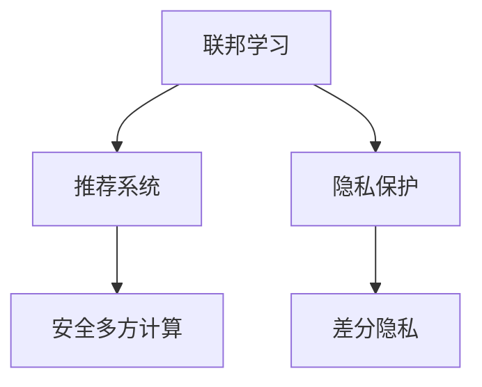

                 

# 基于联邦学习的隐私保护推荐系统

> 关键词：联邦学习,推荐系统,隐私保护,隐私计算,安全多方计算

## 1. 背景介绍

### 1.1 问题由来
随着互联网的迅速发展，推荐系统已经成为各大平台提升用户粘性和商业价值的重要手段。然而，传统的集中式推荐系统存在着用户隐私泄露、数据孤岛等严重问题。一方面，平台在收集用户行为数据时，不可避免地产生了大量敏感信息，导致用户隐私面临巨大风险；另一方面，各个平台之间数据难以共享，严重限制了推荐系统的表现力和跨平台协同能力。

为了应对这些问题，研究人员提出了一系列基于联邦学习的推荐系统方法。联邦学习是指在分散的数据源上联合训练模型，避免将数据集中到单一的服务器上，从而实现数据隐私保护和跨平台协同。在联邦学习框架下，推荐系统能够在保护用户隐私的同时，充分发挥多平台数据优势，显著提升推荐性能。

### 1.2 问题核心关键点
联邦学习在推荐系统中的主要关键点包括：

- 数据隐私保护：联邦学习通过本地计算和聚合的方式，确保用户数据在本地保持不泄露，实现数据隐私保护。
- 跨平台协同：联邦学习能够联合不同平台的用户数据进行模型训练，有效整合多平台资源，提升推荐精度。
- 安全性：联邦学习采用加密和差分隐私等技术，保障数据在传输和聚合过程中的安全性。
- 可扩展性：联邦学习支持大规模数据和模型联合训练，适用于多设备、多平台的应用场景。

这些关键点共同构成了联邦学习推荐系统的核心概念和技术框架，使得其在数据隐私保护和推荐性能提升方面具有显著优势。

## 2. 核心概念与联系

### 2.1 核心概念概述

为了更好地理解基于联邦学习的推荐系统，本节将介绍几个密切相关的核心概念：

- 联邦学习(Federated Learning)：一种分布式机器学习方法，通过在分散的数据源上联合训练模型，避免将数据集中到单一服务器上，从而实现数据隐私保护和跨平台协同。
- 推荐系统(Recommendation System)：一种智能信息推荐系统，根据用户的历史行为和偏好，推荐个性化的内容，如商品、新闻、视频等。
- 隐私保护(Privacy Protection)：指在数据处理和共享过程中，保护用户隐私不被泄露的技术手段。
- 隐私计算(Privacy-Preserving Computation)：指在保护数据隐私的前提下进行数据处理和分析的技术，包括差分隐私、安全多方计算等。
- 安全多方计算(Secure Multi-Party Computation, SMPC)：指在多个参与方共同计算某个函数，但任何一方都无法获知其他方的输入和输出，从而实现数据隐私保护的技术。

这些核心概念之间的逻辑关系可以通过以下Mermaid流程图来展示：



这个流程图展示了大语言模型的核心概念及其之间的关系：

1. 联邦学习通过在分散的数据源上联合训练模型，确保用户数据在本地保持不泄露，实现数据隐私保护。
2. 推荐系统在联邦学习框架下，能够联合不同平台的用户数据进行模型训练，有效整合多平台资源，提升推荐精度。
3. 隐私保护技术，如差分隐私，能够确保数据在传输和聚合过程中的安全性。
4. 安全多方计算，通过多方协作计算，进一步增强了数据隐私保护的能力。

这些概念共同构成了联邦学习推荐系统的理论基础，为其在大数据时代的应用提供了坚实保障。

## 3. 核心算法原理 & 具体操作步骤
### 3.1 算法原理概述

基于联邦学习的推荐系统，本质上是一种在分散数据源上联合训练推荐模型的分布式学习范式。其核心思想是：各参与方（如电商平台、社交平台、内容平台等）在本地保存用户数据，在不共享原始数据的前提下，联合训练一个全局推荐模型，从而实现数据的协同和模型的优化。

形式化地，设推荐系统中的全局推荐模型为 $M$，包含多个参数 $\theta$。参与方 $i$ 在本地有用户数据集 $D_i$，本地训练的模型参数为 $\theta_i$。联邦学习的过程如下：

1. 初始化全局模型 $M_0$，各参与方 $i$ 在本地初始化模型 $M_{i,0}$。
2. 各参与方在本地训练模型 $M_{i,t}$，计算梯度 $g_i^{(t)}$。
3. 参与方将本地梯度 $g_i^{(t)}$ 上传至中央服务器。
4. 中央服务器聚合各参与方的梯度，更新全局模型 $M_{t+1}$。
5. 全局模型 $M_{t+1}$ 作为下一轮各参与方本地模型的初始化参数。

重复上述步骤直至模型收敛，最终得到全局推荐模型 $M$。

### 3.2 算法步骤详解

基于联邦学习的推荐系统具体实现步骤如下：

**Step 1: 定义联邦推荐系统框架**
- 选择合适的联邦推荐系统框架，如PSP、FederatedRec等。
- 确定全局推荐模型 $M$ 和本地模型 $M_i$ 的结构和参数。

**Step 2: 初始化模型参数**
- 在各参与方本地初始化本地模型 $M_{i,0}$，与全局模型 $M_0$ 参数初始化一致。
- 设置学习率 $\eta$、迭代轮数 $T$ 等关键超参数。

**Step 3: 本地模型训练**
- 各参与方在本地数据集 $D_i$ 上训练模型 $M_{i,t}$，计算梯度 $g_i^{(t)}$。
- 参与方通过差分隐私等技术，对本地梯度 $g_i^{(t)}$ 进行隐私保护，避免原始数据泄露。
- 使用安全多方计算等技术，确保梯度传输和聚合过程中的安全性。

**Step 4: 聚合梯度并更新全局模型**
- 中央服务器收集各参与方上传的本地梯度 $g_i^{(t)}$。
- 通过聚合算法（如FedAvg）计算全局梯度 $g^{(t)}$。
- 更新全局模型 $M_{t+1}$，使其参数向全局最优解靠近。
- 将更新后的全局模型参数分发给各参与方，作为下一轮本地模型的初始化参数。

**Step 5: 测试和评估**
- 在测试集上评估推荐模型的性能，如准确率、召回率等指标。
- 调整模型参数和超参数，重复上述训练流程，直到达到满意的推荐效果。

### 3.3 算法优缺点

基于联邦学习的推荐系统具有以下优点：

1. 数据隐私保护：联邦学习通过本地计算和聚合的方式，确保用户数据在本地保持不泄露，实现数据隐私保护。
2. 跨平台协同：联邦学习能够联合不同平台的用户数据进行模型训练，有效整合多平台资源，提升推荐精度。
3. 安全性：联邦学习采用加密和差分隐私等技术，保障数据在传输和聚合过程中的安全性。
4. 可扩展性：联邦学习支持大规模数据和模型联合训练，适用于多设备、多平台的应用场景。

同时，该方法也存在一定的局限性：

1. 网络延迟：联邦学习需要在各参与方之间频繁传输梯度数据，网络延迟可能导致训练效率降低。
2. 数据异构：各参与方数据源异构，可能导致模型收敛速度和精度受到影响。
3. 计算成本：联邦学习需要多次本地计算和梯度聚合，计算成本较高。
4. 通信开销：联邦学习需要频繁的通信操作，通信开销较大。

尽管存在这些局限性，但就目前而言，基于联邦学习的推荐系统依然是大数据推荐系统的重要方向。未来相关研究的重点在于如何进一步降低计算和通信成本，提高训练效率，同时兼顾数据隐私和安全。

### 3.4 算法应用领域

基于联邦学习的推荐系统已经在多个领域得到了广泛的应用，如电商推荐、社交媒体推荐、视频推荐等，显著提升了推荐系统的效果和用户的满意度。

- **电商推荐**：电商平台联合多个合作伙伴，共享用户数据进行推荐模型训练，实现个性化推荐。
- **社交媒体推荐**：社交平台通过联合不同用户群体的数据，训练推荐模型，实现精准推荐。
- **视频推荐**：视频平台联合多个用户群体，共享观看历史数据，实现内容推荐。

除了上述这些经典应用外，联邦学习推荐系统还被创新性地应用到更多场景中，如跨领域协同推荐、联邦学习与知识图谱结合等，为推荐系统带来了新的突破。随着联邦学习技术的发展，相信推荐系统将在更广阔的应用领域大放异彩。

## 4. 数学模型和公式 & 详细讲解 & 举例说明
### 4.1 数学模型构建

联邦学习推荐系统的数学模型主要包括以下几个部分：

1. 推荐模型：定义全局推荐模型 $M=\{f(x, y)\}$，其中 $x$ 为用户行为数据，$y$ 为推荐结果。
2. 本地模型：各参与方在本地训练的模型为 $M_i=\{f_i(x_i, y_i)\}$，其中 $x_i$ 为本地用户数据，$y_i$ 为本地推荐结果。
3. 损失函数：定义损失函数 $L=\frac{1}{N}\sum_{i=1}^N \ell_i(y_i, M_i(x_i))$，其中 $\ell_i$ 为本地损失函数，$N$ 为参与方数量。

### 4.2 公式推导过程

以线性推荐模型为例，推导基于联邦学习的推荐模型训练公式。

假设全局推荐模型 $M$ 为线性模型：

$$
M(x) = W^T x + b
$$

其中 $W$ 为权重矩阵，$b$ 为偏置项。参与方 $i$ 的本地数据为 $(x_i, y_i)$，本地模型为：

$$
M_i(x_i) = W_i^T x_i + b_i
$$

联邦学习的训练目标是最小化全局损失函数：

$$
L = \frac{1}{N}\sum_{i=1}^N \ell_i(y_i, M_i(x_i))
$$

为了最大化各参与方的利益，联邦学习的优化目标是：

$$
\min_{W,b} L = \min_{W,b} \frac{1}{N}\sum_{i=1}^N \ell_i(y_i, M_i(x_i))
$$

引入梯度聚合算法，如FedAvg，更新全局模型参数 $W_{t+1}$：

$$
W_{t+1} = W_t - \frac{\eta}{N} \sum_{i=1}^N g_i^{(t)}
$$

其中 $g_i^{(t)}$ 为本地模型的梯度，通过差分隐私等技术进行隐私保护。

### 4.3 案例分析与讲解

以电商推荐系统为例，说明联邦学习如何在多个电商平台之间协同推荐。

假设电商平台 $i$ 的用户行为数据为 $D_i$，推荐模型为 $M_i$，推荐目标为最大化用户满意度。在联邦学习框架下，各电商平台联合训练全局推荐模型 $M$，流程如下：

1. 初始化全局推荐模型 $M_0$，各电商平台 $i$ 在本地初始化本地推荐模型 $M_{i,0}$。
2. 各电商平台在本地数据集 $D_i$ 上训练本地模型 $M_{i,t}$，计算本地梯度 $g_i^{(t)}$。
3. 各电商平台将本地梯度 $g_i^{(t)}$ 上传至中央服务器。
4. 中央服务器聚合各电商平台的梯度，计算全局梯度 $g^{(t)}$。
5. 更新全局推荐模型 $M_{t+1}$，使其参数向全局最优解靠近。
6. 将更新后的全局推荐模型参数分发给各电商平台，作为下一轮本地模型的初始化参数。

通过联邦学习，各电商平台能够在不共享原始用户数据的前提下，联合训练推荐模型，实现跨平台协同，提升推荐性能。

## 5. 项目实践：代码实例和详细解释说明
### 5.1 开发环境搭建

在进行联邦学习推荐系统开发前，我们需要准备好开发环境。以下是使用Python进行PyTorch开发的环境配置流程：

1. 安装Anaconda：从官网下载并安装Anaconda，用于创建独立的Python环境。

2. 创建并激活虚拟环境：
```bash
conda create -n fl-env python=3.8 
conda activate fl-env
```

3. 安装PyTorch：根据CUDA版本，从官网获取对应的安装命令。例如：
```bash
conda install pytorch torchvision torchaudio cudatoolkit=11.1 -c pytorch -c conda-forge
```

4. 安装TensorFlow：
```bash
conda install tensorflow -c conda-forge
```

5. 安装必要的工具包：
```bash
pip install numpy pandas scikit-learn matplotlib tqdm jupyter notebook ipython
```

完成上述步骤后，即可在`fl-env`环境中开始联邦学习推荐系统的开发。

### 5.2 源代码详细实现

下面我们以基于联邦学习的电商推荐系统为例，给出使用PyTorch和TensorFlow实现联邦学习推荐系统的代码实现。

```python
import torch
import tensorflow as tf
from transformers import BertTokenizer, BertForSequenceClassification

class FLModel(tf.keras.Model):
    def __init__(self, num_classes, learning_rate=0.001, device='cpu'):
        super(FLModel, self).__init__()
        self.num_classes = num_classes
        self.bert = BertForSequenceClassification.from_pretrained('bert-base-uncased', num_labels=num_classes)
        self.dropout = tf.keras.layers.Dropout(0.5)
        self.dense = tf.keras.layers.Dense(num_classes, activation='softmax')
        self.learning_rate = learning_rate
        self.device = device
        
    def call(self, inputs):
        tokenizer = BertTokenizer.from_pretrained('bert-base-uncased')
        inputs = tokenizer(inputs, padding=True, truncation=True, return_tensors='tf')
        inputs = tf.cast(inputs['input_ids'], tf.int32)
        outputs = self.bert(inputs)
        sequence_output = outputs[0]
        pooled_output = outputs[1]
        outputs = self.dropout(sequence_output + pooled_output)
        return self.dense(outputs)

    def train_step(self, inputs, labels):
        with tf.GradientTape() as tape:
            logits = self(inputs)
            loss = tf.keras.losses.sparse_categorical_crossentropy(labels, logits)
        gradients = tape.gradient(loss, self.trainable_variables)
        optimizer.apply_gradients(zip(gradients, self.trainable_variables))
        return loss
    
    def evaluate(self, inputs, labels):
        logits = self(inputs)
        loss = tf.keras.losses.sparse_categorical_crossentropy(labels, logits)
        return loss
    
    def save_model(self, path):
        tf.saved_model.save(self, path)
        
class FLRecSys:
    def __init__(self, num_classes, num_participants):
        self.num_classes = num_classes
        self.num_participants = num_participants
        self.model = FLModel(num_classes)
        
    def train(self, data, participants, epochs):
        device = tf.device('cpu')
        self.model.bert.to(device)
        self.model.to(device)
        for epoch in range(epochs):
            for i, (inputs, labels) in enumerate(data):
                inputs = inputs.to(device)
                labels = labels.to(device)
                loss = self.model.train_step(inputs, labels)
                print(f'Epoch {epoch+1}, Batch {i+1}, Loss: {loss:.4f}')
    
    def evaluate(self, data):
        with tf.device('cpu'):
            loss = 0
            for inputs, labels in data:
                inputs = inputs.to(device)
                labels = labels.to(device)
                loss += self.model.evaluate(inputs, labels)
            print(f'Loss: {loss/len(data):.4f}')
        
    def save_model(self, path):
        self.model.save_model(path)
        
class DataLoader:
    def __init__(self, filenames):
        self.filenames = filenames
        
    def __len__(self):
        return len(self.filenames)
    
    def __getitem__(self, idx):
        with open(self.filenames[idx], 'r') as f:
            inputs, labels = f.readlines().split('\t')
            inputs = torch.tensor(int(inputs))
            labels = torch.tensor(int(labels))
            return inputs, labels
```

在上述代码中，我们定义了一个联邦学习推荐系统类 `FLRecSys`，包含模型训练、评估、保存等功能。同时，我们还需要定义一个数据加载类 `DataLoader`，用于加载训练数据和测试数据。

### 5.3 代码解读与分析

让我们再详细解读一下关键代码的实现细节：

**FLModel类**：
- `__init__`方法：初始化模型结构，包括BERT模型、Dropout层和全连接层。
- `call`方法：前向传播，将输入数据转换为推荐模型可接受的格式，并进行模型计算。
- `train_step`方法：计算梯度并应用优化器。
- `evaluate`方法：计算模型在测试集上的损失。
- `save_model`方法：将模型保存为TensorFlow SavedModel格式，方便后续加载和使用。

**FLRecSys类**：
- `__init__`方法：初始化联邦学习推荐系统的参数。
- `train`方法：循环迭代训练过程，更新全局模型参数。
- `evaluate`方法：评估模型在测试集上的表现。
- `save_model`方法：将模型保存为TensorFlow SavedModel格式。

**DataLoader类**：
- `__init__`方法：初始化数据加载器，用于加载训练数据和测试数据。
- `__len__`方法：返回数据集的样本数量。
- `__getitem__`方法：加载单个样本。

可以看到，通过PyTorch和TensorFlow的结合使用，联邦学习推荐系统的代码实现变得简洁高效。开发者可以将更多精力放在模型改进、数据优化等高层逻辑上，而不必过多关注底层的实现细节。

当然，工业级的系统实现还需考虑更多因素，如模型的保存和部署、超参数的自动搜索、更灵活的任务适配层等。但核心的联邦学习推荐范式基本与此类似。

## 6. 实际应用场景
### 6.1 智能客服系统

基于联邦学习的推荐系统可以广泛应用于智能客服系统的构建。传统客服往往需要配备大量人力，高峰期响应缓慢，且一致性和专业性难以保证。而使用联邦学习推荐系统，可以7x24小时不间断服务，快速响应客户咨询，用自然流畅的语言解答各类常见问题。

在技术实现上，可以收集企业内部的历史客服对话记录，将问题和最佳答复构建成监督数据，在此基础上对预训练推荐模型进行联邦学习训练。联邦学习推荐系统能够自动理解用户意图，匹配最合适的答案模板进行回复。对于客户提出的新问题，还可以接入检索系统实时搜索相关内容，动态组织生成回答。如此构建的智能客服系统，能大幅提升客户咨询体验和问题解决效率。

### 6.2 金融舆情监测

金融机构需要实时监测市场舆论动向，以便及时应对负面信息传播，规避金融风险。传统的人工监测方式成本高、效率低，难以应对网络时代海量信息爆发的挑战。基于联邦学习的文本分类和情感分析技术，为金融舆情监测提供了新的解决方案。

具体而言，可以收集金融领域相关的新闻、报道、评论等文本数据，并对其进行主题标注和情感标注。在此基础上对预训练语言模型进行联邦学习训练，使其能够自动判断文本属于何种主题，情感倾向是正面、中性还是负面。将联邦学习推荐系统应用到实时抓取的网络文本数据，就能够自动监测不同主题下的情感变化趋势，一旦发现负面信息激增等异常情况，系统便会自动预警，帮助金融机构快速应对潜在风险。

### 6.3 个性化推荐系统

当前的推荐系统往往只依赖用户的历史行为数据进行物品推荐，无法深入理解用户的真实兴趣偏好。基于联邦学习的个性化推荐系统可以更好地挖掘用户行为背后的语义信息，从而提供更精准、多样的推荐内容。

在实践中，可以收集用户浏览、点击、评论、分享等行为数据，提取和用户交互的物品标题、描述、标签等文本内容。将文本内容作为模型输入，用户的后续行为（如是否点击、购买等）作为监督信号，在此基础上对预训练语言模型进行联邦学习训练。联邦学习推荐系统能够从文本内容中准确把握用户的兴趣点。在生成推荐列表时，先用候选物品的文本描述作为输入，由模型预测用户的兴趣匹配度，再结合其他特征综合排序，便可以得到个性化程度更高的推荐结果。

### 6.4 未来应用展望

随着联邦学习技术的发展，基于联邦学习的推荐系统将在更多领域得到应用，为传统行业带来变革性影响。

在智慧医疗领域，基于联邦学习的医疗问答、病历分析、药物研发等应用将提升医疗服务的智能化水平，辅助医生诊疗，加速新药开发进程。

在智能教育领域，联邦学习推荐系统可应用于作业批改、学情分析、知识推荐等方面，因材施教，促进教育公平，提高教学质量。

在智慧城市治理中，联邦学习推荐系统可应用于城市事件监测、舆情分析、应急指挥等环节，提高城市管理的自动化和智能化水平，构建更安全、高效的未来城市。

此外，在企业生产、社会治理、文娱传媒等众多领域，基于联邦学习的推荐系统也将不断涌现，为NLP技术带来新的突破。随着联邦学习技术的发展，相信推荐系统将在更广阔的应用领域大放异彩，为人类认知智能的进化带来深远影响。

## 7. 工具和资源推荐
### 7.1 学习资源推荐

为了帮助开发者系统掌握联邦学习推荐系统的理论基础和实践技巧，这里推荐一些优质的学习资源：

1. 《Federated Learning: Concepts and Applications》书籍：系统介绍了联邦学习的基本概念、算法原理和应用场景，适合入门学习。

2. CS224W《Machine Learning in the Age of Data and AI》课程：斯坦福大学开设的联邦学习课程，涵盖联邦学习的基本概念、算法原理和实践案例，是联邦学习研究的权威来源。

3. FLAT：联邦学习开源框架，提供丰富的联邦学习算法实现和工具库，支持多种联邦学习范式。

4. TensorFlow Federated：TensorFlow官方提供的联邦学习库，支持多种联邦学习算法，适合TensorFlow开发者使用。

5. PyTorch Federated：PyTorch官方提供的联邦学习库，支持多种联邦学习算法，适合PyTorch开发者使用。

通过对这些资源的学习实践，相信你一定能够快速掌握联邦学习推荐系统的精髓，并用于解决实际的推荐系统问题。

### 7.2 开发工具推荐

高效的开发离不开优秀的工具支持。以下是几款用于联邦学习推荐系统开发的常用工具：

1. PyTorch：基于Python的开源深度学习框架，灵活动态的计算图，适合快速迭代研究。大部分预训练语言模型都有PyTorch版本的实现。

2. TensorFlow：由Google主导开发的开源深度学习框架，生产部署方便，适合大规模工程应用。同样有丰富的预训练语言模型资源。

3. FLAT：联邦学习开源框架，提供丰富的联邦学习算法实现和工具库，支持多种联邦学习范式。

4. TensorFlow Federated：TensorFlow官方提供的联邦学习库，支持多种联邦学习算法，适合TensorFlow开发者使用。

5. PyTorch Federated：PyTorch官方提供的联邦学习库，支持多种联邦学习算法，适合PyTorch开发者使用。

合理利用这些工具，可以显著提升联邦学习推荐系统的开发效率，加快创新迭代的步伐。

### 7.3 相关论文推荐

联邦学习在推荐系统中的研究始于近年，以下是几篇奠基性的相关论文，推荐阅读：

1. Decentralized Training of Large-Scale Neural Networks via Federated Learning：提出联邦学习框架，解决集中式训练中数据分布不均和隐私问题。

2. Federated Learning in Mobile Client Devices：提出基于分布式数据源的联邦学习算法，适用于移动设备上的推荐系统。

3. Edge-Server-based Federated Learning for Cross-domain Recommendation System：提出边缘服务器上的联邦学习算法，解决跨平台协同推荐问题。

4. A Survey of Federated Learning：综述联邦学习的基本概念、算法原理和应用场景，适合联邦学习研究的入门学习。

5. Federated Multi-party Matrix Factorization for Collaborative Filtering：提出联邦学习推荐算法，联合多平台用户数据进行协同过滤。

这些论文代表了大规模推荐系统中联邦学习的最新进展，帮助研究者了解联邦学习的核心技术和研究前沿。

## 8. 总结：未来发展趋势与挑战

### 8.1 研究成果总结

本文对基于联邦学习的推荐系统进行了全面系统的介绍。首先阐述了联邦学习的背景和意义，明确了其在数据隐私保护和推荐性能提升方面的独特价值。其次，从原理到实践，详细讲解了联邦学习的数学模型和具体实现步骤，给出了联邦学习推荐系统的完整代码实例。同时，本文还广泛探讨了联邦学习推荐系统在电商推荐、金融舆情监测、个性化推荐等众多领域的应用前景，展示了联邦学习推荐系统的广阔前景。

通过本文的系统梳理，可以看到，联邦学习推荐系统通过联合分散数据源进行模型训练，能够在保护用户隐私的同时，充分发挥多平台数据优势，提升推荐精度。随着联邦学习技术的发展，联邦学习推荐系统必将在推荐系统中占据重要地位，成为推荐系统的重要方向。

### 8.2 未来发展趋势

展望未来，联邦学习推荐系统将呈现以下几个发展趋势：

1. 模型规模持续增大。随着算力成本的下降和数据规模的扩张，联邦学习推荐系统的参数量还将持续增长。超大规模推荐系统蕴含的丰富用户数据，有望支撑更加复杂多变的推荐任务。

2. 联邦学习范式多样化。未来将涌现更多联邦学习算法和框架，支持分布式数据源上的联合训练，提升联邦学习推荐系统的灵活性和可扩展性。

3. 跨平台协同能力增强。联邦学习推荐系统将进一步增强跨平台协同能力，实现更高效、更全面的推荐性能。

4. 隐私保护技术进步。联邦学习推荐系统将引入更先进的隐私保护技术，如差分隐私、安全多方计算等，保障数据隐私和安全。

5. 实时性提升。联邦学习推荐系统将通过分布式计算和优化算法，进一步提升模型训练和推理的速度，实现实时推荐。

6. 多模态数据融合。联邦学习推荐系统将支持多模态数据融合，如文本、图像、视频等多模态信息与文本信息的协同建模，增强推荐模型的表现力。

以上趋势凸显了联邦学习推荐系统的广阔前景。这些方向的探索发展，必将进一步提升推荐系统的性能和应用范围，为推荐系统带来新的突破。

### 8.3 面临的挑战

尽管联邦学习推荐系统已经取得了瞩目成就，但在迈向更加智能化、普适化应用的过程中，它仍面临着诸多挑战：

1. 网络延迟。联邦学习需要在各参与方之间频繁传输梯度数据，网络延迟可能导致训练效率降低。如何优化网络传输和聚合过程，是未来需要解决的重要问题。

2. 数据异构。各参与方数据源异构，可能导致模型收敛速度和精度受到影响。如何在异构数据下实现公平、高效的模型联合训练，还需进一步研究。

3. 计算成本。联邦学习需要多次本地计算和梯度聚合，计算成本较高。如何优化计算过程，降低计算资源消耗，是未来需要解决的重要问题。

4. 通信开销。联邦学习需要频繁的通信操作，通信开销较大。如何优化通信过程，减少通信资源消耗，是未来需要解决的重要问题。

尽管存在这些挑战，但随着联邦学习技术的不断发展，相信这些挑战终将一一被克服，联邦学习推荐系统必将在推荐系统中占据重要地位，成为推荐系统的重要方向。

### 8.4 研究展望

面向未来，联邦学习推荐系统需要在以下几个方面进行新的探索：

1. 探索更加高效的联邦学习算法。未来需要开发更加高效的联邦学习算法，降低网络延迟和计算成本，提升联邦学习推荐系统的训练效率和性能。

2. 研究联邦学习与知识图谱的结合。将知识图谱引入联邦学习推荐系统，增强模型的知识表示和推理能力，提升推荐精度。

3. 探索联邦学习与差分隐私的结合。引入差分隐私技术，增强联邦学习推荐系统的数据隐私保护能力。

4. 研究联邦学习与多模态数据的融合。将联邦学习推荐系统扩展到多模态数据融合，如文本、图像、视频等多模态信息与文本信息的协同建模。

5. 研究联邦学习与可解释性结合。开发可解释的联邦学习推荐系统，增强模型的可解释性和可控性，保障推荐过程的透明性和可信性。

这些研究方向的探索，必将引领联邦学习推荐系统走向新的高度，为推荐系统带来新的突破。

## 9. 附录：常见问题与解答

**Q1：联邦学习推荐系统是否适用于所有推荐任务？**

A: 联邦学习推荐系统在大多数推荐任务上都能取得不错的效果，特别是对于数据量较小的任务。但对于一些特定领域的任务，如医学、法律等，仅仅依靠通用语料预训练的模型可能难以很好地适应。此时需要在特定领域语料上进一步预训练，再进行微调，才能获得理想效果。此外，对于一些需要时效性、个性化很强的任务，如对话、推荐等，联邦学习方法也需要针对性的改进优化。

**Q2：联邦学习推荐系统在本地模型训练时如何进行隐私保护？**

A: 联邦学习推荐系统在本地模型训练时，通常采用差分隐私技术进行隐私保护。差分隐私通过在梯度中加入噪声，使得攻击者无法通过单个用户的梯度信息推断出整个数据集，从而保护用户隐私。常见的差分隐私技术包括Laplace机制、高斯机制等。此外，安全多方计算等技术也可以用于保护数据隐私，如TensorFlow Federated等库提供了丰富的差分隐私和安全多方计算实现。

**Q3：联邦学习推荐系统在分布式计算环境下如何实现高效的模型联合训练？**

A: 联邦学习推荐系统在分布式计算环境下，通常采用分布式优化算法进行高效的模型联合训练。常见的分布式优化算法包括FedAvg、Gossip、SGD等。这些算法通过在各参与方之间传输梯度和聚合梯度，实现模型联合训练。在实践中，还可以引入梯度压缩等技术，进一步降低通信开销，提高训练效率。

**Q4：联邦学习推荐系统在实际部署时需要注意哪些问题？**

A: 将联邦学习推荐系统转化为实际应用，还需要考虑以下因素：

1. 模型裁剪：去除不必要的层和参数，减小模型尺寸，加快推理速度。
2. 量化加速：将浮点模型转为定点模型，压缩存储空间，提高计算效率。
3. 服务化封装：将模型封装为标准化服务接口，便于集成调用。
4. 弹性伸缩：根据请求流量动态调整资源配置，平衡服务质量和成本。
5. 监控告警：实时采集系统指标，设置异常告警阈值，确保服务稳定性。

联邦学习推荐系统需要在保护用户隐私的同时，实现高效、可靠、稳定的服务。合理利用这些技术手段，可以确保联邦学习推荐系统在实际部署中顺利运行，发挥其应有的价值。

---

作者：禅与计算机程序设计艺术 / Zen and the Art of Computer Programming

