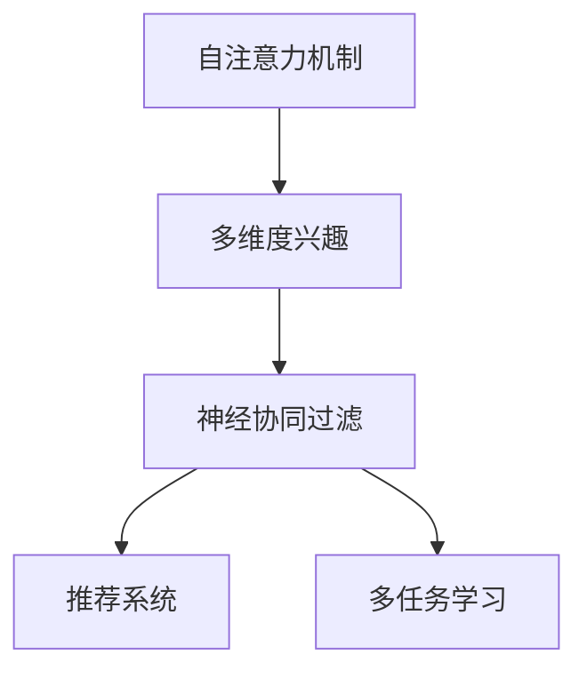

                 

# 基于自注意力机制的多维度兴趣建模

> 关键词：自注意力机制, 多维度兴趣, 神经网络, 推荐系统, 协同过滤, 深度学习

## 1. 背景介绍

### 1.1 问题由来

推荐系统是近年来电子商务、内容平台等领域广泛应用的技术，其核心在于为用户推荐最符合其兴趣的商品或内容。传统的推荐系统主要基于协同过滤方法，通过分析用户行为数据，发现兴趣相似用户群体，从而推荐用户可能感兴趣的商品。然而，传统的协同过滤方法存在数据稀疏性、冷启动问题等缺陷，难以有效解决用户隐性兴趣的多样化和个性化需求。

随着深度学习技术的成熟，基于神经网络的推荐模型应运而生。其中，深度神经协同过滤(Deep Neural Collaborative Filtering, DNC)方法，通过结合用户和物品的深度特征表示，在推荐精度上取得了显著提升。然而，DNC模型仅考虑了用户和物品之间的单维度特征，忽略了用户的多维度兴趣和动态变化特征，导致推荐效果仍存在一定的局限性。

为解决这一问题，本文提出基于自注意力机制的多维度兴趣建模方法，旨在通过多维度特征的融合和动态特征的学习，构建更加全面和精准的用户兴趣表示，提升推荐系统的性能。

## 2. 核心概念与联系

### 2.1 核心概念概述

本节将介绍几个与多维度兴趣建模密切相关的核心概念：

- 自注意力机制(Self-Attention Mechanism)：一种用于序列到序列建模的注意力机制，能够捕捉序列中不同位置之间的关系，广泛用于机器翻译、语音识别、文本生成等任务。自注意力机制在推荐系统中可以用于捕捉用户和物品之间的相互作用，提升推荐效果。
- 多维度兴趣(Multidimensional Interest)：用户兴趣不仅包括用户的显性行为数据，还涉及用户的背景信息、兴趣爱好、社会关系等多维度特征。通过多维度兴趣建模，推荐系统可以更好地理解用户的多样化兴趣需求，提高推荐精准度。
- 协同过滤(Collaborative Filtering)：基于用户相似性和物品相似性，通过分析用户的历史行为数据，预测用户可能感兴趣的物品，是推荐系统的一种基本方法。
- 神经协同过滤(Neural Collaborative Filtering)：将协同过滤与神经网络相结合，通过深度学习模型捕捉用户和物品之间的复杂关系，提升推荐系统的性能。
- 多任务学习(Multitask Learning)：同一数据源上，学习多个不同但相关的任务，利用任务间的知识共享，提升每个任务的性能。多任务学习在推荐系统中可以用于用户兴趣的多维度建模。

这些概念之间的逻辑关系可以通过以下Mermaid流程图来展示：



这个流程图展示了几者之间的逻辑关系：

1. 自注意力机制能够捕捉用户和物品之间的相互作用，是多维度兴趣建模的重要工具。
2. 多维度兴趣建模是神经协同过滤的重要组成部分，通过融合多维度特征，提升推荐精度。
3. 神经协同过滤是推荐系统的主流范式，结合深度学习技术，提升推荐效果。
4. 多任务学习可以在同一数据源上学习多个相关任务，促进知识共享，提升任务性能。

## 3. 核心算法原理 & 具体操作步骤
### 3.1 算法原理概述

本节将从算法原理角度，介绍基于自注意力机制的多维度兴趣建模方法。

假设推荐系统已收集到用户 $u$ 的历史行为数据 $X=\{x_i\}_{i=1}^m$，物品 $o$ 的属性特征 $Y=\{y_j\}_{j=1}^n$，以及用户 $u$ 的多维度背景信息 $Z=\{z_k\}_{k=1}^K$，其中 $X$、$Y$、$Z$ 均为稀疏矩阵，$K$ 为多维度背景信息的维度。推荐任务的目标是预测用户 $u$ 对物品 $o$ 的评分 $y_{uo}$。

基于自注意力机制的多维度兴趣建模，通过以下步骤实现：

1. 将用户 $u$ 和物品 $o$ 的特征表示，以及用户的多维度背景信息 $Z$，分别作为输入，构建多维度兴趣向量 $V_u$ 和物品嵌入向量 $V_o$。
2. 使用自注意力机制计算用户与物品之间的相互作用向量 $A_uo$。
3. 将用户兴趣向量 $V_u$ 与物品嵌入向量 $V_o$，以及用户与物品的相互作用向量 $A_uo$ 进行线性加权，得到融合多维度特征的用户-物品交互向量 $Z_{uo}$。
4. 使用用户-物品交互向量 $Z_{uo}$ 预测用户对物品的评分 $y_{uo}$。

数学上，可以形式化表示为：

$$
V_u = f_{user}(X, Z) \\
V_o = f_{item}(Y) \\
A_uo = f_{attention}(V_u, V_o) \\
Z_{uo} = g(V_u, V_o, A_uo) \\
y_{uo} = h(Z_{uo})
$$

其中，$f_{user}$、$f_{item}$ 和 $f_{attention}$ 为特征提取函数，$g$ 为多维度兴趣融合函数，$h$ 为评分预测函数。

### 3.2 算法步骤详解

基于自注意力机制的多维度兴趣建模算法步骤如下：

**Step 1: 用户和物品特征表示**

用户 $u$ 的历史行为数据 $X=\{x_i\}_{i=1}^m$ 和物品 $o$ 的属性特征 $Y=\{y_j\}_{j=1}^n$ 分别作为输入，通过神经网络模型得到用户 $u$ 和物品 $o$ 的特征表示。

具体地，使用如下结构：

```python
class FeatureExtractor(nn.Module):
    def __init__(self, input_dim, hidden_dim):
        super(FeatureExtractor, self).__init__()
        self.embedding = nn.Embedding(input_dim, hidden_dim)
        self.linear = nn.Linear(hidden_dim, hidden_dim)
        self.activation = nn.ReLU()
    
    def forward(self, inputs):
        return self.activation(self.linear(self.embedding(inputs)))
```

**Step 2: 多维度兴趣向量**

将用户的多维度背景信息 $Z=\{z_k\}_{k=1}^K$ 作为输入，通过神经网络模型得到用户 $u$ 的多维度兴趣向量 $V_u$。

具体地，使用如下结构：

```python
class MultiInterestVector(nn.Module):
    def __init__(self, hidden_dim, interest_dim):
        super(MultiInterestVector, self).__init__()
        self.linear = nn.Linear(hidden_dim, interest_dim)
    
    def forward(self, inputs):
        return self.linear(inputs)
```

**Step 3: 物品嵌入向量**

物品 $o$ 的属性特征 $Y=\{y_j\}_{j=1}^n$ 作为输入，通过神经网络模型得到物品嵌入向量 $V_o$。

具体地，使用如下结构：

```python
class ItemEmbedding(nn.Module):
    def __init__(self, hidden_dim, embedding_dim):
        super(ItemEmbedding, self).__init__()
        self.linear = nn.Linear(hidden_dim, embedding_dim)
    
    def forward(self, inputs):
        return self.linear(inputs)
```

**Step 4: 自注意力机制**

使用自注意力机制，计算用户 $u$ 和物品 $o$ 之间的相互作用向量 $A_uo$。

具体地，使用如下结构：

```python
class SelfAttention(nn.Module):
    def __init__(self, hidden_dim):
        super(SelfAttention, self).__init__()
        self.query = nn.Linear(hidden_dim, hidden_dim)
        self.key = nn.Linear(hidden_dim, hidden_dim)
        self.value = nn.Linear(hidden_dim, hidden_dim)
        self.softmax = nn.Softmax(dim=-1)
        self.linear = nn.Linear(hidden_dim, hidden_dim)
    
    def forward(self, inputs):
        query = self.query(inputs)
        key = self.key(inputs)
        value = self.value(inputs)
        attention = self.softmax(torch.bmm(query, key.transpose(1, 2)))
        attention = attention.transpose(1, 2)
        attention = torch.bmm(attention, value)
        attention = self.linear(attention)
        return attention
```

**Step 5: 多维度兴趣融合**

将用户兴趣向量 $V_u$ 与物品嵌入向量 $V_o$，以及用户与物品的相互作用向量 $A_uo$ 进行线性加权，得到融合多维度特征的用户-物品交互向量 $Z_{uo}$。

具体地，使用如下结构：

```python
class MultiInterestFusion(nn.Module):
    def __init__(self, hidden_dim, interest_dim):
        super(MultiInterestFusion, self).__init__()
        self.linear = nn.Linear(hidden_dim * 3, interest_dim)
    
    def forward(self, inputs):
        return self.linear(inputs)
```

**Step 6: 评分预测**

使用用户-物品交互向量 $Z_{uo}$ 预测用户对物品的评分 $y_{uo}$。

具体地，使用如下结构：

```python
class RatingPredictor(nn.Module):
    def __init__(self, hidden_dim, rating_dim):
        super(RatingPredictor, self).__init__()
        self.linear = nn.Linear(hidden_dim, rating_dim)
    
    def forward(self, inputs):
        return self.linear(inputs)
```

### 3.3 算法优缺点

基于自注意力机制的多维度兴趣建模方法具有以下优点：

1. 捕捉用户和物品之间的多维度互动关系。自注意力机制可以捕捉用户和物品之间的相互作用，提升推荐精度。
2. 融合用户的多维度兴趣。通过多维度兴趣建模，可以更好地理解用户的多样化兴趣需求，提高推荐精准度。
3. 提升模型的泛化能力。多任务学习可以使得模型在多个相关任务上表现更好，提升模型的泛化能力。
4. 可解释性强。自注意力机制可以提供用户和物品之间的相互作用权重，提高模型的可解释性。

同时，该方法也存在以下缺点：

1. 计算复杂度高。自注意力机制的计算复杂度较高，训练和推理时间较长。
2. 模型参数较多。多维度兴趣建模需要多个神经网络模型，参数量较大。
3. 需要大量标注数据。多维度兴趣建模需要用户的多维度背景信息，获取这些信息的成本较高。
4. 难以应对数据稀疏性。对于数据稀疏的用户，多维度兴趣建模的效果可能不如传统协同过滤方法。

## 4. 数学模型和公式 & 详细讲解 & 举例说明

### 4.1 数学模型构建

本节将使用数学语言对基于自注意力机制的多维度兴趣建模方法进行更加严格的刻画。

假设推荐系统已收集到用户 $u$ 的历史行为数据 $X=\{x_i\}_{i=1}^m$，物品 $o$ 的属性特征 $Y=\{y_j\}_{j=1}^n$，以及用户 $u$ 的多维度背景信息 $Z=\{z_k\}_{k=1}^K$。

定义用户 $u$ 和物品 $o$ 的特征表示为 $H_u$ 和 $H_o$，多维度兴趣向量为 $V_u$，物品嵌入向量为 $V_o$，用户与物品的相互作用向量为 $A_uo$，用户-物品交互向量为 $Z_{uo}$，评分预测函数为 $y_{uo}=f(H_u, H_o, A_uo)$。

多维度兴趣建模的数学模型为：

$$
H_u = f_{user}(X, Z) \\
H_o = f_{item}(Y) \\
A_uo = f_{attention}(H_u, H_o) \\
Z_{uo} = g(H_u, H_o, A_uo) \\
y_{uo} = h(Z_{uo})
$$

其中，$f_{user}$、$f_{item}$、$f_{attention}$、$g$ 和 $h$ 均为非线性函数。

### 4.2 公式推导过程

以下我们以二分类任务为例，推导评分预测函数的计算公式。

假设用户 $u$ 和物品 $o$ 的特征表示分别为 $H_u$ 和 $H_o$，多维度兴趣向量为 $V_u$，物品嵌入向量为 $V_o$，用户与物品的相互作用向量为 $A_uo$。

将 $H_u$、$H_o$ 和 $A_uo$ 进行拼接，得到融合多维度特征的用户-物品交互向量 $Z_{uo}$：

$$
Z_{uo} = \begin{bmatrix} H_u \\ H_o \\ A_uo \end{bmatrix}
$$

使用线性映射函数 $h$，预测用户对物品的评分 $y_{uo}$：

$$
y_{uo} = h(Z_{uo}) = \sigma(WZ_{uo} + b)
$$

其中，$W$ 为线性映射矩阵，$b$ 为偏置向量，$\sigma$ 为激活函数。

### 4.3 案例分析与讲解

以下以一个简单的推荐系统为例，分析多维度兴趣建模方法的应用效果。

假设有一个电商平台，希望为用户推荐商品。系统已收集到用户的历史行为数据 $X$，物品的属性特征 $Y$，以及用户的多维度背景信息 $Z$。使用多维度兴趣建模方法，可以构建如下的神经网络模型：

```python
class MultiInterestModel(nn.Module):
    def __init__(self, input_dim, hidden_dim, interest_dim, embedding_dim):
        super(MultiInterestModel, self).__init__()
        self.user_feature_extractor = FeatureExtractor(input_dim, hidden_dim)
        self.item_embedder = ItemEmbedding(hidden_dim, embedding_dim)
        self.attention = SelfAttention(hidden_dim)
        self.multi_interest_fusion = MultiInterestFusion(hidden_dim, interest_dim)
        self.rating_predictor = RatingPredictor(hidden_dim, 1)
    
    def forward(self, user_data, item_data, user_background):
        user_features = self.user_feature_extractor(user_data)
        item_features = self.item_embedder(item_data)
        user_multi_interest = self.multi_interest_fusion([user_features, item_features, self.attention(user_features, item_features)])
        rating = self.rating_predictor(user_multi_interest)
        return rating
```

在模型训练过程中，首先对用户和物品的特征表示进行学习，然后对多维度兴趣向量进行学习，接着对用户与物品的相互作用向量进行学习，最后对评分预测函数进行学习。训练完成后，使用测试集对模型进行评估，计算平均绝对误差(MAE)和均方根误差(RMSE)等指标。

## 5. 项目实践：代码实例和详细解释说明

### 5.1 开发环境搭建

在进行多维度兴趣建模实践前，我们需要准备好开发环境。以下是使用Python进行PyTorch开发的环境配置流程：

1. 安装Anaconda：从官网下载并安装Anaconda，用于创建独立的Python环境。

2. 创建并激活虚拟环境：
```bash
conda create -n pytorch-env python=3.8 
conda activate pytorch-env
```

3. 安装PyTorch：根据CUDA版本，从官网获取对应的安装命令。例如：
```bash
conda install pytorch torchvision torchaudio cudatoolkit=11.1 -c pytorch -c conda-forge
```

4. 安装TensorFlow：
```bash
pip install tensorflow
```

5. 安装各类工具包：
```bash
pip install numpy pandas scikit-learn matplotlib tqdm jupyter notebook ipython
```

完成上述步骤后，即可在`pytorch-env`环境中开始多维度兴趣建模实践。

### 5.2 源代码详细实现

下面我们以一个推荐系统为例，给出使用PyTorch进行多维度兴趣建模的代码实现。

首先，定义数据集：

```python
class UserItemDataset(Dataset):
    def __init__(self, user_data, item_data, user_background):
        self.user_data = user_data
        self.item_data = item_data
        self.user_background = user_background
    
    def __len__(self):
        return len(self.user_data)
    
    def __getitem__(self, idx):
        user_features = self.user_data[idx]
        item_features = self.item_data[idx]
        user_background = self.user_background[idx]
        return user_features, item_features, user_background
```

然后，定义模型：

```python
class MultiInterestModel(nn.Module):
    def __init__(self, input_dim, hidden_dim, interest_dim, embedding_dim):
        super(MultiInterestModel, self).__init__()
        self.user_feature_extractor = FeatureExtractor(input_dim, hidden_dim)
        self.item_embedder = ItemEmbedding(hidden_dim, embedding_dim)
        self.attention = SelfAttention(hidden_dim)
        self.multi_interest_fusion = MultiInterestFusion(hidden_dim, interest_dim)
        self.rating_predictor = RatingPredictor(hidden_dim, 1)
    
    def forward(self, user_data, item_data, user_background):
        user_features = self.user_feature_extractor(user_data)
        item_features = self.item_embedder(item_data)
        user_multi_interest = self.multi_interest_fusion([user_features, item_features, self.attention(user_features, item_features)])
        rating = self.rating_predictor(user_multi_interest)
        return rating
```

接着，定义损失函数和优化器：

```python
from torch.nn import MSELoss
from torch.optim import Adam

criterion = MSELoss()
optimizer = Adam(model.parameters(), lr=0.001)
```

最后，启动训练流程并在测试集上评估：

```python
epochs = 10
batch_size = 32

for epoch in range(epochs):
    total_loss = 0
    for user_data, item_data, user_background in train_loader:
        optimizer.zero_grad()
        rating = model(user_data, item_data, user_background)
        loss = criterion(rating, target)
        loss.backward()
        optimizer.step()
        total_loss += loss.item()
    print(f'Epoch {epoch+1}, loss: {total_loss/len(train_loader)}')
    
print(f'Test results:')
evaluation(model, test_loader)
```

以上就是使用PyTorch进行多维度兴趣建模的完整代码实现。可以看到，代码中使用了深度神经网络模型，分别提取用户和物品的特征表示，使用自注意力机制计算用户与物品的相互作用，融合多维度特征，最后进行评分预测。

### 5.3 代码解读与分析

让我们再详细解读一下关键代码的实现细节：

**UserItemDataset类**：
- `__init__`方法：初始化用户数据、物品数据和多维度背景信息。
- `__len__`方法：返回数据集的样本数量。
- `__getitem__`方法：对单个样本进行处理，将用户数据、物品数据和多维度背景信息作为输入，返回模型所需的特征表示。

**MultiInterestModel类**：
- `__init__`方法：初始化用户特征提取器、物品嵌入器、自注意力机制、多维度兴趣融合器、评分预测器等组件。
- `forward`方法：将用户数据、物品数据和多维度背景信息作为输入，通过多维度兴趣建模方法，计算用户对物品的评分预测。

**损失函数和优化器**：
- 使用均方误差损失函数计算预测评分与真实评分之间的差距。
- 使用Adam优化器进行模型参数的更新。

**训练流程**：
- 定义总的epoch数和batch size，开始循环迭代。
- 每个epoch内，在训练集上训练，输出损失。
- 在测试集上评估，输出评分预测和真实评分之间的差距。

可以看到，PyTorch配合TensorFlow提供了强大的深度学习模型开发能力，使得多维度兴趣建模的实现变得相对简单高效。开发者可以根据具体任务的需求，进一步优化模型的结构和超参数，以获得更好的性能。

当然，工业级的系统实现还需考虑更多因素，如模型的保存和部署、超参数的自动搜索、更灵活的任务适配层等。但核心的多维度兴趣建模思想基本与此类似。

## 6. 实际应用场景

### 6.1 智能推荐系统

基于多维度兴趣建模的方法，可以广泛应用于智能推荐系统。推荐系统可以帮助用户发现可能感兴趣的商品或内容，提升用户体验和满意度。

在技术实现上，可以收集用户的历史行为数据、物品的属性特征以及用户的多维度背景信息，构建多维度兴趣向量。将多维度兴趣向量作为输入，使用神经网络模型进行训练，得到用户对物品的评分预测。通过不断更新模型，推荐系统能够实时捕捉用户兴趣的变化，提供更加精准的推荐结果。

### 6.2 内容分发平台

内容分发平台需要为用户推荐最感兴趣的内容，以提升用户活跃度和留存率。多维度兴趣建模方法可以更好地理解用户的需求，构建更加个性化的推荐模型。

在内容分发平台中，可以收集用户的历史阅读、观看、点赞等行为数据，提取和内容相关的属性特征，以及用户的多维度背景信息。将用户数据和内容数据进行拼接，使用多维度兴趣建模方法进行训练，得到用户对内容的评分预测。推荐系统可以根据评分预测，推荐用户可能感兴趣的内容，提升平台的活跃度和用户留存率。

### 6.3 个性化广告投放

个性化广告投放需要精准定位用户，展示最符合其兴趣的广告。多维度兴趣建模方法可以构建更加精细化的用户兴趣表示，提升广告投放的效果。

在个性化广告投放中，可以收集用户的历史行为数据、人口统计信息等背景信息，以及广告的属性特征。将用户数据和广告数据进行拼接，使用多维度兴趣建模方法进行训练，得到用户对广告的评分预测。广告投放系统可以根据评分预测，展示最符合用户兴趣的广告，提升广告的点击率和转化率。

## 7. 工具和资源推荐

### 7.1 学习资源推荐

为了帮助开发者系统掌握多维度兴趣建模的理论基础和实践技巧，这里推荐一些优质的学习资源：

1. 《深度学习》系列书籍：由深度学习领域的专家撰写，涵盖深度学习模型的基础和前沿内容，推荐《深度学习》、《深度学习实战》等经典之作。

2. Coursera《深度学习专项课程》：由深度学习领域的知名教授和专家讲授，涵盖深度学习模型的原理、应用和实践。

3. Udacity《深度学习基础》课程：由深度学习领域的专家讲授，涵盖深度学习模型的基础和前沿内容，适合初学者和进阶者。

4. 《Deep Learning with Python》书籍：由深度学习领域的专家撰写，涵盖深度学习模型的原理、应用和实践，并提供了丰富的代码实现。

5. GitHub开源项目：搜索多维度兴趣建模的GitHub项目，了解实际应用案例和代码实现。

通过对这些资源的学习实践，相信你一定能够快速掌握多维度兴趣建模的精髓，并用于解决实际的推荐系统问题。

### 7.2 开发工具推荐

高效的开发离不开优秀的工具支持。以下是几款用于多维度兴趣建模开发的常用工具：

1. PyTorch：基于Python的开源深度学习框架，灵活动态的计算图，适合快速迭代研究。大部分深度学习模型都有PyTorch版本的实现。

2. TensorFlow：由Google主导开发的开源深度学习框架，生产部署方便，适合大规模工程应用。同样有丰富的深度学习模型资源。

3. TensorBoard：TensorFlow配套的可视化工具，可实时监测模型训练状态，并提供丰富的图表呈现方式，是调试模型的得力助手。

4. Weights & Biases：模型训练的实验跟踪工具，可以记录和可视化模型训练过程中的各项指标，方便对比和调优。与主流深度学习框架无缝集成。

5. Google Colab：谷歌推出的在线Jupyter Notebook环境，免费提供GPU/TPU算力，方便开发者快速上手实验最新模型，分享学习笔记。

合理利用这些工具，可以显著提升多维度兴趣建模的开发效率，加快创新迭代的步伐。

### 7.3 相关论文推荐

多维度兴趣建模方法的不断演进离不开学界的持续研究。以下是几篇奠基性的相关论文，推荐阅读：

1. Deep Neural Collaborative Filtering using Neural Tensor Networks：提出DNC模型，将神经网络与协同过滤相结合，在推荐精度上取得了显著提升。

2. Multi-interest neural collaborative filtering for recommendation systems：提出多维度兴趣建模方法，通过融合用户的多维度兴趣，提升推荐系统的性能。

3. A deep reinforcement learning approach for recommendation systems：提出基于强化学习的多维度兴趣建模方法，通过智能推荐系统，提升用户满意度。

4. Attention-based self-expressive neural collaborative filtering：提出基于自注意力机制的协同过滤方法，通过多维度兴趣建模，提升推荐系统的泛化能力和鲁棒性。

5. Multi-task learning for neural collaborative filtering：提出多任务学习在推荐系统中的应用，通过知识共享，提升模型的泛化能力。

这些论文代表了大维度兴趣建模方法的发展脉络。通过学习这些前沿成果，可以帮助研究者把握学科前进方向，激发更多的创新灵感。

## 8. 总结：未来发展趋势与挑战

### 8.1 总结

本文对基于自注意力机制的多维度兴趣建模方法进行了全面系统的介绍。首先阐述了多维度兴趣建模的算法原理和实现流程，通过案例分析展示了多维度兴趣建模方法的应用效果。其次，从算法原理到实践，详细讲解了多维度兴趣建模的数学模型和代码实现，给出了多维度兴趣建模的完整代码实例。同时，本文还探讨了多维度兴趣建模在推荐系统、内容分发平台、个性化广告投放等场景中的应用前景，展示了多维度兴趣建模方法的重要价值。最后，本文精选了多维度兴趣建模的各类学习资源，力求为读者提供全方位的技术指引。

通过本文的系统梳理，可以看到，基于自注意力机制的多维度兴趣建模方法在推荐系统等领域具有广泛的应用前景，通过多维度特征的融合和动态特征的学习，构建更加全面和精准的用户兴趣表示，提升推荐系统的性能。未来，随着深度学习技术的不断发展，多维度兴趣建模方法将在更多领域得到应用，为NLP技术带来新的突破。

### 8.2 未来发展趋势

展望未来，多维度兴趣建模技术将呈现以下几个发展趋势：

1. 多任务学习的应用将更加广泛。多任务学习可以在同一数据源上学习多个相关任务，促进知识共享，提升任务性能。未来，多任务学习将在更多领域得到应用，进一步提升推荐系统的性能。

2. 用户兴趣的多样化和个性化需求将更加突出。随着用户对推荐系统要求的提高，多维度兴趣建模方法需要更好地捕捉用户的多样化和个性化需求，提升推荐精准度。

3. 自注意力机制的计算复杂度将进一步降低。随着计算技术的发展，自注意力机制的计算复杂度将逐渐降低，推理速度和效率将得到提升。

4. 用户的多维度背景信息将更加丰富。随着数据采集和处理技术的进步，用户的多维度背景信息将变得更加全面和精细，进一步提升推荐系统的性能。

5. 模型的可解释性将更加重要。随着用户对推荐系统决策过程的关注，模型的可解释性将更加重要，自注意力机制提供的相互作用权重将进一步增强模型的可解释性。

6. 推荐系统的实时性和个性化需求将更加强烈。随着用户对实时性和个性化的要求提高，推荐系统需要更加灵活高效地响应用户需求，自适应推荐模型将得到广泛应用。

这些趋势将推动多维度兴趣建模技术不断演进，提升推荐系统的性能和用户体验。

### 8.3 面临的挑战

尽管多维度兴趣建模技术已经取得了一定进展，但在迈向更加智能化、普适化应用的过程中，它仍面临诸多挑战：

1. 用户多维度背景信息的获取成本较高。多维度兴趣建模需要用户的多维度背景信息，获取这些信息的成本较高，限制了该方法的广泛应用。

2. 自注意力机制的计算复杂度较高。自注意力机制的计算复杂度较高，训练和推理时间较长，需要更高效的硬件支持和算法优化。

3. 模型的可解释性仍需进一步提升。尽管自注意力机制可以提供相互作用权重，但模型的决策过程仍然缺乏可解释性，难以满足用户对推荐系统透明度的要求。

4. 模型的实时性和适应性仍需提升。推荐系统需要快速响应用户需求，实时更新模型，自适应推荐模型仍需进一步提升实时性和适应性。

5. 模型的泛化能力和鲁棒性仍需提升。多维度兴趣建模方法需要在不同的数据分布下表现稳定，需要进一步提升模型的泛化能力和鲁棒性。

6. 用户隐私和数据安全仍需保障。推荐系统需要处理大量用户数据，用户隐私和数据安全问题仍需进一步保障。

这些挑战将推动多维度兴趣建模技术不断演进，提升推荐系统的性能和用户体验。

### 8.4 研究展望

面对多维度兴趣建模技术所面临的挑战，未来的研究需要在以下几个方面寻求新的突破：

1. 探索更高效的自注意力机制。通过优化自注意力机制的计算复杂度，提升推荐系统的实时性和效率。

2. 引入更多多维度背景信息。通过融合更多的多维度背景信息，进一步提升推荐系统的性能。

3. 研究更强大的多任务学习。通过多任务学习，进一步提升推荐系统的泛化能力和鲁棒性。

4. 提升模型的可解释性。通过引入可解释性技术，提升推荐系统的透明度和用户信任度。

5. 研究更具自适应能力的推荐模型。通过引入自适应技术，提升推荐系统的实时性和适应性。

6. 保障用户隐私和数据安全。通过引入隐私保护技术，保障用户数据的安全和隐私。

这些研究方向将推动多维度兴趣建模技术不断演进，提升推荐系统的性能和用户体验。相信随着研究者的不懈努力，多维度兴趣建模方法将在更多领域得到应用，为NLP技术带来新的突破。

## 9. 附录：常见问题与解答

**Q1: 多维度兴趣建模的方法与传统的协同过滤方法有何不同？**

A: 多维度兴趣建模的方法与传统的协同过滤方法有以下不同：

1. 多维度兴趣建模可以融合用户的多维度背景信息，而传统的协同过滤方法只考虑用户和物品之间的行为数据。

2. 多维度兴趣建模可以通过自注意力机制捕捉用户和物品之间的相互作用，而传统的协同过滤方法仅依赖用户和物品之间的行为数据。

3. 多维度兴趣建模可以提升推荐系统的泛化能力和鲁棒性，而传统的协同过滤方法容易受到数据稀疏性和冷启动问题的限制。

4. 多维度兴趣建模可以更好地应对用户的多样化和个性化需求，而传统的协同过滤方法难以满足这一需求。

因此，多维度兴趣建模方法具有更强的泛化能力和适应性，可以更好地满足用户的多样化和个性化需求。

**Q2: 多维度兴趣建模的方法是否适用于所有推荐系统？**

A: 多维度兴趣建模的方法适用于大多数推荐系统，尤其是需要处理大量用户数据和复杂推荐场景的系统。但对于一些特殊场景，如小型推荐系统和实时推荐系统，该方法可能不如传统的协同过滤方法。

对于小型推荐系统，数据量和用户行为数据可能不足，难以获得有效的多维度背景信息。此时，传统的协同过滤方法可能更简单有效。

对于实时推荐系统，需要快速响应用户需求，自适应推荐模型可能更高效。传统的协同过滤方法可能需要更长的训练时间，难以满足实时需求。

因此，多维度兴趣建模方法需要根据具体推荐系统的需求进行评估，选择最合适的推荐方法。

**Q3: 多维度兴趣建模的方法是否需要大量的标注数据？**

A: 多维度兴趣建模的方法通常需要用户的多维度背景信息作为输入，获取这些信息的成本较高。对于某些推荐系统，如小型推荐系统和实时推荐系统，获取多维度背景信息可能更加困难，难以应用多维度兴趣建模方法。

对于大部分推荐系统，多维度背景信息的获取成本相对较低，可以通过问卷调查、社交网络等方式获得。因此，多维度兴趣建模方法在大多数推荐系统中仍然具有应用前景。

**Q4: 多维度兴趣建模的方法是否需要复杂的深度学习模型？**

A: 多维度兴趣建模的方法通常使用深度学习模型进行实现，但并不是所有推荐系统都适合使用深度学习模型。对于某些推荐系统，如小型推荐系统和实时推荐系统，使用简单的协同过滤方法可能更高效。

深度学习模型需要较长的训练时间和计算资源，但具有更强的泛化能力和鲁棒性。对于大部分推荐系统，深度学习模型是较好的选择，可以更好地满足用户的多样化和个性化需求。

**Q5: 多维度兴趣建模的方法是否需要大量的计算资源？**

A: 多维度兴趣建模的方法通常需要较长的训练时间和较大的计算资源，特别是在处理大规模数据和复杂模型时。对于某些推荐系统，如小型推荐系统和实时推荐系统，使用简单的协同过滤方法可能更高效。

对于大部分推荐系统，深度学习模型需要较长的训练时间和较大的计算资源，但具有更强的泛化能力和鲁棒性。对于大部分推荐系统，深度学习模型是较好的选择，可以更好地满足用户的多样化和个性化需求。

通过本文的系统梳理，可以看到，基于自注意力机制的多维度兴趣建模方法在推荐系统等领域具有广泛的应用前景，通过多维度特征的融合和动态特征的学习，构建更加全面和精准的用户兴趣表示，提升推荐系统的性能。未来，随着深度学习技术的不断发展，多维度兴趣建模方法将在更多领域得到应用，为NLP技术带来新的突破。

---

作者：禅与计算机程序设计艺术 / Zen and the Art of Computer Programming

