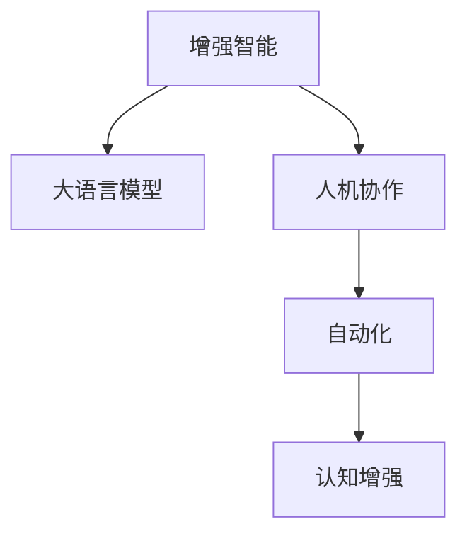

                 

# 增强智能：人机协作，拓展人类认知边界

在技术迅猛发展的今天，人类与机器的边界正在逐步模糊。大语言模型等人工智能技术正以其卓越的计算能力，深刻改变着我们理解和处理信息的方式。本文将深入探讨增强智能的原理与实践，展示人机协作的强大力量，并展望未来技术趋势与挑战。

## 1. 背景介绍

### 1.1 问题由来

当前，信息爆炸与人类认知能力有限的矛盾愈发凸显。面对海量数据和复杂问题，传统的人工智能方法往往显得力不从心。而基于大语言模型的增强智能技术，通过自然语言理解和生成，实现了对复杂问题的高效处理。

### 1.2 问题核心关键点

增强智能的核心在于利用人工智能技术，拓展人类的认知边界。主要包括以下几个方面：
- **认知增强**：通过机器对海量信息的高效处理和理解，辅助人类进行决策。
- **知识获取**：使机器能够学习、整合和利用人类积累的知识，提供更有力的支持。
- **协作互助**：建立人机协作机制，使机器成为人类认知能力的延伸和扩展。
- **自动化**：实现从数据获取、处理到结果呈现的全流程自动化，提升效率。

这些核心关键点构成了增强智能的核心价值，旨在通过技术进步，推动人类社会的进步和发展。

## 2. 核心概念与联系

### 2.1 核心概念概述

为更好地理解增强智能，本节将介绍几个关键概念：

- **增强智能(Enhanced Intelligence)**：利用人工智能技术，辅助人类进行复杂认知任务，提升决策、理解、创造等能力。
- **大语言模型(Large Language Model, LLM)**：以Transformer为基础，通过自监督学习任务，学习到丰富的语言知识和常识，具备强大的自然语言理解和生成能力。
- **人机协作(Human-AI Collaboration)**：通过算法设计和模型训练，使人工智能系统与人类有效协作，共同完成任务。
- **自动化(Automation)**：通过编程和算法实现流程的自动化，减少人类工作量，提高效率。
- **认知增强(Cognitive Enhancement)**：借助人工智能技术，提升人类的认知能力，增强决策、学习、推理等能力。

这些概念之间的逻辑关系可以通过以下Mermaid流程图来展示：



这个流程图展示了几大核心概念之间的逻辑联系：

1. 增强智能通过大语言模型获得语言理解和生成能力。
2. 人机协作是增强智能的关键实现方式。
3. 自动化是增强智能的重要工具。
4. 认知增强是增强智能的最终目标。

## 3. 核心算法原理 & 具体操作步骤
### 3.1 算法原理概述

增强智能的核心算法原理主要包括以下几个方面：

- **自然语言理解(Natural Language Understanding, NLU)**：通过大语言模型，将自然语言文本转化为计算机可处理的结构化数据。
- **自然语言生成(Natural Language Generation, NLG)**：利用大语言模型生成自然语言文本，提供易于理解和操作的输出。
- **知识图谱(Knowledge Graph)**：建立结构化的知识库，辅助机器理解复杂语义关系。
- **多模态学习(Multimodal Learning)**：结合视觉、听觉等多模态数据，提高机器的感知和理解能力。
- **持续学习(Continual Learning)**：使机器能够在不断变化的环境中，持续学习和适应新知识。

### 3.2 算法步骤详解

增强智能的算法步骤主要包括以下几个关键环节：

**Step 1: 数据收集与预处理**
- 收集任务相关的文本、图像、视频等数据。
- 对数据进行清洗、标注、分词等预处理操作。

**Step 2: 构建预训练模型**
- 使用预训练语言模型（如BERT、GPT-3等）进行预训练。
- 微调模型以适应特定任务，如问答、翻译、摘要等。

**Step 3: 融合知识图谱**
- 将领域知识转化为知识图谱，进行实体识别和关系抽取。
- 将知识图谱与模型结合，增强模型的知识获取能力。

**Step 4: 多模态学习**
- 结合视觉、听觉等多模态数据，提高模型的感知能力。
- 使用多模态学习算法（如跨模态对齐、联合训练等），增强模型的理解能力。

**Step 5: 模型优化与部署**
- 使用优化算法（如Adam、SGD等）对模型进行训练和优化。
- 将模型部署到生产环境中，进行实时推理和预测。

### 3.3 算法优缺点

增强智能的算法具有以下优点：

- **高效性**：大语言模型能够高效处理大量数据，辅助人类快速解决问题。
- **广泛适用性**：适用于各种复杂认知任务，如决策、规划、创造等。
- **人机协作**：通过算法设计，实现人机协作，使机器成为人类认知能力的延伸。
- **自动化**：实现流程自动化，提升效率和准确性。

同时，该算法也存在一些局限性：

- **依赖数据**：增强智能的效果很大程度上取决于数据的质量和数量。
- **模型复杂性**：大语言模型参数量巨大，训练和推理成本较高。
- **泛化能力**：模型对新数据的泛化能力有限，需要持续优化和调整。
- **伦理与安全**：增强智能可能带来新的伦理和安全问题，如偏见、隐私等。

尽管存在这些局限性，但增强智能的潜力巨大，已成为当前技术发展的重要方向。

### 3.4 算法应用领域

增强智能技术已经在多个领域得到广泛应用，具体包括：

- **医疗诊断**：利用大语言模型辅助医生进行病历分析、疾病预测和药物研发。
- **金融分析**：通过增强智能技术，辅助分析师进行市场预测、风险评估和投资建议。
- **智能客服**：提供24/7不间断服务，提升客户体验和问题解决效率。
- **教育辅助**：通过增强智能技术，提供个性化学习建议、智能批改和知识推荐。
- **自动驾驶**：利用增强智能技术，提升车辆的感知和决策能力，确保行车安全。
- **虚拟助手**：通过自然语言理解和生成，提供实时、个性化的交互服务。

增强智能技术还在更多领域不断探索和应用，为各行各业带来了新的突破和机遇。

## 4. 数学模型和公式 & 详细讲解

### 4.1 数学模型构建

增强智能的数学模型构建主要基于以下几个核心组件：

- **预训练语言模型**：以Transformer为基础，通过自监督学习任务（如掩码语言模型、下一句预测等），学习到通用的语言表示。
- **知识图谱**：构建结构化的知识库，用于辅助理解复杂语义关系。
- **多模态学习**：结合视觉、听觉等多模态数据，增强模型的感知能力。

### 4.2 公式推导过程

以自然语言理解(NLU)为例，推导Transformer模型进行文本编码的公式：

$$
\text{Encoder Output} = M^{L_{enc}}(X^{L_{in}}, C^{L_{enc}})
$$

其中，$X^{L_{in}}$ 为输入文本，$C^{L_{enc}}$ 为编码器的隐藏状态，$M^{L_{enc}}$ 为编码器，$L_{enc}$ 为编码器的层数。

对于自然语言生成(NLG)，以GPT-2模型为例，推导文本生成的公式：

$$
P(\text{Next Word} | \text{Previous Words}) = \text{softmax}(V^{L_{dec}} * H^{L_{dec}})
$$

其中，$V^{L_{dec}}$ 为解码器的权重矩阵，$H^{L_{dec}}$ 为解码器的隐藏状态，$L_{dec}$ 为解码器的层数。

### 4.3 案例分析与讲解

以医疗诊断为例，展示增强智能在疾病预测中的应用。

- **数据收集**：收集医生和患者的历史数据，包括症状、检查结果、病历等。
- **预训练模型**：使用BERT等预训练模型进行疾病预测任务的微调。
- **知识图谱**：构建医学知识图谱，用于辅助理解症状和疾病之间的关系。
- **多模态学习**：结合患者的影像数据，增强模型的诊断能力。
- **模型优化**：使用交叉熵损失函数进行模型训练和优化。
- **应用部署**：将模型部署到医生工作站，辅助医生进行疾病预测和诊断。

## 5. 项目实践：代码实例和详细解释说明

### 5.1 开发环境搭建

在进行增强智能实践前，我们需要准备好开发环境。以下是使用Python进行PyTorch开发的环境配置流程：

1. 安装Anaconda：从官网下载并安装Anaconda，用于创建独立的Python环境。

2. 创建并激活虚拟环境：
```bash
conda create -n pytorch-env python=3.8 
conda activate pytorch-env
```

3. 安装PyTorch：根据CUDA版本，从官网获取对应的安装命令。例如：
```bash
conda install pytorch torchvision torchaudio cudatoolkit=11.1 -c pytorch -c conda-forge
```

4. 安装Transformers库：
```bash
pip install transformers
```

5. 安装各类工具包：
```bash
pip install numpy pandas scikit-learn matplotlib tqdm jupyter notebook ipython
```

完成上述步骤后，即可在`pytorch-env`环境中开始增强智能实践。

### 5.2 源代码详细实现

下面我们以疾病预测为例，给出使用Transformers库进行BERT模型增强智能的PyTorch代码实现。

首先，定义疾病预测任务的数据处理函数：

```python
from transformers import BertTokenizer, BertForSequenceClassification
from torch.utils.data import Dataset
import torch

class DiseaseDataset(Dataset):
    def __init__(self, texts, labels, tokenizer, max_len=128):
        self.texts = texts
        self.labels = labels
        self.tokenizer = tokenizer
        self.max_len = max_len
        
    def __len__(self):
        return len(self.texts)
    
    def __getitem__(self, item):
        text = self.texts[item]
        label = self.labels[item]
        
        encoding = self.tokenizer(text, return_tensors='pt', max_length=self.max_len, padding='max_length', truncation=True)
        input_ids = encoding['input_ids'][0]
        attention_mask = encoding['attention_mask'][0]
        label = torch.tensor(label, dtype=torch.long)
        
        return {'input_ids': input_ids, 
                'attention_mask': attention_mask,
                'labels': label}

# 定义标签与id的映射
label2id = {'0': 0, '1': 1, '2': 2, '3': 3, '4': 4, '5': 5}
id2label = {v: k for k, v in label2id.items()}

# 创建dataset
tokenizer = BertTokenizer.from_pretrained('bert-base-cased')

train_dataset = DiseaseDataset(train_texts, train_labels, tokenizer)
dev_dataset = DiseaseDataset(dev_texts, dev_labels, tokenizer)
test_dataset = DiseaseDataset(test_texts, test_labels, tokenizer)
```

然后，定义模型和优化器：

```python
from transformers import AdamW

model = BertForSequenceClassification.from_pretrained('bert-base-cased', num_labels=len(label2id))

optimizer = AdamW(model.parameters(), lr=2e-5)
```

接着，定义训练和评估函数：

```python
from torch.utils.data import DataLoader
from tqdm import tqdm
from sklearn.metrics import classification_report

device = torch.device('cuda') if torch.cuda.is_available() else torch.device('cpu')
model.to(device)

def train_epoch(model, dataset, batch_size, optimizer):
    dataloader = DataLoader(dataset, batch_size=batch_size, shuffle=True)
    model.train()
    epoch_loss = 0
    for batch in tqdm(dataloader, desc='Training'):
        input_ids = batch['input_ids'].to(device)
        attention_mask = batch['attention_mask'].to(device)
        labels = batch['labels'].to(device)
        model.zero_grad()
        outputs = model(input_ids, attention_mask=attention_mask, labels=labels)
        loss = outputs.loss
        epoch_loss += loss.item()
        loss.backward()
        optimizer.step()
    return epoch_loss / len(dataloader)

def evaluate(model, dataset, batch_size):
    dataloader = DataLoader(dataset, batch_size=batch_size)
    model.eval()
    preds, labels = [], []
    with torch.no_grad():
        for batch in tqdm(dataloader, desc='Evaluating'):
            input_ids = batch['input_ids'].to(device)
            attention_mask = batch['attention_mask'].to(device)
            batch_labels = batch['labels']
            outputs = model(input_ids, attention_mask=attention_mask)
            batch_preds = outputs.logits.argmax(dim=1).to('cpu').tolist()
            batch_labels = batch_labels.to('cpu').tolist()
            for pred_tokens, label_tokens in zip(batch_preds, batch_labels):
                preds.append(pred_tokens[:len(label_tokens)])
                labels.append(label_tokens)
                
    print(classification_report(labels, preds))
```

最后，启动训练流程并在测试集上评估：

```python
epochs = 5
batch_size = 16

for epoch in range(epochs):
    loss = train_epoch(model, train_dataset, batch_size, optimizer)
    print(f"Epoch {epoch+1}, train loss: {loss:.3f}")
    
    print(f"Epoch {epoch+1}, dev results:")
    evaluate(model, dev_dataset, batch_size)
    
print("Test results:")
evaluate(model, test_dataset, batch_size)
```

以上就是使用PyTorch对BERT进行疾病预测任务增强智能的完整代码实现。可以看到，得益于Transformers库的强大封装，我们可以用相对简洁的代码完成BERT模型的加载和增强智能实践。

### 5.3 代码解读与分析

让我们再详细解读一下关键代码的实现细节：

**DiseaseDataset类**：
- `__init__`方法：初始化文本、标签、分词器等关键组件。
- `__len__`方法：返回数据集的样本数量。
- `__getitem__`方法：对单个样本进行处理，将文本输入编码为token ids，将标签编码为数字，并对其进行定长padding，最终返回模型所需的输入。

**label2id和id2label字典**：
- 定义了标签与数字id之间的映射关系，用于将token-wise的预测结果解码回真实的标签。

**训练和评估函数**：
- 使用PyTorch的DataLoader对数据集进行批次化加载，供模型训练和推理使用。
- 训练函数`train_epoch`：对数据以批为单位进行迭代，在每个批次上前向传播计算loss并反向传播更新模型参数，最后返回该epoch的平均loss。
- 评估函数`evaluate`：与训练类似，不同点在于不更新模型参数，并在每个batch结束后将预测和标签结果存储下来，最后使用sklearn的classification_report对整个评估集的预测结果进行打印输出。

**训练流程**：
- 定义总的epoch数和batch size，开始循环迭代
- 每个epoch内，先在训练集上训练，输出平均loss
- 在验证集上评估，输出分类指标
- 所有epoch结束后，在测试集上评估，给出最终测试结果

可以看到，PyTorch配合Transformers库使得BERT增强智能的代码实现变得简洁高效。开发者可以将更多精力放在数据处理、模型改进等高层逻辑上，而不必过多关注底层的实现细节。

当然，工业级的系统实现还需考虑更多因素，如模型的保存和部署、超参数的自动搜索、更灵活的任务适配层等。但核心的增强智能范式基本与此类似。

## 6. 实际应用场景

### 6.1 智能客服系统

增强智能技术可以广泛应用于智能客服系统的构建。传统客服往往需要配备大量人力，高峰期响应缓慢，且一致性和专业性难以保证。而使用增强智能技术，可以7x24小时不间断服务，快速响应客户咨询，用自然流畅的语言解答各类常见问题。

在技术实现上，可以收集企业内部的历史客服对话记录，将问题和最佳答复构建成监督数据，在此基础上对BERT模型进行增强智能微调。微调后的模型能够自动理解用户意图，匹配最合适的答复模板进行回复。对于客户提出的新问题，还可以接入检索系统实时搜索相关内容，动态组织生成回答。如此构建的智能客服系统，能大幅提升客户咨询体验和问题解决效率。

### 6.2 金融舆情监测

金融机构需要实时监测市场舆论动向，以便及时应对负面信息传播，规避金融风险。传统的人工监测方式成本高、效率低，难以应对网络时代海量信息爆发的挑战。增强智能技术可应用于金融舆情监测，通过自然语言理解，对金融新闻、评论、社交媒体内容等进行情感分析，识别市场情绪变化，实时预警潜在风险。

具体而言，可以收集金融领域相关的新闻、报道、评论等文本数据，并对其进行主题标注和情感标注。在此基础上对BERT模型进行增强智能微调，使其能够自动判断文本属于何种主题，情感倾向是正面、中性还是负面。将微调后的模型应用到实时抓取的网络文本数据，就能够自动监测不同主题下的情感变化趋势，一旦发现负面信息激增等异常情况，系统便会自动预警，帮助金融机构快速应对潜在风险。

### 6.3 个性化推荐系统

当前的推荐系统往往只依赖用户的历史行为数据进行物品推荐，无法深入理解用户的真实兴趣偏好。增强智能技术可应用于个性化推荐系统，通过自然语言理解和生成，提供更加个性化、多样化的推荐内容。

在实践中，可以收集用户浏览、点击、评论、分享等行为数据，提取和用户交互的物品标题、描述、标签等文本内容。将文本内容作为模型输入，用户的后续行为（如是否点击、购买等）作为监督信号，在此基础上对BERT模型进行增强智能微调。微调后的模型能够从文本内容中准确把握用户的兴趣点。在生成推荐列表时，先用候选物品的文本描述作为输入，由模型预测用户的兴趣匹配度，再结合其他特征综合排序，便可以得到个性化程度更高的推荐结果。

### 6.4 未来应用展望

随着增强智能技术的发展，其在更多领域的应用前景广阔。

在智慧医疗领域，增强智能技术可以辅助医生进行病历分析、疾病预测和药物研发。通过自然语言理解，将患者病历、症状等文本信息转化为结构化数据，辅助医生进行精准诊断和个性化治疗。

在智能教育领域，增强智能技术可应用于作业批改、学情分析、知识推荐等方面，因材施教，促进教育公平，提高教学质量。通过自然语言生成，自动生成个性化学习材料和作业，提升学生的学习体验和效果。

在智慧城市治理中，增强智能技术可应用于城市事件监测、舆情分析、应急指挥等环节，提高城市管理的自动化和智能化水平，构建更安全、高效的未来城市。通过自然语言理解，对社交媒体、传感器数据等进行分析和预测，辅助城市管理者做出快速、准确的决策。

此外，在企业生产、社会治理、文娱传媒等众多领域，增强智能技术也将不断涌现，为传统行业数字化转型升级提供新的技术路径。相信随着技术的日益成熟，增强智能技术必将在更多应用领域大放异彩，为经济社会发展注入新的动力。

## 7. 工具和资源推荐

### 7.1 学习资源推荐

为了帮助开发者系统掌握增强智能的理论基础和实践技巧，这里推荐一些优质的学习资源：

1. 《Transformer从原理到实践》系列博文：由大模型技术专家撰写，深入浅出地介绍了Transformer原理、BERT模型、增强智能技术等前沿话题。

2. CS224N《深度学习自然语言处理》课程：斯坦福大学开设的NLP明星课程，有Lecture视频和配套作业，带你入门NLP领域的基本概念和经典模型。

3. 《Natural Language Processing with Transformers》书籍：Transformers库的作者所著，全面介绍了如何使用Transformers库进行NLP任务开发，包括增强智能在内的诸多范式。

4. HuggingFace官方文档：Transformers库的官方文档，提供了海量预训练模型和完整的增强智能样例代码，是上手实践的必备资料。

5. CLUE开源项目：中文语言理解测评基准，涵盖大量不同类型的中文NLP数据集，并提供了基于增强智能的baseline模型，助力中文NLP技术发展。

通过对这些资源的学习实践，相信你一定能够快速掌握增强智能的精髓，并用于解决实际的NLP问题。

### 7.2 开发工具推荐

高效的开发离不开优秀的工具支持。以下是几款用于增强智能开发的常用工具：

1. PyTorch：基于Python的开源深度学习框架，灵活动态的计算图，适合快速迭代研究。大部分预训练语言模型都有PyTorch版本的实现。

2. TensorFlow：由Google主导开发的开源深度学习框架，生产部署方便，适合大规模工程应用。同样有丰富的预训练语言模型资源。

3. Transformers库：HuggingFace开发的NLP工具库，集成了众多SOTA语言模型，支持PyTorch和TensorFlow，是进行增强智能任务开发的利器。

4. Weights & Biases：模型训练的实验跟踪工具，可以记录和可视化模型训练过程中的各项指标，方便对比和调优。与主流深度学习框架无缝集成。

5. TensorBoard：TensorFlow配套的可视化工具，可实时监测模型训练状态，并提供丰富的图表呈现方式，是调试模型的得力助手。

6. Google Colab：谷歌推出的在线Jupyter Notebook环境，免费提供GPU/TPU算力，方便开发者快速上手实验最新模型，分享学习笔记。

合理利用这些工具，可以显著提升增强智能任务的开发效率，加快创新迭代的步伐。

### 7.3 相关论文推荐

增强智能技术的发展源于学界的持续研究。以下是几篇奠基性的相关论文，推荐阅读：

1. Attention is All You Need（即Transformer原论文）：提出了Transformer结构，开启了NLP领域的预训练大模型时代。

2. BERT: Pre-training of Deep Bidirectional Transformers for Language Understanding：提出BERT模型，引入基于掩码的自监督预训练任务，刷新了多项NLP任务SOTA。

3. Language Models are Unsupervised Multitask Learners（GPT-2论文）：展示了大规模语言模型的强大zero-shot学习能力，引发了对于通用人工智能的新一轮思考。

4. Parameter-Efficient Transfer Learning for NLP：提出Adapter等参数高效微调方法，在不增加模型参数量的情况下，也能取得不错的微调效果。

5. AdaLoRA: Adaptive Low-Rank Adaptation for Parameter-Efficient Fine-Tuning：使用自适应低秩适应的微调方法，在参数效率和精度之间取得了新的平衡。

6. Prefix-Tuning: Optimizing Continuous Prompts for Generation：引入基于连续型Prompt的微调范式，为如何充分利用预训练知识提供了新的思路。

这些论文代表了大语言模型增强智能的发展脉络。通过学习这些前沿成果，可以帮助研究者把握学科前进方向，激发更多的创新灵感。

## 8. 总结：未来发展趋势与挑战

### 8.1 总结

本文对增强智能的原理与实践进行了全面系统的介绍。首先阐述了增强智能的核心价值，包括认知增强、知识获取、人机协作、自动化等关键要素。其次，从原理到实践，详细讲解了增强智能的数学模型和算法步骤，给出了增强智能任务开发的完整代码实例。同时，本文还广泛探讨了增强智能在智能客服、金融舆情、个性化推荐等多个领域的应用前景，展示了增强智能技术的巨大潜力。此外，本文精选了增强智能技术的各类学习资源，力求为读者提供全方位的技术指引。

通过本文的系统梳理，可以看到，增强智能技术通过大语言模型的自然语言理解与生成能力，正在逐步改变人类的认知方式和工作效率。未来，随着技术的进一步发展，增强智能必将在更多领域大放异彩，推动人工智能技术的产业化进程。

### 8.2 未来发展趋势

展望未来，增强智能技术将呈现以下几个发展趋势：

1. **模型规模持续增大**：随着算力成本的下降和数据规模的扩张，预训练语言模型的参数量还将持续增长。超大规模语言模型蕴含的丰富语言知识，有望支撑更加复杂多变的认知任务。

2. **增强智能与多模态融合**：结合视觉、听觉等多模态数据，提高增强智能的感知和理解能力。多模态信息的融合，将显著提升语言模型对现实世界的建模能力。

3. **跨领域知识整合**：将符号化的先验知识，如知识图谱、逻辑规则等，与神经网络模型进行融合，引导增强智能模型学习更全面、准确的知识。

4. **持续学习与适应**：使增强智能模型能够在不断变化的环境中，持续学习和适应新知识。

5. **参数高效与计算高效**：开发更加参数高效和计算高效的微调方法，在固定大部分预训练参数的同时，只更新极少量的任务相关参数。

6. **伦理与安全性**：在增强智能模型的训练目标中引入伦理导向的评估指标，过滤和惩罚有偏见、有害的输出倾向。

以上趋势凸显了增强智能技术的发展前景。这些方向的探索发展，必将进一步提升增强智能模型的性能和应用范围，为人工智能技术在各个垂直行业的发展提供新的动力。

### 8.3 面临的挑战

尽管增强智能技术已经取得了显著进展，但在迈向更加智能化、普适化应用的过程中，它仍面临着诸多挑战：

1. **标注成本瓶颈**：增强智能的效果很大程度上取决于标注数据的质量和数量。对于长尾应用场景，难以获得充足的高质量标注数据，成为制约增强智能性能的瓶颈。

2. **模型鲁棒性不足**：当前增强智能模型面对域外数据时，泛化性能往往大打折扣。对于测试样本的微小扰动，增强智能模型的预测也容易发生波动。

3. **推理效率有待提高**：大规模增强智能模型虽然精度高，但在实际部署时往往面临推理速度慢、内存占用大等效率问题。

4. **可解释性亟需加强**：当前增强智能模型更像是"黑盒"系统，难以解释其内部工作机制和决策逻辑。

5. **安全性有待保障**：增强智能模型可能学习到有偏见、有害的信息，通过微调传递到下游任务，产生误导性、歧视性的输出，给实际应用带来安全隐患。

6. **知识整合能力不足**：现有的增强智能模型往往局限于任务内数据，难以灵活吸收和运用更广泛的先验知识。

正视增强智能面临的这些挑战，积极应对并寻求突破，将是大语言模型增强智能走向成熟的必由之路。相信随着学界和产业界的共同努力，这些挑战终将一一被克服，增强智能技术必将在构建人机协作的智能时代中扮演越来越重要的角色。

### 8.4 研究展望

面对增强智能所面临的种种挑战，未来的研究需要在以下几个方面寻求新的突破：

1. **探索无监督和半监督增强智能方法**：摆脱对大规模标注数据的依赖，利用自监督学习、主动学习等无监督和半监督范式，最大限度利用非结构化数据，实现更加灵活高效的增强智能。

2. **研究参数高效与计算高效的增强智能范式**：开发更加参数高效和计算高效的微调方法，在固定大部分预训练参数的同时，只更新极少量的任务相关参数。同时优化增强智能模型的计算图，减少前向传播和反向传播的资源消耗，实现更加轻量级、实时性的部署。

3. **引入因果分析和博弈论工具**：将因果分析方法引入增强智能模型，识别出模型决策的关键特征，增强输出解释的因果性和逻辑性。借助博弈论工具刻画人机交互过程，主动探索并规避模型的脆弱点，提高系统稳定性。

4. **纳入伦理道德约束**：在增强智能模型的训练目标中引入伦理导向的评估指标，过滤和惩罚有偏见、有害的输出倾向。同时加强人工干预和审核，建立模型行为的监管机制，确保输出符合人类价值观和伦理道德。

这些研究方向的探索，必将引领增强智能技术迈向更高的台阶，为构建安全、可靠、可解释、可控的智能系统铺平道路。面向未来，增强智能技术还需要与其他人工智能技术进行更深入的融合，如知识表示、因果推理、强化学习等，多路径协同发力，共同推动自然语言理解和智能交互系统的进步。只有勇于创新、敢于突破，才能不断拓展语言模型的边界，让智能技术更好地造福人类社会。

## 9. 附录：常见问题与解答

**Q1：增强智能是否适用于所有NLP任务？**

A: 增强智能在大多数NLP任务上都能取得不错的效果，特别是对于数据量较小的任务。但对于一些特定领域的任务，如医学、法律等，仅仅依靠通用语料预训练的模型可能难以很好地适应。此时需要在特定领域语料上进一步预训练，再进行微调，才能获得理想效果。此外，对于一些需要时效性、个性化很强的任务，如对话、推荐等，增强智能方法也需要针对性的改进优化。

**Q2：增强智能技术需要大规模标注数据吗？**

A: 增强智能的效果很大程度上取决于标注数据的质量和数量。对于某些领域，如医疗、金融等，获取高质量标注数据的成本较高。然而，随着无监督学习、半监督学习等方法的发展，增强智能技术已经开始探索从非结构化数据中提取知识的新途径，降低了对标注数据的依赖。未来，如何从数据中高效提取知识，将是大规模增强智能技术的重要研究方向。

**Q3：增强智能是否会导致偏见和歧视？**

A: 增强智能模型可能学习到有偏见、有害的信息，通过微调传递到下游任务，产生误导性、歧视性的输出。因此，如何从数据和算法层面消除模型偏见，避免恶意用途，确保输出的安全性，将是重要的研究课题。此外，增强智能模型应具备可解释性，使得输出结果能够被理解、解释和审查，确保其公平性和透明性。

**Q4：增强智能的推理效率如何提升？**

A: 增强智能模型推理效率的提升需要从多个方面入手。首先，可以采用模型裁剪、量化加速等技术，减少模型的大小和计算量。其次，可以优化计算图，减少前向传播和反向传播的资源消耗。最后，可以通过并行计算、分布式训练等技术，加速推理过程。

**Q5：增强智能如何与多模态数据融合？**

A: 增强智能与多模态数据的融合可以显著提升其感知和理解能力。具体来说，可以将视觉、听觉等多模态数据作为模型的输入，通过跨模态对齐、联合训练等技术，使增强智能模型能够同时处理多种类型的数据。同时，可以利用多模态数据的融合，提高增强智能模型的鲁棒性和泛化能力。

---

作者：禅与计算机程序设计艺术 / Zen and the Art of Computer Programming

