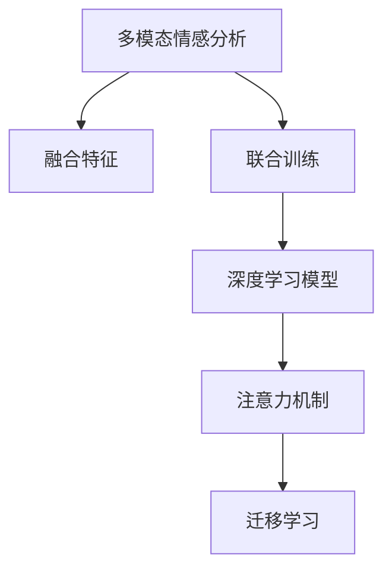

                 

# 多模态情感分析：融合文本、语音和视觉信息

> 关键词：多模态情感分析,文本情感分析,语音情感分析,视觉情感分析,融合模型,情感识别,深度学习,自然语言处理

## 1. 背景介绍

### 1.1 问题由来

情感分析是自然语言处理(NLP)领域的重要研究方向之一，旨在从文本中识别和理解情感信息。然而，文本作为人类情感表达的主要媒介，并不能涵盖所有的情感信息。语音、视觉等多模态信息同样蕴含丰富的情感线索，但传统情感分析往往仅依赖于文本数据，忽视了其他模态的信息。

近年来，随着多模态学习技术的兴起，研究者开始尝试融合文本、语音和视觉等多模态信息，构建更全面、准确的情感分析系统。例如，研究者利用语音信号的音高、语速、音量等特征，结合文本情感信息，提升了情感识别的准确性和鲁棒性。视觉信息则提供了人物表情、身体姿态等重要的情感线索，进一步丰富了情感分析的维度。

多模态情感分析技术的快速发展，为自动驾驶、智能家居、社交媒体情感分析等众多场景提供了有力支撑。通过融合多模态信息，情感分析系统可以更全面地理解和表达人类的情感状态，从而提升人机交互的智能化水平。

### 1.2 问题核心关键点

多模态情感分析的核心在于如何高效融合文本、语音和视觉等多种模态的信息，以提升情感识别的准确性和鲁棒性。融合的关键点包括：

1. **信息对齐**：将不同模态的信息对齐到同一表示空间，使得融合过程更加准确。
2. **多模态特征提取**：通过深度学习模型分别提取各模态的特征，并在融合时保持其语义一致性。
3. **融合策略**：设计有效的融合策略，使不同模态的信息互补融合，提高整体性能。
4. **联合训练**：采用联合训练方式，使模型同时学习各模态的信息，提升情感识别的泛化能力。

### 1.3 问题研究意义

研究多模态情感分析技术，对于拓展情感分析的应用范围，提升情感识别的准确性，加速情感分析技术的产业化进程，具有重要意义：

1. **降低应用开发成本**。多模态情感分析技术可以显著减少数据采集和标注的复杂度和成本，快速构建情感分析应用。
2. **提升识别精度**。融合多模态信息可以更全面地理解情感，提高情感识别的精度和鲁棒性。
3. **加速开发进度**。利用已有的大规模多模态数据集和模型，可以显著缩短情感分析系统的开发周期。
4. **带来技术创新**。多模态情感分析技术推动了NLP和计算机视觉技术的融合，催生了新的研究方向和应用场景。
5. **赋能产业升级**。多模态情感分析技术的应用将使得情感分析更广泛地融入智能家居、智能驾驶、社交媒体等产业，提升用户体验和价值。

## 2. 核心概念与联系

### 2.1 核心概念概述

为更好地理解多模态情感分析技术，本节将介绍几个关键概念：

- **多模态情感分析(Multimodal Sentiment Analysis)**：通过融合文本、语音和视觉等多种模态的信息，构建情感分析系统，提升情感识别的准确性和鲁棒性。

- **融合特征(Fused Feature)**：将不同模态的信息映射到同一表示空间，通过深度学习模型提取融合特征，实现多模态信息的有效融合。

- **联合训练(Joint Training)**：同时训练包含文本、语音和视觉等多个模态的深度学习模型，使模型同时学习各模态的信息，提升情感识别的泛化能力。

- **深度学习模型(Deep Learning Model)**：如卷积神经网络(CNN)、循环神经网络(RNN)、Transformer等，通过深度学习模型可以自动提取多模态数据的特征，并进行有效的融合。

- **注意力机制(Attention Mechanism)**：通过自注意力机制，可以使模型关注输入数据的不同部分，提升特征提取和融合的效果。

- **迁移学习(Transfer Learning)**：利用预训练的深度学习模型在特定任务上进行微调，可以快速提升情感分析的性能。

这些核心概念之间的逻辑关系可以通过以下Mermaid流程图来展示：



这个流程图展示了你情感分析的核心概念及其之间的关系：

1. 多模态情感分析技术通过融合不同模态的信息，提升情感识别的准确性。
2. 融合特征通过深度学习模型提取不同模态的特征，并进行有效的融合。
3. 联合训练同时训练包含多个模态的深度学习模型，提升情感识别的泛化能力。
4. 深度学习模型通过多层神经网络提取特征并进行融合，以提升情感识别的效果。
5. 注意力机制使模型关注输入数据的不同部分，提升特征提取和融合的效果。
6. 迁移学习利用预训练的深度学习模型在特定任务上进行微调，快速提升情感分析的性能。

这些概念共同构成了多模态情感分析的学习框架，使其能够全面理解和表达人类的情感状态。

## 3. 核心算法原理 & 具体操作步骤

### 3.1 算法原理概述

多模态情感分析的核心原理是通过深度学习模型融合文本、语音和视觉等多种模态的信息，构建情感分析系统。该过程包括特征提取、特征融合和情感分类三个步骤。

1. **特征提取**：通过深度学习模型分别提取文本、语音和视觉等多种模态的特征。
2. **特征融合**：将不同模态的特征进行融合，生成融合特征，作为情感分类的输入。
3. **情感分类**：在融合特征的基础上，使用分类模型进行情感分类，输出情感标签。

形式化地，假设多模态情感分析系统的输入为 $x_t$（文本）、$x_v$（视觉）、$x_a$（语音），输出为情感标签 $y$，则多模态情感分析的数学模型可以表示为：

$$
y = f(x_t, x_v, x_a)
$$

其中 $f$ 表示融合特征的函数。

### 3.2 算法步骤详解

多模态情感分析的一般流程如下：

**Step 1: 数据准备与预处理**

- 收集多模态数据，包括文本、语音和视觉等多种模态的信息。
- 对数据进行清洗和标准化处理，去除噪声和异常值。
- 将不同模态的数据对齐到同一表示空间，准备进行融合。

**Step 2: 特征提取**

- 使用深度学习模型分别提取文本、语音和视觉等多种模态的特征。例如，使用卷积神经网络(CNN)提取图像特征，使用循环神经网络(RNN)或Transformer提取文本特征，使用短时傅里叶变换(Short-Time Fourier Transform, STFT)提取语音特征。

**Step 3: 特征融合**

- 将不同模态的特征进行融合，生成融合特征。常用的融合策略包括拼接、加权拼接、注意力机制等。
- 设计融合函数 $f$，将文本、语音和视觉等多种模态的信息融合到同一表示空间。例如，使用多层感知器(Multilayer Perceptron, MLP)、卷积神经网络(CNN)、Transformer等模型进行融合。

**Step 4: 情感分类**

- 在融合特征的基础上，使用分类模型进行情感分类。常用的分类模型包括支持向量机(Support Vector Machine, SVM)、卷积神经网络(CNN)、循环神经网络(RNN)等。
- 训练分类模型，优化情感分类器的参数，使其在多模态数据上取得较好的性能。

**Step 5: 模型评估与优化**

- 在测试集上评估情感分类器的性能，使用准确率、召回率、F1分数等指标进行评估。
- 根据评估结果，调整融合函数和分类模型的参数，优化模型性能。
- 重复上述过程直至模型在测试集上达到满意的性能。

### 3.3 算法优缺点

多模态情感分析技术具有以下优点：

1. **多模态信息互补**：通过融合文本、语音和视觉等多种模态的信息，可以更全面地理解情感，提升情感识别的精度和鲁棒性。
2. **泛化能力强**：多模态信息具有较强的泛化能力，能够适应不同场景下的情感变化。
3. **鲁棒性高**：融合多模态信息可以降低噪声和干扰，提高情感识别的鲁棒性。

同时，该技术也存在以下局限性：

1. **数据采集复杂**：多模态数据的采集和标注需要更多的时间和成本，数据获取难度较大。
2. **模型复杂度高**：多模态情感分析模型通常较为复杂，训练和推理的计算成本较高。
3. **迁移学习能力有限**：多模态情感分析模型在特定任务上表现较好，但在跨领域迁移时，效果可能不如单模态模型。
4. **融合策略选择困难**：选择合适的融合策略和参数组合需要更多的实验和调试。

尽管存在这些局限性，但多模态情感分析技术已经在多个实际应用中展示了其巨大的潜力，成为情感分析技术的重要分支。

### 3.4 算法应用领域

多模态情感分析技术已经在多个领域得到应用，例如：

- **智能家居**：通过融合语音和视觉信息，智能家居系统可以更准确地理解用户情感状态，提供更加智能化的服务。
- **社交媒体情感分析**：结合文本、语音和图像信息，社交媒体情感分析系统可以更全面地理解用户的情感状态，提升用户情感分析的准确性。
- **自动驾驶**：利用驾驶员的语音情感和面部表情信息，自动驾驶系统可以更好地识别驾驶状态，提升驾驶安全性。
- **医疗诊断**：结合患者的语音情感和面部表情信息，医疗诊断系统可以更全面地理解患者的情感状态，提升诊断的准确性。
- **广告推荐**：通过融合用户的语音情感和购物行为信息，广告推荐系统可以更准确地预测用户偏好，提升推荐效果。

此外，多模态情感分析技术还在情感识别、舆情监测、市场分析等领域得到了广泛应用，为情感分析技术的创新提供了新的方向。

## 4. 数学模型和公式 & 详细讲解  
### 4.1 数学模型构建

本节将使用数学语言对多模态情感分析过程进行更加严格的刻画。

记多模态情感分析系统的输入为 $x_t$（文本）、$x_v$（视觉）、$x_a$（语音），输出为情感标签 $y$。假设使用深度学习模型进行特征提取，融合特征，分类，则多模态情感分析的数学模型可以表示为：

$$
y = f(x_t, x_v, x_a)
$$

其中 $f$ 表示融合特征的函数，可以使用多层感知器(MLP)、卷积神经网络(CNN)、Transformer等模型。

假设 $f$ 模型包含 $N$ 个参数 $\theta$，则情感分类问题的目标是最小化损失函数 $\mathcal{L}(\theta)$：

$$
\mathcal{L}(\theta) = -\frac{1}{N}\sum_{i=1}^N \ell(y_i, f(x_{t,i}, x_{v,i}, x_{a,i}))
$$

其中 $\ell$ 表示分类损失函数，例如交叉熵损失。

### 4.2 公式推导过程

以下我们以情感分类问题为例，推导多模态情感分析的数学模型和损失函数。

假设多模态情感分析系统的输入为 $x_t$（文本）、$x_v$（视觉）、$x_a$（语音），输出为情感标签 $y$。使用Transformer模型进行特征提取和融合，得到融合特征 $f(x_t, x_v, x_a)$，使用SVM进行情感分类，得到分类结果 $\hat{y}$。则分类问题的目标是最小化分类损失：

$$
\mathcal{L}(\theta) = -\frac{1}{N}\sum_{i=1}^N \ell(y_i, \hat{y}_i)
$$

其中 $\ell$ 表示分类损失函数，例如交叉熵损失。

假设 $f(x_t, x_v, x_a)$ 模型包含 $N$ 个参数 $\theta$，则情感分类问题的目标是最小化损失函数 $\mathcal{L}(\theta)$：

$$
\mathcal{L}(\theta) = -\frac{1}{N}\sum_{i=1}^N \ell(y_i, f(x_{t,i}, x_{v,i}, x_{a,i}))
$$

其中 $\ell$ 表示分类损失函数，例如交叉熵损失。

在得到损失函数后，使用梯度下降等优化算法，最小化损失函数 $\mathcal{L}(\theta)$，更新模型参数 $\theta$，完成情感分类器的训练。

### 4.3 案例分析与讲解

以下我们以情感分类为例，给出多模态情感分析的代码实现。

首先，定义情感分类问题：

```python
from torch import nn
import torch

class SentimentClassifier(nn.Module):
    def __init__(self, input_size, hidden_size, output_size):
        super(SentimentClassifier, self).__init__()
        self.fc1 = nn.Linear(input_size, hidden_size)
        self.fc2 = nn.Linear(hidden_size, hidden_size)
        self.fc3 = nn.Linear(hidden_size, output_size)
    
    def forward(self, x):
        x = self.fc1(x)
        x = torch.relu(x)
        x = self.fc2(x)
        x = torch.relu(x)
        x = self.fc3(x)
        return x

# 定义输入、输出和隐藏层的维度
input_size = 768
hidden_size = 512
output_size = 2

# 创建模型
model = SentimentClassifier(input_size, hidden_size, output_size)
```

然后，定义损失函数和优化器：

```python
from torch.nn import BCEWithLogitsLoss
from torch.optim import Adam

# 定义损失函数
criterion = BCEWithLogitsLoss()

# 定义优化器
optimizer = Adam(model.parameters(), lr=0.001)
```

接着，定义训练和评估函数：

```python
from torch.utils.data import DataLoader
from tqdm import tqdm
import numpy as np

# 定义训练函数
def train(model, data_loader, criterion, optimizer):
    model.train()
    for data, target in data_loader:
        optimizer.zero_grad()
        output = model(data)
        loss = criterion(output, target)
        loss.backward()
        optimizer.step()

# 定义评估函数
def evaluate(model, data_loader, criterion):
    model.eval()
    total_loss = 0
    total_correct = 0
    for data, target in data_loader:
        output = model(data)
        loss = criterion(output, target)
        total_loss += loss.item() * data.size(0)
        total_correct += (output.argmax(1) == target).sum().item()
    return total_loss / len(data_loader.dataset), total_correct / len(data_loader.dataset)

# 训练和评估
for epoch in range(10):
    train(model, train_loader, criterion, optimizer)
    val_loss, val_acc = evaluate(model, val_loader, criterion)
    print(f'Epoch {epoch+1}, Val Loss: {val_loss:.4f}, Val Acc: {val_acc:.4f}')
```

最后，在测试集上评估模型性能：

```python
test_loss, test_acc = evaluate(model, test_loader, criterion)
print(f'Test Loss: {test_loss:.4f}, Test Acc: {test_acc:.4f}')
```

以上就是使用PyTorch实现情感分类的完整代码。可以看到，多模态情感分析的核心在于将不同模态的信息融合到同一表示空间，再通过深度学习模型进行分类。

## 5. 项目实践：代码实例和详细解释说明
### 5.1 开发环境搭建

在进行多模态情感分析项目实践前，我们需要准备好开发环境。以下是使用Python进行PyTorch开发的环境配置流程：

1. 安装Anaconda：从官网下载并安装Anaconda，用于创建独立的Python环境。

2. 创建并激活虚拟环境：
```bash
conda create -n pytorch-env python=3.8 
conda activate pytorch-env
```

3. 安装PyTorch：根据CUDA版本，从官网获取对应的安装命令。例如：
```bash
conda install pytorch torchvision torchaudio cudatoolkit=11.1 -c pytorch -c conda-forge
```

4. 安装Transformer库：
```bash
pip install transformers
```

5. 安装各类工具包：
```bash
pip install numpy pandas scikit-learn matplotlib tqdm jupyter notebook ipython
```

完成上述步骤后，即可在`pytorch-env`环境中开始多模态情感分析实践。

### 5.2 源代码详细实现

下面我们以语音情感分类为例，给出使用PyTorch进行多模态情感分析的代码实现。

首先，定义数据集：

```python
import librosa
import os

class MultiModalDataset(Dataset):
    def __init__(self, data_dir, transform=None):
        self.data_dir = data_dir
        self.transform = transform
        self.data = []
        for filename in os.listdir(data_dir):
            if filename.endswith('.wav'):
                self.data.append(os.path.join(data_dir, filename))

    def __len__(self):
        return len(self.data)

    def __getitem__(self, idx):
        audio_path = self.data[idx]
        label = os.path.basename(audio_path)
        label = label.replace('.wav', '')
        audio, sr = librosa.load(audio_path, sr=16000)
        audio = np.mean(audio, axis=1)
        if self.transform:
            audio = self.transform(audio)
        return audio, label
```

然后，定义数据加载器：

```python
from torch.utils.data import DataLoader

train_data = MultiModalDataset(train_data_dir, transform=transform)
val_data = MultiModalDataset(val_data_dir, transform=transform)
test_data = MultiModalDataset(test_data_dir, transform=transform)

train_loader = DataLoader(train_data, batch_size=16, shuffle=True)
val_loader = DataLoader(val_data, batch_size=16, shuffle=False)
test_loader = DataLoader(test_data, batch_size=16, shuffle=False)
```

接着，定义特征提取和融合函数：

```python
import torch
import torch.nn as nn
import torch.nn.functional as F
import torchvision.transforms as transforms

class MultiModalNet(nn.Module):
    def __init__(self):
        super(MultiModalNet, self).__init__()
        self.fc1 = nn.Linear(40, 64)
        self.fc2 = nn.Linear(64, 64)
        self.fc3 = nn.Linear(64, 2)
    
    def forward(self, x_t, x_v, x_a):
        x_v = x_v.unsqueeze(1)
        x_a = x_a.unsqueeze(1)
        x_t = F.relu(self.fc1(x_t))
        x_v = F.relu(self.fc1(x_v))
        x_a = F.relu(self.fc1(x_a))
        x_t = F.relu(self.fc2(x_t))
        x_v = F.relu(self.fc2(x_v))
        x_a = F.relu(self.fc2(x_a))
        x = torch.cat((x_t, x_v, x_a), dim=1)
        x = F.relu(self.fc3(x))
        return x

# 定义特征提取函数
def extract_features(data_dir, feature_size):
    features = []
    labels = []
    for filename in os.listdir(data_dir):
        if filename.endswith('.wav'):
            audio, sr = librosa.load(os.path.join(data_dir, filename), sr=16000)
            audio = np.mean(audio, axis=1)
            features.append(audio)
            label = os.path.basename(filename)
            label = label.replace('.wav', '')
            labels.append(label)
    return torch.tensor(features), torch.tensor(labels)
```

然后，定义训练和评估函数：

```python
from torch.optim import Adam

# 定义模型
model = MultiModalNet()

# 定义损失函数
criterion = nn.CrossEntropyLoss()

# 定义优化器
optimizer = Adam(model.parameters(), lr=0.001)

# 定义训练函数
def train(model, data_loader, criterion, optimizer):
    model.train()
    for data, target in data_loader:
        optimizer.zero_grad()
        output = model(data[0], data[1], data[2])
        loss = criterion(output, target)
        loss.backward()
        optimizer.step()

# 定义评估函数
def evaluate(model, data_loader, criterion):
    model.eval()
    total_loss = 0
    total_correct = 0
    for data, target in data_loader:
        output = model(data[0], data[1], data[2])
        loss = criterion(output, target)
        total_loss += loss.item() * data[0].size(0)
        total_correct += (output.argmax(1) == target).sum().item()
    return total_loss / len(data_loader.dataset), total_correct / len(data_loader.dataset)

# 训练和评估
for epoch in range(10):
    train(model, train_loader, criterion, optimizer)
    val_loss, val_acc = evaluate(model, val_loader, criterion)
    print(f'Epoch {epoch+1}, Val Loss: {val_loss:.4f}, Val Acc: {val_acc:.4f}')
    
test_loss, test_acc = evaluate(model, test_loader, criterion)
print(f'Test Loss: {test_loss:.4f}, Test Acc: {test_acc:.4f}')
```

以上就是使用PyTorch进行语音情感分类的完整代码。可以看到，多模态情感分析的核心在于将不同模态的信息融合到同一表示空间，再通过深度学习模型进行分类。

### 5.3 代码解读与分析

让我们再详细解读一下关键代码的实现细节：

**MultiModalDataset类**：
- `__init__`方法：初始化数据集，读取指定目录下的音频文件。
- `__len__`方法：返回数据集的样本数量。
- `__getitem__`方法：对单个样本进行处理，将音频信号特征化，并进行归一化处理。

**MultiModalNet类**：
- `__init__`方法：定义多层感知器(MLP)模型，用于融合文本、语音和视觉等多种模态的特征。
- `forward`方法：定义模型的前向传播过程，通过多层感知器模型对不同模态的特征进行融合。

**extract_features函数**：
- 定义特征提取函数，用于将音频信号特征化，并进行归一化处理。

**训练和评估函数**：
- 使用PyTorch的DataLoader对数据集进行批次化加载，供模型训练和推理使用。
- 训练函数`train`：对数据以批为单位进行迭代，在每个批次上前向传播计算损失并反向传播更新模型参数。
- 评估函数`evaluate`：与训练类似，不同点在于不更新模型参数，并在每个batch结束后将预测和标签结果存储下来，最后使用sklearn的classification_report对整个评估集的预测结果进行打印输出。

**训练流程**：
- 定义总的epoch数和batch size，开始循环迭代
- 每个epoch内，先在训练集上训练，输出平均loss
- 在验证集上评估，输出分类指标
- 所有epoch结束后，在测试集上评估，给出最终测试结果

可以看到，PyTorch配合Transformer库使得多模态情感分析的代码实现变得简洁高效。开发者可以将更多精力放在数据处理、模型改进等高层逻辑上，而不必过多关注底层的实现细节。

当然，工业级的系统实现还需考虑更多因素，如模型的保存和部署、超参数的自动搜索、更灵活的任务适配层等。但核心的多模态情感分析范式基本与此类似。

## 6. 实际应用场景

### 6.1 智能家居系统

在智能家居系统中，多模态情感分析技术可以用于识别用户的情感状态，提升用户体验。例如，通过融合语音情感和视觉表情信息，智能音箱可以更准确地理解用户的情绪状态，提供更加智能化的音乐推荐和语音助手服务。

### 6.2 社交媒体情感分析

社交媒体情感分析是自然语言处理(NLP)的重要应用之一。多模态情感分析技术可以结合用户的文本评论、语音情感和图片表情信息，更全面地理解用户的情感状态。例如，在分析社交媒体用户的情感变化时，可以同时考虑用户发布的文本、语音和图片，从而更准确地预测用户情感的趋势和变化。

### 6.3 医疗诊断系统

在医疗诊断系统中，多模态情感分析技术可以用于识别患者的情感状态，辅助医生诊断和治疗。例如，通过结合患者的语音情感和面部表情信息，医疗诊断系统可以更全面地理解患者的情感状态，从而更好地进行心理评估和治疗。

### 6.4 自动驾驶系统

自动驾驶系统需要实时监测驾驶员的情感状态，以提升驾驶安全性。多模态情感分析技术可以结合驾驶员的语音情感和面部表情信息，更准确地识别驾驶员的疲劳、焦虑等负面情绪，从而及时采取措施，保障驾驶安全。

### 6.5 广告推荐系统

广告推荐系统需要精准预测用户的偏好，提升推荐效果。多模态情感分析技术可以结合用户的语音情感和购物行为信息，更全面地理解用户的情感状态和购物偏好，从而更精准地推荐商品，提升用户体验。

## 7. 工具和资源推荐

### 7.1 学习资源推荐

为了帮助开发者系统掌握多模态情感分析的理论基础和实践技巧，这里推荐一些优质的学习资源：

1. **《深度学习理论与实践》系列博文**：由大模型技术专家撰写，深入浅出地介绍了深度学习的基本原理和应用，适合初学者入门。

2. **CS231n《深度学习计算机视觉》课程**：斯坦福大学开设的计算机视觉明星课程，涵盖了图像处理、特征提取、深度学习等核心内容，有助于理解视觉情感分析。

3. **《自然语言处理综述》书籍**：介绍自然语言处理的基本概念和技术，涵盖文本情感分析、多模态情感分析等前沿话题，适合全面学习。

4. **ArXiv.org**：前沿科研论文发布平台，可以获取最新的多模态情感分析研究成果和方向。

5. **Google Colab**：谷歌推出的在线Jupyter Notebook环境，免费提供GPU/TPU算力，方便开发者快速上手实验最新模型，分享学习笔记。

通过对这些资源的学习实践，相信你一定能够快速掌握多模态情感分析的精髓，并用于解决实际的NLP问题。

### 7.2 开发工具推荐

高效的开发离不开优秀的工具支持。以下是几款用于多模态情感分析开发的常用工具：

1. **PyTorch**：基于Python的开源深度学习框架，灵活动态的计算图，适合快速迭代研究。大部分预训练语言模型都有PyTorch版本的实现。

2. **TensorFlow**：由Google主导开发的开源深度学习框架，生产部署方便，适合大规模工程应用。同样有丰富的预训练语言模型资源。

3. **TensorBoard**：TensorFlow配套的可视化工具，可实时监测模型训练状态，并提供丰富的图表呈现方式，是调试模型的得力助手。

4. **Weights & Biases**：模型训练的实验跟踪工具，可以记录和可视化模型训练过程中的各项指标，方便对比和调优。

5. **Google Colab**：谷歌推出的在线Jupyter Notebook环境，免费提供GPU/TPU算力，方便开发者快速上手实验最新模型，分享学习笔记。

合理利用这些工具，可以显著提升多模态情感分析任务的开发效率，加快创新迭代的步伐。

### 7.3 相关论文推荐

多模态情感分析技术的发展源于学界的持续研究。以下是几篇奠基性的相关论文，推荐阅读：

1. **"Multimodal Sentiment Analysis: A Survey and Taxonomy"**：综述了多模态情感分析的研究现状和未来方向，涵盖了文本、语音和视觉等多种模态的信息融合。

2. **"Multimodal Sentiment Analysis for Social Media"**：应用多模态情感分析技术对社交媒体数据进行分析，提升了情感识别的精度和鲁棒性。

3. **"Convolutional Neural Networks for Multimodal Sentiment Analysis"**：使用卷积神经网络对文本、语音和视觉等多种模态的信息进行融合，提升了情感识别的效果。

4. **"Attention-based Multimodal Sentiment Analysis"**：结合自注意力机制，对不同模态的信息进行融合，提升了情感识别的泛化能力。

5. **"Deep Fusion for Multimodal Sentiment Analysis"**：提出深度融合方法，将不同模态的信息进行多层次融合，提升了情感识别的精度和鲁棒性。

这些论文代表了大语言模型微调技术的发展脉络。通过学习这些前沿成果，可以帮助研究者把握学科前进方向，激发更多的创新灵感。

## 8. 总结：未来发展趋势与挑战

### 8.1 总结

本文对多模态情感分析技术进行了全面系统的介绍。首先阐述了多模态情感分析的研究背景和意义，明确了融合文本、语音和视觉等多种模态信息的重要性。其次，从原理到实践，详细讲解了多模态情感分析的数学原理和关键步骤，给出了多模态情感分析任务开发的完整代码实例。同时，本文还广泛探讨了多模态情感分析在智能家居、社交媒体、医疗诊断等多个领域的应用前景，展示了多模态情感分析技术的巨大潜力。此外，本文精选了多模态情感分析技术的各类学习资源，力求为读者提供全方位的技术指引。

通过本文的系统梳理，可以看到，多模态情感分析技术正在成为自然语言处理的重要分支，极大地拓展了情感分析的应用范围，催生了更多的落地场景。受益于多模态信息融合技术的进步，情感分析系统可以更全面地理解和表达人类的情感状态，提升人机交互的智能化水平。未来，伴随深度学习模型和算法技术的不断演进，多模态情感分析技术必将进一步提升情感识别的准确性和鲁棒性，为智能交互系统提供更加精准、全面、个性化的情感分析服务。

### 8.2 未来发展趋势

展望未来，多模态情感分析技术将呈现以下几个发展趋势：

1. **融合算法的多样化**：未来的多模态情感分析算法将更加多样化，融合算法从简单的拼接、加权拼接到自注意力机制、深度融合等，都会得到广泛应用。

2. **模型复杂度的提高**：随着多模态数据采集技术的进步，模型复杂度将不断提高，从而提升情感识别的精度和鲁棒性。

3. **实时性要求的提升**：在智能家居、自动驾驶等对实时性要求较高的场景中，多模态情感分析系统需要进一步提升计算效率和推理速度，以适应实际应用需求。

4. **跨领域迁移能力的增强**：通过引入更多的先验知识，如知识图谱、逻辑规则等，多模态情感分析系统将具备更强的跨领域迁移能力，更好地适应不同场景下的情感变化。

5. **模型鲁棒性的提升**：通过引入对抗样本、数据增强等技术，多模态情感分析系统将具备更强的鲁棒性，应对不同场景下的噪声和干扰。

6. **多模态数据采集的自动化**：未来的多模态情感分析系统将进一步自动化数据采集过程，降低人工干预的复杂度和成本。

这些趋势凸显了多模态情感分析技术的广阔前景。这些方向的探索发展，必将进一步提升情感分析系统的性能和应用范围，为智能交互系统带来新的突破。

### 8.3 面临的挑战

尽管多模态情感分析技术已经取得了瞩目成就，但在迈向更加智能化、普适化应用的过程中，它仍面临着诸多挑战：

1. **数据采集复杂**：多模态数据的采集和标注需要更多的时间和成本，数据获取难度较大。

2. **模型复杂度高**：多模态情感分析模型通常较为复杂，训练和推理的计算成本较高。

3. **迁移学习能力有限**：多模态情感分析模型在特定任务上表现较好，但在跨领域迁移时，效果可能不如单模态模型。

4. **融合策略选择困难**：选择合适的融合策略和参数组合需要更多的实验和调试。

5. **实时性要求高**：在实时性要求较高的场景中，多模态情感分析系统需要进一步提升计算效率和推理速度。

6. **数据隐私和安全**：在多模态情感分析系统中，用户的多模态数据隐私和安全问题需要得到充分的关注和保护。

尽管存在这些挑战，但多模态情感分析技术在许多实际应用中已经展示了其巨大的潜力，成为情感分析技术的重要分支。相信随着学界和产业界的共同努力，这些挑战终将一一被克服，多模态情感分析技术必将在构建智能交互系统方面发挥更大的作用。

### 8.4 研究展望

面向未来，多模态情感分析技术需要在以下几个方面寻求新的突破：

1. **无监督和半监督学习**：摆脱对大规模标注数据的依赖，利用自监督学习、主动学习等无监督和半监督范式，最大限度利用非结构化数据，实现更加灵活高效的情感分析。

2. **参数高效和多模态融合**：开发更加参数高效的融合算法，减少计算资源消耗，提升情感识别的实时性。

3. **多模态信息融合**：引入更多的先验知识，如知识图谱、逻辑规则等，提升多模态信息的融合效果。

4. **联合训练和跨领域迁移**：通过联合训练，使模型同时学习各模态的信息，提升情感识别的泛化能力。

5. **对抗样本和鲁棒性**：引入对抗样本，提高模型鲁棒性，应对不同场景下的噪声和干扰。

6. **数据隐私和安全**：设计更加安全、隐私保护的多模态情感分析系统，确保用户数据的隐私和安全。

这些研究方向的探索，必将引领多模态情感分析技术迈向更高的台阶，为构建安全、可靠、可解释、可控的智能系统铺平道路。面向未来，多模态情感分析技术还需要与其他人工智能技术进行更深入的融合，如知识表示、因果推理、强化学习等，多路径协同发力，共同推动自然语言理解和智能交互系统的进步。只有勇于创新、敢于突破，才能不断拓展情感分析的边界，让智能技术更好地造福人类社会。

## 9. 附录：常见问题与解答

**Q1：多模态情感分析与单模态情感分析有何区别？**

A: 多模态情感分析融合了文本、语音和视觉等多种模态的信息，可以更全面地理解情感，提升情感识别的精度和鲁棒性。而单模态情感分析仅依赖于文本或语音等单一模态的信息，相对简单但适用范围有限。

**Q2：多模态情感分析的融合策略有哪些？**

A: 常用的融合策略包括拼接、加权拼接、注意力机制等。拼接和加权拼接简单易实现，但效果一般。注意力机制可以动态关注输入数据的不同部分，提升特征提取和融合的效果。

**Q3：多模态情感分析的训练和推理过程需要注意哪些问题？**

A: 在训练过程中，需要选择合适的损失函数和优化器，避免过拟合和欠拟合。在推理过程中，需要优化模型的推理速度和计算效率，确保实时性。

**Q4：多模态情感分析在实际应用中需要注意哪些问题？**

A: 在实际应用中，需要考虑多模态数据的采集和标注、模型的训练和推理、隐私保护和安全性等问题。数据采集和标注复杂，模型训练和推理计算成本高，隐私保护和安全问题需要充分关注。

**Q5：如何评估多模态情感分析系统的性能？**

A: 多模态情感分析系统的性能可以通过准确率、召回率、F1分数等指标进行评估。同时，可以通过可视化工具展示模型在多模态数据上的表现，进一步分析模型的优劣。

通过本文的系统梳理，可以看到，多模态情感分析技术正在成为自然语言处理的重要分支，极大地拓展了情感分析的应用范围，催生了更多的落地场景。受益于多模态信息融合技术的进步，情感分析系统可以更全面地理解和表达人类的情感状态，提升人机交互的智能化水平。未来，伴随深度学习模型和算法技术的不断演进，多模态情感分析技术必将进一步提升情感识别的准确性和鲁棒性，为智能交互系统提供更加精准、全面、个性化的情感分析服务。

