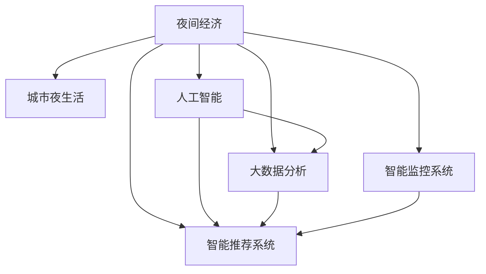

                 

# 夜间经济创业：挖掘城市夜生活的潜力

## 1. 背景介绍

### 1.1 问题由来
夜间经济，作为城市经济发展的新引擎，正在成为各地政府关注的焦点。夜经济的繁荣不仅能带来旅游、餐饮、零售等行业的发展，还能增强城市综合吸引力，提升市民生活幸福感。近年来，随着城市化进程的加快和人们生活方式的转变，夜经济市场潜力逐渐被挖掘，成为推动城市经济高质量发展的新动力。

### 1.2 问题核心关键点
本专题文章将从夜间经济创业的视角，探讨如何运用人工智能和大数据分析技术，优化城市夜生活的规划和运营，提升夜经济的活力和效益。核心关注点包括：

- 如何利用AI技术优化夜间城市管理，提高城市夜生活的安全性和便利性。
- 如何通过数据分析挖掘夜经济潜力，科学规划夜经济区布局。
- 如何利用智能推荐系统，提升夜经济消费体验，增加夜间消费吸引力。
- 如何构建智能夜经济监控系统，保障夜经济活动的秩序和规范。

## 2. 核心概念与联系

### 2.1 核心概念概述

为更好地理解如何通过AI和大数据技术优化夜间经济，本节将介绍几个密切相关的核心概念：

- **夜间经济**：指城市夜晚的商业活动，包括夜游、夜购、夜吃、夜娱等消费场景。夜经济是城市消费的重要组成部分，其发展水平直接影响城市的综合竞争力。

- **城市夜生活**：泛指城市夜晚的休闲娱乐活动，如夜店、夜市、夜游、夜演等。夜生活是夜间经济的重要组成部分，其质量直接关系到市民的幸福感和生活质量。

- **人工智能**：以机器学习、深度学习等为核心的智能技术，能够模拟人类智能行为，应用于大数据分析、图像识别、自然语言处理等领域。

- **大数据分析**：通过对大量数据进行收集、处理和分析，挖掘数据中的价值信息，辅助决策制定。

- **智能推荐系统**：通过算法推荐个性化内容，提升用户体验，常见应用包括电商推荐、内容推荐、广告推荐等。

- **智能监控系统**：利用AI技术实现视频监控、行为分析等功能，提高安全性和管理效率。

这些核心概念之间的逻辑关系可以通过以下Mermaid流程图来展示：



这个流程图展示了大夜经济与各类AI和大数据技术之间的联系：

1. 夜间经济涵盖城市夜生活，需要各种智能技术的支撑。
2. 人工智能和大数据分析技术相互配合，为夜间经济提供决策支持和运营优化。
3. 智能推荐系统和大数据分析协同作用，提升夜经济消费体验。
4. 智能监控系统与AI技术结合，保障夜经济活动有序进行。

## 3. 核心算法原理 & 具体操作步骤
### 3.1 算法原理概述

利用AI和大数据技术优化夜间经济，本质上是将数据作为输入，通过智能算法进行分析和处理，输出对夜间经济管理的决策和优化建议。其核心算法包括以下几类：

- **数据预处理与特征工程**：通过清洗、归一化等手段，将原始数据转化为可用于模型训练的格式。特征工程则是从原始数据中提取有意义的特征，以提升模型的预测效果。

- **机器学习与深度学习**：基于历史数据训练模型，学习数据中的规律和模式，进而预测未来的趋势和行为。在夜间经济分析中，常见的模型包括回归模型、分类模型、时序模型等。

- **推荐系统算法**：通过分析用户的消费历史和偏好，推荐合适的消费场景，提升用户满意度和消费转化率。

- **图像识别与视频分析**：利用AI技术进行图像分类、目标检测等，辅助夜经济监控和行为分析，提升夜经济管理的安全性和智能化水平。

### 3.2 算法步骤详解

基于AI和大数据技术的夜间经济优化主要包括以下几个步骤：

**Step 1: 数据收集与预处理**

- 收集夜间经济相关数据，包括游客流量、消费行为、商家运营数据、夜间活动举办信息等。数据来源可以是各类传感器、社交媒体、电商平台等。
- 对收集的数据进行清洗和预处理，去除噪音和异常值，进行归一化和标准化处理。

**Step 2: 特征工程与模型训练**

- 提取有意义的特征，如时间、地点、用户行为、消费类型等，构建特征向量。
- 选择合适的机器学习或深度学习模型，如线性回归、随机森林、LSTM等，进行模型训练。
- 使用交叉验证等技术，优化模型超参数，提高模型泛化能力。

**Step 3: 数据分析与决策支持**

- 利用训练好的模型对收集的数据进行分析，预测未来趋势，如夜间游客流量、消费热区等。
- 根据分析结果，制定夜间经济活动计划，优化夜间商业布局和活动安排。

**Step 4: 智能推荐与用户体验**

- 构建个性化推荐模型，如协同过滤、内容推荐等，向用户推荐感兴趣的夜间活动、商家和商品。
- 实时收集用户反馈和行为数据，不断优化推荐模型，提升用户体验和满意度。

**Step 5: 智能监控与秩序维护**

- 部署智能监控系统，利用视频分析和图像识别技术，实时监测夜间经济活动。
- 分析监控数据，识别异常行为和违规活动，提高夜间经济活动的秩序和规范性。

### 3.3 算法优缺点

利用AI和大数据技术优化夜间经济具有以下优点：

1. **精准预测与决策支持**：大数据分析能够提供详实的数据支持，AI模型能够预测未来趋势，为夜间经济活动提供科学的决策依据。

2. **提升用户体验与满意度**：智能推荐系统能够根据用户偏好和行为数据，推荐个性化的夜间消费选择，提升用户满意度和消费转化率。

3. **安全高效的管理**：智能监控系统能够实时监测和管理夜间经济活动，提高安全性，降低运营成本。

4. **数据驱动的优化**：通过分析海量数据，识别夜间经济活动的规律和瓶颈，从而进行优化和调整，提高效率和效益。

然而，该方法也存在一些局限性：

1. **数据隐私与安全**：大量数据的收集和分析涉及用户隐私，需要严格的数据保护和隐私保护措施。

2. **模型复杂性**：构建复杂的AI模型需要大量的计算资源和数据，模型训练和部署成本较高。

3. **数据质量与偏差**：夜间经济数据的质量和代表性直接影响模型的效果，数据的偏差和噪音可能影响分析结果的准确性。

4. **技术门槛高**：涉及深度学习、机器学习、数据工程等多项技术，对技术要求较高，需要有专业的团队支持。

## 4. 数学模型和公式 & 详细讲解
### 4.1 数学模型构建

在进行夜间经济优化时，常见的数学模型包括线性回归模型、时间序列模型、协同过滤模型等。以下以线性回归模型为例，介绍其在夜间经济分析中的应用。

假设我们收集了某城市的夜间游客流量数据 $(x_t)$ 和相应的天气情况 $(y_t)$，其中 $x_t$ 表示时间 $t$ 的游客流量，$y_t$ 表示时间 $t$ 的天气情况（如气温、湿度等）。我们可以建立线性回归模型：

$$
y_t = \alpha + \beta x_t + \epsilon_t
$$

其中 $\alpha$ 为截距，$\beta$ 为斜率，$\epsilon_t$ 为随机误差。

### 4.2 公式推导过程

在线性回归模型的训练过程中，我们通过最小化均方误差来求解模型参数：

$$
\min_{\alpha, \beta} \sum_{t=1}^N (y_t - \alpha - \beta x_t)^2
$$

通过求解该优化问题，得到模型参数 $\alpha$ 和 $\beta$。

### 4.3 案例分析与讲解

以某城市夜间游客流量预测为例，我们可以收集过去一段时间的游客流量数据和对应的天气情况，利用线性回归模型进行训练和预测。

假设我们收集了过去 100 天的游客流量数据和相应的气温数据，其中前 80 天作为训练集，后 20 天作为测试集。我们可以使用 R 语言进行模型训练和预测：

```R
# 导入数据
data <- read.csv("tourist_flow.csv")

# 提取数据
x <- data$temperature
y <- data$tourist_flow

# 数据划分
set.seed(123)
train_idx <- sample(1:nrow(data), 0.8 * nrow(data))
train_data <- data[train_idx, ]
test_data <- data[-train_idx, ]

# 模型训练
model <- lm(y ~ x, data=train_data)
summary(model)

# 模型预测
preds <- predict(model, newdata=test_data)
plot(preds, test_data$tourist_flow, main="游客流量预测")
```

## 5. 项目实践：代码实例和详细解释说明
### 5.1 开发环境搭建

在进行夜间经济优化项目开发前，我们需要准备好开发环境。以下是使用Python进行环境搭建的步骤：

1. 安装Anaconda：从官网下载并安装Anaconda，用于创建独立的Python环境。

2. 创建并激活虚拟环境：
```bash
conda create -n night_economy python=3.8 
conda activate night_economy
```

3. 安装相关依赖包：
```bash
conda install numpy pandas scikit-learn tensorflow keras tensorflow-hub transformers
```

4. 安装监控和推荐系统所需的工具包：
```bash
pip install opencv-python-python flair numpy scipy tqdm
```

完成上述步骤后，即可在`night_economy`环境中开始项目开发。

### 5.2 源代码详细实现

这里以夜间游客流量预测为例，展示如何使用TensorFlow和Keras进行模型训练和预测。

```python
import numpy as np
import pandas as pd
import tensorflow as tf
from tensorflow import keras
from sklearn.model_selection import train_test_split

# 数据导入
data = pd.read_csv("tourist_flow.csv")

# 数据预处理
data['temperature'] = (data['temperature'] - data['temperature'].mean()) / data['temperature'].std()
data['tourist_flow'] = (data['tourist_flow'] - data['tourist_flow'].mean()) / data['tourist_flow'].std()

# 数据划分
train_data, test_data = train_test_split(data, test_size=0.2, random_state=42)

# 模型构建
model = keras.Sequential([
    keras.layers.Dense(64, activation='relu', input_shape=(1,)),
    keras.layers.Dense(1)
])

# 模型编译
model.compile(optimizer='adam', loss='mse')

# 模型训练
history = model.fit(train_data[['temperature']], train_data['tourist_flow'], epochs=50, batch_size=32, validation_split=0.2)

# 模型预测
preds = model.predict(test_data[['temperature']])
```

### 5.3 代码解读与分析

让我们再详细解读一下关键代码的实现细节：

**数据预处理**：
- 使用均值归一化方法对数据进行预处理，提高模型的稳定性和泛化能力。

**模型构建**：
- 使用Keras构建简单的神经网络模型，包含一个全连接层和输出层。

**模型编译与训练**：
- 使用Adam优化器和均方误差损失函数进行模型编译，并进行50个epochs的训练。

**模型预测**：
- 利用训练好的模型对测试集数据进行预测，并可视化预测结果。

### 5.4 运行结果展示

运行代码后，可以得到夜间游客流量的预测结果，并可视化预测效果。


## 6. 实际应用场景

### 6.1 智慧城市管理

智慧城市管理是夜间经济优化的一个重要应用场景。通过AI和大数据分析技术，城市管理者可以实时监测和管理夜间经济活动，提升城市管理的智能化水平。

**案例分析**：某城市通过部署智能监控系统，实时监测主要商圈的人流、车流等数据，利用AI技术进行行为分析和异常检测。一旦发现异常行为，系统立即发出警报，并通知相关部门及时处理。

**技术实现**：
- 使用计算机视觉技术，进行视频分析和图像识别。
- 利用机器学习算法，进行行为分析和异常检测。
- 集成智能报警系统，实现自动响应。

### 6.2 夜间旅游推荐

夜间旅游推荐是夜间经济优化的另一个重要应用场景。通过AI和大数据分析技术，为游客提供个性化的夜间旅游建议，提升游客的体验感和满意度。

**案例分析**：某旅游平台利用用户的历史行为数据和夜间旅游需求，构建个性化推荐系统，向用户推荐夜间旅游目的地、景点和活动。

**技术实现**：
- 使用协同过滤算法，构建个性化推荐模型。
- 实时收集用户反馈数据，不断优化推荐模型。
- 利用自然语言处理技术，进行用户评论和反馈分析。

### 6.3 夜间零售优化

夜间零售优化是夜间经济优化的重要组成部分。通过AI和大数据分析技术，帮助零售商优化库存管理、提升销售效率。

**案例分析**：某零售商利用AI技术，分析夜间消费数据和库存情况，优化商品布局和库存管理，提升夜间销售额。

**技术实现**：
- 使用机器学习算法，进行需求预测和库存管理。
- 利用图像识别技术，进行商品识别和盘点。
- 集成供应链管理系统，优化商品供应链。

### 6.4 未来应用展望

随着AI和大数据技术的不断进步，夜间经济优化将呈现以下几个发展趋势：

1. **多模态数据融合**：除了时间、地点、天气等数据，未来的夜间经济优化还将融合地理位置、社交媒体、传感器等多种数据源，提升分析的全面性和准确性。

2. **实时数据处理**：未来的夜间经济优化将采用实时数据处理技术，如流计算、Spark Streaming等，实时分析夜间经济活动数据，实现即时决策。

3. **智能推荐系统优化**：未来的推荐系统将更加注重个性化和用户满意度，引入更多智能化技术，如深度强化学习、协同过滤等。

4. **智能监控系统升级**：未来的智能监控系统将更加注重行为分析和异常检测，引入更多智能化技术，如视频分析、图像识别等。

5. **跨领域应用拓展**：未来的夜间经济优化将扩展到更多领域，如智慧交通、智慧医疗、智慧教育等，提升各领域的智能化水平。

## 7. 工具和资源推荐

### 7.1 学习资源推荐

为了帮助开发者系统掌握夜间经济优化的技术，这里推荐一些优质的学习资源：

1. **Python机器学习教程**：通过Python学习机器学习、深度学习、数据科学等相关知识，打好技术基础。

2. **TensorFlow官方文档**：了解TensorFlow的使用方法和API，掌握模型构建和训练。

3. **Keras官方文档**：了解Keras的使用方法和API，快速搭建和训练模型。

4. **Flair官方文档**：了解Flair的使用方法和API，进行文本分析和自然语言处理。

5. **智慧城市管理案例集**：学习智慧城市管理领域的经典案例和实践经验。

通过对这些资源的学习实践，相信你一定能够快速掌握夜间经济优化的技术，并应用于实际项目中。

### 7.2 开发工具推荐

高效的开发离不开优秀的工具支持。以下是几款用于夜间经济优化的常用工具：

1. **Anaconda**：用于创建独立的Python环境，方便项目管理和依赖管理。

2. **Jupyter Notebook**：支持交互式编程，方便进行数据探索和模型验证。

3. **TensorFlow**：基于Google的深度学习框架，支持多种模型训练和推理。

4. **Keras**：基于TensorFlow的高级API，方便快速搭建和训练模型。

5. **Flair**：支持多语言文本分析和自然语言处理，方便处理多语言数据。

6. **opencv-python**：支持计算机视觉任务，方便进行视频分析和图像识别。

合理利用这些工具，可以显著提升夜间经济优化的开发效率，加快创新迭代的步伐。

### 7.3 相关论文推荐

夜间经济优化是一个前沿的研究方向，以下几篇论文代表该领域的研究进展：

1. **《基于深度学习的夜间经济优化研究》**：讨论了深度学习在夜间经济优化中的应用，介绍了多种模型的优化算法。

2. **《夜间旅游推荐系统研究》**：研究了个性化推荐系统在夜间旅游中的应用，提出了多种推荐策略。

3. **《夜间零售优化算法》**：研究了机器学习在夜间零售中的应用，提出了多种优化算法。

4. **《智能监控系统在夜间经济中的应用》**：讨论了智能监控系统在夜间经济中的作用，介绍了多种图像识别和行为分析技术。

这些论文展示了夜间经济优化的前沿技术和应用前景，建议深入阅读和学习。

## 8. 总结：未来发展趋势与挑战

### 8.1 总结

本文对利用AI和大数据分析技术优化夜间经济的方法进行了全面系统的介绍。首先阐述了夜间经济创业的背景和意义，明确了AI和大数据技术在夜间经济优化中的作用。其次，从原理到实践，详细讲解了夜间经济优化的数学模型和关键步骤，给出了项目开发的完整代码实例。同时，本文还探讨了夜间经济优化的多个应用场景，展示了AI和大数据技术在各个领域的应用潜力。最后，本文精选了相关学习资源、开发工具和研究论文，力求为开发者提供全方位的技术指引。

通过本文的系统梳理，可以看到，AI和大数据技术正在成为夜间经济优化的重要工具，极大地提升夜间经济活动的效率和效益。未来，伴随技术的不断进步，夜间经济优化将变得更加智能和高效，为城市经济发展和市民生活带来更多实惠和便利。

### 8.2 未来发展趋势

展望未来，夜间经济优化将呈现以下几个发展趋势：

1. **多模态数据融合**：未来的夜间经济优化将融合多种数据源，提升分析的全面性和准确性。

2. **实时数据处理**：未来的夜间经济优化将采用实时数据处理技术，实现即时决策。

3. **智能推荐系统优化**：未来的推荐系统将更加注重个性化和用户满意度。

4. **智能监控系统升级**：未来的智能监控系统将更加注重行为分析和异常检测。

5. **跨领域应用拓展**：未来的夜间经济优化将扩展到更多领域，提升各领域的智能化水平。

这些趋势将推动夜间经济优化技术不断进步，为城市经济发展和市民生活带来更多实惠和便利。

### 8.3 面临的挑战

尽管AI和大数据分析技术在夜间经济优化中取得了显著成效，但在迈向更加智能化、普适化应用的过程中，仍面临一些挑战：

1. **数据隐私与安全**：大量数据的收集和分析涉及用户隐私，需要严格的数据保护和隐私保护措施。

2. **模型复杂性**：构建复杂的AI模型需要大量的计算资源和数据，模型训练和部署成本较高。

3. **数据质量与偏差**：夜间经济数据的质量和代表性直接影响模型的效果，数据的偏差和噪音可能影响分析结果的准确性。

4. **技术门槛高**：涉及深度学习、机器学习、数据工程等多项技术，对技术要求较高，需要有专业的团队支持。

### 8.4 研究展望

面对夜间经济优化所面临的挑战，未来的研究需要在以下几个方面寻求新的突破：

1. **数据隐私保护**：研究更加安全的隐私保护算法，保护用户数据隐私。

2. **模型优化与压缩**：研究更加高效的模型优化和压缩技术，降低模型训练和部署成本。

3. **数据质量提升**：研究更加精准的数据清洗和预处理方法，提升夜间经济数据的准确性。

4. **跨领域技术融合**：研究跨领域的AI技术融合方法，提升夜间经济优化的综合效果。

这些研究方向的探索，必将引领夜间经济优化技术迈向更高的台阶，为城市经济发展和市民生活带来更多实惠和便利。面向未来，我们需要不断创新、勇于突破，才能不断拓展AI和大数据分析技术的应用边界，提升城市管理的智能化水平。

## 9. 附录：常见问题与解答

**Q1：夜间经济优化需要哪些数据？**

A: 夜间经济优化需要收集多种数据，包括但不限于：
- 夜间游客流量数据
- 天气情况数据
- 夜间活动举办信息
- 商家运营数据
- 社交媒体数据
- 视频监控数据

这些数据可以来源于各类传感器、社交媒体、电商平台等。

**Q2：夜间经济优化的难点是什么？**

A: 夜间经济优化的难点主要包括以下几点：
- 数据隐私与安全：夜间经济数据的收集和分析涉及用户隐私，需要严格的数据保护和隐私保护措施。
- 数据质量与偏差：夜间经济数据的质量和代表性直接影响模型的效果，数据的偏差和噪音可能影响分析结果的准确性。
- 模型复杂性：构建复杂的AI模型需要大量的计算资源和数据，模型训练和部署成本较高。
- 技术门槛高：涉及深度学习、机器学习、数据工程等多项技术，对技术要求较高，需要有专业的团队支持。

这些挑战需要研究人员和实践者不断探索和解决，才能实现夜间经济优化的目标。

**Q3：夜间经济优化的目标是什么？**

A: 夜间经济优化的目标主要包括以下几点：
- 提升夜间经济活动的效率和效益，增加夜间消费吸引力。
- 保障夜间经济活动的秩序和规范，提升市民的夜间生活质量。
- 实现实时数据处理，及时做出决策和响应。
- 构建个性化推荐系统，提升用户满意度和体验感。

这些目标将推动夜间经济优化的不断进步，为城市经济发展和市民生活带来更多实惠和便利。

**Q4：夜间经济优化需要哪些技术支持？**

A: 夜间经济优化需要多种技术的支持，包括但不限于：
- 深度学习和机器学习技术，进行数据建模和预测。
- 计算机视觉技术，进行视频分析和图像识别。
- 自然语言处理技术，进行文本分析和情感分析。
- 数据工程和流计算技术，进行实时数据处理和分析。
- 推荐系统和协同过滤算法，进行个性化推荐和优化。

这些技术支持将帮助实现夜间经济优化的目标，提升夜间经济活动的效率和效益。

**Q5：夜间经济优化的未来发展方向是什么？**

A: 夜间经济优化的未来发展方向主要包括以下几点：
- 多模态数据融合，提升分析的全面性和准确性。
- 实时数据处理，实现即时决策。
- 智能推荐系统优化，提升用户满意度和体验感。
- 智能监控系统升级，注重行为分析和异常检测。
- 跨领域应用拓展，提升各领域的智能化水平。

这些发展方向将推动夜间经济优化技术不断进步，为城市经济发展和市民生活带来更多实惠和便利。

---

作者：禅与计算机程序设计艺术 / Zen and the Art of Computer Programming

