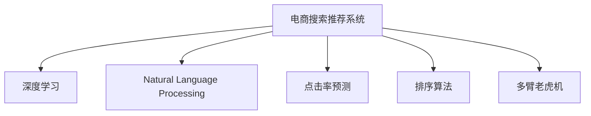
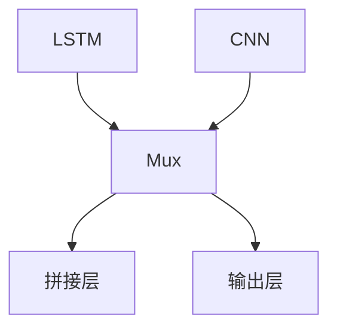

                 

# 大数据与AI 驱动的电商搜索推荐：以准确率与用户体验为核心

## 1. 背景介绍

### 1.1 问题由来

在快速发展的电商行业，搜索引擎和推荐系统作为用户获取信息和商品的重要工具，其准确性和用户体验直接影响用户的购买决策和整体满意度。然而，传统搜索引擎和推荐系统普遍存在数据稀疏、冷启动问题，难以充分理解和预测用户需求。近年来，随着大数据和人工智能技术的发展，以深度学习和自然语言处理为核心的电商搜索推荐系统应运而生。

通过深度学习模型对用户历史行为、搜索记录、评论等大数据进行建模，电商搜索推荐系统能够更准确地预测用户兴趣，并实时调整搜索结果和推荐内容，极大地提升了用户满意度和电商平台的用户粘性。然而，在追求高准确率的同时，如何兼顾良好的用户体验，成为电商平台必须面对的挑战。

### 1.2 问题核心关键点

电商搜索推荐系统的核心目标在于：
- 准确性：通过深度学习和数据分析，预测用户需求，提供最相关、最符合用户期望的搜索结果和推荐内容。
- 时效性：实时处理用户查询，快速响应，提升用户体验。
- 个性化：根据用户历史行为和兴趣，定制化推荐，提升用户满意度。
- 安全性：确保搜索结果和推荐内容的安全性和合规性，避免有害信息的传播。
- 可扩展性：应对大规模用户查询和推荐需求，保证系统性能稳定。

## 2. 核心概念与联系

### 2.1 核心概念概述

为更好地理解电商搜索推荐系统的设计和优化，本节将介绍几个关键概念：

- 电商搜索推荐系统(E-Commerce Search and Recommendation System)：旨在通过智能算法，结合用户行为数据，为用户提供个性化的搜索结果和推荐内容，提升用户购买体验。
- 深度学习(Deep Learning)：通过多层神经网络，对大规模数据进行深度学习和建模，自动提取数据特征，实现自动化预测和分类。
- 自然语言处理(Natural Language Processing, NLP)：涉及对人类语言数据的处理和分析，是电商搜索推荐系统的重要组成部分，用于理解和生成自然语言文本。
- 点击率预测(Click-Through Rate, CTR)：预测用户对搜索结果或推荐内容是否点击的模型，是衡量搜索推荐系统准确性的重要指标。
- 排序算法(Ranking Algorithm)：对搜索结果或推荐内容进行排序，优先显示最相关的结果，提升用户体验。
- 多臂老虎机(Multi-Armed Bandit, MAB)：在推荐系统中，将每个推荐视为一个“臂”，通过优化算法选择最有可能带来奖励的“臂”，优化推荐效果。

这些概念之间的逻辑关系可以通过以下Mermaid流程图来展示：



这个流程图展示了电商搜索推荐系统的核心概念及其之间的关系：

1. 电商搜索推荐系统通过深度学习和大数据分析，学习用户行为特征。
2. 自然语言处理技术帮助系统理解和生成自然语言文本，提升搜索和推荐的质量。
3. 点击率预测模型预测用户是否会点击搜索结果或推荐内容，用于评估搜索推荐系统的准确性。
4. 排序算法对搜索结果或推荐内容进行排序，提升用户体验。
5. 多臂老虎机算法优化推荐内容的选择，提高推荐效果。

## 3. 核心算法原理 & 具体操作步骤

### 3.1 算法原理概述

电商搜索推荐系统通常基于用户行为数据和产品属性信息，采用深度学习模型进行训练。常用的深度学习模型包括：

- 基于点击率预测的深度神经网络模型：如DeepFM、Wide & Deep等，通过宽/窄网络结合，提升模型预测能力。
- 基于序列建模的RNN/LSTM/GRU模型：如LSTM-CNN，通过时间序列建模，捕捉用户行为规律。
- 基于用户画像和行为的协同过滤模型：如协同矩阵分解算法ALS，通过构建用户画像，提升推荐效果。
- 基于注意力机制的模型：如Transformer-based推荐模型，通过自注意力机制，捕捉用户和产品之间的交互信息。

这些模型的核心在于利用深度学习自动提取数据特征，并通过多层网络学习用户行为和产品特征之间的关系，从而实现高准确率的点击率和推荐效果。

### 3.2 算法步骤详解

电商搜索推荐系统的算法流程一般包括以下几个关键步骤：

**Step 1: 数据准备与特征工程**
- 收集电商平台的交易数据、用户行为数据、产品属性数据等。
- 清洗和预处理数据，去除异常值和噪声。
- 设计特征工程流程，提取有意义的特征，如用户ID、商品ID、购买时间、浏览时长等。

**Step 2: 模型训练与优化**
- 选择合适的深度学习模型，如Wide & Deep、LSTM-CNN等，进行训练。
- 设置合适的超参数，如学习率、批大小、迭代轮数等。
- 使用交叉验证等技术进行模型评估和调优。

**Step 3: 点击率预测**
- 使用训练好的深度学习模型，对用户查询和产品信息进行编码，得到用户和产品的特征表示。
- 将用户和产品特征表示输入模型，预测用户点击每个产品的概率。
- 根据预测结果对搜索结果或推荐内容进行排序。

**Step 4: 实时推荐**
- 部署训练好的模型，实时处理用户查询，预测用户点击每个产品的概率。
- 根据预测结果和用户行为历史，生成个性化推荐列表。
- 实时更新推荐模型，优化推荐效果。

### 3.3 算法优缺点

电商搜索推荐系统的优势在于：
- 通过深度学习和大数据分析，能够自动提取数据特征，提升预测准确性。
- 利用用户行为数据，实现个性化推荐，提高用户满意度。
- 实时处理用户查询，快速响应，提升用户体验。

但该方法也存在一些局限性：
- 数据稀疏问题：电商平台的数据往往非常稀疏，难以充分理解和预测用户需求。
- 冷启动问题：对于新用户或新商品，缺乏足够的数据进行预测，推荐效果较差。
- 模型复杂度高：深度学习模型需要大量的计算资源和存储空间，成本较高。
- 缺乏可解释性：深度学习模型通常是“黑盒”，难以解释其内部工作机制和决策逻辑。
- 安全性问题：推荐内容可能存在安全隐患，如虚假广告、有害信息等。

尽管存在这些局限性，但就目前而言，深度学习模型在电商搜索推荐系统中已经取得了显著的效果，成为了电商平台标配。未来，相关研究也将聚焦于如何解决数据稀疏和冷启动问题，提升推荐系统的鲁棒性和安全性，同时增强模型的可解释性。

### 3.4 算法应用领域

电商搜索推荐系统的应用领域非常广泛，包括：

- 商品搜索：用户输入关键词，系统返回最相关的搜索结果。
- 商品推荐：根据用户历史行为和兴趣，提供个性化的商品推荐。
- 个性化营销：通过用户画像和行为分析，实现精准营销。
- 用户行为分析：分析用户浏览、点击、购买等行为，优化广告投放策略。
- 库存管理：预测产品销售情况，优化库存管理，提升供应链效率。

此外，电商搜索推荐技术还广泛应用于广告投放、客服对话、内容生成等领域，为电商平台的数字化转型提供了强有力的支持。

## 4. 数学模型和公式 & 详细讲解 & 举例说明

### 4.1 数学模型构建

电商搜索推荐系统通常基于点击率预测模型，其核心数学模型为：

$$
P(y|x; \theta) = \sigma(W^T x + b)
$$

其中 $y \in \{0,1\}$ 表示用户是否点击了某个产品，$x$ 为产品特征向量，$\theta$ 为模型参数，$W$ 和 $b$ 为模型的权重和偏置项，$\sigma$ 为激活函数。

模型的训练目标为最小化负对数似然损失函数：

$$
L(\theta) = -\frac{1}{N} \sum_{i=1}^N [y_i \log P(y_i|x_i; \theta) + (1-y_i) \log (1-P(y_i|x_i; \theta))]
$$

通过梯度下降等优化算法，不断更新模型参数 $\theta$，最小化损失函数 $L(\theta)$。

### 4.2 公式推导过程

点击率预测模型的推导过程如下：

首先，将用户点击概率 $P(y|x; \theta)$ 表示为线性回归模型：

$$
\hat{y} = W^T x + b
$$

然后，通过sigmoid函数将输出映射到 $(0,1)$ 区间，得到用户点击的概率估计：

$$
P(y|x; \theta) = \sigma(\hat{y}) = \frac{1}{1+\exp(-\hat{y})}
$$

其中，$\sigma(z) = \frac{1}{1+\exp(-z)}$ 为sigmoid函数，$z$ 为线性回归的输出。

将上述公式带入负对数似然损失函数，得到：

$$
L(\theta) = -\frac{1}{N} \sum_{i=1}^N [y_i \log P(y_i|x_i; \theta) + (1-y_i) \log (1-P(y_i|x_i; \theta))]
$$

该损失函数用于衡量模型预测的概率分布与真实标签之间的差异。通过最小化该损失函数，可以训练出高性能的点击率预测模型。

### 4.3 案例分析与讲解

以LSTM-CNN模型为例，其架构如下：



LSTM-CNN模型将LSTM层和CNN层相结合，通过时间序列建模捕捉用户行为规律，通过卷积层提取产品特征。其核心公式如下：

$$
\hat{y} = LSTM(x_{t-1}) \oplus CNN(x)
$$

其中，$x_t$ 为时间 $t$ 的用户行为序列，$LSTM$ 为LSTM层，$CNN$ 为卷积层，$\oplus$ 为拼接运算。

训练过程如下：

1. 输入时间序列 $x_t$ 到LSTM层，得到用户行为特征表示 $h_t$。
2. 输入产品特征 $x$ 到CNN层，得到产品特征表示 $c_t$。
3. 将 $h_t$ 和 $c_t$ 拼接，作为输入到输出层。
4. 使用sigmoid函数将输出映射到 $(0,1)$ 区间，得到用户点击的概率估计。
5. 将预测结果 $y$ 与真实标签 $y'$ 带入损失函数，反向传播更新模型参数。

## 5. 项目实践：代码实例和详细解释说明

### 5.1 开发环境搭建

在进行电商搜索推荐系统的开发前，我们需要准备好开发环境。以下是使用Python进行TensorFlow开发的环境配置流程：

1. 安装Anaconda：从官网下载并安装Anaconda，用于创建独立的Python环境。

2. 创建并激活虚拟环境：
```bash
conda create -n tf-env python=3.8 
conda activate tf-env
```

3. 安装TensorFlow：根据CUDA版本，从官网获取对应的安装命令。例如：
```bash
conda install tensorflow -c tensorflow -c conda-forge
```

4. 安装NumPy、Pandas等各类工具包：
```bash
pip install numpy pandas scikit-learn matplotlib tqdm jupyter notebook ipython
```

完成上述步骤后，即可在`tf-env`环境中开始电商搜索推荐系统的开发。

### 5.2 源代码详细实现

下面我们以基于LSTM-CNN的电商搜索推荐系统为例，给出TensorFlow的代码实现。

首先，定义LSTM-CNN模型的结构：

```python
import tensorflow as tf
from tensorflow.keras.layers import LSTM, Conv1D, Flatten, Dense, Input
from tensorflow.keras.models import Model

# 定义LSTM-CNN模型
def lstm_cnn_model(input_shape, num_classes):
    inputs = Input(shape=input_shape)
    
    # LSTM层
    lstm_layer = LSTM(128, return_sequences=True)(inputs)
    lstm_layer = LSTM(64, return_sequences=True)(lstm_layer)
    lstm_layer = LSTM(32)(lstm_layer)
    
    # CNN层
    conv_layer = Conv1D(64, 3, activation='relu')(lstm_layer)
    conv_layer = Conv1D(32, 3, activation='relu')(conv_layer)
    conv_layer = Flatten()(conv_layer)
    
    # 输出层
    outputs = Dense(num_classes, activation='sigmoid')(conv_layer)
    
    model = Model(inputs=inputs, outputs=outputs)
    return model

# 构建模型
model = lstm_cnn_model((256, 100), 10)
```

然后，定义模型训练函数：

```python
from tensorflow.keras.optimizers import Adam
from tensorflow.keras.losses import BinaryCrossentropy
from tensorflow.keras.metrics import Accuracy

# 定义优化器和损失函数
optimizer = Adam(lr=0.001)
loss = BinaryCrossentropy()

# 定义评估指标
metrics = [Accuracy()]

# 训练函数
def train_model(model, train_data, val_data, epochs=10, batch_size=32):
    model.compile(optimizer=optimizer, loss=loss, metrics=metrics)
    
    history = model.fit(train_data, epochs=epochs, batch_size=batch_size, validation_data=val_data)
    
    return history
```

最后，启动训练流程：

```python
# 数据预处理
train_data = preprocess_train_data()
val_data = preprocess_val_data()

# 训练模型
history = train_model(model, train_data, val_data)
```

完整代码实现如下：

```python
import tensorflow as tf
from tensorflow.keras.layers import LSTM, Conv1D, Flatten, Dense, Input
from tensorflow.keras.models import Model

# 定义LSTM-CNN模型
def lstm_cnn_model(input_shape, num_classes):
    inputs = Input(shape=input_shape)
    
    # LSTM层
    lstm_layer = LSTM(128, return_sequences=True)(inputs)
    lstm_layer = LSTM(64, return_sequences=True)(lstm_layer)
    lstm_layer = LSTM(32)(lstm_layer)
    
    # CNN层
    conv_layer = Conv1D(64, 3, activation='relu')(lstm_layer)
    conv_layer = Conv1D(32, 3, activation='relu')(conv_layer)
    conv_layer = Flatten()(conv_layer)
    
    # 输出层
    outputs = Dense(num_classes, activation='sigmoid')(conv_layer)
    
    model = Model(inputs=inputs, outputs=outputs)
    return model

# 构建模型
model = lstm_cnn_model((256, 100), 10)

# 定义优化器和损失函数
optimizer = Adam(lr=0.001)
loss = BinaryCrossentropy()

# 定义评估指标
metrics = [Accuracy()]

# 训练函数
def train_model(model, train_data, val_data, epochs=10, batch_size=32):
    model.compile(optimizer=optimizer, loss=loss, metrics=metrics)
    
    history = model.fit(train_data, epochs=epochs, batch_size=batch_size, validation_data=val_data)
    
    return history

# 数据预处理
train_data = preprocess_train_data()
val_data = preprocess_val_data()

# 训练模型
history = train_model(model, train_data, val_data)
```

### 5.3 代码解读与分析

让我们再详细解读一下关键代码的实现细节：

**LSTM-CNN模型定义**：
- `Input`层：定义模型的输入形状。
- `LSTM`层：通过多层LSTM层进行时间序列建模，捕捉用户行为规律。
- `Conv1D`层：通过卷积层提取产品特征。
- `Flatten`层：将卷积层的输出展平，用于后续全连接层。
- `Dense`层：全连接层，将用户行为特征和产品特征拼接后，输入到输出层。
- `Model`层：将上述各层封装为模型。

**模型训练函数**：
- `Adam`优化器：设置学习率为0.001。
- `BinaryCrossentropy`损失函数：用于二分类任务。
- `Accuracy`评估指标：用于衡量模型的准确率。
- `fit`方法：通过模型训练函数，对模型进行训练。

**数据预处理**：
- `preprocess_train_data`和`preprocess_val_data`函数：定义数据预处理流程，将原始数据转换为模型所需的格式。

**训练流程**：
- `train_model`函数：定义训练函数，包括模型编译、训练、评估等步骤。
- `train_data`和`val_data`变量：用于存储预处理后的训练数据和验证数据。
- `history`变量：用于存储模型训练过程中的指标记录。

通过上述代码实现，我们可以看到TensorFlow在深度学习模型构建和训练上的强大封装能力，可以显著提高开发效率。同时，合理利用TensorFlow提供的优化器和评估指标，也能保证模型训练过程的稳定性和有效性。

## 6. 实际应用场景

### 6.1 智能客服系统

智能客服系统是电商搜索推荐技术的典型应用场景之一。智能客服系统通过深度学习模型和自然语言处理技术，能够自动理解用户的咨询意图，提供相关的产品信息和服务支持，提升用户体验。

具体而言，智能客服系统可以基于用户历史咨询记录和行为数据，训练深度学习模型进行意图识别和推荐。模型通过学习大量的对话数据，能够准确理解和生成自然语言，快速响应用户需求。同时，通过多轮对话机制，智能客服系统能够不断学习和优化，提升服务质量。

### 6.2 个性化推荐系统

个性化推荐系统是电商搜索推荐技术的另一重要应用场景。通过深度学习模型对用户历史行为和兴趣进行建模，推荐系统能够实时生成个性化推荐内容，提升用户满意度和平台粘性。

具体而言，个性化推荐系统可以基于用户历史点击、购买、浏览等行为数据，训练深度学习模型进行用户画像建模。模型通过学习用户行为序列和产品特征，能够预测用户对不同产品的点击和购买概率，生成个性化的推荐列表。同时，通过引入多臂老虎机算法，推荐系统能够动态调整推荐策略，优化推荐效果。

### 6.3 库存管理

库存管理是电商平台的日常运营任务之一，通过搜索推荐技术，可以优化库存管理，减少库存积压和缺货情况。具体而言，库存管理系统可以基于历史销售数据和用户行为数据，训练深度学习模型进行销售预测。模型通过学习用户行为序列和产品特征，能够预测产品的销售趋势，优化库存管理策略，提升供应链效率。

## 7. 工具和资源推荐

### 7.1 学习资源推荐

为了帮助开发者系统掌握电商搜索推荐技术的理论基础和实践技巧，这里推荐一些优质的学习资源：

1. 《深度学习实战》系列书籍：通过实例讲解深度学习模型的构建和训练，帮助理解电商搜索推荐系统的核心技术。
2. Coursera《深度学习与神经网络》课程：斯坦福大学开设的深度学习入门课程，全面讲解深度学习原理和应用。
3. TensorFlow官方文档：TensorFlow的官方文档，提供详细的模型构建和训练指南。
4. HuggingFace Transformers库文档：Transformer库的官方文档，提供丰富的预训练模型和微调样例。
5. Arxiv论文库：访问最新的深度学习论文，了解最新的研究方向和技术进展。

通过这些资源的学习实践，相信你一定能够快速掌握电商搜索推荐技术的精髓，并用于解决实际的电商问题。

### 7.2 开发工具推荐

高效的开发离不开优秀的工具支持。以下是几款用于电商搜索推荐系统开发的常用工具：

1. TensorFlow：基于Python的开源深度学习框架，灵活动态的计算图，适合快速迭代研究。
2. PyTorch：基于Python的开源深度学习框架，动态图机制，适合深度学习模型的快速开发和实验。
3. TensorBoard：TensorFlow配套的可视化工具，实时监测模型训练状态，提供丰富的图表呈现方式。
4. Weights & Biases：模型训练的实验跟踪工具，可以记录和可视化模型训练过程中的各项指标，方便对比和调优。
5. Keras：高级神经网络API，提供简单易用的接口，适合快速搭建深度学习模型。

合理利用这些工具，可以显著提升电商搜索推荐系统的开发效率，加快创新迭代的步伐。

### 7.3 相关论文推荐

电商搜索推荐技术的发展源于学界的持续研究。以下是几篇奠基性的相关论文，推荐阅读：

1. Wide & Deep Learning for Recommender Systems（Wide & Deep论文）：提出Wide & Deep模型，结合浅层特征和深度学习，提升推荐效果。
2. Neural Collaborative Filtering（NCF论文）：提出协同矩阵分解算法，通过深度神经网络进行协同过滤。
3. Learning Deep Architectures for Recommender Systems（DLA论文）：提出深度学习架构，通过多层次网络捕捉用户行为规律。
4. DeepFM: A Factorization-Machine based Deep Learning Model for Recommender Systems（DeepFM论文）：提出DeepFM模型，结合FM和深度学习，提升推荐效果。
5. A Hybrid Approach to Recommender Systems: Data Mining and Machine Learning in Recommendation Systems（HAR论文）：提出混合推荐模型，结合数据挖掘和机器学习技术，提升推荐效果。

这些论文代表了大数据驱动的电商搜索推荐技术的发展脉络。通过学习这些前沿成果，可以帮助研究者把握学科前进方向，激发更多的创新灵感。

## 8. 总结：未来发展趋势与挑战

### 8.1 总结

本文对电商搜索推荐系统的深度学习模型进行了全面系统的介绍。首先阐述了电商搜索推荐系统在电商平台的重要性，明确了其核心目标和关键点。其次，从原理到实践，详细讲解了深度学习模型的构建和训练过程，给出了电商搜索推荐系统的代码实现。同时，本文还广泛探讨了电商搜索推荐系统在智能客服、个性化推荐、库存管理等多个领域的应用前景，展示了其在电商平台的广泛应用。此外，本文精选了深度学习模型的学习资源、开发工具和相关论文，力求为读者提供全方位的技术指引。

通过本文的系统梳理，可以看到，深度学习模型在电商搜索推荐系统中已经取得了显著的效果，成为电商平台标配。未来，相关研究也将聚焦于如何解决数据稀疏和冷启动问题，提升推荐系统的鲁棒性和安全性，同时增强模型的可解释性。

### 8.2 未来发展趋势

展望未来，电商搜索推荐技术将呈现以下几个发展趋势：

1. 深度学习模型的进一步优化。随着模型结构的不断演进，深度学习模型将更高效、更准确，能够更好地适应电商平台的实际需求。
2. 融合更多数据源。通过融合更多数据源，如社交网络、图像、视频等，提升模型的全面性和准确性。
3. 个性化推荐的多样化。通过引入更多个性化推荐策略，如基于内容、基于协同、基于行为等，提升推荐效果。
4. 引入跨模态技术。通过引入跨模态技术，如视觉、语音等多模态信息的融合，提升推荐系统的智能化水平。
5. 增强模型的可解释性。通过引入可解释性技术，如特征可视化、因果分析等，提升模型的透明性和可解释性。
6. 优化推荐系统的扩展性和可部署性。通过引入轻量级模型、分布式训练等技术，优化推荐系统的扩展性和可部署性。

以上趋势凸显了电商搜索推荐技术的广阔前景。这些方向的探索发展，必将进一步提升电商平台的智能化水平，为电商用户的购物体验带来革命性变化。

### 8.3 面临的挑战

尽管电商搜索推荐技术已经取得了显著的成果，但在迈向更加智能化、普适化应用的过程中，它仍面临诸多挑战：

1. 数据稀疏问题。电商平台的数据往往非常稀疏，难以充分理解和预测用户需求。如何进一步降低数据的稀疏度，提升模型的泛化能力，仍然是一个重要问题。
2. 冷启动问题。对于新用户或新商品，缺乏足够的数据进行预测，推荐效果较差。如何提升冷启动效果，提高新用户和新商品的推荐质量，仍需进一步研究。
3. 模型复杂度高。深度学习模型需要大量的计算资源和存储空间，成本较高。如何优化模型结构，提升模型的计算效率，仍是一个重要的研究方向。
4. 缺乏可解释性。深度学习模型通常是“黑盒”，难以解释其内部工作机制和决策逻辑。如何增强模型的可解释性，提升用户信任度，仍需进一步探索。
5. 安全性问题。推荐内容可能存在安全隐患，如虚假广告、有害信息等。如何保障推荐内容的安全性，避免恶意用途，仍需进一步研究。

尽管存在这些挑战，但电商搜索推荐技术在电商平台中的应用已经取得了显著成效，未来仍有望在更多的场景中发挥作用，为电商平台的数字化转型提供强有力的支持。

### 8.4 研究展望

面向未来，电商搜索推荐技术的进一步发展需要在以下几个方面寻求新的突破：

1. 探索无监督和半监督推荐方法。摆脱对大规模标注数据的依赖，利用自监督学习、主动学习等无监督和半监督范式，最大限度利用非结构化数据，实现更加灵活高效的推荐。
2. 研究参数高效和计算高效的推荐范式。开发更加参数高效的推荐方法，在固定大部分预训练参数的情况下，只更新极少量的任务相关参数。同时优化推荐模型的计算图，减少前向传播和反向传播的资源消耗，实现更加轻量级、实时性的部署。
3. 融合因果和对比学习范式。通过引入因果推断和对比学习思想，增强推荐模型建立稳定因果关系的能力，学习更加普适、鲁棒的用户行为表示。
4. 引入更多先验知识。将符号化的先验知识，如知识图谱、逻辑规则等，与神经网络模型进行巧妙融合，引导推荐过程学习更准确、合理的用户行为表示。
5. 结合因果分析和博弈论工具。将因果分析方法引入推荐模型，识别出模型决策的关键特征，增强推荐结果的因果性和逻辑性。借助博弈论工具刻画人机交互过程，主动探索并规避推荐模型的脆弱点，提高系统稳定性。
6. 纳入伦理道德约束。在推荐目标中引入伦理导向的评估指标，过滤和惩罚有偏见、有害的推荐内容，确保推荐内容的合法合规。同时加强人工干预和审核，建立推荐系统的监管机制，确保推荐内容的伦理安全性。

这些研究方向的探索，必将引领电商搜索推荐技术迈向更高的台阶，为构建安全、可靠、可解释、可控的推荐系统铺平道路。面向未来，电商搜索推荐技术还需要与其他人工智能技术进行更深入的融合，如知识表示、因果推理、强化学习等，多路径协同发力，共同推动推荐系统的进步。只有勇于创新、敢于突破，才能不断拓展推荐系统的边界，让智能技术更好地造福电商平台的广大用户。

## 9. 附录：常见问题与解答

**Q1：电商搜索推荐系统是否适用于所有电商平台？**

A: 电商搜索推荐系统在大多数电商平台中都有较好的应用效果，特别是对于用户量较大的电商平台。但对于一些小型电商平台，由于用户数据较少，推荐效果可能不如预期。此时可以在特定领域进行有针对性的模型优化和数据预处理，提升推荐质量。

**Q2：深度学习模型在电商搜索推荐系统中的准确率如何？**

A: 深度学习模型在电商搜索推荐系统中通常能够取得较高的准确率，特别是在用户数据较丰富的场景中。然而，模型的准确率也受到多种因素的影响，如数据质量、模型结构、超参数设置等。因此，在实际应用中，需要根据具体场景进行调整和优化。

**Q3：电商搜索推荐系统如何应对数据稀疏问题？**

A: 电商搜索推荐系统可以通过以下方式应对数据稀疏问题：
1. 数据增强：通过回译、近义替换等方式扩充训练集。
2. 引入更多先验知识：利用领域知识，如知识图谱、逻辑规则等，补充模型知识。
3. 多模型融合：通过多个模型的融合，提升模型的泛化能力。

这些方法可以有效缓解数据稀疏问题，提升推荐系统的性能。

**Q4：电商搜索推荐系统如何实现个性化推荐？**

A: 电商搜索推荐系统通常通过深度学习模型对用户历史行为和兴趣进行建模，生成个性化推荐内容。具体而言，可以通过以下方式实现个性化推荐：
1. 用户画像建模：通过分析用户历史行为数据，构建用户画像，捕捉用户兴趣点。
2. 协同过滤：通过分析用户与商品之间的交互数据，进行协同过滤推荐。
3. 深度学习模型：通过深度学习模型对用户行为序列和产品特征进行建模，生成个性化推荐列表。

通过以上方法，电商搜索推荐系统能够实现更加精准、多样化的个性化推荐。

**Q5：电商搜索推荐系统的扩展性和可部署性如何？**

A: 电商搜索推荐系统的扩展性和可部署性可以通过以下方式提升：
1. 模型裁剪：去除不必要的层和参数，减小模型尺寸，加快推理速度。
2. 量化加速：将浮点模型转为定点模型，压缩存储空间，提高计算效率。
3. 服务化封装：将模型封装为标准化服务接口，便于集成调用。
4. 弹性伸缩：根据请求流量动态调整资源配置，平衡服务质量和成本。
5. 监控告警：实时采集系统指标，设置异常告警阈值，确保服务稳定性。

通过以上优化，电商搜索推荐系统可以更好地应对大规模用户查询和推荐需求，提升系统的扩展性和可部署性。

---

作者：禅与计算机程序设计艺术 / Zen and the Art of Computer Programming

