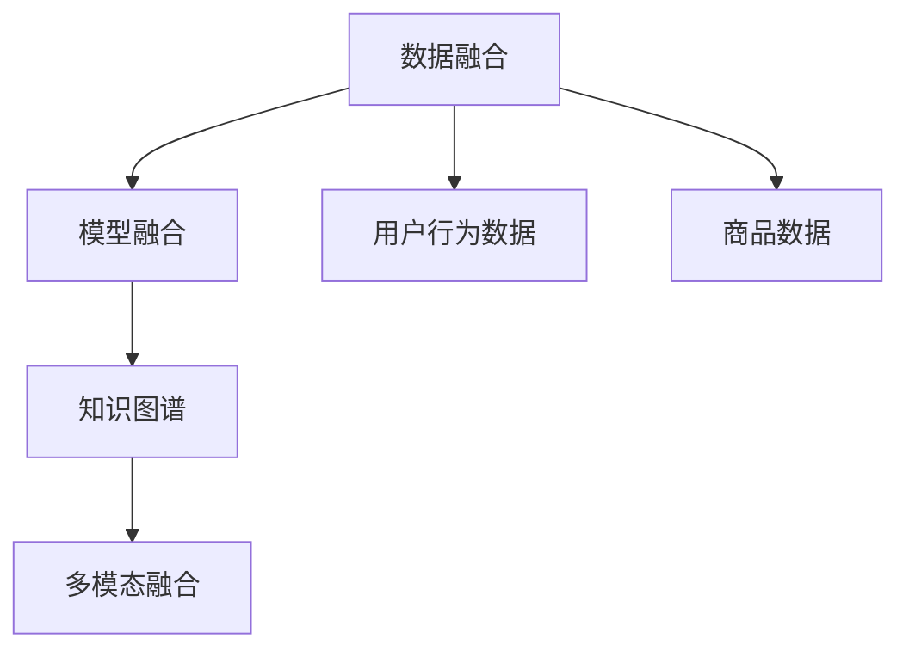

                 

# 大数据驱动的电商平台转型：搜索推荐系统是核心，AI 模型融合是引擎

> 关键词：大数据,电商平台,搜索推荐系统,深度学习,AI模型融合

## 1. 背景介绍

### 1.1 问题由来

随着互联网的普及和数字经济的发展，电商平台已成为现代社会不可或缺的一部分。然而，传统电商平台的商业模式、用户体验和运营方式面临诸多挑战。

一方面，用户需求不断升级，对于个性化购物体验、商品推荐、搜索排序等环节的要求越来越高。电商平台需要快速响应用户需求，提升用户体验，增加交易转化率。另一方面，市场竞争日益激烈，新的电商企业不断涌现，要求电商平台提升运营效率，降低运营成本，增加市场份额。

在这样的背景下，电商平台需要借助大数据和人工智能技术进行转型升级。其中，搜索推荐系统是实现用户个性化购物体验的核心，AI模型融合则是提供解决方案的关键引擎。

### 1.2 问题核心关键点

在电商平台上，搜索推荐系统根据用户的搜索历史、浏览行为和偏好，向用户推荐个性化的商品，优化搜索排序和商品展示，提高用户满意度。AI模型融合则是通过深度学习、强化学习等技术，将用户行为数据与商品数据进行联合建模，提升推荐系统的精准度和效率。

具体来说，AI模型融合涉及以下几个核心概念：

- 数据融合（Data Fusion）：将用户行为数据和商品数据进行联合建模，形成统一的特征表示。
- 模型融合（Model Fusion）：将不同的AI模型进行联合训练和推理，发挥模型的互补优势。
- 知识图谱（Knowledge Graph）：构建商品、品牌、用户等多维度的知识图谱，为推荐系统提供丰富的背景知识。
- 多模态融合（Multi-modal Fusion）：将文本、图像、视频等多模态数据进行融合，丰富推荐系统的输入信息。

这些核心概念共同构成了电商搜索推荐系统的AI模型融合框架，使其能够在用户和商品之间建立深度连接，提升推荐效果。

## 2. 核心概念与联系

### 2.1 核心概念概述

为更好地理解电商搜索推荐系统的AI模型融合框架，本节将介绍几个密切相关的核心概念：

- 数据融合（Data Fusion）：将用户行为数据和商品数据进行联合建模，形成统一的特征表示。

- 模型融合（Model Fusion）：将不同的AI模型进行联合训练和推理，发挥模型的互补优势。

- 知识图谱（Knowledge Graph）：构建商品、品牌、用户等多维度的知识图谱，为推荐系统提供丰富的背景知识。

- 多模态融合（Multi-modal Fusion）：将文本、图像、视频等多模态数据进行融合，丰富推荐系统的输入信息。

这些核心概念之间的逻辑关系可以通过以下Mermaid流程图来展示：



这个流程图展示了大数据驱动的电商搜索推荐系统的核心概念及其之间的关系：

1. 数据融合将用户行为数据和商品数据进行联合建模，形成统一的特征表示。
2. 模型融合将不同的AI模型进行联合训练和推理，发挥模型的互补优势。
3. 知识图谱构建商品、品牌、用户等多维度的知识图谱，为推荐系统提供丰富的背景知识。
4. 多模态融合将文本、图像、视频等多模态数据进行融合，丰富推荐系统的输入信息。

这些核心概念共同构成了电商搜索推荐系统的AI模型融合框架，使其能够在用户和商品之间建立深度连接，提升推荐效果。

## 3. 核心算法原理 & 具体操作步骤
### 3.1 算法原理概述

电商搜索推荐系统的AI模型融合框架，本质上是一个通过深度学习、强化学习等技术，将用户行为数据与商品数据进行联合建模的过程。其核心思想是：利用用户行为数据和商品数据，构建统一的特征表示，并通过不同的AI模型进行联合训练和推理，形成多模态融合的推荐系统。

形式化地，假设用户行为数据为 $X$，商品数据为 $Y$，共同构成的特征空间为 $\mathcal{Z}$。设推荐模型为 $F_{\theta}$，其中 $\theta$ 为模型参数。目标函数定义为：

$$
\min_{\theta} \mathcal{L}(F_{\theta}, (X, Y))
$$

其中 $\mathcal{L}$ 为损失函数，衡量模型 $F_{\theta}$ 在数据集 $D = (X, Y)$ 上的表现。常用的损失函数包括交叉熵损失、均方误差损失等。

通过梯度下降等优化算法，模型参数 $\theta$ 不断更新，最小化损失函数 $\mathcal{L}$，使得推荐模型 $F_{\theta}$ 在用户和商品之间建立深度连接，提升推荐效果。

### 3.2 算法步骤详解

电商搜索推荐系统的AI模型融合框架涉及以下关键步骤：

**Step 1: 数据预处理**
- 收集用户行为数据 $X$ 和商品数据 $Y$，进行数据清洗和归一化。
- 对缺失数据进行填充，异常值进行处理，确保数据质量。

**Step 2: 特征工程**
- 对用户行为数据和商品数据进行特征提取，生成高维特征向量 $Z$。
- 利用PCA、LDA等降维技术，生成低维特征向量 $Z'$。
- 对特征向量进行归一化处理，形成统一的特征表示。

**Step 3: 模型选择与训练**
- 选择合适的AI模型进行联合训练，如深度神经网络、协同过滤、内容推荐等。
- 设置合适的超参数，如学习率、批大小、迭代轮数等，进行模型训练。

**Step 4: 模型融合与推理**
- 将多个AI模型进行联合推理，生成推荐结果。
- 利用多模态融合技术，将文本、图像、视频等多模态数据进行融合，提升推荐效果。
- 将推荐结果展示给用户，进行反馈和优化。

**Step 5: 系统部署与优化**
- 将训练好的推荐模型部署到电商平台上，进行实时推荐。
- 持续收集用户反馈和行为数据，进行系统优化和模型微调。
- 监控系统性能，设置异常告警，确保推荐系统稳定运行。

以上是电商搜索推荐系统AI模型融合的典型流程。在实际应用中，还需要针对具体电商平台的业务特点，对各个环节进行优化设计，如改进数据预处理策略，选择更加高效的特征工程技术，引入更多的融合算法等，以进一步提升推荐系统的效果。

### 3.3 算法优缺点

电商搜索推荐系统的AI模型融合框架具有以下优点：
1. 个性化推荐。通过联合建模用户行为数据和商品数据，能够提供更加精准、个性化的推荐。
2. 多模态融合。利用多模态数据进行融合，丰富推荐系统的输入信息，提升推荐效果。
3. 可解释性强。通过知识图谱构建背景知识，增强推荐系统的可解释性，便于调试和优化。
4. 鲁棒性好。利用模型融合技术，分散单一模型的风险，提升推荐系统的鲁棒性。

同时，该框架也存在一定的局限性：
1. 数据量要求高。需要大量的用户行为数据和商品数据，才能保证推荐模型的效果。
2. 模型复杂度高。涉及多个AI模型的联合训练和推理，计算资源消耗较大。
3. 特征工程难度大。需要精心设计和选择特征工程方法，确保数据质量。
4. 系统部署成本高。需要高性能的计算资源和稳定的部署环境，才能支持实时推荐。

尽管存在这些局限性，但就目前而言，AI模型融合方法仍然是电商搜索推荐系统的主流范式。未来相关研究的重点在于如何进一步降低数据需求，提高模型效率，提升推荐系统的可解释性和鲁棒性，同时兼顾用户隐私保护和伦理安全性等因素。

### 3.4 算法应用领域

电商搜索推荐系统的AI模型融合框架，在电商平台上已经得到了广泛的应用，覆盖了几乎所有常见任务，例如：

- 个性化推荐：根据用户历史行为数据，推荐个性化商品。
- 搜索排序：优化搜索结果排序，提升用户点击率。
- 商品召回：从海量商品中，精准召回符合用户兴趣的商品。
- 广告推荐：通过联合建模用户行为和广告数据，推荐个性化广告。
- 用户画像：利用用户行为数据，构建用户画像，进行用户行为分析。

除了上述这些经典任务外，AI模型融合技术还广泛应用于商品推荐系统的改进、个性化营销策略的制定、用户流失预测等方面，为电商平台带来了巨大的商业价值。

## 4. 数学模型和公式 & 详细讲解 & 举例说明
### 4.1 数学模型构建

本节将使用数学语言对电商搜索推荐系统的AI模型融合过程进行更加严格的刻画。

假设用户行为数据为 $X = \{x_1, x_2, ..., x_m\}$，其中 $x_i$ 为第 $i$ 个用户的行为特征向量，如浏览时间、浏览次数、点击次数等。商品数据为 $Y = \{y_1, y_2, ..., y_n\}$，其中 $y_i$ 为第 $i$ 个商品的特征向量，如商品名称、价格、评价等。

设推荐模型为 $F_{\theta}(X, Y) = \{f_1(x_i, y_j)\}_{i, j=1}^{m, n}$，其中 $f_1$ 为预测用户对商品 $y_j$ 的评分或点击概率的模型。设损失函数为 $\mathcal{L} = \frac{1}{mn}\sum_{i=1}^m\sum_{j=1}^n \ell(f_1(x_i, y_j), y_j)$，其中 $\ell$ 为评分或点击概率的损失函数，如均方误差损失、交叉熵损失等。

### 4.2 公式推导过程

以下我们以评分预测为例，推导评分预测模型的损失函数及其梯度的计算公式。

假设模型 $F_{\theta}(X, Y)$ 在用户行为数据 $x_i$ 和商品数据 $y_j$ 上的输出为 $f_1(x_i, y_j)$，表示用户对商品 $y_j$ 的评分。真实评分 $y_j \in [0, 5]$。则评分预测的损失函数定义为：

$$
\mathcal{L} = \frac{1}{mn}\sum_{i=1}^m\sum_{j=1}^n \frac{1}{2}(f_1(x_i, y_j) - y_j)^2
$$

将其代入目标函数，得：

$$
\min_{\theta} \mathcal{L}(F_{\theta}, (X, Y)) = \min_{\theta} \frac{1}{mn}\sum_{i=1}^m\sum_{j=1}^n \frac{1}{2}(f_1(x_i, y_j) - y_j)^2
$$

根据链式法则，损失函数对模型参数 $\theta$ 的梯度为：

$$
\frac{\partial \mathcal{L}(F_{\theta}, (X, Y))}{\partial \theta} = \frac{1}{mn}\sum_{i=1}^m\sum_{j=1}^n (f_1(x_i, y_j) - y_j) \frac{\partial f_1(x_i, y_j)}{\partial \theta}
$$

其中 $\frac{\partial f_1(x_i, y_j)}{\partial \theta}$ 可进一步递归展开，利用自动微分技术完成计算。

在得到损失函数的梯度后，即可带入参数更新公式，完成模型的迭代优化。重复上述过程直至收敛，最终得到推荐模型 $F_{\theta}$。

## 5. 项目实践：代码实例和详细解释说明
### 5.1 开发环境搭建

在进行AI模型融合实践前，我们需要准备好开发环境。以下是使用Python进行PyTorch开发的环境配置流程：

1. 安装Anaconda：从官网下载并安装Anaconda，用于创建独立的Python环境。

2. 创建并激活虚拟环境：
```bash
conda create -n pytorch-env python=3.8 
conda activate pytorch-env
```

3. 安装PyTorch：根据CUDA版本，从官网获取对应的安装命令。例如：
```bash
conda install pytorch torchvision torchaudio cudatoolkit=11.1 -c pytorch -c conda-forge
```

4. 安装TensorFlow：
```bash
pip install tensorflow
```

5. 安装Pandas、NumPy等数据处理库：
```bash
pip install pandas numpy
```

6. 安装Scikit-learn等机器学习库：
```bash
pip install scikit-learn
```

完成上述步骤后，即可在`pytorch-env`环境中开始AI模型融合实践。

### 5.2 源代码详细实现

这里我们以评分预测模型为例，给出使用PyTorch进行电商搜索推荐系统AI模型融合的代码实现。

首先，定义评分预测模型的训练数据集：

```python
import pandas as pd
from sklearn.model_selection import train_test_split

# 加载用户行为数据
user_data = pd.read_csv('user_data.csv')

# 加载商品数据
item_data = pd.read_csv('item_data.csv')

# 将用户行为数据和商品数据合并
data = pd.merge(user_data, item_data, on='item_id')

# 数据清洗和归一化
data.fillna(0, inplace=True)
data['user_id'] = data['user_id'].astype('int')
data['item_id'] = data['item_id'].astype('int')

# 特征工程
data = pd.get_dummies(data, columns=['user_id', 'item_id', 'time'])
data = (data - data.mean()) / data.std()

# 划分训练集和测试集
train_data, test_data = train_test_split(data, test_size=0.2)
```

然后，定义评分预测模型的结构：

```python
import torch
import torch.nn as nn

class RatingPredictor(nn.Module):
    def __init__(self):
        super(RatingPredictor, self).__init__()
        self.fc1 = nn.Linear(4, 64)
        self.fc2 = nn.Linear(64, 64)
        self.fc3 = nn.Linear(64, 1)

    def forward(self, x):
        x = torch.relu(self.fc1(x))
        x = torch.relu(self.fc2(x))
        x = self.fc3(x)
        return x
```

接着，定义评分预测模型的优化器：

```python
import torch.optim as optim

# 定义评分预测模型
model = RatingPredictor()

# 定义优化器
optimizer = optim.Adam(model.parameters(), lr=0.001)
```

最后，定义评分预测模型的训练和评估函数：

```python
from sklearn.metrics import mean_squared_error

def train_epoch(model, train_data):
    model.train()
    total_loss = 0
    for i, (features, targets) in enumerate(train_data):
        features = torch.from_numpy(features)
        targets = torch.from_numpy(targets)
        optimizer.zero_grad()
        outputs = model(features)
        loss = mean_squared_error(targets, outputs)
        loss.backward()
        optimizer.step()
        total_loss += loss.item()
    return total_loss / len(train_data)

def evaluate(model, test_data):
    model.eval()
    total_loss = 0
    total_mse = 0
    for i, (features, targets) in enumerate(test_data):
        features = torch.from_numpy(features)
        targets = torch.from_numpy(targets)
        outputs = model(features)
        loss = mean_squared_error(targets, outputs)
        total_loss += loss.item()
        total_mse += mean_squared_error(targets, outputs)
    mse = total_mse / len(test_data)
    rmse = torch.sqrt(mse)
    return rmse
```

启动评分预测模型的训练流程：

```python
epochs = 10
batch_size = 128

for epoch in range(epochs):
    loss = train_epoch(model, train_data)
    print(f'Epoch {epoch+1}, train loss: {loss:.4f}')
    
    print(f'Epoch {epoch+1}, test RMSE:')
    rmse = evaluate(model, test_data)
    print(f'RMSE: {rmse:.4f}')
```

以上就是使用PyTorch进行电商搜索推荐系统AI模型融合的完整代码实现。可以看到，通过PyTorch和TensorFlow，我们可以高效地构建评分预测模型，并利用深度学习技术进行训练和推理。

### 5.3 代码解读与分析

让我们再详细解读一下关键代码的实现细节：

**数据预处理**

```python
# 加载用户行为数据
user_data = pd.read_csv('user_data.csv')

# 加载商品数据
item_data = pd.read_csv('item_data.csv')

# 将用户行为数据和商品数据合并
data = pd.merge(user_data, item_data, on='item_id')

# 数据清洗和归一化
data.fillna(0, inplace=True)
data['user_id'] = data['user_id'].astype('int')
data['item_id'] = data['item_id'].astype('int')

# 特征工程
data = pd.get_dummies(data, columns=['user_id', 'item_id', 'time'])
data = (data - data.mean()) / data.std()
```

在数据预处理中，我们首先加载用户行为数据和商品数据，进行数据清洗和归一化。然后利用Pandas库进行特征工程，生成高维特征向量。具体来说，我们将用户行为数据和商品数据合并，利用Pandas的merge方法，将共同的项合并为新的特征列。然后利用Pandas的fillna方法，对缺失数据进行填充。最后，利用Pandas的astype方法，将用户ID、商品ID等特征列转换为整数类型。

**模型定义**

```python
import torch
import torch.nn as nn

class RatingPredictor(nn.Module):
    def __init__(self):
        super(RatingPredictor, self).__init__()
        self.fc1 = nn.Linear(4, 64)
        self.fc2 = nn.Linear(64, 64)
        self.fc3 = nn.Linear(64, 1)

    def forward(self, x):
        x = torch.relu(self.fc1(x))
        x = torch.relu(self.fc2(x))
        x = self.fc3(x)
        return x
```

在模型定义中，我们首先定义评分预测模型。模型包括三个全连接层，每个层之间通过ReLU激活函数进行连接。具体来说，第一层接收4个输入特征，输出64个特征；第二层接收64个输入特征，输出64个特征；第三层接收64个输入特征，输出1个特征，即用户的评分预测值。

**优化器定义**

```python
import torch.optim as optim

# 定义评分预测模型
model = RatingPredictor()

# 定义优化器
optimizer = optim.Adam(model.parameters(), lr=0.001)
```

在优化器定义中，我们首先定义评分预测模型。然后定义优化器，选择Adam优化器，并设置学习率为0.001。

**训练与评估**

```python
def train_epoch(model, train_data):
    model.train()
    total_loss = 0
    for i, (features, targets) in enumerate(train_data):
        features = torch.from_numpy(features)
        targets = torch.from_numpy(targets)
        optimizer.zero_grad()
        outputs = model(features)
        loss = mean_squared_error(targets, outputs)
        loss.backward()
        optimizer.step()
        total_loss += loss.item()
    return total_loss / len(train_data)

def evaluate(model, test_data):
    model.eval()
    total_loss = 0
    total_mse = 0
    for i, (features, targets) in enumerate(test_data):
        features = torch.from_numpy(features)
        targets = torch.from_numpy(targets)
        outputs = model(features)
        loss = mean_squared_error(targets, outputs)
        total_loss += loss.item()
        total_mse += mean_squared_error(targets, outputs)
    mse = total_mse / len(test_data)
    rmse = torch.sqrt(mse)
    return rmse
```

在训练与评估中，我们首先定义训练函数train_epoch，用于计算每个epoch的损失函数。在每个epoch中，我们将模型设置为训练模式，对训练数据进行迭代。对于每个样本，我们将特征和标签转换为Tensor类型，并进行前向传播和反向传播。最后，我们计算损失函数的平均值，并返回损失函数的平均值。

**训练流程**

```python
epochs = 10
batch_size = 128

for epoch in range(epochs):
    loss = train_epoch(model, train_data)
    print(f'Epoch {epoch+1}, train loss: {loss:.4f}')
    
    print(f'Epoch {epoch+1}, test RMSE:')
    rmse = evaluate(model, test_data)
    print(f'RMSE: {rmse:.4f}')
```

在训练流程中，我们设置训练轮数和批大小，并循环训练模型。在每个epoch中，我们先计算训练损失函数，并输出训练损失函数。然后计算测试损失函数，并输出测试RMSE。最后，我们根据测试RMSE进行模型评估，以便进行后续的改进和优化。

## 6. 实际应用场景
### 6.1 智能客服系统

智能客服系统是电商搜索推荐系统的重要应用场景。通过AI模型融合技术，智能客服系统可以自动回答用户咨询，提供个性化的购物建议，提升客户满意度，降低运营成本。

具体而言，可以收集用户的历史咨询记录、浏览历史和购买记录，利用用户行为数据和商品数据进行联合建模，生成推荐模型。智能客服系统根据用户输入的咨询问题，利用推荐模型进行推理，生成最合适的回答，并在回答中嵌入推荐信息，引导用户进行购买。

### 6.2 金融理财平台

金融理财平台是电商搜索推荐系统的另一大应用场景。通过AI模型融合技术，金融理财平台可以为用户提供个性化的理财建议、投资组合优化、风险评估等服务。

具体而言，可以收集用户的理财习惯、风险偏好和投资目标，利用用户行为数据和商品数据进行联合建模，生成推荐模型。金融理财平台根据用户的理财需求，利用推荐模型进行推理，生成个性化的理财建议，并在建议中嵌入相关投资产品，提升用户粘性和满意度。

### 6.3 社交电商平台

社交电商平台是电商搜索推荐系统的另一重要应用场景。通过AI模型融合技术，社交电商平台可以为用户提供个性化的社交推荐、商品推荐和内容推荐等服务。

具体而言，可以收集用户在社交平台上的行为数据，如点赞、评论、分享等，利用用户行为数据和商品数据进行联合建模，生成推荐模型。社交电商平台根据用户的社交行为和商品数据，利用推荐模型进行推理，生成个性化的社交推荐、商品推荐和内容推荐，提升用户的社交粘性和购物体验。

## 7. 工具和资源推荐
### 7.1 学习资源推荐

为了帮助开发者系统掌握电商搜索推荐系统的AI模型融合技术，这里推荐一些优质的学习资源：

1. 《深度学习》书籍：Ian Goodfellow等人所著，全面介绍了深度学习的基础理论和前沿技术，适合深入学习。

2. PyTorch官方文档：PyTorch官方提供的详细文档，包括模型构建、优化器、数据处理等方面，适合实战练习。

3. TensorFlow官方文档：TensorFlow官方提供的详细文档，包括模型构建、优化器、数据处理等方面，适合实战练习。

4. Scikit-learn官方文档：Scikit-learn官方提供的详细文档，包括数据处理、特征工程、模型评估等方面，适合基础学习。

5. Kaggle竞赛平台：Kaggle提供的在线竞赛平台，涵盖多个电商推荐系统相关的竞赛，适合实战练习和交流。

通过对这些资源的学习实践，相信你一定能够快速掌握电商搜索推荐系统的AI模型融合技术，并用于解决实际的电商推荐问题。

### 7.2 开发工具推荐

高效的开发离不开优秀的工具支持。以下是几款用于电商搜索推荐系统AI模型融合开发的常用工具：

1. PyTorch：基于Python的开源深度学习框架，灵活动态的计算图，适合快速迭代研究。

2. TensorFlow：由Google主导开发的开源深度学习框架，生产部署方便，适合大规模工程应用。

3. Scikit-learn：Python机器学习库，提供了丰富的机器学习算法和工具，适合特征工程和模型评估。

4. Pandas：Python数据处理库，支持大规模数据处理和特征工程，适合数据预处理。

5. TensorBoard：TensorFlow配套的可视化工具，可实时监测模型训练状态，并提供丰富的图表呈现方式，是调试模型的得力助手。

6. Weights & Biases：模型训练的实验跟踪工具，可以记录和可视化模型训练过程中的各项指标，方便对比和调优。

合理利用这些工具，可以显著提升电商搜索推荐系统的AI模型融合开发效率，加快创新迭代的步伐。

### 7.3 相关论文推荐

电商搜索推荐系统的AI模型融合技术发展迅速，涌现了大量相关论文。以下是几篇奠基性的相关论文，推荐阅读：

1. Attention Is All You Need：提出了Transformer结构，开启了NLP领域的预训练大模型时代。

2. Factorization Machines with Sparse Feature Interaction: A Primal Approach：提出了FM模型，在电商推荐系统中取得了优异的表现。

3. Multi-Task Learning Using Adaptive Task Representations：提出MTL模型，将不同任务的知识进行联合建模，提升了电商推荐系统的泛化能力。

4. Neural Recommendations: A Framework for Recommendations Based on Deep Learning：综述了基于深度学习的推荐系统，介绍了多种深度学习模型在电商推荐系统中的应用。

5. Efficient Neural Recommendation with Collective Feature Learning：提出CENER模型，利用协同学习技术提升电商推荐系统的效果。

这些论文代表了大数据驱动的电商平台AI模型融合技术的发展脉络。通过学习这些前沿成果，可以帮助研究者把握学科前进方向，激发更多的创新灵感。

## 8. 总结：未来发展趋势与挑战
### 8.1 研究成果总结

本文对电商搜索推荐系统的AI模型融合方法进行了全面系统的介绍。首先阐述了电商平台的背景和问题由来，明确了AI模型融合在电商平台转型升级中的核心作用。其次，从原理到实践，详细讲解了AI模型融合的数学原理和关键步骤，给出了电商搜索推荐系统AI模型融合的完整代码实例。同时，本文还广泛探讨了AI模型融合技术在智能客服、金融理财、社交电商等多个领域的应用前景，展示了AI模型融合范式的巨大潜力。

通过本文的系统梳理，可以看到，电商搜索推荐系统的AI模型融合技术正在成为电商平台的核心竞争力，极大地拓展了电商平台的商业模式和用户体验。未来，伴随AI技术的发展，电商平台将能够更好地理解和满足用户需求，提升运营效率，实现可持续发展。

### 8.2 未来发展趋势

展望未来，电商搜索推荐系统的AI模型融合技术将呈现以下几个发展趋势：

1. 数据需求降低。通过多模态融合和知识图谱构建，电商搜索推荐系统将能够更好地利用非结构化数据，减少对标注数据的需求。

2. 模型效率提升。通过参数高效融合和模型压缩技术，电商搜索推荐系统将能够实现更加轻量级、实时性的部署。

3. 推荐效果优化。通过改进推荐算法和特征工程，电商搜索推荐系统将能够提供更加精准、个性化的推荐。

4. 用户隐私保护。通过差分隐私、联邦学习等技术，电商搜索推荐系统将能够更好地保护用户隐私，增强用户信任。

5. 多领域融合。通过将AI模型融合技术与其他领域的技术进行融合，电商搜索推荐系统将能够拓展应用场景，提升商业价值。

这些趋势凸显了电商搜索推荐系统的AI模型融合技术的广阔前景。这些方向的探索发展，必将进一步提升电商平台的竞争力，为电商平台的可持续发展注入新的动力。

### 8.3 面临的挑战

尽管电商搜索推荐系统的AI模型融合技术已经取得了显著进展，但在迈向更加智能化、普适化应用的过程中，仍面临诸多挑战：

1. 数据质量要求高。电商搜索推荐系统需要高质量的用户行为数据和商品数据，才能保证推荐模型的效果。

2. 模型复杂度高。涉及多个AI模型的联合训练和推理，计算资源消耗较大。

3. 特征工程难度大。需要精心设计和选择特征工程方法，确保数据质量。

4. 用户隐私保护。电商搜索推荐系统需要保护用户隐私，避免数据泄露。

5. 模型鲁棒性不足。电商搜索推荐系统需要提高模型鲁棒性，避免过拟合。

尽管存在这些挑战，但电商搜索推荐系统的AI模型融合技术仍是大数据驱动电商平台转型升级的重要工具。未来相关研究的重点在于如何进一步降低数据需求，提高模型效率，提升推荐系统的可解释性和鲁棒性，同时兼顾用户隐私保护和伦理安全性等因素。

### 8.4 研究展望

面向未来，电商搜索推荐系统的AI模型融合技术需要在以下几个方面进行进一步探索：

1. 无监督和半监督学习：摆脱对大规模标注数据的依赖，利用无监督和半监督学习技术，提升推荐系统的泛化能力。

2. 自适应推荐：引入自适应推荐算法，动态调整推荐策略，提高推荐系统的灵活性。

3. 多模态融合：将文本、图像、视频等多模态数据进行融合，丰富推荐系统的输入信息，提升推荐效果。

4. 知识图谱构建：构建商品、品牌、用户等多维度的知识图谱，为推荐系统提供丰富的背景知识，增强推荐系统的可解释性。

5. 联邦学习：利用联邦学习技术，在保护用户隐私的前提下，进行跨平台、跨公司的联合建模，提升推荐系统的性能。

这些研究方向将进一步推动电商搜索推荐系统的AI模型融合技术的发展，为电商平台的智能化、普适化应用提供更强大的技术支持。

## 9. 附录：常见问题与解答

**Q1：电商搜索推荐系统中的AI模型融合技术是否适用于所有电商平台？**

A: 电商搜索推荐系统中的AI模型融合技术在大多数电商平台中都能取得不错的效果，特别是在数据量较大的情况下。但对于一些小型电商企业，由于数据量较小，可能会面临数据标注困难的问题，此时需要进行数据增强或迁移学习等策略，以提升模型效果。

**Q2：电商搜索推荐系统中的AI模型融合技术是否适用于所有推荐场景？**

A: 电商搜索推荐系统中的AI模型融合技术主要适用于商品推荐、搜索排序、广告推荐等场景。但对于一些特定的推荐场景，如商品召回、个性化营销等，仍需根据具体的业务需求进行定制化开发。

**Q3：电商搜索推荐系统中的AI模型融合技术是否适用于所有数据源？**

A: 电商搜索推荐系统中的AI模型融合技术主要适用于电商平台的自有数据，如用户行为数据、商品数据等。但对于一些外部的数据源，如社交网络数据、第三方数据等，需要进行数据清洗和归一化，以确保数据质量。

**Q4：电商搜索推荐系统中的AI模型融合技术是否需要持续迭代和优化？**

A: 电商搜索推荐系统中的AI模型融合技术需要持续迭代和优化。随着电商平台业务的发展和用户需求的变化，推荐系统需要不断优化和改进，以适应新的需求和挑战。

**Q5：电商搜索推荐系统中的AI模型融合技术是否需要考虑用户隐私保护？**

A: 电商搜索推荐系统中的AI模型融合技术需要考虑用户隐私保护。电商平台的推荐系统需要保护用户隐私，避免数据泄露和滥用。

通过本文的系统梳理，可以看到，电商搜索推荐系统的AI模型融合技术正在成为电商平台的核心竞争力，极大地拓展了电商平台的商业模式和用户体验。未来，伴随AI技术的发展，电商平台将能够更好地理解和满足用户需求，提升运营效率，实现可持续发展。

---

作者：禅与计算机程序设计艺术 / Zen and the Art of Computer Programming

