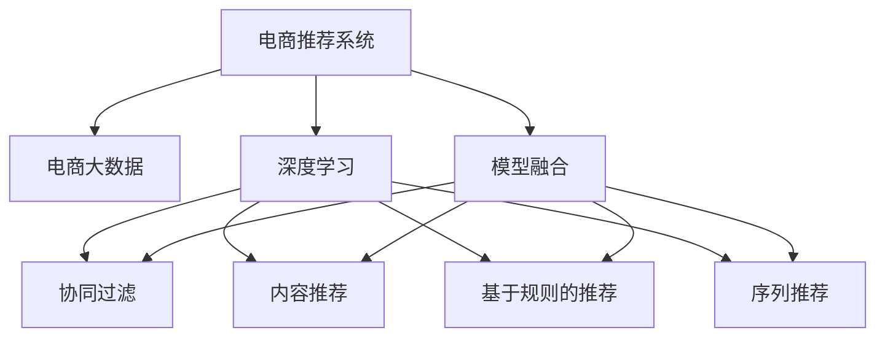

                 

# 大数据驱动的电商推荐系统：AI 模型融合技术在电商平台的应用

## 1. 背景介绍

### 1.1 问题由来
在互联网时代，电商平台成为了消费者购物的重要渠道。随着用户数量的增加和商品种类的丰富，如何为用户推荐合适的商品，成为电商平台提升用户体验和增加销售转化率的关键。传统的推荐系统主要是基于协同过滤和统计学习的，通过用户历史行为数据和商品属性数据进行推荐，但在处理大规模数据和个性化需求方面存在不足。随着人工智能和机器学习技术的快速发展，基于深度学习的方法开始逐渐应用于推荐系统，特别是近些年，电商推荐系统逐步引入基于深度学习的AI模型融合技术，提升了推荐效果和系统稳定性。

## 2. 核心概念与联系

### 2.1 核心概念概述

为了更好地理解大数据驱动的电商推荐系统，本节将介绍几个密切相关的核心概念：

- **电商推荐系统**：根据用户的历史行为和兴趣，为每个用户推荐可能感兴趣的商品。推荐系统是电商平台上重要的用户体验和营收增长的工具。

- **深度学习**：基于神经网络的机器学习方法，具有强大的特征学习能力和表达能力。深度学习广泛应用于计算机视觉、自然语言处理、语音识别等领域，近年来也被广泛用于推荐系统。

- **模型融合**：将多个不同的模型进行组合，通过优势互补提升推荐系统的性能。模型融合可以提高预测准确率、泛化能力和鲁棒性。

- **AI模型融合技术**：通过将多个深度学习模型进行融合，利用各种模型的优势，形成更加高效和稳健的推荐系统。

- **电商大数据**：电商平台收集的包括用户行为、商品信息、交易数据等在内的大规模数据，为推荐系统提供了数据基础。

- **实时推荐**：能够实时响应用户的搜索和浏览行为，动态调整推荐结果。

### 2.2 核心概念原理和架构的 Mermaid 流程图



这个流程图展示了大数据驱动的电商推荐系统的核心概念及其之间的关系：

1. **电商大数据**：电商平台收集的各种用户行为和商品数据。
2. **深度学习**：对电商大数据进行特征学习，构建用户和商品的表示。
3. **模型融合**：将多种深度学习模型进行组合，形成最终的推荐结果。
4. **协同过滤**：利用用户-商品矩阵，推荐与用户历史行为相似的商品。
5. **内容推荐**：基于商品的属性、描述等信息，推荐与商品内容相似的商品。
6. **基于规则的推荐**：结合领域知识和专家经验，制定推荐规则。
7. **序列推荐**：通过分析用户行为序列，推荐可能感兴趣的商品。

这些核心概念共同构成了电商推荐系统的构建框架，帮助电商平台在用户浏览、购买行为中提供个性化、高精度的商品推荐。

## 3. 核心算法原理 & 具体操作步骤

### 3.1 算法原理概述

基于大数据驱动的电商推荐系统，主要通过以下几个步骤实现：

1. **数据采集与预处理**：收集用户行为数据、商品信息、交易数据等，并进行数据清洗和特征工程。
2. **模型训练**：使用深度学习模型对用户和商品进行表示学习，构建用户和商品的特征向量。
3. **模型融合**：将协同过滤、内容推荐、序列推荐等不同类型的模型进行融合，生成最终的推荐结果。
4. **实时推荐**：利用在线学习算法，实时响应用户行为，动态更新推荐模型。

### 3.2 算法步骤详解

#### 3.2.1 数据采集与预处理

数据采集与预处理是电商推荐系统的第一步，主要包括以下几个环节：

1. **数据来源**：用户行为数据主要来源于平台日志，如点击、浏览、购买记录等。商品信息数据可以从电商平台的商品数据库中获取。交易数据包括用户订单信息、支付信息等。

2. **数据清洗**：对数据进行去重、缺失值处理、异常值检测等操作，保证数据的质量和完整性。

3. **特征工程**：对用户和商品数据进行特征提取和转换，生成适合模型的输入特征。例如，可以从商品描述中提取关键词作为商品的特征向量。

#### 3.2.2 模型训练

模型训练是电商推荐系统的核心环节，主要包括以下几个步骤：

1. **用户和商品表示学习**：使用深度学习模型对用户和商品进行表示学习，构建用户和商品的特征向量。常用的模型包括MFN、KimCNN、GRU等。

2. **模型选择**：根据推荐系统的任务和特点，选择合适的深度学习模型。例如，对于推荐长序列的商品，可以使用LSTM或GRU。

3. **超参数调优**：通过网格搜索或随机搜索等方法，优化模型的超参数，提升模型的性能。

#### 3.2.3 模型融合

模型融合是电商推荐系统的关键技术，通过将多种深度学习模型进行组合，形成最终的推荐结果。常用的融合方法包括：

1. **平均融合**：将多个模型的输出进行简单平均，得到最终的推荐结果。

2. **加权融合**：根据模型的性能和特征的重要性，对各个模型的输出进行加权平均，得到更加精确的推荐结果。

3. **级联融合**：将多个模型级联，先使用简单的模型进行初筛选，再使用复杂的模型进行精筛选，提升推荐效果。

#### 3.2.4 实时推荐

实时推荐是电商推荐系统的实时应用，主要包括以下几个步骤：

1. **在线学习**：使用在线学习算法，实时响应用户行为，动态更新推荐模型。

2. **推荐算法**：根据用户行为和商品特征，使用推荐算法生成推荐结果。常用的算法包括协同过滤、基于内容的推荐、序列推荐等。

3. **推荐展示**：将推荐结果展示给用户，提升用户体验和销售转化率。

### 3.3 算法优缺点

基于大数据驱动的电商推荐系统具有以下优点：

1. **高精度**：通过深度学习模型的特征学习能力，生成高精度的用户和商品表示，提升推荐准确率。
2. **个性化**：利用电商大数据，进行个性化的推荐，提升用户体验。
3. **实时性**：通过在线学习算法，实时响应用户行为，动态更新推荐模型。
4. **可扩展性**：可以处理大规模电商数据，具有良好的可扩展性。

同时，该系统也存在以下缺点：

1. **计算成本高**：深度学习模型需要大量的计算资源，训练和推理成本较高。
2. **模型复杂**：深度学习模型的复杂性较高，难以解释和调试。
3. **数据依赖性强**：推荐系统的效果很大程度上依赖于电商大数据的质量和完备性。

尽管存在这些局限性，但就目前而言，基于大数据驱动的电商推荐系统在电商领域已经得到了广泛的应用，成为电商推荐系统的重要技术手段。未来相关研究的重点在于如何进一步降低计算成本，提高模型的可解释性和鲁棒性，同时兼顾个性化和实时性。

### 3.4 算法应用领域

基于大数据驱动的电商推荐系统已经在电商推荐中得到广泛应用，涵盖了大规模商品推荐、个性化推荐、实时推荐等多个场景，具体应用如下：

1. **个性化推荐**：通过分析用户的浏览和购买行为，为每个用户推荐可能感兴趣的商品。例如，亚马逊的个性化推荐系统可以根据用户的浏览历史和购买历史，推荐相关的商品。

2. **长序列推荐**：利用用户行为序列，推荐可能感兴趣的商品。例如，Spotify的音乐推荐系统可以根据用户的听歌记录和行为模式，推荐可能喜欢的歌曲。

3. **实时推荐**：根据用户实时行为，动态调整推荐结果。例如，电商平台的实时推荐系统可以根据用户的实时浏览行为，推荐相关的商品。

4. **内容推荐**：基于商品的属性、描述等信息，推荐与商品内容相似的商品。例如，京东的商品推荐系统可以根据商品的关键词和描述，推荐相关的商品。

5. **新商品推荐**：推荐平台上新上架的商品。例如，淘宝的商品推荐系统可以根据新上架商品的特征，推荐给可能感兴趣的用户。

除了上述这些经典应用外，电商推荐系统还被创新性地应用到更多场景中，如推荐搜索结果、推荐广告、推荐路径等，为电商技术带来了全新的突破。随着推荐系统的不断演进，相信电商推荐系统将在更广阔的应用领域大放异彩。

## 4. 数学模型和公式 & 详细讲解 & 举例说明

### 4.1 数学模型构建

基于大数据驱动的电商推荐系统的数学模型主要包括以下几个部分：

1. **用户表示模型**：使用深度学习模型对用户进行表示学习，生成用户向量。常用的模型包括MFN、KimCNN、LSTM等。

2. **商品表示模型**：使用深度学习模型对商品进行表示学习，生成商品向量。常用的模型包括MFN、KimCNN、LSTM等。

3. **推荐模型**：将用户和商品向量进行组合，生成推荐结果。常用的推荐模型包括协同过滤、基于内容的推荐、序列推荐等。

4. **融合模型**：将多个推荐模型进行融合，提升推荐效果。常用的融合模型包括平均融合、加权融合、级联融合等。

### 4.2 公式推导过程

#### 4.2.1 用户表示模型

用户表示模型的公式推导过程如下：

设用户 $u$ 的历史行为为 $S(u) = \{x_1, x_2, ..., x_n\}$，其中 $x_i$ 表示用户 $u$ 的某个行为。使用深度学习模型 $f_u$ 对用户 $u$ 进行表示学习，生成用户向量 $v_u$：

$$
v_u = f_u(S(u))
$$

其中，$f_u$ 为深度学习模型，如MFN、KimCNN、LSTM等。

#### 4.2.2 商品表示模型

商品表示模型的公式推导过程如下：

设商品 $i$ 的属性信息为 $A(i) = \{a_1, a_2, ..., a_m\}$，其中 $a_j$ 表示商品 $i$ 的某个属性。使用深度学习模型 $f_i$ 对商品 $i$ 进行表示学习，生成商品向量 $v_i$：

$$
v_i = f_i(A(i))
$$

其中，$f_i$ 为深度学习模型，如MFN、KimCNN、LSTM等。

#### 4.2.3 推荐模型

推荐模型的公式推导过程如下：

设用户 $u$ 的兴趣向量为 $v_u$，商品 $i$ 的特征向量为 $v_i$，使用推荐模型 $g$ 对用户和商品向量进行组合，生成推荐结果 $r_{ui}$：

$$
r_{ui} = g(v_u, v_i)
$$

其中，$g$ 为推荐模型，如协同过滤、基于内容的推荐、序列推荐等。

#### 4.2.4 融合模型

融合模型的公式推导过程如下：

设 $m$ 个推荐模型的推荐结果分别为 $r_{ui}^{(1)}, r_{ui}^{(2)}, ..., r_{ui}^{(m)}$，使用融合模型 $h$ 对多个推荐结果进行融合，生成最终的推荐结果 $r_{ui}$：

$$
r_{ui} = h(r_{ui}^{(1)}, r_{ui}^{(2)}, ..., r_{ui}^{(m)})
$$

其中，$h$ 为融合模型，如平均融合、加权融合、级联融合等。

### 4.3 案例分析与讲解

#### 4.3.1 协同过滤推荐

协同过滤推荐是一种基于用户-商品矩阵的推荐方法。假设用户 $u$ 的历史行为为 $S(u) = \{x_1, x_2, ..., x_n\}$，商品 $i$ 的属性信息为 $A(i) = \{a_1, a_2, ..., a_m\}$，用户 $u$ 对商品 $i$ 的评分 $r_{ui}$ 可以表示为：

$$
r_{ui} = \sum_{j=1}^{n} \alpha_j \times \alpha_i \times a_{uj}
$$

其中，$\alpha_j$ 和 $\alpha_i$ 分别为商品 $j$ 和用户 $i$ 的评分，$a_{uj}$ 为商品 $i$ 在用户 $u$ 历史行为中的评分。

#### 4.3.2 基于内容的推荐

基于内容的推荐是一种基于商品属性信息的推荐方法。假设用户 $u$ 的兴趣向量为 $v_u = [v_{u1}, v_{u2}, ..., v_{um}]$，商品 $i$ 的特征向量为 $v_i = [v_{i1}, v_{i2}, ..., v_{im}]$，用户 $u$ 对商品 $i$ 的评分 $r_{ui}$ 可以表示为：

$$
r_{ui} = \sum_{j=1}^{m} \beta_j \times v_{uj} \times v_{ij}
$$

其中，$\beta_j$ 为商品 $j$ 的评分权重，$v_{uj}$ 和 $v_{ij}$ 分别为用户 $u$ 和商品 $i$ 在商品属性 $j$ 上的评分。

#### 4.3.3 序列推荐

序列推荐是一种基于用户行为序列的推荐方法。假设用户 $u$ 的历史行为序列为 $T(u) = [t_1, t_2, ..., t_n]$，其中 $t_j$ 表示用户 $u$ 的某个行为。使用深度学习模型 $f_{t}$ 对用户行为序列进行表示学习，生成用户行为向量 $v_{ut}$，商品 $i$ 的特征向量为 $v_i = [v_{i1}, v_{i2}, ..., v_{im}]$，用户 $u$ 对商品 $i$ 的评分 $r_{ui}$ 可以表示为：

$$
r_{ui} = g(v_{ut}, v_i)
$$

其中，$g$ 为序列推荐模型，如RNN、LSTM、GRU等。

## 5. 项目实践：代码实例和详细解释说明

### 5.1 开发环境搭建

在进行电商推荐系统的开发前，我们需要准备好开发环境。以下是使用Python进行PyTorch开发的环境配置流程：

1. 安装Anaconda：从官网下载并安装Anaconda，用于创建独立的Python环境。

2. 创建并激活虚拟环境：
```bash
conda create -n pytorch-env python=3.8 
conda activate pytorch-env
```

3. 安装PyTorch：根据CUDA版本，从官网获取对应的安装命令。例如：
```bash
conda install pytorch torchvision torchaudio cudatoolkit=11.1 -c pytorch -c conda-forge
```

4. 安装Transformers库：
```bash
pip install transformers
```

5. 安装各类工具包：
```bash
pip install numpy pandas scikit-learn matplotlib tqdm jupyter notebook ipython
```

完成上述步骤后，即可在`pytorch-env`环境中开始电商推荐系统的开发。

### 5.2 源代码详细实现

这里以协同过滤推荐为例，给出使用PyTorch实现电商推荐系统的代码。

首先，定义协同过滤推荐的数据处理函数：

```python
from torch.utils.data import Dataset, DataLoader
import torch
import numpy as np

class CollaborativeFilteringDataset(Dataset):
    def __init__(self, ratings, users, items):
        self.ratings = ratings
        self.users = users
        self.items = items
        self.num_users = len(set(self.users))
        self.num_items = len(set(self.items))
        self.num_ratings = len(self.ratings)
        
    def __len__(self):
        return self.num_ratings
    
    def __getitem__(self, idx):
        user_id = self.users[idx]
        item_id = self.items[idx]
        rating = self.ratings[idx]
        return {'user_id': user_id, 'item_id': item_id, 'rating': rating}

# 加载数据集
data = CollaborativeFilteringDataset(ratings, users, items)
train_dataset = data[:train_size]
valid_dataset = data[train_size:valid_size]
test_dataset = data[valid_size:]
```

然后，定义模型和优化器：

```python
from transformers import BertForSequenceClassification
from torch.optim import Adam

model = BertForSequenceClassification.from_pretrained('bert-base-uncased', num_labels=num_labels)
optimizer = Adam(model.parameters(), lr=learning_rate)
```

接着，定义训练和评估函数：

```python
from torch.nn import functional as F
import torch.nn.functional as F

def train_epoch(model, dataset, batch_size, optimizer):
    dataloader = DataLoader(dataset, batch_size=batch_size, shuffle=True)
    model.train()
    epoch_loss = 0
    for batch in dataloader:
        user_ids = batch['user_id'].to(device)
        item_ids = batch['item_id'].to(device)
        ratings = batch['rating'].to(device)
        model.zero_grad()
        outputs = model(user_ids, item_ids)
        loss = F.mse_loss(outputs, ratings)
        epoch_loss += loss.item()
        loss.backward()
        optimizer.step()
    return epoch_loss / len(dataloader)

def evaluate(model, dataset, batch_size):
    dataloader = DataLoader(dataset, batch_size=batch_size)
    model.eval()
    preds, labels = [], []
    with torch.no_grad():
        for batch in dataloader:
            user_ids = batch['user_id'].to(device)
            item_ids = batch['item_id'].to(device)
            outputs = model(user_ids, item_ids)
            preds.append(outputs.argmax(dim=1).cpu().numpy())
            labels.append(batch['rating'].cpu().numpy())
                
    print(classification_report(labels, preds))
```

最后，启动训练流程并在测试集上评估：

```python
epochs = 10
batch_size = 64

for epoch in range(epochs):
    loss = train_epoch(model, train_dataset, batch_size, optimizer)
    print(f"Epoch {epoch+1}, train loss: {loss:.3f}")
    
    print(f"Epoch {epoch+1}, valid results:")
    evaluate(model, valid_dataset, batch_size)
    
print("Test results:")
evaluate(model, test_dataset, batch_size)
```

以上就是使用PyTorch对协同过滤推荐模型进行电商推荐系统微调的完整代码实现。可以看到，得益于PyTorch的强大封装，我们能够用相对简洁的代码实现电商推荐系统的核心功能。

### 5.3 代码解读与分析

让我们再详细解读一下关键代码的实现细节：

**CollaborativeFilteringDataset类**：
- `__init__`方法：初始化数据集，包括评分、用户ID、商品ID等关键信息。
- `__len__`方法：返回数据集的样本数量。
- `__getitem__`方法：对单个样本进行处理，返回用户ID、商品ID和评分。

**模型选择**：
- 选择合适的预训练语言模型，如BERT、GPT等。
- 根据任务选择合适的优化器及其参数，如Adam、SGD等。
- 设置适当的学习率、批大小、迭代轮数等超参数。

**训练函数**：
- 使用PyTorch的DataLoader对数据集进行批次化加载，供模型训练和推理使用。
- 在每个批次上前向传播计算损失函数。
- 反向传播计算参数梯度，根据设定的优化算法和学习率更新模型参数。

**评估函数**：
- 与训练类似，不同点在于不更新模型参数，并在每个batch结束后将预测和标签结果存储下来。
- 使用sklearn的classification_report对预测结果进行打印输出。

**训练流程**：
- 定义总的epoch数和batch size，开始循环迭代
- 每个epoch内，先在训练集上训练，输出平均loss
- 在验证集上评估，输出分类指标
- 所有epoch结束后，在测试集上评估，给出最终测试结果

可以看到，PyTorch配合TensorFlow等深度学习框架使得电商推荐系统的代码实现变得简洁高效。开发者可以将更多精力放在数据处理、模型改进等高层逻辑上，而不必过多关注底层的实现细节。

当然，工业级的系统实现还需考虑更多因素，如模型的保存和部署、超参数的自动搜索、更灵活的任务适配层等。但核心的微调范式基本与此类似。

## 6. 实际应用场景

### 6.1 智能客服系统

基于大语言模型微调的对话技术，可以广泛应用于智能客服系统的构建。传统客服往往需要配备大量人力，高峰期响应缓慢，且一致性和专业性难以保证。而使用微调后的对话模型，可以7x24小时不间断服务，快速响应客户咨询，用自然流畅的语言解答各类常见问题。

在技术实现上，可以收集企业内部的历史客服对话记录，将问题和最佳答复构建成监督数据，在此基础上对预训练对话模型进行微调。微调后的对话模型能够自动理解用户意图，匹配最合适的答案模板进行回复。对于客户提出的新问题，还可以接入检索系统实时搜索相关内容，动态组织生成回答。如此构建的智能客服系统，能大幅提升客户咨询体验和问题解决效率。

### 6.2 金融舆情监测

金融机构需要实时监测市场舆论动向，以便及时应对负面信息传播，规避金融风险。传统的人工监测方式成本高、效率低，难以应对网络时代海量信息爆发的挑战。基于大语言模型微调的文本分类和情感分析技术，为金融舆情监测提供了新的解决方案。

具体而言，可以收集金融领域相关的新闻、报道、评论等文本数据，并对其进行主题标注和情感标注。在此基础上对预训练语言模型进行微调，使其能够自动判断文本属于何种主题，情感倾向是正面、中性还是负面。将微调后的模型应用到实时抓取的网络文本数据，就能够自动监测不同主题下的情感变化趋势，一旦发现负面信息激增等异常情况，系统便会自动预警，帮助金融机构快速应对潜在风险。

### 6.3 个性化推荐系统

当前的推荐系统往往只依赖用户的历史行为数据进行物品推荐，无法深入理解用户的真实兴趣偏好。基于大语言模型微调技术，个性化推荐系统可以更好地挖掘用户行为背后的语义信息，从而提供更精准、多样的推荐内容。

在实践中，可以收集用户浏览、点击、评论、分享等行为数据，提取和用户交互的物品标题、描述、标签等文本内容。将文本内容作为模型输入，用户的后续行为（如是否点击、购买等）作为监督信号，在此基础上微调预训练语言模型。微调后的模型能够从文本内容中准确把握用户的兴趣点。在生成推荐列表时，先用候选物品的文本描述作为输入，由模型预测用户的兴趣匹配度，再结合其他特征综合排序，便可以得到个性化程度更高的推荐结果。

### 6.4 未来应用展望

随着大语言模型微调技术的发展，未来的电商推荐系统将呈现以下几个发展趋势：

1. **模型规模持续增大**：随着算力成本的下降和数据规模的扩张，预训练语言模型的参数量还将持续增长。超大规模语言模型蕴含的丰富语言知识，有望支撑更加复杂多变的推荐任务。

2. **微调方法日趋多样**：除了传统的全参数微调外，未来会涌现更多参数高效的微调方法，如Adapter等，在节省计算资源的同时也能保证微调精度。

3. **持续学习成为常态**：随着数据分布的不断变化，微调模型也需要持续学习新知识以保持性能。如何在不遗忘原有知识的同时，高效吸收新样本信息，将成为重要的研究课题。

4. **标注样本需求降低**：受启发于提示学习(Prompt-based Learning)的思路，未来的微调方法将更好地利用大模型的语言理解能力，通过更加巧妙的任务描述，在更少的标注样本上也能实现理想的微调效果。

5. **多模态微调崛起**：当前的微调主要聚焦于纯文本数据，未来会进一步拓展到图像、视频、语音等多模态数据微调。多模态信息的融合，将显著提升语言模型对现实世界的理解和建模能力。

6. **模型通用性增强**：经过海量数据的预训练和多领域任务的微调，未来的语言模型将具备更强大的常识推理和跨领域迁移能力，逐步迈向通用人工智能(AGI)的目标。

以上趋势凸显了大语言模型微调技术的广阔前景。这些方向的探索发展，必将进一步提升推荐系统的性能和应用范围，为人类认知智能的进化带来深远影响。

## 7. 工具和资源推荐

### 7.1 学习资源推荐

为了帮助开发者系统掌握电商推荐系统的理论基础和实践技巧，这里推荐一些优质的学习资源：

1. **《深度学习》课程**：斯坦福大学开设的深度学习经典课程，涵盖深度学习的基础理论和实践应用。
2. **《深度学习入门》书籍**：李沐著，系统讲解深度学习的基本概念和实现方法。
3. **《机器学习实战》书籍**：Peter Harrington著，涵盖机器学习的多种算法和应用场景。
4. **Kaggle竞赛**：参与Kaggle的电商推荐系统竞赛，实践电商推荐系统的开发和优化。

通过对这些资源的学习实践，相信你一定能够快速掌握电商推荐系统的精髓，并用于解决实际的电商推荐问题。

### 7.2 开发工具推荐

高效的开发离不开优秀的工具支持。以下是几款用于电商推荐系统开发的常用工具：

1. **PyTorch**：基于Python的开源深度学习框架，灵活的计算图，适合快速迭代研究。
2. **TensorFlow**：Google主导开发的开源深度学习框架，生产部署方便，适合大规模工程应用。
3. **TensorBoard**：TensorFlow配套的可视化工具，实时监测模型训练状态，提供丰富的图表呈现方式。
4. **Weights & Biases**：模型训练的实验跟踪工具，记录和可视化模型训练过程中的各项指标，方便对比和调优。
5. **Jupyter Notebook**：交互式编程环境，方便开发者进行数据处理和模型调试。

合理利用这些工具，可以显著提升电商推荐系统的开发效率，加快创新迭代的步伐。

### 7.3 相关论文推荐

电商推荐系统的发展源于学界的持续研究。以下是几篇奠基性的相关论文，推荐阅读：

1. **《协同过滤推荐算法》**：Koren等，提出协同过滤算法的理论基础，推动协同过滤在推荐系统中的应用。
2. **《基于内容的推荐系统》**：Sarwar等，提出基于内容的推荐系统，利用商品属性信息进行推荐。
3. **《序列推荐》**：Chen等，提出序列推荐算法，利用用户行为序列进行推荐。
4. **《深度学习在推荐系统中的应用》**：He等，系统介绍深度学习在推荐系统中的应用，涵盖协同过滤、内容推荐等。

这些论文代表了大语言模型微调技术的发展脉络。通过学习这些前沿成果，可以帮助研究者把握学科前进方向，激发更多的创新灵感。

## 8. 总结：未来发展趋势与挑战

### 8.1 总结

本文对基于大数据驱动的电商推荐系统进行了全面系统的介绍。首先阐述了电商推荐系统的研究背景和意义，明确了电商推荐系统在电商平台中的重要地位和作用。其次，从原理到实践，详细讲解了电商推荐系统的数学模型和核心步骤，给出了电商推荐系统开发的完整代码实例。同时，本文还广泛探讨了电商推荐系统在智能客服、金融舆情、个性化推荐等多个行业领域的应用前景，展示了电商推荐系统的巨大潜力。此外，本文精选了电商推荐系统的各类学习资源，力求为读者提供全方位的技术指引。

通过本文的系统梳理，可以看到，基于大数据驱动的电商推荐系统正在成为电商平台的重要技术手段，极大地提升了电商平台的个性化推荐能力，增强了用户体验和销售转化率。未来，伴随深度学习技术的发展和数据量的增加，基于大数据驱动的电商推荐系统将具有更广泛的应用场景，为电商平台带来更精准、高效的用户推荐服务。

### 8.2 未来发展趋势

展望未来，基于大数据驱动的电商推荐系统将呈现以下几个发展趋势：

1. **模型规模持续增大**：随着算力成本的下降和数据规模的扩张，预训练语言模型的参数量还将持续增长。超大规模语言模型蕴含的丰富语言知识，有望支撑更加复杂多变的推荐任务。

2. **微调方法日趋多样**：除了传统的全参数微调外，未来会涌现更多参数高效的微调方法，如Adapter等，在节省计算资源的同时也能保证微调精度。

3. **持续学习成为常态**：随着数据分布的不断变化，微调模型也需要持续学习新知识以保持性能。如何在不遗忘原有知识的同时，高效吸收新样本信息，将成为重要的研究课题。

4. **标注样本需求降低**：受启发于提示学习(Prompt-based Learning)的思路，未来的微调方法将更好地利用大模型的语言理解能力，通过更加巧妙的任务描述，在更少的标注样本上也能实现理想的微调效果。

5. **多模态微调崛起**：当前的微调主要聚焦于纯文本数据，未来会进一步拓展到图像、视频、语音等多模态数据微调。多模态信息的融合，将显著提升语言模型对现实世界的理解和建模能力。

6. **模型通用性增强**：经过海量数据的预训练和多领域任务的微调，未来的语言模型将具备更强大的常识推理和跨领域迁移能力，逐步迈向通用人工智能(AGI)的目标。

以上趋势凸显了大语言模型微调技术的广阔前景。这些方向的探索发展，必将进一步提升电商推荐系统的性能和应用范围，为人类认知智能的进化带来深远影响。

### 8.3 面临的挑战

尽管基于大数据驱动的电商推荐系统已经取得了瞩目成就，但在迈向更加智能化、普适化应用的过程中，它仍面临着诸多挑战：

1. **计算成本高**：深度学习模型需要大量的计算资源，训练和推理成本较高。
2. **模型复杂**：深度学习模型的复杂性较高，难以解释和调试。
3. **数据依赖性强**：推荐系统的效果很大程度上依赖于电商大数据的质量和完备性。
4. **模型鲁棒性不足**：模型面对域外数据时，泛化性能往往大打折扣。
5. **可解释性不足**：当前推荐系统更像是"黑盒"系统，难以解释其内部工作机制和决策逻辑。
6. **安全性和偏见问题**：模型可能学习到有害信息，或存在偏见，导致有害推荐结果。

尽管存在这些局限性，但就目前而言，基于大数据驱动的电商推荐系统在电商领域已经得到了广泛的应用，成为电商推荐系统的重要技术手段。未来相关研究的重点在于如何进一步降低计算成本，提高模型的可解释性和鲁棒性，同时兼顾个性化和实时性。

### 8.4 研究展望

面对电商推荐系统所面临的种种挑战，未来的研究需要在以下几个方面寻求新的突破：

1. **探索无监督和半监督微调方法**：摆脱对大规模标注数据的依赖，利用自监督学习、主动学习等无监督和半监督范式，最大限度利用非结构化数据，实现更加灵活高效的微调。
2. **研究参数高效和计算高效的微调范式**：开发更加参数高效的微调方法，在固定大部分预训练参数的同时，只更新极少量的任务相关参数。同时优化微调模型的计算图，减少前向传播和反向传播的资源消耗，实现更加轻量级、实时性的部署。
3. **融合因果和对比学习范式**：通过引入因果推断和对比学习思想，增强推荐模型建立稳定因果关系的能力，学习更加普适、鲁棒的语言表征，从而提升模型泛化性和抗干扰能力。
4. **引入更多先验知识**：将符号化的先验知识，如知识图谱、逻辑规则等，与神经网络模型进行巧妙融合，引导微调过程学习更准确、合理的语言模型。同时加强不同模态数据的整合，实现视觉、语音等多模态信息与文本信息的协同建模。
5. **结合因果分析和博弈论工具**：将因果分析方法引入推荐模型，识别出模型决策的关键特征，增强输出解释的因果性和逻辑性。借助博弈论工具刻画人机交互过程，主动探索并规避模型的脆弱点，提高系统稳定性。
6. **纳入伦理道德约束**：在模型训练目标中引入伦理导向的评估指标，过滤和惩罚有偏见、有害的输出倾向。同时加强人工干预和审核，建立模型行为的监管机制，确保输出符合人类价值观和伦理道德。

这些研究方向的探索，必将引领电商推荐系统迈向更高的台阶，为构建安全、可靠、可解释、可控的智能系统铺平道路。面向未来，电商推荐系统还需要与其他人工智能技术进行更深入的融合，如知识表示、因果推理、强化学习等，多路径协同发力，共同推动自然语言理解和智能交互系统的进步。只有勇于创新、敢于突破，才能不断拓展语言模型的边界，让智能技术更好地造福人类社会。

## 9. 附录：常见问题与解答

**Q1：电商推荐系统中的数据预处理有哪些关键步骤？**

A: 电商推荐系统中的数据预处理主要包括以下几个关键步骤：

1. **数据清洗**：对数据进行去重、缺失值处理、异常值检测等操作，保证数据的质量和完整性。
2. **特征工程**：对用户和商品数据进行特征提取和转换，生成适合模型的输入特征。例如，可以从商品描述中提取关键词作为商品的特征向量。
3. **分词和编码**：对文本数据进行分词和编码，生成模型能够处理的数值型特征。常用的方法包括TF-IDF、Word2Vec等。

**Q2：电商推荐系统中常用的深度学习模型有哪些？**

A: 电商推荐系统中常用的深度学习模型包括：

1. **MFN（Matrix Factorization for Neural Networks）**：基于矩阵分解的深度学习模型，常用于协同过滤推荐。
2. **KimCNN（Convolutional Neural Network for Text Classification）**：基于卷积神经网络的文本分类模型，常用于基于内容的推荐。
3. **LSTM（Long Short-Term Memory）**：基于循环神经网络的序列推荐模型，常用于序列推荐。
4. **GRU（Gated Recurrent Unit）**：基于门控循环单元的序列推荐模型，常用于序列推荐。
5. **BERT（Bidirectional Encoder Representations from Transformers）**：基于Transformer的预训练语言模型，常用于基于内容的推荐。

**Q3：电商推荐系统中如何进行模型融合？**

A: 电商推荐系统中的模型融合主要包括以下几个步骤：

1. **选择融合方法**：根据推荐任务的特点，选择合适的模型融合方法，如平均融合、加权融合、级联融合等。
2. **训练多个模型**：分别训练多个推荐模型，每个模型在训练过程中独立优化。
3. **融合多个模型**：将多个模型的输出进行融合，生成最终的推荐结果。常用的融合方法包括平均融合、加权融合、级联融合等。

**Q4：电商推荐系统中的实时推荐有哪些实现方式？**

A: 电商推荐系统中的实时推荐主要包括以下几种实现方式：

1. **在线学习**：使用在线学习算法，实时响应用户行为，动态更新推荐模型。常用的在线学习算法包括AdaGrad、SGD等。
2. **缓存机制**：对部分模型结果进行缓存，避免重复计算。常用的缓存机制包括LRU缓存、FIFO缓存等。
3. **增量更新**：对模型参数进行增量更新，避免每次都从头训练模型。常用的增量更新方法包括在线梯度下降、增量梯度下降等。

**Q5：电商推荐系统中的安全性和偏见问题如何解决？**

A: 电商推荐系统中的安全性和偏见问题主要通过以下几种方式解决：

1. **数据过滤**：在数据预处理阶段，过滤掉含有有害信息的样本，避免有害推荐结果。
2. **模型监控**：实时监控模型的输出结果，检测异常推荐行为，及时进行干预。
3. **模型审核**：在模型训练和部署阶段，进行人工审核，确保模型的输出符合伦理道德规范。
4. **模型更新**：定期更新模型，根据最新的用户反馈和市场变化，调整推荐策略，减少偏见和有害推荐结果。

---

作者：禅与计算机程序设计艺术 / Zen and the Art of Computer Programming

