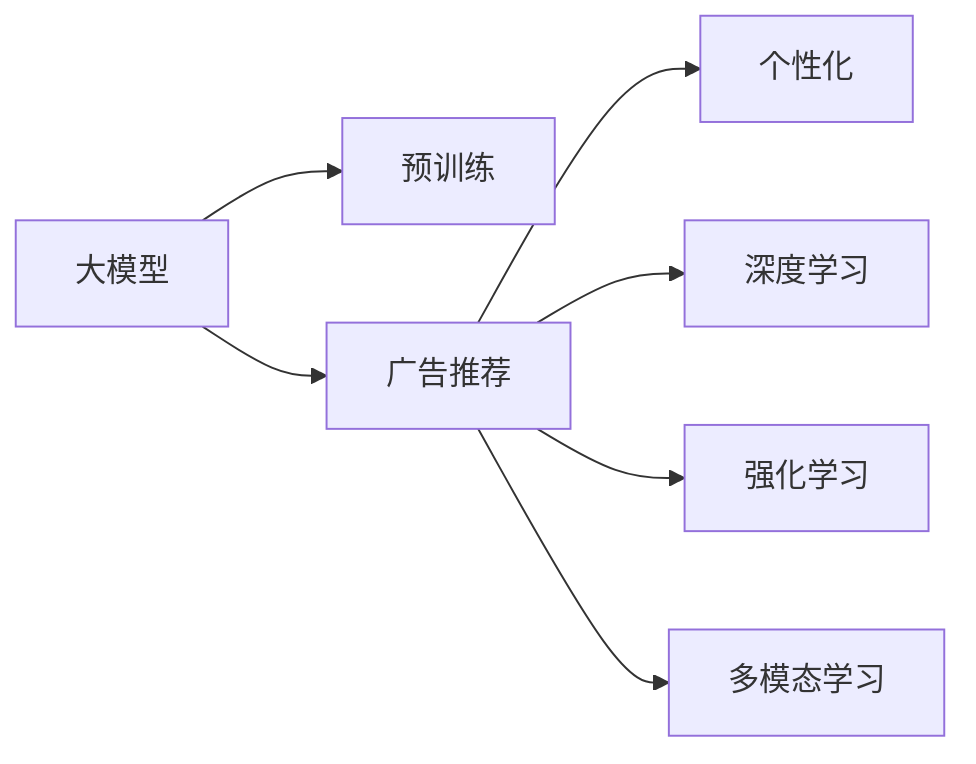

                 

# 大模型在个性化广告推荐中的潜力

## 1. 背景介绍

在数字化营销时代，广告推荐系统已成为互联网企业的重要资产。通过精准投放，广告推荐系统不仅能提升用户体验，还能最大化广告投入的回报率。然而，传统的基于规则和统计特征的广告推荐系统，难以捕捉用户的真实需求，容易产生噪声，导致广告效果不佳。近年来，大语言模型在广告推荐领域的潜力逐渐被发掘，通过深度学习技术，大模型能够在理解用户意图、挖掘隐性兴趣等方面发挥巨大的优势。

## 2. 核心概念与联系

### 2.1 核心概念概述

为更好理解大模型在广告推荐中的应用，本文将介绍几个核心概念：

- **大模型**：基于深度神经网络结构的大规模预训练语言模型，如BERT、GPT、T5等。通过大规模语料进行预训练，学习到了广泛的语义知识和表达能力。

- **广告推荐**：根据用户的历史行为、兴趣、上下文等数据，为用户推荐合适的广告内容。

- **个性化**：通过精准地理解用户需求和兴趣，实现针对每个用户个性化定制的广告推荐。

- **深度学习**：利用深度神经网络结构进行训练和推理，实现对复杂数据结构的建模和学习。

- **强化学习**：通过用户行为反馈不断优化广告推荐策略，提升推荐效果。

- **多模态学习**：结合图像、文本、音频等多种数据源进行综合建模，提升广告推荐系统的准确性和灵活性。

### 2.2 核心概念原理和架构的 Mermaid 流程图(Mermaid 流程节点中不要有括号、逗号等特殊字符)



这个流程图展示了从大模型到广告推荐系统的核心概念及相互关系：

1. **大模型**：通过大规模语料进行预训练，学习到广泛的语言知识和表达能力。
2. **广告推荐**：利用预训练的大模型，对用户进行个性化广告推荐。
3. **个性化**：根据用户的历史行为、兴趣等数据，实现精准的个性化推荐。
4. **深度学习**：利用深度神经网络进行模型训练和推理，提升推荐系统的准确性。
5. **强化学习**：通过用户反馈不断优化推荐策略，提升广告效果。
6. **多模态学习**：结合图像、文本、音频等多种数据源，实现综合推荐。

## 3. 核心算法原理 & 具体操作步骤

### 3.1 算法原理概述

大模型在广告推荐中的应用，本质上是一种基于深度学习的推荐系统。其核心思想是：利用大模型强大的语义理解能力，对用户输入的广告文本、行为数据等进行深度学习，提取用户隐含的兴趣和需求，进而实现个性化广告推荐。

具体而言，广告推荐系统可以分为预训练、微调和推理三个阶段：

1. **预训练阶段**：在大规模语料上进行预训练，学习到广泛的语义知识和表达能力。
2. **微调阶段**：在广告推荐数据上进行微调，优化模型在特定广告推荐任务上的性能。
3. **推理阶段**：利用微调后的模型，对用户输入进行推理，推荐出符合用户兴趣的广告。

### 3.2 算法步骤详解

**Step 1: 准备预训练模型和数据集**

- 选择合适的预训练语言模型（如BERT、GPT、T5等），并进行预训练。
- 准备广告推荐数据集，包含用户行为数据、广告内容等。

**Step 2: 添加任务适配层**

- 根据广告推荐任务，设计合适的输出层和损失函数。
- 使用Transformer等结构，构建广告推荐模型。

**Step 3: 设置微调超参数**

- 选择合适的优化算法（如AdamW、SGD等）及其参数，如学习率、批大小等。
- 设置正则化技术及强度，如L2正则、Dropout、Early Stopping等。
- 确定冻结预训练参数的策略，如仅微调顶层，或全部参数都参与微调。

**Step 4: 执行梯度训练**

- 将训练集数据分批次输入模型，前向传播计算损失函数。
- 反向传播计算参数梯度，根据设定的优化算法和学习率更新模型参数。
- 周期性在验证集上评估模型性能，根据性能指标决定是否触发Early Stopping。
- 重复上述步骤直到满足预设的迭代轮数或Early Stopping条件。

**Step 5: 测试和部署**

- 在测试集上评估微调后模型性能，对比微调前后的精度提升。
- 使用微调后的模型对新样本进行推理预测，集成到实际的应用系统中。
- 持续收集新的数据，定期重新微调模型，以适应数据分布的变化。

### 3.3 算法优缺点

**优点**：

1. **准确性高**：大模型能够捕捉复杂的语言结构和隐含语义，提升推荐系统的准确性。
2. **灵活性高**：大模型可以处理多模态数据，结合文本、图像、音频等多种信息，提升推荐效果。
3. **可解释性强**：通过分析模型的输出和中间表示，可以了解用户兴趣和需求，提升推荐透明度。
4. **泛化能力强**：大模型在预训练时学习了广泛的语义知识，具有较强的泛化能力，适应不同广告场景。

**缺点**：

1. **计算成本高**：大模型的计算量较大，需要高性能计算资源。
2. **训练时间长**：微调过程需要大量时间，难以快速迭代优化。
3. **过拟合风险**：在标注数据不足的情况下，容易产生过拟合。
4. **资源占用大**：模型的推理速度较慢，对系统资源要求较高。

### 3.4 算法应用领域

大模型在广告推荐中的应用领域广泛，涉及多个行业和场景，例如：

1. **电商推荐**：根据用户浏览、购买记录，推荐相应的商品广告。
2. **新闻推荐**：根据用户阅读行为，推荐相关新闻内容。
3. **视频推荐**：根据用户观看记录，推荐兴趣相关的视频内容。
4. **社交推荐**：根据用户互动行为，推荐朋友感兴趣的内容。
5. **金融推荐**：根据用户交易记录，推荐金融产品和服务。
6. **旅游推荐**：根据用户搜索记录，推荐旅游目的地和活动。

## 4. 数学模型和公式 & 详细讲解 & 举例说明

### 4.1 数学模型构建

假设广告推荐数据集为 $D=\{(x_i,y_i)\}_{i=1}^N, x_i \in \mathcal{X}, y_i \in \mathcal{Y}$，其中 $x_i$ 为广告内容，$y_i$ 为推荐结果（点击或购买等）。广告推荐模型的目标是最小化经验风险，即：

$$
\mathcal{L}(\theta) = \frac{1}{N} \sum_{i=1}^N \ell(M_{\theta}(x_i),y_i)
$$

其中 $\ell$ 为损失函数，$M_{\theta}$ 为微调后的广告推荐模型。常见的损失函数包括交叉熵损失、均方误差损失等。

### 4.2 公式推导过程

以二分类任务为例，假设模型 $M_{\theta}$ 在输入 $x$ 上的输出为 $\hat{y}=M_{\theta}(x) \in [0,1]$，表示广告被点击的概率。真实标签 $y \in \{0,1\}$。则二分类交叉熵损失函数定义为：

$$
\ell(M_{\theta}(x),y) = -[y\log \hat{y} + (1-y)\log (1-\hat{y})]
$$

将其代入经验风险公式，得：

$$
\mathcal{L}(\theta) = -\frac{1}{N}\sum_{i=1}^N [y_i\log M_{\theta}(x_i)+(1-y_i)\log(1-M_{\theta}(x_i))]
$$

根据链式法则，损失函数对参数 $\theta_k$ 的梯度为：

$$
\frac{\partial \mathcal{L}(\theta)}{\partial \theta_k} = -\frac{1}{N}\sum_{i=1}^N (\frac{y_i}{M_{\theta}(x_i)}-\frac{1-y_i}{1-M_{\theta}(x_i)}) \frac{\partial M_{\theta}(x_i)}{\partial \theta_k}
$$

其中 $\frac{\partial M_{\theta}(x_i)}{\partial \theta_k}$ 可进一步递归展开，利用自动微分技术完成计算。

### 4.3 案例分析与讲解

以电商推荐为例，假设模型在每个商品 $x$ 上的输出 $\hat{y}=M_{\theta}(x)$ 表示该商品被用户购买的概率。训练集为 $D=\{(x_i,y_i)\}_{i=1}^N, x_i \in \mathcal{X}, y_i \in \{0,1\}$，其中 $y_i=1$ 表示用户购买了商品 $x_i$。

在微调阶段，我们定义交叉熵损失函数：

$$
\ell(M_{\theta}(x),y) = -[y\log \hat{y} + (1-y)\log (1-\hat{y})]
$$

经验风险为：

$$
\mathcal{L}(\theta) = -\frac{1}{N}\sum_{i=1}^N [y_i\log M_{\theta}(x_i)+(1-y_i)\log(1-M_{\theta}(x_i))]
$$

假设使用AdamW优化器，学习率为 $2e-5$。微调步骤为：

1. 初始化模型参数 $\theta$。
2. 循环迭代 $N$ 次：
   - 随机抽样 $x$ 和 $y$，计算损失 $\mathcal{L}(\theta)$。
   - 计算梯度 $\frac{\partial \mathcal{L}(\theta)}{\partial \theta_k}$。
   - 更新参数 $\theta \leftarrow \theta - \eta \nabla_{\theta}\mathcal{L}(\theta) - \eta\lambda\theta$。
3. 周期性在验证集上评估模型性能，触发Early Stopping。

在测试集上，利用微调后的模型对新商品进行预测，并根据预测结果进行广告推荐。

## 5. 项目实践：代码实例和详细解释说明

### 5.1 开发环境搭建

在进行广告推荐微调前，我们需要准备好开发环境。以下是使用Python进行PyTorch开发的环境配置流程：

1. 安装Anaconda：从官网下载并安装Anaconda，用于创建独立的Python环境。

2. 创建并激活虚拟环境：
```bash
conda create -n pytorch-env python=3.8 
conda activate pytorch-env
```

3. 安装PyTorch：根据CUDA版本，从官网获取对应的安装命令。例如：
```bash
conda install pytorch torchvision torchaudio cudatoolkit=11.1 -c pytorch -c conda-forge
```

4. 安装Transformer库：
```bash
pip install transformers
```

5. 安装各类工具包：
```bash
pip install numpy pandas scikit-learn matplotlib tqdm jupyter notebook ipython
```

完成上述步骤后，即可在`pytorch-env`环境中开始广告推荐微调实践。

### 5.2 源代码详细实现

这里我们以电商推荐任务为例，给出使用Transformers库对BERT模型进行微调的PyTorch代码实现。

首先，定义电商推荐任务的数据处理函数：

```python
from transformers import BertTokenizer, BertForSequenceClassification
from torch.utils.data import Dataset
import torch

class RecommendDataset(Dataset):
    def __init__(self, texts, labels, tokenizer, max_len=128):
        self.texts = texts
        self.labels = labels
        self.tokenizer = tokenizer
        self.max_len = max_len
        
    def __len__(self):
        return len(self.texts)
    
    def __getitem__(self, item):
        text = self.texts[item]
        label = self.labels[item]
        
        encoding = self.tokenizer(text, return_tensors='pt', max_length=self.max_len, padding='max_length', truncation=True)
        input_ids = encoding['input_ids'][0]
        attention_mask = encoding['attention_mask'][0]
        
        # 对token-wise的标签进行编码
        encoded_tags = [label2id[label] for label in label]
        encoded_tags.extend([label2id['O']] * (self.max_len - len(encoded_tags)))
        labels = torch.tensor(encoded_tags, dtype=torch.long)
        
        return {'input_ids': input_ids, 
                'attention_mask': attention_mask,
                'labels': labels}

# 标签与id的映射
label2id = {'buy': 0, 'not buy': 1}
id2label = {v: k for k, v in label2id.items()}

# 创建dataset
tokenizer = BertTokenizer.from_pretrained('bert-base-cased')

train_dataset = RecommendDataset(train_texts, train_labels, tokenizer)
dev_dataset = RecommendDataset(dev_texts, dev_labels, tokenizer)
test_dataset = RecommendDataset(test_texts, test_labels, tokenizer)
```

然后，定义模型和优化器：

```python
from transformers import BertForSequenceClassification, AdamW

model = BertForSequenceClassification.from_pretrained('bert-base-cased', num_labels=2)

optimizer = AdamW(model.parameters(), lr=2e-5)
```

接着，定义训练和评估函数：

```python
from torch.utils.data import DataLoader
from tqdm import tqdm
from sklearn.metrics import classification_report

device = torch.device('cuda') if torch.cuda.is_available() else torch.device('cpu')
model.to(device)

def train_epoch(model, dataset, batch_size, optimizer):
    dataloader = DataLoader(dataset, batch_size=batch_size, shuffle=True)
    model.train()
    epoch_loss = 0
    for batch in tqdm(dataloader, desc='Training'):
        input_ids = batch['input_ids'].to(device)
        attention_mask = batch['attention_mask'].to(device)
        labels = batch['labels'].to(device)
        model.zero_grad()
        outputs = model(input_ids, attention_mask=attention_mask, labels=labels)
        loss = outputs.loss
        epoch_loss += loss.item()
        loss.backward()
        optimizer.step()
    return epoch_loss / len(dataloader)

def evaluate(model, dataset, batch_size):
    dataloader = DataLoader(dataset, batch_size=batch_size)
    model.eval()
    preds, labels = [], []
    with torch.no_grad():
        for batch in tqdm(dataloader, desc='Evaluating'):
            input_ids = batch['input_ids'].to(device)
            attention_mask = batch['attention_mask'].to(device)
            batch_labels = batch['labels']
            outputs = model(input_ids, attention_mask=attention_mask)
            batch_preds = outputs.logits.argmax(dim=2).to('cpu').tolist()
            batch_labels = batch_labels.to('cpu').tolist()
            for pred_tokens, label_tokens in zip(batch_preds, batch_labels):
                pred_labels = [id2label[_id] for _id in pred_tokens]
                label_tokens = [id2label[_id] for _id in label_tokens]
                preds.append(pred_labels[:len(label_tokens)])
                labels.append(label_tokens)
                
    print(classification_report(labels, preds))
```

最后，启动训练流程并在测试集上评估：

```python
epochs = 5
batch_size = 16

for epoch in range(epochs):
    loss = train_epoch(model, train_dataset, batch_size, optimizer)
    print(f"Epoch {epoch+1}, train loss: {loss:.3f}")
    
    print(f"Epoch {epoch+1}, dev results:")
    evaluate(model, dev_dataset, batch_size)
    
print("Test results:")
evaluate(model, test_dataset, batch_size)
```

以上就是使用PyTorch对BERT进行电商推荐任务微调的完整代码实现。可以看到，得益于Transformers库的强大封装，我们可以用相对简洁的代码完成BERT模型的加载和微调。

### 5.3 代码解读与分析

让我们再详细解读一下关键代码的实现细节：

**RecommendDataset类**：
- `__init__`方法：初始化文本、标签、分词器等关键组件。
- `__len__`方法：返回数据集的样本数量。
- `__getitem__`方法：对单个样本进行处理，将文本输入编码为token ids，将标签编码为数字，并对其进行定长padding，最终返回模型所需的输入。

**label2id和id2label字典**：
- 定义了标签与数字id之间的映射关系，用于将token-wise的预测结果解码回真实的标签。

**训练和评估函数**：
- 使用PyTorch的DataLoader对数据集进行批次化加载，供模型训练和推理使用。
- 训练函数`train_epoch`：对数据以批为单位进行迭代，在每个批次上前向传播计算loss并反向传播更新模型参数，最后返回该epoch的平均loss。
- 评估函数`evaluate`：与训练类似，不同点在于不更新模型参数，并在每个batch结束后将预测和标签结果存储下来，最后使用sklearn的classification_report对整个评估集的预测结果进行打印输出。

**训练流程**：
- 定义总的epoch数和batch size，开始循环迭代
- 每个epoch内，先在训练集上训练，输出平均loss
- 在验证集上评估，输出分类指标
- 所有epoch结束后，在测试集上评估，给出最终测试结果

可以看到，PyTorch配合Transformers库使得BERT微调的代码实现变得简洁高效。开发者可以将更多精力放在数据处理、模型改进等高层逻辑上，而不必过多关注底层的实现细节。

当然，工业级的系统实现还需考虑更多因素，如模型的保存和部署、超参数的自动搜索、更灵活的任务适配层等。但核心的微调范式基本与此类似。

## 6. 实际应用场景

### 6.1 电商平台广告推荐

大语言模型在电商推荐中的应用尤为显著。通过微调，大模型能够精准捕捉用户对商品的需求和兴趣，提升广告的点击率和转化率。具体而言，电商推荐系统可以结合用户的浏览历史、购买记录、搜索关键词等信息，利用大模型进行深度学习，输出推荐商品的概率。在推荐算法中，可以采用基于排序的推荐方法，将商品按照相关性进行排序，最终选择最符合用户需求的商品进行广告展示。

### 6.2 新闻平台个性化推荐

在新闻推荐领域，大模型可以用于个性化的新闻内容推荐。根据用户的历史阅读记录、兴趣标签、实时浏览行为等数据，利用大模型进行深度学习，输出用户对新闻的兴趣概率。新闻平台可以根据推荐概率，展示新闻的标题、摘要等信息，提升用户的阅读体验和粘性。

### 6.3 视频平台视频推荐

视频平台可以利用大模型进行视频内容的个性化推荐。通过分析用户的观看历史、评价反馈、点赞行为等数据，利用大模型进行深度学习，输出视频的相关性概率。视频平台可以根据推荐概率，展示相关视频内容，提升用户的视频观看体验和时长。

### 6.4 未来应用展望

未来，随着大模型的不断发展，其在广告推荐中的应用将更加广泛和深入。以下是一些可能的发展方向：

1. **跨领域推荐**：大模型可以应用于多个领域，如电商、新闻、视频等，提供跨领域的广告推荐服务。
2. **多模态推荐**：结合图像、视频、音频等多种数据源，提升广告推荐的准确性和个性化。
3. **实时推荐**：利用大模型的实时学习能力，动态调整推荐策略，提升广告投放的实效性。
4. **隐私保护**：结合隐私计算和联邦学习等技术，保护用户隐私，提升广告推荐的安全性。
5. **内容生成**：利用大模型的生成能力，自动生成广告内容，提升创意广告的效率和质量。

## 7. 工具和资源推荐

### 7.1 学习资源推荐

为了帮助开发者系统掌握大语言模型在广告推荐中的应用，这里推荐一些优质的学习资源：

1. 《Transformer从原理到实践》系列博文：由大模型技术专家撰写，深入浅出地介绍了Transformer原理、BERT模型、广告推荐技术等前沿话题。

2. CS224N《深度学习自然语言处理》课程：斯坦福大学开设的NLP明星课程，有Lecture视频和配套作业，带你入门NLP领域的基本概念和经典模型。

3. 《Natural Language Processing with Transformers》书籍：Transformers库的作者所著，全面介绍了如何使用Transformers库进行NLP任务开发，包括广告推荐在内的诸多范式。

4. HuggingFace官方文档：Transformers库的官方文档，提供了海量预训练模型和完整的广告推荐样例代码，是上手实践的必备资料。

5. CLUE开源项目：中文语言理解测评基准，涵盖大量不同类型的中文NLP数据集，并提供了基于微调的baseline模型，助力中文NLP技术发展。

通过对这些资源的学习实践，相信你一定能够快速掌握大语言模型在广告推荐中的应用，并用于解决实际的广告推荐问题。

### 7.2 开发工具推荐

高效的开发离不开优秀的工具支持。以下是几款用于大语言模型广告推荐开发的常用工具：

1. PyTorch：基于Python的开源深度学习框架，灵活动态的计算图，适合快速迭代研究。大部分预训练语言模型都有PyTorch版本的实现。

2. TensorFlow：由Google主导开发的开源深度学习框架，生产部署方便，适合大规模工程应用。同样有丰富的预训练语言模型资源。

3. Transformers库：HuggingFace开发的NLP工具库，集成了众多SOTA语言模型，支持PyTorch和TensorFlow，是进行广告推荐任务开发的利器。

4. Weights & Biases：模型训练的实验跟踪工具，可以记录和可视化模型训练过程中的各项指标，方便对比和调优。与主流深度学习框架无缝集成。

5. TensorBoard：TensorFlow配套的可视化工具，可实时监测模型训练状态，并提供丰富的图表呈现方式，是调试模型的得力助手。

6. Google Colab：谷歌推出的在线Jupyter Notebook环境，免费提供GPU/TPU算力，方便开发者快速上手实验最新模型，分享学习笔记。

合理利用这些工具，可以显著提升大语言模型在广告推荐任务中的开发效率，加快创新迭代的步伐。

### 7.3 相关论文推荐

大语言模型在广告推荐中的应用源于学界的持续研究。以下是几篇奠基性的相关论文，推荐阅读：

1. Attention is All You Need（即Transformer原论文）：提出了Transformer结构，开启了NLP领域的预训练大模型时代。

2. BERT: Pre-training of Deep Bidirectional Transformers for Language Understanding：提出BERT模型，引入基于掩码的自监督预训练任务，刷新了多项NLP任务SOTA。

3. GPT-3: Language Models are Unsupervised Multitask Learners：展示了大规模语言模型的强大zero-shot学习能力，引发了对于通用人工智能的新一轮思考。

4. Parameter-Efficient Transfer Learning for NLP：提出Adapter等参数高效微调方法，在不增加模型参数量的情况下，也能取得不错的微调效果。

5. Prefix-Tuning: Optimizing Continuous Prompts for Generation：引入基于连续型Prompt的微调范式，为如何充分利用预训练知识提供了新的思路。

6. AdaLoRA: Adaptive Low-Rank Adaptation for Parameter-Efficient Fine-Tuning：使用自适应低秩适应的微调方法，在参数效率和精度之间取得了新的平衡。

这些论文代表了大语言模型在广告推荐技术的发展脉络。通过学习这些前沿成果，可以帮助研究者把握学科前进方向，激发更多的创新灵感。

## 8. 总结：未来发展趋势与挑战

### 8.1 总结

本文对大模型在广告推荐中的应用进行了全面系统的介绍。首先阐述了广告推荐系统的背景和重要性，明确了大语言模型在广告推荐中的独特价值。其次，从原理到实践，详细讲解了大模型在广告推荐中的数学模型和算法步骤，给出了广告推荐任务微调的完整代码实现。同时，本文还探讨了大模型在电商、新闻、视频等多个行业的应用前景，展示了其强大的潜力。

通过本文的系统梳理，可以看到，大模型在广告推荐系统中的应用前景广阔，有望显著提升广告推荐的精度和效果，驱动数字化营销的创新发展。

### 8.2 未来发展趋势

展望未来，大模型在广告推荐中的应用将呈现以下几个发展趋势：

1. **模型规模继续增大**：随着算力成本的下降和数据规模的扩张，预训练语言模型的参数量还将持续增长。超大规模语言模型蕴含的丰富语言知识，有望支撑更加复杂多变的广告推荐。

2. **微调方法日趋多样**：开发更加参数高效的微调方法，在固定大部分预训练参数的同时，只更新极少量的任务相关参数。同时优化微调模型的计算图，减少前向传播和反向传播的资源消耗，实现更加轻量级、实时性的部署。

3. **跨领域推荐普及**：大模型可以应用于多个领域，如电商、新闻、视频等，提供跨领域的广告推荐服务。

4. **多模态推荐崛起**：结合图像、视频、音频等多种数据源，提升广告推荐的准确性和个性化。

5. **实时推荐和动态优化**：利用大模型的实时学习能力，动态调整推荐策略，提升广告投放的实效性。

6. **隐私保护和用户安全**：结合隐私计算和联邦学习等技术，保护用户隐私，提升广告推荐的安全性。

7. **内容生成和创意广告**：利用大模型的生成能力，自动生成广告内容，提升创意广告的效率和质量。

### 8.3 面临的挑战

尽管大语言模型在广告推荐中的应用取得了显著成效，但在迈向更加智能化、普适化应用的过程中，它仍面临着诸多挑战：

1. **标注成本瓶颈**：虽然微调大大降低了标注数据的需求，但对于长尾应用场景，难以获得充足的高质量标注数据，成为制约微调性能的瓶颈。如何进一步降低微调对标注样本的依赖，将是一大难题。

2. **模型鲁棒性不足**：当前微调模型面对域外数据时，泛化性能往往大打折扣。对于测试样本的微小扰动，微调模型的预测也容易发生波动。如何提高微调模型的鲁棒性，避免灾难性遗忘，还需要更多理论和实践的积累。

3. **推理效率有待提高**：大模型的计算量较大，推理速度较慢，对系统资源要求较高。如何在保证性能的同时，简化模型结构，提升推理速度，优化资源占用，将是重要的优化方向。

4. **可解释性亟需加强**：当前微调模型更像是"黑盒"系统，难以解释其内部工作机制和决策逻辑。对于医疗、金融等高风险应用，算法的可解释性和可审计性尤为重要。如何赋予微调模型更强的可解释性，将是亟待攻克的难题。

5. **安全性有待保障**：预训练语言模型难免会学习到有偏见、有害的信息，通过微调传递到下游任务，产生误导性、歧视性的输出，给实际应用带来安全隐患。如何从数据和算法层面消除模型偏见，避免恶意用途，确保输出的安全性，也将是重要的研究课题。

6. **知识整合能力不足**：现有的微调模型往往局限于任务内数据，难以灵活吸收和运用更广泛的先验知识。如何让微调过程更好地与外部知识库、规则库等专家知识结合，形成更加全面、准确的信息整合能力，还有很大的想象空间。

正视微调面临的这些挑战，积极应对并寻求突破，将是大语言模型微调技术迈向成熟的必由之路。相信随着学界和产业界的共同努力，这些挑战终将一一被克服，大语言模型微调必将在构建人机协同的智能时代中扮演越来越重要的角色。

### 8.4 研究展望

面对大语言模型微调所面临的种种挑战，未来的研究需要在以下几个方面寻求新的突破：

1. **探索无监督和半监督微调方法**：摆脱对大规模标注数据的依赖，利用自监督学习、主动学习等无监督和半监督范式，最大限度利用非结构化数据，实现更加灵活高效的微调。

2. **研究参数高效和计算高效的微调范式**：开发更加参数高效的微调方法，在固定大部分预训练参数的同时，只更新极少量的任务相关参数。同时优化微调模型的计算图，减少前向传播和反向传播的资源消耗，实现更加轻量级、实时性的部署。

3. **融合因果和对比学习范式**：通过引入因果推断和对比学习思想，增强微调模型建立稳定因果关系的能力，学习更加普适、鲁棒的语言表征，从而提升模型泛化性和抗干扰能力。

4. **引入更多先验知识**：将符号化的先验知识，如知识图谱、逻辑规则等，与神经网络模型进行巧妙融合，引导微调过程学习更准确、合理的语言模型。同时加强不同模态数据的整合，实现视觉、语音等多模态信息与文本信息的协同建模。

5. **结合因果分析和博弈论工具**：将因果分析方法引入微调模型，识别出模型决策的关键特征，增强输出解释的因果性和逻辑性。借助博弈论工具刻画人机交互过程，主动探索并规避模型的脆弱点，提高系统稳定性。

6. **纳入伦理道德约束**：在模型训练目标中引入伦理导向的评估指标，过滤和惩罚有偏见、有害的输出倾向。同时加强人工干预和审核，建立模型行为的监管机制，确保输出符合人类价值观和伦理道德。

这些研究方向的探索，必将引领大语言模型微调技术迈向更高的台阶，为构建安全、可靠、可解释、可控的智能系统铺平道路。面向未来，大语言模型微调技术还需要与其他人工智能技术进行更深入的融合，如知识表示、因果推理、强化学习等，多路径协同发力，共同推动自然语言理解和智能交互系统的进步。只有勇于创新、敢于突破，才能不断拓展语言模型的边界，让智能技术更好地造福人类社会。

## 9. 附录：常见问题与解答

**Q1：大模型微调是否适用于所有广告推荐任务？**

A: 大模型微调在大多数广告推荐任务上都能取得不错的效果，特别是对于数据量较小的任务。但对于一些特定领域的任务，如医学、法律等，仅仅依靠通用语料预训练的模型可能难以很好地适应。此时需要在特定领域语料上进一步预训练，再进行微调，才能获得理想效果。此外，对于一些需要时效性、个性化很强的任务，如对话、推荐等，微调方法也需要针对性的改进优化。

**Q2：微调过程中如何选择合适的学习率？**

A: 微调的学习率一般要比预训练时小1-2个数量级，如果使用过大的学习率，容易破坏预训练权重，导致过拟合。一般建议从1e-5开始调参，逐步减小学习率，直至收敛。也可以使用warmup策略，在开始阶段使用较小的学习率，再逐渐过渡到预设值。需要注意的是，不同的优化器(如AdamW、Adafactor等)以及不同的学习率调度策略，可能需要设置不同的学习率阈值。

**Q3：采用大模型微调时会面临哪些资源瓶颈？**

A: 目前主流的预训练大模型动辄以亿计的参数规模，对算力、内存、存储都提出了很高的要求。GPU/TPU等高性能设备是必不可少的，但即便如此，超大批次的训练和推理也可能遇到显存不足的问题。因此需要采用一些资源优化技术，如梯度积累、混合精度训练、模型并行等，来突破硬件瓶颈。同时，模型的存储和读取也可能占用大量时间和空间，需要采用模型压缩、稀疏化存储等方法进行优化。

**Q4：如何缓解微调过程中的过拟合问题？**

A: 过拟合是微调面临的主要挑战，尤其是在标注数据不足的情况下。常见的缓解策略包括：
1. 数据增强：通过回译、近义替换等方式扩充训练集
2. 正则化：使用L2正则、Dropout、Early Stopping等避免过拟合
3. 对抗训练：引入对抗样本，提高模型鲁棒性
4. 参数高效微调：只调整少量参数(如Adapter、Prefix等)，减小过拟合风险
5. 多模型集成：训练多个微调模型，取平均输出，抑制过拟合

这些策略往往需要根据具体任务和数据特点进行灵活组合。只有在数据、模型、训练、推理等各环节进行全面优化，才能最大限度地发挥大模型微调的威力。

**Q5：微调模型在落地部署时需要注意哪些问题？**

A: 将微调模型转化为实际应用，还需要考虑以下因素：
1. 模型裁剪：去除不必要的层和参数，减小模型尺寸，加快推理速度
2. 量化加速：将浮点模型转为定点模型，压缩存储空间，提高计算效率
3. 服务化封装：将模型封装为标准化服务接口，便于集成调用
4. 弹性伸缩：根据请求流量动态调整资源配置，平衡服务质量和成本
5. 监控告警：实时采集系统指标，设置异常告警阈值，确保服务稳定性
6. 安全防护：采用访问鉴权、数据脱敏等措施，保障数据和模型安全

大语言模型微调为广告推荐系统提供了广阔的应用前景，但如何将强大的性能转化为稳定、高效、安全的业务价值，还需要工程实践的不断打磨。唯有从数据、算法、工程、业务等多个维度协同发力，才能真正实现人工智能技术在广告推荐领域的规模化落地。总之，微调需要开发者根据具体任务，不断迭代和优化模型、数据和算法，方能得到理想的效果。

---

作者：禅与计算机程序设计艺术 / Zen and the Art of Computer Programming

