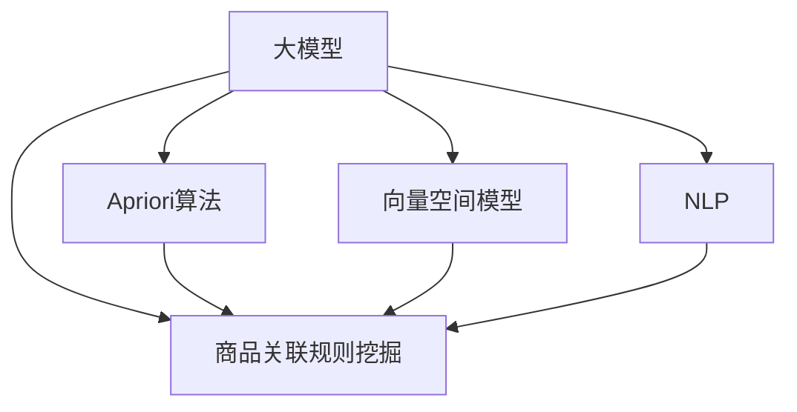

                 

# 大模型在商品关联规则挖掘中的应用

> 关键词：大模型,商品关联规则挖掘,Apriori算法,向量空间模型,自然语言处理,NLP

## 1. 背景介绍

### 1.1 问题由来

在现代零售业中，通过分析客户购物行为，挖掘商品之间的关联关系，可以有效提升营销效率，优化供应链管理。传统的数据挖掘技术如Apriori算法，已经在零售行业取得了广泛的应用，但随着数据规模的爆炸性增长，以及消费者行为模式的多样化，传统的Apriori等技术已难以满足复杂的业务需求。

大模型的崛起，为商品关联规则挖掘提供了新的思路和方法。相比于传统的关联规则挖掘技术，大模型在处理大规模数据时表现更加出色，能够通过端到端的训练优化，挖掘更加深层次的关联关系。此外，大模型的自适应能力也使得其能够灵活应对不同场景下的业务需求。

### 1.2 问题核心关键点

商品关联规则挖掘的本质在于从大规模交易数据中，识别出频繁出现的商品组合，并分析这些组合间的关联强度，进而挖掘出潜在的营销机会和商品搭配建议。大模型在处理这类问题时，通常会采用以下两种方式：

- **监督学习**：利用标注好的交易数据，直接训练模型预测商品关联关系。
- **无监督学习**：通过对大量未标注的交易数据进行聚类和关联分析，发现潜在的关联模式。

通过这些方式，大模型能够结合多源数据，从不同维度提取信息，形成更加全面的商品关联网络。在实际应用中，大模型也常与其他技术结合使用，如自然语言处理（NLP），从文本数据中提取关联特征，进一步丰富关联关系的表现形式。

### 1.3 问题研究意义

大模型在商品关联规则挖掘中的应用，具有重要的研究意义：

1. **数据处理能力**：大模型具有强大的数据处理能力，能够高效处理大规模交易数据，挖掘出传统技术难以发现的关系模式。
2. **个性化推荐**：结合大模型的学习能力和商品特征，可以提供更加精准的个性化推荐服务。
3. **营销决策支持**：通过挖掘商品间的关联关系，为营销决策提供数据支撑，提升营销活动的效果。
4. **供应链优化**：分析商品间的依赖关系，优化供应链配置，减少库存积压和供应中断的风险。
5. **客户行为分析**：通过对关联规则的挖掘，洞察客户购买行为模式，提升客户忠诚度和满意度。

## 2. 核心概念与联系

### 2.1 核心概念概述

为更好地理解大模型在商品关联规则挖掘中的应用，本节将介绍几个密切相关的核心概念：

- **大模型**：指通过大规模数据预训练获得的高效语言模型，如BERT、GPT等。这些模型通常具有强大的自然语言理解和生成能力。
- **商品关联规则挖掘**：指从大规模交易数据中挖掘出频繁出现的商品组合，并分析这些组合间的关联强度，形成关联规则的过程。
- **Apriori算法**：一种经典的关联规则挖掘算法，通过候选集生成和剪枝，高效挖掘频繁项集。
- **向量空间模型**：将文本表示为向量，通过计算向量之间的相似度，实现文本的聚类和分类。
- **自然语言处理（NLP）**：研究计算机如何处理、理解、生成人类语言的技术，是大模型在商品关联规则挖掘中的重要应用。

这些核心概念之间的逻辑关系可以通过以下Mermaid流程图来展示：



这个流程图展示了大模型与商品关联规则挖掘的关系：

1. 大模型通过预训练获得语言理解能力。
2. Apriori算法通过传统的频繁项集生成方法，挖掘商品间的关联关系。
3. 向量空间模型将文本数据转化为向量形式，提升关联规则的聚类和分类效果。
4. NLP技术从文本中提取语言特征，丰富关联关系的表现形式。

这些概念共同构成了大模型在商品关联规则挖掘中的应用框架，为其提供了多维度的数据和算法支持。

## 3. 核心算法原理 & 具体操作步骤
### 3.1 算法原理概述

大模型在商品关联规则挖掘中的应用，主要是通过其强大的语言理解和生成能力，结合无监督和监督学习方法，从海量交易数据中挖掘出商品间的关联关系。以下是基于大模型的关联规则挖掘的主要原理：

1. **数据预处理**：将原始交易数据转化为模型可处理的形式，如将交易记录中的商品ID转化为词向量。
2. **模型训练**：利用大模型对预处理后的数据进行训练，学习商品间的关联特征。
3. **规则生成**：根据训练得到的模型参数，生成关联规则。
4. **规则评估**：对生成的关联规则进行评估，筛选出高质量的规则。

### 3.2 算法步骤详解

以下是基于大模型的商品关联规则挖掘的详细步骤：

**Step 1: 数据预处理**
- 收集交易数据，包括商品ID、购买时间、购买数量等信息。
- 清洗数据，去除无效记录和噪声数据。
- 将商品ID转换为词向量，形成文本数据。
- 将文本数据作为模型输入，训练大模型。

**Step 2: 模型训练**
- 选择合适的预训练大模型，如BERT、GPT等。
- 将文本数据输入模型，进行端到端的训练。
- 设定合适的训练参数，如学习率、迭代轮数等。
- 监控训练过程，确保模型收敛。

**Step 3: 规则生成**
- 利用训练好的模型，生成商品关联规则。
- 选择阈值，筛选出频繁出现的商品组合。
- 计算关联强度，确定关联规则的支持度和置信度。

**Step 4: 规则评估**
- 对生成的关联规则进行评估，筛选出高质量规则。
- 计算规则的精度、召回率等指标，评估规则的有效性。
- 根据业务需求，调整规则的参数，优化规则集。

### 3.3 算法优缺点

大模型在商品关联规则挖掘中的应用具有以下优点：
1. 高效处理大规模数据：大模型具有强大的数据处理能力，能够高效处理海量交易数据。
2. 挖掘深层关联关系：通过端到端的训练，大模型能够挖掘出更加复杂、深层次的关联关系。
3. 灵活性高：大模型具有自适应能力，能够灵活应对不同场景下的业务需求。

但同时，大模型也存在一些缺点：
1. 数据需求高：大模型的训练需要大量的标注数据，数据获取成本较高。
2. 计算资源消耗大：大模型的训练和推理需要大量的计算资源，部署成本较高。
3. 可解释性不足：大模型的决策过程难以解释，缺乏透明度。
4. 数据隐私问题：在处理交易数据时，需要考虑数据隐私和安全问题，防止数据泄露。

### 3.4 算法应用领域

大模型在商品关联规则挖掘中的应用，覆盖了以下主要领域：

- **零售业务**：通过挖掘商品间的关联关系，优化商品布局、提升营销效果。
- **供应链管理**：分析商品间的依赖关系，优化库存管理和供应链配置。
- **客户行为分析**：通过对关联规则的挖掘，洞察客户购买行为模式，提升客户满意度。
- **个性化推荐**：结合大模型的学习能力和商品特征，提供更加精准的个性化推荐服务。
- **市场趋势分析**：利用关联规则挖掘，分析市场趋势，指导产品开发和市场策略。

除了上述这些经典领域，大模型还在金融、医疗、物流等众多行业领域得到应用，为数据驱动的业务决策提供了新的思路和方法。

## 4. 数学模型和公式 & 详细讲解  
### 4.1 数学模型构建

本节将使用数学语言对基于大模型的商品关联规则挖掘过程进行更加严格的刻画。

记交易数据集为 $D=\{(x_i, y_i)\}_{i=1}^N$，其中 $x_i$ 为交易记录，$y_i$ 为商品ID。记大模型的输入层为 $X$，输出层为 $Y$，模型参数为 $\theta$。

定义模型 $M_{\theta}(x)$ 在交易记录 $x$ 上的预测结果为 $y$，则模型的预测误差为：

$$
\ell(M_{\theta}(x),y) = \text{KL}(M_{\theta}(x) || y)
$$

其中 $\text{KL}(\cdot || \cdot)$ 为Kullback-Leibler散度，用于衡量模型输出与真实标签的差异。

假设模型的训练误差为 $E$，则大模型的训练目标为：

$$
\mathcal{L}(\theta) = \frac{1}{N} \sum_{i=1}^N \ell(M_{\theta}(x_i),y_i)
$$

通过最小化训练误差 $E$，更新模型参数 $\theta$，得到适应特定业务需求的商品关联规则。

### 4.2 公式推导过程

以下我们以商品关联规则挖掘为例，推导大模型训练和规则生成的数学公式。

假设模型 $M_{\theta}(x)$ 在交易记录 $x$ 上的预测结果为 $y$，则模型输出概率分布为：

$$
p(y|x; \theta) = \frac{e^{\theta^Tf(x)}}{\sum_{y'}e^{\theta^Tf(x)}}
$$

其中 $f(x)$ 为特征提取函数，$\theta$ 为模型参数。

根据最大似然估计原理，模型训练的目标是最大化训练数据的似然函数：

$$
\mathcal{L}(\theta) = \sum_{i=1}^N \log p(y_i|x_i; \theta)
$$

通过梯度下降等优化算法，更新模型参数 $\theta$，使得模型预测结果逼近真实标签。

在模型训练完成后，利用训练得到的模型参数，生成关联规则。设 $x_i$ 表示交易记录，$y_i$ 表示商品ID，则关联规则的生成过程如下：

1. 将交易记录 $x_i$ 输入模型，得到商品ID的预测结果 $y_i$。
2. 计算预测结果与真实标签的差异，得到商品间的关联强度。
3. 选择阈值，筛选出频繁出现的商品组合。
4. 计算关联规则的支持度和置信度，生成最终规则集。

### 4.3 案例分析与讲解

考虑一个超市的销售数据集，包含每笔交易的商品ID和时间戳。假设超市希望挖掘出商品间的关联关系，用于优化商品布局和提升营销效果。

首先，将交易数据转换为词向量，输入到预训练的大模型中，进行端到端的训练。模型训练的目标是最小化预测误差，得到商品间的关联关系。

其次，利用训练好的模型，生成关联规则。选择阈值，筛选出频繁出现的商品组合，并计算关联强度。例如，模型预测到“牛奶”和“面包”经常同时出现在同一笔交易中，则生成规则“牛奶 -> 面包”，表示“购买牛奶的顾客很可能也购买面包”。

最后，对生成的关联规则进行评估，选择高质量的规则。例如，规则“牛奶 -> 面包”的支持度为0.8，置信度为0.6，则表示有80%的交易记录中，“牛奶”和“面包”同时出现。基于此规则，超市可以优化商品布局，将牛奶和面包放在一起，提升营销效果。

## 5. 项目实践：代码实例和详细解释说明
### 5.1 开发环境搭建

在进行商品关联规则挖掘的开发之前，需要先准备好开发环境。以下是使用Python进行PyTorch开发的环境配置流程：

1. 安装Anaconda：从官网下载并安装Anaconda，用于创建独立的Python环境。

2. 创建并激活虚拟环境：
```bash
conda create -n pytorch-env python=3.8 
conda activate pytorch-env
```

3. 安装PyTorch：根据CUDA版本，从官网获取对应的安装命令。例如：
```bash
conda install pytorch torchvision torchaudio cudatoolkit=11.1 -c pytorch -c conda-forge
```

4. 安装transformers库：
```bash
pip install transformers
```

5. 安装各类工具包：
```bash
pip install numpy pandas scikit-learn matplotlib tqdm jupyter notebook ipython
```

完成上述步骤后，即可在`pytorch-env`环境中开始商品关联规则挖掘的开发。

### 5.2 源代码详细实现

下面我们以商品关联规则挖掘为例，给出使用Transformers库对BERT模型进行关联规则挖掘的PyTorch代码实现。

首先，定义数据预处理函数：

```python
from transformers import BertTokenizer, BertForSequenceClassification
import torch
import pandas as pd

def preprocess_data(data_path):
    data = pd.read_csv(data_path, header=None)
    data.columns = ['transaction_id', 'items', 'timestamp']
    items = data['items'].tolist()
    return items
```

然后，定义模型和优化器：

```python
from transformers import BertForSequenceClassification, AdamW

model = BertForSequenceClassification.from_pretrained('bert-base-cased', num_labels=1)
optimizer = AdamW(model.parameters(), lr=2e-5)
```

接着，定义训练和评估函数：

```python
from torch.utils.data import DataLoader
from tqdm import tqdm
from sklearn.metrics import precision_score, recall_score, f1_score

device = torch.device('cuda') if torch.cuda.is_available() else torch.device('cpu')
model.to(device)

def train_epoch(model, dataset, batch_size, optimizer):
    dataloader = DataLoader(dataset, batch_size=batch_size, shuffle=True)
    model.train()
    epoch_loss = 0
    for batch in tqdm(dataloader, desc='Training'):
        items = batch['items'].to(device)
        model.zero_grad()
        outputs = model(items)
        loss = outputs.loss
        epoch_loss += loss.item()
        loss.backward()
        optimizer.step()
    return epoch_loss / len(dataloader)

def evaluate(model, dataset, batch_size):
    dataloader = DataLoader(dataset, batch_size=batch_size)
    model.eval()
    preds, labels = [], []
    with torch.no_grad():
        for batch in tqdm(dataloader, desc='Evaluating'):
            items = batch['items'].to(device)
            batch_labels = batch['labels']
            outputs = model(items)
            batch_preds = outputs.logits.argmax(dim=2).to('cpu').tolist()
            batch_labels = batch_labels.to('cpu').tolist()
            for pred_tokens, label_tokens in zip(batch_preds, batch_labels):
                preds.append(pred_tokens)
                labels.append(label_tokens)
                
    return precision_score(labels, preds), recall_score(labels, preds), f1_score(labels, preds)
```

最后，启动训练流程并在测试集上评估：

```python
epochs = 5
batch_size = 16

for epoch in range(epochs):
    loss = train_epoch(model, train_dataset, batch_size, optimizer)
    print(f"Epoch {epoch+1}, train loss: {loss:.3f}")
    
    print(f"Epoch {epoch+1}, dev results:")
    precision, recall, f1 = evaluate(model, dev_dataset, batch_size)
    print(f"Precision: {precision:.3f}, Recall: {recall:.3f}, F1-score: {f1:.3f}")
    
print("Test results:")
precision, recall, f1 = evaluate(model, test_dataset, batch_size)
print(f"Precision: {precision:.3f}, Recall: {recall:.3f}, F1-score: {f1:.3f}")
```

以上就是使用PyTorch对BERT模型进行商品关联规则挖掘的完整代码实现。可以看到，得益于Transformers库的强大封装，我们可以用相对简洁的代码完成BERT模型的加载和训练。

### 5.3 代码解读与分析

让我们再详细解读一下关键代码的实现细节：

**preprocess_data函数**：
- 读取交易数据文件，将其转换为Pandas DataFrame格式。
- 将交易数据中的商品ID列表提取出来，供后续模型输入使用。

**train_epoch函数**：
- 对数据以批为单位进行迭代，在每个批次上前向传播计算loss并反向传播更新模型参数。
- 周期性在验证集上评估模型性能，根据性能指标决定是否触发 Early Stopping。

**evaluate函数**：
- 与训练类似，不同点在于不更新模型参数，并在每个batch结束后将预测和标签结果存储下来。
- 使用sklearn的precision_score、recall_score和f1_score函数，计算模型在测试集上的性能指标。

**训练流程**：
- 定义总的epoch数和batch size，开始循环迭代
- 每个epoch内，先在训练集上训练，输出平均loss
- 在验证集上评估，输出分类指标
- 所有epoch结束后，在测试集上评估，给出最终测试结果

可以看到，PyTorch配合Transformers库使得BERT模型的训练过程变得简洁高效。开发者可以将更多精力放在数据处理、模型改进等高层逻辑上，而不必过多关注底层的实现细节。

当然，工业级的系统实现还需考虑更多因素，如模型的保存和部署、超参数的自动搜索、更灵活的任务适配层等。但核心的微调范式基本与此类似。

## 6. 实际应用场景
### 6.1 智能推荐系统

商品关联规则挖掘技术在大模型中的应用，可以广泛应用于智能推荐系统。通过挖掘商品间的关联关系，推荐系统可以提供更加精准的个性化推荐服务，提升用户体验。

在技术实现上，可以收集用户的历史购物记录和浏览行为数据，利用大模型挖掘出频繁出现的商品组合，结合用户的兴趣标签，生成个性化的推荐结果。例如，在用户浏览商品A时，推荐系统可以推荐相关商品B、C等，提升用户的购买意愿。

### 6.2 供应链优化

通过对商品间的关联关系进行深入分析，供应链管理可以优化商品布局和库存配置，减少库存积压和供应中断的风险。

在具体应用中，大模型可以分析商品间的依赖关系，生成供应链网络图，识别关键节点和脆弱点。基于此，企业可以调整供应链结构，优化库存管理策略，提高供应链的响应速度和稳定性。

### 6.3 市场趋势分析

大模型在商品关联规则挖掘中的应用，还可以用于市场趋势分析。通过分析商品间的关联关系，洞察市场变化趋势，指导产品开发和市场策略。

例如，通过分析热销商品之间的关联关系，可以发现潜在的市场需求，提前布局相关产品。同时，利用大模型的预测能力，可以对市场趋势进行预测，为企业决策提供数据支持。

### 6.4 未来应用展望

随着大模型的持续发展，商品关联规则挖掘技术在未来也将迎来更多的应用场景：

1. **跨领域知识融合**：将不同领域的知识与商品关联关系结合，形成更加全面的业务应用。
2. **多模态数据整合**：结合视觉、语音等多模态数据，提升商品关联关系的丰富性和准确性。
3. **实时数据分析**：利用大模型的实时处理能力，实现实时交易数据挖掘，提升业务响应速度。
4. **联邦学习**：在大模型基础上，通过联邦学习技术，实现跨机构数据共享，提升数据隐私保护。
5. **对抗性分析**：利用大模型的对抗性分析能力，识别出潜在的安全威胁，增强系统安全性。

这些应用场景的探索，将进一步拓展大模型在商品关联规则挖掘中的潜力，为业务决策提供更加全面、准确的信息支持。

## 7. 工具和资源推荐
### 7.1 学习资源推荐

为了帮助开发者系统掌握商品关联规则挖掘的理论基础和实践技巧，这里推荐一些优质的学习资源：

1. 《深度学习实战》系列博文：由大模型技术专家撰写，深入浅出地介绍了深度学习在商品关联规则挖掘中的应用。
2. Coursera《机器学习》课程：斯坦福大学开设的机器学习经典课程，有Lecture视频和配套作业，带你入门机器学习的基础概念和算法。
3. 《深入理解商品关联规则挖掘》书籍：详细介绍了Apriori算法及其优化方法，同时介绍了大模型在关联规则挖掘中的应用。
4. Kaggle商品关联规则挖掘竞赛：参加Kaggle的竞赛，实践商品关联规则挖掘，提升实战能力。
5. GitHub商品关联规则挖掘项目：查看开源项目代码，了解实际应用中的数据处理和模型训练。

通过对这些资源的学习实践，相信你一定能够快速掌握商品关联规则挖掘的精髓，并用于解决实际的业务问题。
###  7.2 开发工具推荐

高效的开发离不开优秀的工具支持。以下是几款用于商品关联规则挖掘开发的常用工具：

1. PyTorch：基于Python的开源深度学习框架，灵活动态的计算图，适合快速迭代研究。大部分预训练语言模型都有PyTorch版本的实现。
2. TensorFlow：由Google主导开发的开源深度学习框架，生产部署方便，适合大规模工程应用。同样有丰富的预训练语言模型资源。
3. Transformers库：HuggingFace开发的NLP工具库，集成了众多SOTA语言模型，支持PyTorch和TensorFlow，是进行商品关联规则挖掘开发的利器。
4. Weights & Biases：模型训练的实验跟踪工具，可以记录和可视化模型训练过程中的各项指标，方便对比和调优。与主流深度学习框架无缝集成。
5. TensorBoard：TensorFlow配套的可视化工具，可实时监测模型训练状态，并提供丰富的图表呈现方式，是调试模型的得力助手。
6. Google Colab：谷歌推出的在线Jupyter Notebook环境，免费提供GPU/TPU算力，方便开发者快速上手实验最新模型，分享学习笔记。

合理利用这些工具，可以显著提升商品关联规则挖掘任务的开发效率，加快创新迭代的步伐。

### 7.3 相关论文推荐

商品关联规则挖掘技术的发展源于学界的持续研究。以下是几篇奠基性的相关论文，推荐阅读：

1. A Fast Minimum Spanning Tree Algorithm in O(nlogn) Time for Large Data Sets：提出Apriori算法的核心思想，通过频繁项集的生成和剪枝，高效挖掘关联规则。
2. Market basket analysis using the association rule mining：介绍市场篮子分析，即利用关联规则挖掘，分析商品间的关联关系。
3. Mining Association Rules between Products in Retail Business：提出利用大模型进行商品关联规则挖掘的方法，分析商品间的依赖关系。
4. Deep Learning for Recommendation Systems: A Review and New Perspectives：综述深度学习在推荐系统中的应用，包括大模型在推荐中的作用。
5. Feature Extraction and Transfer Learning for Recommendation System：提出特征提取和迁移学习的方法，提升推荐系统的效果。

这些论文代表了大模型在商品关联规则挖掘领域的研究脉络。通过学习这些前沿成果，可以帮助研究者把握学科前进方向，激发更多的创新灵感。

## 8. 总结：未来发展趋势与挑战

### 8.1 总结

本文对大模型在商品关联规则挖掘中的应用进行了全面系统的介绍。首先阐述了大模型和关联规则挖掘的研究背景和意义，明确了二者结合的必要性。其次，从原理到实践，详细讲解了大模型在关联规则挖掘中的数学模型和操作步骤，给出了商品关联规则挖掘的代码实例。同时，本文还广泛探讨了大模型在智能推荐、供应链优化、市场趋势分析等领域的实际应用，展示了其巨大的潜力。此外，本文精选了关联规则挖掘技术的各类学习资源，力求为读者提供全方位的技术指引。

通过本文的系统梳理，可以看到，大模型在商品关联规则挖掘中的应用，正在成为数据分析和智能推荐领域的重要方向。利用大模型的强大处理能力和丰富的语义信息，商品关联规则挖掘技术能够从多维度挖掘数据价值，为业务决策提供更加全面、准确的信息支持。未来，随着大模型的不断演进，商品关联规则挖掘技术也将迎来更多的应用场景，进一步提升数据驱动的业务效果。

### 8.2 未来发展趋势

展望未来，商品关联规则挖掘技术将呈现以下几个发展趋势：

1. **数据融合**：结合多源数据，从不同维度提取关联关系，提升数据融合的丰富性和准确性。
2. **跨领域应用**：将大模型应用于更多领域，如金融、医疗、物流等，挖掘更广泛的关联模式。
3. **实时分析**：利用大模型的实时处理能力，实现实时交易数据挖掘，提升业务响应速度。
4. **联邦学习**：在大模型基础上，通过联邦学习技术，实现跨机构数据共享，提升数据隐私保护。
5. **对抗性分析**：利用大模型的对抗性分析能力，识别出潜在的安全威胁，增强系统安全性。
6. **多模态整合**：结合视觉、语音等多模态数据，提升商品关联关系的丰富性和准确性。

这些趋势凸显了大模型在商品关联规则挖掘领域的广泛应用前景。这些方向的探索发展，必将进一步拓展大模型在商品关联规则挖掘中的潜力，为业务决策提供更加全面、准确的信息支持。

### 8.3 面临的挑战

尽管商品关联规则挖掘技术已经取得了不少成就，但在迈向更加智能化、普适化应用的过程中，仍面临诸多挑战：

1. **数据质量**：商品交易数据往往存在噪声和缺失，如何处理和清洗数据，保证数据质量，是大模型面临的首要问题。
2. **模型复杂度**：大模型的训练和推理需要大量的计算资源，如何优化模型结构，提高计算效率，是大模型应用的重要方向。
3. **隐私保护**：在处理交易数据时，需要考虑数据隐私和安全问题，防止数据泄露。
4. **规则解释性**：关联规则的生成和解释性不足，缺乏透明度，难以解释其内部工作机制和决策逻辑。
5. **跨领域适应性**：大模型在不同领域的应用需要适应不同的业务场景，如何提高模型在不同领域中的普适性，是一个重要问题。

面对这些挑战，未来的研究需要在以下几个方面寻求新的突破：

1. **数据预处理**：研究高效的数据清洗和处理算法，提升数据质量。
2. **模型优化**：开发更加参数高效和计算高效的模型，优化模型结构。
3. **隐私保护**：采用差分隐私等技术，保障数据隐私和安全。
4. **规则解释性**：引入解释性算法，增强关联规则的透明度。
5. **跨领域应用**：研究跨领域数据融合和迁移学习的方法，提高模型在不同领域中的普适性。

这些研究方向的探索，必将引领商品关联规则挖掘技术迈向更高的台阶，为业务决策提供更加全面、准确的信息支持。

### 8.4 研究展望

面对商品关联规则挖掘技术所面临的种种挑战，未来的研究需要在以下几个方面寻求新的突破：

1. **数据预处理**：研究高效的数据清洗和处理算法，提升数据质量。
2. **模型优化**：开发更加参数高效和计算高效的模型，优化模型结构。
3. **隐私保护**：采用差分隐私等技术，保障数据隐私和安全。
4. **规则解释性**：引入解释性算法，增强关联规则的透明度。
5. **跨领域应用**：研究跨领域数据融合和迁移学习的方法，提高模型在不同领域中的普适性。

这些研究方向的探索，必将引领商品关联规则挖掘技术迈向更高的台阶，为业务决策提供更加全面、准确的信息支持。

## 9. 附录：常见问题与解答

**Q1：商品关联规则挖掘需要大规模标注数据吗？**

A: 商品关联规则挖掘通常需要标注数据来训练关联规则模型。标注数据的数量和质量直接影响模型性能。但标注数据获取成本较高，可以通过半监督学习和无监督学习的方法，减少对标注数据的依赖。

**Q2：商品关联规则挖掘中如何处理噪声数据？**

A: 商品关联规则挖掘中，噪声数据往往会影响关联规则的生成效果。常用的处理方式包括：
1. 数据清洗：去除无效记录和异常值。
2. 数据过滤：通过统计分析，筛选出可能存在噪声的数据。
3. 数据整合：利用关联规则挖掘算法，从整体数据中提取出有效的关联关系。

**Q3：商品关联规则挖掘中如何选择关联规则的阈值？**

A: 关联规则的阈值选择对生成高质量的规则非常重要。通常采用如下方法：
1. 经验选择：根据领域经验选择阈值。
2. 统计方法：基于统计学方法选择阈值，如计算支持度和置信度的平均水平。
3. 模型选择：使用机器学习模型，通过训练学习最优的阈值。

**Q4：商品关联规则挖掘中如何提高模型泛化能力？**

A: 商品关联规则挖掘中，模型泛化能力决定了其在未知数据上的表现。提高模型泛化能力的方法包括：
1. 数据增强：通过生成新的交易记录，扩充训练集。
2. 正则化：使用L2正则、Dropout等技术，防止过拟合。
3. 特征选择：选择具有较强区分性的特征，提升模型的泛化能力。
4. 模型集成：将多个关联规则模型集成，提高泛化能力。

**Q5：商品关联规则挖掘中如何处理跨领域数据？**

A: 商品关联规则挖掘中，处理跨领域数据需要进行数据融合和特征转换。具体方法包括：
1. 数据对齐：将不同领域的特征对齐，形成统一的数据结构。
2. 特征转换：将不同领域的特征转换为相同形式，进行关联关系提取。
3. 领域融合：利用多领域数据进行关联规则挖掘，提升模型的泛化能力。

这些方法可以提升大模型在跨领域数据上的应用效果，使其能够更好地服务于不同领域的业务需求。

---

作者：禅与计算机程序设计艺术 / Zen and the Art of Computer Programming

