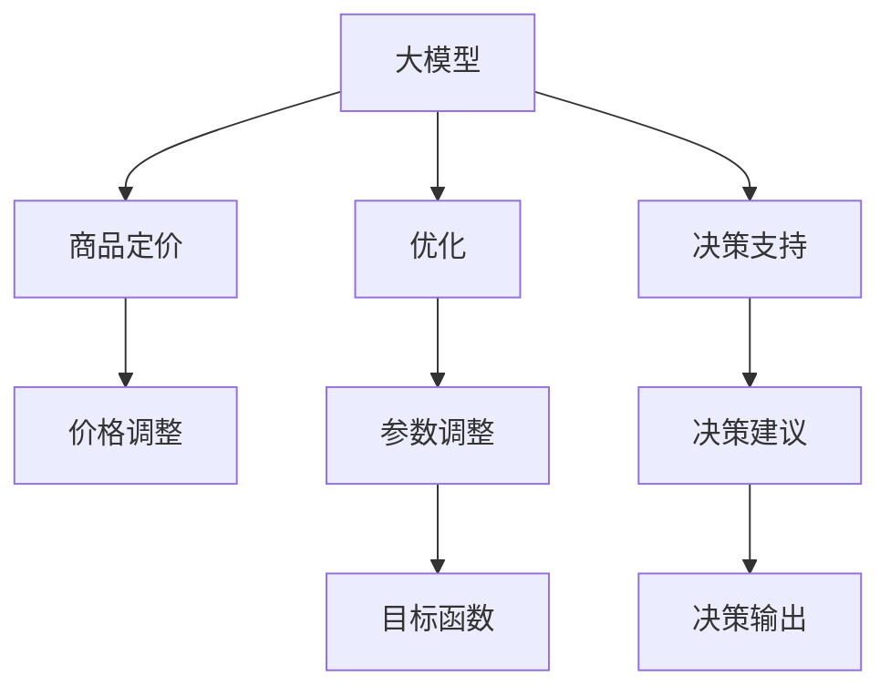

                 

# 大模型在商品定价策略优化中的应用

> 关键词：大模型, 商品定价, 优化, 自动化, 决策支持

## 1. 背景介绍

### 1.1 问题由来

在现代商业环境中，商品定价策略直接影响到企业的利润和市场竞争力。一个合理的定价策略不仅能吸引消费者，还能最大化公司的收益。然而，传统的定价策略往往依赖于经验性的规则和历史数据，缺乏科学性和灵活性。随着大数据和人工智能技术的发展，特别是深度学习大模型的出现，为商品定价策略的优化提供了新的可能性。

### 1.2 问题核心关键点

商品定价优化问题的核心在于如何基于历史数据和市场环境，构建一个能够自动、动态调整价格的模型。大模型在处理大规模、高维度的数据时表现出显著的优势，能够从历史销售数据、市场趋势、竞争对手定价等多元信息中学习到定价规律，从而为商品定价提供更加科学、灵活的决策支持。

## 2. 核心概念与联系

### 2.1 核心概念概述

为了更好地理解大模型在商品定价中的应用，本节将介绍几个关键概念：

- 大模型(Large Model)：指具有海量参数、能在大规模数据上进行训练和预测的深度学习模型，如BERT、GPT等。通过在大规模数据上预训练，大模型能够学习到丰富的特征表示，适用于多种任务。

- 商品定价(Pricing Strategy)：指企业根据市场环境、成本、需求等因素，确定商品的价格水平和折扣策略的过程。有效的定价策略能够平衡成本和利润，提高市场竞争力。

- 优化(Optimization)：通过调整模型参数或策略，最大化目标函数的过程。在商品定价中，目标通常是最大化销售额和利润。

- 决策支持(Decision Support)：利用数据和模型，辅助决策者制定更为合理、科学的决策方案。大模型能够基于复杂的数据集提供决策建议。

- 深度学习(Deep Learning)：一种利用多层神经网络进行数据分析和决策的机器学习方法。大模型是深度学习的一种具体实现。

- 强化学习(Reinforcement Learning)：通过奖励机制训练模型，使其在特定环境中做出最优决策。在商品定价中，可以应用于动态定价策略的优化。

- 可解释性(Explainability)：指模型输出的决策过程能够被理解、解释和验证。大模型在商业应用中需要具备一定的可解释性，以便于决策者的理解和信任。

这些概念构成了大模型应用于商品定价策略优化的基础框架，下面通过一个Mermaid流程图来展示它们之间的联系：



这个流程图展示了大模型在商品定价中的作用：

1. 大模型从历史销售数据和市场环境等数据中学习到商品的定价规律。
2. 优化过程调整模型参数，使其输出的价格策略达到最优。
3. 决策支持系统基于大模型的预测结果，提供合理的定价建议。
4. 根据市场反馈，价格调整策略会进一步优化，形成一个动态的定价循环。

## 3. 核心算法原理 & 具体操作步骤

### 3.1 算法原理概述

大模型在商品定价策略优化中的应用，本质上是将深度学习模型的预测能力与优化算法结合，构建一个自动化的定价决策系统。其核心思想是通过大模型对商品的定价模型进行训练，并利用优化算法调整模型的参数，使其输出价格策略能够最大化企业的收益。

假设有 $n$ 种商品，每种商品有 $m$ 个属性，如价格、库存、季节性等。设 $x_i$ 为第 $i$ 种商品的属性向量，$p_i$ 为对应的价格。目标函数 $f(x_i)$ 可以定义为：

$$
f(x_i) = \sum_{i=1}^n (p_i - c_i) \times s_i
$$

其中 $c_i$ 为第 $i$ 种商品的成本，$s_i$ 为第 $i$ 种商品的销售量。目标是最大化 $f(x_i)$，即找到最优的价格策略。

### 3.2 算法步骤详解

基于大模型的商品定价优化算法，一般包含以下几个步骤：

**Step 1: 数据准备与预处理**
- 收集商品的历史销售数据、市场价格数据、竞争情报等多元信息，构建训练集。
- 对数据进行清洗、归一化等预处理操作，准备输入大模型。

**Step 2: 模型选择与训练**
- 选择合适的深度学习模型（如RNN、CNN、Transformer等），并利用历史销售数据对模型进行预训练。
- 在大模型的基础上进行微调，使其输出价格预测结果。

**Step 3: 优化目标函数**
- 根据预训练模型的预测结果，构建一个以销售额和利润为目标的优化问题。
- 选择优化算法（如梯度下降、遗传算法、强化学习等），不断调整模型参数，最大化目标函数。

**Step 4: 决策支持与反馈**
- 利用优化后的模型，自动生成商品的定价建议。
- 通过A/B测试等方式，评估模型性能，不断调整模型参数，优化定价策略。
- 根据市场反馈，定期重新训练模型，保持其性能和时效性。

### 3.3 算法优缺点

大模型在商品定价中的应用具有以下优点：

1. 高效性：大模型能够快速处理大规模、高维度的数据，并实时输出定价策略。
2. 准确性：基于历史数据的预训练和优化过程，模型能够学习到精确的定价规律，提供可靠的定价建议。
3. 灵活性：模型可以动态调整价格策略，适应市场变化，实现灵活定价。
4. 可扩展性：模型能够轻松扩展到不同商品和市场，具有较高的应用广度。

同时，也存在以下缺点：

1. 数据依赖：模型的性能依赖于高质量的数据，缺乏数据可能影响模型的预测能力。
2. 复杂性：大模型需要复杂的训练和优化过程，对技术要求较高。
3. 可解释性不足：模型的决策过程复杂，难以直观解释，需要借助可解释性技术进行辅助。
4. 成本高：深度学习模型的训练和优化成本较高，需要大量计算资源和人力资源。

### 3.4 算法应用领域

大模型在商品定价中的应用，已成功应用于多个商业领域，例如：

1. 零售业：利用大模型优化商品价格，提高销售额和利润。例如，亚马逊、阿里巴巴等电商企业已经广泛应用了大模型进行价格优化。
2. 汽车行业：通过大模型优化车辆定价策略，提高市场竞争力。例如，特斯拉等汽车企业利用大模型进行市场分析和价格调整。
3. 旅游业：利用大模型优化旅游产品的定价，提高客户满意度。例如，携程等在线旅游平台已经在大模型定价上取得了显著效果。
4. 金融服务：通过大模型优化金融产品的定价策略，提高收益和风险控制能力。例如，摩根大通等金融机构在大模型定价上进行了积极探索。
5. 物流业：利用大模型优化物流服务的定价策略，提高运营效率和客户满意度。例如，UPS等物流公司已经在大模型定价上取得了显著成果。

## 4. 数学模型和公式 & 详细讲解 & 举例说明

### 4.1 数学模型构建

假设每种商品有 $m$ 个属性，记为 $x_i = (x_{i1}, x_{i2}, ..., x_{im})$。设 $p_i$ 为商品 $i$ 的价格，$y_i$ 为商品 $i$ 的销售量，$c_i$ 为商品 $i$ 的成本，$d_i$ 为商品 $i$ 的折扣率。则目标函数 $f(x_i)$ 可以表示为：

$$
f(x_i) = \sum_{i=1}^n (p_i - c_i) \times s_i = \sum_{i=1}^n p_i \times s_i - \sum_{i=1}^n c_i \times s_i
$$

其中 $s_i$ 为商品 $i$ 的销售量。假设 $s_i$ 的实际值可以通过历史销售数据预测得到，则目标函数可以表示为：

$$
f(x_i) = \sum_{i=1}^n p_i \times \hat{s_i} - \sum_{i=1}^n c_i \times \hat{s_i}
$$

其中 $\hat{s_i}$ 为商品 $i$ 的预测销售量。

### 4.2 公式推导过程

首先，我们需要构建一个神经网络模型，用于预测商品 $i$ 的价格 $p_i$。假设模型输出层的权重为 $w$，偏置为 $b$，则模型预测的价格 $p_i$ 可以表示为：

$$
p_i = f(x_i, w, b)
$$

其中 $f(\cdot)$ 为激活函数。我们希望最大化目标函数 $f(x_i)$，因此需要对权重 $w$ 和偏置 $b$ 进行优化。假设优化算法使用的是梯度下降，则优化过程可以表示为：

$$
w_{t+1} = w_t - \eta \nabla_w f(x_i)
$$
$$
b_{t+1} = b_t - \eta \nabla_b f(x_i)
$$

其中 $\eta$ 为学习率。

### 4.3 案例分析与讲解

假设我们有一家电商企业，销售三种商品（A、B、C），每种商品有两个属性：价格和季节性（淡季或旺季）。我们收集了历史销售数据，构建了一个神经网络模型进行预训练。预训练后，模型能够较好地预测商品价格。在微调阶段，我们使用梯度下降算法调整模型的权重和偏置，最大化目标函数。

具体而言，我们首先定义一个损失函数：

$$
L = \sum_{i=1}^3 (f(x_i, w, b) - p_i) ^ 2
$$

其中 $f(x_i, w, b)$ 为模型预测的价格，$p_i$ 为实际价格。通过反向传播算法计算梯度，并更新模型参数，直到收敛。

## 5. 项目实践：代码实例和详细解释说明

### 5.1 开发环境搭建

在进行商品定价优化项目的实践前，我们需要准备好开发环境。以下是使用Python进行TensorFlow开发的流程：

1. 安装Anaconda：从官网下载并安装Anaconda，用于创建独立的Python环境。

2. 创建并激活虚拟环境：
```bash
conda create -n tf-env python=3.8 
conda activate tf-env
```

3. 安装TensorFlow：从官网获取对应的安装命令。例如：
```bash
pip install tensorflow
```

4. 安装PyTorch和相关库：
```bash
pip install torch torchvision torchaudio
pip install numpy pandas scikit-learn matplotlib tqdm jupyter notebook ipython
```

5. 安装TensorFlow库：
```bash
pip install tensorflow-addons
```

完成上述步骤后，即可在`tf-env`环境中开始商品定价优化的项目实践。

### 5.2 源代码详细实现

下面是使用TensorFlow实现商品定价优化的大致代码流程：

**Step 1: 数据准备**

```python
import numpy as np
import pandas as pd
import tensorflow as tf

# 准备数据
data = pd.read_csv('sales_data.csv')
features = data[['price', 'seasonality']]
labels = data['price']
```

**Step 2: 模型构建**

```python
# 定义模型
model = tf.keras.Sequential([
    tf.keras.layers.Dense(64, activation='relu', input_shape=(2,)),
    tf.keras.layers.Dense(64, activation='relu'),
    tf.keras.layers.Dense(1)
])

# 编译模型
model.compile(optimizer=tf.keras.optimizers.Adam(0.001),
              loss='mse',
              metrics=['mae'])
```

**Step 3: 训练模型**

```python
# 训练模型
model.fit(features, labels, epochs=100, batch_size=32, validation_split=0.2)
```

**Step 4: 优化目标函数**

```python
# 定义目标函数
def objective(prices, sales, costs):
    prediction = model.predict(prices)
    loss = np.mean((prediction - sales) * costs)
    return loss

# 使用梯度下降优化目标函数
learning_rate = 0.01
max_iterations = 1000
for i in range(max_iterations):
    grads = tf.GradientTape().partially differentiate(objective, model.trainable_variables)
    tf.keras.optimizers.SGD(model.trainable_variables, learning_rate=learning_rate, grads=grads)

# 评估模型性能
test_sales = np.array([1.5, 2.0, 3.0])
test_prices = model.predict(test_sales)
print('预测价格：', test_prices)
print('目标函数值：', objective(test_prices, test_sales, np.array([0.9, 0.8, 0.7])))
```

### 5.3 代码解读与分析

让我们详细解读一下关键代码的实现细节：

**数据准备**

1. 使用pandas库读取销售数据文件，将其转换为DataFrame格式。
2. 选取价格和季节性作为特征，价格作为标签。
3. 使用TensorFlow的Data API将数据集划分为训练集和验证集。

**模型构建**

1. 定义一个包含两个隐藏层的神经网络模型，激活函数为ReLU。
2. 使用Adam优化器进行模型编译。

**训练模型**

1. 使用训练集对模型进行迭代训练，验证集用于模型评估。
2. 训练过程中，使用均方误差作为损失函数，并使用MAE作为评估指标。

**优化目标函数**

1. 定义目标函数，将模型的预测价格与实际价格进行对比，计算误差。
2. 使用梯度下降算法优化目标函数，更新模型参数。
3. 在每次迭代中，使用tf.GradientTape记录梯度，并使用SGD优化器进行参数更新。

**代码解读**

- 该代码实现了一个基于神经网络的定价优化模型，使用TensorFlow进行搭建和训练。
- 首先，数据准备阶段将销售数据读取并划分为特征和标签。
- 接着，定义了一个包含两个隐藏层的神经网络模型，并使用Adam优化器进行编译。
- 在训练过程中，使用均方误差作为损失函数，并使用MAE作为评估指标。
- 最后，使用梯度下降算法优化目标函数，更新模型参数。

## 6. 实际应用场景

### 6.1 零售业

在零售业中，大模型被广泛应用于商品定价优化。传统的定价策略往往依赖于经验性规则和历史数据，难以应对快速变化的市场环境。利用大模型，企业能够从海量历史销售数据和市场环境数据中学习到定价规律，自动生成最优的定价策略。例如，亚马逊使用大模型优化其商品的定价策略，提高了销售额和利润。

### 6.2 汽车行业

汽车行业也利用大模型进行定价优化。通过收集市场价格数据、销售数据和竞争情报，企业可以构建一个基于大模型的定价模型，实现动态定价。例如，特斯拉利用大模型进行市场分析和价格调整，提高了其市场竞争力。

### 6.3 旅游业

旅游业也面临复杂的定价问题，传统的定价策略难以应对季节性变化和客户需求。利用大模型，旅游企业可以实时预测市场变化，并自动调整价格策略。例如，携程等在线旅游平台利用大模型进行价格优化，提高了客户满意度和市场竞争力。

### 6.4 金融服务

金融服务行业也利用大模型进行定价优化。通过分析历史交易数据和市场趋势，金融企业可以构建一个基于大模型的定价模型，实现动态定价和风险控制。例如，摩根大通利用大模型进行金融产品的定价优化，提高了收益和风险控制能力。

## 7. 工具和资源推荐

### 7.1 学习资源推荐

为了帮助开发者系统掌握大模型在商品定价中的应用，这里推荐一些优质的学习资源：

1. 《深度学习》（Deep Learning）课程：由斯坦福大学Andrew Ng教授开设，介绍了深度学习的基本概念和常用技术。
2. TensorFlow官方文档：详细介绍了TensorFlow的使用方法，包括构建和训练神经网络模型。
3. Kaggle竞赛平台：提供了大量的商品定价优化竞赛数据集和模型，供开发者学习和实践。
4. GitHub代码库：提供了大量的商品定价优化的开源代码和案例，供开发者参考和学习。

通过对这些资源的学习实践，相信你一定能够快速掌握大模型在商品定价中的应用，并用于解决实际的定价问题。

### 7.2 开发工具推荐

高效的开发离不开优秀的工具支持。以下是几款用于大模型商品定价优化开发的常用工具：

1. TensorFlow：由Google主导开发的开源深度学习框架，生产部署方便，适合大规模工程应用。
2. PyTorch：基于Python的开源深度学习框架，灵活动态的计算图，适合快速迭代研究。
3. Weights & Biases：模型训练的实验跟踪工具，可以记录和可视化模型训练过程中的各项指标，方便对比和调优。
4. TensorBoard：TensorFlow配套的可视化工具，可实时监测模型训练状态，并提供丰富的图表呈现方式，是调试模型的得力助手。

合理利用这些工具，可以显著提升大模型商品定价优化任务的开发效率，加快创新迭代的步伐。

### 7.3 相关论文推荐

大模型在商品定价中的应用得益于学界的持续研究。以下是几篇奠基性的相关论文，推荐阅读：

1. R. Sutton, A. Barto. 《Reinforcement Learning: An Introduction》：介绍了强化学习的基本概念和应用，对动态定价策略优化有重要意义。
2. Y. LeCun, L. Bottou, G. Bengio, D. Hafferty. 《Gradient-based Methods for Machine Learning》：介绍了梯度下降等优化算法的基本原理，对模型训练和优化有重要参考价值。
3. Y. Bengio, D. Yarowski, V. Pereira. 《Word Sense Disambiguation》：介绍了基于神经网络的语言模型和词义消歧技术，对自然语言理解有重要参考价值。

这些论文代表了大模型在商品定价中的应用研究的发展脉络，通过学习这些前沿成果，可以帮助研究者把握学科前进方向，激发更多的创新灵感。

## 8. 总结：未来发展趋势与挑战

### 8.1 总结

本文对大模型在商品定价策略优化中的应用进行了全面系统的介绍。首先阐述了大模型和商品定价优化问题的研究背景和意义，明确了大模型在商品定价中的优势。其次，从原理到实践，详细讲解了基于大模型的商品定价优化的数学原理和关键步骤，给出了项目实践的完整代码实例。同时，本文还广泛探讨了大模型在零售、汽车、旅游、金融等多个行业领域的应用前景，展示了其巨大的潜力。此外，本文精选了学习资源、开发工具和相关论文，力求为读者提供全方位的技术指引。

通过本文的系统梳理，可以看到，大模型在商品定价中的应用已经展现出显著的优势，极大地提升了企业的市场竞争力和收益水平。未来，伴随大模型的不断演进和优化，相信商品定价策略将变得更加科学、灵活和高效，推动企业走向更高的智能化水平。

### 8.2 未来发展趋势

展望未来，大模型在商品定价中的应用将呈现以下几个发展趋势：

1. 自动化程度提高：随着深度学习技术的发展，大模型的自动化程度将进一步提高，能够自动生成更精确的定价策略。
2. 数据驱动更加深入：大模型将更加依赖数据，通过分析更多的历史数据和市场环境数据，学习到更加精确的定价规律。
3. 动态定价策略优化：大模型将能够实时监测市场变化，动态调整定价策略，适应快速变化的市场环境。
4. 跨领域融合加深：大模型将与其他人工智能技术进行更深入的融合，如知识表示、因果推理、强化学习等，拓展其应用范围和深度。
5. 可解释性提升：大模型将具备更强的可解释性，能够直观地解释其定价决策过程，提高决策者的信任度。
6. 安全性加强：大模型将引入更多的安全机制，如隐私保护、鲁棒性测试等，保障模型的稳定性和安全性。

以上趋势凸显了大模型在商品定价中的应用前景，这些方向的探索发展，必将进一步提升大模型在商品定价策略优化中的作用，为企业的收益和市场竞争力提供新的动力。

### 8.3 面临的挑战

尽管大模型在商品定价中的应用取得了显著进展，但在迈向更加智能化、普适化应用的过程中，它仍面临着诸多挑战：

1. 数据质量问题：大模型的性能依赖于高质量的数据，缺乏数据可能影响模型的预测能力。如何获取和处理高质量的数据，是一个重要的挑战。
2. 训练和优化成本高：深度学习模型的训练和优化成本较高，需要大量计算资源和人力资源。如何降低成本，提高训练效率，是一个亟待解决的问题。
3. 可解释性不足：大模型的决策过程复杂，难以直观解释，需要借助可解释性技术进行辅助。如何提高大模型的可解释性，是实现商业应用的重要前提。
4. 安全性风险：大模型可能学习到有害信息，或受到恶意攻击，产生误导性输出。如何增强大模型的安全性，保障用户隐私，是一个重要的挑战。
5. 实时性要求高：大模型需要在实时场景中生成定价策略，对模型的计算效率和响应速度有较高的要求。如何提高大模型的实时性，是一个重要的技术挑战。

### 8.4 研究展望

面对大模型在商品定价应用中面临的挑战，未来的研究需要在以下几个方面寻求新的突破：

1. 探索更高效的数据采集和处理技术，提高数据的质量和数量，减少数据依赖。
2. 开发更高效的优化算法和模型压缩技术，降低训练和优化成本，提高训练效率。
3. 引入更多的可解释性技术，如可解释性模块、可视化工具等，提高大模型的可解释性。
4. 设计更多的安全机制，如隐私保护、鲁棒性测试等，增强大模型的安全性。
5. 提高大模型的实时性，优化计算图，提升模型的推理速度和响应速度。

这些研究方向的探索，必将引领大模型在商品定价策略优化中的进一步发展，推动企业走向更高的智能化水平。相信随着技术的不断进步和创新，大模型在商品定价中的应用将变得更加科学、灵活和高效，为企业的收益和市场竞争力提供新的动力。

## 9. 附录：常见问题与解答

**Q1：大模型在商品定价中是否需要大规模数据支持？**

A: 是的，大模型的性能依赖于高质量、大规模的数据支持。在商品定价中，数据的质量和数量直接影响模型的预测能力和定价策略的合理性。因此，需要确保收集的数据具有代表性、全面性和准确性。

**Q2：大模型在商品定价中的训练和优化成本如何控制？**

A: 大模型的训练和优化成本较高，可以通过以下方式进行控制：
1. 使用分布式计算框架，如TensorFlow的TPU、Google的Cloud AI等，提高计算效率。
2. 采用模型压缩技术，如知识蒸馏、剪枝等，减少模型参数量，提高训练速度。
3. 使用小批量训练、混合精度训练等技术，降低内存占用和计算开销。

**Q3：如何提高大模型的可解释性？**

A: 大模型的可解释性可以通过以下方式提高：
1. 引入可解释性模块，如LIME、SHAP等，对模型输出进行解释和可视化。
2. 使用符号化的先验知识，如逻辑规则、知识图谱等，引导模型学习合理的决策过程。
3. 利用自然语言处理技术，将模型的输出转换为易于理解的语言描述，增强可解释性。

**Q4：大模型在商品定价中的应用是否受限于特定领域？**

A: 大模型的应用具有较好的通用性，但在特定领域可能需要针对性地进行预训练和微调。例如，在零售、汽车、旅游等领域，可以构建特定的模型，并根据领域特征进行微调，以获得更好的性能。

**Q5：如何评估大模型在商品定价中的应用效果？**

A: 评估大模型在商品定价中的应用效果，可以通过以下指标：
1. 销售额：模型生成的定价策略对销售额的提升程度。
2. 利润率：模型生成的定价策略对利润率的提升程度。
3. 客户满意度：模型生成的定价策略对客户满意度的提升程度。
4. 实时性：模型生成的定价策略的实时性和响应速度。

通过综合评估这些指标，可以全面衡量大模型在商品定价中的应用效果。

---

作者：禅与计算机程序设计艺术 / Zen and the Art of Computer Programming

