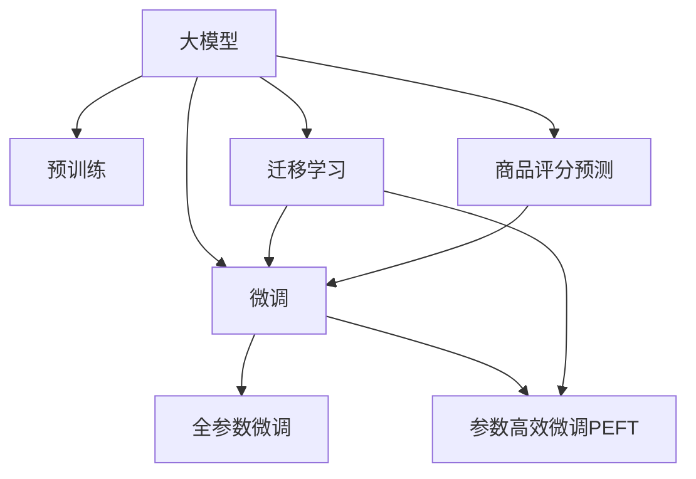

                 

# 大模型在商品评分预测中的实践

## 1. 背景介绍

### 1.1 问题由来

商品评分预测是电子商务领域一个常见的任务，通过预测用户对商品的评分，商家能够更好地了解用户需求，优化商品推荐，提升用户体验，增加销售转化率。传统商品评分预测模型多基于统计学方法，如协同过滤、矩阵分解等，但这些方法通常需要大量的用户行为数据，难以适应数据稀疏、实时性要求高等场景。

近年来，随着深度学习和大模型的发展，基于大模型的商品评分预测成为学术界和工业界的新研究热点。特别是预训练模型(如BERT、GPT等)和基于这些模型的微调方法，已经在商品评分预测领域显示出显著的潜力。

### 1.2 问题核心关键点

大模型在商品评分预测中的应用主要围绕两个核心问题展开：

1. **数据准备与标注**：商品评分预测任务通常需要收集用户行为数据，包括用户与商品之间的交互历史、评分数据等。这些数据可能存在样本不平衡、特征稀疏等问题，因此需要进行预处理和标注。

2. **模型微调**：利用预训练模型作为初始化参数，通过有监督地训练来优化模型在商品评分预测任务上的性能。微调过程中，需要选择合适的模型、损失函数、优化器等，并设置合理的超参数，以确保模型能够泛化到新的数据上。

### 1.3 问题研究意义

利用大模型进行商品评分预测，具有以下重要意义：

1. **数据需求降低**：大模型通常基于大规模无标签文本数据进行预训练，能够从海量数据中提取通用知识，从而在数据量有限的情况下，仍能取得不错的预测效果。

2. **泛化能力强**：大模型通过预训练，具备较强的泛化能力，能够在不同场景下适应新数据，避免过拟合。

3. **实时性提升**：大模型通常具有高效的计算图，能够在实时场景中进行快速推理，满足用户对实时推荐的需求。

4. **应用广泛**：商品评分预测是大模型在NLP任务中的一个重要应用，也是人工智能在商业智能、推荐系统等领域的典型应用场景。

## 2. 核心概念与联系

### 2.1 核心概念概述

为更好地理解大模型在商品评分预测中的应用，本节将介绍几个密切相关的核心概念：

- **大模型**：以自回归(如GPT)或自编码(如BERT)模型为代表的大规模预训练语言模型。通过在大规模无标签文本语料上进行预训练，学习通用的语言表示，具备强大的语言理解和生成能力。

- **预训练**：指在大规模无标签文本语料上，通过自监督学习任务训练通用语言模型的过程。常见的预训练任务包括言语建模、遮挡语言模型等。预训练使得模型学习到语言的通用表示。

- **微调**：指在预训练模型的基础上，使用商品评分预测任务的少量标注数据，通过有监督学习优化模型在特定任务上的性能。通常只需要调整顶层分类器或解码器，并以较小的学习率更新全部或部分的模型参数。

- **迁移学习**：指将一个领域学习到的知识，迁移应用到另一个不同但相关的领域的学习范式。大模型的预训练-微调过程即是一种典型的迁移学习方式。

- **参数高效微调(PEFT)**：指在微调过程中，只更新少量的模型参数，而固定大部分预训练权重不变，以提高微调效率，避免过拟合的方法。

- **商品评分预测**：通过预测用户对商品评分的分布或具体评分值，帮助商家了解用户对商品的满意度，优化商品推荐，提升用户购买决策。

这些核心概念之间的逻辑关系可以通过以下Mermaid流程图来展示：



这个流程图展示了大模型的核心概念及其之间的关系：

1. 大模型通过预训练获得基础能力。
2. 微调是对预训练模型进行任务特定的优化，可以分为全参数微调和参数高效微调（PEFT）。
3. 迁移学习是连接预训练模型与商品评分预测任务的桥梁，可以通过微调或参数高效微调实现。
4. 商品评分预测是大模型在NLP任务中的一个重要应用，也是人工智能在商业智能、推荐系统等领域的典型应用场景。

这些概念共同构成了大模型在商品评分预测中的应用框架，使其能够在特定场景下发挥强大的预测能力。

## 3. 核心算法原理 & 具体操作步骤
### 3.1 算法原理概述

基于大模型的商品评分预测，本质上是一个有监督的细粒度迁移学习过程。其核心思想是：将预训练的大模型视作一个强大的"特征提取器"，通过在商品评分预测任务的标注数据上进行有监督的微调，使得模型输出能够匹配评分分布，从而获得针对该任务优化的模型。

形式化地，假设预训练模型为 $M_{\theta}$，其中 $\theta$ 为预训练得到的模型参数。给定商品评分预测任务 $T$ 的标注数据集 $D=\{(x_i, y_i)\}_{i=1}^N$，其中 $x_i$ 为商品描述，$y_i$ 为真实评分，微调的目标是找到新的模型参数 $\hat{\theta}$，使得：

$$
\hat{\theta}=\mathop{\arg\min}_{\theta} \mathcal{L}(M_{\theta},D)
$$

其中 $\mathcal{L}$ 为针对任务 $T$ 设计的损失函数，用于衡量模型预测输出与真实评分之间的差异。常见的损失函数包括均方误差损失、交叉熵损失等。

通过梯度下降等优化算法，微调过程不断更新模型参数 $\theta$，最小化损失函数 $\mathcal{L}$，使得模型输出逼近真实评分分布。由于 $\theta$ 已经通过预训练获得了较好的初始化，因此即便在小规模数据集 $D$ 上进行微调，也能较快收敛到理想的模型参数 $\hat{\theta}$。

### 3.2 算法步骤详解

基于大模型的商品评分预测一般包括以下几个关键步骤：

**Step 1: 准备预训练模型和数据集**
- 选择合适的预训练语言模型 $M_{\theta}$ 作为初始化参数，如 BERT、GPT等。
- 准备商品评分预测任务的标注数据集 $D$，划分为训练集、验证集和测试集。一般要求标注数据与预训练数据的分布不要差异过大。

**Step 2: 添加任务适配层**
- 根据任务类型，在预训练模型顶层设计合适的输出层和损失函数。
- 对于评分预测任务，通常在顶层添加线性分类器或回归器，并以均方误差为损失函数。
- 也可以引入回归树、神经网络等更复杂的模型进行评分预测。

**Step 3: 设置微调超参数**
- 选择合适的优化算法及其参数，如 AdamW、SGD 等，设置学习率、批大小、迭代轮数等。
- 设置正则化技术及强度，包括权重衰减、Dropout、Early Stopping 等。
- 确定冻结预训练参数的策略，如仅微调顶层，或全部参数都参与微调。

**Step 4: 执行梯度训练**
- 将训练集数据分批次输入模型，前向传播计算损失函数。
- 反向传播计算参数梯度，根据设定的优化算法和学习率更新模型参数。
- 周期性在验证集上评估模型性能，根据性能指标决定是否触发 Early Stopping。
- 重复上述步骤直到满足预设的迭代轮数或 Early Stopping 条件。

**Step 5: 测试和部署**
- 在测试集上评估微调后模型 $M_{\hat{\theta}}$ 的性能，对比微调前后的精度提升。
- 使用微调后的模型对新商品进行评分预测，集成到实际的商品推荐系统中。
- 持续收集新的评分数据，定期重新微调模型，以适应数据分布的变化。

以上是基于大模型的商品评分预测的一般流程。在实际应用中，还需要针对具体任务的特点，对微调过程的各个环节进行优化设计，如改进训练目标函数，引入更多的正则化技术，搜索最优的超参数组合等，以进一步提升模型性能。

### 3.3 算法优缺点

基于大模型的商品评分预测方法具有以下优点：

1. **泛化能力**：大模型通过预训练，具备较强的泛化能力，能够在不同场景下适应新数据，避免过拟合。
2. **参数效率**：利用参数高效微调技术，在固定大部分预训练参数的情况下，仍可取得不错的预测效果。
3. **快速训练**：大模型的计算图高效，能够在实时场景中进行快速推理，满足用户对实时推荐的需求。
4. **数据需求降低**：大模型通常基于大规模无标签文本数据进行预训练，能够从海量数据中提取通用知识，从而在数据量有限的情况下，仍能取得不错的预测效果。

同时，该方法也存在一定的局限性：

1. **数据标注成本**：微调过程需要收集商品评分数据，标注成本较高。
2. **模型鲁棒性不足**：大模型可能存在预训练数据中的偏见，微调后的模型容易在特定场景下过拟合。
3. **可解释性不足**：微调模型缺乏可解释性，难以理解其内部的推理逻辑。
4. **模型复杂度**：大模型通常具有复杂的计算图，需要较高的计算资源进行训练和推理。

尽管存在这些局限性，但就目前而言，基于大模型的微调方法仍是在商品评分预测任务中的主流范式。未来相关研究的重点在于如何进一步降低数据标注成本，提高模型的鲁棒性和可解释性，同时兼顾计算效率和性能提升。

### 3.4 算法应用领域

基于大模型的商品评分预测方法在电子商务领域已经得到了广泛的应用，涵盖了商品推荐、用户行为分析、广告投放等诸多场景，极大地提升了电商平台的运营效率和用户体验。

除了商品评分预测，大模型在电商领域的应用还包括：

- **商品推荐系统**：利用用户的历史行为数据，通过微调模型预测用户可能感兴趣的商品，提升用户的购买体验。
- **用户行为分析**：通过分析用户的评分、评论等数据，理解用户偏好，优化产品设计。
- **广告投放优化**：通过预测广告的效果，优化广告投放策略，提高广告投放的ROI。
- **用户画像构建**：利用用户评分数据，构建用户的综合画像，指导个性化营销。
- **需求预测**：通过分析历史评分数据，预测未来的用户需求，优化库存管理。

这些应用场景展示了基于大模型的商品评分预测方法在电商领域的多样化应用潜力。未来，随着预训练语言模型和微调方法的不断进步，相信该方法将在更多领域得到应用，推动电子商务技术的进一步发展。

## 4. 数学模型和公式 & 详细讲解 & 举例说明
### 4.1 数学模型构建

本节将使用数学语言对基于大模型的商品评分预测过程进行更加严格的刻画。

记预训练语言模型为 $M_{\theta}$，其中 $\theta$ 为预训练得到的模型参数。假设商品评分预测任务的标注数据集为 $D=\{(x_i, y_i)\}_{i=1}^N$，其中 $x_i$ 为商品描述，$y_i$ 为真实评分。

定义模型 $M_{\theta}$ 在数据样本 $(x_i,y_i)$ 上的损失函数为 $\ell(M_{\theta}(x_i),y_i)$，则在数据集 $D$ 上的经验风险为：

$$
\mathcal{L}(\theta) = \frac{1}{N} \sum_{i=1}^N \ell(M_{\theta}(x_i),y_i)
$$

微调的优化目标是最小化经验风险，即找到最优参数：

$$
\theta^* = \mathop{\arg\min}_{\theta} \mathcal{L}(\theta)
$$

在实践中，我们通常使用基于梯度的优化算法（如SGD、Adam等）来近似求解上述最优化问题。设 $\eta$ 为学习率，$\lambda$ 为正则化系数，则参数的更新公式为：

$$
\theta \leftarrow \theta - \eta \nabla_{\theta}\mathcal{L}(\theta) - \eta\lambda\theta
$$

其中 $\nabla_{\theta}\mathcal{L}(\theta)$ 为损失函数对参数 $\theta$ 的梯度，可通过反向传播算法高效计算。

### 4.2 公式推导过程

以下我们以二分类评分预测任务为例，推导均方误差损失函数及其梯度的计算公式。

假设模型 $M_{\theta}$ 在输入 $x_i$ 上的输出为 $\hat{y}=M_{\theta}(x_i) \in \mathbb{R}$，表示商品评分的预测值。真实评分 $y_i \in [0,5]$。则均方误差损失函数定义为：

$$
\ell(M_{\theta}(x_i),y_i) = \frac{1}{2}(y_i - \hat{y})^2
$$

将其代入经验风险公式，得：

$$
\mathcal{L}(\theta) = \frac{1}{N}\sum_{i=1}^N \frac{1}{2}(y_i - M_{\theta}(x_i))^2
$$

根据链式法则，损失函数对参数 $\theta_k$ 的梯度为：

$$
\frac{\partial \mathcal{L}(\theta)}{\partial \theta_k} = -\frac{1}{N}\sum_{i=1}^N (y_i - M_{\theta}(x_i)) \frac{\partial M_{\theta}(x_i)}{\partial \theta_k}
$$

其中 $\frac{\partial M_{\theta}(x_i)}{\partial \theta_k}$ 可进一步递归展开，利用自动微分技术完成计算。

在得到损失函数的梯度后，即可带入参数更新公式，完成模型的迭代优化。重复上述过程直至收敛，最终得到适应商品评分预测任务的最优模型参数 $\theta^*$。

### 4.3 案例分析与讲解

我们以商品推荐系统为例，展示如何使用大模型进行评分预测。

假设一个电商平台希望通过评分预测来优化商品推荐，具体步骤如下：

1. **数据准备**：收集用户的历史评分数据 $D=\{(x_i, y_i)\}_{i=1}^N$，其中 $x_i$ 为商品描述，$y_i$ 为用户对该商品的评分。

2. **预训练模型选择**：选择一个大规模语言模型作为初始化参数，如BERT。

3. **任务适配层设计**：在BERT模型的顶层添加一个线性回归器，输出评分预测值 $\hat{y}$。

4. **损失函数选择**：使用均方误差损失函数，计算预测评分与真实评分之间的差距。

5. **微调超参数设置**：选择AdamW优化器，设置学习率为 $2e-5$，批大小为64，迭代轮数为10。

6. **训练过程**：将数据集 $D$ 分为训练集、验证集和测试集，将训练集输入模型进行前向传播和反向传播，不断更新模型参数。

7. **评估与部署**：在测试集上评估微调后的模型性能，将模型部署到推荐系统中，实时计算用户对新商品的评分预测。

通过以上步骤，电商平台可以基于大模型的微调方法，实现对商品评分的预测，进而优化推荐系统，提升用户体验。

## 5. 项目实践：代码实例和详细解释说明
### 5.1 开发环境搭建

在进行商品评分预测的微调实践前，我们需要准备好开发环境。以下是使用Python进行PyTorch开发的环境配置流程：

1. 安装Anaconda：从官网下载并安装Anaconda，用于创建独立的Python环境。

2. 创建并激活虚拟环境：
```bash
conda create -n pytorch-env python=3.8 
conda activate pytorch-env
```

3. 安装PyTorch：根据CUDA版本，从官网获取对应的安装命令。例如：
```bash
conda install pytorch torchvision torchaudio cudatoolkit=11.1 -c pytorch -c conda-forge
```

4. 安装Transformers库：
```bash
pip install transformers
```

5. 安装各类工具包：
```bash
pip install numpy pandas scikit-learn matplotlib tqdm jupyter notebook ipython
```

完成上述步骤后，即可在`pytorch-env`环境中开始微调实践。

### 5.2 源代码详细实现

下面我们以商品评分预测任务为例，给出使用Transformers库对BERT模型进行微调的PyTorch代码实现。

首先，定义评分预测任务的数据处理函数：

```python
from transformers import BertTokenizer
from torch.utils.data import Dataset
import torch

class RatingDataset(Dataset):
    def __init__(self, texts, scores, tokenizer, max_len=128):
        self.texts = texts
        self.scores = scores
        self.tokenizer = tokenizer
        self.max_len = max_len
        
    def __len__(self):
        return len(self.texts)
    
    def __getitem__(self, item):
        text = self.texts[item]
        score = self.scores[item]
        
        encoding = self.tokenizer(text, return_tensors='pt', max_length=self.max_len, padding='max_length', truncation=True)
        input_ids = encoding['input_ids'][0]
        attention_mask = encoding['attention_mask'][0]
        
        # 对token-wise的评分进行编码
        encoded_scores = [score] * len(encoding['input_ids'])
        labels = torch.tensor(encoded_scores, dtype=torch.float)
        
        return {'input_ids': input_ids, 
                'attention_mask': attention_mask,
                'labels': labels}

# 定义评分与标签的映射
score2id = {f"{i}.0": i for i in range(6)}
id2score = {i: f"{i}.0" for i in range(6)}

# 创建dataset
tokenizer = BertTokenizer.from_pretrained('bert-base-cased')

train_dataset = RatingDataset(train_texts, train_scores, tokenizer)
dev_dataset = RatingDataset(dev_texts, dev_scores, tokenizer)
test_dataset = RatingDataset(test_texts, test_scores, tokenizer)
```

然后，定义模型和优化器：

```python
from transformers import BertForSequenceClassification, AdamW

model = BertForSequenceClassification.from_pretrained('bert-base-cased', num_labels=len(score2id))
optimizer = AdamW(model.parameters(), lr=2e-5)
```

接着，定义训练和评估函数：

```python
from torch.utils.data import DataLoader
from tqdm import tqdm
from sklearn.metrics import mean_squared_error

device = torch.device('cuda') if torch.cuda.is_available() else torch.device('cpu')
model.to(device)

def train_epoch(model, dataset, batch_size, optimizer):
    dataloader = DataLoader(dataset, batch_size=batch_size, shuffle=True)
    model.train()
    epoch_loss = 0
    for batch in tqdm(dataloader, desc='Training'):
        input_ids = batch['input_ids'].to(device)
        attention_mask = batch['attention_mask'].to(device)
        labels = batch['labels'].to(device)
        model.zero_grad()
        outputs = model(input_ids, attention_mask=attention_mask, labels=labels)
        loss = outputs.loss
        epoch_loss += loss.item()
        loss.backward()
        optimizer.step()
    return epoch_loss / len(dataloader)

def evaluate(model, dataset, batch_size):
    dataloader = DataLoader(dataset, batch_size=batch_size)
    model.eval()
    preds, labels = [], []
    with torch.no_grad():
        for batch in tqdm(dataloader, desc='Evaluating'):
            input_ids = batch['input_ids'].to(device)
            attention_mask = batch['attention_mask'].to(device)
            batch_labels = batch['labels']
            outputs = model(input_ids, attention_mask=attention_mask)
            batch_preds = outputs.logits.argmax(dim=2).to('cpu').tolist()
            batch_labels = batch_labels.to('cpu').tolist()
            for pred_tokens, label_tokens in zip(batch_preds, batch_labels):
                pred_scores = [id2score[_id] for _id in pred_tokens]
                label_scores = [id2score[_id] for _id in label_tokens]
                preds.append(pred_scores[:len(label_scores)])
                labels.append(label_scores)
                
    mse = mean_squared_error(labels, preds)
    print(f"Mean Squared Error: {mse:.3f}")
```

最后，启动训练流程并在测试集上评估：

```python
epochs = 5
batch_size = 16

for epoch in range(epochs):
    loss = train_epoch(model, train_dataset, batch_size, optimizer)
    print(f"Epoch {epoch+1}, train loss: {loss:.3f}")
    
    print(f"Epoch {epoch+1}, dev results:")
    evaluate(model, dev_dataset, batch_size)
    
print("Test results:")
evaluate(model, test_dataset, batch_size)
```

以上就是使用PyTorch对BERT进行评分预测任务微调的完整代码实现。可以看到，得益于Transformers库的强大封装，我们可以用相对简洁的代码完成BERT模型的加载和微调。

### 5.3 代码解读与分析

让我们再详细解读一下关键代码的实现细节：

**RatingDataset类**：
- `__init__`方法：初始化文本、评分、分词器等关键组件。
- `__len__`方法：返回数据集的样本数量。
- `__getitem__`方法：对单个样本进行处理，将文本输入编码为token ids，将评分编码为数字，并对其进行定长padding，最终返回模型所需的输入。

**score2id和id2score字典**：
- 定义了评分与数字id之间的映射关系，用于将token-wise的评分结果解码回真实的评分。

**训练和评估函数**：
- 使用PyTorch的DataLoader对数据集进行批次化加载，供模型训练和推理使用。
- 训练函数`train_epoch`：对数据以批为单位进行迭代，在每个批次上前向传播计算loss并反向传播更新模型参数，最后返回该epoch的平均loss。
- 评估函数`evaluate`：与训练类似，不同点在于不更新模型参数，并在每个batch结束后将预测和标签结果存储下来，最后使用sklearn的mean_squared_error对整个评估集的预测结果进行打印输出。

**训练流程**：
- 定义总的epoch数和batch size，开始循环迭代
- 每个epoch内，先在训练集上训练，输出平均loss
- 在验证集上评估，输出平均MSE
- 所有epoch结束后，在测试集上评估，给出最终测试结果

可以看到，PyTorch配合Transformers库使得BERT微调的代码实现变得简洁高效。开发者可以将更多精力放在数据处理、模型改进等高层逻辑上，而不必过多关注底层的实现细节。

当然，工业级的系统实现还需考虑更多因素，如模型的保存和部署、超参数的自动搜索、更灵活的任务适配层等。但核心的微调范式基本与此类似。

## 6. 实际应用场景
### 6.1 智能推荐系统

基于大模型的商品评分预测，可以广泛应用于智能推荐系统的构建。传统推荐系统多依赖用户历史行为数据，难以应对新用户的冷启动问题，且推荐效果易受数据稀疏性的影响。而利用评分预测模型，可以较好地解决这些问题。

在技术实现上，可以收集用户的历史评分数据，将商品描述作为输入，利用微调后的评分预测模型对用户可能感兴趣的商品进行预测。结合用户的行为数据和评分预测结果，可以构建更全面、准确的商品推荐系统。

### 6.2 广告效果预测

广告投放是电商平台的另一重要业务场景，广告效果预测是衡量广告投放效果的重要手段。传统方法多依赖专家规则或手工特征工程，难以全面覆盖复杂的广告效果因素。而利用大模型，可以基于商品评分预测模型，自动学习广告效果的影响因素，并构建广告效果预测模型。

在实践中，可以将广告数据作为输入，利用微调后的评分预测模型对广告效果进行预测。结合广告投放历史数据，可以优化广告投放策略，提高广告投放的ROI。

### 6.3 用户满意度预测

用户满意度是电商平台重要的关注指标之一，通过预测用户的满意度，电商平台可以更好地了解用户需求，优化商品和服务。

在技术实现上，可以收集用户的评分数据，将商品描述作为输入，利用微调后的评分预测模型对用户的满意度进行预测。结合用户的其他行为数据，可以构建更全面的用户画像，指导商家优化商品和服务。

### 6.4 未来应用展望

随着大模型和微调方法的不断发展，基于微调的评分预测技术将在更多领域得到应用，为电商平台的运营带来更大的效益。

在智慧医疗领域，基于评分预测的医疗推荐系统可以帮助医生推荐合适的药物、诊疗方案，提升医疗服务质量。

在智能教育领域，基于评分预测的学习效果评估系统可以帮助教师了解学生的学习状态，优化教学内容和方法。

在智慧城市治理中，基于评分预测的舆情分析系统可以帮助政府了解公众对公共服务的满意度，优化公共服务质量。

此外，在企业生产、社会治理、文娱传媒等众多领域，基于大模型的评分预测方法也将不断涌现，为人工智能技术的应用带来新的机遇。相信随着技术的日益成熟，评分预测技术必将推动人工智能技术在更多领域的落地应用。

## 7. 工具和资源推荐
### 7.1 学习资源推荐

为了帮助开发者系统掌握大模型评分预测的理论基础和实践技巧，这里推荐一些优质的学习资源：

1. 《Transformer从原理到实践》系列博文：由大模型技术专家撰写，深入浅出地介绍了Transformer原理、BERT模型、评分预测技术等前沿话题。

2. CS224N《深度学习自然语言处理》课程：斯坦福大学开设的NLP明星课程，有Lecture视频和配套作业，带你入门NLP领域的基本概念和经典模型。

3. 《Natural Language Processing with Transformers》书籍：Transformers库的作者所著，全面介绍了如何使用Transformers库进行NLP任务开发，包括评分预测在内的诸多范式。

4. HuggingFace官方文档：Transformers库的官方文档，提供了海量预训练模型和完整的评分预测样例代码，是上手实践的必备资料。

5. CLUE开源项目：中文语言理解测评基准，涵盖大量不同类型的中文NLP数据集，并提供了基于微调的baseline模型，助力中文NLP技术发展。

通过对这些资源的学习实践，相信你一定能够快速掌握大模型评分预测的精髓，并用于解决实际的评分预测问题。
###  7.2 开发工具推荐

高效的开发离不开优秀的工具支持。以下是几款用于大模型评分预测开发的常用工具：

1. PyTorch：基于Python的开源深度学习框架，灵活动态的计算图，适合快速迭代研究。大部分预训练语言模型都有PyTorch版本的实现。

2. TensorFlow：由Google主导开发的开源深度学习框架，生产部署方便，适合大规模工程应用。同样有丰富的预训练语言模型资源。

3. Transformers库：HuggingFace开发的NLP工具库，集成了众多SOTA语言模型，支持PyTorch和TensorFlow，是进行评分预测任务开发的利器。

4. Weights & Biases：模型训练的实验跟踪工具，可以记录和可视化模型训练过程中的各项指标，方便对比和调优。与主流深度学习框架无缝集成。

5. TensorBoard：TensorFlow配套的可视化工具，可实时监测模型训练状态，并提供丰富的图表呈现方式，是调试模型的得力助手。

6. Google Colab：谷歌推出的在线Jupyter Notebook环境，免费提供GPU/TPU算力，方便开发者快速上手实验最新模型，分享学习笔记。

合理利用这些工具，可以显著提升大模型评分预测的开发效率，加快创新迭代的步伐。

### 7.3 相关论文推荐

大模型评分预测技术的发展源于学界的持续研究。以下是几篇奠基性的相关论文，推荐阅读：

1. Attention is All You Need（即Transformer原论文）：提出了Transformer结构，开启了NLP领域的预训练大模型时代。

2. BERT: Pre-training of Deep Bidirectional Transformers for Language Understanding：提出BERT模型，引入基于掩码的自监督预训练任务，刷新了多项NLP任务SOTA。

3. Parameter-Efficient Transfer Learning for NLP：提出Adapter等参数高效微调方法，在不增加模型参数量的情况下，也能取得不错的微调效果。

4. Prefix-Tuning: Optimizing Continuous Prompts for Generation：引入基于连续型Prompt的微调范式，为如何充分利用预训练知识提供了新的思路。

5. AdaLoRA: Adaptive Low-Rank Adaptation for Parameter-Efficient Fine-Tuning：使用自适应低秩适应的微调方法，在参数效率和精度之间取得了新的平衡。

这些论文代表了大模型评分预测技术的发展脉络。通过学习这些前沿成果，可以帮助研究者把握学科前进方向，激发更多的创新灵感。

## 8. 总结：未来发展趋势与挑战

### 8.1 总结

本文对基于大模型的商品评分预测方法进行了全面系统的介绍。首先阐述了商品评分预测任务的由来和核心关键点，明确了微调在商品评分预测中的应用。其次，从原理到实践，详细讲解了评分预测的数学原理和关键步骤，给出了评分预测任务开发的完整代码实例。同时，本文还广泛探讨了评分预测方法在智能推荐、广告投放、用户满意度预测等多个电商领域的应用前景，展示了评分预测技术在电商领域的多样化应用潜力。

通过本文的系统梳理，可以看到，基于大模型的评分预测方法正在成为电商领域的重要范式，极大地拓展了预训练语言模型的应用边界，催生了更多的落地场景。受益于大规模语料的预训练，评分预测模型以更低的时间和标注成本，在数据量有限的情况下，仍能取得不错的预测效果。未来，伴随预训练语言模型和微调方法的不断进步，相信评分预测方法将在更多领域得到应用，推动电商技术的进一步发展。

### 8.2 未来发展趋势

展望未来，大模型评分预测技术将呈现以下几个发展趋势：

1. **模型规模持续增大**：随着算力成本的下降和数据规模的扩张，预训练语言模型的参数量还将持续增长。超大规模语言模型蕴含的丰富语言知识，有望支撑更加复杂多变的评分预测任务。

2. **微调方法日趋多样**：除了传统的全参数微调外，未来会涌现更多参数高效的微调方法，如Prefix-Tuning、LoRA等，在节省计算资源的同时也能保证评分预测精度。

3. **持续学习成为常态**：随着数据分布的不断变化，评分预测模型也需要持续学习新知识以保持性能。如何在不遗忘原有知识的同时，高效吸收新样本信息，将成为重要的研究课题。

4. **标注样本需求降低**：受启发于提示学习(Prompt-based Learning)的思路，未来的评分预测方法将更好地利用大模型的语言理解能力，通过更加巧妙的任务描述，在更少的标注样本上也能实现理想的评分预测效果。

5. **多模态评分预测崛起**：当前的评分预测模型通常只聚焦于文本数据，未来会进一步拓展到图像、视频、语音等多模态数据评分预测。多模态信息的融合，将显著提升语言模型对现实世界的理解和建模能力。

6. **模型通用性增强**：经过海量数据的预训练和多领域任务的微调，评分预测模型将具备更强大的常识推理和跨领域迁移能力，逐步迈向通用人工智能(AGI)的目标。

以上趋势凸显了大模型评分预测技术的广阔前景。这些方向的探索发展，必将进一步提升评分预测系统的性能和应用范围，为电商平台运营带来更大的效益。

### 8.3 面临的挑战

尽管大模型评分预测技术已经取得了瞩目成就，但在迈向更加智能化、普适化应用的过程中，它仍面临着诸多挑战：

1. **标注成本瓶颈**：评分预测任务通常需要收集商品评分数据，标注成本较高。如何进一步降低评分预测对标注样本的依赖，将是一大难题。

2. **模型鲁棒性不足**：大模型可能存在预训练数据中的偏见，评分预测模型容易在特定场景下过拟合。如何提高评分预测模型的鲁棒性，避免灾难性遗忘，还需要更多理论和实践的积累。

3. **推理效率有待提高**：大模型通常具有复杂的计算图，需要较高的计算资源进行训练和推理。如何在保证性能的同时，简化模型结构，提升推理速度，优化资源占用，将是重要的优化方向。

4. **可解释性亟需加强**：评分预测模型缺乏可解释性，难以理解其内部的推理逻辑。对于医疗、金融等高风险应用，算法的可解释性和可审计性尤为重要。

5. **安全性有待保障**：评分预测模型容易学习到有偏见、有害的信息，通过评分预测传递到商品推荐系统，产生误导性、歧视性的输出，给实际应用带来安全隐患。

6. **知识整合能力不足**：现有的评分预测模型往往局限于文本数据，难以灵活吸收和运用更广泛的先验知识。如何让评分预测过程更好地与外部知识库、规则库等专家知识结合，形成更加全面、准确的信息整合能力，还有很大的想象空间。

正视评分预测面临的这些挑战，积极应对并寻求突破，将是大模型评分预测走向成熟的必由之路。相信随着学界和产业界的共同努力，这些挑战终将一一被克服，评分预测技术必将引领电商平台的运营发展，推动人工智能技术的进一步普及。

### 8.4 研究展望

面对大模型评分预测所面临的种种挑战，未来的研究需要在以下几个方面寻求新的突破：

1. **探索无监督和半监督评分预测方法**：摆脱对大规模标注数据的依赖，利用自监督学习、主动学习等无监督和半监督范式，最大限度利用非结构化数据，实现更加灵活高效的评分预测。

2. **研究参数高效和计算高效的评分预测范式**：开发更加参数高效的评分预测方法，在固定大部分预训练参数的同时，只更新极少量的评分预测相关参数。同时优化评分预测模型的计算图，减少前向传播和反向传播的资源消耗，实现更加轻量级、实时性的部署。

3. **融合因果和对比学习范式**：通过引入因果推断和对比学习思想，增强评分预测模型建立稳定因果关系的能力，学习更加普适、鲁棒的语言表征，从而提升模型泛化性和抗干扰能力。

4. **引入更多先验知识**：将符号化的先验知识，如知识图谱、逻辑规则等，与神经网络模型进行巧妙融合，引导评分预测过程学习更准确、合理的语言模型。同时加强不同模态数据的整合，实现视觉、语音等多模态信息与文本信息的协同建模。

5. **结合因果分析和博弈论工具**：将因果分析方法引入评分预测模型，识别出模型决策的关键特征，增强输出解释的因果性和逻辑性。借助博弈论工具刻画人机交互过程，主动探索并规避模型的脆弱点，提高系统稳定性。

6. **纳入伦理道德约束**：在评分预测模型训练目标中引入伦理导向的评估指标，过滤和惩罚有偏见、有害的输出倾向。同时加强人工干预和审核，建立模型行为的监管机制，确保输出符合人类价值观和伦理道德。

这些研究方向的探索，必将引领大模型评分预测技术迈向更高的台阶，为构建安全、可靠、可解释、可控的智能系统铺平道路。面向未来，大模型评分预测技术还需要与其他人工智能技术进行更深入的融合，如知识表示、因果推理、强化学习等，多路径协同发力，共同推动自然语言理解和智能交互系统的进步。只有勇于创新、敢于突破，才能不断拓展语言模型的边界，让智能技术更好地造福人类社会。

## 9. 附录：常见问题与解答

**Q1：大模型在评分预测中是否适用？**

A: 大模型在评分预测中的应用非常广泛，特别是在数据量较小或数据分布不平衡的场景中，其泛化能力和参数效率使其成为首选。但需要注意的是，大模型通常基于大规模无标签文本数据进行预训练，对于某些特定领域的评分预测任务，如医疗、法律等，可能需要进行额外的领域适应微调。

**Q2：如何选择合适的评分预测模型？**

A: 评分预测模型的选择应根据具体任务和数据特点进行。一般来说，如果数据量较大且标注成本较低，可以考虑使用全参数微调的方法，如BERT、GPT等；如果数据量较小且标注成本较高，可以尝试使用参数高效微调的方法，如Adapter、Prefix等。

**Q3：评分预测过程中如何进行数据增强？**

A: 数据增强是提高评分预测模型性能的重要手段。常见的数据增强方法包括：
1. 数据重采样：通过重复采样或随机采样等方法，增加训练数据的多样性。
2. 文本噪声注入：在输入文本中加入噪声，如回译、近义替换等，增加模型的鲁棒性。
3. 生成新数据：利用生成模型，生成与训练集相似的新数据，增加训练集大小。
4. 对抗样本训练：引入对抗样本，提高模型的鲁棒性和泛化能力。

**Q4：评分预测过程中如何进行参数高效微调？**

A: 参数高效微调可以显著减少评分预测模型的参数量，提高计算效率。常见的参数高效微调方法包括：
1. Adapter：在预训练模型中引入可训练的参数向量，固定大部分参数，只微调这部分向量。
2. Prefix-Tuning：只微调预训练模型的顶层，保留底层参数不变。
3. LoRA：通过低秩分解的方式，只微调预训练模型的部分参数，其余部分保持不变。

**Q5：评分预测模型在落地部署时需要注意哪些问题？**

A: 将评分预测模型转化为实际应用，还需要考虑以下因素：
1. 模型裁剪：去除不必要的层和参数，减小模型尺寸，加快推理速度。
2. 量化加速：将浮点模型转为定点模型，压缩存储空间，提高计算效率。
3. 服务化封装：将模型封装为标准化服务接口，便于集成调用。
4. 弹性伸缩：根据请求流量动态调整资源配置，平衡服务质量和成本。
5. 监控告警：实时采集系统指标，设置异常告警阈值，确保服务稳定性。
6. 安全防护：采用访问鉴权、数据脱敏等措施，保障数据和模型安全。

大模型评分预测为电商平台的评分预测任务提供了新的解决方案，但如何将强大的性能转化为稳定、高效、安全的业务价值，还需要工程实践的不断打磨。唯有从数据、算法、工程、业务等多个维度协同发力，才能真正实现人工智能技术在垂直行业的规模化落地。总之，评分预测需要开发者根据具体任务，不断迭代和优化模型、数据和算法，方能得到理想的效果。

---

作者：禅与计算机程序设计艺术 / Zen and the Art of Computer Programming

