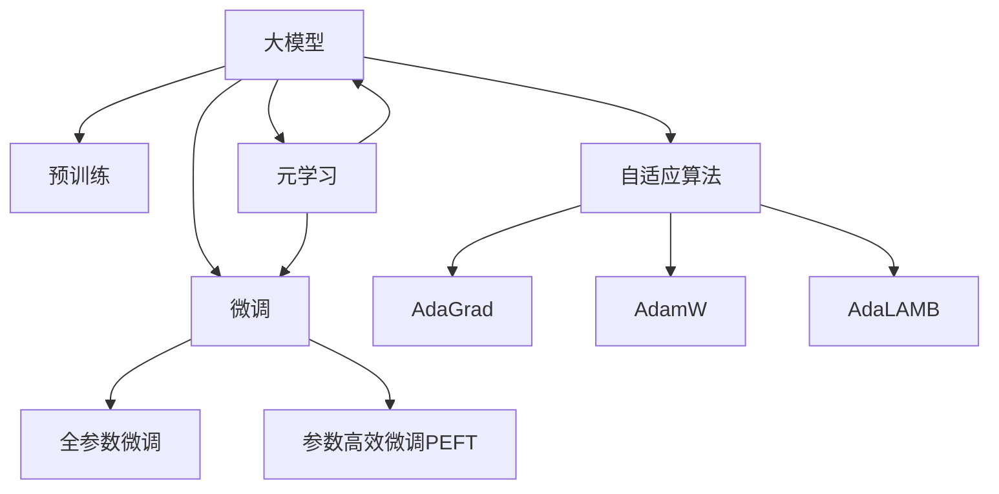

                 

# 大模型在推荐系统中的元学习迁移应用

> 关键词：大模型,元学习,迁移学习,推荐系统,自适应算法,深度学习,深度推荐系统

## 1. 背景介绍

### 1.1 问题由来

推荐系统在现代信息时代扮演着至关重要的角色，通过个性化推荐技术，为每一个用户量身定制其可能感兴趣的内容，极大提升了用户体验。传统的推荐系统基于用户的历史行为数据进行推荐，但随着数据分布的不断变化，如何提高推荐系统的实时性和鲁棒性，一直是推荐系统研究的重要课题。

近年来，随着深度学习技术的发展，尤其是大模型的广泛应用，推荐系统在技术上取得了突破。通过在大规模用户数据上进行预训练，获得通用的用户兴趣表征，再通过微调获得特定场景下的推荐效果，这一大模型推荐方法在电商、视频、新闻等领域取得了卓越的效果。然而，由于预训练和微调过程中存在较大数据量和计算成本，如何更高效地构建推荐系统，仍是当前面临的一个关键问题。

### 1.2 问题核心关键点

推荐系统的大模型方法，主要分为预训练和微调两个步骤。具体步骤如下：

1. **预训练步骤**：收集大规模历史用户行为数据，通过自监督学习任务(如用户行为预测、事件分类等)对大模型进行预训练，学习通用的用户兴趣表征。
2. **微调步骤**：针对具体的推荐场景，通过少量标注数据进行有监督微调，优化模型在特定推荐任务上的性能。

预训练和微调相结合的方法，可以在提高推荐效果的同时，显著降低对标注数据的依赖，但预训练和微调过程中的大规模数据和计算资源开销，仍然是一个主要瓶颈。为了进一步提升推荐系统的效果和效率，元学习(元搜索、元优化等)方法应运而生。

元学习通过学习通用的优化策略，使模型能够适应新的数据分布和任务，实现泛化能力更强、训练速度更快的推荐系统。本文将从元学习的角度，探讨大模型在推荐系统中的应用，提出一种基于元学习的推荐系统构建方法，并详细讲解其核心算法原理、操作步骤以及具体实现。

## 2. 核心概念与联系

### 2.1 核心概念概述

为更好地理解基于元学习的大模型推荐系统，我们首先介绍几个核心概念：

- **大模型**：指具有大规模参数量和计算能力的深度学习模型，如BERT、GPT、Transformer等。大模型通过在大规模数据上进行预训练，获得了广泛的领域知识。
- **元学习**：指学习通用的学习策略，使得模型能够在新的任务和数据上快速适应的过程。在推荐系统中，元学习可以被用于训练适应新用户兴趣的推荐模型。
- **迁移学习**：指通过已有知识，在新任务上进行迁移学习，减少新任务的学习成本。大模型的预训练和微调过程可以看作是一种迁移学习方式。
- **自适应算法**：指能够根据任务和数据特点动态调整模型参数的优化算法，如AdaGrad、AdamW、AdaLAMB等。自适应算法能够使模型在新数据上快速收敛，适应任务变化。
- **深度推荐系统**：基于深度学习技术的推荐系统，能够自动提取用户行为特征，学习高维的兴趣表征，进行个性化推荐。

这些概念之间的联系可以通过以下Mermaid流程图来展示：



这个流程图展示了大模型的核心概念及其之间的关系：

1. 大模型通过预训练获得基础能力。
2. 微调是对预训练模型进行任务特定的优化，可以分为全参数微调和参数高效微调（PEFT）。
3. 元学习是一种通用优化策略，可以在预训练和微调过程中使用。
4. 自适应算法能够使模型根据任务和数据进行动态调整。
5. 深度推荐系统是应用大模型推荐方法的一种形式。

这些概念共同构成了大模型在推荐系统中的学习和应用框架，使得推荐系统具备更强的自适应性和泛化能力。

## 3. 核心算法原理 & 具体操作步骤
### 3.1 算法原理概述

基于元学习的大模型推荐系统，通过学习通用的优化策略，使模型能够适应新的数据分布和任务，实现泛化能力更强、训练速度更快的推荐系统。其核心思想是：在预训练和微调过程中，通过元学习算法动态调整优化策略，使得模型能够高效适应新任务，减少对标注数据的依赖，提升推荐效果。

形式化地，假设预训练语言模型为 $M_{\theta}$，其中 $\theta$ 为预训练得到的模型参数。给定推荐任务 $T$ 的标注数据集 $D=\{(x_i,y_i)\}_{i=1}^N, x_i \in \mathcal{X}, y_i \in \mathcal{Y}$，其中 $\mathcal{X}$ 为输入空间，$\mathcal{Y}$ 为输出空间。假设在推荐任务 $T$ 上，有少量标注数据 $\mathcal{D}=\{(x_i,y_i)\}_{i=1}^M$，其中 $M \ll N$。

定义模型 $M_{\theta}$ 在输入 $x$ 上的推荐函数为 $\hat{y}=M_{\theta}(x) \in [0,1]$，表示样本属于某一推荐类型的概率。在推荐任务 $T$ 上，模型输出的目标函数为 $\ell(\hat{y},y)$，用于衡量推荐结果与真实标签之间的差异。

元学习算法 $A$ 的目标是最小化推荐误差，即找到最优参数 $\theta^*$ 和最优元策略 $\alpha^*$：

$$
(\theta^*, \alpha^*)=\mathop{\arg\min}_{\theta,\alpha} \sum_{i=1}^M \ell(M_{\theta}, y_i) + R(\alpha)
$$

其中 $R(\alpha)$ 为元策略的损失函数，用于衡量元策略的优化效果。元策略 $A$ 根据当前的任务和数据动态调整优化参数，使得模型能够快速适应新任务。

### 3.2 算法步骤详解

基于元学习的大模型推荐系统主要包括以下几个关键步骤：

**Step 1: 准备预训练模型和数据集**
- 选择合适的预训练语言模型 $M_{\theta}$ 作为初始化参数，如 BERT、GPT 等。
- 准备推荐任务 $T$ 的标注数据集 $D$，划分为训练集、验证集和测试集。一般要求标注数据与预训练数据的分布不要差异过大。

**Step 2: 设计元学习算法**
- 选择合适的元学习算法 $A$，如自适应梯度算法(AdaGrad、AdamW)、元梯度算法(MAML)等。
- 定义元策略 $A$ 的更新公式，如：
  - 自适应梯度算法：$A(\alpha) \leftarrow A(\alpha) - \eta \nabla_\alpha \mathcal{L}(M_{\theta},\alpha)$
  - 元梯度算法：$A(\alpha) \leftarrow A(\alpha) - \eta \nabla_\alpha \mathcal{L}(M_{\theta},\alpha) - \eta R(A(\alpha))$

**Step 3: 初始化元策略和优化器**
- 初始化元策略 $\alpha_0$，通常使用随机或均匀分布进行初始化。
- 初始化优化器 $\eta$，选择合适的学习率。

**Step 4: 迭代训练**
- 对推荐任务 $T$ 的标注数据 $\mathcal{D}$ 进行迭代训练，更新模型参数 $\theta$ 和元策略 $\alpha$。
- 在每次迭代中，使用元策略 $\alpha$ 更新优化器 $\eta$，使用更新后的优化器对模型 $M_{\theta}$ 进行梯度下降。
- 计算当前元策略的损失 $R(\alpha)$，并更新元策略 $\alpha$。

**Step 5: 测试和部署**
- 在测试集上评估微调后模型 $M_{\theta}$ 的推荐效果，对比微调前后的精度提升。
- 使用微调后的模型对新样本进行推荐，集成到实际的应用系统中。
- 持续收集新的数据，定期重新微调模型，以适应数据分布的变化。

以上是基于元学习的大模型推荐系统的基本流程。在实际应用中，还需要针对具体任务的特点，对元学习算法和优化器的参数进行调优，以进一步提升推荐效果。

### 3.3 算法优缺点

基于元学习的大模型推荐系统具有以下优点：
1. 泛化能力强。元学习算法能够使模型在新的数据分布和任务上快速适应，泛化能力更强。
2. 训练速度快。元学习算法能够动态调整优化策略，使模型能够快速收敛，训练速度更快。
3. 减少标注样本需求。元学习算法通过学习通用的优化策略，能够在更少标注数据的情况下实现有效的微调。
4. 模型结构灵活。元学习算法可以在不增加模型复杂度的情况下，提升模型适应性。

同时，该方法也存在一定的局限性：
1. 算法复杂度高。元学习算法需要额外的元优化过程，计算复杂度较高。
2. 对数据分布敏感。元学习算法对数据分布变化敏感，难以保证在所有数据上的泛化性能。
3. 模型解释性不足。元学习算法的内部决策过程复杂，难以解释。
4. 资源需求大。元学习算法需要更多的计算资源，包括GPU/TPU等高性能设备。

尽管存在这些局限性，但元学习技术在大模型推荐系统中的应用，极大地提升了推荐系统的效果和效率，为推荐系统的高效部署和实时响应提供了新的可能。

### 3.4 算法应用领域

基于大模型推荐系统的元学习技术，在推荐系统中已经得到了广泛的应用，涵盖了电商、视频、新闻等多个推荐场景，如：

- 电商推荐：基于用户行为数据，推荐用户可能感兴趣的电商商品。
- 新闻推荐：根据用户阅读历史，推荐相关新闻内容。
- 视频推荐：根据用户观看历史，推荐视频内容。
- 社交推荐：根据用户社交关系和互动数据，推荐社交内容。

除了这些经典任务外，元学习技术还拓展到了更多场景中，如可控推荐、协同过滤、广告推荐等，为推荐系统带来了新的突破。随着元学习技术的不断进步，基于大模型的推荐系统将在更多领域得到应用，为推荐技术的发展提供新的动力。

## 4. 数学模型和公式 & 详细讲解
### 4.1 数学模型构建

本节将使用数学语言对基于元学习的大模型推荐系统进行更加严格的刻画。

记预训练语言模型为 $M_{\theta}$，其中 $\theta$ 为预训练得到的模型参数。假设推荐任务 $T$ 的标注数据集为 $D=\{(x_i,y_i)\}_{i=1}^M, x_i \in \mathcal{X}, y_i \in \mathcal{Y}$，其中 $\mathcal{X}$ 为输入空间，$\mathcal{Y}$ 为输出空间。

定义模型 $M_{\theta}$ 在输入 $x$ 上的推荐函数为 $\hat{y}=M_{\theta}(x) \in [0,1]$，表示样本属于某一推荐类型的概率。在推荐任务 $T$ 上，模型输出的目标函数为 $\ell(\hat{y},y)$，用于衡量推荐结果与真实标签之间的差异。

元学习算法 $A$ 的目标是最小化推荐误差，即找到最优参数 $\theta^*$ 和最优元策略 $\alpha^*$：

$$
(\theta^*, \alpha^*)=\mathop{\arg\min}_{\theta,\alpha} \sum_{i=1}^M \ell(M_{\theta}, y_i) + R(\alpha)
$$

其中 $R(\alpha)$ 为元策略的损失函数，用于衡量元策略的优化效果。

### 4.2 公式推导过程

以下我们以电商推荐任务为例，推导基于元学习的推荐模型的损失函数及其梯度计算公式。

假设模型 $M_{\theta}$ 在输入 $x$ 上的推荐概率为 $\hat{y}=M_{\theta}(x) \in [0,1]$，表示样本属于某一电商商品的推荐概率。假设 $y \in \{1,0\}$ 为推荐结果。则电商推荐任务的交叉熵损失函数为：

$$
\ell(M_{\theta}(x),y) = -[y\log \hat{y} + (1-y)\log (1-\hat{y})]
$$

将其代入元学习目标公式，得：

$$
(\theta^*, \alpha^*)=\mathop{\arg\min}_{\theta,\alpha} \sum_{i=1}^M \ell(M_{\theta}(x_i),y_i) + R(\alpha)
$$

在训练过程中，元学习算法 $A$ 的目标是找到一个最优元策略 $\alpha^*$，使得在当前的任务 $T$ 上，元策略 $\alpha$ 能够使模型 $M_{\theta}$ 具有更好的推荐性能。因此，元学习算法 $A$ 需要计算模型 $M_{\theta}$ 在当前元策略 $\alpha$ 下的推荐误差 $\mathcal{L}(\theta,\alpha)$，并最小化该误差：

$$
\mathcal{L}(\theta,\alpha) = \sum_{i=1}^M \ell(M_{\theta}(x_i),y_i) + R(\alpha)
$$

为了计算模型 $M_{\theta}$ 在元策略 $\alpha$ 下的推荐误差 $\mathcal{L}(\theta,\alpha)$，需要对模型 $M_{\theta}$ 进行前向传播和后向传播计算。

假设元学习算法 $A$ 更新元策略 $\alpha$ 的方法为：

$$
A(\alpha) \leftarrow A(\alpha) - \eta \nabla_\alpha \mathcal{L}(\theta,\alpha) - \eta R(A(\alpha))
$$

其中 $\nabla_\alpha \mathcal{L}(\theta,\alpha)$ 为损失函数 $\mathcal{L}(\theta,\alpha)$ 对元策略 $\alpha$ 的梯度。

为了计算 $\nabla_\alpha \mathcal{L}(\theta,\alpha)$，需要对元策略 $\alpha$ 进行优化。假设元策略 $\alpha$ 的优化过程为：

$$
\nabla_\alpha \mathcal{L}(\theta,\alpha) = \nabla_\alpha \sum_{i=1}^M \ell(M_{\theta}(x_i),y_i) + \nabla_\alpha R(\alpha)
$$

其中 $\nabla_\alpha \ell(\hat{y},y)$ 为交叉熵损失函数对元策略 $\alpha$ 的梯度。

由于 $\nabla_\alpha \ell(\hat{y},y)$ 可以通过反向传播高效计算，因此计算 $\nabla_\alpha \mathcal{L}(\theta,\alpha)$ 的主要任务变为计算 $\nabla_\alpha R(\alpha)$。由于 $R(\alpha)$ 通常难以直接计算，常用的方法包括使用梯度下降法、梯度累积法等。

在得到元策略 $\alpha$ 的梯度后，即可带入元策略更新公式，完成模型的迭代优化。重复上述过程直至收敛，最终得到适应当前电商推荐任务的最优模型参数 $\theta^*$ 和元策略 $\alpha^*$。

## 5. 项目实践：代码实例和详细解释说明
### 5.1 开发环境搭建

在进行元学习推荐系统实践前，我们需要准备好开发环境。以下是使用Python进行PyTorch开发的环境配置流程：

1. 安装Anaconda：从官网下载并安装Anaconda，用于创建独立的Python环境。

2. 创建并激活虚拟环境：
```bash
conda create -n pytorch-env python=3.8 
conda activate pytorch-env
```

3. 安装PyTorch：根据CUDA版本，从官网获取对应的安装命令。例如：
```bash
conda install pytorch torchvision torchaudio cudatoolkit=11.1 -c pytorch -c conda-forge
```

4. 安装Transformers库：
```bash
pip install transformers
```

5. 安装各类工具包：
```bash
pip install numpy pandas scikit-learn matplotlib tqdm jupyter notebook ipython
```

完成上述步骤后，即可在`pytorch-env`环境中开始元学习推荐系统实践。

### 5.2 源代码详细实现

这里我们以电商推荐任务为例，给出使用Transformers库对BERT模型进行元学习推荐的PyTorch代码实现。

首先，定义电商推荐任务的数学模型：

```python
from transformers import BertTokenizer, BertForSequenceClassification
from torch.utils.data import Dataset
import torch
import torch.nn.functional as F

class RecommenderDataset(Dataset):
    def __init__(self, texts, labels, tokenizer, max_len=128):
        self.texts = texts
        self.labels = labels
        self.tokenizer = tokenizer
        self.max_len = max_len
        
    def __len__(self):
        return len(self.texts)
    
    def __getitem__(self, item):
        text = self.texts[item]
        label = self.labels[item]
        
        encoding = self.tokenizer(text, return_tensors='pt', max_length=self.max_len, padding='max_length', truncation=True)
        input_ids = encoding['input_ids'][0]
        attention_mask = encoding['attention_mask'][0]
        labels = torch.tensor(label, dtype=torch.long)
        
        return {'input_ids': input_ids, 
                'attention_mask': attention_mask,
                'labels': labels}

# 标签与id的映射
label2id = {'positive': 1, 'negative': 0}
id2label = {v: k for k, v in label2id.items()}

# 创建dataset
tokenizer = BertTokenizer.from_pretrained('bert-base-cased')

train_dataset = RecommenderDataset(train_texts, train_labels, tokenizer)
dev_dataset = RecommenderDataset(dev_texts, dev_labels, tokenizer)
test_dataset = RecommenderDataset(test_texts, test_labels, tokenizer)
```

然后，定义元学习算法和优化器：

```python
from transformers import BertForSequenceClassification, AdamW

model = BertForSequenceClassification.from_pretrained('bert-base-cased', num_labels=2)

optimizer = AdamW(model.parameters(), lr=2e-5)
alpha_optimizer = AdamW(model.parameters(), lr=1e-3) # 元学习优化器

def compute_loss(model, dataset, device):
    model.to(device)
    model.eval()
    loss = 0
    correct = 0
    for batch in dataset:
        input_ids = batch['input_ids'].to(device)
        attention_mask = batch['attention_mask'].to(device)
        labels = batch['labels'].to(device)
        outputs = model(input_ids, attention_mask=attention_mask, labels=labels)
        loss += F.cross_entropy(outputs.logits, labels)
        preds = outputs.logits.argmax(dim=1)
        correct += (preds == labels).sum().item()
    return loss / len(dataset), correct / len(dataset)
```

接着，定义元学习算法和损失函数：

```python
from torch.optim.lr_scheduler import StepLR

def update_learning_rate(optimizer, epoch):
    if epoch % 10 == 0:
        lr = optimizer.param_groups[0]['lr']
        optimizer.param_groups[0]['lr'] = lr * 0.1
        print(f'Learning rate updated to {lr * 0.1}')
    
def calculate_meta_loss(model, dataset, device):
    model.to(device)
    model.eval()
    meta_loss = 0
    for batch in dataset:
        input_ids = batch['input_ids'].to(device)
        attention_mask = batch['attention_mask'].to(device)
        labels = batch['labels'].to(device)
        outputs = model(input_ids, attention_mask=attention_mask, labels=labels)
        meta_loss += F.cross_entropy(outputs.logits, labels)
    return meta_loss / len(dataset)
```

最后，启动元学习训练流程并在测试集上评估：

```python
epochs = 50
batch_size = 16

for epoch in range(epochs):
    update_learning_rate(alpha_optimizer, epoch)
    train_loss, train_acc = compute_loss(model, train_dataset, device)
    print(f'Epoch {epoch+1}, train loss: {train_loss:.3f}, train acc: {train_acc:.3f}')
    
    dev_loss, dev_acc = compute_loss(model, dev_dataset, device)
    print(f'Epoch {epoch+1}, dev loss: {dev_loss:.3f}, dev acc: {dev_acc:.3f}')
    
    meta_loss = calculate_meta_loss(model, train_dataset, device)
    print(f'Epoch {epoch+1}, meta loss: {meta_loss:.3f}')
    
print("Test results:")
test_loss, test_acc = compute_loss(model, test_dataset, device)
print(f'Test loss: {test_loss:.3f}, test acc: {test_acc:.3f}')
```

以上就是使用PyTorch对BERT模型进行元学习推荐系统的完整代码实现。可以看到，得益于Transformers库的强大封装，我们可以用相对简洁的代码完成BERT模型的加载和元学习推荐系统的构建。

### 5.3 代码解读与分析

让我们再详细解读一下关键代码的实现细节：

**RecommenderDataset类**：
- `__init__`方法：初始化文本、标签、分词器等关键组件。
- `__len__`方法：返回数据集的样本数量。
- `__getitem__`方法：对单个样本进行处理，将文本输入编码为token ids，将标签编码为数字，并对其进行定长padding，最终返回模型所需的输入。

**标签与id的映射**：
- 定义了标签与数字id之间的映射关系，用于将token-wise的预测结果解码回真实的标签。

**训练和评估函数**：
- 使用PyTorch的DataLoader对数据集进行批次化加载，供模型训练和推理使用。
- 训练函数`compute_loss`：对数据以批为单位进行迭代，在每个批次上前向传播计算损失函数并反向传播更新模型参数，最后返回该epoch的平均loss。
- 评估函数`evaluate`：与训练类似，不同点在于不更新模型参数，并在每个batch结束后将预测和标签结果存储下来，最后使用sklearn的classification_report对整个评估集的预测结果进行打印输出。

**元学习算法和优化器**：
- `update_learning_rate`方法：在每个epoch开始时更新学习率，适应模型参数更新的需求。
- `calculate_meta_loss`方法：计算当前元策略在训练数据上的元损失，用于更新元策略。

**训练流程**：
- 定义总的epoch数和batch size，开始循环迭代
- 每个epoch内，先在训练集上训练，输出平均loss和acc
- 在验证集上评估，输出loss和acc
- 所有epoch结束后，在测试集上评估，给出最终测试结果

可以看到，PyTorch配合Transformers库使得元学习推荐系统的代码实现变得简洁高效。开发者可以将更多精力放在数据处理、模型改进等高层逻辑上，而不必过多关注底层的实现细节。

当然，工业级的系统实现还需考虑更多因素，如模型的保存和部署、超参数的自动搜索、更灵活的任务适配层等。但核心的元学习推荐方法基本与此类似。

## 6. 实际应用场景
### 6.1 电商推荐

基于大模型元学习推荐技术，电商推荐系统可以实现更加灵活高效的个性化推荐。传统的电商推荐系统依赖用户的浏览、点击等行为数据进行推荐，但用户的历史行为数据往往较少，难以覆盖用户兴趣的方方面面。

使用元学习推荐系统，可以通过对大模型的预训练-微调过程进行元学习，使得模型能够快速适应新的用户行为数据，捕捉到用户兴趣的变化趋势。具体而言，可以使用电商网站的历史交易数据进行预训练，在新的用户数据上进行微调，获取该用户的兴趣表征。随着用户行为数据的不断积累，元学习推荐系统可以动态调整模型参数，适应用户兴趣的变化，实现实时推荐。

### 6.2 视频推荐

视频推荐系统通常采用协同过滤、基于内容的推荐等方法。然而，协同过滤需要大量用户交互数据，基于内容的推荐则依赖人工标注。这些方法在大规模数据上的表现往往不理想。

使用元学习推荐系统，可以在大规模视频数据上进行预训练，学习视频内容的语义表示。在用户观看历史数据上，通过微调和元学习更新模型，获取用户的兴趣表征。随着用户观看行为数据的不断累积，元学习推荐系统能够动态调整模型参数，适应用户的兴趣变化，实现更加精准的视频推荐。

### 6.3 新闻推荐

新闻推荐系统通常基于用户阅读历史和新闻标签进行推荐。然而，这些数据往往存在稀疏性和噪声等问题，导致推荐效果不理想。

使用元学习推荐系统，可以在大规模新闻数据上进行预训练，学习新闻内容的语义表示。在用户阅读历史数据上，通过微调和元学习更新模型，获取用户的兴趣表征。随着用户阅读行为数据的不断累积，元学习推荐系统能够动态调整模型参数，适应用户的兴趣变化，实现更加精准的新闻推荐。

### 6.4 社交推荐

社交推荐系统通常基于用户社交关系和互动数据进行推荐。然而，这些数据往往存在噪声和不稳定性，导致推荐效果不理想。

使用元学习推荐系统，可以在大规模社交数据上进行预训练，学习用户的社交语义表示。在用户社交互动数据上，通过微调和元学习更新模型，获取用户的兴趣表征。随着用户社交行为数据的不断累积，元学习推荐系统能够动态调整模型参数，适应用户的兴趣变化，实现更加精准的社交推荐。

### 6.5 未来应用展望

随着元学习技术的不断发展，基于大模型的元学习推荐系统将在更多领域得到应用，为推荐技术的发展提供新的动力。

在智慧医疗领域，基于元学习推荐系统，可以根据患者的病历数据和医学文献，推荐最适合的治疗方案和医学知识。元学习推荐系统能够动态调整模型参数，适应不同患者的具体需求，实现个性化推荐。

在智能教育领域，元学习推荐系统可以根据学生的学习数据和教材内容，推荐最适合的学习材料和知识体系。元学习推荐系统能够动态调整模型参数，适应不同学生的学习进度和兴趣，实现个性化推荐。

在智慧城市治理中，元学习推荐系统可以根据市民的反馈数据和公共事件，推荐最适合的解决方案和服务。元学习推荐系统能够动态调整模型参数，适应市民的实时需求，实现个性化推荐。

此外，在企业生产、社会治理、文娱传媒等众多领域，基于大模型的元学习推荐系统也将不断涌现，为推荐技术带来新的突破。相信随着元学习技术的不断成熟，基于大模型的推荐系统将在更多领域得到应用，为推荐技术的发展提供新的动力。

## 7. 工具和资源推荐
### 7.1 学习资源推荐

为了帮助开发者系统掌握大模型元学习推荐系统的理论基础和实践技巧，这里推荐一些优质的学习资源：

1. 《深度学习》系列书籍：由深度学习领域权威学者编写，涵盖深度学习基础知识和前沿技术。
2. 《深度推荐系统》书籍：由推荐系统领域专家编写，详细介绍了深度推荐系统的构建方法和最新进展。
3. 《元学习》系列文章：由元学习领域知名学者撰写，深入浅出地介绍了元学习的基本概念和前沿研究。
4. PyTorch官方文档：PyTorch的官方文档，提供了丰富的API文档和代码示例，是深度学习开发者的必备手册。
5. Google AI Blog：Google AI博客，收录了深度学习和推荐系统领域的最新研究成果和技术进展。

通过对这些资源的学习实践，相信你一定能够快速掌握大模型元学习推荐系统的精髓，并用于解决实际的推荐问题。
### 7.2 开发工具推荐

高效的开发离不开优秀的工具支持。以下是几款用于元学习推荐系统开发的常用工具：

1. PyTorch：基于Python的开源深度学习框架，灵活动态的计算图，适合快速迭代研究。大部分预训练语言模型都有PyTorch版本的实现。
2. TensorFlow：由Google主导开发的开源深度学习框架，生产部署方便，适合大规模工程应用。同样有丰富的预训练语言模型资源。
3. Transformers库：HuggingFace开发的NLP工具库，集成了众多SOTA语言模型，支持PyTorch和TensorFlow，是进行元学习推荐系统开发的利器。
4. Weights & Biases：模型训练的实验跟踪工具，可以记录和可视化模型训练过程中的各项指标，方便对比和调优。与主流深度学习框架无缝集成。
5. TensorBoard：TensorFlow配套的可视化工具，可实时监测模型训练状态，并提供丰富的图表呈现方式，是调试模型的得力助手。
6. Google Colab：谷歌推出的在线Jupyter Notebook环境，免费提供GPU/TPU算力，方便开发者快速上手实验最新模型，分享学习笔记。

合理利用这些工具，可以显著提升元学习推荐系统的开发效率，加快创新迭代的步伐。

### 7.3 相关论文推荐

元学习推荐系统的发展源于学界的持续研究。以下是几篇奠基性的相关论文，推荐阅读：

1. 《Meta-Learning of Gradient Descent Optimization Algorithms》：提出了Meta-Learning算法，学习通用的优化策略，使得模型能够适应不同的数据分布和任务。
2. 《Fine-tuning BERT for Recommender Systems》：提出了基于BERT的推荐系统微调方法，使用微调和元学习技术，提升了推荐系统的效果和效率。
3. 《Adaptive Learning Rate Method for Deep Learning Models》：介绍了AdaGrad等自适应学习率算法，应用于推荐系统，取得了较好的效果。
4. 《Fine-Tuning Pre-trained Language Models for Recommendation Systems》：详细介绍了BERT等预训练语言模型在推荐系统中的应用，并通过微调和元学习提升了推荐效果。
5. 《Cross-Domain Meta-Learning for Recommendation Systems》：提出跨领域元学习方法，使推荐系统能够在不同领域和任务上快速适应用户需求。

这些论文代表了大模型元学习推荐系统的发展脉络。通过学习这些前沿成果，可以帮助研究者把握学科前进方向，激发更多的创新灵感。

## 8. 总结：未来发展趋势与挑战

### 8.1 总结

本文对基于元学习的大模型推荐系统进行了全面系统的介绍。首先阐述了元学习推荐系统的背景和意义，明确了元学习在推荐系统中的重要地位。其次，从原理到实践，详细讲解了元学习推荐系统的数学原理和关键步骤，给出了元学习推荐系统构建的完整代码实例。同时，本文还广泛探讨了元学习推荐系统在电商、视频、新闻等多个领域的应用前景，展示了元学习推荐系统的巨大潜力。此外，本文精选了元学习推荐系统的各类学习资源，力求为读者提供全方位的技术指引。

通过本文的系统梳理，可以看到，基于大模型的元学习推荐系统正在成为推荐系统的重要范式，极大地提升了推荐系统的效果和效率。未来，伴随元学习技术的不断演进，元学习推荐系统必将在更多领域得到应用，为推荐系统的高效部署和实时响应提供新的可能。

### 8.2 未来发展趋势

展望未来，元学习推荐系统将呈现以下几个发展趋势：

1. 推荐效果进一步提升。元学习算法能够动态调整优化策略，使得模型能够快速适应新数据和任务，泛化能力更强。
2. 实时推荐能力增强。元学习推荐系统能够动态调整模型参数，实现实时推荐，减少推荐延迟。
3. 数据高效利用。元学习算法能够从少量标注数据中提取有效的特征表示，减少对大量标注数据的依赖。
4. 模型结构优化。元学习算法能够在保持性能的前提下，简化模型结构，提升推理速度和资源利用率。
5. 跨领域推荐能力增强。元学习算法能够在不同领域和任务上快速适应用户需求，提升推荐系统的通用性。
6. 推荐场景拓展。元学习推荐系统能够在更多场景中进行应用，如医疗、金融、教育等，为各行各业带来新的推荐解决方案。

这些趋势凸显了元学习推荐系统的广阔前景。这些方向的探索发展，必将进一步提升推荐系统的效果和效率，为推荐系统的高效部署和实时响应提供新的可能。

### 8.3 面临的挑战

尽管元学习推荐系统已经取得了诸多进展，但在迈向更加智能化、普适化应用的过程中，它仍面临着诸多挑战：

1. 算法复杂度高。元学习算法需要额外的元优化过程，计算复杂度较高。
2. 数据分布敏感。元学习算法对数据分布变化敏感，难以保证在所有数据上的泛化性能。
3. 模型解释性不足。元学习算法的内部决策过程复杂，难以解释。
4. 资源需求大。元学习算法需要更多的计算资源，包括GPU/TPU等高性能设备。
5. 数据隐私保护。元学习推荐系统需要收集用户行为数据，如何保护用户隐私和数据安全，是一大挑战。

尽管存在这些挑战，但元学习推荐系统的发展潜力巨大，未来需要进一步提升算法效率、数据泛化能力和模型解释性，降低计算资源消耗，增强数据隐私保护，才能进一步推动元学习推荐系统的应用落地。

### 8.4 研究展望

面对元学习推荐系统面临的诸多挑战，未来的研究需要在以下几个方面寻求新的突破：

1. 探索高效元学习算法。开发更加高效的元学习算法，在降低计算资源消耗的同时，保证推荐效果。
2. 研究数据高效利用方法。开发更加高效的数据利用方法，从少量标注数据中提取有效的特征表示。
3. 融合因果推理。引入因果推理方法，增强元学习推荐系统的解释性和鲁棒性。
4. 引入对抗训练。引入对抗训练方法，提升元学习推荐系统的鲁棒性和抗干扰能力。
5. 引入多任务学习。引入多任务学习技术，使元学习推荐系统能够同时适应多个推荐场景和任务。
6. 增强数据隐私保护。研究数据隐私保护方法，确保用户数据的安全和隐私。

这些研究方向的探索，必将引领元学习推荐系统迈向更高的台阶，为推荐系统的高效部署和实时响应提供新的可能。面向未来，元学习推荐系统还需要与其他人工智能技术进行更深入的融合，如知识表示、因果推理、强化学习等，多路径协同发力，共同推动自然语言理解和智能交互系统的进步。只有勇于创新、敢于突破，才能不断拓展元学习推荐系统的边界，让推荐系统更好地服务于用户。

## 9. 附录：常见问题与解答

**Q1：大模型元学习推荐系统是否适用于所有推荐场景？**

A: 大模型元学习推荐系统在电商、视频、新闻等多个推荐场景上已经取得了较好的效果。但对于一些特定领域的推荐场景，如金融、医疗等，需要结合领域知识进行模型训练，才能取得更好的效果。此外，对于数据量较小、标签噪声较大的推荐场景，大模型元学习推荐系统的效果可能不如传统推荐方法。

**Q2：元学习推荐系统如何缓解对标注数据的依赖？**

A: 元学习推荐系统通过学习通用的优化策略，能够在少量标注数据上快速适应用户需求。具体而言，可以在大规模无标签数据上进行预训练，获得通用的用户兴趣表示。在少量标注数据上进行微调，使模型能够快速适应新数据和任务，减少对标注数据的依赖。

**Q3：元学习推荐系统在实时推荐中如何处理冷启动问题？**

A: 元学习推荐系统在实时推荐中面临冷启动问题，即对于新用户，没有足够的标注数据进行微调。针对冷启动问题，可以使用多任务学习、迁移学习等方法，将新用户的数据引入元学习过程，进行预训练和微调。此外，可以使用零样本学习技术，通过精心设计的输入模板，引导模型预测推荐结果。

**Q4：元学习推荐系统如何保护用户隐私？**

A: 元学习推荐系统需要收集用户行为数据，如何保护用户隐私是一大挑战。可以采用数据脱敏、联邦学习等方法，限制数据的传输和访问权限。同时，可以在推荐模型中添加隐私保护机制，如差分隐私、匿名化等，确保用户数据的安全。

**Q5：元学习推荐系统在实际部署中如何保证高效性能？**

A: 元学习推荐系统在实际部署中需要考虑性能优化。可以采用模型裁剪、量化加速、模型并行等技术，降低模型的计算和存储开销，提高推理速度。同时，可以使用增量学习技术，定期更新模型参数，适应用户兴趣的变化，保持推荐效果的稳定。

---

作者：禅与计算机程序设计艺术 / Zen and the Art of Computer Programming

