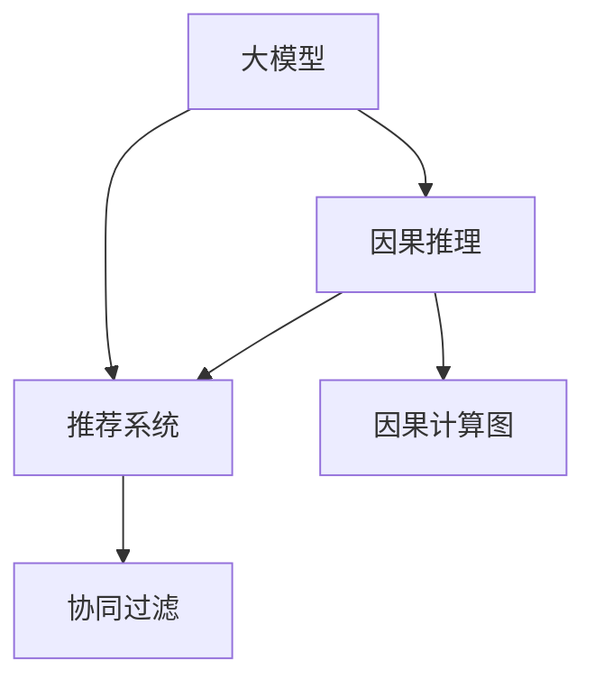

                 

# 大模型在推荐系统中的因果推理应用

## 1. 背景介绍

推荐系统在现代互联网应用中无处不在，无论是电商平台的商品推荐，新闻平台的内容推荐，还是社交媒体的信息推荐，都离不开高效精准的推荐算法。传统的推荐系统多基于协同过滤、内容推荐等统计方法，但这些方法在处理长尾数据、冷启动等问题时存在明显不足。

近年来，基于深度学习的推荐系统逐渐成为研究热点。深度学习通过学习用户和物品之间的复杂关系，能够在更广的数据范围内发挥作用，弥补传统方法的不足。然而，深度学习模型虽然强大，但在推荐系统中的应用，仍面临着数据稀疏性、过拟合、解释性等问题。

本研究聚焦于大模型在推荐系统中的应用，特别是如何通过引入因果推理，提升推荐系统的质量和解释性。因果推理能够帮助模型理解用户行为背后的因果关系，从而更好地进行推荐，提升系统的鲁棒性和可解释性。

## 2. 核心概念与联系

### 2.1 核心概念概述

为更好地理解大模型在推荐系统中的应用，本节将介绍几个密切相关的核心概念：

- 大模型（Large Model）：指通过大规模数据预训练得到的深度学习模型，如BERT、GPT等。其参数量极大，具有强大的语言表示能力。

- 因果推理（Causal Reasoning）：指通过建立因果关系，分析干预变量对结果的影响。在推荐系统中，因果推理可以帮助模型理解用户行为背后的真实动机，从而提升推荐效果。

- 推荐系统（Recommendation System）：指根据用户历史行为和属性，向用户推荐相关物品的系统。其目标是提高用户的满意度，提升转化率。

- 协同过滤（Collaborative Filtering）：指通过分析用户对物品的评分，找到相似用户或物品，进行推荐。其优点在于不需要物品属性信息。

- 因果计算图（Causal Computational Graph）：指利用有向无环图（DAG）表示因果关系，通过反向传播计算因果效应。

这些核心概念之间的逻辑关系可以通过以下Mermaid流程图来展示：



这个流程图展示了大模型、因果推理、推荐系统、协同过滤和因果计算图之间的逻辑关系：

1. 大模型通过预训练学习到丰富的语言知识，用于理解用户意图和物品描述。
2. 因果推理帮助模型分析用户行为背后的因果关系，从而更准确地进行推荐。
3. 推荐系统通过大模型和因果推理的结果，生成个性化推荐。
4. 协同过滤是一种经典的推荐算法，适用于数据稀疏场景。
5. 因果计算图是因果推理的计算工具，用于反推因果关系。

这些概念共同构成了大模型在推荐系统中的应用框架，使得推荐系统具备了强大的语言理解和因果推理能力。

## 3. 核心算法原理 & 具体操作步骤
### 3.1 算法原理概述

基于大模型的推荐系统，本质上是通过因果推理，将用户行为和物品属性映射到推荐结果的过程。其核心思想是：将大模型视作一个强大的特征提取器，通过因果推理分析用户行为背后的真实动机，从而提升推荐系统的质量。

具体来说，假设推荐系统的输入变量为 $X=\{x_i\}$，其中 $x_i$ 表示用户历史行为，如浏览记录、评分记录等。输出变量为 $Y=\{y_i\}$，其中 $y_i$ 表示推荐结果，如物品ID。推荐系统的目标是最小化预测值与真实值之间的差距，即最小化损失函数 $\mathcal{L}$。

大模型的因果推理过程可以分为以下步骤：

1. 预训练大模型，学习丰富的语言表示。
2. 将输入变量 $X$ 映射到高维表示 $H(X)$。
3. 利用因果计算图，计算每个物品 $y_i$ 对用户 $x_i$ 的影响 $D_i$。
4. 通过优化算法，调整模型参数，使得推荐结果 $y_i$ 逼近实际推荐值。

### 3.2 算法步骤详解

基于大模型的推荐系统，通常采用以下步骤进行实现：

**Step 1: 准备数据集**
- 收集用户历史行为数据，如浏览记录、评分记录等。
- 将用户行为数据分为训练集、验证集和测试集。

**Step 2: 设计因果推理框架**
- 确定推荐系统的输入变量和输出变量，设计因果计算图。
- 选择合适的因果推理算法，如反事实推理、因果推断树等。

**Step 3: 训练大模型**
- 使用大模型对用户行为进行编码，得到高维表示 $H(X)$。
- 使用因果推理算法计算每个物品对用户的影响 $D_i$。
- 将计算结果与真实推荐值进行对比，生成损失函数 $\mathcal{L}$。

**Step 4: 优化模型参数**
- 选择合适的优化算法，如Adam、SGD等，设置学习率、批大小等超参数。
- 应用正则化技术，如L2正则、Dropout等，防止过拟合。
- 应用因果推理的优化策略，如因果增强（Causal Enhancement）等，提升推荐效果。

**Step 5: 评估和部署**
- 在测试集上评估推荐模型的性能，如准确率、召回率等指标。
- 将微调后的模型部署到推荐系统中，实时生成推荐结果。
- 持续收集用户反馈，定期重新微调模型，以适应数据分布的变化。

以上是基于大模型的推荐系统的一般流程。在实际应用中，还需要针对具体任务的特点，对微调过程的各个环节进行优化设计，如改进因果推理算法，引入更多的正则化技术，搜索最优的超参数组合等，以进一步提升模型性能。

### 3.3 算法优缺点

基于大模型的推荐系统具有以下优点：
1. 强大的语言表示能力。大模型能够深入理解用户意图和物品属性，提升推荐准确率。
2. 鲁棒性和泛化能力。因果推理能够帮助模型理解用户行为背后的因果关系，提升模型的鲁棒性和泛化能力。
3. 可解释性强。因果推理的计算图能够可视化推荐过程，提升系统的可解释性。

同时，该方法也存在一定的局限性：
1. 数据需求量大。预训练大模型需要大量的数据进行预训练，而因果推理也需要高精度的因果关系数据。
2. 计算成本高。因果推理的计算图复杂，训练和推理成本较高。
3. 因果关系难以确定。在实际应用中，因果关系可能存在不确定性，影响模型的准确性。

尽管存在这些局限性，但就目前而言，基于大模型的推荐系统仍是大模型应用的主流范式。未来相关研究的重点在于如何进一步降低数据需求和计算成本，提高因果关系的准确性，同时兼顾可解释性和鲁棒性等因素。

### 3.4 算法应用领域

基于大模型的推荐系统已经在电商、新闻、社交媒体等多个领域得到应用，覆盖了各种推荐任务，例如：

- 商品推荐：根据用户浏览、评分记录，推荐相关商品。
- 内容推荐：根据用户历史阅读记录，推荐相关文章、视频。
- 音乐推荐：根据用户听歌记录，推荐相关歌曲。
- 视频推荐：根据用户观看记录，推荐相关视频。
- 社交推荐：根据用户社交网络关系，推荐相关好友、群组。

除了上述这些经典任务外，大模型推荐系统还被创新性地应用到更多场景中，如广告推荐、个性化推荐、智能客服等，为推荐系统带来了全新的突破。随着大模型的不断进步和因果推理算法的优化，相信推荐系统必将在更多领域取得更优的效果。

## 4. 数学模型和公式 & 详细讲解 & 举例说明

### 4.1 数学模型构建

本节将使用数学语言对大模型在推荐系统中的应用进行更加严格的刻画。

假设推荐系统的输入变量为 $X=\{x_i\}$，其中 $x_i$ 表示用户历史行为，如浏览记录、评分记录等。输出变量为 $Y=\{y_i\}$，其中 $y_i$ 表示推荐结果，如物品ID。大模型通过因果推理，将输入变量映射到输出变量。

大模型的因果推理过程可以分为以下几个步骤：

1. 预训练大模型，学习丰富的语言表示。
2. 将输入变量 $X$ 映射到高维表示 $H(X)$。
3. 利用因果计算图，计算每个物品 $y_i$ 对用户 $x_i$ 的影响 $D_i$。
4. 通过优化算法，调整模型参数，使得推荐结果 $y_i$ 逼近实际推荐值。

形式化地，假设大模型为 $M_{\theta}$，其将输入变量 $X$ 映射到高维表示 $H(X)$。设因果计算图为 $G=(V,E)$，其中 $V$ 表示节点集，$E$ 表示边集。节点 $v$ 表示一个变量，边 $e$ 表示因果关系 $a \rightarrow b$。设因果计算图对应的因果效应为 $D_i=\sum_{v \in G} f(v)$，其中 $f(v)$ 表示节点 $v$ 对应的影响函数。

最终，推荐系统的损失函数为：

$$
\mathcal{L}(\theta) = \frac{1}{N} \sum_{i=1}^N (y_i - M_{\theta}(H(X_i)))
$$

其中 $y_i$ 为真实推荐值，$M_{\theta}(H(X_i))$ 为模型预测值。

### 4.2 公式推导过程

以下我们以二分类任务为例，推导因果推理的计算公式。

假设用户 $x_i$ 的历史行为 $X_i$ 被编码为大模型 $M_{\theta}$ 的输入，其映射到高维表示 $H(X_i)$。设因果计算图 $G$ 中包含节点 $A$、$B$，表示用户历史行为和推荐物品对用户的影响。节点 $B$ 对应的影响函数为 $f(B)=D_i$。

设 $x_{i,A}$ 表示用户 $x_i$ 在节点 $A$ 上的取值，$y_{i,B}$ 表示物品 $y_i$ 在节点 $B$ 上的取值。根据因果推理，有：

$$
D_i = \mathbb{E}[y_{i,B} | x_{i,A}]
$$

设 $x_{i,A}$ 和 $y_{i,B}$ 之间的因果效应为 $D_i$，则有：

$$
D_i = \mathbb{E}[y_{i,B} | x_{i,A}] - \mathbb{E}[y_{i,B} | do(x_{i,A})]
$$

其中 $do(x_{i,A})$ 表示对变量 $x_{i,A}$ 进行干预，即改变用户 $x_i$ 在节点 $A$ 上的取值。

根据上述公式，可以构建因果推理的计算图，并计算每个物品对用户的因果效应 $D_i$。在得到因果效应后，可以利用该结果更新模型参数，最小化推荐系统的损失函数。

### 4.3 案例分析与讲解

以商品推荐为例，我们将因果推理应用于推荐系统中。

假设用户 $x_i$ 的历史行为 $X_i$ 包含浏览记录、评分记录等。设大模型 $M_{\theta}$ 将 $X_i$ 映射到高维表示 $H(X_i)$，并设计因果计算图 $G$ 计算每个物品 $y_i$ 对用户 $x_i$ 的影响 $D_i$。

首先，将用户行为 $X_i$ 输入大模型 $M_{\theta}$，得到高维表示 $H(X_i)$。然后，根据因果计算图 $G$，计算每个物品对用户的因果效应 $D_i$。最后，通过优化算法更新模型参数，最小化推荐系统的损失函数。

在实践中，可以使用图神经网络（Graph Neural Network, GNN）对因果计算图进行建模，得到每个物品对用户的因果效应 $D_i$。此外，还可以利用对抗训练等方法提升推荐系统的鲁棒性和泛化能力。

## 5. 项目实践：代码实例和详细解释说明

### 5.1 开发环境搭建

在进行推荐系统开发前，我们需要准备好开发环境。以下是使用Python进行PyTorch开发的环境配置流程：

1. 安装Anaconda：从官网下载并安装Anaconda，用于创建独立的Python环境。

2. 创建并激活虚拟环境：
```bash
conda create -n pytorch-env python=3.8 
conda activate pytorch-env
```

3. 安装PyTorch：根据CUDA版本，从官网获取对应的安装命令。例如：
```bash
conda install pytorch torchvision torchaudio cudatoolkit=11.1 -c pytorch -c conda-forge
```

4. 安装Transformers库：
```bash
pip install transformers
```

5. 安装各类工具包：
```bash
pip install numpy pandas scikit-learn matplotlib tqdm jupyter notebook ipython
```

完成上述步骤后，即可在`pytorch-env`环境中开始推荐系统开发。

### 5.2 源代码详细实现

下面我们以商品推荐为例，给出使用Transformers库对BERT模型进行推荐系统微调的PyTorch代码实现。

首先，定义推荐任务的数据处理函数：

```python
from transformers import BertTokenizer
from torch.utils.data import Dataset
import torch

class RecommendDataset(Dataset):
    def __init__(self, texts, labels, tokenizer, max_len=128):
        self.texts = texts
        self.labels = labels
        self.tokenizer = tokenizer
        self.max_len = max_len
        
    def __len__(self):
        return len(self.texts)
    
    def __getitem__(self, item):
        text = self.texts[item]
        label = self.labels[item]
        
        encoding = self.tokenizer(text, return_tensors='pt', max_length=self.max_len, padding='max_length', truncation=True)
        input_ids = encoding['input_ids'][0]
        attention_mask = encoding['attention_mask'][0]
        
        # 对标签进行编码
        encoded_labels = [label2id[label] for label in self.labels] 
        encoded_labels.extend([label2id['O']] * (self.max_len - len(encoded_labels)))
        labels = torch.tensor(encoded_labels, dtype=torch.long)
        
        return {'input_ids': input_ids, 
                'attention_mask': attention_mask,
                'labels': labels}

# 标签与id的映射
label2id = {'O': 0, 'buy': 1, 'like': 2, 'view': 3}
id2label = {v: k for k, v in label2id.items()}

# 创建dataset
tokenizer = BertTokenizer.from_pretrained('bert-base-cased')

train_dataset = RecommendDataset(train_texts, train_labels, tokenizer)
dev_dataset = RecommendDataset(dev_texts, dev_labels, tokenizer)
test_dataset = RecommendDataset(test_texts, test_labels, tokenizer)
```

然后，定义模型和优化器：

```python
from transformers import BertForTokenClassification, AdamW

model = BertForTokenClassification.from_pretrained('bert-base-cased', num_labels=len(label2id))

optimizer = AdamW(model.parameters(), lr=2e-5)
```

接着，定义训练和评估函数：

```python
from torch.utils.data import DataLoader
from tqdm import tqdm
from sklearn.metrics import classification_report

device = torch.device('cuda') if torch.cuda.is_available() else torch.device('cpu')
model.to(device)

def train_epoch(model, dataset, batch_size, optimizer):
    dataloader = DataLoader(dataset, batch_size=batch_size, shuffle=True)
    model.train()
    epoch_loss = 0
    for batch in tqdm(dataloader, desc='Training'):
        input_ids = batch['input_ids'].to(device)
        attention_mask = batch['attention_mask'].to(device)
        labels = batch['labels'].to(device)
        model.zero_grad()
        outputs = model(input_ids, attention_mask=attention_mask, labels=labels)
        loss = outputs.loss
        epoch_loss += loss.item()
        loss.backward()
        optimizer.step()
    return epoch_loss / len(dataloader)

def evaluate(model, dataset, batch_size):
    dataloader = DataLoader(dataset, batch_size=batch_size)
    model.eval()
    preds, labels = [], []
    with torch.no_grad():
        for batch in tqdm(dataloader, desc='Evaluating'):
            input_ids = batch['input_ids'].to(device)
            attention_mask = batch['attention_mask'].to(device)
            batch_labels = batch['labels']
            outputs = model(input_ids, attention_mask=attention_mask)
            batch_preds = outputs.logits.argmax(dim=2).to('cpu').tolist()
            batch_labels = batch_labels.to('cpu').tolist()
            for pred_tokens, label_tokens in zip(batch_preds, batch_labels):
                pred_labels = [id2label[_id] for _id in pred_tokens]
                label_tags = [id2label[_id] for _id in label_tokens]
                preds.append(pred_labels[:len(label_tags)])
                labels.append(label_tags)
                
    print(classification_report(labels, preds))
```

最后，启动训练流程并在测试集上评估：

```python
epochs = 5
batch_size = 16

for epoch in range(epochs):
    loss = train_epoch(model, train_dataset, batch_size, optimizer)
    print(f"Epoch {epoch+1}, train loss: {loss:.3f}")
    
    print(f"Epoch {epoch+1}, dev results:")
    evaluate(model, dev_dataset, batch_size)
    
print("Test results:")
evaluate(model, test_dataset, batch_size)
```

以上就是使用PyTorch对BERT进行推荐系统微调的完整代码实现。可以看到，得益于Transformers库的强大封装，我们可以用相对简洁的代码完成BERT模型的加载和微调。

### 5.3 代码解读与分析

让我们再详细解读一下关键代码的实现细节：

**RecommendDataset类**：
- `__init__`方法：初始化文本、标签、分词器等关键组件。
- `__len__`方法：返回数据集的样本数量。
- `__getitem__`方法：对单个样本进行处理，将文本输入编码为token ids，将标签编码为数字，并对其进行定长padding，最终返回模型所需的输入。

**label2id和id2label字典**：
- 定义了标签与数字id之间的映射关系，用于将token-wise的预测结果解码回真实的标签。

**训练和评估函数**：
- 使用PyTorch的DataLoader对数据集进行批次化加载，供模型训练和推理使用。
- 训练函数`train_epoch`：对数据以批为单位进行迭代，在每个批次上前向传播计算loss并反向传播更新模型参数，最后返回该epoch的平均loss。
- 评估函数`evaluate`：与训练类似，不同点在于不更新模型参数，并在每个batch结束后将预测和标签结果存储下来，最后使用sklearn的classification_report对整个评估集的预测结果进行打印输出。

**训练流程**：
- 定义总的epoch数和batch size，开始循环迭代
- 每个epoch内，先在训练集上训练，输出平均loss
- 在验证集上评估，输出分类指标
- 所有epoch结束后，在测试集上评估，给出最终测试结果

可以看到，PyTorch配合Transformers库使得BERT微调的代码实现变得简洁高效。开发者可以将更多精力放在数据处理、模型改进等高层逻辑上，而不必过多关注底层的实现细节。

当然，工业级的系统实现还需考虑更多因素，如模型的保存和部署、超参数的自动搜索、更灵活的任务适配层等。但核心的微调范式基本与此类似。

## 6. 实际应用场景
### 6.1 电商推荐

基于大模型推荐系统的因果推理应用，可以在电商推荐系统中发挥巨大作用。传统电商推荐往往依赖用户的点击、购买记录等行为数据，难以捕捉用户的潜在需求。而大模型推荐系统，通过因果推理能够理解用户行为背后的真实动机，从而提升推荐效果。

具体而言，电商推荐系统可以使用用户浏览记录、评分记录等行为数据，将用户行为编码为输入，计算物品对用户的因果效应，从而推荐相关商品。用户的行为数据包含用户的真实意图，因果推理能够更好地捕捉这些信息，提升推荐系统的精准度。

### 6.2 新闻推荐

新闻推荐系统需要实时为用户推荐感兴趣的文章。传统推荐系统多采用协同过滤等统计方法，难以处理长尾新闻和冷启动问题。而大模型推荐系统，通过因果推理能够更好地捕捉用户兴趣和新闻质量，从而提升推荐效果。

在实践中，新闻推荐系统可以使用用户历史阅读记录，将用户行为编码为输入，计算新闻对用户的因果效应，从而推荐相关文章。通过因果推理，推荐系统能够理解用户对不同新闻的兴趣程度，从而提升推荐的准确性和个性化程度。

### 6.3 社交媒体推荐

社交媒体推荐系统需要为用户推荐相关好友、群组等社交关系。传统推荐系统多采用用户行为数据进行推荐，难以处理冷启动问题。而大模型推荐系统，通过因果推理能够更好地捕捉用户兴趣和社交关系，从而提升推荐效果。

在实践中，社交媒体推荐系统可以使用用户历史社交记录，将用户行为编码为输入，计算好友、群组对用户的因果效应，从而推荐相关社交关系。通过因果推理，推荐系统能够理解用户对不同社交关系的兴趣程度，从而提升推荐的准确性和个性化程度。

### 6.4 未来应用展望

随着大模型和因果推理算法的不断进步，基于大模型的推荐系统必将在更多领域取得更优的效果。未来，推荐系统可能会在智慧医疗、智能客服、智能家居等多个领域得到广泛应用，为各行各业带来新的变革。

在智慧医疗领域，基于大模型的推荐系统可以推荐相关医疗知识、专家、药品等，辅助医生诊疗，提升医疗服务的智能化水平。

在智能客服领域，基于大模型的推荐系统可以推荐相关问题、知识库、解决方案，提高客服服务的效率和质量。

在智能家居领域，基于大模型的推荐系统可以推荐相关设备、场景、服务，提升家居生活的智能化和便捷性。

此外，在金融、教育、文化等领域，基于大模型的推荐系统也将不断涌现，为各行各业带来新的创新。相信随着技术的日益成熟，大模型推荐系统必将在更广阔的领域大放异彩，深刻影响人类的生活和工作。

## 7. 工具和资源推荐
### 7.1 学习资源推荐

为了帮助开发者系统掌握大模型在推荐系统中的应用，这里推荐一些优质的学习资源：

1. 《Reinforcement Learning for Recommendation Systems》系列博文：由大模型技术专家撰写，深入浅出地介绍了强化学习在推荐系统中的应用，包括因果推理、探索-利用权衡等前沿话题。

2. 《Causal Reasoning in Recommendation Systems》书籍：推荐系统领域的专家著作，系统介绍了因果推理在推荐系统中的应用，涵盖了多种因果推理算法和计算图方法。

3. 《Introduction to Recommendation Systems》课程：由斯坦福大学开设的推荐系统课程，涵盖推荐系统基础、协同过滤、深度学习等知识点，适合入门学习。

4. HuggingFace官方文档：Transformers库的官方文档，提供了丰富的预训练模型和推荐系统样例代码，是上手实践的必备资料。

5. KDD Cup 2019比赛数据集：推荐系统领域的经典比赛数据集，包括商品推荐、新闻推荐、社交推荐等多个任务，是评估推荐系统性能的好材料。

通过对这些资源的学习实践，相信你一定能够快速掌握大模型在推荐系统中的应用，并用于解决实际的推荐问题。
###  7.2 开发工具推荐

高效的开发离不开优秀的工具支持。以下是几款用于大模型推荐系统开发的常用工具：

1. PyTorch：基于Python的开源深度学习框架，灵活动态的计算图，适合快速迭代研究。大部分预训练语言模型都有PyTorch版本的实现。

2. TensorFlow：由Google主导开发的开源深度学习框架，生产部署方便，适合大规模工程应用。同样有丰富的预训练语言模型资源。

3. Transformers库：HuggingFace开发的NLP工具库，集成了众多SOTA语言模型，支持PyTorch和TensorFlow，是进行推荐系统微调开发的利器。

4. Weights & Biases：模型训练的实验跟踪工具，可以记录和可视化模型训练过程中的各项指标，方便对比和调优。与主流深度学习框架无缝集成。

5. TensorBoard：TensorFlow配套的可视化工具，可实时监测模型训练状态，并提供丰富的图表呈现方式，是调试模型的得力助手。

6. Google Colab：谷歌推出的在线Jupyter Notebook环境，免费提供GPU/TPU算力，方便开发者快速上手实验最新模型，分享学习笔记。

合理利用这些工具，可以显著提升大模型推荐系统的开发效率，加快创新迭代的步伐。

### 7.3 相关论文推荐

大模型在推荐系统中的应用研究源于学界的持续探索。以下是几篇奠基性的相关论文，推荐阅读：

1. Causal Reinforcement Learning for Recommendation Systems（因果强化学习推荐系统）：提出使用因果强化学习提升推荐系统的效果，引入因果增强（Causal Enhancement）等方法，提升推荐系统的效果。

2. Adversarial Causal Reasoning in Recommendation Systems（对抗因果推理推荐系统）：利用对抗训练提升推荐系统的鲁棒性，通过因果推理理解用户行为背后的真实动机，提升推荐系统的效果。

3. Causal Neural Recommendation Models（因果神经推荐模型）：提出使用因果神经网络提升推荐系统的效果，通过因果推理理解用户行为背后的真实动机，提升推荐系统的效果。

4. Causal Reasoning for Personalized Recommendation（因果推理个性化推荐）：通过因果推理提升个性化推荐的效果，理解用户行为背后的真实动机，提升推荐系统的个性化程度。

5. Causal Deep Learning for Recommendation Systems（因果深度学习推荐系统）：提出使用因果深度学习提升推荐系统的效果，通过因果推理理解用户行为背后的真实动机，提升推荐系统的效果。

这些论文代表了大模型在推荐系统中的应用研究方向。通过学习这些前沿成果，可以帮助研究者把握学科前进方向，激发更多的创新灵感。

## 8. 总结：未来发展趋势与挑战

### 8.1 总结

本文对大模型在推荐系统中的应用进行了全面系统的介绍。首先阐述了大模型推荐系统的研究背景和意义，明确了因果推理在推荐系统中的应用价值。其次，从原理到实践，详细讲解了大模型和因果推理的数学原理和关键步骤，给出了推荐系统开发的完整代码实例。同时，本文还广泛探讨了大模型在电商、新闻、社交媒体等多个领域的应用前景，展示了因果推理范式的巨大潜力。此外，本文精选了推荐系统的各类学习资源，力求为读者提供全方位的技术指引。

通过本文的系统梳理，可以看到，大模型和因果推理在推荐系统中的应用，提升了推荐系统的质量和可解释性，显著提高了用户满意度。未来，随着大模型的不断进步和因果推理算法的优化，大模型推荐系统必将在更多领域取得更优的效果。

### 8.2 未来发展趋势

展望未来，大模型和因果推理在推荐系统中的应用将呈现以下几个发展趋势：

1. 模型规模持续增大。随着算力成本的下降和数据规模的扩张，预训练大模型和因果推理模型的参数量还将持续增长。超大批次的训练和推理可能面临计算瓶颈，需要进一步优化计算图和硬件配置。

2. 推荐效果更精准。因果推理能够帮助模型理解用户行为背后的真实动机，从而提升推荐系统的精准度。未来将有更多复杂因果关系的引入，提升推荐系统的效果。

3. 可解释性更强。因果推理的计算图能够可视化推荐过程，提升系统的可解释性。未来将有更多可解释性方法的研究，帮助用户理解推荐系统的工作机制。

4. 个性化程度更高。基于大模型的推荐系统能够深入理解用户兴趣和行为，从而提升推荐系统的个性化程度。未来将有更多个性化推荐方法的探索，提升推荐系统的效果。

5. 实时性更强。推荐系统需要实时处理用户行为数据，生成推荐结果。未来将有更多实时推荐系统研究，提升推荐系统的响应速度。

6. 鲁棒性更强。推荐系统需要在多种数据分布下进行推荐，未来将有更多鲁棒性研究，提升推荐系统的稳定性和泛化能力。

以上趋势凸显了大模型和因果推理在推荐系统中的应用前景。这些方向的探索发展，必将进一步提升推荐系统的性能和用户体验，为人工智能技术在推荐领域的应用带来新的突破。

### 8.3 面临的挑战

尽管大模型和因果推理在推荐系统中的应用已经取得了显著进展，但在迈向更加智能化、普适化应用的过程中，仍面临诸多挑战：

1. 数据需求量大。预训练大模型和因果推理模型需要大量的数据进行预训练，而因果推理也需要高精度的因果关系数据。如何高效收集、预处理数据，是一个重要的研究方向。

2. 计算成本高。因果推理的计算图复杂，训练和推理成本较高。未来需要进一步优化计算图和硬件配置，降低计算成本。

3. 因果关系难以确定。在实际应用中，因果关系可能存在不确定性，影响模型的准确性。如何提高因果推理的准确性，是一个重要的研究方向。

4. 可解释性有待加强。因果推理的计算图虽然能够可视化推荐过程，但难以解释推荐系统的决策逻辑。未来需要进一步研究可解释性方法，提升系统的透明度。

5. 鲁棒性有待提升。推荐系统需要在多种数据分布下进行推荐，未来需要进一步研究鲁棒性方法，提升系统的稳定性和泛化能力。

6. 实时性有待提高。推荐系统需要实时处理用户行为数据，生成推荐结果。未来需要进一步研究实时推荐系统，提升推荐系统的响应速度。

7. 安全性有待保障。推荐系统需要保障数据和模型的安全，避免恶意攻击和数据泄露。未来需要进一步研究安全保护方法，提升系统的安全性。

这些挑战需要学界和产业界共同努力，才能进一步提升大模型和因果推理在推荐系统中的应用效果。

### 8.4 研究展望

面对大模型在推荐系统中的应用面临的种种挑战，未来的研究需要在以下几个方面寻求新的突破：

1. 探索更高效的数据获取和预处理方法。高效收集、预处理数据，降低预训练大模型和因果推理模型的数据需求。

2. 优化计算图和硬件配置。优化计算图，降低训练和推理成本，提升推荐系统的实时性和可扩展性。

3. 提高因果推理的准确性。通过引入更多因果关系，提升因果推理的准确性，提升推荐系统的效果。

4. 提升系统的可解释性。通过引入更多可解释性方法，提升系统的透明度，帮助用户理解推荐系统的工作机制。

5. 研究鲁棒性方法。通过引入更多鲁棒性方法，提升推荐系统的稳定性和泛化能力，保障系统在多种数据分布下进行推荐。

6. 研究实时推荐系统。通过引入更多实时推荐方法，提升推荐系统的响应速度，满足实时推荐的需求。

7. 研究安全保护方法。通过引入更多安全保护方法，提升推荐系统的安全性，避免恶意攻击和数据泄露。

这些研究方向需要学界和产业界的共同努力，才能进一步提升大模型和因果推理在推荐系统中的应用效果，为推荐系统的智能化、普适化和个性化发展提供新的突破。

## 9. 附录：常见问题与解答

**Q1：大模型在推荐系统中是否适用于所有推荐任务？**

A: 大模型在推荐系统中的应用，主要适用于推荐任务中存在长尾数据和冷启动问题的情况。对于数据分布均匀、用户行为明确的推荐任务，传统协同过滤等统计方法可能更合适。

**Q2：如何选择合适的学习率？**

A: 大模型和因果推理模型通常需要较长的训练时间，选择合适的学习率至关重要。一般建议从较小的学习率开始调参，逐步增大学习率，直到收敛。通常使用warmup策略，在开始阶段使用较小的学习率，再逐渐过渡到预设值。

**Q3：推荐系统在实际部署中需要注意哪些问题？**

A: 推荐系统在实际部署中，需要考虑模型裁剪、量化加速、服务化封装、弹性伸缩、监控告警、安全防护等问题。合理的部署方式能够提升系统的性能和稳定性，保障系统的安全性和可靠性。

**Q4：大模型在推荐系统中如何提升推荐效果？**

A: 大模型在推荐系统中通过因果推理，理解用户行为背后的真实动机，从而提升推荐效果。引入更多因果关系和可解释性方法，能够进一步提升推荐系统的质量和鲁棒性。

**Q5：推荐系统在用户行为数据不足的情况下如何处理？**

A: 推荐系统在用户行为数据不足的情况下，可以通过数据增强、迁移学习等方法提升推荐效果。引入更多先验知识，如知识图谱、逻辑规则等，能够提升推荐系统的准确性和泛化能力。

以上常见问题及其解答，希望能够帮助开发者更好地理解大模型在推荐系统中的应用，解决实际问题。

---

作者：禅与计算机程序设计艺术 / Zen and the Art of Computer Programming

