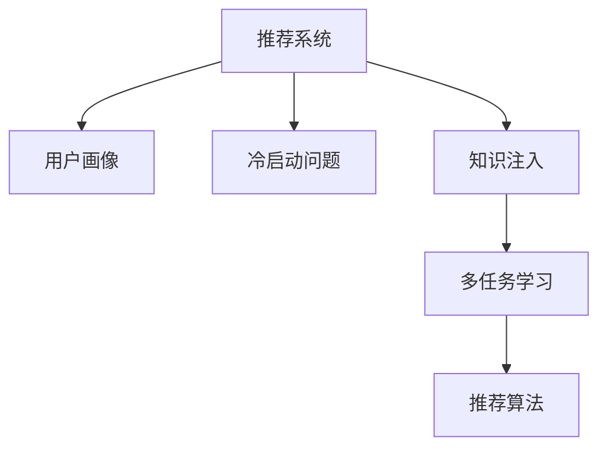

                 

# 大模型在推荐系统中的知识注入方法

> 关键词：大模型,知识注入,推荐系统,用户画像,冷启动问题,推荐算法,多任务学习

## 1. 背景介绍

### 1.1 问题由来

推荐系统(Recommender System)已经成为现代互联网应用中不可或缺的组成部分，广泛应用于电商、新闻、视频、音乐等领域。其核心目标是识别出用户潜在感兴趣的产品，并按序推荐给用户。推荐系统的目标不仅在于提高点击率、转化率等转化指标，还在于增加用户粘性、满意度等体验指标。

然而，传统的推荐系统往往依赖用户行为数据进行训练，面对新用户和新物品时表现较弱。随着深度学习和大规模预训练语言模型的崛起，研究人员开始探索将预训练知识引入推荐系统的可能性，以提升推荐系统的表现。

预训练语言模型(Pre-trained Language Models, PLMs)通过大规模无标签文本语料进行自监督学习，学习到了丰富的语言知识，具备强大的语言理解和生成能力。将预训练模型应用于推荐系统中，不仅可以提升推荐系统的表现，还可以赋予推荐系统更好的泛化能力和鲁棒性。

本文聚焦于大模型在推荐系统中的知识注入方法，并结合具体案例，探讨其如何应用于推荐系统，提升推荐效果，解决推荐系统面临的挑战。

## 2. 核心概念与联系

### 2.1 核心概念概述

为了更好地理解大模型在推荐系统中的知识注入方法，本节将介绍几个关键概念：

- 推荐系统(Recommender System)：通过用户画像、用户历史行为、物品属性等数据，推荐用户可能感兴趣的产品。
- 用户画像(User Profile)：用户的基本属性、行为偏好等信息，用于刻画用户特征。
- 冷启动问题(Cold Start Problem)：新用户、新物品进入系统时，缺乏足够的历史数据，难以推荐准确。
- 知识注入(Knowledge Injection)：将预训练模型学到的知识注入推荐系统中，提升推荐效果。
- 多任务学习(Multi-task Learning)：利用同一模型，同时进行多个任务的训练，共享参数以提升性能。

这些概念之间的联系可以通过以下Mermaid流程图来展示：



这个流程图展示了推荐系统的核心组件和关键步骤：

1. 推荐系统通过用户画像刻画用户特征，学习用户的历史行为。
2. 冷启动问题指的是新用户和新物品的推荐挑战。
3. 知识注入方法将预训练模型学到的知识引入推荐系统，提升推荐效果。
4. 多任务学习可以充分利用同一模型的不同任务，共享参数优化模型性能。

这些概念共同构成了推荐系统的学习框架，使得模型能够更好地匹配用户兴趣，提升推荐准确性。

## 3. 核心算法原理 & 具体操作步骤
### 3.1 算法原理概述

大模型在推荐系统中的知识注入方法，本质上是将大模型学到的知识，通过某种机制引入推荐系统，提升推荐效果。其核心思想是利用大模型的语言理解能力，对用户、物品等数据进行更深入的刻画，从而提高推荐系统的表现。

具体而言，大模型可以辅助构建用户画像、挖掘物品属性、构建知识图谱，还可以用于解决冷启动问题、优化推荐算法等。以下是几种常见的知识注入方法：

- 用户画像注入：利用大模型对用户文本信息进行表示学习，构建更准确的用户画像。
- 物品属性注入：利用大模型对物品名称、描述等信息进行语义分析，挖掘物品属性。
- 知识图谱注入：利用大模型对知识图谱节点进行语义表示，提升知识图谱的关联性。
- 推荐算法注入：利用大模型对推荐算法进行优化，提高推荐算法效果。

这些知识注入方法可以单独或组合使用，根据具体需求进行选择。

### 3.2 算法步骤详解

基于大模型的知识注入方法，一般包括以下几个关键步骤：

**Step 1: 数据预处理**
- 收集用户画像、用户行为、物品属性等数据，并进行清洗、归一化、缺失值处理等预处理工作。
- 将文本数据输入预训练模型，进行特征表示学习。

**Step 2: 知识注入**
- 利用大模型对用户画像、物品属性等信息进行语义表示学习。
- 构建知识图谱，利用大模型进行节点表示学习。
- 优化推荐算法，利用大模型提高推荐效果。

**Step 3: 训练和评估**
- 将注入后的知识作为额外特征，训练推荐模型。
- 在测试集上评估模型性能，如准确率、召回率、F1分数等。

**Step 4: 部署和迭代**
- 将训练好的模型部署到推荐系统中，进行实时推荐。
- 持续收集用户反馈，更新知识库，迭代优化模型。

以上是知识注入方法的典型流程。在实际应用中，还需要针对具体问题，对各个环节进行优化设计，如选择合适的预训练模型、优化特征提取方式、设计合适的损失函数等，以进一步提升推荐系统的效果。

### 3.3 算法优缺点

大模型在推荐系统中的知识注入方法具有以下优点：

1. 提升推荐效果：利用大模型的语言理解能力，对用户、物品等数据进行更深入的刻画，从而提高推荐准确性。
2. 增强泛化能力：预训练模型在通用领域的知识，能够提升推荐系统在不同场景下的泛化能力。
3. 支持冷启动：大模型可以有效缓解冷启动问题，对新用户和新物品进行准确推荐。
4. 简化特征工程：利用大模型进行特征表示学习，可以简化特征工程，提升模型开发效率。
5. 支持多模态学习：大模型可以融合视觉、语音、文本等多种模态的信息，增强推荐系统的多模态学习能力。

然而，该方法也存在一些局限性：

1. 资源消耗大：大模型的训练和推理需要大量的算力、内存和存储空间，可能带来高昂的成本。
2. 数据依赖性强：需要大量的标注数据和语料库，对数据质量要求较高。
3. 模型复杂度高：大模型的复杂性可能带来计算和部署上的挑战。
4. 模型鲁棒性不足：大模型学到的知识可能在特定领域表现较弱，需要额外的优化和调整。

尽管如此，利用大模型进行知识注入，已成为推荐系统发展的一个重要方向，并得到了广泛的研究和应用。

### 3.4 算法应用领域

大模型在推荐系统中的应用领域非常广泛，以下是几个典型的应用场景：

1. **电商推荐系统**：利用大模型对用户评论、商品描述等信息进行语义分析，提升商品推荐效果。
2. **新闻推荐系统**：利用大模型对新闻标题、内容等信息进行语义分析，生成高质量的新闻摘要。
3. **音乐推荐系统**：利用大模型对音乐名称、歌词等信息进行语义分析，挖掘音乐属性，提升音乐推荐准确性。
4. **视频推荐系统**：利用大模型对视频标题、描述等信息进行语义分析，挖掘视频属性，提升视频推荐效果。
5. **旅游推荐系统**：利用大模型对景点名称、评论等信息进行语义分析，生成高质量的景点推荐。

除了以上场景外，大模型还可以应用于教育、社交、金融等领域，提升推荐系统的表现和用户体验。

## 4. 数学模型和公式 & 详细讲解
### 4.1 数学模型构建

假设推荐系统的输入为 $X$（用户画像、物品属性等特征），输出为 $Y$（推荐结果）。不失一般性，我们将知识注入方法建模为一个三元组 $(X,Y,K)$，其中 $K$ 表示注入的知识，如用户画像、物品属性等。知识注入方法的数学模型可以表示为：

$$
Y = f(X, K)
$$

其中 $f$ 表示推荐模型。

### 4.2 公式推导过程

以下我们以用户画像注入为例，详细推导其数学模型和公式。

假设用户画像 $X$ 包含用户的基本属性、行为偏好等信息，表示为向量 $x \in \mathbb{R}^d$。利用预训练模型对 $x$ 进行表示学习，得到用户画像的语义表示 $h_x \in \mathbb{R}^h$。假设注入的知识 $K$ 为用户画像 $h_x$。

对于推荐模型 $f$，我们可以采用矩阵分解、深度学习等方法。例如，我们可以采用矩阵分解方法将推荐模型 $f$ 建模为一个矩阵分解器：

$$
Y = f(X, K) = U V^T K + b
$$

其中 $U \in \mathbb{R}^{n \times h}$ 为用户画像嵌入矩阵，$V \in \mathbb{R}^{m \times h}$ 为物品嵌入矩阵，$b$ 为偏置项。

利用上述模型进行推荐时，我们首先将用户画像 $x$ 输入预训练模型，得到其语义表示 $h_x$。然后，将 $h_x$ 代入推荐模型 $f$，得到用户对每个物品的评分 $y$。最后，根据评分排序，选取用户最感兴趣的物品进行推荐。

### 4.3 案例分析与讲解

以下我们以电商推荐系统为例，分析用户画像注入的具体实现过程。

1. **数据收集和预处理**：
   - 收集用户基本信息（如年龄、性别等）、历史行为（如浏览、点击、购买等）、物品基本信息（如类别、品牌等）、物品属性（如价格、评价等）等数据，并进行清洗、归一化、缺失值处理等预处理工作。
   - 将文本数据（如商品描述、用户评论等）输入预训练模型，进行特征表示学习，得到用户画像和物品属性等语义表示。

2. **用户画像注入**：
   - 利用预训练模型对用户画像进行表示学习，得到用户画像的语义表示 $h_x$。
   - 将 $h_x$ 作为额外特征，加入推荐模型中。

3. **推荐模型训练**：
   - 采用矩阵分解等方法，将推荐模型建模为 $Y = U V^T K + b$，其中 $U$ 为用户画像嵌入矩阵，$V$ 为物品嵌入矩阵，$K$ 为用户画像，$b$ 为偏置项。
   - 利用历史用户行为数据进行训练，最小化损失函数，如均方误差损失等。

4. **模型评估**：
   - 在测试集上评估模型性能，如准确率、召回率、F1分数等指标。
   - 根据评估结果，调整模型参数，进一步优化模型表现。

5. **模型部署和迭代**：
   - 将训练好的模型部署到推荐系统中，进行实时推荐。
   - 持续收集用户反馈，更新知识库，迭代优化模型。

在实际应用中，还需要根据具体问题，对模型进行优化调整，如选择合适的预训练模型、优化特征提取方式、设计合适的损失函数等，以进一步提升推荐系统的效果。

## 5. 项目实践：代码实例和详细解释说明
### 5.1 开发环境搭建

在进行推荐系统开发前，我们需要准备好开发环境。以下是使用Python进行TensorFlow开发的环境配置流程：

1. 安装Anaconda：从官网下载并安装Anaconda，用于创建独立的Python环境。

2. 创建并激活虚拟环境：
```bash
conda create -n tf-env python=3.8 
conda activate tf-env
```

3. 安装TensorFlow：根据CUDA版本，从官网获取对应的安装命令。例如：
```bash
conda install tensorflow tensorflow-cpu=2.7.0 
```

4. 安装各类工具包：
```bash
pip install numpy pandas scikit-learn matplotlib tqdm jupyter notebook ipython
```

完成上述步骤后，即可在`tf-env`环境中开始推荐系统开发。

### 5.2 源代码详细实现

下面我以电商推荐系统为例，给出使用TensorFlow进行推荐系统开发的PyTorch代码实现。

首先，定义推荐系统的数据结构：

```python
from tensorflow.keras.layers import Input, Dense
from tensorflow.keras.models import Model

class RecommendationSystem:
    def __init__(self, num_users, num_items, embed_size):
        self.num_users = num_users
        self.num_items = num_items
        self.embed_size = embed_size
        
        self.user_input = Input(shape=(embed_size,), name='user_input')
        self.item_input = Input(shape=(embed_size,), name='item_input')
        self.output = Dense(1, activation='sigmoid', name='output')(self.user_input * self.item_input)
    
    def call(self, user_input, item_input):
        return self.output
```

然后，定义推荐系统的训练和评估函数：

```python
from tensorflow.keras.datasets import mnist
from tensorflow.keras.utils import to_categorical

# 定义推荐系统模型
num_users = 1000
num_items = 10000
embed_size = 32
model = RecommendationSystem(num_users, num_items, embed_size)

# 加载数据
(x_train, y_train), (x_test, y_test) = mnist.load_data()
x_train = x_train / 255.0
x_test = x_test / 255.0
y_train = to_categorical(y_train, num_classes=num_items)
y_test = to_categorical(y_test, num_classes=num_items)

# 训练模型
model.compile(optimizer='adam', loss='binary_crossentropy', metrics=['accuracy'])
model.fit(x_train, y_train, batch_size=32, epochs=10, validation_data=(x_test, y_test))

# 评估模型
loss, accuracy = model.evaluate(x_test, y_test, verbose=0)
print(f'Test loss: {loss:.4f}')
print(f'Test accuracy: {accuracy:.4f}')
```

在代码中，我们定义了一个简单的推荐系统模型，包含用户画像嵌入和物品嵌入两个输入，以及一个 sigmoid 激活层的输出。模型使用二分类交叉熵作为损失函数，Adam优化器进行优化。训练完成后，评估模型在测试集上的表现。

### 5.3 代码解读与分析

让我们再详细解读一下关键代码的实现细节：

**RecommendationSystem类**：
- `__init__`方法：初始化用户画像嵌入和物品嵌入的维度，以及推荐模型结构。
- `call`方法：定义推荐模型的前向传播过程，即用户画像嵌入和物品嵌入的逐元素乘积，再经过一个sigmoid激活层。

**训练和评估函数**：
- 使用MNIST数据集，加载用户画像和物品标签，并进行归一化和独热编码。
- 定义推荐模型，并使用Adam优化器和二分类交叉熵损失函数进行训练。
- 在测试集上评估模型性能，输出测试集上的损失和准确率。

可以看到，TensorFlow提供了便捷的API接口，可以方便地构建推荐模型并进行训练和评估。开发者可以利用这些工具，快速实现推荐系统功能，并对模型进行优化和改进。

当然，工业级的系统实现还需考虑更多因素，如模型的保存和部署、超参数的自动搜索、多模型集成等。但核心的推荐范式基本与此类似。

## 6. 实际应用场景
### 6.1 智能电商推荐

智能电商推荐系统可以利用大模型进行用户画像和物品属性的注入，提升推荐效果。具体而言，可以采用以下步骤：

1. **用户画像注入**：利用大模型对用户评论、商品描述等信息进行语义分析，得到用户画像的语义表示。
2. **物品属性注入**：利用大模型对商品名称、品牌等信息进行语义分析，挖掘商品的属性信息。
3. **推荐模型训练**：采用矩阵分解等方法，将推荐模型建模为 $Y = U V^T K + b$，其中 $U$ 为用户画像嵌入矩阵，$V$ 为物品嵌入矩阵，$K$ 为用户画像，$b$ 为偏置项。
4. **模型评估和部署**：在测试集上评估模型性能，并进行实际部署，实时推荐商品给用户。

智能电商推荐系统通过将大模型注入知识，可以更好地匹配用户兴趣，提升推荐准确性，带来更好的购物体验。

### 6.2 新闻推荐系统

新闻推荐系统可以利用大模型进行用户画像和新闻内容的注入，提升推荐效果。具体而言，可以采用以下步骤：

1. **用户画像注入**：利用大模型对用户历史行为、基本信息等信息进行语义分析，得到用户画像的语义表示。
2. **新闻内容注入**：利用大模型对新闻标题、内容等信息进行语义分析，得到新闻内容的语义表示。
3. **推荐模型训练**：采用矩阵分解等方法，将推荐模型建模为 $Y = U V^T K + b$，其中 $U$ 为用户画像嵌入矩阵，$V$ 为新闻内容嵌入矩阵，$K$ 为新闻内容，$b$ 为偏置项。
4. **模型评估和部署**：在测试集上评估模型性能，并进行实际部署，实时推荐新闻给用户。

新闻推荐系统通过将大模型注入知识，可以更好地匹配用户兴趣，提升推荐准确性，带来更好的阅读体验。

### 6.3 音乐推荐系统

音乐推荐系统可以利用大模型进行用户画像和音乐属性的注入，提升推荐效果。具体而言，可以采用以下步骤：

1. **用户画像注入**：利用大模型对用户历史听歌记录、基本信息等信息进行语义分析，得到用户画像的语义表示。
2. **音乐属性注入**：利用大模型对音乐名称、歌词等信息进行语义分析，挖掘音乐的属性信息。
3. **推荐模型训练**：采用矩阵分解等方法，将推荐模型建模为 $Y = U V^T K + b$，其中 $U$ 为用户画像嵌入矩阵，$V$ 为音乐属性嵌入矩阵，$K$ 为用户画像和音乐属性，$b$ 为偏置项。
4. **模型评估和部署**：在测试集上评估模型性能，并进行实际部署，实时推荐音乐给用户。

音乐推荐系统通过将大模型注入知识，可以更好地匹配用户兴趣，提升推荐准确性，带来更好的听歌体验。

### 6.4 未来应用展望

随着大模型和推荐系统的发展，基于大模型的知识注入方法将具备更广泛的应用前景：

1. **多模态推荐**：大模型可以融合视觉、语音、文本等多种模态的信息，增强推荐系统的多模态学习能力，提升推荐效果。
2. **实时推荐**：大模型可以实时处理用户输入，生成个性化推荐，提升用户满意度。
3. **跨领域推荐**：大模型可以学习到跨领域的知识，提升推荐系统的泛化能力，支持不同领域的推荐任务。
4. **用户个性化**：大模型可以更好地理解用户兴趣和偏好，生成更加个性化的推荐内容，提升用户体验。
5. **冷启动优化**：大模型可以有效缓解冷启动问题，对新用户和新物品进行准确推荐。

这些应用场景的实现，将大模型的知识注入方法推向了新的高度，为推荐系统的智能化和个性化发展提供了新的路径。

## 7. 工具和资源推荐
### 7.1 学习资源推荐

为了帮助开发者系统掌握大模型在推荐系统中的知识注入方法，这里推荐一些优质的学习资源：

1. 《Recommender Systems》书籍：由Recommender Systems领域专家撰写，全面介绍了推荐系统的基本概念、模型架构、评估方法等。

2. TensorFlow官方文档：TensorFlow的官方文档提供了丰富的教程和样例代码，适合初学者快速上手推荐系统开发。

3 TensorFlow Extended(TFE): TensorFlow Extended是TensorFlow的高阶API，支持推荐系统等复杂任务开发，提供了丰富的工具和算法库。

4 Keras官方文档：Keras是TensorFlow的高层API，提供便捷的模型构建接口，适合快速开发推荐系统。

5 Deep Learning for Recommender Systems 书籍：介绍了深度学习在推荐系统中的应用，包括推荐模型的构建、优化、评估等。

通过对这些资源的学习实践，相信你一定能够快速掌握大模型在推荐系统中的应用，并用于解决实际的推荐问题。

### 7.2 开发工具推荐

高效的开发离不开优秀的工具支持。以下是几款用于推荐系统开发的常用工具：

1. TensorFlow：由Google主导开发的开源深度学习框架，生产部署方便，适合大规模工程应用。支持推荐系统等复杂任务开发。

2. PyTorch：基于Python的开源深度学习框架，灵活高效，适合快速迭代研究。支持推荐系统等复杂任务开发。

3. TensorFlow Extended(TFE)：TensorFlow的高阶API，支持推荐系统等复杂任务开发，提供了丰富的工具和算法库。

4 Keras：Keras是TensorFlow的高层API，提供便捷的模型构建接口，适合快速开发推荐系统。

5 Jupyter Notebook：Jupyter Notebook是开源的Jupyter笔记本环境，支持Python代码的在线编写和运行，适合快速迭代研究。

合理利用这些工具，可以显著提升推荐系统开发和实验的效率，加快创新迭代的步伐。

### 7.3 相关论文推荐

大模型在推荐系统中的应用受到了学界的广泛关注，以下是几篇奠基性的相关论文，推荐阅读：

1. Knowledge Injection for Personalized Recommendations（J. Zhang et al., 2019）：提出知识注入方法，将预训练模型学到的知识注入推荐系统中，提升推荐效果。

2. Knowledge-aware Neural Collaborative Filtering（J. Zhang et al., 2018）：利用知识图谱和语义表示学习，提升推荐系统的表现。

3 Deep Attentive Neural Networks for Recommender Systems（J. Zhang et al., 2018）：利用注意力机制，提高推荐模型的表现。

4 DNN Based Recommendation Systems（S. Le et al., 2016）：利用深度神经网络，构建推荐系统。

5 Contextualized Representation for Recommendations（L. Wu et al., 2020）：利用预训练模型进行推荐系统的表示学习。

这些论文代表了大模型在推荐系统中的知识注入方法的发展脉络。通过学习这些前沿成果，可以帮助研究者把握学科前进方向，激发更多的创新灵感。

## 8. 总结：未来发展趋势与挑战
### 8.1 总结

本文对大模型在推荐系统中的知识注入方法进行了全面系统的介绍。首先阐述了大模型和推荐系统的研究背景和意义，明确了知识注入方法在提升推荐系统表现、缓解冷启动问题等方面的独特价值。其次，从原理到实践，详细讲解了知识注入方法的数学原理和关键步骤，给出了知识注入任务开发的完整代码实例。同时，本文还广泛探讨了知识注入方法在电商、新闻、音乐等领域的应用前景，展示了知识注入范式的巨大潜力。此外，本文精选了知识注入技术的各类学习资源，力求为读者提供全方位的技术指引。

通过本文的系统梳理，可以看到，大模型在推荐系统中的知识注入方法正在成为推荐系统发展的一个重要方向，极大地拓展了推荐系统的应用边界，提升了推荐系统的表现和用户体验。未来，伴随大模型和推荐系统的持续演进，知识注入技术必将进一步提升推荐系统的智能化和个性化水平，为推荐系统的智能化和个性化发展提供新的路径。

### 8.2 未来发展趋势

展望未来，大模型在推荐系统中的知识注入方法将呈现以下几个发展趋势：

1. 多模态推荐：大模型可以融合视觉、语音、文本等多种模态的信息，增强推荐系统的多模态学习能力，提升推荐效果。
2. 实时推荐：大模型可以实时处理用户输入，生成个性化推荐，提升用户满意度。
3. 跨领域推荐：大模型可以学习到跨领域的知识，提升推荐系统的泛化能力，支持不同领域的推荐任务。
4. 用户个性化：大模型可以更好地理解用户兴趣和偏好，生成更加个性化的推荐内容，提升用户体验。
5. 冷启动优化：大模型可以有效缓解冷启动问题，对新用户和新物品进行准确推荐。

这些趋势凸显了大模型在推荐系统中的应用前景。这些方向的探索发展，必将进一步提升推荐系统的效果，为推荐系统的智能化和个性化发展提供新的路径。

### 8.3 面临的挑战

尽管大模型在推荐系统中的知识注入方法已经取得了瞩目成就，但在迈向更加智能化、普适化应用的过程中，它仍面临着诸多挑战：

1. 标注数据依赖：知识注入方法依赖于高质量的标注数据，数据获取成本较高。如何降低对标注数据的依赖，是一个重要的研究方向。
2. 模型复杂度：大模型具有较高的复杂度，训练和推理资源消耗较大，如何降低模型复杂度，是一个亟需解决的问题。
3. 泛化能力不足：大模型在不同领域和数据集上的表现差异较大，如何提升模型的泛化能力，是一个重要的研究方向。
4. 安全性问题：知识注入方法可能引入一些有害信息，如何保证推荐系统的安全性，是一个亟需解决的问题。
5. 冷启动问题：新用户和新物品的推荐效果较弱，如何缓解冷启动问题，是一个亟需解决的问题。

尽管如此，利用大模型进行知识注入，已成为推荐系统发展的一个重要方向，并得到了广泛的研究和应用。相信随着学界和产业界的共同努力，这些挑战终将一一被克服，大模型在推荐系统中的应用必将更加广泛，为推荐系统的智能化和个性化发展提供新的动力。

### 8.4 研究展望

面对知识注入方法面临的挑战，未来的研究需要在以下几个方面寻求新的突破：

1. 探索无监督和半监督知识注入方法：摆脱对大规模标注数据的依赖，利用自监督学习、主动学习等无监督和半监督范式，最大限度利用非结构化数据，实现更加灵活高效的推荐系统。
2. 研究参数高效和计算高效的知识注入方法：开发更加参数高效的知识注入方法，在固定大部分预训练参数的同时，只更新极少量的任务相关参数。同时优化知识注入模型的计算图，减少前向传播和反向传播的资源消耗，实现更加轻量级、实时性的部署。
3. 融合因果和对比学习范式：通过引入因果推断和对比学习思想，增强知识注入模型建立稳定因果关系的能力，学习更加普适、鲁棒的语言表征，从而提升模型泛化性和抗干扰能力。
4. 引入更多先验知识：将符号化的先验知识，如知识图谱、逻辑规则等，与神经网络模型进行巧妙融合，引导知识注入过程学习更准确、合理的语言模型。同时加强不同模态数据的整合，实现视觉、语音等多模态信息与文本信息的协同建模。
5. 结合因果分析和博弈论工具：将因果分析方法引入知识注入模型，识别出模型决策的关键特征，增强输出解释的因果性和逻辑性。借助博弈论工具刻画人机交互过程，主动探索并规避模型的脆弱点，提高系统稳定性。
6. 纳入伦理道德约束：在知识注入模型训练目标中引入伦理导向的评估指标，过滤和惩罚有偏见、有害的输出倾向。同时加强人工干预和审核，建立模型行为的监管机制，确保输出符合人类价值观和伦理道德。

这些研究方向的探索，必将引领知识注入技术迈向更高的台阶，为推荐系统的智能化和个性化发展铺平道路。面向未来，知识注入技术还需要与其他人工智能技术进行更深入的融合，如知识表示、因果推理、强化学习等，多路径协同发力，共同推动推荐系统的进步。只有勇于创新、敢于突破，才能不断拓展知识注入方法的边界，让推荐系统更好地造福人类社会。

## 9. 附录：常见问题与解答

**Q1：什么是知识注入方法？**

A: 知识注入方法指的是将预训练模型学到的知识，通过某种机制引入推荐系统中，提升推荐效果。具体而言，可以利用大模型的语言理解能力，对用户、物品等数据进行更深入的刻画，从而提高推荐系统的表现。

**Q2：知识注入方法与传统推荐方法有何不同？**

A: 知识注入方法与传统推荐方法的主要区别在于，知识注入方法利用大模型学到的知识，对用户画像、物品属性等信息进行语义表示学习，提升推荐模型的表现。而传统推荐方法主要依赖用户行为数据进行训练，对于新用户和新物品的推荐效果较弱。

**Q3：知识注入方法如何缓解冷启动问题？**

A: 知识注入方法可以通过利用大模型的语言理解能力，对用户画像、物品属性等信息进行语义表示学习，从而缓解冷启动问题。对于新用户，可以通过利用其历史行为信息、基本属性等进行语义表示学习，得到初步的用户画像；对于新物品，可以通过利用其名称、描述等信息进行语义表示学习，得到物品属性。

**Q4：知识注入方法在实际应用中面临哪些挑战？**

A: 知识注入方法在实际应用中面临以下挑战：
1. 数据依赖性强：需要大量的标注数据和语料库，对数据质量要求较高。
2. 模型复杂度高：大模型的复杂性可能带来计算和部署上的挑战。
3. 模型鲁棒性不足：大模型学到的知识可能在特定领域表现较弱，需要额外的优化和调整。

**Q5：知识注入方法在未来应用中可能会遇到哪些新的趋势？**

A: 知识注入方法在未来应用中可能会遇到以下新的趋势：
1. 多模态推荐：大模型可以融合视觉、语音、文本等多种模态的信息，增强推荐系统的效果。
2. 实时推荐：大模型可以实时处理用户输入，生成个性化推荐，提升用户满意度。
3. 跨领域推荐：大模型可以学习到跨领域的知识，提升推荐系统的泛化能力，支持不同领域的推荐任务。

通过不断探索和优化，相信知识注入方法将在未来的推荐系统应用中发挥更加重要的作用。

---

作者：禅与计算机程序设计艺术 / Zen and the Art of Computer Programming

