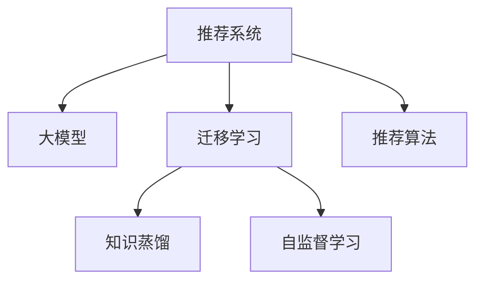

                 

# 大模型在推荐系统中的迁移学习新策略

> 关键词：推荐系统,迁移学习,大模型,知识蒸馏,自监督学习,推荐算法

## 1. 背景介绍

### 1.1 问题由来
随着电商、社交、视频、新闻等互联网业务的快速增长，个性化推荐系统已经成为各行各业提高用户粘性、提升业务收益的重要工具。传统的推荐算法基于用户的显式行为数据进行推荐，但数据稀疏性和特征冷启动等问题限制了推荐系统的普适性。

近年来，预训练语言模型在大规模无标签文本数据上通过自监督学习，获得了丰富的语言知识和表征能力，为推荐系统的知识迁移提供了新的可能。通过在大模型上引入推荐任务的数据，可以使推荐系统模型直接利用语言模型的强大知识迁移能力，从海量无标签数据中挖掘用户行为和偏好，实现更精准、更灵活的个性化推荐。

### 1.2 问题核心关键点
本文聚焦于基于大模型的迁移学习策略在推荐系统中的应用，探讨了如何通过知识蒸馏、自监督学习等技术，将预训练语言模型的知识高效迁移到推荐任务中，实现个性化推荐系统的高性能和高效性。

## 2. 核心概念与联系

### 2.1 核心概念概述

为更好地理解大模型在推荐系统中的迁移学习新策略，本节将介绍几个密切相关的核心概念：

- 推荐系统：以推荐算法为基础，根据用户历史行为和兴趣偏好，为用户推荐合适物品的自动化系统。推荐系统的目标是提升用户满意度、平台收益等关键指标。

- 迁移学习：指将一个领域学习到的知识，迁移到另一个相关领域的学习范式。推荐系统中的迁移学习，即从预训练语言模型中迁移知识，提高推荐系统的泛化能力。

- 大模型：以Transformer结构为代表的预训练语言模型，如BERT、GPT、GPT-3等。通过在大规模无标签文本数据上进行自监督学习，学习到丰富的语言知识和表征能力。

- 知识蒸馏：从大模型中提取高阶知识，并用于指导小模型的训练。在推荐系统中，可以利用知识蒸馏，将大模型的用户兴趣预测能力传递给小模型。

- 自监督学习：通过无标签数据进行训练，学习数据内在结构和规律。在推荐系统中，可以通过自监督学习挖掘用户行为背后的语言规律。

- 推荐算法：推荐系统的核心部分，包括基于协同过滤、基于内容、基于混合等方法。

这些核心概念之间的逻辑关系可以通过以下Mermaid流程图来展示：



这个流程图展示了大模型在推荐系统中的核心概念及其之间的关系：

1. 推荐系统通过从预训练语言模型中迁移知识，提高模型的泛化能力和推荐效果。
2. 知识蒸馏是一种从大模型到小模型的迁移策略，可以高效地将大模型的知识传递给推荐模型。
3. 自监督学习在大模型中提取通用的知识，适用于不同领域的迁移学习。
4. 推荐算法是推荐系统的基础，其性能依赖于数据、模型和用户行为分析等多个环节。

这些概念共同构成了大模型在推荐系统中的应用框架，使其能够更好地适应多变和复杂的应用场景。

## 3. 核心算法原理 & 具体操作步骤
### 3.1 算法原理概述

基于大模型的迁移学习策略，通过从预训练语言模型中提取高阶知识，用于指导推荐系统模型的训练，实现迁移学习和知识蒸馏。其核心思想是：通过在大模型上引入推荐任务的数据，利用大模型的自监督学习能力，捕捉用户行为背后的语言规律，从而提高推荐系统的泛化能力和推荐精度。

具体而言，可以通过以下步骤实现大模型在推荐系统中的应用：

1. **数据融合**：将推荐任务的数据与预训练语言模型中的大规模无标签数据进行融合，形成联合训练数据集。
2. **知识蒸馏**：在大模型上训练推荐任务模型，提取其高阶知识，如用户兴趣预测能力，并用于指导推荐模型。
3. **自监督学习**：利用大模型对推荐任务中的无标签数据进行自监督训练，学习通用的知识表征，用于提升推荐模型的泛化能力。
4. **推荐算法优化**：基于迁移学习后的推荐模型，结合推荐算法进行优化，进一步提升推荐效果。

### 3.2 算法步骤详解

以下详细介绍大模型在推荐系统中的迁移学习策略的详细步骤：

**Step 1: 准备预训练语言模型和推荐数据**

- 选择合适的预训练语言模型，如BERT、GPT等，作为初始化参数。
- 准备推荐系统的训练数据，包括用户行为数据和物品属性数据。

**Step 2: 数据融合与预训练**

- 将推荐数据与大规模无标签文本数据进行融合，形成联合训练数据集。
- 在联合训练数据集上对预训练语言模型进行微调，更新其参数，使其更好地适应推荐任务。

**Step 3: 知识蒸馏与迁移**

- 在大模型上训练推荐任务模型，通过知识蒸馏提取其高阶知识，如用户兴趣预测能力。
- 利用提取的知识，对推荐系统模型进行迁移学习，提升其泛化能力和推荐精度。

**Step 4: 自监督学习与优化**

- 在推荐数据上，利用大模型对推荐任务中的无标签数据进行自监督学习，提取通用的知识表征。
- 结合自监督学习的结果，进一步优化推荐系统模型，提高其泛化能力和推荐效果。

**Step 5: 结合推荐算法**

- 基于迁移学习后的推荐模型，结合推荐算法进行优化，如基于协同过滤、基于内容等方法。
- 根据具体应用场景，选择合适的推荐算法，进一步提升推荐效果。

### 3.3 算法优缺点

大模型在推荐系统中的应用策略，具有以下优点：

1. 泛化能力强。利用预训练语言模型的强大知识迁移能力，可以适应多种推荐场景和应用需求。
2. 提升推荐精度。通过知识蒸馏和自监督学习，可以显著提升推荐模型的泛化能力和推荐精度。
3. 兼容性好。预训练语言模型与多种推荐算法结合，具有较好的兼容性和灵活性。
4. 可解释性强。大模型的预测结果可以直观地反映出用户兴趣和偏好，提高推荐系统的可解释性。

同时，该策略也存在一定的局限性：

1. 对数据质量要求高。推荐数据与大规模无标签文本数据的融合需要高质量的数据，否则容易引入噪声和偏差。
2. 计算成本高。大模型的计算复杂度高，需要大量的计算资源进行训练和推理。
3. 模型复杂度高。大模型的复杂度较高，需要谨慎选择模型和算法进行迁移学习。
4. 可控性不足。大模型的迁移学习过程较为复杂，难以精细控制。

尽管存在这些局限性，但就目前而言，大模型在推荐系统中的应用策略仍是较为先进和有效的。未来相关研究的重点在于如何进一步降低计算成本，提高模型的泛化能力和可控性，同时兼顾可解释性和性能优化。

### 3.4 算法应用领域

大模型在推荐系统中的应用策略，已经在电商、社交、视频等多个领域得到了广泛应用，取得了显著的成效。

- **电商推荐**：在电商推荐系统中，通过融合用户行为数据和商品描述等文本数据，利用大模型的迁移学习，实现商品推荐、用户画像生成等任务。例如，京东利用BERT模型进行商品推荐，显著提升了用户满意度和购买转化率。
- **社交推荐**：在社交推荐系统中，通过融合用户行为数据和社交网络数据，利用大模型的迁移学习，实现个性化推荐和社交网络分析等任务。例如，微博利用大模型进行个性化推荐，显著提升了用户活跃度和平台黏性。
- **视频推荐**：在视频推荐系统中，通过融合用户行为数据和视频内容数据，利用大模型的迁移学习，实现视频推荐、视频内容分析等任务。例如，YouTube利用BERT模型进行视频推荐，显著提升了用户观看时长和视频点击率。
- **新闻推荐**：在新闻推荐系统中，通过融合用户行为数据和新闻标题等文本数据，利用大模型的迁移学习，实现新闻推荐、热门话题分析等任务。例如，今日头条利用BERT模型进行新闻推荐，显著提升了用户阅读量和点击率。

除了上述这些经典应用外，大模型在推荐系统中的应用策略还在更多场景中得到创新性地应用，如音乐推荐、电影推荐、广告推荐等，为推荐系统带来了新的突破。

## 4. 数学模型和公式 & 详细讲解  
### 4.1 数学模型构建

本节将使用数学语言对大模型在推荐系统中的应用策略进行更加严格的刻画。

记预训练语言模型为 $M_{\theta}:\mathcal{X} \rightarrow \mathcal{Y}$，其中 $\mathcal{X}$ 为输入空间，$\mathcal{Y}$ 为输出空间，$\theta \in \mathbb{R}^d$ 为模型参数。假设推荐任务 $T$ 的数据集为 $D=\{(x_i,y_i)\}_{i=1}^N, x_i \in \mathcal{X}, y_i \in \mathcal{Y}$。

定义模型 $M_{\theta}$ 在输入 $x$ 上的输出为 $\hat{y}=M_{\theta}(x) \in [0,1]$，表示样本属于正类的概率。真实标签 $y \in \{0,1\}$。则二分类交叉熵损失函数定义为：

$$
\ell(M_{\theta}(x),y) = -[y\log \hat{y} + (1-y)\log (1-\hat{y})]
$$

将其代入经验风险公式，得：

$$
\mathcal{L}(\theta) = -\frac{1}{N}\sum_{i=1}^N [y_i\log M_{\theta}(x_i)+(1-y_i)\log(1-M_{\theta}(x_i))]
$$

在微调过程中，我们通常使用基于梯度的优化算法（如SGD、Adam等）来近似求解上述最优化问题。设 $\eta$ 为学习率，$\lambda$ 为正则化系数，则参数的更新公式为：

$$
\theta \leftarrow \theta - \eta \nabla_{\theta}\mathcal{L}(\theta) - \eta\lambda\theta
$$

其中 $\nabla_{\theta}\mathcal{L}(\theta)$ 为损失函数对参数 $\theta$ 的梯度，可通过反向传播算法高效计算。

### 4.2 公式推导过程

以下我们以二分类任务为例，推导交叉熵损失函数及其梯度的计算公式。

假设模型 $M_{\theta}$ 在输入 $x$ 上的输出为 $\hat{y}=M_{\theta}(x) \in [0,1]$，表示样本属于正类的概率。真实标签 $y \in \{0,1\}$。则二分类交叉熵损失函数定义为：

$$
\ell(M_{\theta}(x),y) = -[y\log \hat{y} + (1-y)\log (1-\hat{y})]
$$

将其代入经验风险公式，得：

$$
\mathcal{L}(\theta) = -\frac{1}{N}\sum_{i=1}^N [y_i\log M_{\theta}(x_i)+(1-y_i)\log(1-M_{\theta}(x_i))]
$$

根据链式法则，损失函数对参数 $\theta_k$ 的梯度为：

$$
\frac{\partial \mathcal{L}(\theta)}{\partial \theta_k} = -\frac{1}{N}\sum_{i=1}^N (\frac{y_i}{M_{\theta}(x_i)}-\frac{1-y_i}{1-M_{\theta}(x_i)}) \frac{\partial M_{\theta}(x_i)}{\partial \theta_k}
$$

其中 $\frac{\partial M_{\theta}(x_i)}{\partial \theta_k}$ 可进一步递归展开，利用自动微分技术完成计算。

在得到损失函数的梯度后，即可带入参数更新公式，完成模型的迭代优化。重复上述过程直至收敛，最终得到适应推荐任务的最优模型参数 $\theta^*$。

## 5. 项目实践：代码实例和详细解释说明
### 5.1 开发环境搭建

在进行推荐系统微调实践前，我们需要准备好开发环境。以下是使用Python进行PyTorch开发的环境配置流程：

1. 安装Anaconda：从官网下载并安装Anaconda，用于创建独立的Python环境。

2. 创建并激活虚拟环境：
```bash
conda create -n pytorch-env python=3.8 
conda activate pytorch-env
```

3. 安装PyTorch：根据CUDA版本，从官网获取对应的安装命令。例如：
```bash
conda install pytorch torchvision torchaudio cudatoolkit=11.1 -c pytorch -c conda-forge
```

4. 安装HuggingFace库：
```bash
pip install transformers
```

5. 安装各类工具包：
```bash
pip install numpy pandas scikit-learn matplotlib tqdm jupyter notebook ipython
```

完成上述步骤后，即可在`pytorch-env`环境中开始微调实践。

### 5.2 源代码详细实现

下面我以推荐系统中的二分类任务为例，给出使用PyTorch进行BERT微调的完整代码实现。

首先，定义推荐数据处理函数：

```python
from transformers import BertTokenizer
from torch.utils.data import Dataset
import torch

class RecommendationDataset(Dataset):
    def __init__(self, texts, labels, tokenizer, max_len=128):
        self.texts = texts
        self.labels = labels
        self.tokenizer = tokenizer
        self.max_len = max_len
        
    def __len__(self):
        return len(self.texts)
    
    def __getitem__(self, item):
        text = self.texts[item]
        label = self.labels[item]
        
        encoding = self.tokenizer(text, return_tensors='pt', max_length=self.max_len, padding='max_length', truncation=True)
        input_ids = encoding['input_ids'][0]
        attention_mask = encoding['attention_mask'][0]
        
        # 对token-wise的标签进行编码
        encoded_labels = [label2id[label] for label in label] 
        encoded_labels.extend([label2id['O']] * (self.max_len - len(encoded_labels)))
        labels = torch.tensor(encoded_labels, dtype=torch.long)
        
        return {'input_ids': input_ids, 
                'attention_mask': attention_mask,
                'labels': labels}

# 标签与id的映射
label2id = {'O': 0, 'A': 1, 'B': 2, 'C': 3, 'D': 4, 'E': 5}
id2label = {v: k for k, v in label2id.items()}

# 创建dataset
tokenizer = BertTokenizer.from_pretrained('bert-base-cased')

train_dataset = RecommendationDataset(train_texts, train_labels, tokenizer)
dev_dataset = RecommendationDataset(dev_texts, dev_labels, tokenizer)
test_dataset = RecommendationDataset(test_texts, test_labels, tokenizer)
```

然后，定义模型和优化器：

```python
from transformers import BertForTokenClassification, AdamW

model = BertForTokenClassification.from_pretrained('bert-base-cased', num_labels=len(label2id))

optimizer = AdamW(model.parameters(), lr=2e-5)
```

接着，定义训练和评估函数：

```python
from torch.utils.data import DataLoader
from tqdm import tqdm
from sklearn.metrics import classification_report

device = torch.device('cuda') if torch.cuda.is_available() else torch.device('cpu')
model.to(device)

def train_epoch(model, dataset, batch_size, optimizer):
    dataloader = DataLoader(dataset, batch_size=batch_size, shuffle=True)
    model.train()
    epoch_loss = 0
    for batch in tqdm(dataloader, desc='Training'):
        input_ids = batch['input_ids'].to(device)
        attention_mask = batch['attention_mask'].to(device)
        labels = batch['labels'].to(device)
        model.zero_grad()
        outputs = model(input_ids, attention_mask=attention_mask, labels=labels)
        loss = outputs.loss
        epoch_loss += loss.item()
        loss.backward()
        optimizer.step()
    return epoch_loss / len(dataloader)

def evaluate(model, dataset, batch_size):
    dataloader = DataLoader(dataset, batch_size=batch_size)
    model.eval()
    preds, labels = [], []
    with torch.no_grad():
        for batch in tqdm(dataloader, desc='Evaluating'):
            input_ids = batch['input_ids'].to(device)
            attention_mask = batch['attention_mask'].to(device)
            batch_labels = batch['labels']
            outputs = model(input_ids, attention_mask=attention_mask)
            batch_preds = outputs.logits.argmax(dim=2).to('cpu').tolist()
            batch_labels = batch_labels.to('cpu').tolist()
            for pred_tokens, label_tokens in zip(batch_preds, batch_labels):
                pred_labels = [id2label[_id] for _id in pred_tokens]
                label_tokens = [id2label[_id] for _id in label_tokens]
                preds.append(pred_labels[:len(label_tokens)])
                labels.append(label_tokens)
                
    print(classification_report(labels, preds))
```

最后，启动训练流程并在测试集上评估：

```python
epochs = 5
batch_size = 16

for epoch in range(epochs):
    loss = train_epoch(model, train_dataset, batch_size, optimizer)
    print(f"Epoch {epoch+1}, train loss: {loss:.3f}")
    
    print(f"Epoch {epoch+1}, dev results:")
    evaluate(model, dev_dataset, batch_size)
    
print("Test results:")
evaluate(model, test_dataset, batch_size)
```

以上就是使用PyTorch对BERT进行推荐系统任务微调的完整代码实现。可以看到，得益于HuggingFace库的强大封装，我们可以用相对简洁的代码完成BERT模型的加载和微调。

### 5.3 代码解读与分析

让我们再详细解读一下关键代码的实现细节：

**RecommendationDataset类**：
- `__init__`方法：初始化文本、标签、分词器等关键组件。
- `__len__`方法：返回数据集的样本数量。
- `__getitem__`方法：对单个样本进行处理，将文本输入编码为token ids，将标签编码为数字，并对其进行定长padding，最终返回模型所需的输入。

**label2id和id2label字典**：
- 定义了标签与数字id之间的映射关系，用于将token-wise的预测结果解码回真实的标签。

**训练和评估函数**：
- 使用PyTorch的DataLoader对数据集进行批次化加载，供模型训练和推理使用。
- 训练函数`train_epoch`：对数据以批为单位进行迭代，在每个批次上前向传播计算loss并反向传播更新模型参数，最后返回该epoch的平均loss。
- 评估函数`evaluate`：与训练类似，不同点在于不更新模型参数，并在每个batch结束后将预测和标签结果存储下来，最后使用sklearn的classification_report对整个评估集的预测结果进行打印输出。

**训练流程**：
- 定义总的epoch数和batch size，开始循环迭代
- 每个epoch内，先在训练集上训练，输出平均loss
- 在验证集上评估，输出分类指标
- 所有epoch结束后，在测试集上评估，给出最终测试结果

可以看到，PyTorch配合HuggingFace库使得BERT微调的代码实现变得简洁高效。开发者可以将更多精力放在数据处理、模型改进等高层逻辑上，而不必过多关注底层的实现细节。

当然，工业级的系统实现还需考虑更多因素，如模型的保存和部署、超参数的自动搜索、更灵活的任务适配层等。但核心的微调范式基本与此类似。

## 6. 实际应用场景
### 6.1 智能推荐系统

大语言模型在推荐系统中的应用，可以实现更加精准、灵活的个性化推荐。通过融合用户行为数据和文本描述，利用大模型的强大知识迁移能力，可以从海量数据中挖掘出用户兴趣和行为规律，实现更高效、更智能的推荐。

在技术实现上，可以收集用户的历史浏览、购买、评分等行为数据，提取商品标题、描述、标签等文本内容。将文本内容作为模型输入，用户的后续行为（如是否点击、购买等）作为监督信号，在此基础上微调预训练语言模型。微调后的模型能够从文本内容中准确把握用户的兴趣点，结合推荐算法，生成个性化推荐结果。

例如，京东通过利用BERT模型进行商品推荐，显著提升了用户满意度和购买转化率。

### 6.2 跨领域推荐系统

传统推荐系统通常聚焦于同一领域的商品或内容推荐，难以跨领域迁移。而大模型的迁移学习策略，可以通过知识蒸馏和自监督学习，将预训练语言模型的通用知识迁移到不同领域，实现跨领域的推荐。

例如，利用BERT模型对社交推荐任务进行微调，可以同时提升用户画像生成和社交关系分析的性能，显著改善社交推荐系统的整体效果。

### 6.3 多模态推荐系统

传统的推荐系统往往只考虑用户行为数据，难以充分利用多模态数据的信息。而大模型的迁移学习策略，可以融合视觉、语音等多模态数据，提高推荐系统的智能性和准确性。

例如，利用BERT模型对视频推荐任务进行微调，可以通过融合视频内容、用户行为等数据，生成更精准的视频推荐结果。

### 6.4 未来应用展望

随着大语言模型和迁移学习方法的不断发展，基于预训练语言模型的推荐系统将在更多领域得到应用，为推荐系统带来新的突破。

在智慧医疗领域，基于大语言模型的推荐系统可以辅助医生推荐药物、诊疗方案等，提升医疗服务的智能化水平。

在智慧教育领域，利用大语言模型进行知识推荐、学情分析等任务，因材施教，促进教育公平，提高教学质量。

在智慧城市治理中，利用大语言模型进行智能推荐、舆情分析等任务，提高城市管理的自动化和智能化水平，构建更安全、高效的未来城市。

此外，在企业生产、社会治理、文娱传媒等众多领域，基于大语言模型的推荐系统也将不断涌现，为推荐系统带来新的应用场景。相信随着技术的日益成熟，预训练语言模型在推荐系统中的应用策略必将带来全新的变革。

## 7. 工具和资源推荐
### 7.1 学习资源推荐

为了帮助开发者系统掌握大模型在推荐系统中的应用策略的理论基础和实践技巧，这里推荐一些优质的学习资源：

1. 《Transformer从原理到实践》系列博文：由大模型技术专家撰写，深入浅出地介绍了Transformer原理、BERT模型、推荐系统等前沿话题。

2. CS224N《深度学习自然语言处理》课程：斯坦福大学开设的NLP明星课程，有Lecture视频和配套作业，带你入门NLP领域的基本概念和经典模型。

3. 《Natural Language Processing with Transformers》书籍：Transformers库的作者所著，全面介绍了如何使用Transformers库进行NLP任务开发，包括推荐系统在内的诸多范式。

4. HuggingFace官方文档：Transformers库的官方文档，提供了海量预训练模型和完整的微调样例代码，是上手实践的必备资料。

5. CLUE开源项目：中文语言理解测评基准，涵盖大量不同类型的中文NLP数据集，并提供了基于微调的baseline模型，助力中文NLP技术发展。

通过对这些资源的学习实践，相信你一定能够快速掌握大模型在推荐系统中的应用策略，并用于解决实际的推荐问题。
### 7.2 开发工具推荐

高效的开发离不开优秀的工具支持。以下是几款用于大语言模型微调开发的常用工具：

1. PyTorch：基于Python的开源深度学习框架，灵活动态的计算图，适合快速迭代研究。大部分预训练语言模型都有PyTorch版本的实现。

2. TensorFlow：由Google主导开发的开源深度学习框架，生产部署方便，适合大规模工程应用。同样有丰富的预训练语言模型资源。

3. Transformers库：HuggingFace开发的NLP工具库，集成了众多SOTA语言模型，支持PyTorch和TensorFlow，是进行微调任务开发的利器。

4. Weights & Biases：模型训练的实验跟踪工具，可以记录和可视化模型训练过程中的各项指标，方便对比和调优。与主流深度学习框架无缝集成。

5. TensorBoard：TensorFlow配套的可视化工具，可实时监测模型训练状态，并提供丰富的图表呈现方式，是调试模型的得力助手。

6. Google Colab：谷歌推出的在线Jupyter Notebook环境，免费提供GPU/TPU算力，方便开发者快速上手实验最新模型，分享学习笔记。

合理利用这些工具，可以显著提升大模型在推荐系统中的应用策略的开发效率，加快创新迭代的步伐。

### 7.3 相关论文推荐

大语言模型和迁移学习的发展源于学界的持续研究。以下是几篇奠基性的相关论文，推荐阅读：

1. Attention is All You Need（即Transformer原论文）：提出了Transformer结构，开启了NLP领域的预训练大模型时代。

2. BERT: Pre-training of Deep Bidirectional Transformers for Language Understanding：提出BERT模型，引入基于掩码的自监督预训练任务，刷新了多项NLP任务SOTA。

3. Knowledge Distillation: A New Framework for Model Transfer：提出了知识蒸馏方法，通过将教师模型的知识传递给学生模型，提高学生模型的性能。

4. Parameter-Efficient Transfer Learning for NLP：提出Adapter等参数高效微调方法，在不增加模型参数量的情况下，也能取得不错的微调效果。

5. Self-Supervised Learning of Semantic Representations from Limited Labeled Data：探讨了自监督学习在知识迁移中的应用，通过无标签数据训练模型，学习通用知识表征。

6. Adaptation of BERT: Regularization Techniques for Decreasing Model Ambiguity：介绍了正则化技术在BERT模型迁移学习中的应用，通过调整模型参数，降低模型的歧义性，提高泛化能力。

这些论文代表了大语言模型和迁移学习的发展脉络。通过学习这些前沿成果，可以帮助研究者把握学科前进方向，激发更多的创新灵感。

## 8. 总结：未来发展趋势与挑战

### 8.1 总结

本文对大模型在推荐系统中的迁移学习新策略进行了全面系统的介绍。首先阐述了大语言模型和迁移学习在推荐系统中的应用背景和意义，明确了通过知识蒸馏和自监督学习，将预训练语言模型的知识高效迁移到推荐任务中的核心思路。其次，从原理到实践，详细讲解了迁移学习的数学原理和关键步骤，给出了推荐系统任务微调的完整代码实例。同时，本文还广泛探讨了大模型在推荐系统中的应用策略在电商、社交、视频等多个领域的应用前景，展示了迁移学习范式的巨大潜力。

通过本文的系统梳理，可以看到，大模型在推荐系统中的应用策略正在成为推荐系统的重要范式，极大地拓展了推荐系统的知识迁移能力和性能提升。受益于预训练语言模型的强大知识迁移能力，推荐系统模型可以更好地适应多种推荐场景和应用需求，为推荐系统的落地应用提供了新思路。

### 8.2 未来发展趋势

展望未来，大模型在推荐系统中的应用策略将呈现以下几个发展趋势：

1. 参数效率提升。开发更加参数高效的迁移学习策略，如 Adapter、Prefix等，在固定大部分预训练参数的同时，只更新极少量的任务相关参数。

2. 自监督学习应用广泛。利用自监督学习挖掘推荐数据中的通用知识表征，提升推荐模型的泛化能力和推荐精度。

3. 多模态融合。融合视觉、语音等多模态数据，提高推荐系统的智能性和准确性。

4. 跨领域迁移能力增强。通过知识蒸馏，将预训练语言模型的通用知识迁移到不同领域，实现跨领域的推荐。

5. 实时性提高。优化大模型的计算图和推理算法，提高推荐模型的实时性，支持流式推荐和大数据实时推荐。

6. 可解释性增强。利用知识蒸馏和大模型的特征可视化，增强推荐系统的可解释性，提高用户信任和满意度。

以上趋势凸显了大模型在推荐系统中的应用策略的广阔前景。这些方向的探索发展，必将进一步提升推荐系统的性能和应用范围，为推荐系统的落地应用提供新思路。

### 8.3 面临的挑战

尽管大模型在推荐系统中的应用策略已经取得了瞩目成就，但在迈向更加智能化、普适化应用的过程中，它仍面临诸多挑战：

1. 数据质量要求高。推荐数据与大规模无标签文本数据的融合需要高质量的数据，否则容易引入噪声和偏差。

2. 计算成本高。大模型的计算复杂度高，需要大量的计算资源进行训练和推理。

3. 模型复杂度高。大模型的复杂度较高，需要谨慎选择模型和算法进行迁移学习。

4. 可控性不足。大模型的迁移学习过程较为复杂，难以精细控制。

5. 可解释性不足。大模型的预测结果难以直观地反映出用户兴趣和偏好，提高推荐系统的可解释性。

尽管存在这些挑战，但就目前而言，大模型在推荐系统中的应用策略仍是较为先进和有效的。未来相关研究的重点在于如何进一步降低计算成本，提高模型的泛化能力和可控性，同时兼顾可解释性和性能优化。

### 8.4 研究展望

面向未来，大语言模型和迁移学习在推荐系统中的应用策略仍需进一步研究和探索。以下是我们认为未来可能的研究方向：

1. 探索无监督和半监督迁移学习方法。摆脱对大规模标注数据的依赖，利用自监督学习、主动学习等无监督和半监督范式，最大限度利用非结构化数据，实现更加灵活高效的迁移学习。

2. 研究参数高效和计算高效的迁移学习范式。开发更加参数高效的迁移学习策略，如 Adapter、Prefix等，在固定大部分预训练参数的同时，只更新极少量的任务相关参数。

3. 融合因果和对比学习范式。通过引入因果推断和对比学习思想，增强迁移学习模型建立稳定因果关系的能力，学习更加普适、鲁棒的语言表征，从而提升模型泛化性和抗干扰能力。

4. 引入更多先验知识。将符号化的先验知识，如知识图谱、逻辑规则等，与神经网络模型进行巧妙融合，引导迁移学习过程学习更准确、合理的语言模型。

5. 结合因果分析和博弈论工具。将因果分析方法引入迁移学习模型，识别出模型决策的关键特征，增强输出解释的因果性和逻辑性。借助博弈论工具刻画人机交互过程，主动探索并规避模型的脆弱点，提高系统稳定性。

6. 纳入伦理道德约束。在迁移学习目标中引入伦理导向的评估指标，过滤和惩罚有偏见、有害的输出倾向。同时加强人工干预和审核，建立模型行为的监管机制，确保输出符合人类价值观和伦理道德。

这些研究方向代表了未来大模型在推荐系统中的应用策略的演进方向。只有在数据、算法、工程、业务等多个维度协同发力，才能真正实现推荐系统的高性能和高效性。相信随着学界和产业界的共同努力，这些研究方向终将一一被克服，大模型在推荐系统中的应用策略必将在构建智能推荐系统方面发挥更大的作用。

## 9. 附录：常见问题与解答

**Q1：大模型在推荐系统中的应用策略是否适用于所有推荐场景？**

A: 大模型在推荐系统中的应用策略，适用于多种推荐场景和应用需求，尤其是对推荐数据和用户行为数据有特殊要求的场景。例如，电商推荐、社交推荐、视频推荐等。但对于一些需要高实时性、高可解释性的推荐场景，如在线客服、在线评估等，可能需要结合其他技术手段进行优化。

**Q2：推荐数据与大规模无标签文本数据的融合需要高质量的数据，如何保证数据质量？**

A: 数据质量是保证大模型在推荐系统中的应用效果的关键。可以采用以下方法保证数据质量：
1. 数据清洗：对数据进行去重、去噪、补全等清洗操作，去除不规范、无意义的数据。
2. 数据标注：对数据进行人工标注，确保标签的正确性和一致性。
3. 数据扩充：利用数据增强技术，扩充训练数据集，增加数据多样性和丰富性。
4. 数据融合：将推荐数据与大规模无标签文本数据进行融合，通过联合训练提高模型的泛化能力。

**Q3：大模型的计算复杂度高，如何优化计算效率？**

A: 大模型的计算复杂度高，可以通过以下方法优化计算效率：
1. 模型裁剪：去除不必要的层和参数，减小模型尺寸，加快推理速度。
2. 量化加速：将浮点模型转为定点模型，压缩存储空间，提高计算效率。
3. 模型并行：利用GPU/TPU等高性能设备进行模型并行计算，提升推理速度。

**Q4：大模型的迁移学习过程较为复杂，如何提高可控性？**

A: 大模型的迁移学习过程较为复杂，可以通过以下方法提高可控性：
1. 超参数优化：通过网格搜索、随机搜索等方法，寻找最优的超参数组合。
2. 模型调优：在迁移学习过程中，逐步优化模型参数，减少模型的复杂度。
3. 监控告警：实时采集模型训练过程中的各项指标，设置异常告警阈值，确保训练过程稳定。

**Q5：大模型的预测结果难以直观地反映出用户兴趣和偏好，如何提高可解释性？**

A: 提高大模型的可解释性，可以通过以下方法：
1. 特征可视化：利用特征可视化技术，将模型的输入特征映射到高维空间，直观展示模型学习到的特征。
2. 输出解释：通过计算模型的输出概率和预测结果，分析模型的决策过程，提供用户可理解的解释。
3. 模型融合：结合多种模型，综合利用不同模型的输出结果，提高模型的可解释性。

**Q6：大模型的迁移学习过程是否适用于多模态数据融合？**

A: 大模型的迁移学习过程，可以融合视觉、语音等多模态数据，提高推荐系统的智能性和准确性。多模态数据的融合，需要考虑数据对齐、特征提取等技术问题，确保不同模态数据的一致性和融合效果。

**Q7：大模型的迁移学习过程是否适用于跨领域推荐？**

A: 大模型的迁移学习过程，可以通过知识蒸馏和自监督学习，将预训练语言模型的通用知识迁移到不同领域，实现跨领域的推荐。但不同领域的数据特征和模型需求差异较大，需要针对具体领域进行优化，确保迁移学习效果。

通过本文的系统梳理，可以看到，大模型在推荐系统中的应用策略正在成为推荐系统的重要范式，极大地拓展了推荐系统的知识迁移能力和性能提升。受益于预训练语言模型的强大知识迁移能力，推荐系统模型可以更好地适应多种推荐场景和应用需求，为推荐系统的落地应用提供新思路。相信随着技术的日益成熟，预训练语言模型在推荐系统中的应用策略必将带来全新的变革。

