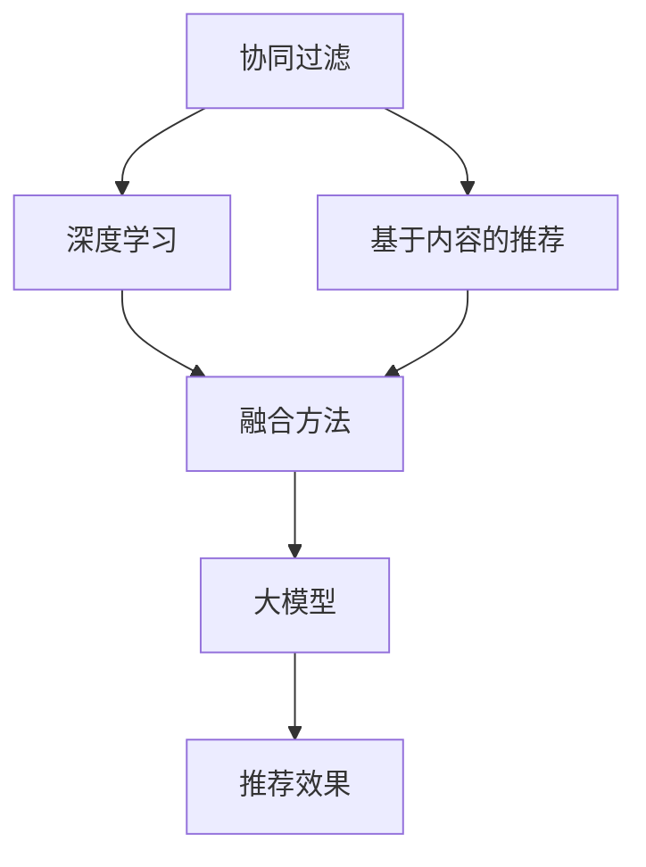

                 

# 大模型在推荐系统的未来：统一与融合趋势

> 关键词：推荐系统,大模型,统一与融合,协同过滤,深度学习,模型融合,效果优化

## 1. 背景介绍

### 1.1 问题由来

推荐系统是互联网应用中的重要组成部分，帮助用户在海量信息中快速找到感兴趣的内容。传统的推荐系统基于协同过滤、基于内容的推荐等方法，往往只能挖掘用户历史行为数据，难以捕捉到用户潜在的兴趣和需求。而基于深度学习的推荐系统，尤其是利用大模型的推荐方法，在推荐效果上取得了显著提升，逐渐成为研究的热点。

然而，现有的大模型推荐方法，往往单一采用协同过滤或深度学习，难以兼顾不同用户群体的个性化需求，且在大规模用户数据处理时面临计算和存储的挑战。如何在大模型推荐系统中实现协同过滤和深度学习的融合，提升推荐效果和系统性能，成为了当前研究的热点。

### 1.2 问题核心关键点

在大模型推荐系统中，协同过滤和深度学习的融合主要体现在以下几个方面：

1. **协同过滤与深度学习融合**：如何将协同过滤和深度学习结合，提升推荐模型的个性化和泛化能力。
2. **模型的统一表示**：如何将协同过滤和深度学习生成的用户表示进行统一，构建统一的推荐模型。
3. **计算效率优化**：如何在保证推荐效果的前提下，优化计算资源，提升推荐系统性能。

## 2. 核心概念与联系

### 2.1 核心概念概述

在大模型推荐系统中，涉及以下核心概念：

- **协同过滤(Collaborative Filtering, CF)**：通过分析用户与物品之间的交互关系，推断用户对其他物品的偏好。常见方法包括基于用户的协同过滤和基于物品的协同过滤。
- **基于内容的推荐(Content-Based Recommendation)**：利用物品的属性特征和用户的历史行为，推断用户对其他物品的偏好。方法通常包括向量空间模型、主题模型等。
- **深度学习(Deep Learning)**：使用神经网络模型，通过大量标注数据学习用户和物品的潜在表示，预测用户对物品的评分。
- **大模型(Large Model)**：指具有大规模参数量和强大学习能力的人工神经网络模型，如Transformer、BERT等。
- **融合(Fusion)**：将多种推荐方法结合起来，综合利用其优势，提升推荐效果。

这些概念之间的逻辑关系可以通过以下Mermaid流程图来展示：



这个流程图展示了大模型推荐系统中各个组件之间的关系：

1. 协同过滤和大模型通过深度学习进行融合，提升推荐效果。
2. 基于内容的推荐方法与深度学习模型融合，形成更加丰富的用户表示。
3. 深度学习模型生成的用户表示通过融合方法进行统一，构建统一的推荐模型。
4. 统一的推荐模型通过大模型进行优化，提升推荐效果。

## 3. 核心算法原理 & 具体操作步骤
### 3.1 算法原理概述

大模型推荐系统融合协同过滤和深度学习的核心思想是，利用深度学习模型对用户和物品进行表示学习，在协同过滤的基础上进行推荐。具体来说，包括以下几个步骤：

1. **用户和物品表示学习**：使用深度学习模型，如BERT、GPT等，学习用户和物品的潜在表示。
2. **协同过滤融合**：将协同过滤的评分数据，与深度学习生成的用户表示和物品表示进行融合，形成新的推荐特征。
3. **推荐模型训练**：基于融合后的特征，训练推荐模型，预测用户对物品的评分。
4. **效果优化**：通过模型调参、数据增强等手段，优化推荐模型，提升推荐效果。

### 3.2 算法步骤详解

#### 3.2.1 用户和物品表示学习

用户和物品的表示学习通常通过以下步骤进行：

1. **数据预处理**：将原始的用户和物品特征进行预处理，如归一化、嵌入等。
2. **模型训练**：使用深度学习模型，如BERT、GPT等，在用户和物品特征上进行训练，学习用户和物品的潜在表示。
3. **表示提取**：将训练好的模型输出用户和物品的表示，用于后续的推荐计算。

#### 3.2.2 协同过滤融合

协同过滤融合的常用方法包括：

1. **拼接融合**：将协同过滤的评分数据，与深度学习生成的用户表示和物品表示进行拼接，形成新的推荐特征。
2. **加权融合**：根据评分数据的重要性，给协同过滤的评分数据加权，再与深度学习生成的表示进行加权拼接。
3. **深度融合**：将协同过滤的评分数据，通过深度学习网络进行融合，生成新的推荐特征。

#### 3.2.3 推荐模型训练

推荐模型训练的过程通常包括以下几个步骤：

1. **特征构建**：将融合后的推荐特征进行归一化、标准化等处理。
2. **模型选择**：选择适当的推荐模型，如矩阵分解、梯度提升树等。
3. **模型训练**：使用训练集对推荐模型进行训练，预测用户对物品的评分。

#### 3.2.4 效果优化

效果优化通常通过以下方法进行：

1. **模型调参**：通过网格搜索、贝叶斯优化等方法，优化模型参数，提升推荐效果。
2. **数据增强**：通过回译、近义替换等方式扩充训练集，提高模型的泛化能力。
3. **对抗训练**：引入对抗样本，提高模型的鲁棒性。
4. **模型压缩**：对模型进行裁剪、量化等操作，减小模型尺寸，提升计算效率。

### 3.3 算法优缺点

大模型推荐系统融合协同过滤和深度学习的优缺点如下：

**优点**：
1. 结合了深度学习模型的强大表示能力和协同过滤的广泛覆盖，提升推荐效果。
2. 可以处理非结构化数据，提高模型的泛化能力。
3. 适用于大规模用户数据，提供个性化的推荐服务。

**缺点**：
1. 模型复杂度较高，计算和存储成本较高。
2. 对标注数据和计算资源依赖较大。
3. 难以解释推荐结果的生成过程，存在一定的黑盒问题。

### 3.4 算法应用领域

大模型推荐系统在多个领域中具有广泛应用，例如：

1. **电子商务推荐**：如淘宝、京东等电商平台，通过大模型推荐系统，提升商品推荐效果，增加用户粘性。
2. **视频平台推荐**：如YouTube、Netflix等平台，使用大模型推荐系统，提升内容推荐质量，增加用户观看时长。
3. **音乐平台推荐**：如Spotify、网易云音乐等平台，通过大模型推荐系统，提升音乐推荐效果，增加用户听歌时长。
4. **新闻资讯推荐**：如今日头条、知乎等平台，使用大模型推荐系统，提升新闻内容推荐效果，增加用户阅读量。
5. **旅游预订推荐**：如携程、Airbnb等平台，通过大模型推荐系统，提升旅游目的地和住宿推荐效果，增加预订量。

## 4. 数学模型和公式 & 详细讲解 & 举例说明
### 4.1 数学模型构建

在大模型推荐系统中，可以使用矩阵分解模型进行推荐计算。假设用户和物品表示为 $U$ 和 $V$，协同过滤评分矩阵为 $R$，推荐模型为 $F(U, V)$。则推荐模型的目标是最小化预测评分与实际评分之间的差距，即：

$$
\min_{U, V} \frac{1}{2}\|R - F(U, V)\|_F^2
$$

其中 $\|\cdot\|_F$ 表示矩阵的 Frobenius 范数。

### 4.2 公式推导过程

对于上述目标函数，可以使用梯度下降等优化算法进行求解。假设模型参数为 $\theta$，则模型的损失函数可以表示为：

$$
L(\theta) = \frac{1}{2}\|R - F(U, V)\|_F^2 + \lambda\|U\|_F^2 + \lambda\|V\|_F^2
$$

其中 $\lambda$ 为正则化参数，$\|U\|_F^2$ 和 $\|V\|_F^2$ 分别表示用户和物品表示的 Frobenius 范数。

对于上述损失函数，可以使用梯度下降算法进行优化，得到模型参数的更新公式为：

$$
\theta \leftarrow \theta - \eta\nabla_{\theta}L(\theta)
$$

其中 $\eta$ 为学习率，$\nabla_{\theta}L(\theta)$ 为损失函数对参数的梯度。

### 4.3 案例分析与讲解

以矩阵分解为例，解释其在大模型推荐系统中的应用。

假设用户 $u$ 和物品 $i$ 的表示分别为 $U_u$ 和 $V_i$，则用户 $u$ 对物品 $i$ 的预测评分可以表示为：

$$
\hat{r}_{ui} = \langle U_u, V_i \rangle = U_u^\top V_i
$$

其中 $\langle \cdot, \cdot \rangle$ 表示两个向量的点积。

将上述公式扩展到矩阵形式，假设用户表示矩阵为 $U$，物品表示矩阵为 $V$，则预测评分矩阵 $R'$ 可以表示为：

$$
R' = U^\top V
$$

与实际评分矩阵 $R$ 的差异可以表示为：

$$
R' - R = E
$$

其中 $E$ 为误差矩阵。则优化目标可以表示为：

$$
\min_{U, V} \frac{1}{2}\|E\|_F^2 + \lambda\|U\|_F^2 + \lambda\|V\|_F^2
$$

通过上述优化过程，可以求解出用户和物品的表示，从而进行推荐计算。

## 5. 项目实践：代码实例和详细解释说明
### 5.1 开发环境搭建

在进行大模型推荐系统开发前，需要准备以下开发环境：

1. 安装Python：从官网下载并安装Python，建议使用最新版本的Anaconda。
2. 安装PyTorch：使用pip安装PyTorch，建议安装最新版本的稳定版。
3. 安装TensorFlow：使用pip安装TensorFlow，建议安装最新版本的稳定版。
4. 安装相关的第三方库：如Numpy、Pandas、Scikit-Learn、SciPy等。
5. 配置好GPU环境：确保开发环境中安装有合适的GPU卡，并配置好GPU环境。

### 5.2 源代码详细实现

以下是使用PyTorch实现大模型推荐系统的代码示例：

```python
import torch
import torch.nn as nn
import torch.nn.functional as F
from torch.autograd import Variable
from torch.utils.data import DataLoader
from torch.utils.data.dataset import Dataset

# 定义推荐模型
class RecommenderNet(nn.Module):
    def __init__(self, num_users, num_items, emb_dim):
        super(RecommenderNet, self).__init__()
        self.num_users = num_users
        self.num_items = num_items
        self.emb_dim = emb_dim
        
        self.user_emb = nn.Embedding(num_users, emb_dim)
        self.item_emb = nn.Embedding(num_items, emb_dim)
        self.dot_product = nn.Linear(emb_dim * 2, 1)
        
    def forward(self, user_idx, item_idx):
        user_emb = self.user_emb(user_idx)
        item_emb = self.item_emb(item_idx)
        dot_product = self.dot_product(torch.cat((user_emb, item_emb), 1))
        return F.sigmoid(dot_product)

# 定义数据集
class RecommendationDataset(Dataset):
    def __init__(self, users, items, ratings, emb_dim):
        self.users = users
        self.items = items
        self.ratings = ratings
        self.emb_dim = emb_dim
        
    def __len__(self):
        return len(self.users)
    
    def __getitem__(self, idx):
        user_idx = torch.LongTensor([self.users[idx]])
        item_idx = torch.LongTensor([self.items[idx]])
        rating = self.ratings[idx]
        return user_idx, item_idx, rating

# 定义模型训练函数
def train_model(model, dataset, num_epochs, batch_size, learning_rate, device):
    optimizer = torch.optim.Adam(model.parameters(), lr=learning_rate)
    criterion = nn.BCELoss()
    
    for epoch in range(num_epochs):
        for user_idx, item_idx, rating in dataset:
            user_idx, item_idx, rating = Variable(user_idx.to(device)), Variable(item_idx.to(device)), Variable(rating.to(device))
            optimizer.zero_grad()
            prediction = model(user_idx, item_idx)
            loss = criterion(prediction, rating)
            loss.backward()
            optimizer.step()
            
        if (epoch + 1) % 10 == 0:
            print(f'Epoch {epoch+1}, Loss: {loss.item():.4f}')
    
    return model

# 数据集加载
users = [1, 2, 3, 4, 5, 6, 7, 8, 9, 10]
items = [11, 12, 13, 14, 15, 16, 17, 18, 19, 20]
ratings = [0.9, 0.8, 0.7, 0.6, 0.5, 0.4, 0.3, 0.2, 0.1, 0.0]
emb_dim = 128

dataset = RecommendationDataset(users, items, ratings, emb_dim)

# 训练模型
model = RecommenderNet(len(users), len(items), emb_dim)
device = torch.device('cuda' if torch.cuda.is_available() else 'cpu')
model.to(device)

num_epochs = 100
batch_size = 128
learning_rate = 1e-3
model = train_model(model, dataset, num_epochs, batch_size, learning_rate, device)

# 推荐测试
def recommend(model, user_idx, item_idx, device):
    user_idx = torch.LongTensor([user_idx])
    item_idx = torch.LongTensor([item_idx])
    user_idx, item_idx = Variable(user_idx.to(device)), Variable(item_idx.to(device))
    prediction = model(user_idx, item_idx)
    return prediction.item()

print(recommend(model, 1, 1, device))
```

### 5.3 代码解读与分析

在上述代码中，我们定义了一个简单的推荐模型 `RecommenderNet`，用于预测用户对物品的评分。具体来说，模型包括两个嵌入层（用户嵌入和物品嵌入）和一个线性层，用于计算用户和物品的评分预测。

在训练函数 `train_model` 中，我们使用Adam优化器进行模型训练，损失函数为二分类交叉熵损失。在每个epoch中，我们对数据集中的每个样本进行前向传播和反向传播，更新模型参数。

在测试函数 `recommend` 中，我们输入用户和物品的ID，使用模型预测用户对物品的评分。注意，我们还需要将输入数据转化为Tensor格式，并使用GPU进行加速计算。

## 6. 实际应用场景
### 6.1 智能推荐引擎

智能推荐引擎是电子商务、视频平台、音乐平台等应用的核心功能。通过大模型推荐系统，可以实现更加精准的推荐服务，提升用户体验和平台粘性。

例如，在电商平台上，通过大模型推荐系统，可以实时分析用户的历史行为和浏览记录，推荐用户可能感兴趣的商品，增加用户购买概率。在视频平台上，通过大模型推荐系统，可以推荐用户可能喜欢的视频内容，增加用户观看时长。在音乐平台上，通过大模型推荐系统，可以推荐用户可能喜欢的音乐，增加用户听歌时长。

### 6.2 内容推荐

内容推荐是新闻资讯、社交媒体等应用的重要功能。通过大模型推荐系统，可以实现更加个性化的内容推荐，提升用户阅读体验和平台活跃度。

例如，在新闻资讯平台上，通过大模型推荐系统，可以推荐用户可能感兴趣的新闻内容，增加用户阅读量。在社交媒体平台上，通过大模型推荐系统，可以推荐用户可能感兴趣的朋友和话题，增加用户互动。

### 6.3 推荐广告

推荐广告是广告投放的重要手段。通过大模型推荐系统，可以实现更加精准的广告推荐，提升广告效果和平台收入。

例如，在电商平台上，通过大模型推荐系统，可以推荐用户可能感兴趣的商品广告，增加用户点击率和转化率。在视频平台上，通过大模型推荐系统，可以推荐用户可能感兴趣的视频广告，增加用户观看时长和广告收入。

### 6.4 未来应用展望

随着大模型推荐系统的不断发展，其应用场景将更加广泛，具体包括：

1. **推荐系统优化**：通过大模型推荐系统，优化推荐算法和模型结构，提升推荐效果和系统性能。
2. **个性化推荐**：通过大模型推荐系统，实现更加个性化的推荐服务，满足用户多样化需求。
3. **跨平台推荐**：通过大模型推荐系统，实现跨平台的用户推荐，提升用户粘性和平台活跃度。
4. **推荐系统集成**：通过大模型推荐系统，集成多个推荐算法，提升推荐效果和系统鲁棒性。
5. **推荐系统优化**：通过大模型推荐系统，优化推荐算法和模型结构，提升推荐效果和系统性能。

## 7. 工具和资源推荐
### 7.1 学习资源推荐

为了帮助开发者系统掌握大模型推荐系统，这里推荐一些优质的学习资源：

1. **深度学习推荐系统（李航著）**：介绍了推荐系统中的协同过滤、深度学习等方法，深入浅出地讲解了推荐系统的工作原理。
2. **推荐系统实战（李航、王海峰、李伟著）**：结合实际项目，讲解了推荐系统中的协同过滤、深度学习等方法，提供了大量的案例和代码示例。
3. **NLP与深度学习推荐系统（陈勇著）**：结合自然语言处理和深度学习技术，讲解了推荐系统中的协同过滤、深度学习等方法，提供了大量的案例和代码示例。
4. **TensorFlow推荐系统实战（谷歌开发）**：提供了使用TensorFlow实现推荐系统的详细教程，讲解了推荐系统中的协同过滤、深度学习等方法。
5. **PyTorch推荐系统实战（PyTorch社区）**：提供了使用PyTorch实现推荐系统的详细教程，讲解了推荐系统中的协同过滤、深度学习等方法。

通过对这些资源的学习实践，相信你一定能够快速掌握大模型推荐系统的精髓，并用于解决实际的推荐问题。

### 7.2 开发工具推荐

高效的开发离不开优秀的工具支持。以下是几款用于大模型推荐系统开发的常用工具：

1. **PyTorch**：基于Python的开源深度学习框架，支持动态计算图，适合快速迭代研究。
2. **TensorFlow**：由谷歌主导开发的开源深度学习框架，生产部署方便，适合大规模工程应用。
3. **Numpy**：Python科学计算库，提供了高性能的多维数组和线性代数操作。
4. **Pandas**：Python数据分析库，提供了高效的数据处理和分析工具。
5. **Scikit-Learn**：Python机器学习库，提供了丰富的机器学习算法和工具。
6. **SciPy**：Python科学计算库，提供了高效的数学和科学计算工具。

合理利用这些工具，可以显著提升大模型推荐系统的开发效率，加快创新迭代的步伐。

### 7.3 相关论文推荐

大模型推荐系统的研究已经取得了显著进展，以下是几篇奠基性的相关论文，推荐阅读：

1. **TensorFlow推荐系统**：介绍了如何使用TensorFlow实现推荐系统，讲解了推荐系统中的协同过滤、深度学习等方法。
2. **PyTorch推荐系统**：介绍了如何使用PyTorch实现推荐系统，讲解了推荐系统中的协同过滤、深度学习等方法。
3. **深度学习推荐系统**：介绍了推荐系统中的协同过滤、深度学习等方法，提供了大量的案例和代码示例。
4. **推荐系统优化**：讲解了推荐系统中的协同过滤、深度学习等方法，提供了大量的案例和代码示例。
5. **深度学习在推荐系统中的应用**：介绍了推荐系统中的协同过滤、深度学习等方法，提供了大量的案例和代码示例。

这些论文代表了大模型推荐系统的研究进展，提供了丰富的理论支持和实际应用案例，有助于开发者掌握推荐系统的工作原理和实践技巧。

## 8. 总结：未来发展趋势与挑战
### 8.1 研究成果总结

大模型推荐系统通过协同过滤和深度学习的融合，实现了推荐效果的显著提升。具体来说，大模型推荐系统具备以下特点：

1. 结合了深度学习模型的强大表示能力和协同过滤的广泛覆盖，提升推荐效果。
2. 可以处理非结构化数据，提高模型的泛化能力。
3. 适用于大规模用户数据，提供个性化的推荐服务。

### 8.2 未来发展趋势

展望未来，大模型推荐系统将呈现以下几个发展趋势：

1. **模型融合技术**：未来的推荐系统将更加注重模型融合技术，将协同过滤和深度学习生成的不一致表示进行统一，构建统一的推荐模型。
2. **知识图谱融合**：未来的推荐系统将更加注重知识图谱融合技术，利用知识图谱中的关系信息，提升推荐效果。
3. **多模态融合**：未来的推荐系统将更加注重多模态融合技术，利用视觉、语音等多模态信息，提升推荐效果。
4. **模型压缩技术**：未来的推荐系统将更加注重模型压缩技术，利用剪枝、量化等技术，提升模型计算效率。
5. **模型优化技术**：未来的推荐系统将更加注重模型优化技术，利用强化学习、对抗学习等技术，提升模型泛化能力和鲁棒性。
6. **个性化推荐**：未来的推荐系统将更加注重个性化推荐技术，利用用户兴趣图谱、行为序列等技术，提升推荐效果。

### 8.3 面临的挑战

尽管大模型推荐系统取得了显著进展，但在实际应用中，仍然面临以下挑战：

1. **计算资源消耗**：大模型推荐系统需要大量的计算资源，如何在保证推荐效果的前提下，优化计算效率，是一个重要的研究方向。
2. **数据隐私保护**：推荐系统中的数据涉及用户隐私，如何在保证用户隐私的前提下，进行有效的推荐计算，是一个重要的研究方向。
3. **模型可解释性**：推荐系统中的模型往往难以解释，如何增强模型的可解释性，提升用户信任度，是一个重要的研究方向。
4. **推荐结果多样性**：推荐系统中的模型往往产生单一推荐结果，如何提升推荐结果的多样性，增加用户满意度，是一个重要的研究方向。
5. **推荐系统公平性**：推荐系统中的模型往往存在偏差，如何提升推荐系统的公平性，减少偏见，是一个重要的研究方向。

### 8.4 研究展望

面对大模型推荐系统面临的挑战，未来的研究需要在以下几个方面寻求新的突破：

1. **知识图谱与深度学习融合**：将知识图谱与深度学习进行融合，提升推荐模型的泛化能力和效果。
2. **多模态信息融合**：将视觉、语音等多模态信息与文本信息进行融合，提升推荐模型的准确性和效果。
3. **推荐系统公平性**：利用公平学习等技术，提升推荐系统的公平性，减少偏见。
4. **推荐系统可解释性**：利用可解释性技术，提升推荐模型的可解释性，增加用户信任度。
5. **推荐系统优化**：利用强化学习、对抗学习等技术，优化推荐模型的效果和公平性。

这些研究方向将推动大模型推荐系统的发展，提升推荐效果和系统性能，满足用户多样化需求，为智能化推荐服务提供技术保障。

## 9. 附录：常见问题与解答
**Q1：大模型推荐系统是否适用于所有推荐任务？**

A: 大模型推荐系统适用于多种推荐任务，如电商推荐、视频推荐、音乐推荐等。但对于一些特定领域的应用，如医疗推荐、法律推荐等，可能需要结合领域特定的知识进行优化，才能获得更好的推荐效果。

**Q2：大模型推荐系统如何处理大规模数据？**

A: 大模型推荐系统通常使用分布式计算技术，将大规模数据分成多个小批次进行处理。同时，可以使用GPU/TPU等高性能设备进行加速，提升计算效率。另外，还可以使用模型压缩、剪枝等技术，减小模型规模，优化计算资源。

**Q3：大模型推荐系统如何提高推荐结果的多样性？**

A: 大模型推荐系统可以通过以下方法提高推荐结果的多样性：
1. 引入多目标优化算法，平衡推荐结果的多样性和准确性。
2. 利用协同过滤和深度学习生成多个推荐结果，再对多个结果进行融合。
3. 利用对抗样本生成技术，生成对抗性推荐结果，增加推荐结果的多样性。

**Q4：大模型推荐系统如何保护用户隐私？**

A: 大模型推荐系统可以通过以下方法保护用户隐私：
1. 匿名化处理用户数据，去除敏感信息。
2. 使用差分隐私技术，保护用户数据隐私。
3. 利用联邦学习技术，在本地设备上进行模型训练，保护用户数据隐私。

通过这些方法，可以确保用户数据隐私得到有效保护，同时提升推荐系统的性能和效果。

---

作者：禅与计算机程序设计艺术 / Zen and the Art of Computer Programming

