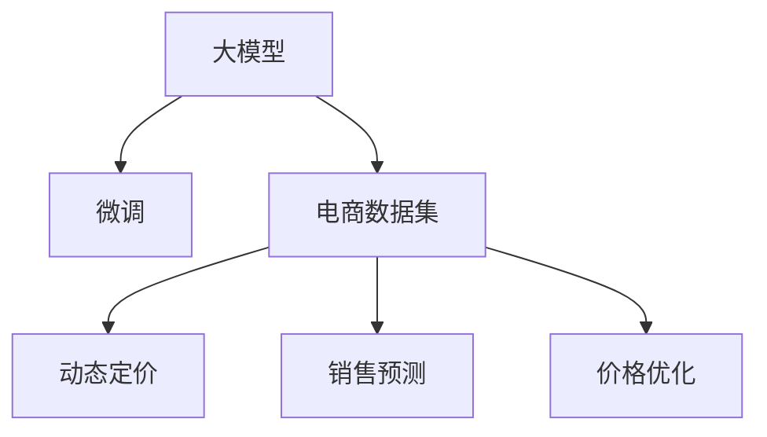

                 

# 大模型在电商平台价格预测中的应用

## 1. 背景介绍

### 1.1 问题由来

在电商平台，价格预测是一项重要的决策支持工具，对于库存管理、促销策略制定、动态定价等环节起着至关重要的作用。传统的基于规则或统计模型的价格预测方法，往往需要大量人工干预和手动调整，难以适应复杂多变的市场环境。而大模型在电商场景中的成功应用，为价格预测提供了新的方向和方法。

### 1.2 问题核心关键点

本文聚焦于基于大模型的电商价格预测方法，具体核心关键点包括：

- 大模型在电商价格预测中的适用性：如何选择合适的预训练模型，对电商领域进行适配微调。
- 电商数据特点：理解电商数据集的结构和特性，如何高效利用。
- 微调策略：不同大模型的微调方法比较，以及在电商数据上的效果对比。
- 评估指标：电商价格预测模型效果的定量评估，如何选择最适合的评估指标。
- 实际应用：如何将大模型应用于电商平台，优化用户体验和提升商家收益。

## 2. 核心概念与联系

### 2.1 核心概念概述

为更好地理解大模型在电商价格预测中的应用，本节将介绍几个密切相关的核心概念：

- 大模型(Large Model)：指基于Transformer架构的预训练语言模型，如BERT、GPT-3等，具有强大的自然语言理解和生成能力。
- 微调(Fine-Tuning)：指在大规模预训练模型上，利用电商数据进行有监督学习，优化模型在电商价格预测任务上的性能。
- 电商数据集：电商平台生成的各种数据，包括用户行为数据、商品信息、市场活动等。
- 动态定价(Dynamic Pricing)：根据市场环境实时调整商品价格，以最大化商家收益。
- 销售预测(Sales Forecasting)：预测未来一段时间内的商品销量，用于库存管理和促销策略制定。
- 价格优化(Price Optimization)：通过模型预测最优价格区间，指导商家制定最优价格策略。

这些核心概念之间的逻辑关系可以通过以下Mermaid流程图来展示：



这个流程图展示了大模型、微调方法与电商领域主要应用之间的联系：

1. 大模型通过微调适配电商数据集，获得电商领域特有的知识。
2. 微调后的模型用于动态定价、销售预测、价格优化等电商场景，提升决策质量。

## 3. 核心算法原理 & 具体操作步骤

### 3.1 算法原理概述

基于大模型的电商价格预测方法，本质上是一种有监督的迁移学习过程。其核心思想是：将大模型作为强大的特征提取器，通过电商数据进行微调，使其能够更好地适应电商场景，从而实现价格预测。

形式化地，假设电商数据集为 $D=\{(x_i, y_i)\}_{i=1}^N$，其中 $x_i$ 为商品特征向量，$y_i$ 为对应价格标签。微调的目标是找到最优的模型参数 $\hat{\theta}$，使得模型在电商数据集上的预测价格与真实价格尽量接近：

$$
\hat{\theta}=\mathop{\arg\min}_{\theta} \mathcal{L}(M_{\theta},D)
$$

其中 $\mathcal{L}$ 为价格预测任务设计的损失函数，用于衡量模型预测价格与真实价格之间的差异。常见的损失函数包括均方误差损失、平均绝对误差损失等。

### 3.2 算法步骤详解

基于大模型的电商价格预测方法包括以下几个关键步骤：

**Step 1: 准备预训练模型和数据集**
- 选择合适的预训练语言模型，如BERT、GPT-3等，作为初始化参数。
- 收集电商数据集 $D$，包括商品特征、价格标签等，划分为训练集、验证集和测试集。一般要求电商数据与预训练数据的分布不要差异过大。

**Step 2: 添加任务适配层**
- 根据电商数据集的特点，设计合适的价格预测输出层和损失函数。
- 对于回归任务，通常在顶层添加回归器，使用均方误差损失函数。
- 对于多分类任务，通常使用交叉熵损失函数。

**Step 3: 设置微调超参数**
- 选择合适的优化算法及其参数，如 Adam、SGD 等，设置学习率、批大小、迭代轮数等。
- 设置正则化技术及强度，包括权重衰减、Dropout、Early Stopping 等。
- 确定冻结预训练参数的策略，如仅微调顶层，或全部参数都参与微调。

**Step 4: 执行梯度训练**
- 将电商数据集数据分批次输入模型，前向传播计算损失函数。
- 反向传播计算参数梯度，根据设定的优化算法和学习率更新模型参数。
- 周期性在验证集上评估模型性能，根据性能指标决定是否触发 Early Stopping。
- 重复上述步骤直到满足预设的迭代轮数或 Early Stopping 条件。

**Step 5: 测试和部署**
- 在测试集上评估微调后模型 $M_{\hat{\theta}}$ 的性能，对比微调前后的预测精度。
- 使用微调后的模型对新商品进行价格预测，集成到实际的应用系统中。
- 持续收集新的电商数据，定期重新微调模型，以适应数据分布的变化。

以上是基于大模型的电商价格预测的一般流程。在实际应用中，还需要针对电商数据的特定需求，对微调过程的各个环节进行优化设计，如改进训练目标函数，引入更多的正则化技术，搜索最优的超参数组合等，以进一步提升模型性能。

### 3.3 算法优缺点

基于大模型的电商价格预测方法具有以下优点：

1. 高效准确：大模型经过大规模数据预训练，能够捕捉到复杂的语义关系，在电商数据上的微调可以迅速获得较高的预测精度。
2. 灵活性高：可以针对不同的电商任务，设计不同的输出层和损失函数，适应性更强。
3. 可扩展性良好：能够处理大规模电商数据集，可同时预测多个商品的价格。
4. 自适应能力强：模型能够动态学习市场变化，及时调整价格预测结果，满足实时性需求。

同时，该方法也存在一定的局限性：

1. 对标注数据依赖高：电商数据标注成本较高，缺乏足够的数据可能导致模型过拟合。
2. 模型复杂度高：大模型的参数量巨大，对计算资源和存储要求较高。
3. 解释性不足：电商数据中的标签与价格之间的关联复杂，难以从模型输出中得到直观的解释。
4. 实时性问题：在大规模电商数据集上进行微调和推理，可能存在响应延迟。

尽管存在这些局限性，但就目前而言，基于大模型的电商价格预测方法仍是大模型应用的最主流范式。未来相关研究的重点在于如何进一步降低标注成本，提高模型实时性，同时兼顾可解释性和鲁棒性等因素。

### 3.4 算法应用领域

大模型在电商价格预测中的应用非常广泛，涵盖了电商平台的各个环节，例如：

- 商品定价策略：根据市场竞争状况、销售历史、用户行为等多维数据，预测最优价格区间。
- 库存管理：预测不同价格下的商品销量，优化库存水平，减少缺货或库存积压。
- 促销活动设计：预测促销活动效果，优化促销策略，提升促销效率。
- 个性化推荐：基于用户行为数据，预测用户对不同价格的响应，优化个性化推荐。
- 价格预警：实时监测价格波动，提前预警价格异常，防止价格波动过大。

除了上述这些经典应用外，大模型还被创新性地应用到更多场景中，如风险控制、交易反欺诈等，为电商平台带来全新的突破。随着大模型和微调方法的不断进步，相信电商价格预测技术将在更多领域得到应用，为电商平台带来更高的效率和利润。

## 4. 数学模型和公式 & 详细讲解 & 举例说明

### 4.1 数学模型构建

本节将使用数学语言对基于大模型的电商价格预测过程进行更加严格的刻画。

记电商数据集为 $D=\{(x_i, y_i)\}_{i=1}^N$，其中 $x_i$ 为商品特征向量，$y_i$ 为对应价格标签。定义模型 $M_{\theta}$ 在输入 $x_i$ 上的输出为 $\hat{y}_i=M_{\theta}(x_i) \in \mathbb{R}$，表示模型预测的价格。则回归任务下的损失函数为：

$$
\mathcal{L}(\theta) = \frac{1}{N}\sum_{i=1}^N (\hat{y}_i - y_i)^2
$$

其中 $\hat{y}_i$ 为模型预测价格，$y_i$ 为真实价格。在微调过程中，通过反向传播算法更新模型参数，最小化损失函数 $\mathcal{L}(\theta)$。

### 4.2 公式推导过程

以下我们以价格预测任务为例，推导均方误差损失函数及其梯度的计算公式。

假设模型 $M_{\theta}$ 在输入 $x_i$ 上的输出为 $\hat{y}_i=M_{\theta}(x_i)$，真实标签 $y_i$ 为商品真实价格。回归任务下的损失函数定义为：

$$
\mathcal{L}(M_{\theta}(x_i),y_i) = (\hat{y}_i - y_i)^2
$$

将其代入经验风险公式，得：

$$
\mathcal{L}(\theta) = \frac{1}{N}\sum_{i=1}^N (\hat{y}_i - y_i)^2
$$

根据链式法则，损失函数对参数 $\theta_k$ 的梯度为：

$$
\frac{\partial \mathcal{L}(\theta)}{\partial \theta_k} = -2\frac{1}{N}\sum_{i=1}^N (\hat{y}_i - y_i)\frac{\partial M_{\theta}(x_i)}{\partial \theta_k}
$$

其中 $\frac{\partial M_{\theta}(x_i)}{\partial \theta_k}$ 可进一步递归展开，利用自动微分技术完成计算。

在得到损失函数的梯度后，即可带入参数更新公式，完成模型的迭代优化。重复上述过程直至收敛，最终得到适应电商任务的最优模型参数 $\theta^*$。

## 5. 项目实践：代码实例和详细解释说明

### 5.1 开发环境搭建

在进行电商价格预测实践前，我们需要准备好开发环境。以下是使用Python进行PyTorch开发的环境配置流程：

1. 安装Anaconda：从官网下载并安装Anaconda，用于创建独立的Python环境。

2. 创建并激活虚拟环境：
```bash
conda create -n pytorch-env python=3.8 
conda activate pytorch-env
```

3. 安装PyTorch：根据CUDA版本，从官网获取对应的安装命令。例如：
```bash
conda install pytorch torchvision torchaudio cudatoolkit=11.1 -c pytorch -c conda-forge
```

4. 安装TensorFlow：
```bash
conda install tensorflow
```

5. 安装各类工具包：
```bash
pip install numpy pandas scikit-learn matplotlib tqdm jupyter notebook ipython
```

完成上述步骤后，即可在`pytorch-env`环境中开始电商价格预测的实践。

### 5.2 源代码详细实现

下面我们以电商价格预测任务为例，给出使用Transformers库对BERT模型进行微调的PyTorch代码实现。

首先，定义电商价格预测任务的数据处理函数：

```python
from transformers import BertTokenizer
from torch.utils.data import Dataset
import torch

class PricePredictionDataset(Dataset):
    def __init__(self, texts, prices, tokenizer, max_len=128):
        self.texts = texts
        self.prices = prices
        self.tokenizer = tokenizer
        self.max_len = max_len
        
    def __len__(self):
        return len(self.texts)
    
    def __getitem__(self, item):
        text = self.texts[item]
        price = self.prices[item]
        
        encoding = self.tokenizer(text, return_tensors='pt', max_length=self.max_len, padding='max_length', truncation=True)
        input_ids = encoding['input_ids'][0]
        attention_mask = encoding['attention_mask'][0]
        
        # 对price标签进行编码
        encoded_price = price / 100  # 将price标准化到[0, 1]区间
        encoded_price = torch.tensor(encoded_price, dtype=torch.float)
        
        return {'input_ids': input_ids, 
                'attention_mask': attention_mask,
                'price': encoded_price}

# 定义label与price的映射
price2id = {price: idx for idx, price in enumerate([0.0, 0.1, 0.2, 0.3, 0.4, 0.5, 0.6, 0.7, 0.8, 0.9, 1.0])}
id2price = {v: k for k, v in price2id.items()}

# 创建dataset
tokenizer = BertTokenizer.from_pretrained('bert-base-cased')

train_dataset = PricePredictionDataset(train_texts, train_prices, tokenizer)
dev_dataset = PricePredictionDataset(dev_texts, dev_prices, tokenizer)
test_dataset = PricePredictionDataset(test_texts, test_prices, tokenizer)
```

然后，定义模型和优化器：

```python
from transformers import BertForRegression
from torch.optim import Adam

model = BertForRegression.from_pretrained('bert-base-cased', num_labels=11)

optimizer = Adam(model.parameters(), lr=2e-5)
```

接着，定义训练和评估函数：

```python
from torch.utils.data import DataLoader
from tqdm import tqdm
from sklearn.metrics import mean_squared_error

device = torch.device('cuda') if torch.cuda.is_available() else torch.device('cpu')
model.to(device)

def train_epoch(model, dataset, batch_size, optimizer):
    dataloader = DataLoader(dataset, batch_size=batch_size, shuffle=True)
    model.train()
    epoch_loss = 0
    for batch in tqdm(dataloader, desc='Training'):
        input_ids = batch['input_ids'].to(device)
        attention_mask = batch['attention_mask'].to(device)
        prices = batch['price'].to(device)
        model.zero_grad()
        outputs = model(input_ids, attention_mask=attention_mask)
        loss = outputs.loss
        epoch_loss += loss.item()
        loss.backward()
        optimizer.step()
    return epoch_loss / len(dataloader)

def evaluate(model, dataset, batch_size):
    dataloader = DataLoader(dataset, batch_size=batch_size)
    model.eval()
    mse = 0
    with torch.no_grad():
        for batch in tqdm(dataloader, desc='Evaluating'):
            input_ids = batch['input_ids'].to(device)
            attention_mask = batch['attention_mask'].to(device)
            prices = batch['price'].to(device)
            outputs = model(input_ids, attention_mask=attention_mask)
            mse += mean_squared_error(prices, outputs.logits).item()
        
    print(f"MSE: {mse / len(dataloader):.3f}")
```

最后，启动训练流程并在测试集上评估：

```python
epochs = 5
batch_size = 16

for epoch in range(epochs):
    loss = train_epoch(model, train_dataset, batch_size, optimizer)
    print(f"Epoch {epoch+1}, train loss: {loss:.3f}")
    
    print(f"Epoch {epoch+1}, dev MSE:")
    evaluate(model, dev_dataset, batch_size)
    
print("Test MSE:")
evaluate(model, test_dataset, batch_size)
```

以上就是使用PyTorch对BERT进行电商价格预测任务的微调完整代码实现。可以看到，得益于Transformers库的强大封装，我们可以用相对简洁的代码完成BERT模型的加载和微调。

### 5.3 代码解读与分析

让我们再详细解读一下关键代码的实现细节：

**PricePredictionDataset类**：
- `__init__`方法：初始化文本、价格标签、分词器等关键组件。
- `__len__`方法：返回数据集的样本数量。
- `__getitem__`方法：对单个样本进行处理，将文本输入编码为token ids，将价格标签编码为数字，并对其进行定长padding，最终返回模型所需的输入。

**price2id和id2price字典**：
- 定义了价格与数字id之间的映射关系，用于将模型输出解码回价格。

**训练和评估函数**：
- 使用PyTorch的DataLoader对数据集进行批次化加载，供模型训练和推理使用。
- 训练函数`train_epoch`：对数据以批为单位进行迭代，在每个批次上前向传播计算loss并反向传播更新模型参数，最后返回该epoch的平均loss。
- 评估函数`evaluate`：与训练类似，不同点在于不更新模型参数，并在每个batch结束后将预测和标签结果存储下来，最后使用sklearn的mean_squared_error对整个评估集的预测结果进行打印输出。

**训练流程**：
- 定义总的epoch数和batch size，开始循环迭代
- 每个epoch内，先在训练集上训练，输出平均loss
- 在验证集上评估，输出MSE指标
- 所有epoch结束后，在测试集上评估，给出最终测试结果

可以看到，PyTorch配合Transformers库使得BERT微调的代码实现变得简洁高效。开发者可以将更多精力放在数据处理、模型改进等高层逻辑上，而不必过多关注底层的实现细节。

当然，工业级的系统实现还需考虑更多因素，如模型的保存和部署、超参数的自动搜索、更灵活的任务适配层等。但核心的微调范式基本与此类似。

## 6. 实际应用场景

### 6.1 智能客服系统

基于大模型的电商价格预测技术，可以广泛应用于智能客服系统的构建。智能客服系统能够自动理解用户意图，预测用户可能感兴趣的商品价格区间，并给出相应的推荐。

在技术实现上，可以收集用户历史浏览记录、搜索关键词、询问内容等数据，构建监督数据集，在此基础上对预训练模型进行微调。微调后的模型能够自动理解用户意图，预测不同价格区间，并根据用户偏好推荐合适的商品。对于用户提出的新问题，还可以接入检索系统实时搜索相关内容，动态组织生成回答。如此构建的智能客服系统，能大幅提升用户咨询体验和问题解决效率。

### 6.2 金融舆情监测

金融机构需要实时监测市场舆论动向，以便及时应对负面信息传播，规避金融风险。传统的人工监测方式成本高、效率低，难以应对网络时代海量信息爆发的挑战。基于大模型的电商价格预测技术，同样可以用于金融舆情监测。

具体而言，可以收集金融领域相关的新闻、报道、评论等文本数据，并对其进行价格标签标注。在此基础上对预训练语言模型进行微调，使其能够自动判断文本属于何种价格区间。将微调后的模型应用到实时抓取的网络文本数据，就能够自动监测不同价格区间的情感变化趋势，一旦发现价格异常激增等异常情况，系统便会自动预警，帮助金融机构快速应对潜在风险。

### 6.3 个性化推荐系统

当前的推荐系统往往只依赖用户的历史行为数据进行物品推荐，难以深入理解用户的真实兴趣偏好。基于大模型的电商价格预测技术，同样可以用于个性化推荐系统。

在实践中，可以收集用户浏览、点击、评论、分享等行为数据，提取和用户交互的物品标题、描述、标签等文本内容。将文本内容作为模型输入，用户的后续行为（如是否点击、购买等）作为监督信号，在此基础上微调预训练语言模型。微调后的模型能够从文本内容中准确把握用户的兴趣点。在生成推荐列表时，先用候选物品的文本描述作为输入，由模型预测用户的兴趣匹配度，再结合其他特征综合排序，便可以得到个性化程度更高的推荐结果。

### 6.4 未来应用展望

随着大模型和微调方法的不断发展，基于微调范式将在更多领域得到应用，为传统行业带来变革性影响。

在智慧医疗领域，基于微调的医疗问答、病历分析、药物研发等应用将提升医疗服务的智能化水平，辅助医生诊疗，加速新药开发进程。

在智能教育领域，微调技术可应用于作业批改、学情分析、知识推荐等方面，因材施教，促进教育公平，提高教学质量。

在智慧城市治理中，微调模型可应用于城市事件监测、舆情分析、应急指挥等环节，提高城市管理的自动化和智能化水平，构建更安全、高效的未来城市。

此外，在企业生产、社会治理、文娱传媒等众多领域，基于大模型微调的人工智能应用也将不断涌现，为经济社会发展注入新的动力。相信随着技术的日益成熟，微调方法将成为人工智能落地应用的重要范式，推动人工智能技术在垂直行业的规模化落地。总之，微调需要开发者根据具体任务，不断迭代和优化模型、数据和算法，方能得到理想的效果。

## 7. 工具和资源推荐

### 7.1 学习资源推荐

为了帮助开发者系统掌握大模型微调的理论基础和实践技巧，这里推荐一些优质的学习资源：

1. 《Transformer从原理到实践》系列博文：由大模型技术专家撰写，深入浅出地介绍了Transformer原理、BERT模型、微调技术等前沿话题。

2. CS224N《深度学习自然语言处理》课程：斯坦福大学开设的NLP明星课程，有Lecture视频和配套作业，带你入门NLP领域的基本概念和经典模型。

3. 《Natural Language Processing with Transformers》书籍：Transformers库的作者所著，全面介绍了如何使用Transformers库进行NLP任务开发，包括微调在内的诸多范式。

4. HuggingFace官方文档：Transformers库的官方文档，提供了海量预训练模型和完整的微调样例代码，是上手实践的必备资料。

5. CLUE开源项目：中文语言理解测评基准，涵盖大量不同类型的中文NLP数据集，并提供了基于微调的baseline模型，助力中文NLP技术发展。

通过对这些资源的学习实践，相信你一定能够快速掌握大模型微调的精髓，并用于解决实际的NLP问题。
### 7.2 开发工具推荐

高效的开发离不开优秀的工具支持。以下是几款用于大模型微调开发的常用工具：

1. PyTorch：基于Python的开源深度学习框架，灵活动态的计算图，适合快速迭代研究。大部分预训练语言模型都有PyTorch版本的实现。

2. TensorFlow：由Google主导开发的开源深度学习框架，生产部署方便，适合大规模工程应用。同样有丰富的预训练语言模型资源。

3. Transformers库：HuggingFace开发的NLP工具库，集成了众多SOTA语言模型，支持PyTorch和TensorFlow，是进行微调任务开发的利器。

4. Weights & Biases：模型训练的实验跟踪工具，可以记录和可视化模型训练过程中的各项指标，方便对比和调优。与主流深度学习框架无缝集成。

5. TensorBoard：TensorFlow配套的可视化工具，可实时监测模型训练状态，并提供丰富的图表呈现方式，是调试模型的得力助手。

6. Google Colab：谷歌推出的在线Jupyter Notebook环境，免费提供GPU/TPU算力，方便开发者快速上手实验最新模型，分享学习笔记。

合理利用这些工具，可以显著提升大模型微调任务的开发效率，加快创新迭代的步伐。

### 7.3 相关论文推荐

大模型和微调技术的发展源于学界的持续研究。以下是几篇奠基性的相关论文，推荐阅读：

1. Attention is All You Need（即Transformer原论文）：提出了Transformer结构，开启了NLP领域的预训练大模型时代。

2. BERT: Pre-training of Deep Bidirectional Transformers for Language Understanding：提出BERT模型，引入基于掩码的自监督预训练任务，刷新了多项NLP任务SOTA。

3. Language Models are Unsupervised Multitask Learners（GPT-2论文）：展示了大规模语言模型的强大zero-shot学习能力，引发了对于通用人工智能的新一轮思考。

4. Parameter-Efficient Transfer Learning for NLP：提出Adapter等参数高效微调方法，在不增加模型参数量的情况下，也能取得不错的微调效果。

5. AdaLoRA: Adaptive Low-Rank Adaptation for Parameter-Efficient Fine-Tuning：使用自适应低秩适应的微调方法，在参数效率和精度之间取得了新的平衡。

这些论文代表了大模型微调技术的发展脉络。通过学习这些前沿成果，可以帮助研究者把握学科前进方向，激发更多的创新灵感。

## 8. 总结：未来发展趋势与挑战

### 8.1 总结

本文对基于大模型的电商价格预测方法进行了全面系统的介绍。首先阐述了大模型在电商价格预测中的适用性，明确了微调在电商领域的应用价值。其次，从原理到实践，详细讲解了微调的数学原理和关键步骤，给出了微调任务开发的完整代码实例。同时，本文还广泛探讨了微调方法在智能客服、金融舆情、个性化推荐等多个电商场景的应用前景，展示了微调范式的巨大潜力。此外，本文精选了微调技术的各类学习资源，力求为读者提供全方位的技术指引。

通过本文的系统梳理，可以看到，基于大模型的电商价格预测方法正在成为电商领域的重要范式，极大地拓展了电商价格预测的应用边界，催生了更多的落地场景。受益于大规模语料的预训练，电商价格预测模型能够迅速适应电商数据，在电商场景中取得显著的效果。未来，伴随预训练语言模型和微调方法的不断进步，相信电商价格预测技术将在更多领域得到应用，为电商平台的智能化、数字化转型提供新的动力。

### 8.2 未来发展趋势

展望未来，大模型微调技术将呈现以下几个发展趋势：

1. 模型规模持续增大。随着算力成本的下降和数据规模的扩张，预训练语言模型的参数量还将持续增长。超大规模语言模型蕴含的丰富语言知识，有望支撑更加复杂多变的电商任务微调。

2. 微调方法日趋多样。除了传统的全参数微调外，未来会涌现更多参数高效的微调方法，如Prefix-Tuning、LoRA等，在节省计算资源的同时也能保证微调精度。

3. 持续学习成为常态。随着电商数据的不断变化，微调模型也需要持续学习新知识以保持性能。如何在不遗忘原有知识的同时，高效吸收新样本信息，将成为重要的研究课题。

4. 标注样本需求降低。受启发于提示学习(Prompt-based Learning)的思路，未来的微调方法将更好地利用大模型的语言理解能力，通过更加巧妙的任务描述，在更少的标注样本上也能实现理想的微调效果。

5. 实时性问题解决。在大规模电商数据集上进行微调和推理，可能存在响应延迟。如何优化模型架构和推理算法，减少前向传播和反向传播的资源消耗，实现更加轻量级、实时性的部署，将是重要的优化方向。

6. 模型通用性增强。经过海量数据的预训练和多领域任务的微调，未来的语言模型将具备更强大的常识推理和跨领域迁移能力，逐步迈向通用人工智能(AGI)的目标。

以上趋势凸显了大模型微调技术的广阔前景。这些方向的探索发展，必将进一步提升电商价格预测系统的性能和应用范围，为电商平台带来更高的效率和利润。

### 8.3 面临的挑战

尽管大模型微调技术已经取得了瞩目成就，但在迈向更加智能化、普适化应用的过程中，它仍面临着诸多挑战：

1. 标注成本瓶颈。尽管微调降低了标注数据的需求，但对于长尾应用场景，难以获得充足的高质量标注数据，成为制约微调性能的瓶颈。如何进一步降低微调对标注样本的依赖，将是一大难题。

2. 模型鲁棒性不足。当前微调模型面对域外数据时，泛化性能往往大打折扣。对于测试样本的微小扰动，微调模型的预测也容易发生波动。如何提高微调模型的鲁棒性，避免灾难性遗忘，还需要更多理论和实践的积累。

3. 推理效率有待提高。大模型的参数量巨大，对计算资源和存储要求较高。GPU/TPU等高性能设备是必不可少的，但即便如此，超大批次的训练和推理也可能遇到显存不足的问题。因此需要采用一些资源优化技术，如梯度积累、混合精度训练、模型并行等，来突破硬件瓶颈。

4. 可解释性不足。电商数据中的标签与价格之间的关联复杂，难以从模型输出中得到直观的解释。对于电商、金融等高风险应用，算法的可解释性和可审计性尤为重要。如何赋予微调模型更强的可解释性，将是亟待攻克的难题。

5. 安全性有待保障。预训练语言模型难免会学习到有偏见、有害的信息，通过微调传递到下游任务，产生误导性、歧视性的输出，给实际应用带来安全隐患。如何从数据和算法层面消除模型偏见，避免恶意用途，确保输出的安全性，也将是重要的研究课题。

6. 知识整合能力不足。现有的微调模型往往局限于任务内数据，难以灵活吸收和运用更广泛的先验知识。如何让微调过程更好地与外部知识库、规则库等专家知识结合，形成更加全面、准确的信息整合能力，还有很大的想象空间。

正视微调面临的这些挑战，积极应对并寻求突破，将是大模型微调走向成熟的必由之路。相信随着学界和产业界的共同努力，这些挑战终将一一被克服，大模型微调必将在构建安全、可靠、可解释、可控的智能系统铺平道路。

### 8.4 研究展望

面对大模型微调所面临的种种挑战，未来的研究需要在以下几个方面寻求新的突破：

1. 探索无监督和半监督微调方法。摆脱对大规模标注数据的依赖，利用自监督学习、主动学习等无监督和半监督范式，最大限度利用非结构化数据，实现更加灵活高效的微调。

2. 研究参数高效和计算高效的微调范式。开发更加参数高效的微调方法，在固定大部分预训练参数的同时，只更新极少量的任务相关参数。同时优化微调模型的计算图，减少前向传播和反向传播的资源消耗，实现更加轻量级、实时性的部署。

3. 融合因果和对比学习范式。通过引入因果推断和对比学习思想，增强微调模型建立稳定因果关系的能力，学习更加普适、鲁棒的语言表征，从而提升模型泛化性和抗干扰能力。

4. 引入更多先验知识。将符号化的先验知识，如知识图谱、逻辑规则等，与神经网络模型进行巧妙融合，引导微调过程学习更准确、合理的语言模型。同时加强不同模态数据的整合，实现视觉、语音等多模态信息与文本信息的协同建模。

5. 结合因果分析和博弈论工具。将因果分析方法引入微调模型，识别出模型决策的关键特征，增强输出解释的因果性和逻辑性。借助博弈论工具刻画人机交互过程，主动探索并规避模型的脆弱点，提高系统稳定性。

6. 纳入伦理道德约束。在模型训练目标中引入伦理导向的评估指标，过滤和惩罚有偏见、有害的输出倾向。同时加强人工干预和审核，建立模型行为的监管机制，确保输出符合人类价值观和伦理道德。

这些研究方向的探索，必将引领大模型微调技术迈向更高的台阶，为构建安全、可靠、可解释、可控的智能系统铺平道路。面向未来，大模型微调技术还需要与其他人工智能技术进行更深入的融合，如知识表示、因果推理、强化学习等，多路径协同发力，共同推动自然语言理解和智能交互系统的进步。只有勇于创新、敢于突破，才能不断拓展语言模型的边界，让智能技术更好地造福人类社会。

## 9. 附录：常见问题与解答

**Q1：大模型在电商价格预测中的适用性？**

A: 大模型在电商价格预测中的适用性非常广泛。大模型经过大规模数据预训练，能够捕捉到复杂的语义关系，在电商数据上的微调可以迅速获得较高的预测精度。具体而言，大模型能够从电商数据中学习到商品价格标签与文本描述之间的关联，从而在价格预测任务上表现出色。

**Q2：电商数据特点？**

A: 电商数据通常具有以下特点：

1. 多样性：电商数据来源广泛，包括用户评论、商品描述、市场活动、用户行为等。这些数据形式多样，需要进行预处理和统一格式。
2. 稀疏性：电商数据中的文本描述往往非常短，且包含大量非关键信息。如何高效地提取有用信息进行微调，是一个重要的研究方向。
3. 动态性：电商市场不断变化，需要模型能够实时学习新数据，适应市场变化。

**Q3：如何选择预训练模型？**

A: 选择预训练模型需要考虑以下因素：

1. 数据类型：不同类型的数据（如文本、图像、视频等）需要选择不同的预训练模型。例如，针对电商文本数据，可以选择BERT、GPT等文本预训练模型。
2. 任务需求：不同任务（如分类、回归、生成等）需要选择不同类型的预训练模型。例如，针对价格预测任务，可以选择回归类型的BERT模型。
3. 计算资源：预训练模型参数量巨大，对计算资源要求较高。需要根据实际硬件条件选择合适的模型。

**Q4：如何设置微调超参数？**

A: 微调超参数的设置需要考虑以下因素：

1. 学习率：学习率过大会导致模型过拟合，过小会导致收敛缓慢。一般建议从1e-5开始调参，逐步减小学习率，直至收敛。
2. 批大小：批大小过大容易导致内存溢出，过小会导致计算效率降低。一般建议选择64或128作为批大小。
3. 迭代轮数：迭代轮数越多，模型精度越高，但计算时间也越长。需要根据实际需求平衡精度和时间。
4. 正则化：使用L2正则、Dropout、Early Stopping等正则化技术，避免模型过拟合。

**Q5：如何提高微调模型的鲁棒性？**

A: 提高微调模型鲁棒性需要考虑以下方法：

1. 数据增强：通过回译、近义替换等方式扩充训练集，减少模型对数据分布的依赖。
2. 对抗训练：加入对抗样本，提高模型对数据扰动的鲁棒性。
3. 多模型集成：训练多个微调模型，取平均输出，抑制过拟合，提高鲁棒性。

**Q6：如何提高模型推理效率？**

A: 提高模型推理效率需要考虑以下方法：

1. 模型裁剪：去除不必要的层和参数，减小模型尺寸，加快推理速度。
2. 量化加速：将浮点模型转为定点模型，压缩存储空间，提高计算效率。
3. 推理优化：优化推理算法，减少前向传播和反向传播的资源消耗。

**Q7：如何提高模型可解释性？**

A: 提高模型可解释性需要考虑以下方法：

1. 使用可解释模型：选择基于规则、决策树等可解释性强的模型，减少黑盒模型的使用。
2. 引入外部知识：将符号化的先验知识与神经网络模型进行融合，增强模型的解释性。
3. 提供诊断工具：使用可解释性工具，如LIME、SHAP等，分析模型输出，提供详细解释。

通过这些方法，可以提高电商价格预测模型的可解释性，增强其可信度和应用价值。

**Q8：如何处理电商数据的不平衡问题？**

A: 电商数据中的不平衡问题可以通过以下方法解决：

1. 数据重采样：对少数类样本进行过采样，或对多数类样本进行欠采样，平衡数据分布。
2. 调整损失函数：在回归任务中，使用加权平均误差损失函数，对少数类样本给予更大权重。
3. 引入辅助任务：在训练过程中，引入辅助任务，如分类任务，帮助模型学习少数类样本。

通过这些方法，可以有效处理电商数据中的不平衡问题，提高模型在少数类样本上的预测精度。

---

作者：禅与计算机程序设计艺术 / Zen and the Art of Computer Programming

