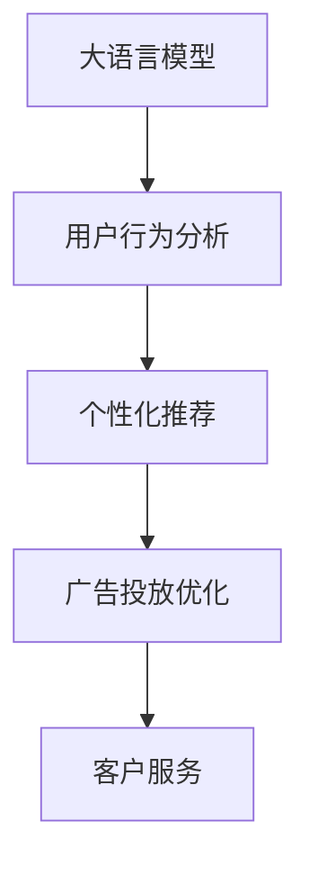

                 

# 大模型如何提升电商平台的用户参与度

> 关键词：大语言模型,电商平台,用户参与度,行为分析,个性化推荐,广告投放,客户服务

## 1. 背景介绍

### 1.1 问题由来

随着电子商务市场的蓬勃发展，电商平台正面临如何提升用户参与度，提高用户留存率和消费转化率的挑战。用户参与度不仅影响电商平台的商业价值，更关乎平台的生存与发展。传统的CRM系统和个性化推荐算法虽已取得一定成效，但在面对海量用户行为数据和复杂多变的用户需求时，依然存在局限。

近年来，大语言模型在自然语言处理(NLP)和推荐系统等领域取得了突破性进展。其强大的数据建模能力和语言理解能力，为电商平台提升用户参与度带来了新的可能。如何有效地利用大模型进行用户行为分析和个性化推荐，优化广告投放和客户服务，成为电商平台急需解决的问题。

### 1.2 问题核心关键点

大语言模型在电商平台用户参与度提升中的关键作用主要体现在以下几个方面：

- **用户行为分析**：通过分析用户历史行为数据，识别用户兴趣和需求，提升用户参与度。
- **个性化推荐**：结合用户行为和模型预测，为用户推荐感兴趣的商品，提高用户满意度和购买率。
- **广告投放优化**：基于用户特征和行为，精准投放广告，提高广告转化率和ROI。
- **客户服务提升**：利用大模型进行自然语言处理，实现智能客服和自动回复，提升用户体验。

通过这些关键应用，大模型可以帮助电商平台实现用户留存和消费转化的双重目标，构建更稳定、高效的商业模式。

## 2. 核心概念与联系

### 2.1 核心概念概述

为更好地理解大语言模型在电商平台用户参与度提升中的作用，本节将介绍几个关键概念：

- **大语言模型**：指基于Transformer结构训练的预训练语言模型，如BERT、GPT-3等，具有强大的语言理解和生成能力。
- **用户行为分析**：通过分析用户的历史行为数据，识别其兴趣和需求，为用户提供个性化的推荐和互动。
- **个性化推荐**：结合用户行为和模型预测，为用户推荐最感兴趣的商品，提高购买率和满意度。
- **广告投放优化**：基于用户特征和行为，精确投放广告，提升广告转化率和ROI。
- **客户服务**：利用大模型进行自然语言处理，实现智能客服和自动回复，提升用户体验。

这些核心概念之间的逻辑关系可以通过以下Mermaid流程图来展示：



这个流程图展示了大语言模型在电商平台用户参与度提升中的关键应用路径：

1. 大语言模型对用户历史行为数据进行分析，识别用户兴趣和需求。
2. 基于分析结果，生成个性化推荐方案。
3. 利用推荐结果优化广告投放策略。
4. 利用自然语言处理技术提升客户服务质量。

这些概念共同构成了电商平台用户参与度提升的框架，使得大语言模型能够高效地处理和应用用户数据，提升用户体验和平台价值。

## 3. 核心算法原理 & 具体操作步骤

### 3.1 算法原理概述

大语言模型在电商平台用户参与度提升中的核心算法原理主要基于以下几个方面：

- **用户行为分析**：利用大模型对用户历史行为数据进行建模，识别用户兴趣和需求。
- **个性化推荐**：结合用户特征和模型预测，生成个性化推荐列表。
- **广告投放优化**：基于用户行为和模型预测，精准投放广告，提升广告效果。
- **客户服务**：利用大模型进行自然语言处理，实现智能客服和自动回复。

这些算法原理涉及到大模型在预训练和微调过程中的复杂机制，以及其在实际应用中的具体操作流程。

### 3.2 算法步骤详解

**Step 1: 数据预处理**

在应用大模型进行电商平台用户参与度提升前，首先需要对用户行为数据进行预处理，包括：

- **数据清洗**：去除缺失、噪声、异常数据，保证数据质量。
- **特征提取**：提取有用的特征，如用户的浏览历史、购买记录、评分数据等。
- **数据标注**：对部分数据进行标注，如用户的兴趣标签、商品类别等。

**Step 2: 模型训练**

选择合适的预训练语言模型，如BERT、GPT-3等，对其进行微调。微调过程包括：

- **任务适配层设计**：根据用户行为分析、个性化推荐、广告投放等任务需求，设计任务适配层。
- **损失函数选择**：选择适合任务需求的损失函数，如交叉熵、均方误差等。
- **超参数调优**：设置合适的学习率、批大小、迭代轮数等超参数。

**Step 3: 模型应用**

训练好的大模型可以应用于电商平台的各个环节，包括：

- **用户行为分析**：利用大模型对用户行为数据进行建模，识别用户兴趣和需求。
- **个性化推荐**：结合用户特征和模型预测，生成个性化推荐列表。
- **广告投放优化**：基于用户行为和模型预测，精准投放广告，提升广告效果。
- **客户服务**：利用大模型进行自然语言处理，实现智能客服和自动回复。

**Step 4: 模型评估与优化**

模型应用过程中，需要不断评估模型的性能，并根据实际效果进行优化。优化方法包括：

- **A/B测试**：通过A/B测试对比不同策略的效果，选择最优方案。
- **反馈机制**：根据用户反馈和行为数据，不断调整模型参数，优化推荐和客服效果。
- **模型更新**：定期重新训练模型，适应新的用户数据和行为模式。

### 3.3 算法优缺点

大语言模型在电商平台用户参与度提升中的应用具有以下优点：

- **强大的建模能力**：大模型能够处理大规模数据，提取高维度的特征，提升模型预测精度。
- **自适应性强**：大模型通过不断学习和适应，能够自动优化推荐和客服策略。
- **灵活性高**：大模型适用于多种电商任务，易于集成到现有系统。

同时，大模型在应用中也存在一些局限性：

- **计算资源需求高**：大模型的训练和应用需要大量计算资源，成本较高。
- **模型复杂度高**：大模型结构复杂，调试和维护难度大。
- **可解释性不足**：大模型通常被视为"黑盒"，难以解释其决策过程。

尽管存在这些局限性，但大语言模型在电商平台用户参与度提升中的潜力不可忽视。未来研究将致力于解决这些问题，推动大模型在电商领域的应用深入和普及。

### 3.4 算法应用领域

大语言模型在电商平台用户参与度提升中的应用领域主要包括：

- **用户行为分析**：如用户兴趣识别、需求预测等。
- **个性化推荐**：如商品推荐、内容推荐等。
- **广告投放优化**：如精准投放、用户画像生成等。
- **客户服务**：如智能客服、自动回复等。

这些应用领域覆盖了电商平台的各个环节，通过大语言模型提升用户参与度，构建更高效、稳定的商业模式。

## 4. 数学模型和公式 & 详细讲解  
### 4.1 数学模型构建

假设电商平台用户行为数据为 $D=\{(x_i,y_i)\}_{i=1}^N$，其中 $x_i$ 为输入（如用户浏览历史、购买记录等），$y_i$ 为输出（如用户兴趣标签、商品类别等）。大语言模型 $M_{\theta}$ 的输入输出映射关系为：

$$
M_{\theta}(x_i) = \mathbf{z}_i = \{z_{i,1}, z_{i,2}, \cdots, z_{i,K}\}
$$

其中，$z_{i,k}$ 表示用户行为 $x_i$ 在类别 $k$ 上的概率分布。

模型训练的目标是最小化交叉熵损失：

$$
\mathcal{L}(\theta) = -\frac{1}{N}\sum_{i=1}^N \sum_{k=1}^K y_{i,k} \log M_{\theta}(x_i)_{k} + (1-y_{i,k})\log(1-M_{\theta}(x_i)_{k})
$$

其中，$y_{i,k}$ 为真实标签，$M_{\theta}(x_i)_{k}$ 为模型预测概率。

### 4.2 公式推导过程

以用户行为分析为例，假设模型对用户行为 $x$ 的输出为 $\hat{y}=M_{\theta}(x) \in [0,1]$，表示用户属于某个类别的概率。真实标签 $y \in \{0,1\}$。则二分类交叉熵损失函数定义为：

$$
\ell(M_{\theta}(x),y) = -[y\log \hat{y} + (1-y)\log (1-\hat{y})]
$$

将其代入经验风险公式，得：

$$
\mathcal{L}(\theta) = -\frac{1}{N}\sum_{i=1}^N [y_i\log M_{\theta}(x_i)+(1-y_i)\log(1-M_{\theta}(x_i))]
$$

根据链式法则，损失函数对参数 $\theta_k$ 的梯度为：

$$
\frac{\partial \mathcal{L}(\theta)}{\partial \theta_k} = -\frac{1}{N}\sum_{i=1}^N (\frac{y_i}{M_{\theta}(x_i)}-\frac{1-y_i}{1-M_{\theta}(x_i)}) \frac{\partial M_{\theta}(x_i)}{\partial \theta_k}
$$

其中 $\frac{\partial M_{\theta}(x_i)}{\partial \theta_k}$ 可进一步递归展开，利用自动微分技术完成计算。

在得到损失函数的梯度后，即可带入参数更新公式，完成模型的迭代优化。重复上述过程直至收敛，最终得到适应电商平台用户行为分析的最优模型参数 $\theta^*$。

## 5. 项目实践：代码实例和详细解释说明
### 5.1 开发环境搭建

在进行电商平台用户参与度提升的微调实践前，我们需要准备好开发环境。以下是使用Python进行PyTorch开发的环境配置流程：

1. 安装Anaconda：从官网下载并安装Anaconda，用于创建独立的Python环境。

2. 创建并激活虚拟环境：
```bash
conda create -n pytorch-env python=3.8 
conda activate pytorch-env
```

3. 安装PyTorch：根据CUDA版本，从官网获取对应的安装命令。例如：
```bash
conda install pytorch torchvision torchaudio cudatoolkit=11.1 -c pytorch -c conda-forge
```

4. 安装Transformers库：
```bash
pip install transformers
```

5. 安装各类工具包：
```bash
pip install numpy pandas scikit-learn matplotlib tqdm jupyter notebook ipython
```

完成上述步骤后，即可在`pytorch-env`环境中开始微调实践。

### 5.2 源代码详细实现

下面我们以电商平台个性化推荐任务为例，给出使用Transformers库对BERT模型进行微调的PyTorch代码实现。

首先，定义推荐任务的数据处理函数：

```python
from transformers import BertTokenizer
from torch.utils.data import Dataset
import torch

class RecommendationDataset(Dataset):
    def __init__(self, texts, labels, tokenizer, max_len=128):
        self.texts = texts
        self.labels = labels
        self.tokenizer = tokenizer
        self.max_len = max_len
        
    def __len__(self):
        return len(self.texts)
    
    def __getitem__(self, item):
        text = self.texts[item]
        labels = self.labels[item]
        
        encoding = self.tokenizer(text, return_tensors='pt', max_length=self.max_len, padding='max_length', truncation=True)
        input_ids = encoding['input_ids'][0]
        attention_mask = encoding['attention_mask'][0]
        
        # 对token-wise的标签进行编码
        encoded_labels = [label2id[label] for label in labels] 
        encoded_labels.extend([label2id['0']] * (self.max_len - len(encoded_labels)))
        labels = torch.tensor(encoded_labels, dtype=torch.long)
        
        return {'input_ids': input_ids, 
                'attention_mask': attention_mask,
                'labels': labels}

# 标签与id的映射
label2id = {'1': 1, '2': 2, '3': 3, '0': 0}
id2label = {v: k for k, v in label2id.items()}

# 创建dataset
tokenizer = BertTokenizer.from_pretrained('bert-base-cased')

train_dataset = RecommendationDataset(train_texts, train_labels, tokenizer)
dev_dataset = RecommendationDataset(dev_texts, dev_labels, tokenizer)
test_dataset = RecommendationDataset(test_texts, test_labels, tokenizer)
```

然后，定义模型和优化器：

```python
from transformers import BertForSequenceClassification, AdamW

model = BertForSequenceClassification.from_pretrained('bert-base-cased', num_labels=len(label2id))

optimizer = AdamW(model.parameters(), lr=2e-5)
```

接着，定义训练和评估函数：

```python
from torch.utils.data import DataLoader
from tqdm import tqdm
from sklearn.metrics import classification_report

device = torch.device('cuda') if torch.cuda.is_available() else torch.device('cpu')
model.to(device)

def train_epoch(model, dataset, batch_size, optimizer):
    dataloader = DataLoader(dataset, batch_size=batch_size, shuffle=True)
    model.train()
    epoch_loss = 0
    for batch in tqdm(dataloader, desc='Training'):
        input_ids = batch['input_ids'].to(device)
        attention_mask = batch['attention_mask'].to(device)
        labels = batch['labels'].to(device)
        model.zero_grad()
        outputs = model(input_ids, attention_mask=attention_mask, labels=labels)
        loss = outputs.loss
        epoch_loss += loss.item()
        loss.backward()
        optimizer.step()
    return epoch_loss / len(dataloader)

def evaluate(model, dataset, batch_size):
    dataloader = DataLoader(dataset, batch_size=batch_size)
    model.eval()
    preds, labels = [], []
    with torch.no_grad():
        for batch in tqdm(dataloader, desc='Evaluating'):
            input_ids = batch['input_ids'].to(device)
            attention_mask = batch['attention_mask'].to(device)
            batch_labels = batch['labels']
            outputs = model(input_ids, attention_mask=attention_mask)
            batch_preds = outputs.logits.argmax(dim=2).to('cpu').tolist()
            batch_labels = batch_labels.to('cpu').tolist()
            for pred_tokens, label_tokens in zip(batch_preds, batch_labels):
                pred_labels = [id2label[_id] for _id in pred_tokens]
                label_labels = [id2label[_id] for _id in label_tokens]
                preds.append(pred_labels[:len(label_labels)])
                labels.append(label_labels)
                
    print(classification_report(labels, preds))
```

最后，启动训练流程并在测试集上评估：

```python
epochs = 5
batch_size = 16

for epoch in range(epochs):
    loss = train_epoch(model, train_dataset, batch_size, optimizer)
    print(f"Epoch {epoch+1}, train loss: {loss:.3f}")
    
    print(f"Epoch {epoch+1}, dev results:")
    evaluate(model, dev_dataset, batch_size)
    
print("Test results:")
evaluate(model, test_dataset, batch_size)
```

以上就是使用PyTorch对BERT进行电商平台个性化推荐任务微调的完整代码实现。可以看到，得益于Transformers库的强大封装，我们可以用相对简洁的代码完成BERT模型的加载和微调。

### 5.3 代码解读与分析

让我们再详细解读一下关键代码的实现细节：

**RecommendationDataset类**：
- `__init__`方法：初始化文本、标签、分词器等关键组件。
- `__len__`方法：返回数据集的样本数量。
- `__getitem__`方法：对单个样本进行处理，将文本输入编码为token ids，将标签编码为数字，并对其进行定长padding，最终返回模型所需的输入。

**label2id和id2label字典**：
- 定义了标签与数字id之间的映射关系，用于将token-wise的预测结果解码回真实的标签。

**训练和评估函数**：
- 使用PyTorch的DataLoader对数据集进行批次化加载，供模型训练和推理使用。
- 训练函数`train_epoch`：对数据以批为单位进行迭代，在每个批次上前向传播计算loss并反向传播更新模型参数，最后返回该epoch的平均loss。
- 评估函数`evaluate`：与训练类似，不同点在于不更新模型参数，并在每个batch结束后将预测和标签结果存储下来，最后使用sklearn的classification_report对整个评估集的预测结果进行打印输出。

**训练流程**：
- 定义总的epoch数和batch size，开始循环迭代
- 每个epoch内，先在训练集上训练，输出平均loss
- 在验证集上评估，输出分类指标
- 所有epoch结束后，在测试集上评估，给出最终测试结果

可以看到，PyTorch配合Transformers库使得BERT微调的代码实现变得简洁高效。开发者可以将更多精力放在数据处理、模型改进等高层逻辑上，而不必过多关注底层的实现细节。

当然，工业级的系统实现还需考虑更多因素，如模型的保存和部署、超参数的自动搜索、更灵活的任务适配层等。但核心的微调范式基本与此类似。

## 6. 实际应用场景
### 6.1 电商平台个性化推荐

基于大语言模型的个性化推荐技术，可以显著提升电商平台的转化率和用户满意度。用户通过浏览商品、添加到购物车、下单支付等行为，不断向平台传递兴趣和需求。大模型通过对这些行为数据进行建模和预测，能够生成个性化的商品推荐，增加用户购买的意愿。

在技术实现上，可以收集用户的浏览历史、购买记录、评分数据等行为数据，将商品标签和用户行为数据作为输入，利用大模型进行推荐。微调后的模型能够学习到用户对不同商品的偏好，生成相应的推荐列表。通过优化推荐算法，逐步提升推荐效果，实现用户留存和消费转化的双重目标。

### 6.2 智能客服系统

电商平台的客户服务效率直接关系到用户满意度。大语言模型可以通过微调，构建智能客服系统，实现7x24小时不间断服务。智能客服系统通过分析用户历史对话和行为数据，生成智能回复，解决用户常见问题。在用户提出问题时，智能客服能够快速准确地提供答案，提升客户体验。

具体而言，可以收集用户的对话记录、历史行为数据，将用户问题和答案作为监督数据，在此基础上对预训练模型进行微调。微调后的模型能够自动理解用户意图，匹配最合适的答案模板进行回复。对于用户提出的新问题，还可以接入检索系统实时搜索相关内容，动态组织生成回答。如此构建的智能客服系统，能大幅提升客户咨询体验和问题解决效率。

### 6.3 广告投放优化

广告是电商平台的重要收入来源，但广告投放的精准度和ROI直接关系到平台的商业价值。大语言模型可以通过微调，实现广告投放的优化。基于用户行为和模型预测，可以精准投放广告，提升广告转化率和ROI。

具体而言，可以收集用户的浏览历史、购买记录、搜索行为等数据，将用户特征作为输入，利用大模型预测用户是否会点击广告。基于预测结果，合理分配广告预算，实现广告的高效投放。通过不断优化广告策略，提高广告的精准度和效果，增加平台收入。

### 6.4 未来应用展望

随着大语言模型和微调方法的不断发展，基于微调范式将在更多领域得到应用，为电商平台的业务价值提升带来新的契机。

在智慧零售领域，基于大模型的推荐和客服技术，能够实现实时库存管理、精准营销、个性化推荐等功能，提升零售效率和用户体验。

在供应链管理中，利用大模型进行需求预测、库存优化、配送路径规划等，能够显著提升供应链的响应速度和效率。

在消费者行为分析中，通过大模型的分析，能够更好地理解用户需求，优化产品设计和市场推广策略，提升用户满意度和品牌忠诚度。

总之，大语言模型微调技术在电商平台中的应用前景广阔，未来随着技术的不断成熟和优化，必将在电商平台的用户参与度提升中发挥更大的作用，助力电商平台实现商业价值的最大化。

## 7. 工具和资源推荐
### 7.1 学习资源推荐

为了帮助开发者系统掌握大语言模型在电商平台中的应用，这里推荐一些优质的学习资源：

1. 《Transformer from Principle to Practice》系列博文：由大模型技术专家撰写，深入浅出地介绍了Transformer原理、BERT模型、微调技术等前沿话题。

2. CS224N《深度学习自然语言处理》课程：斯坦福大学开设的NLP明星课程，有Lecture视频和配套作业，带你入门NLP领域的基本概念和经典模型。

3. 《Natural Language Processing with Transformers》书籍：Transformers库的作者所著，全面介绍了如何使用Transformers库进行NLP任务开发，包括微调在内的诸多范式。

4. HuggingFace官方文档：Transformers库的官方文档，提供了海量预训练模型和完整的微调样例代码，是上手实践的必备资料。

5. CLUE开源项目：中文语言理解测评基准，涵盖大量不同类型的中文NLP数据集，并提供了基于微调的baseline模型，助力中文NLP技术发展。

通过对这些资源的学习实践，相信你一定能够快速掌握大语言模型在电商平台中的微调技术，并用于解决实际的NLP问题。
###  7.2 开发工具推荐

高效的开发离不开优秀的工具支持。以下是几款用于大语言模型微调开发的常用工具：

1. PyTorch：基于Python的开源深度学习框架，灵活动态的计算图，适合快速迭代研究。大部分预训练语言模型都有PyTorch版本的实现。

2. TensorFlow：由Google主导开发的开源深度学习框架，生产部署方便，适合大规模工程应用。同样有丰富的预训练语言模型资源。

3. Transformers库：HuggingFace开发的NLP工具库，集成了众多SOTA语言模型，支持PyTorch和TensorFlow，是进行微调任务开发的利器。

4. Weights & Biases：模型训练的实验跟踪工具，可以记录和可视化模型训练过程中的各项指标，方便对比和调优。与主流深度学习框架无缝集成。

5. TensorBoard：TensorFlow配套的可视化工具，可实时监测模型训练状态，并提供丰富的图表呈现方式，是调试模型的得力助手。

6. Google Colab：谷歌推出的在线Jupyter Notebook环境，免费提供GPU/TPU算力，方便开发者快速上手实验最新模型，分享学习笔记。

合理利用这些工具，可以显著提升大语言模型微调的开发效率，加快创新迭代的步伐。

### 7.3 相关论文推荐

大语言模型和微调技术的发展源于学界的持续研究。以下是几篇奠基性的相关论文，推荐阅读：

1. Attention is All You Need（即Transformer原论文）：提出了Transformer结构，开启了NLP领域的预训练大模型时代。

2. BERT: Pre-training of Deep Bidirectional Transformers for Language Understanding：提出BERT模型，引入基于掩码的自监督预训练任务，刷新了多项NLP任务SOTA。

3. Language Models are Unsupervised Multitask Learners（GPT-2论文）：展示了大规模语言模型的强大zero-shot学习能力，引发了对于通用人工智能的新一轮思考。

4. Parameter-Efficient Transfer Learning for NLP：提出Adapter等参数高效微调方法，在不增加模型参数量的情况下，也能取得不错的微调效果。

5. Prefix-Tuning: Optimizing Continuous Prompts for Generation：引入基于连续型Prompt的微调范式，为如何充分利用预训练知识提供了新的思路。

6. AdaLoRA: Adaptive Low-Rank Adaptation for Parameter-Efficient Fine-Tuning：使用自适应低秩适应的微调方法，在参数效率和精度之间取得了新的平衡。

这些论文代表了大语言模型微调技术的发展脉络。通过学习这些前沿成果，可以帮助研究者把握学科前进方向，激发更多的创新灵感。

## 8. 总结：未来发展趋势与挑战

### 8.1 总结

本文对大语言模型在电商平台用户参与度提升中的应用进行了全面系统的介绍。首先阐述了大语言模型和微调技术的研究背景和意义，明确了微调在电商平台业务价值提升中的独特价值。其次，从原理到实践，详细讲解了大语言模型在用户行为分析、个性化推荐、广告投放、客户服务等电商任务中的核心算法原理和操作步骤。最后，本文通过多个代码实例和案例分析，展示了大语言模型微调技术的实际应用效果和优化方法。

通过本文的系统梳理，可以看到，大语言模型微调技术在电商平台中的应用前景广阔，能够显著提升用户参与度，优化业务流程，提升商业价值。未来随着技术的不断进步，大语言模型必将在更多领域发挥重要作用，带来颠覆性的创新。

### 8.2 未来发展趋势

展望未来，大语言模型微调技术将呈现以下几个发展趋势：

1. **模型规模持续增大**：随着算力成本的下降和数据规模的扩张，预训练语言模型的参数量还将持续增长。超大规模语言模型蕴含的丰富语言知识，有望支撑更加复杂多变的电商任务微调。

2. **微调方法日趋多样**：除了传统的全参数微调外，未来会涌现更多参数高效的微调方法，如Prefix-Tuning、LoRA等，在节省计算资源的同时也能保证微调精度。

3. **持续学习成为常态**：随着数据分布的不断变化，微调模型也需要持续学习新知识以保持性能。如何在不遗忘原有知识的同时，高效吸收新样本信息，将成为重要的研究课题。

4. **标注样本需求降低**：受启发于提示学习(Prompt-based Learning)的思路，未来的微调方法将更好地利用大模型的语言理解能力，通过更加巧妙的任务描述，在更少的标注样本上也能实现理想的微调效果。

5. **多模态微调崛起**：当前的微调主要聚焦于纯文本数据，未来会进一步拓展到图像、视频、语音等多模态数据微调。多模态信息的融合，将显著提升语言模型对现实世界的理解和建模能力。

6. **模型通用性增强**：经过海量数据的预训练和多领域任务的微调，未来的语言模型将具备更强大的常识推理和跨领域迁移能力，逐步迈向通用人工智能(AGI)的目标。

以上趋势凸显了大语言模型微调技术的广阔前景。这些方向的探索发展，必将进一步提升电商平台的性能和应用范围，为电商行业的数字化转型升级提供新的技术路径。

### 8.3 面临的挑战

尽管大语言模型微调技术已经取得了瞩目成就，但在迈向更加智能化、普适化应用的过程中，它仍面临着诸多挑战：

1. **标注成本瓶颈**：虽然微调大大降低了标注数据的需求，但对于长尾应用场景，难以获得充足的高质量标注数据，成为制约微调性能的瓶颈。如何进一步降低微调对标注样本的依赖，将是一大难题。

2. **模型鲁棒性不足**：当前微调模型面对域外数据时，泛化性能往往大打折扣。对于测试样本的微小扰动，微调模型的预测也容易发生波动。如何提高微调模型的鲁棒性，避免灾难性遗忘，还需要更多理论和实践的积累。

3. **推理效率有待提高**：大规模语言模型虽然精度高，但在实际部署时往往面临推理速度慢、内存占用大等效率问题。如何在保证性能的同时，简化模型结构，提升推理速度，优化资源占用，将是重要的优化方向。

4. **可解释性亟需加强**：当前微调模型通常被视为"黑盒"系统，难以解释其决策过程。对于医疗、金融等高风险应用，算法的可解释性和可审计性尤为重要。如何赋予微调模型更强的可解释性，将是亟待攻克的难题。

5. **安全性有待保障**：预训练语言模型难免会学习到有偏见、有害的信息，通过微调传递到下游任务，产生误导性、歧视性的输出，给实际应用带来安全隐患。如何从数据和算法层面消除模型偏见，避免恶意用途，确保输出的安全性，也将是重要的研究课题。

6. **知识整合能力不足**：现有的微调模型往往局限于任务内数据，难以灵活吸收和运用更广泛的先验知识。如何让微调过程更好地与外部知识库、规则库等专家知识结合，形成更加全面、准确的信息整合能力，还有很大的想象空间。

正视微调面临的这些挑战，积极应对并寻求突破，将是大语言模型微调走向成熟的必由之路。相信随着学界和产业界的共同努力，这些挑战终将一一被克服，大语言模型微调必将在电商领域的应用深入和普及。

### 8.4 研究展望

面向未来，大语言模型微调技术的研究可以从以下几个方面进行新的探索：

1. **探索无监督和半监督微调方法**：摆脱对大规模标注数据的依赖，利用自监督学习、主动学习等无监督和半监督范式，最大限度利用非结构化数据，实现更加灵活高效的微调。

2. **研究参数高效和计算高效的微调范式**：开发更加参数高效的微调方法，在固定大部分预训练参数的同时，只更新极少量的任务相关参数。同时优化微调模型的计算图，减少前向传播和反向传播的资源消耗，实现更加轻量级、实时性的部署。

3. **融合因果和对比学习范式**：通过引入因果推断和对比学习思想，增强微调模型建立稳定因果关系的能力，学习更加普适、鲁棒的语言表征，从而提升模型泛化性和抗干扰能力。

4. **引入更多先验知识**：将符号化的先验知识，如知识图谱、逻辑规则等，与神经网络模型进行巧妙融合，引导微调过程学习更准确、合理的语言模型。同时加强不同模态数据的整合，实现视觉、语音等多模态信息与文本信息的协同建模。

5. **结合因果分析和博弈论工具**：将因果分析方法引入微调模型，识别出模型决策的关键特征，增强输出解释的因果性和逻辑性。借助博弈论工具刻画人机交互过程，主动探索并规避模型的脆弱点，提高系统稳定性。

6. **纳入伦理道德约束**：在模型训练目标中引入伦理导向的评估指标，过滤和惩罚有偏见、有害的输出倾向。同时加强人工干预和审核，建立模型行为的监管机制，确保输出符合人类价值观和伦理道德。

这些研究方向的探索，必将引领大语言模型微调技术迈向更高的台阶，为构建安全、可靠、可解释、可控的智能系统铺平道路。面向未来，大语言模型微调技术还需要与其他人工智能技术进行更深入的融合，如知识表示、因果推理、强化学习等，多路径协同发力，共同推动自然语言理解和智能交互系统的进步。只有勇于创新、敢于突破，才能不断拓展语言模型的边界，让智能技术更好地造福人类社会。

## 9. 附录：常见问题与解答

**Q1：大语言模型微调是否适用于所有电商平台任务？**

A: 大语言模型微调在大多数电商平台任务上都能取得不错的效果，特别是对于数据量较小的任务。但对于一些特定领域的任务，如商品推荐、广告投放等，仅仅依靠通用语料预训练的模型可能难以很好地适应。此时需要在特定领域语料上进一步预训练，再进行微调，才能获得理想效果。此外，对于一些需要时效性、个性化很强的任务，如实时推荐、智能客服等，微调方法也需要针对性的改进优化。

**Q2：微调过程中如何选择合适的学习率？**

A: 微调的学习率一般要比预训练时小1-2个数量级，如果使用过大的学习率，容易破坏预训练权重，导致过拟合。一般建议从1e-5开始调参，逐步减小学习率，直至收敛。也可以使用warmup策略，在开始阶段使用较小的学习率，再逐渐过渡到预设值。需要注意的是，不同的优化器(如AdamW、Adafactor等)以及不同的学习率调度策略，可能需要设置不同的学习率阈值。

**Q3：采用大模型微调时会面临哪些资源瓶颈？**

A: 目前主流的预训练大模型动辄以亿计的参数规模，对算力、内存、存储都提出了很高的要求。GPU/TPU等高性能设备是必不可少的，但即便如此，超大批次的训练和推理也可能遇到显存不足的问题。因此需要采用一些资源优化技术，如梯度积累、混合精度训练、模型并行等，来突破硬件瓶颈。同时，模型的存储和读取也可能占用大量时间和空间，需要采用模型压缩、稀疏化存储等方法进行优化。

**Q4：如何缓解微调过程中的过拟合问题？**

A: 过拟合是微调面临的主要挑战，尤其是在标注数据不足的情况下。常见的缓解策略包括：
1. 数据增强：通过回译、近义替换等方式扩充训练集
2. 正则化：使用L2正则、Dropout、Early Stopping等避免过拟合
3. 对抗训练：引入对抗样本，提高模型鲁棒性
4. 参数高效微调：只调整少量参数(如Adapter、Prefix等)，减小过拟合风险
5. 多模型集成：训练多个微调模型，取平均输出，抑制过拟合

这些策略往往需要根据具体任务和数据特点进行灵活组合。只有在数据、模型、训练、推理等各环节进行全面优化，才能最大限度地发挥大模型微调的威力。

**Q5：微调模型在落地部署时需要注意哪些问题？**

A: 将微调模型转化为实际应用，还需要考虑以下因素：
1. 模型裁剪：去除不必要的层和参数，减小模型尺寸，加快推理速度
2. 量化加速：将浮点模型转为定点模型，压缩存储空间，提高计算效率
3. 服务化封装：将模型封装为标准化服务接口，便于集成调用
4. 弹性伸缩：根据请求流量动态调整资源配置，平衡服务质量和成本
5. 监控告警：实时采集系统指标，设置异常告警阈值，确保服务稳定性
6. 安全防护：采用访问鉴权、数据脱敏等措施，保障数据和模型安全

大语言模型微调为电商平台提供了强大的技术支持，但如何将强大的性能转化为稳定、高效、安全的业务价值，还需要工程实践的不断打磨。唯有从数据、算法、工程、业务等多个维度协同发力，才能真正实现人工智能技术在电商领域的规模化落地。总之，微调需要开发者根据具体任务，不断迭代和优化模型、数据和算法，方能得到理想的效果。

---

作者：禅与计算机程序设计艺术 / Zen and the Art of Computer Programming

