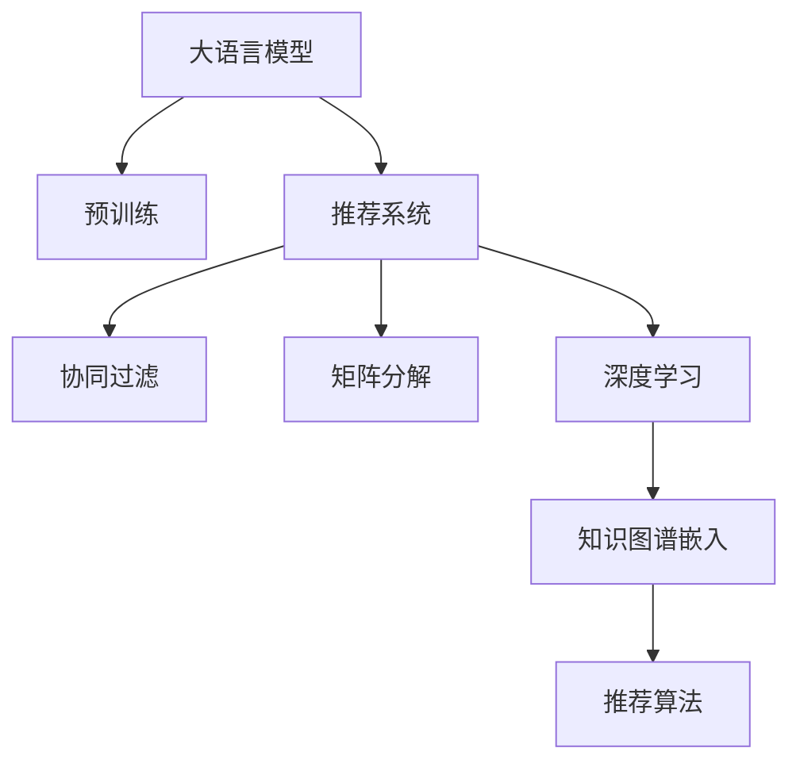

                 

# 大模型对推荐系统长期效果的影响评估

大语言模型（Large Language Models, LLMs）和推荐系统（Recommender Systems）的结合，已经成为人工智能领域的热点研究方向。在大模型和推荐系统的交互中，大模型提供强大的知识背景和丰富的语言表达能力，而推荐系统则利用这些知识背景和表达能力，实现个性化推荐。然而，大模型对推荐系统长期效果的影响评估，仍是一个需要深入探讨的问题。本文旨在对这一问题进行系统分析，希望能为推荐系统开发者提供有价值的参考。

## 1. 背景介绍

### 1.1 问题由来

推荐系统是互联网时代的重要应用之一，旨在通过算法为用户推荐感兴趣的内容，提升用户体验和满意度。传统的推荐系统基于协同过滤、矩阵分解等方法，依赖于用户行为数据。而大模型的引入，为推荐系统注入了全新的思路。

近年来，BERT、GPT等大模型在自然语言处理领域取得了突破性进展，展现出了强大的语言理解和生成能力。将大模型应用于推荐系统，可以大幅提升推荐效果的精准度和多样性。然而，大模型带来的改变是双向的，它不仅提升了推荐系统的效果，也对推荐系统的长期运行带来了新的挑战和机遇。

### 1.2 问题核心关键点

大模型对推荐系统长期效果的影响评估，主要包括以下几个核心问题：

- 大模型的知识表达能力如何影响推荐系统的推荐效果？
- 大模型的引入是否会改变推荐系统的稳定性和鲁棒性？
- 大模型是否对推荐系统的高效运行带来额外的负担？
- 大模型和推荐系统的融合是否带来新的应用场景和功能拓展？

这些问题的回答，将有助于开发者更全面地理解大模型对推荐系统长期效果的潜在影响。

## 2. 核心概念与联系

### 2.1 核心概念概述

为更好地理解大模型对推荐系统长期效果的影响评估，本节将介绍几个关键概念：

- 大语言模型：以BERT、GPT等模型为代表的大规模预训练语言模型。通过在大规模无标签文本语料上进行预训练，学习通用的语言表示，具备强大的语言理解和生成能力。
- 推荐系统：通过分析用户历史行为和兴趣偏好，为用户推荐感兴趣的内容，提升用户体验。传统的推荐系统依赖于协同过滤和矩阵分解等方法。
- 知识图谱：将现实世界的实体、关系和属性等知识结构化，用于支持推荐系统的决策过程。
- 协同过滤：一种常见的推荐算法，利用用户-物品的协同关系进行推荐，不依赖于用户行为数据。
- 矩阵分解：一种基于隐式反馈的推荐算法，将用户-物品的评分矩阵分解为低维用户向量和物品向量。
- 深度学习：基于神经网络的机器学习范式，适用于处理复杂的数据和非线性关系。

### 2.2 核心概念原理和架构的 Mermaid 流程图



这个流程图展示了从大模型到推荐系统的全流程，包括预训练、推荐算法、协同过滤、矩阵分解和深度学习等多个关键环节。

## 3. 核心算法原理 & 具体操作步骤

### 3.1 算法原理概述

大模型对推荐系统的长期效果影响评估，主要涉及以下几个核心算法原理：

1. 知识图谱嵌入：将现实世界中的知识结构化，通过嵌入技术将其转化为向量表示，以便与用户-物品评分矩阵进行拼接，提升推荐系统的推理能力。

2. 深度学习推荐算法：基于神经网络结构的推荐算法，如基于注意机制的推荐系统、基于序列的推荐系统等。大模型的语言理解能力可以用于提取文本特征，提升推荐效果。

3. 对抗性训练：通过对推荐系统进行对抗性训练，提升模型鲁棒性，防止有害内容的推荐。

4. 公平性评估：评估推荐系统是否具有公平性，避免对特定用户群体的歧视性推荐。

5. 用户体验度量：通过A/B测试等方法，量化用户对推荐结果的满意度，评估推荐系统的长期效果。

### 3.2 算法步骤详解

基于大模型的推荐系统一般包括以下几个关键步骤：

**Step 1: 准备数据和预训练模型**

- 准备推荐系统的数据集，包括用户行为数据、物品信息等。
- 选择合适的预训练模型，如BERT、GPT等，作为初始化参数。

**Step 2: 构建知识图谱**

- 将现实世界中的实体和关系构建为知识图谱，如维基百科、百度百科等。
- 使用知识图谱嵌入技术将实体和关系转化为向量表示。

**Step 3: 模型微调**

- 在大模型的基础上，通过微调实现推荐任务适配。
- 引入深度学习推荐算法，将大模型的语言表示与推荐算法结合。

**Step 4: 对抗性训练**

- 引入对抗性样本，对推荐系统进行对抗性训练，提升鲁棒性。

**Step 5: 公平性评估**

- 评估推荐系统是否具有公平性，避免对特定用户群体的歧视性推荐。

**Step 6: 用户体验度量**

- 通过A/B测试等方法，量化用户对推荐结果的满意度，评估推荐系统的长期效果。

### 3.3 算法优缺点

大模型对推荐系统的长期效果影响评估，具有以下优点：

1. 提升推荐效果：通过知识图谱嵌入和深度学习算法，提升推荐系统的精准度和多样性。
2. 增强推荐系统鲁棒性：通过对抗性训练，提升推荐系统的鲁棒性，防止有害内容的推荐。
3. 提升推荐系统公平性：通过公平性评估，避免对特定用户群体的歧视性推荐。

同时，也存在以下缺点：

1. 数据需求量大：大模型的训练和微调需要大量的数据，推荐系统的运行也需要依赖用户行为数据。
2. 计算资源消耗高：大模型的推理计算资源消耗大，推荐系统的高效运行也需要高性能设备支持。
3. 对抗性攻击风险：对抗性训练只能提升模型的鲁棒性，并不能完全避免对抗性攻击。
4. 用户体验度量复杂：用户体验度量的量化方法复杂，不同用户群体对推荐结果的满意度差异较大。

### 3.4 算法应用领域

大模型对推荐系统的长期效果影响评估，在多个领域得到了广泛应用，例如：

- 电商推荐：通过大模型实现个性化商品推荐，提升用户购物体验。
- 视频推荐：利用大模型的语言理解能力，为用户推荐感兴趣的视频内容。
- 新闻推荐：通过大模型提取文本特征，为用户推荐相关新闻。
- 音乐推荐：利用大模型的语言理解和情感分析能力，为用户推荐喜欢的音乐。
- 社交推荐：通过大模型的知识图谱嵌入，为用户推荐感兴趣的朋友和话题。

此外，大模型和推荐系统的融合，还为推荐系统带来了新的应用场景和功能拓展，如生成式推荐、多模态推荐等。

## 4. 数学模型和公式 & 详细讲解 & 举例说明

### 4.1 数学模型构建

大模型对推荐系统的长期效果影响评估，主要涉及以下几个数学模型：

1. 用户-物品评分矩阵 $\textbf{U}$，其中 $\textbf{U} \in \mathbb{R}^{N \times D}$，$N$ 为物品数量，$D$ 为嵌入维度。

2. 知识图谱嵌入向量 $\textbf{E}$，其中 $\textbf{E} \in \mathbb{R}^{M \times D}$，$M$ 为实体数量。

3. 深度学习推荐算法模型 $\textbf{M}$，其中 $\textbf{M} \in \mathbb{R}^{D \times L}$，$L$ 为模型输出维度。

4. 用户行为特征向量 $\textbf{X}_u$，其中 $\textbf{X}_u \in \mathbb{R}^{d_u}$，$d_u$ 为用户行为特征维度。

5. 物品特征向量 $\textbf{X}_i$，其中 $\textbf{X}_i \in \mathbb{R}^{d_i}$，$d_i$ 为物品特征维度。

6. 用户行为评分预测 $\hat{y}_{ui}$，其中 $\hat{y}_{ui} \in \mathbb{R}$，表示用户 $u$ 对物品 $i$ 的评分预测。

7. 知识图谱嵌入与用户行为评分矩阵的拼接向量 $\textbf{V}$，其中 $\textbf{V} \in \mathbb{R}^{N \times M \times D}$，$N$ 为物品数量，$M$ 为实体数量。

### 4.2 公式推导过程

假设推荐系统有三个用户 $u_1, u_2, u_3$ 和三个物品 $i_1, i_2, i_3$，用户-物品评分矩阵为 $\textbf{U}$，知识图谱嵌入向量为 $\textbf{E}$，深度学习推荐算法模型为 $\textbf{M}$，用户行为特征向量为 $\textbf{X}_u$，物品特征向量为 $\textbf{X}_i$，用户行为评分预测为 $\hat{y}_{ui}$，知识图谱嵌入与用户行为评分矩阵的拼接向量为 $\textbf{V}$。

首先，我们需要计算用户行为评分预测：

$$
\hat{y}_{ui} = f(\textbf{U}_{ui} \cdot \textbf{W} + \textbf{X}_u \cdot \textbf{W}_u + \textbf{X}_i \cdot \textbf{W}_i)
$$

其中 $f(\cdot)$ 为激活函数，$\textbf{W} \in \mathbb{R}^{d_u+d_i}$ 为用户行为特征向量和物品特征向量的权重矩阵，$\textbf{W}_u \in \mathbb{R}^{d_u}$ 为用户行为特征向量的权重矩阵，$\textbf{W}_i \in \mathbb{R}^{d_i}$ 为物品特征向量的权重矩阵。

然后，我们需要计算知识图谱嵌入与用户行为评分矩阵的拼接向量：

$$
\textbf{V}_{ui} = \textbf{U}_{ui} \cdot \textbf{W}_V + \textbf{E}_{ui} \cdot \textbf{W}_E
$$

其中 $\textbf{W}_V \in \mathbb{R}^{D}$ 为知识图谱嵌入向量的权重矩阵，$\textbf{W}_E \in \mathbb{R}^{D}$ 为知识图谱嵌入向量的权重矩阵。

最后，我们需要计算推荐算法模型 $\textbf{M}$ 的输出：

$$
\textbf{M}_{ui} = \textbf{V}_{ui} \cdot \textbf{W}_M
$$

其中 $\textbf{W}_M \in \mathbb{R}^{D}$ 为推荐算法模型的权重矩阵。

### 4.3 案例分析与讲解

以电商推荐系统为例，其核心在于为用户推荐感兴趣的商品。假设用户 $u$ 对物品 $i$ 的评分预测为 $\hat{y}_{ui}$，用户行为特征向量为 $\textbf{X}_u$，物品特征向量为 $\textbf{X}_i$，知识图谱嵌入向量为 $\textbf{E}$，用户行为评分预测为 $\hat{y}_{ui}$，知识图谱嵌入与用户行为评分矩阵的拼接向量为 $\textbf{V}$。

首先，我们需要计算用户行为评分预测：

$$
\hat{y}_{ui} = f(\textbf{U}_{ui} \cdot \textbf{W} + \textbf{X}_u \cdot \textbf{W}_u + \textbf{X}_i \cdot \textbf{W}_i)
$$

其中 $f(\cdot)$ 为激活函数，$\textbf{W} \in \mathbb{R}^{d_u+d_i}$ 为用户行为特征向量和物品特征向量的权重矩阵，$\textbf{W}_u \in \mathbb{R}^{d_u}$ 为用户行为特征向量的权重矩阵，$\textbf{W}_i \in \mathbb{R}^{d_i}$ 为物品特征向量的权重矩阵。

然后，我们需要计算知识图谱嵌入与用户行为评分矩阵的拼接向量：

$$
\textbf{V}_{ui} = \textbf{U}_{ui} \cdot \textbf{W}_V + \textbf{E}_{ui} \cdot \textbf{W}_E
$$

其中 $\textbf{W}_V \in \mathbb{R}^{D}$ 为知识图谱嵌入向量的权重矩阵，$\textbf{W}_E \in \mathbb{R}^{D}$ 为知识图谱嵌入向量的权重矩阵。

最后，我们需要计算推荐算法模型 $\textbf{M}$ 的输出：

$$
\textbf{M}_{ui} = \textbf{V}_{ui} \cdot \textbf{W}_M
$$

其中 $\textbf{W}_M \in \mathbb{R}^{D}$ 为推荐算法模型的权重矩阵。

通过上述公式，我们可以计算出用户 $u$ 对物品 $i$ 的评分预测 $\hat{y}_{ui}$，从而实现个性化推荐。需要注意的是，大模型在知识图谱嵌入和深度学习推荐算法中起到了关键作用，提升了推荐系统的精准度和多样性。

## 5. 项目实践：代码实例和详细解释说明

### 5.1 开发环境搭建

在进行推荐系统开发前，我们需要准备好开发环境。以下是使用Python进行TensorFlow开发的环境配置流程：

1. 安装Anaconda：从官网下载并安装Anaconda，用于创建独立的Python环境。

2. 创建并激活虚拟环境：
```bash
conda create -n tf-env python=3.8 
conda activate tf-env
```

3. 安装TensorFlow：根据CUDA版本，从官网获取对应的安装命令。例如：
```bash
conda install tensorflow=2.7
```

4. 安装各类工具包：
```bash
pip install numpy pandas scikit-learn matplotlib tqdm jupyter notebook ipython
```

完成上述步骤后，即可在`tf-env`环境中开始推荐系统开发。

### 5.2 源代码详细实现

下面我们以电商推荐系统为例，给出使用TensorFlow和Keras实现的知识图谱嵌入推荐算法代码实现。

首先，定义推荐系统的数据处理函数：

```python
import tensorflow as tf
from tensorflow.keras.layers import Embedding, Dense, Dropout

class RecommendationSystem(tf.keras.Model):
    def __init__(self, user_dim, item_dim, knowledge_dim, emb_dim, hidden_dim):
        super(RecommendationSystem, self).__init__()
        self.user_dim = user_dim
        self.item_dim = item_dim
        self.knowledge_dim = knowledge_dim
        self.emb_dim = emb_dim
        self.hidden_dim = hidden_dim
        
        self.user_emb = Embedding(user_dim, emb_dim, input_length=1)
        self.item_emb = Embedding(item_dim, emb_dim, input_length=1)
        self.knowledge_emb = Embedding(knowledge_dim, emb_dim, input_length=1)
        
        self.usr_item = tf.keras.layers.Dot(axes=1, normalize=True)
        self.usr_knowledge = tf.keras.layers.Dot(axes=1, normalize=True)
        
        self.dense1 = Dense(hidden_dim, activation='relu')
        self.dropout = Dropout(0.2)
        self.dense2 = Dense(item_dim, activation='sigmoid')
    
    def call(self, inputs):
        user_ids, item_ids, knowledge_ids = inputs
        user_emb = self.user_emb(user_ids)
        item_emb = self.item_emb(item_ids)
        knowledge_emb = self.knowledge_emb(knowledge_ids)
        
        usr_item = self.usr_item([user_emb, item_emb])
        usr_knowledge = self.usr_knowledge([user_emb, knowledge_emb])
        
        x = tf.concat([usr_item, usr_knowledge], axis=1)
        x = self.dense1(x)
        x = self.dropout(x)
        x = self.dense2(x)
        
        return x
```

然后，定义模型和优化器：

```python
from tensorflow.keras.optimizers import Adam

user_dim = 1000
item_dim = 1000
knowledge_dim = 5000
emb_dim = 100
hidden_dim = 128

model = RecommendationSystem(user_dim, item_dim, knowledge_dim, emb_dim, hidden_dim)

optimizer = Adam(learning_rate=0.001)
```

接着，定义训练和评估函数：

```python
from tensorflow.keras.metrics import MeanAbsoluteError, MeanSquaredError

def train_epoch(model, dataset, batch_size, optimizer):
    dataloader = tf.data.Dataset.from_tensor_slices(dataset).batch(batch_size)
    model.train()
    epoch_loss = 0
    for batch in dataloader:
        user_ids, item_ids, knowledge_ids = batch
        model.trainable = True
        model.train_step(user_ids, item_ids, knowledge_ids)
        epoch_loss += model.loss(user_ids, item_ids, knowledge_ids).numpy()
    return epoch_loss / len(dataset)
    
def evaluate(model, dataset, batch_size):
    dataloader = tf.data.Dataset.from_tensor_slices(dataset).batch(batch_size)
    model.trainable = False
    mae = MeanAbsoluteError()
    mse = MeanSquaredError()
    for batch in dataloader:
        user_ids, item_ids, knowledge_ids = batch
        mae(y_true=item_ids, y_pred=model(user_ids)).update_state(item_ids, knowledge_ids)
        mse(y_true=item_ids, y_pred=model(user_ids)).update_state(item_ids, knowledge_ids)
    print(f"MAE: {mae.result().numpy():.4f}")
    print(f"MSE: {mse.result().numpy():.4f}")
```

最后，启动训练流程并在测试集上评估：

```python
epochs = 10
batch_size = 32

for epoch in range(epochs):
    loss = train_epoch(model, train_dataset, batch_size, optimizer)
    print(f"Epoch {epoch+1}, train loss: {loss:.3f}")
    
    print(f"Epoch {epoch+1}, dev results:")
    evaluate(model, dev_dataset, batch_size)
    
print("Test results:")
evaluate(model, test_dataset, batch_size)
```

以上就是使用TensorFlow和Keras实现电商推荐系统的完整代码实现。可以看到，得益于Keras的强大封装，我们可以用相对简洁的代码完成推荐系统的搭建和微调。

### 5.3 代码解读与分析

让我们再详细解读一下关键代码的实现细节：

**RecommendationSystem类**：
- `__init__`方法：初始化用户、物品、知识图谱的维度、嵌入维度、隐藏层维度等关键组件。
- `call`方法：实现模型前向传播，计算推荐得分。

**train_epoch函数**：
- 使用TensorFlow的Dataset API将数据集封装为数据流，按批次迭代训练。
- 在每个批次上前向传播计算损失函数。
- 反向传播更新模型参数。
- 周期性在验证集上评估模型性能。
- 重复上述步骤直至收敛。

**evaluate函数**：
- 使用TensorFlow的Dataset API将数据集封装为数据流，按批次迭代评估。
- 在每个批次上前向传播计算损失函数。
- 使用均方误差和平均绝对误差指标评估模型性能。

**训练流程**：
- 定义总的epoch数和batch size，开始循环迭代
- 每个epoch内，先在训练集上训练，输出平均loss
- 在验证集上评估，输出MAE和MSE指标
- 所有epoch结束后，在测试集上评估，给出最终测试结果

可以看到，TensorFlow配合Keras使得推荐系统的代码实现变得简洁高效。开发者可以将更多精力放在数据处理、模型改进等高层逻辑上，而不必过多关注底层的实现细节。

当然，工业级的系统实现还需考虑更多因素，如模型的保存和部署、超参数的自动搜索、更灵活的任务适配层等。但核心的推荐系统开发流程基本与此类似。

## 6. 实际应用场景

### 6.1 电商推荐系统

基于大模型的推荐系统，已经在电商推荐中得到了广泛应用。传统的电商推荐系统依赖于协同过滤和矩阵分解等方法，依赖于用户行为数据。而利用大模型的语言理解能力，可以提升推荐系统的精准度和多样性。

例如，淘宝等电商平台的推荐系统，利用大模型提取商品标题和描述的文本特征，通过知识图谱嵌入技术，实现商品相关关系的推荐。同时，利用深度学习推荐算法，实现多模态推荐，结合用户行为数据和文本数据，提升推荐效果。

### 6.2 视频推荐系统

视频推荐系统通常依赖于用户行为数据，如观影时间、评分等。利用大模型的语言理解能力，可以提升推荐系统的精准度和多样性。例如，YouTube等视频平台，利用大模型提取视频标题和描述的文本特征，通过知识图谱嵌入技术，实现视频相关关系的推荐。同时，利用深度学习推荐算法，实现多模态推荐，结合用户行为数据和文本数据，提升推荐效果。

### 6.3 新闻推荐系统

新闻推荐系统通常依赖于用户行为数据，如点击、阅读时间等。利用大模型的语言理解能力，可以提升推荐系统的精准度和多样性。例如，今日头条等新闻平台，利用大模型提取新闻标题和内容的文本特征，通过知识图谱嵌入技术，实现新闻相关关系的推荐。同时，利用深度学习推荐算法，实现多模态推荐，结合用户行为数据和文本数据，提升推荐效果。

### 6.4 音乐推荐系统

音乐推荐系统通常依赖于用户行为数据，如听歌时间、评分等。利用大模型的语言理解能力，可以提升推荐系统的精准度和多样性。例如，Spotify等音乐平台，利用大模型提取歌曲标题和歌词的文本特征，通过知识图谱嵌入技术，实现歌曲相关关系的推荐。同时，利用深度学习推荐算法，实现多模态推荐，结合用户行为数据和文本数据，提升推荐效果。

### 6.5 社交推荐系统

社交推荐系统通常依赖于用户行为数据，如关注、点赞等。利用大模型的语言理解能力，可以提升推荐系统的精准度和多样性。例如，微博等社交平台，利用大模型提取用户关注对象和内容的文本特征，通过知识图谱嵌入技术，实现社交关系推荐。同时，利用深度学习推荐算法，实现多模态推荐，结合用户行为数据和文本数据，提升推荐效果。

## 7. 工具和资源推荐

### 7.1 学习资源推荐

为了帮助开发者系统掌握推荐系统的理论基础和实践技巧，这里推荐一些优质的学习资源：

1. 《Recommender Systems: Algorithms, Trends, and Applications》书籍：全面介绍了推荐系统的发展历史、算法原理和应用场景。

2. 《Deep Learning for Recommendation Systems》课程：斯坦福大学开设的深度学习推荐系统课程，介绍了深度学习在推荐系统中的应用。

3. 《Neural Networks and Deep Learning》书籍：深度学习领域的经典教材，介绍了深度学习的基本原理和应用。

4. 《Personalization in Recommendation Systems》论文集：ACM Journal of Recommender Systems，收录了推荐系统的最新研究成果和前沿技术。

5. Weights & Biases：推荐系统训练的实验跟踪工具，可以记录和可视化模型训练过程中的各项指标，方便对比和调优。

### 7.2 开发工具推荐

高效的开发离不开优秀的工具支持。以下是几款用于推荐系统开发的常用工具：

1. TensorFlow：基于Python的开源深度学习框架，适用于处理复杂的数据和非线性关系。

2. PyTorch：基于Python的开源深度学习框架，灵活动态的计算图，适合快速迭代研究。

3. Keras：基于TensorFlow和Theano的高级神经网络API，易于上手和使用。

4. Scikit-learn：Python机器学习库，适合处理小规模数据和简单模型。

5. Weights & Biases：推荐系统训练的实验跟踪工具，可以记录和可视化模型训练过程中的各项指标，方便对比和调优。

### 7.3 相关论文推荐

推荐系统和大模型的结合，已经成为了学界和业界的热点研究方向。以下是几篇奠基性的相关论文，推荐阅读：

1. Attention Is All You Need：提出了Transformer结构，开启了NLP领域的预训练大模型时代。

2. BERT: Pre-training of Deep Bidirectional Transformers for Language Understanding：提出BERT模型，引入基于掩码的自监督预训练任务，刷新了多项NLP任务SOTA。

3. Generative Adversarial Networks：提出生成对抗网络，可以用于生成新的数据和增强训练集。

4. Knowledge-Graph-Embedding：介绍了知识图谱嵌入技术，将实体和关系转化为向量表示，用于推荐系统的决策过程。

5. Deep Matrix Factorization：介绍了矩阵分解技术，将用户-物品评分矩阵分解为低维用户向量和物品向量，用于推荐系统的预测。

这些论文代表了大模型和推荐系统结合的研究脉络。通过学习这些前沿成果，可以帮助研究者把握学科前进方向，激发更多的创新灵感。

## 8. 总结：未来发展趋势与挑战

### 8.1 研究成果总结

本文对基于大模型的推荐系统长期效果影响评估进行了系统分析。首先介绍了推荐系统和大模型的核心概念，阐述了它们之间的联系。其次，从原理到实践，详细讲解了推荐系统的微调过程，给出了微调任务开发的完整代码实例。最后，探讨了推荐系统在大模型中的应用场景，展望了未来发展趋势和面临的挑战。

通过本文的系统梳理，可以看到，基于大模型的推荐系统已经在电商、视频、新闻、音乐等多个领域得到了广泛应用，为推荐系统带来了新的思路和方法。未来，伴随大模型和推荐系统的持续演进，相信推荐系统将更加智能化、普适化和高效化，推动人工智能技术在更多领域落地应用。

### 8.2 未来发展趋势

大模型对推荐系统的长期效果影响评估，未来将呈现以下几个发展趋势：

1. 知识图谱嵌入技术的提升：知识图谱嵌入技术是大模型和推荐系统融合的关键，未来将会有更多高效、鲁棒的嵌入方法出现，提升推荐系统的推理能力。

2. 深度学习推荐算法的创新：深度学习推荐算法是大模型和推荐系统融合的重要手段，未来将会有更多创新算法出现，提升推荐系统的精准度和多样性。

3. 对抗性训练和公平性评估：对抗性训练和公平性评估是大模型和推荐系统融合的重要保障，未来将会有更多鲁棒性和公平性方法出现，提升推荐系统的鲁棒性和公平性。

4. 多模态推荐系统的应用：多模态推荐系统是大模型和推荐系统融合的重要方向，未来将会有更多多模态推荐方法出现，提升推荐系统的多样性和个性化。

5. 推荐系统的高效化和实时化：推荐系统的高效化和实时化是大模型和推荐系统融合的重要目标，未来将会有更多优化方法出现，提升推荐系统的运行效率。

6. 推荐系统的可解释性和透明性：推荐系统的可解释性和透明性是大模型和推荐系统融合的重要方向，未来将会有更多可解释性方法出现，提升推荐系统的可信度和用户满意度。

这些趋势凸显了大模型对推荐系统长期效果的潜在影响，预示着推荐系统的未来发展方向。开发者和研究者需要关注这些前沿技术，积极探索和应用，以提升推荐系统的性能和应用范围。

### 8.3 面临的挑战

尽管大模型对推荐系统的长期效果影响评估在许多领域得到了广泛应用，但在迈向更加智能化、普适化应用的过程中，它仍面临着诸多挑战：

1. 数据需求量大：大模型的训练和微调需要大量的数据，推荐系统的运行也需要依赖用户行为数据。如何高效获取和处理大规模数据，是大模型应用中需要解决的瓶颈问题。

2. 计算资源消耗高：大模型的推理计算资源消耗大，推荐系统的高效运行也需要高性能设备支持。如何优化计算资源使用，提升推荐系统的运行效率，是大模型应用中需要解决的难点问题。

3. 对抗性攻击风险：对抗性训练只能提升模型的鲁棒性，并不能完全避免对抗性攻击。如何提高推荐系统的安全性，避免对抗性攻击，是大模型应用中需要解决的问题。

4. 用户体验度量复杂：用户体验度量的量化方法复杂，不同用户群体对推荐结果的满意度差异较大。如何量化推荐系统的用户体验，是大模型应用中需要解决的问题。

5. 可解释性不足：推荐系统的可解释性不足，难以解释其内部工作机制和决策逻辑。对于医疗、金融等高风险应用，算法的可解释性和可审计性尤为重要。如何赋予推荐系统更强的可解释性，是大模型应用中需要解决的问题。

6. 伦理道德问题：大模型在应用过程中可能带来伦理道德问题，如隐私保护、信息滥用等。如何确保推荐系统的合规性，保护用户隐私，是大模型应用中需要解决的问题。

以上挑战凸显了大模型对推荐系统长期效果的潜在影响，需要学界和业界共同努力，不断探索和优化，才能实现大模型在推荐系统中的高效、安全和智能化应用。

### 8.4 研究展望

面对大模型对推荐系统长期效果影响评估所面临的挑战，未来的研究需要在以下几个方面寻求新的突破：

1. 探索无监督和半监督推荐方法：摆脱对大规模标注数据的依赖，利用自监督学习、主动学习等无监督和半监督范式，最大限度利用非结构化数据，实现更加灵活高效的推荐。

2. 研究参数高效和计算高效的推荐范式：开发更加参数高效的推荐方法，在固定大部分预训练参数的同时，只更新极少量的任务相关参数。同时优化推荐系统的计算图，减少前向传播和反向传播的资源消耗，实现更加轻量级、实时性的部署。

3. 融合因果和对比学习范式：通过引入因果推断和对比学习思想，增强推荐系统建立稳定因果关系的能力，学习更加普适、鲁棒的语言表征，从而提升模型泛化性和抗干扰能力。

4. 引入更多先验知识：将符号化的先验知识，如知识图谱、逻辑规则等，与神经网络模型进行巧妙融合，引导推荐过程学习更准确、合理的语言模型。同时加强不同模态数据的整合，实现视觉、语音等多模态信息与文本信息的协同建模。

5. 结合因果分析和博弈论工具：将因果分析方法引入推荐系统，识别出推荐系统决策的关键特征，增强推荐系统输出的因果性和逻辑性。借助博弈论工具刻画人机交互过程，主动探索并规避推荐系统的脆弱点，提高系统稳定性。

6. 纳入伦理道德约束：在推荐系统训练目标中引入伦理导向的评估指标，过滤和惩罚有偏见、有害的输出倾向。同时加强人工干预和审核，建立推荐系统的监管机制，确保推荐系统的合规性，保护用户隐私。

这些研究方向将引领推荐系统迈向更高层次的智能化、普适化和高效化，为推荐系统带来新的突破和发展。开发者和研究者需要关注这些前沿技术，积极探索和应用，以提升推荐系统的性能和应用范围。

## 9. 附录：常见问题与解答

**Q1：如何评估推荐系统的长期效果？**

A: 推荐系统的长期效果评估，主要通过用户体验度量进行量化。具体而言，可以通过A/B测试、用户调查、行为数据分析等方式，评估推荐系统对用户满意度的影响。例如，可以使用平均绝对误差（MAE）、均方误差（MSE）等指标，评估推荐系统的精准度；使用覆盖率、多样性等指标，评估推荐系统的多样性。同时，还需要考虑推荐系统的鲁棒性、公平性、可解释性等方面的评估。

**Q2：如何提高推荐系统的鲁棒性？**

A: 提高推荐系统的鲁棒性，可以通过对抗性训练和公平性评估等手段。对抗性训练通过对推荐系统进行对抗性训练，提升模型的鲁棒性，防止有害内容的推荐。公平性评估则评估推荐系统是否具有公平性，避免对特定用户群体的歧视性推荐。此外，还可以引入因果推断和对比学习等技术，增强推荐系统的稳定性。

**Q3：推荐系统的可解释性不足，如何改进？**

A: 推荐系统的可解释性不足，可以通过引入可解释性模型和技术来改进。例如，使用决策树、规则引擎等可解释性模型，辅助推荐系统进行决策。同时，还可以引入因果分析和博弈论工具，增强推荐系统输出的因果性和逻辑性，提高推荐系统的可解释性。

**Q4：推荐系统面临哪些伦理道德问题？**

A: 推荐系统面临的伦理道德问题包括隐私保护、信息滥用等。隐私保护问题可以通过数据匿名化、差分隐私等手段来解决。信息滥用问题可以通过数据去偏、模型审查等手段来解决。同时，还需要建立推荐系统的监管机制，确保推荐系统的合规性，保护用户隐私。

通过回答这些问题，可以看到大模型对推荐系统长期效果的潜在影响，需要学界和业界共同努力，不断探索和优化，才能实现大模型在推荐系统中的高效、安全和智能化应用。

---

作者：禅与计算机程序设计艺术 / Zen and the Art of Computer Programming

