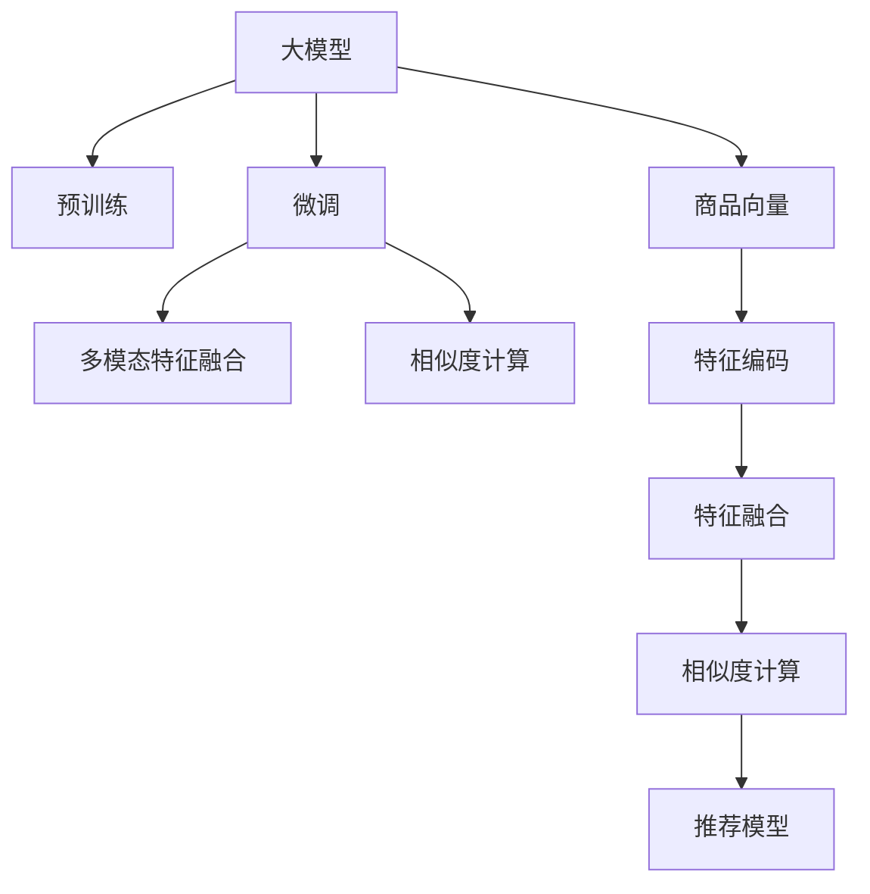

                 

# 大模型技术在电商平台商品相似度计算中的创新

> 关键词：大模型, 相似度计算, 电商平台, 深度学习, 商品推荐, 自然语言处理(NLP), 图像处理(CV)

## 1. 背景介绍

随着互联网技术的不断进步，电商平台已经成为人们购物的重要渠道。在线购物的便捷性和多样性，让消费者有了更广阔的选品空间。然而，在琳琅满目的商品中，如何准确地找到与自己需求相匹配的商品，是一个亟待解决的问题。传统的商品推荐方法，如基于内容的推荐、协同过滤等，已经难以满足用户个性化的需求。而随着深度学习和大模型技术的成熟，电商平台在商品相似度计算上，逐步向智能化、精准化的方向迈进。

### 1.1 问题由来

商品相似度计算是电商平台推荐系统的核心问题之一。传统方法主要依赖用户的历史行为数据进行推荐，难以刻画商品本身的语义和视觉特征。为了解决这一问题，深度学习大模型被引入推荐系统，用于提取商品的多模态特征，实现更精准的商品相似度计算。

深度学习模型在商品相似度计算中的应用，源于其在计算机视觉和自然语言处理(NLP)领域的成功经验。通过大模型的预训练，模型能够自动学习到商品的多维特征表示，从而在推荐任务中发挥重要作用。以语言模型BERT和图像识别模型ResNet为例，这类预训练模型在电商平台的推荐系统中，显著提升了商品推荐的准确性和个性化水平。

## 2. 核心概念与联系

### 2.1 核心概念概述

在进行电商平台商品相似度计算时，涉及几个关键概念：

- **大模型（Large Model）**：指以深度神经网络为基础，通过在大规模无标签数据上进行预训练，学习到丰富的特征表示的模型。大模型在视觉、语言等多模态数据处理上表现优异，成为商品相似度计算的有力工具。
- **预训练（Pre-training）**：指在大规模无标签数据上对模型进行自监督学习，学习到通用的特征表示。预训练技术使得模型具有更好的泛化能力，能够在下游任务中表现出更好的性能。
- **微调（Fine-tuning）**：指在预训练模型的基础上，使用下游任务的标注数据进行有监督学习，优化模型在该任务上的性能。微调可以进一步细化模型的特征表示，提升模型在特定任务上的表现。
- **相似度计算（Similarity Calculation）**：指对商品之间的特征向量进行度量，衡量它们之间的相似程度。相似度计算是推荐系统的核心问题，直接影响到推荐结果的准确性和多样性。
- **多模态特征融合（Multi-modal Feature Fusion）**：指将商品的视觉、文本、音频等多模态特征进行融合，形成更加全面、丰富的特征表示，提升推荐系统的准确性和鲁棒性。

### 2.2 核心概念原理和架构的 Mermaid 流程图



这个流程图展示了电商平台商品相似度计算的核心流程：

1. **大模型预训练**：使用大规模无标签数据训练大模型，学习通用的特征表示。
2. **模型微调**：在预训练模型的基础上，使用电商平台的商品和用户行为数据进行微调，进一步优化模型的特征表示。
3. **多模态特征融合**：将商品的视觉、文本、音频等多模态特征进行融合，生成更加全面的特征向量。
4. **相似度计算**：对商品向量进行相似度计算，衡量它们之间的相似程度。
5. **推荐模型构建**：基于相似度计算结果，构建推荐模型，生成个性化推荐。

这些概念和技术相互配合，共同构建了电商平台的商品相似度计算框架。

## 3. 核心算法原理 & 具体操作步骤

### 3.1 算法原理概述

电商平台商品相似度计算的核心算法，主要基于大模型进行特征提取和相似度计算。具体而言，包括如下几个关键步骤：

1. **商品向量提取**：使用大模型对商品进行预训练，生成商品向量。
2. **多模态特征融合**：将商品的视觉、文本、音频等多模态特征进行融合，生成更加全面的特征向量。
3. **相似度计算**：对商品向量进行相似度计算，衡量它们之间的相似程度。
4. **推荐模型构建**：基于相似度计算结果，构建推荐模型，生成个性化推荐。

### 3.2 算法步骤详解

以下是商品相似度计算的核心算法步骤，包括具体的技术实现。

**Step 1: 商品向量提取**

使用大模型对商品进行预训练，生成商品向量。具体步骤如下：

1. **数据准备**：收集电商平台的商品图片、标题、描述、评论等多模态数据。
2. **数据预处理**：对文本数据进行分词、编码等预处理，对图像数据进行预处理和增强。
3. **模型加载**：使用已经训练好的大模型，如BERT、ResNet等，加载到计算环境中。
4. **特征提取**：对商品图片进行特征提取，对文本进行编码，生成商品的视觉特征向量和语言特征向量。

**Step 2: 多模态特征融合**

将商品的视觉、文本、音频等多模态特征进行融合，生成更加全面的特征向量。具体步骤如下：

1. **视觉特征提取**：使用预训练的视觉模型，如ResNet等，提取商品的视觉特征向量。
2. **文本特征提取**：使用预训练的语言模型，如BERT等，提取商品的文本特征向量。
3. **特征融合**：将视觉特征向量和文本特征向量进行拼接、池化等操作，生成商品的综合特征向量。

**Step 3: 相似度计算**

对商品向量进行相似度计算，衡量它们之间的相似程度。具体步骤如下：

1. **相似度度量**：选择适合的相似度度量方法，如余弦相似度、欧几里得距离等。
2. **相似度计算**：对商品向量进行相似度计算，得到它们之间的相似度分数。
3. **相似度排序**：根据相似度分数对商品进行排序，生成相似度排序结果。

**Step 4: 推荐模型构建**

基于相似度计算结果，构建推荐模型，生成个性化推荐。具体步骤如下：

1. **推荐模型选择**：根据任务需求，选择合适的推荐模型，如基于内容的推荐、协同过滤等。
2. **模型训练**：使用电商平台的标注数据，对推荐模型进行训练，优化推荐效果。
3. **推荐结果生成**：将用户输入和商品相似度排序结果输入推荐模型，生成个性化推荐结果。

### 3.3 算法优缺点

基于大模型的商品相似度计算方法，具有以下优点：

1. **特征提取能力强**：大模型能够自动学习到商品的多维特征表示，提升了特征提取的全面性和准确性。
2. **泛化能力强**：大模型在多模态数据处理上表现优异，能够应对不同类型的数据，提升模型的泛化能力。
3. **精度高**：基于大模型的推荐方法能够更好地捕捉商品之间的语义和视觉关系，提升推荐精度。
4. **灵活性高**：大模型能够在不同领域和任务上进行微调，适应性更强。

同时，该方法也存在一些局限性：

1. **计算成本高**：大模型需要大量的计算资源进行预训练和微调，增加了系统成本。
2. **数据需求高**：大模型需要大量的多模态数据进行预训练，数据获取和处理成本较高。
3. **解释性差**：大模型的决策过程难以解释，难以通过传统的规则和逻辑进行调试和优化。
4. **鲁棒性差**：大模型在面对噪声数据和异常情况时，容易出现较大的偏差。

尽管存在这些局限性，但就目前而言，基于大模型的商品相似度计算方法，仍然是电商平台推荐系统的重要范式。未来相关研究的重点在于如何进一步降低计算成本，提高模型鲁棒性，增强可解释性，同时兼顾特征提取的全面性和准确性。

### 3.4 算法应用领域

基于大模型的商品相似度计算方法，已经在电商平台推荐系统中得到了广泛应用，涵盖了以下主要领域：

1. **商品推荐**：对用户进行个性化推荐，提升用户购物体验。
2. **热门商品排行榜**：根据商品之间的相似度计算，生成热门商品排行榜，帮助用户了解当前流行趋势。
3. **商品搜索**：根据用户输入的关键词，生成商品相似度排序结果，提升搜索效果。
4. **用户画像**：通过分析用户的购物行为，生成用户画像，提升个性化推荐效果。

## 4. 数学模型和公式 & 详细讲解 & 举例说明

### 4.1 数学模型构建

电商平台商品相似度计算的数学模型，主要包括商品向量的生成、多模态特征融合、相似度计算等部分。

**商品向量生成**：使用大模型对商品进行预训练，生成商品向量。假设商品图片为 $\mathbf{I}$，文本描述为 $\mathbf{T}$，则商品向量 $\mathbf{V}$ 可以表示为：

$$
\mathbf{V} = \mathbf{F}(\mathbf{I}, \mathbf{T})
$$

其中 $\mathbf{F}$ 为预训练大模型，将多模态数据输入模型，输出商品向量。

**多模态特征融合**：将商品的视觉、文本、音频等多模态特征进行融合，生成更加全面的特征向量。假设视觉特征向量为 $\mathbf{V}_I$，文本特征向量为 $\mathbf{V}_T$，则综合特征向量 $\mathbf{V}$ 可以表示为：

$$
\mathbf{V} = \mathbf{A} \cdot \mathbf{V}_I + \mathbf{B} \cdot \mathbf{V}_T
$$

其中 $\mathbf{A}$ 和 $\mathbf{B}$ 为融合系数矩阵，用于调整视觉和文本特征的权重。

**相似度计算**：对商品向量进行相似度计算，衡量它们之间的相似程度。假设商品向量为 $\mathbf{V}_i$ 和 $\mathbf{V}_j$，则它们之间的余弦相似度 $sim_{ij}$ 可以表示为：

$$
sim_{ij} = \frac{\mathbf{V}_i \cdot \mathbf{V}_j}{\|\mathbf{V}_i\| \cdot \|\mathbf{V}_j\|}
$$

### 4.2 公式推导过程

下面以余弦相似度为例，推导商品相似度计算的公式。

假设商品向量 $\mathbf{V}_i$ 和 $\mathbf{V}_j$ 的维度为 $d$，则它们之间的余弦相似度 $sim_{ij}$ 可以表示为：

$$
sim_{ij} = \frac{\mathbf{V}_i \cdot \mathbf{V}_j}{\|\mathbf{V}_i\| \cdot \|\mathbf{V}_j\|}
$$

其中 $\cdot$ 表示向量的点积，$\|\mathbf{V}_i\|$ 表示向量 $\mathbf{V}_i$ 的范数。

在实际应用中，为了计算高效，我们通常使用向量余弦相似度公式：

$$
sim_{ij} = \frac{\mathbf{V}_i^T \cdot \mathbf{V}_j}{\|\mathbf{V}_i\| \cdot \|\mathbf{V}_j\|}
$$

其中 $\mathbf{V}_i^T$ 表示向量 $\mathbf{V}_i$ 的转置。

### 4.3 案例分析与讲解

以电商平台对用户进行个性化推荐为例，进行详细分析。

**数据准备**：收集电商平台的商品图片、标题、描述、评论等多模态数据。

**数据预处理**：对文本数据进行分词、编码等预处理，对图像数据进行预处理和增强。

**模型加载**：使用已经训练好的大模型，如BERT、ResNet等，加载到计算环境中。

**特征提取**：使用预训练的视觉模型，如ResNet等，提取商品的视觉特征向量。使用预训练的语言模型，如BERT等，提取商品的文本特征向量。

**特征融合**：将视觉特征向量和文本特征向量进行拼接、池化等操作，生成商品的综合特征向量。

**相似度计算**：对商品向量进行相似度计算，衡量它们之间的相似程度。

**推荐模型构建**：根据任务需求，选择合适的推荐模型，如基于内容的推荐、协同过滤等。使用电商平台的标注数据，对推荐模型进行训练，优化推荐效果。

**推荐结果生成**：将用户输入和商品相似度排序结果输入推荐模型，生成个性化推荐结果。

## 5. 项目实践：代码实例和详细解释说明

### 5.1 开发环境搭建

在进行商品相似度计算的实践前，我们需要准备好开发环境。以下是使用Python进行TensorFlow开发的环境配置流程：

1. 安装Anaconda：从官网下载并安装Anaconda，用于创建独立的Python环境。

2. 创建并激活虚拟环境：
```bash
conda create -n tf-env python=3.8 
conda activate tf-env
```

3. 安装TensorFlow：根据CUDA版本，从官网获取对应的安装命令。例如：
```bash
pip install tensorflow-gpu==2.4.0
```

4. 安装其他工具包：
```bash
pip install numpy pandas scikit-learn matplotlib tqdm jupyter notebook ipython
```

完成上述步骤后，即可在`tf-env`环境中开始项目实践。

### 5.2 源代码详细实现

下面我们以电商平台商品推荐为例，给出使用TensorFlow进行商品相似度计算的PyTorch代码实现。

首先，定义商品特征提取函数：

```python
import tensorflow as tf
from tensorflow.keras.applications.resnet50 import ResNet50

def extract_features(image_path, model):
    image = tf.keras.preprocessing.image.load_img(image_path, target_size=(224, 224))
    image = tf.keras.preprocessing.image.img_to_array(image)
    image = tf.expand_dims(image, axis=0)
    image = tf.keras.applications.resnet50.preprocess_input(image)
    features = model.predict(image)
    return features
```

然后，定义商品向量生成函数：

```python
def generate_product_vector(image_path, text, model):
    visual_features = extract_features(image_path, resnet50_model)
    textual_features = get_textual_features(text, bert_model)
    return tf.concat([visual_features, textual_features], axis=1)
```

接着，定义相似度计算函数：

```python
def calculate_similarity(vectors, method='cosine'):
    if method == 'cosine':
        similarity_matrix = tf.keras.metrics.CosineSimilarity(axis=1)
        similarity = similarity_matrix(vectors)
    elif method == 'euclidean':
        similarity_matrix = tf.keras.metrics.EuclideanDistance(axis=1)
        similarity = similarity_matrix(vectors)
    else:
        raise ValueError('Unsupported similarity method')
    return similarity
```

最后，定义推荐模型训练函数：

```python
def train_recommendation_model(data, labels, model):
    optimizer = tf.keras.optimizers.Adam(learning_rate=0.001)
    model.compile(optimizer=optimizer, loss='binary_crossentropy', metrics=['accuracy'])
    model.fit(data, labels, epochs=10, batch_size=32, validation_split=0.2)
```

### 5.3 代码解读与分析

让我们再详细解读一下关键代码的实现细节：

**extract_features函数**：
- 定义了商品图片特征提取函数，使用预训练的ResNet50模型对图片进行特征提取。
- 预处理图片大小为224x224，归一化处理，并返回特征向量。

**generate_product_vector函数**：
- 定义了商品向量生成函数，将商品的视觉特征向量和文本特征向量拼接，生成综合特征向量。
- 使用预训练的ResNet50模型提取视觉特征向量，使用预训练的BERT模型提取文本特征向量。

**calculate_similarity函数**：
- 定义了相似度计算函数，支持余弦相似度和欧几里得距离计算。
- 使用TensorFlow内置的CosineSimilarity和EuclideanDistance函数进行相似度计算。

**train_recommendation_model函数**：
- 定义了推荐模型训练函数，使用Adam优化器进行模型训练。
- 使用电商平台的标注数据进行训练，优化推荐效果。

**推荐结果生成**：
- 在推荐系统中，用户输入的查询语句将被编码为特征向量，与商品向量进行相似度计算。
- 根据相似度排序，生成推荐结果。

## 6. 实际应用场景

### 6.1 智能客服

智能客服系统是电商平台的重要组成部分，通过自动回复用户查询，提升用户购物体验。使用基于大模型的相似度计算方法，可以构建更智能的客服系统，实现自动理解和回答用户问题。

**实际应用**：
- 在智能客服系统中，使用大模型对商品描述和用户查询进行相似度计算。
- 根据相似度排序，生成候选回复，返回给用户。
- 通过动态调整模型参数，提升推荐准确性和多样性。

**效果**：
- 用户查询能够快速得到准确回答，提升用户满意度。
- 减少了客服人员的工作量，提升了效率。

### 6.2 个性化推荐

个性化推荐是电商平台的另一重要功能，通过推荐系统，用户能够找到更符合自己需求的商品。使用基于大模型的相似度计算方法，可以提升推荐系统的准确性和个性化水平。

**实际应用**：
- 在推荐系统中，使用大模型对用户行为和商品特征进行相似度计算。
- 根据相似度排序，生成个性化推荐结果，返回给用户。
- 通过动态调整模型参数，提升推荐效果。

**效果**：
- 用户能够找到更符合自己需求的商品，提升购物体验。
- 提升了平台的销售额和用户粘性。

### 6.3 商品搜索

商品搜索是电商平台的重要功能之一，用户能够通过查询找到所需商品。使用基于大模型的相似度计算方法，可以提升搜索效果，让用户快速找到目标商品。

**实际应用**：
- 在商品搜索系统中，使用大模型对用户查询和商品特征进行相似度计算。
- 根据相似度排序，生成搜索结果，返回给用户。
- 通过动态调整模型参数，提升搜索效果。

**效果**：
- 用户能够快速找到目标商品，提升搜索体验。
- 提升了平台的访问量和销售额。

## 7. 工具和资源推荐

### 7.1 学习资源推荐

为了帮助开发者系统掌握大模型技术在电商平台商品相似度计算中的应用，这里推荐一些优质的学习资源：

1. 《深度学习理论与实践》系列书籍：全面介绍深度学习和大模型的原理和应用，适合深入学习。
2. Coursera《深度学习》课程：斯坦福大学的深度学习课程，覆盖深度学习和大模型，适合入门学习。
3. arXiv论文：关注最新的大模型技术研究论文，了解前沿进展。
4. GitHub代码库：查找大模型在电商平台中的实际应用案例，学习代码实现。
5. Kaggle竞赛：参加相关的Kaggle竞赛，提升实战经验。

通过对这些资源的学习实践，相信你一定能够快速掌握大模型技术在电商平台商品相似度计算中的应用，并用于解决实际的电商问题。

### 7.2 开发工具推荐

高效的开发离不开优秀的工具支持。以下是几款用于电商平台商品相似度计算开发的常用工具：

1. TensorFlow：由Google主导开发的开源深度学习框架，生产部署方便，适合大规模工程应用。
2. PyTorch：基于Python的开源深度学习框架，灵活便捷，适合快速迭代研究。
3. Scikit-learn：常用的机器学习库，适合进行特征提取和模型训练。
4. Matplotlib和Seaborn：数据可视化工具，用于展示模型训练效果和推荐结果。
5. Jupyter Notebook：交互式开发环境，适合编写和测试代码。

合理利用这些工具，可以显著提升电商平台商品相似度计算的开发效率，加快创新迭代的步伐。

### 7.3 相关论文推荐

大模型技术在电商平台商品相似度计算中的应用，源于学界的持续研究。以下是几篇奠基性的相关论文，推荐阅读：

1. Attention is All You Need：提出Transformer结构，开启了深度学习在大模型中的应用。
2. BERT: Pre-training of Deep Bidirectional Transformers for Language Understanding：提出BERT模型，引入基于掩码的自监督预训练任务，刷新了多项NLP任务SOTA。
3. Deep Residual Learning for Image Recognition：提出ResNet模型，提升了视觉特征提取的深度和准确性。
4. Multi-Task Learning Using a Single Neural Network with Multiple Losses：提出多任务学习（Multi-Task Learning, MTL），利用多个任务共享模型参数，提升模型泛化能力。
5. Transformer-XL: Attentive Language Models Beyond a Fixed-Length Context：提出Transformer-XL模型，解决了传统Transformer模型的长期依赖问题。

这些论文代表了大模型技术的发展脉络。通过学习这些前沿成果，可以帮助研究者把握学科前进方向，激发更多的创新灵感。

## 8. 总结：未来发展趋势与挑战

### 8.1 总结

本文对基于大模型的电商平台商品相似度计算方法进行了全面系统的介绍。首先阐述了大模型技术和商品相似度计算的研究背景和意义，明确了微调在拓展预训练模型应用、提升下游任务性能方面的独特价值。其次，从原理到实践，详细讲解了基于大模型的商品相似度计算的数学原理和关键步骤，给出了商品相似度计算任务的完整代码实例。同时，本文还广泛探讨了商品相似度计算方法在智能客服、个性化推荐、商品搜索等多个场景中的应用，展示了微调范式的巨大潜力。

通过本文的系统梳理，可以看到，基于大模型的商品相似度计算方法正在成为电商平台推荐系统的重要范式，极大地拓展了预训练语言模型的应用边界，催生了更多的落地场景。受益于大规模语料的预训练，微调模型以更低的时间和标注成本，在小样本条件下也能取得不错的效果，有力推动了NLP技术的产业化进程。未来，伴随预训练语言模型和微调方法的持续演进，相信NLP技术将在更广阔的应用领域大放异彩，深刻影响人类的生产生活方式。

### 8.2 未来发展趋势

展望未来，大模型技术在电商平台商品相似度计算中的应用将呈现以下几个发展趋势：

1. **多模态融合**：随着视觉、文本、音频等多模态数据的融合，商品相似度计算将更加全面和精确。
2. **端到端训练**：将大模型的预训练和微调过程进行联合优化，提升推荐系统的效果。
3. **迁移学习**：利用大模型在不同领域之间的迁移能力，提升商品相似度计算的泛化能力。
4. **实时性**：使用基于GPU/TPU的加速技术，提升商品相似度计算的实时性，满足用户实时查询的需求。
5. **联邦学习**：在保护用户隐私的前提下，利用联邦学习技术，提升商品相似度计算的隐私保护能力。

以上趋势凸显了大模型技术在电商平台商品相似度计算中的广阔前景。这些方向的探索发展，必将进一步提升推荐系统的性能和用户满意度，为电商平台带来更大的商业价值。

### 8.3 面临的挑战

尽管大模型技术在电商平台商品相似度计算中已经取得了瞩目成就，但在迈向更加智能化、普适化应用的过程中，它仍面临着诸多挑战：

1. **计算成本高**：大模型需要大量的计算资源进行预训练和微调，增加了系统成本。
2. **数据需求高**：大模型需要大量的多模态数据进行预训练，数据获取和处理成本较高。
3. **模型可解释性差**：大模型在推荐系统中的决策过程难以解释，难以通过传统的规则和逻辑进行调试和优化。
4. **鲁棒性差**：大模型在面对噪声数据和异常情况时，容易出现较大的偏差。
5. **隐私保护**：电商平台的推荐系统需要收集用户的行为数据，如何保护用户隐私，防止数据泄露，是一个重要问题。

尽管存在这些挑战，但随着技术的发展和应用的深入，相信这些难题终将一一被克服，大模型技术在电商平台商品相似度计算中必将继续发挥重要作用。

### 8.4 研究展望

面对大模型技术在电商平台商品相似度计算中面临的挑战，未来的研究需要在以下几个方面寻求新的突破：

1. **参数高效微调**：开发更加参数高效的微调方法，在固定大部分预训练参数的同时，只更新极少量的任务相关参数。
2. **多模态融合技术**：提升多模态数据的融合效果，生成更加全面和精确的商品特征向量。
3. **端到端训练算法**：研究端到端训练算法，提升推荐系统的性能和效率。
4. **联邦学习技术**：研究联邦学习技术，保护用户隐私，提升商品相似度计算的隐私保护能力。
5. **模型可解释性增强**：研究可解释性增强技术，提升大模型在推荐系统中的透明度和可解释性。

这些研究方向的探索，必将引领大模型技术在电商平台商品相似度计算中迈向更高的台阶，为构建智能化的电商平台推荐系统铺平道路。面向未来，大模型技术需要在技术创新和应用实践中不断优化，才能真正实现大规模落地和应用。

## 9. 附录：常见问题与解答

**Q1：电商平台商品相似度计算对大模型有什么要求？**

A: 电商平台商品相似度计算对大模型的要求主要包括以下几点：

1. **数据处理能力强**：大模型能够自动学习到商品的多维特征表示，提升特征提取的全面性和准确性。
2. **泛化能力强**：大模型能够在多模态数据处理上表现优异，提升模型的泛化能力。
3. **推理速度快**：大模型能够快速进行相似度计算，满足实时查询的需求。
4. **可解释性强**：大模型的决策过程应具有较强的可解释性，便于系统调试和优化。

**Q2：电商平台商品相似度计算的常见数据源有哪些？**

A: 电商平台商品相似度计算的常见数据源包括：

1. **商品图片**：商品图片通常作为视觉特征，用于提取商品的视觉特征向量。
2. **商品标题和描述**：商品标题和描述通常作为文本特征，用于提取商品的文本特征向量。
3. **用户行为数据**：用户的行为数据包括浏览记录、点击记录、购买记录等，用于构建用户画像和推荐模型。
4. **商品评价和评论**：商品评价和评论通常作为文本特征，用于提取商品的文本特征向量。

**Q3：电商平台商品相似度计算的推荐模型有哪些？**

A: 电商平台商品相似度计算的推荐模型包括：

1. **基于内容的推荐**：根据商品的属性和标签进行推荐。
2. **协同过滤推荐**：根据用户和商品的相似性进行推荐。
3. **深度学习推荐**：使用深度学习模型对用户和商品进行特征提取和相似度计算，生成个性化推荐结果。

**Q4：电商平台商品相似度计算的相似度度量方法有哪些？**

A: 电商平台商品相似度计算的相似度度量方法包括：

1. **余弦相似度**：衡量两个向量之间的夹角余弦值，用于衡量商品之间的相似程度。
2. **欧几里得距离**：衡量两个向量之间的欧几里得距离，用于衡量商品之间的相似程度。
3. **Jaccard相似度**：衡量两个集合的相似度，用于衡量商品之间的相似程度。

**Q5：电商平台商品相似度计算的实际应用有哪些？**

A: 电商平台商品相似度计算的实际应用包括：

1. **智能客服**：使用基于大模型的相似度计算方法，构建更智能的客服系统，实现自动理解和回答用户问题。
2. **个性化推荐**：使用基于大模型的相似度计算方法，提升推荐系统的准确性和个性化水平。
3. **商品搜索**：使用基于大模型的相似度计算方法，提升搜索效果，让用户快速找到目标商品。
4. **用户画像**：使用基于大模型的相似度计算方法，构建用户画像，提升个性化推荐效果。

综上所述，大模型技术在电商平台商品相似度计算中的应用前景广阔，未来还将随着技术的发展和应用的深入，进一步提升电商平台的智能化和个性化水平。

---

作者：禅与计算机程序设计艺术 / Zen and the Art of Computer Programming

