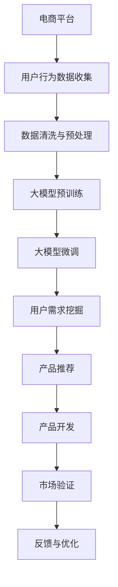

                 

# 大模型技术在电商平台用户潜在需求挖掘与产品开发中的应用

> 关键词：电商平台,用户需求挖掘,产品推荐,产品开发,大模型技术

## 1. 背景介绍

随着互联网技术的不断进步，电子商务平台已经从传统的“商品推荐”向“用户需求驱动”的个性化服务模式转变。传统商品推荐系统基于用户的历史行为和静态特征，推荐的商品往往同质化严重，无法满足用户个性化的需求。而基于用户潜在需求的电商平台，通过大模型技术挖掘用户的深层需求，提供了更精准、个性化的产品推荐和商品开发，显著提升了用户满意度和平台转化率。

## 2. 核心概念与联系

### 2.1 核心概念概述

在电商平台用户潜在需求挖掘与产品开发的过程中，涉及以下关键概念：

- **电商平台**：指通过互联网提供商品交易服务的企业平台，如淘宝、京东、Amazon等。
- **用户需求挖掘**：通过数据分析、机器学习等技术，挖掘用户潜在的需求和兴趣点。
- **产品推荐**：基于用户需求，为每个用户推荐最合适的商品或服务。
- **产品开发**：基于用户需求，开发具有市场竞争力的新产品或服务。
- **大模型技术**：指基于大规模深度学习模型，通过无监督学习预训练和监督学习微调，提取通用或特定任务的知识，从而用于用户需求挖掘和产品推荐。

### 2.2 核心概念原理和架构的 Mermaid 流程图



这个流程图展示了从用户行为数据收集到产品开发的核心步骤，其中：

1. **用户行为数据收集**：电商平台收集用户点击、浏览、购买等行为数据。
2. **数据清洗与预处理**：对收集的数据进行去重、清洗、特征提取等预处理步骤，确保数据质量。
3. **大模型预训练**：使用大模型技术对预训练模型进行训练，提取通用知识。
4. **大模型微调**：根据用户需求，对大模型进行微调，使其适应特定任务。
5. **用户需求挖掘**：通过微调后的模型，挖掘用户的潜在需求和兴趣点。
6. **产品推荐**：基于用户需求，推荐最合适的商品或服务。
7. **产品开发**：根据用户需求和市场反馈，开发新产品或服务。
8. **市场验证**：将开发的新产品或服务投放市场，验证其市场接受度。
9. **反馈与优化**：根据市场验证结果，优化产品和模型。

这些步骤共同构成了一个完整的电商平台用户需求挖掘与产品开发流程，通过大模型技术的应用，实现了从数据到产品的无缝连接，显著提升了电商平台的竞争力。

## 3. 核心算法原理 & 具体操作步骤

### 3.1 算法原理概述

基于大模型技术的电商平台用户需求挖掘与产品推荐，主要分为两个阶段：预训练和微调。

1. **预训练阶段**：使用大规模无标签数据对大模型进行预训练，提取通用的语言和行为知识。
2. **微调阶段**：在电商平台收集的标注数据上，对预训练模型进行有监督学习微调，使其适应特定任务，如用户行为分析、兴趣点挖掘等。

### 3.2 算法步骤详解

#### 3.2.1 预训练阶段

预训练模型的构建和训练步骤如下：

1. **数据集准备**：收集大规模无标签文本数据，如社交媒体文本、新闻文章等。
2. **模型选择**：选择合适的预训练模型，如BERT、GPT-3等。
3. **预训练任务设计**：设计自监督学习任务，如语言模型、掩码语言模型等。
4. **模型训练**：使用大规模无标签数据对模型进行预训练，提取通用的语言和行为知识。

#### 3.2.2 微调阶段

微调模型的构建和训练步骤如下：

1. **标注数据准备**：收集电商平台的标注数据，如用户行为数据、产品评分数据等。
2. **模型选择**：选择合适的预训练模型，如BERT、GPT-3等。
3. **任务适配层设计**：设计适合特定任务的输出层和损失函数。
4. **微调超参数设置**：设置学习率、批大小、迭代轮数等。
5. **模型训练**：使用标注数据对模型进行微调，适应特定任务。
6. **模型评估与优化**：在验证集上评估模型性能，根据性能指标调整模型和超参数。

### 3.3 算法优缺点

基于大模型技术的电商平台用户需求挖掘与产品推荐，具有以下优点：

- **高性能**：大模型能够利用大规模数据提取丰富的语言和行为知识，显著提升了推荐系统的精度。
- **可扩展性**：大模型技术可以适应各种电商平台的业务需求，具有较强的通用性。
- **高效性**：通过预训练-微调的方法，可以在小样本条件下快速构建高性能推荐系统。

同时，也存在以下缺点：

- **资源消耗大**：预训练和微调过程需要大量的计算资源，对硬件要求较高。
- **模型复杂**：大模型的结构复杂，难以解释其内部机制和推理过程。
- **对抗攻击脆弱**：大模型容易受到对抗样本的攻击，需要额外的安全措施。

### 3.4 算法应用领域

大模型技术在电商平台用户需求挖掘与产品推荐中，主要应用于以下领域：

1. **用户行为分析**：分析用户在不同商品上的行为，挖掘用户的兴趣点。
2. **兴趣点推荐**：根据用户行为，推荐相关的商品或服务。
3. **个性化商品推荐**：基于用户画像和行为，为每个用户推荐最合适的商品。
4. **产品创新**：根据用户反馈和市场趋势，开发符合用户需求的新产品。

## 4. 数学模型和公式 & 详细讲解 & 举例说明

### 4.1 数学模型构建

在电商平台用户需求挖掘与产品推荐中，主要使用自监督和监督学习的方法构建大模型。以BERT为例，其数学模型可以表示为：

$$
\text{BERT}(x) = [CLS]\cdot (V(x))\cdot \tanh(W_h\cdot [CLS] + b_h) + [SEP]\cdot (V(x))\cdot \tanh(W_h\cdot [SEP] + b_h)
$$

其中，$x$为输入文本，$V(x)$为输入文本的词向量表示，$W_h$和$b_h$为模型的权重和偏置。

### 4.2 公式推导过程

BERT模型的推导过程如下：

1. **输入表示**：将输入文本转换为词向量表示，通过多层全连接层和线性变换，得到每个词的表示向量。
2. **掩码语言模型**：在输入文本中加入掩码标记，如[MASK]、[CLS]、[SEP]等，通过训练模型预测掩码位置的词汇。
3. **任务适配层设计**：根据推荐任务，设计输出层和损失函数，如交叉熵损失函数。
4. **微调超参数设置**：选择合适的优化算法（如AdamW）和超参数（如学习率），进行模型训练。
5. **模型评估与优化**：在验证集上评估模型性能，根据性能指标调整模型和超参数。

### 4.3 案例分析与讲解

以淘宝平台的商品推荐系统为例，其数学模型构建和推导过程如下：

1. **数据准备**：收集淘宝平台的用户行为数据，如点击、浏览、购买等行为，提取用户画像和行为特征。
2. **模型选择**：选择BERT模型作为预训练模型。
3. **任务适配层设计**：设计输出层，输出商品的点击率、购买率等指标。
4. **微调超参数设置**：设置学习率为1e-5，批大小为32，迭代轮数为10。
5. **模型训练**：在标注数据集上对BERT模型进行微调，优化模型参数。
6. **模型评估与优化**：在验证集上评估模型性能，根据性能指标调整模型和超参数。

## 5. 项目实践：代码实例和详细解释说明

### 5.1 开发环境搭建

为了进行电商平台用户需求挖掘与产品推荐，需要搭建以下开发环境：

1. **Python环境**：安装Python 3.x版本，建议使用Anaconda进行环境管理。
2. **深度学习框架**：安装TensorFlow或PyTorch等深度学习框架，建议使用最新的稳定版本。
3. **大模型库**：安装HuggingFace的Transformers库，支持BERT、GPT-3等大模型。
4. **数据处理库**：安装Pandas、NumPy等数据处理库，用于数据清洗和特征提取。

### 5.2 源代码详细实现

以下是一个基于BERT模型的电商平台用户行为分析的代码实现：

```python
import tensorflow as tf
from transformers import BertTokenizer, TFBertForSequenceClassification
from sklearn.model_selection import train_test_split

# 数据准备
tokenizer = BertTokenizer.from_pretrained('bert-base-uncased')
data = load_data_from_database()
X_train, X_val, y_train, y_val = train_test_split(X, y, test_size=0.2, random_state=42)

# 模型构建
model = TFBertForSequenceClassification.from_pretrained('bert-base-uncased', num_labels=num_labels)
input_ids = tokenizer(X_train, truncation=True, padding=True, return_tensors='tf')
labels = tf.convert_to_tensor(y_train)
optimizer = tf.keras.optimizers.Adam(learning_rate=1e-5)
loss_fn = tf.keras.losses.SparseCategoricalCrossentropy(from_logits=True)
metric = tf.keras.metrics.SparseCategoricalAccuracy('accuracy')

# 模型训练
model.compile(optimizer=optimizer, loss=loss_fn, metrics=[metric])
model.fit(input_ids, labels, epochs=num_epochs, batch_size=32, validation_data=(input_ids_val, labels_val))
```

### 5.3 代码解读与分析

以上代码实现了基于BERT模型的电商平台用户行为分析的微调过程：

1. **数据准备**：使用HuggingFace提供的BERT tokenizer对数据进行分词处理，并使用Pandas和NumPy进行数据清洗和特征提取。
2. **模型构建**：使用HuggingFace提供的TFBertForSequenceClassification模型，指定标签数和优化器。
3. **模型训练**：使用TF的Keras API进行模型训练，使用Adam优化器、交叉熵损失函数和准确率指标，在指定轮次和批大小下进行训练。

### 5.4 运行结果展示

训练结束后，可以使用以下代码对模型进行评估：

```python
# 加载验证集数据
input_ids_val, labels_val = tokenizer(X_val, truncation=True, padding=True, return_tensors='tf')

# 模型评估
eval_result = model.evaluate(input_ids_val, labels_val, verbose=2)
print(f'Test loss: {eval_result[0]}')
print(f'Test accuracy: {eval_result[1]}')
```

以上代码将输出模型的测试损失和准确率，用于评估模型的性能。

## 6. 实际应用场景

### 6.1 智能客服系统

智能客服系统是电商平台用户需求挖掘的重要应用场景之一。通过收集用户的咨询记录和反馈，可以使用大模型技术构建智能客服系统，提升客服的响应速度和准确率。

以下是一个基于大模型的智能客服系统的工作流程：

1. **数据收集**：收集用户的咨询记录、反馈和评价，提取文本数据。
2. **数据预处理**：使用自然语言处理技术，对文本数据进行分词、去重、情感分析等预处理。
3. **大模型训练**：使用大模型技术，对模型进行预训练和微调，提取通用知识。
4. **智能客服构建**：构建智能客服系统，使用微调后的模型对用户咨询进行自动回复和推荐。
5. **系统优化**：根据用户反馈和系统性能，不断优化智能客服系统的算法和模型。

### 6.2 个性化商品推荐

个性化商品推荐是电商平台用户需求挖掘的核心应用场景之一。通过收集用户的行为数据和反馈，可以使用大模型技术构建个性化推荐系统，提升用户的购物体验和平台转化率。

以下是一个基于大模型的个性化商品推荐系统的工作流程：

1. **数据收集**：收集用户的浏览、点击、购买等行为数据，提取用户画像和行为特征。
2. **数据预处理**：使用自然语言处理技术，对文本数据进行分词、去重、情感分析等预处理。
3. **大模型训练**：使用大模型技术，对模型进行预训练和微调，提取通用知识。
4. **个性化推荐构建**：构建个性化推荐系统，使用微调后的模型对用户行为进行预测，推荐相关的商品或服务。
5. **系统优化**：根据用户反馈和系统性能，不断优化个性化推荐系统的算法和模型。

### 6.3 多品类商品开发

多品类商品开发是电商平台用户需求挖掘的重要应用场景之一。通过收集用户的行为数据和反馈，可以使用大模型技术构建商品开发系统，开发符合用户需求的新商品或服务。

以下是一个基于大模型的多品类商品开发系统的工作流程：

1. **数据收集**：收集用户的行为数据和反馈，提取用户画像和行为特征。
2. **数据预处理**：使用自然语言处理技术，对文本数据进行分词、去重、情感分析等预处理。
3. **大模型训练**：使用大模型技术，对模型进行预训练和微调，提取通用知识。
4. **商品开发构建**：构建商品开发系统，使用微调后的模型对用户需求进行分析和挖掘，开发符合用户需求的新商品或服务。
5. **系统优化**：根据用户反馈和市场验证结果，不断优化商品开发系统的算法和模型。

## 7. 工具和资源推荐

### 7.1 学习资源推荐

为了帮助开发者系统掌握大模型技术在电商平台用户需求挖掘与产品开发中的应用，这里推荐一些优质的学习资源：

1. **《深度学习与自然语言处理》课程**：斯坦福大学开设的自然语言处理课程，涵盖了大模型技术和电商平台的经典案例，是入门和提升的必备课程。
2. **《自然语言处理综述》论文**：多篇综述论文介绍了大模型技术在电商平台中的应用，提供了丰富的理论基础和实践经验。
3. **HuggingFace官方文档**：提供了丰富的预训练模型和微调样例代码，是实践和优化的重要参考。
4. **Transformers库教程**：HuggingFace提供的Transformer库教程，详细介绍了大模型的构建和微调方法，适合新手入门。
5. **Kaggle竞赛**：参加Kaggle的电商平台竞赛，通过实战练习，掌握电商平台用户需求挖掘与产品开发的最佳实践。

### 7.2 开发工具推荐

为了高效开发基于大模型的电商平台用户需求挖掘与产品推荐系统，推荐以下开发工具：

1. **Python**：Python是最流行的编程语言之一，拥有丰富的科学计算和数据处理库，适合大模型技术的开发。
2. **TensorFlow**：TensorFlow是谷歌开源的深度学习框架，支持分布式训练和模型部署，适合大规模模型开发。
3. **PyTorch**：PyTorch是Facebook开源的深度学习框架，支持动态图和静态图，适合研究与实验。
4. **HuggingFace Transformers**：HuggingFace提供的Transformer库，支持多种预训练模型，适合电商平台的微调需求。
5. **Jupyter Notebook**：Jupyter Notebook是一个交互式的编程环境，适合数据处理和模型实验。

### 7.3 相关论文推荐

以下是几篇关键论文，推荐阅读：

1. **BERT: Pre-training of Deep Bidirectional Transformers for Language Understanding**：介绍BERT模型的预训练和微调方法，适合电商平台的用户行为分析。
2. **Exploring the Limits of Transfer Learning with a Unified Text-to-Text Transformer**：介绍GPT-3模型的预训练和微调方法，适合电商平台的个性化推荐。
3. **Attention is All You Need**：介绍Transformer模型的预训练和微调方法，适合电商平台的智能客服和商品开发。

## 8. 总结：未来发展趋势与挑战

### 8.1 研究成果总结

大模型技术在电商平台用户需求挖掘与产品开发中的应用，取得了显著的效果。通过大模型技术，电商平台能够更好地挖掘用户需求，提升用户满意度和平台转化率。目前，大模型技术在电商平台中已经得到了广泛应用，涉及用户行为分析、个性化推荐、智能客服、商品开发等多个领域。

### 8.2 未来发展趋势

未来，大模型技术在电商平台用户需求挖掘与产品开发中，将呈现以下几个发展趋势：

1. **多模态融合**：未来的电商平台将支持多模态数据融合，如文本、图像、视频等，为用户提供更丰富的商品推荐和智能客服体验。
2. **因果推理**：未来的电商平台将引入因果推理方法，更好地理解用户需求和行为，提升推荐系统的精度和鲁棒性。
3. **跨领域迁移**：未来的电商平台将支持跨领域迁移学习，将通用知识迁移到其他领域，提升模型的泛化能力和应用范围。
4. **数据隐私保护**：未来的电商平台将注重用户隐私保护，通过差分隐私等技术，保护用户数据安全。

### 8.3 面临的挑战

尽管大模型技术在电商平台用户需求挖掘与产品开发中取得了显著成果，但在实际应用中仍面临以下挑战：

1. **数据隐私和安全**：电商平台的用户数据涉及个人隐私，如何保护用户数据安全和隐私，是一大挑战。
2. **模型复杂性和可解释性**：大模型的结构复杂，难以解释其内部机制和推理过程，需要进一步提升模型的可解释性。
3. **计算资源需求**：大模型训练和推理需要大量的计算资源，如何降低计算成本，提高模型部署效率，是一大挑战。
4. **模型泛化性**：大模型在不同电商平台上的泛化性能有限，如何提高模型的泛化能力，是一大挑战。

### 8.4 研究展望

未来的研究应在以下几个方面寻求新的突破：

1. **跨领域迁移学习**：探索跨领域迁移学习方法，将通用知识迁移到其他领域，提升模型的泛化能力和应用范围。
2. **多模态融合技术**：探索多模态融合技术，支持多种数据类型的融合，提升推荐系统的精度和鲁棒性。
3. **因果推理方法**：引入因果推理方法，更好地理解用户需求和行为，提升推荐系统的精度和鲁棒性。
4. **模型压缩与优化**：探索模型压缩与优化方法，降低计算成本，提高模型部署效率。
5. **隐私保护技术**：探索隐私保护技术，保护用户数据安全和隐私。

这些研究方向将进一步推动大模型技术在电商平台用户需求挖掘与产品开发中的应用，提升电商平台的竞争力和用户满意度。

## 9. 附录：常见问题与解答

**Q1：电商平台的个性化推荐系统如何设计？**

A: 电商平台的个性化推荐系统设计包括以下步骤：
1. 收集用户的行为数据，如点击、浏览、购买等，提取用户画像和行为特征。
2. 使用大模型技术对模型进行预训练和微调，提取通用知识。
3. 设计推荐算法，如协同过滤、基于内容的推荐等。
4. 构建推荐系统，使用微调后的模型进行推荐。
5. 根据用户反馈和系统性能，不断优化推荐算法和模型。

**Q2：电商平台如何利用大模型技术进行用户行为分析？**

A: 电商平台可以利用大模型技术进行用户行为分析，主要步骤如下：
1. 收集用户的行为数据，如点击、浏览、购买等。
2. 使用大模型技术对模型进行预训练和微调，提取通用知识。
3. 设计任务适配层，如情感分析、主题分类等。
4. 使用微调后的模型对用户行为进行分析和挖掘。
5. 根据分析结果，优化电商平台的用户体验和推荐系统。

**Q3：电商平台如何构建智能客服系统？**

A: 电商平台可以构建智能客服系统，主要步骤如下：
1. 收集用户的咨询记录和反馈，提取文本数据。
2. 使用自然语言处理技术，对文本数据进行分词、去重、情感分析等预处理。
3. 使用大模型技术对模型进行预训练和微调，提取通用知识。
4. 构建智能客服系统，使用微调后的模型对用户咨询进行自动回复和推荐。
5. 根据用户反馈和系统性能，不断优化智能客服系统的算法和模型。

**Q4：电商平台如何构建个性化商品推荐系统？**

A: 电商平台可以构建个性化商品推荐系统，主要步骤如下：
1. 收集用户的行为数据和反馈，提取用户画像和行为特征。
2. 使用自然语言处理技术，对文本数据进行分词、去重、情感分析等预处理。
3. 使用大模型技术对模型进行预训练和微调，提取通用知识。
4. 构建个性化推荐系统，使用微调后的模型对用户行为进行预测，推荐相关的商品或服务。
5. 根据用户反馈和系统性能，不断优化个性化推荐系统的算法和模型。

**Q5：电商平台如何开发符合用户需求的新商品？**

A: 电商平台可以开发符合用户需求的新商品，主要步骤如下：
1. 收集用户的行为数据和反馈，提取用户画像和行为特征。
2. 使用自然语言处理技术，对文本数据进行分词、去重、情感分析等预处理。
3. 使用大模型技术对模型进行预训练和微调，提取通用知识。
4. 构建商品开发系统，使用微调后的模型对用户需求进行分析和挖掘。
5. 根据用户反馈和市场验证结果，不断优化商品开发系统的算法和模型。

---
作者：禅与计算机程序设计艺术 / Zen and the Art of Computer Programming

