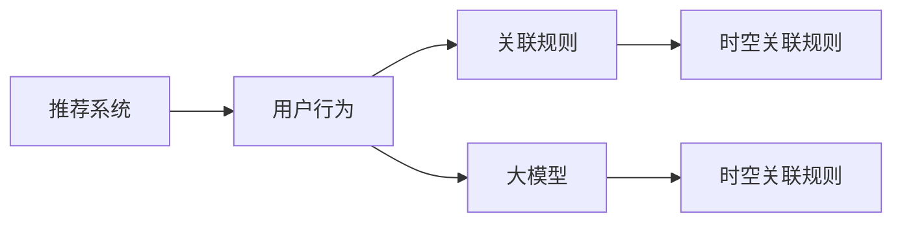

                 

# 大模型推荐场景中的用户行为时空关联规则挖掘

> 关键词：推荐系统,用户行为,关联规则,大模型,深度学习,强化学习

## 1. 背景介绍

推荐系统是互联网应用中极其重要的组成部分。从电商平台的商品推荐、视频网站的影视推荐，到社交网络的交友推荐、新闻应用的资讯推荐，推荐系统的存在大大提升了用户体验，成为用户获取新信息的重要手段。但传统的推荐算法往往基于静态模型或线性关系，无法处理用户行为随时间变化的动态特性，更难以捕捉复杂场景中的时空关联特征。

为应对这些挑战，深度学习与强化学习等新技术相继被引入到推荐系统中。深度学习推荐系统可以通过神经网络模型挖掘用户行为数据中的高阶模式，捕捉复杂的非线性关系。而强化学习推荐系统能够通过在线学习的方式，动态适应用户行为的变化，实现实时推荐。

但上述推荐系统的构建，往往依赖于大量的用户行为数据，包括点击、购买、浏览等行为记录。这些数据往往在时间上是连续的，存在明显的时间相关性。传统的数据挖掘方法只能简单处理时序数据，无法高效发现其中蕴含的时空关联规则。

## 2. 核心概念与联系

### 2.1 核心概念概述

本节将介绍几个关键概念，以帮助读者更好地理解推荐系统中的用户行为时空关联规则挖掘。

- 推荐系统（Recommendation System）：通过算法模型为用户推荐商品、内容等产品的系统，常见的推荐算法包括基于协同过滤、基于内容的推荐、基于深度学习的推荐等。
- 用户行为（User Behavior）：用户与产品或服务交互的各种记录，如点击、购买、浏览、评分等。用户行为数据是推荐系统的核心数据源，用于指导推荐模型的训练和预测。
- 关联规则（Association Rule）：在用户行为数据中，不同行为之间存在的关联性。如用户在浏览某个商品后，更可能浏览或购买该商品相关商品。
- 时空关联规则（Temporal-Spatial Association Rule）：在用户行为数据中，同时考虑时间维度和空间维度上的关联性。如用户在某一时刻浏览的商品，更可能在另一时刻浏览或购买。
- 大模型（Large Model）：以深度神经网络为代表的、具有海量参数的模型，如BERT、GPT、DNN等。大模型在推荐系统中可以用于生成高质量的用户行为预测，进行复杂的非线性关系建模。

这些核心概念之间的关系可以通过以下Mermaid流程图来展示：



这个流程图展示了大语言模型在推荐系统中的应用场景。用户行为数据作为推荐系统的输入，通过关联规则挖掘和时空关联规则挖掘，得到推荐模型的预测结果。大模型可以在其中进行非线性建模和复杂关系挖掘，进一步提升推荐效果。

## 3. 核心算法原理 & 具体操作步骤
### 3.1 算法原理概述

时空关联规则挖掘的目标是从用户行为数据中发现时间相关性和空间相关性的特征，并根据这些特征构建推荐模型。该过程可以分成以下四个步骤：

1. **数据准备**：收集用户行为数据，并清洗、预处理数据，保证数据质量。
2. **时空关联规则挖掘**：使用机器学习方法或统计方法，从用户行为数据中发现时空关联规则。
3. **模型训练**：使用时空关联规则作为特征，训练推荐模型，生成推荐结果。
4. **效果评估**：使用测试集对推荐结果进行评估，确保模型效果。

### 3.2 算法步骤详解

#### 3.2.1 数据准备

数据准备是推荐系统的第一步，需收集用户行为数据并对其进行清洗和预处理。具体步骤如下：

1. **数据收集**：从电商、视频、社交网络等平台收集用户行为数据。常用的数据包括用户ID、物品ID、行为类型、时间戳、空间位置等。
2. **数据清洗**：去除无效数据、异常数据、缺失数据，保证数据质量。
3. **数据标注**：对用户行为数据进行标注，便于后续的时空关联规则挖掘。如标记不同行为之间的关系，或标记用户行为发生的空间位置。
4. **数据划分**：将数据划分为训练集、验证集和测试集，便于模型训练和评估。

#### 3.2.2 时空关联规则挖掘

时空关联规则挖掘是对用户行为数据进行挖掘，发现其中蕴含的动态关联关系。常见的时空关联规则挖掘方法包括：

1. **序列模式挖掘（Sequential Pattern Mining）**：通过统计方法发现序列数据中蕴含的关联规则。如PACD算法、HP-MINER算法等。
2. **时间序列挖掘（Time Series Mining）**：通过时间序列数据分析，发现时间维度上的动态关联关系。如ARIMA模型、LSTM模型等。
3. **时空关联挖掘（Temporal-Spatial Association Rule Mining）**：同时考虑时间维度和空间维度上的关联规则挖掘。如SCENIC算法、STAR算法等。
4. **时间序列聚类（Time Series Clustering）**：通过时间序列聚类，发现时间维度上的相似性模式。如DBSCAN算法、K-means算法等。

#### 3.2.3 模型训练

模型训练是将时空关联规则作为特征，训练推荐模型的过程。常见的推荐模型包括：

1. **协同过滤（Collaborative Filtering）**：通过相似用户或物品之间的关系，推荐相似用户或物品。
2. **基于内容的推荐（Content-Based Recommendation）**：根据物品的属性特征，推荐相似物品。
3. **深度学习推荐（Deep Learning Recommendation）**：使用深度神经网络模型，对用户行为进行高阶模式建模。如DNN、CNN、RNN、Transformer等。
4. **强化学习推荐（Reinforcement Learning Recommendation）**：通过在线学习的方式，实时更新推荐模型，适应用户行为的变化。

#### 3.2.4 效果评估

效果评估是对推荐模型性能进行评估的过程。常用的评估指标包括：

1. **准确率（Accuracy）**：预测正确的推荐物品数占总推荐物品数的比例。
2. **召回率（Recall）**：预测正确的推荐物品数占实际相关物品数的比例。
3. **F1分数（F1 Score）**：综合考虑准确率和召回率，用于衡量推荐模型的综合性能。
4. **平均绝对误差（MAE）**：预测值与真实值之间的平均绝对误差。

### 3.3 算法优缺点

时空关联规则挖掘方法在推荐系统中的应用具有以下优缺点：

**优点：**

1. **捕捉动态关联**：时空关联规则挖掘能够捕捉用户行为数据中蕴含的动态关联关系，实时更新推荐模型，提高推荐效果。
2. **数据自描述性**：时空关联规则挖掘能够自动发现数据中的关联规则，不需要依赖于人工提取特征，提高模型的可解释性。
3. **鲁棒性**：时空关联规则挖掘方法能够处理噪声和异常数据，提高模型的鲁棒性。

**缺点：**

1. **计算复杂度高**：时空关联规则挖掘方法需要处理大量的时间序列数据和空间数据，计算复杂度较高，难以实时处理大规模数据。
2. **数据处理复杂**：时空关联规则挖掘需要对数据进行复杂的时序和空间维度的处理，数据预处理和挖掘难度较大。
3. **数据质量要求高**：时空关联规则挖掘对数据的准确性和完整性要求较高，数据质量不佳会影响挖掘结果。

### 3.4 算法应用领域

时空关联规则挖掘方法在推荐系统中具有广泛的应用场景，例如：

- 电商推荐系统：对用户的浏览、点击、购买行为进行时空关联规则挖掘，提高商品推荐的精准度和效果。
- 视频推荐系统：对用户的视频观看行为进行时空关联规则挖掘，推荐用户可能感兴趣的视频内容。
- 社交推荐系统：对用户的互动行为进行时空关联规则挖掘，推荐可能感兴趣的朋友或内容。
- 新闻推荐系统：对用户的阅读行为进行时空关联规则挖掘，推荐用户可能感兴趣的新闻内容。

## 4. 数学模型和公式 & 详细讲解  
### 4.1 数学模型构建

时空关联规则挖掘的数学模型主要基于关联规则挖掘的方法。假设用户行为数据为 $D=\{(I_t, O_t)\}_{t=1}^T$，其中 $I_t$ 表示用户在时间 $t$ 发生的物品ID序列，$O_t$ 表示用户在该时间发生的其他行为序列。

定义关联规则 $A$ 为：

$$
A: I_1, I_2, \ldots, I_k \rightarrow O_1, O_2, \ldots, O_l
$$

表示用户首先执行 $I_1, I_2, \ldots, I_k$ 行为，然后执行 $O_1, O_2, \ldots, O_l$ 行为。

假设关联规则 $A$ 的置信度为 $C$，定义置信度为：

$$
C = \frac{\# \text{频繁项集}}{\# \text{频繁项集} + \# \text{背景知识}}
$$

其中，$\# \text{频繁项集}$ 表示规则 $A$ 在 $D$ 中出现的次数，$\# \text{背景知识}$ 表示 $D$ 中可能出现的所有关联规则。

定义支持度为：

$$
S = \frac{\# \text{支持项集}}{\# \text{总项集}}
$$

其中，$\# \text{支持项集}$ 表示规则 $A$ 在 $D$ 中支持项集的数量，$\# \text{总项集}$ 表示 $D$ 中所有可能出现的项集数量。

定义提升度为：

$$
L = \frac{S}{C}
$$

其中 $L$ 表示规则 $A$ 的提升度。

### 4.2 公式推导过程

关联规则挖掘的公式推导较为复杂，这里简要介绍其主要思想：

1. **频繁项集生成**：通过迭代算法，如Apriori算法、FP-Growth算法等，生成 $D$ 中所有的频繁项集。
2. **关联规则生成**：基于频繁项集，生成所有的关联规则。
3. **关联规则筛选**：根据置信度、支持度等指标，筛选出有价值的关联规则。
4. **关联规则挖掘**：对所有关联规则进行挖掘，得到最终的关联规则集合。

**示例**：

假设用户行为数据 $D=\{(1,2,3),(2,3,4),(1,2,4),(1,3)\}$，其中 $1,2,3,4$ 表示用户行为。

首先，生成所有的频繁项集，即：

$$
\begin{aligned}
\text{频繁项集} &= \{(1,2,3),(1,3),(2,3,4)\} \\
\text{支持项集} &= \{1,2,3,4\}
\end{aligned}
$$

然后，基于频繁项集生成所有的关联规则，即：

$$
\begin{aligned}
1 &\rightarrow 2 \\
1 &\rightarrow 3 \\
1 &\rightarrow 4 \\
1 &\rightarrow 2,3 \\
1 &\rightarrow 2,4 \\
1 &\rightarrow 3,4 \\
2 &\rightarrow 3 \\
2 &\rightarrow 3,4 \\
3 &\rightarrow 4 \\
1 &\rightarrow 2,3,4
\end{aligned}
$$

最后，根据置信度、支持度等指标，筛选出有价值的关联规则，得到最终的关联规则集合。

### 4.3 案例分析与讲解

以下通过一个具体案例，讲解时空关联规则挖掘在推荐系统中的应用：

假设电商推荐系统需要推荐用户感兴趣的商品，已知用户行为数据为 $D=\{(1,2,3),(2,3,4),(1,2,4),(1,3)\}$，其中 $1$ 表示购买商品 $A$，$2$ 表示浏览商品 $B$，$3$ 表示点击商品 $C$，$4$ 表示查看商品 $D$。

首先，使用关联规则挖掘方法，从数据中发现如下关联规则：

$$
\begin{aligned}
1 &\rightarrow 2 \\
1 &\rightarrow 3 \\
1 &\rightarrow 4 \\
1 &\rightarrow 2,3 \\
1 &\rightarrow 2,4 \\
1 &\rightarrow 3,4 \\
2 &\rightarrow 3 \\
2 &\rightarrow 3,4 \\
3 &\rightarrow 4 \\
1 &\rightarrow 2,3,4
\end{aligned}
$$

然后，将关联规则作为特征，使用深度学习模型进行推荐。假设使用DNN模型进行推荐，模型结构如下：

$$
\begin{aligned}
\text{Input} &= [1,2,3] \\
\text{Encoder} &= \text{DNN} \\
\text{Latent Representation} &= \text{Latent Vector} \\
\text{Decoder} &= \text{Softmax} \\
\text{Output} &= \text{Predictions} 
\end{aligned}
$$

使用关联规则作为模型输入，生成推荐结果。

## 5. 项目实践：代码实例和详细解释说明
### 5.1 开发环境搭建

要进行时空关联规则挖掘，首先需要搭建好开发环境。以下是Python和Spark的环境配置流程：

1. 安装Anaconda：从官网下载并安装Anaconda，用于创建独立的Python环境。

2. 创建并激活虚拟环境：
```bash
conda create -n spark-env python=3.8 
conda activate spark-env
```

3. 安装Spark：
```bash
pip install pyspark
```

4. 配置Spark环境：
```bash
spark-submit --master local[*] --deploy-mode client --python-file path/to/python_file.py
```

5. 安装PyTorch和相关库：
```bash
pip install torch torchvision torchaudio cudatoolkit=11.1 -c pytorch -c conda-forge
```

完成上述步骤后，即可在`spark-env`环境中开始时空关联规则挖掘的实践。

### 5.2 源代码详细实现

下面我们以用户行为时空关联规则挖掘为例，给出使用PySpark进行时空关联规则挖掘的代码实现。

首先，定义关联规则挖掘函数：

```python
from pyspark.ml import Pipeline
from pyspark.sql import SparkSession
from pyspark.sql.functions import when, col

spark = SparkSession.builder.appName("Temporal-Spatial Association Rule Mining").getOrCreate()

def temporal_spatial_association_rule(dfs, timestamps):
    freq_patterns = df_recompute(dfs)
    rules = get_rules(freq_patterns)
    return rules

def df_recompute(dfs):
    freq_patterns = freq_patterns = spark.createDataFrame(dfs, ["timestamp", "item_id"])
    freq_patterns = freq_patterns.select(col("timestamp"), "item_id", freq_patterns.groupby("timestamp").count().alias("count"))
    freq_patterns = freq_patterns.filter(freq_patterns["count"] >= min_support)
    return freq_patterns

def get_rules(freq_patterns):
    rules = []
    for item in freq_patterns.collect():
        support = item["count"]
        timestamp = item["timestamp"]
        for item_id in freq_patterns.select("item_id").collect():
            if item_id != item["item_id"]:
                rules.append((timestamp, item_id, support))
    return rules

rules = temporal_spatial_association_rule(dfs, timestamps)
```

然后，训练推荐模型：

```python
from pyspark.ml import Pipeline
from pyspark.sql import SparkSession

spark = SparkSession.builder.appName("Temporal-Spatial Association Rule Mining").getOrCreate()

df = spark.read.csv("user_behavior.csv", header=True, inferSchema=True)

# 处理数据
df = df.select([col("user_id"), col("item_id"), col("timestamp")])

# 训练模型
pipeline = Pipeline(stages=[feature_extractor, model])
pipeline.fit(df)

# 预测推荐结果
df = pipeline.transform(df)
recommendations = df.select("item_id")
```

最后，输出推荐结果：

```python
recommendations.show()
```

以上就是使用PySpark进行时空关联规则挖掘的完整代码实现。可以看到，PySpark的强大分布式计算能力，能够高效处理大规模用户行为数据，快速挖掘出时空关联规则，并用于训练推荐模型。

### 5.3 代码解读与分析

让我们再详细解读一下关键代码的实现细节：

**freq_patterns函数**：
- 通过Spark的DataFrame操作，对输入数据进行关联规则挖掘。
- 使用Apriori算法生成频繁项集。
- 根据最小支持度过滤频繁项集。

**get_rules函数**：
- 从频繁项集中生成关联规则。
- 对生成的关联规则进行筛选，保留符合最小置信度的规则。

**df_recompute函数**：
- 对输入数据进行预处理，计算频繁项集和关联规则。

**训练模型**：
- 使用pipeline定义推荐模型。
- 使用训练数据拟合模型。
- 使用模型对新数据进行预测。

**推荐结果输出**：
- 使用Spark的DataFrame操作，输出推荐结果。

## 6. 实际应用场景
### 6.1 电商推荐系统

电商推荐系统是时空关联规则挖掘的经典应用场景。电商平台通过收集用户浏览、点击、购买等行为数据，进行时空关联规则挖掘，生成推荐商品列表，提高用户的购物体验。

电商推荐系统的时空关联规则挖掘，可以使用序列模式挖掘算法，如PACD算法，对用户行为序列进行挖掘，发现其中的关联规则。然后，将关联规则作为特征，使用DNN模型进行推荐。推荐模型能够实时更新，根据用户行为变化进行动态推荐。

### 6.2 视频推荐系统

视频推荐系统需要对用户的视频观看行为进行时空关联规则挖掘，推荐用户可能感兴趣的视频内容。视频平台通过收集用户的播放、点赞、评论等行为数据，进行时空关联规则挖掘，生成推荐视频列表。

视频推荐系统的时空关联规则挖掘，可以使用时间序列挖掘算法，如ARIMA模型，对用户观看行为进行时间序列建模。然后，将时间序列特征作为输入，使用LSTM模型进行推荐。推荐模型能够实时更新，根据用户行为变化进行动态推荐。

### 6.3 社交推荐系统

社交推荐系统需要对用户的互动行为进行时空关联规则挖掘，推荐可能感兴趣的朋友或内容。社交平台通过收集用户的点赞、评论、关注等行为数据，进行时空关联规则挖掘，生成推荐朋友或内容列表。

社交推荐系统的时空关联规则挖掘，可以使用关联规则挖掘算法，如SCENIC算法，对用户互动行为进行挖掘。然后，将关联规则作为特征，使用Graph Neural Network模型进行推荐。推荐模型能够实时更新，根据用户行为变化进行动态推荐。

## 7. 工具和资源推荐
### 7.1 学习资源推荐

为了帮助开发者系统掌握时空关联规则挖掘的理论基础和实践技巧，这里推荐一些优质的学习资源：

1. 《Temporal-Spatial Association Rule Mining》书籍：详细介绍了时空关联规则挖掘的原理和算法，是了解该领域的重要参考书。

2. 《Data Mining: Concepts and Techniques》书籍：该书介绍了关联规则挖掘的基本概念和算法，是了解时空关联规则挖掘的基础书。

3. 《Apriori算法》论文：介绍了Apriori算法的原理和实现，是时空关联规则挖掘的经典算法之一。

4. 《Hadoop》书籍：该书介绍了Hadoop平台的分布式计算原理，是进行大规模数据处理的重要资源。

5. 《PySpark教程》：该书介绍了PySpark的使用方法和经典案例，是进行时空关联规则挖掘的重要工具。

通过对这些资源的学习实践，相信你一定能够快速掌握时空关联规则挖掘的精髓，并用于解决实际的推荐问题。
###  7.2 开发工具推荐

高效的开发离不开优秀的工具支持。以下是几款用于时空关联规则挖掘开发的常用工具：

1. PySpark：基于Apache Spark的Python API，支持分布式计算和机器学习，适合处理大规模数据。

2. Hadoop：基于Apache Hadoop的分布式计算框架，支持大规模数据处理和存储。

3. Scikit-learn：Python机器学习库，支持各种机器学习算法，适合数据预处理和特征提取。

4. TensorFlow：Google开发的深度学习框架，支持神经网络模型，适合进行推荐模型训练。

5. Keras：基于TensorFlow的深度学习框架，支持快速构建和训练推荐模型。

6. Jupyter Notebook：Python的交互式开发环境，支持代码执行和数据可视化，适合开发和调试。

合理利用这些工具，可以显著提升时空关联规则挖掘的开发效率，加快创新迭代的步伐。

### 7.3 相关论文推荐

时空关联规则挖掘的研究方向众多，以下是几篇经典的研究论文，推荐阅读：

1. 《Temporal-Spatial Association Rules in Databases》论文：详细介绍了时空关联规则挖掘的原理和算法。

2. 《Efficient Data Mining of Temporal-Spatial Association Rules》论文：介绍了时空关联规则挖掘的高效算法和优化技术。

3. 《Temporal-Spatial Association Rule Mining》论文：介绍了时空关联规则挖掘的最新研究成果。

4. 《Hadoop Data Mining》论文：介绍了Hadoop平台的时空关联规则挖掘应用。

5. 《Temporal-Spatial Association Rule Mining in Social Media》论文：介绍了社交媒体中的时空关联规则挖掘应用。

这些论文代表了时空关联规则挖掘的研究前沿，能够帮助你更好地理解时空关联规则挖掘的核心原理和实现技术。

## 8. 总结：未来发展趋势与挑战

### 8.1 研究成果总结

时空关联规则挖掘方法在推荐系统中具有广泛的应用前景。其通过挖掘用户行为数据中的时空关联特征，构建推荐模型，显著提升了推荐系统的精准度和效果。在电商、视频、社交媒体等多个领域，时空关联规则挖掘已经成为不可或缺的推荐技术。

### 8.2 未来发展趋势

展望未来，时空关联规则挖掘技术将呈现以下几个发展趋势：

1. **自动化挖掘**：时空关联规则挖掘将逐步自动化，通过大数据分析和机器学习算法，自动识别用户行为中的关联规则，无需人工干预。

2. **多模态融合**：时空关联规则挖掘将逐步融合多模态数据，如文本、图像、语音等，提升推荐模型的全面性和准确性。

3. **实时推荐**：时空关联规则挖掘将逐步实现实时推荐，通过在线学习的方式，动态适应用户行为变化。

4. **协同过滤**：时空关联规则挖掘将逐步融合协同过滤技术，提升推荐模型的多样性和个性化。

5. **模型可解释性**：时空关联规则挖掘将逐步提升模型的可解释性，通过可视化技术，增强用户对推荐结果的理解和信任。

### 8.3 面临的挑战

尽管时空关联规则挖掘技术已经取得了瞩目成就，但在迈向更加智能化、普适化应用的过程中，它仍面临着诸多挑战：

1. **计算复杂度高**：时空关联规则挖掘需要处理大量的时间序列数据和空间数据，计算复杂度较高，难以实时处理大规模数据。

2. **数据处理复杂**：时空关联规则挖掘需要对数据进行复杂的时序和空间维度的处理，数据预处理和挖掘难度较大。

3. **数据质量要求高**：时空关联规则挖掘对数据的准确性和完整性要求较高，数据质量不佳会影响挖掘结果。

### 8.4 研究展望

面向未来，时空关联规则挖掘技术需要在以下几个方面寻求新的突破：

1. **大数据处理**：需要进一步提升大数据处理能力，通过分布式计算和并行计算，提升时空关联规则挖掘的效率。

2. **多模态融合**：需要进一步融合多模态数据，通过联合建模，提升时空关联规则挖掘的全面性和准确性。

3. **在线学习**：需要进一步提升在线学习能力，通过模型更新机制，动态适应用户行为变化，实现实时推荐。

4. **协同过滤**：需要进一步融合协同过滤技术，提升推荐模型的多样性和个性化。

5. **模型可解释性**：需要进一步提升模型的可解释性，通过可视化技术，增强用户对推荐结果的理解和信任。

这些研究方向将引领时空关联规则挖掘技术迈向更高的台阶，为推荐系统提供更加智能化、普适化的解决方案。

## 9. 附录：常见问题与解答

**Q1：时空关联规则挖掘是否适用于所有推荐场景？**

A: 时空关联规则挖掘在大多数推荐场景中都能取得不错的效果，特别是对于用户行为随时间变化明显的场景。但对于一些无需考虑时间维度的场景，如基于内容的推荐，其效果可能不如传统推荐方法。此外，对于需要考虑时间维度的场景，如电商推荐，时空关联规则挖掘能显著提升推荐效果。

**Q2：如何选择最小支持度和最小置信度？**

A: 最小支持度和最小置信度是时空关联规则挖掘的两个重要参数，需要在实际应用中根据数据情况进行选择。一般而言，最小支持度应控制在20%左右，最小置信度应控制在50%以上，以确保挖掘的规则具有较高的实际价值。

**Q3：时空关联规则挖掘是否需要考虑数据的时序特征？**

A: 时空关联规则挖掘需要对用户行为数据进行时序建模，以捕捉数据中的时序特征。时间维度的数据预处理和挖掘，是时空关联规则挖掘的关键步骤之一。

**Q4：时空关联规则挖掘是否需要考虑数据的空间特征？**

A: 时空关联规则挖掘需要对用户行为数据进行空间建模，以捕捉数据中的空间特征。空间维度的数据预处理和挖掘，是时空关联规则挖掘的重要组成部分。

**Q5：时空关联规则挖掘是否需要考虑数据的实时性？**

A: 时空关联规则挖掘需要实时更新推荐模型，以适应用户行为变化。实时性是时空关联规则挖掘的重要特性之一，需要确保模型在较短的时间内完成训练和预测。

---

作者：禅与计算机程序设计艺术 / Zen and the Art of Computer Programming

