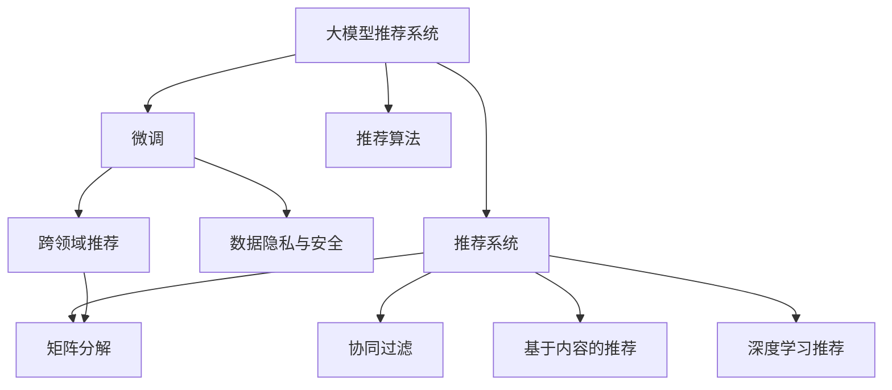

                 

# 大模型推荐系统的商业化落地挑战

## 1. 背景介绍

### 1.1 问题由来

随着人工智能和大数据技术的快速发展，推荐系统已成为互联网公司和电商平台不可或缺的核心业务系统之一。传统的推荐算法如协同过滤、基于内容的推荐、深度学习推荐等，均已发展至成熟阶段。然而，这些推荐算法存在一些固有的局限性，如冷启动问题、长尾物品推荐、跨领域推荐等，难以满足互联网应用日益增长的复杂性需求。

近年来，随着大模型预训练技术和大规模无标签数据的应用，大模型推荐系统以其广泛的知识图谱、丰富的语言理解和语义推理能力，逐渐受到各大企业的青睐。相较于传统的推荐算法，大模型推荐系统具备更强的泛化能力、跨领域迁移能力，能够更精准地为用户推荐其感兴趣的商品或内容。

### 1.2 问题核心关键点

大模型推荐系统虽然在大规模无标签数据上进行预训练，但依旧需要用户行为数据进行微调。因此，如何高效、低成本地将大模型应用于推荐系统，提升用户体验和平台收益，成为当前亟需解决的重要问题。

具体挑战包括：
1. 数据隐私和安全：如何保护用户隐私，防止数据泄露和滥用。
2. 微调成本：如何降低微调过程中的计算和存储成本。
3. 模型部署：如何将大模型快速部署到生产环境，提升系统性能。
4. 用户行为建模：如何有效地建立用户画像，更好地理解用户需求。
5. 跨领域推荐：如何实现跨领域物品推荐，扩大推荐范围。
6. 系统稳定性：如何保证系统稳定性，避免大模型带来的计算资源消耗过大。

### 1.3 问题研究意义

大模型推荐系统的商业化落地，对于提升电商、社交、新闻等互联网平台的用户体验和运营效率具有重要意义。通过大模型推荐系统，企业可以实现更精准的商品/内容推荐，提高用户满意度，增加用户粘性，从而提升平台收益。

此外，大模型推荐系统还可以应用于个性化广告推荐、舆情分析、内容生成等场景，进一步拓展其商业价值。因此，研究如何高效商业化落地大模型推荐系统，对于促进互联网经济的发展，具有重要价值。

## 2. 核心概念与联系

### 2.1 核心概念概述

为更好地理解大模型推荐系统的落地挑战，本节将介绍几个密切相关的核心概念：

- 大模型推荐系统：基于预训练语言模型等大模型进行推荐的一种推荐技术，如BERT、GPT-3、CTR预训练模型等。
- 推荐系统：使用特定算法和模型，为用户推荐其感兴趣的商品、内容、服务等的技术。
- 微调：在大模型的基础上，利用下游任务的数据进行有监督学习，优化模型参数，提升其在新任务上的表现。
- 数据隐私与安全：指在推荐系统设计和数据处理中，保护用户隐私和数据安全。
- 跨领域推荐：指推荐系统能够跨越不同领域，实现跨领域物品推荐，如从电商物品推荐到新闻内容推荐。
- 推荐算法：包括协同过滤、基于内容的推荐、矩阵分解、深度学习推荐等。

这些核心概念之间的逻辑关系可以通过以下Mermaid流程图来展示：



这个流程图展示了从大模型推荐系统到推荐系统的核心概念及其关系：

1. 大模型推荐系统基于预训练语言模型等大模型进行推荐。
2. 微调是大模型推荐系统优化模型性能的关键步骤。
3. 推荐系统使用特定算法和模型进行推荐。
4. 推荐算法包括协同过滤、基于内容的推荐、矩阵分解、深度学习推荐等。
5. 数据隐私与安全是推荐系统设计的关键点。
6. 跨领域推荐是大模型推荐系统的应用场景之一。

这些核心概念共同构成了大模型推荐系统的完整框架，使其在推荐任务中能够发挥强大的推荐能力。

## 3. 核心算法原理 & 具体操作步骤
### 3.1 算法原理概述

大模型推荐系统基于预训练语言模型进行推荐，其核心思想是：通过在大规模无标签数据上进行预训练，学习通用的语言表示和知识图谱，然后利用微调技术，将预训练模型适配于特定推荐任务，从而提升推荐效果。

具体而言，大模型推荐系统一般分为以下几个步骤：
1. 数据预处理：将原始数据转化为模型可处理的形式，如物品特征提取、用户画像建立等。
2. 预训练：在无标签数据上训练预训练模型，学习通用的语言表示和知识图谱。
3. 微调：在标注数据上对预训练模型进行微调，优化特定任务的表现。
4. 推荐：将微调后的模型应用于推荐任务，为用户推荐其感兴趣的商品或内容。

### 3.2 算法步骤详解

以下是大模型推荐系统从预训练到微调再到推荐的具体步骤详解：

**Step 1: 数据预处理**

- 物品特征提取：将物品信息（如商品描述、属性、评分等）转化为模型可处理的向量形式，方便模型学习物品特征。
- 用户画像建立：通过用户行为数据（如浏览历史、购买记录等），建立用户画像，刻画用户兴趣。
- 数据清洗和归一化：去除噪声和缺失值，标准化数据格式，以确保数据质量。

**Step 2: 预训练**

- 选择合适的预训练模型，如BERT、GPT-3等，进行预训练。
- 使用无标签数据集，进行自监督学习任务，如语言模型、句子相似度计算等，学习通用的语言表示和知识图谱。
- 在预训练过程中，可以使用自适应学习率、混合精度训练等技术，提升训练效率和模型效果。

**Step 3: 微调**

- 收集目标推荐任务的标注数据集，选择合适的损失函数和任务适配层。
- 根据标注数据集，使用微调技术优化预训练模型，提升特定任务的推荐效果。
- 设置合适的学习率、正则化参数、批大小等超参数，防止过拟合。
- 使用对抗样本、数据增强等技术，提升模型泛化能力和鲁棒性。

**Step 4: 推荐**

- 将微调后的模型应用于推荐任务，根据用户画像和物品特征，生成推荐结果。
- 使用排序算法（如Top-k排序）对推荐结果进行排序，保证推荐质量。
- 实时更新模型，动态调整推荐策略，适应用户需求的变化。

### 3.3 算法优缺点

大模型推荐系统相较于传统推荐算法，具有以下优点：
1. 泛化能力强：预训练模型在大规模无标签数据上进行训练，能够学习到通用的语言表示和知识图谱，适用于多种推荐任务。
2. 跨领域推荐：大模型推荐系统能够跨越不同领域，实现跨领域物品推荐，扩展推荐范围。
3. 推荐精度高：大模型推荐系统能够学习到复杂的语言和语义信息，推荐结果更加精准。
4. 适应性强：大模型推荐系统能够动态调整推荐策略，适应用户需求的变化。

同时，该方法也存在一些局限性：
1. 计算资源消耗大：预训练和微调模型需要大量计算资源，存储和计算成本较高。
2. 隐私和安全风险：大规模预训练和微调涉及大量用户数据，数据隐私和安全风险较大。
3. 数据需求高：大模型推荐系统需要大量的标注数据进行微调，数据获取难度较大。
4. 部署难度高：大模型推荐系统需要在生产环境中快速部署，系统架构复杂，部署难度较高。
5. 实时性差：由于模型参数较大，实时推荐速度较慢，难以满足实时推荐需求。

尽管存在这些局限性，但大模型推荐系统仍在大规模推荐系统中发挥着重要作用。未来相关研究的重点在于如何进一步降低计算成本、提升数据隐私和安全、优化模型部署和实时性等问题。

### 3.4 算法应用领域

大模型推荐系统已经在电商、社交、新闻等多个领域得到广泛应用，具体包括：

- 电商推荐：基于用户行为数据，为用户推荐其感兴趣的商品。
- 社交推荐：根据用户兴趣和社交关系，推荐好友、内容、活动等。
- 新闻推荐：为用户推荐其感兴趣的新闻内容，提升阅读体验。
- 广告推荐：根据用户兴趣和行为数据，推荐个性化的广告内容。
- 视频推荐：根据用户观看历史和评分，推荐其感兴趣的视频内容。

除了上述这些经典应用外，大模型推荐系统还被应用于影视推荐、音乐推荐、游戏推荐等多个场景中，为推荐系统带来了新的突破和创新。

## 4. 数学模型和公式 & 详细讲解  
### 4.1 数学模型构建

本节将使用数学语言对大模型推荐系统进行更加严格的刻画。

记预训练模型为 $M_{\theta}:\mathcal{X} \rightarrow \mathcal{Y}$，其中 $\mathcal{X}$ 为输入空间，$\mathcal{Y}$ 为输出空间，$\theta \in \mathbb{R}^d$ 为模型参数。假设推荐任务为二分类任务，即判断用户是否会对物品感兴趣，其中正样本为感兴趣，负样本为不感兴趣。

定义模型 $M_{\theta}$ 在输入 $x$ 上的输出为 $\hat{y}=M_{\theta}(x) \in [0,1]$，表示用户对物品的兴趣概率。真实标签 $y \in \{0,1\}$。则二分类交叉熵损失函数定义为：

$$
\ell(M_{\theta}(x),y) = -[y\log \hat{y} + (1-y)\log (1-\hat{y})]
$$

设标注数据集为 $D=\{(x_i,y_i)\}_{i=1}^N$，经验风险为：

$$
\mathcal{L}(\theta) = -\frac{1}{N}\sum_{i=1}^N [y_i\log M_{\theta}(x_i)+(1-y_i)\log(1-M_{\theta}(x_i))]
$$

模型微调的优化目标是最小化经验风险，即找到最优参数：

$$
\theta^* = \mathop{\arg\min}_{\theta} \mathcal{L}(\theta)
$$

在实践中，我们通常使用基于梯度的优化算法（如Adam、SGD等）来近似求解上述最优化问题。设 $\eta$ 为学习率，$\lambda$ 为正则化系数，则参数的更新公式为：

$$
\theta \leftarrow \theta - \eta \nabla_{\theta}\mathcal{L}(\theta) - \eta\lambda\theta
$$

其中 $\nabla_{\theta}\mathcal{L}(\theta)$ 为损失函数对参数 $\theta$ 的梯度，可通过反向传播算法高效计算。

### 4.2 公式推导过程

以下我们以二分类任务为例，推导交叉熵损失函数及其梯度的计算公式。

假设模型 $M_{\theta}$ 在输入 $x$ 上的输出为 $\hat{y}=M_{\theta}(x) \in [0,1]$，表示用户对物品的兴趣概率。真实标签 $y \in \{0,1\}$。则二分类交叉熵损失函数定义为：

$$
\ell(M_{\theta}(x),y) = -[y\log \hat{y} + (1-y)\log (1-\hat{y})]
$$

将其代入经验风险公式，得：

$$
\mathcal{L}(\theta) = -\frac{1}{N}\sum_{i=1}^N [y_i\log M_{\theta}(x_i)+(1-y_i)\log(1-M_{\theta}(x_i))]
$$

根据链式法则，损失函数对参数 $\theta_k$ 的梯度为：

$$
\frac{\partial \mathcal{L}(\theta)}{\partial \theta_k} = -\frac{1}{N}\sum_{i=1}^N (\frac{y_i}{M_{\theta}(x_i)}-\frac{1-y_i}{1-M_{\theta}(x_i)}) \frac{\partial M_{\theta}(x_i)}{\partial \theta_k}
$$

其中 $\frac{\partial M_{\theta}(x_i)}{\partial \theta_k}$ 可进一步递归展开，利用自动微分技术完成计算。

在得到损失函数的梯度后，即可带入参数更新公式，完成模型的迭代优化。重复上述过程直至收敛，最终得到适应推荐任务的最优模型参数 $\theta^*$。

## 5. 项目实践：代码实例和详细解释说明
### 5.1 开发环境搭建

在进行推荐系统开发前，我们需要准备好开发环境。以下是使用Python进行PyTorch开发的环境配置流程：

1. 安装Anaconda：从官网下载并安装Anaconda，用于创建独立的Python环境。

2. 创建并激活虚拟环境：
```bash
conda create -n pytorch-env python=3.8 
conda activate pytorch-env
```

3. 安装PyTorch：根据CUDA版本，从官网获取对应的安装命令。例如：
```bash
conda install pytorch torchvision torchaudio cudatoolkit=11.1 -c pytorch -c conda-forge
```

4. 安装Transformers库：
```bash
pip install transformers
```

5. 安装各类工具包：
```bash
pip install numpy pandas scikit-learn matplotlib tqdm jupyter notebook ipython
```

完成上述步骤后，即可在`pytorch-env`环境中开始推荐系统开发。

### 5.2 源代码详细实现

这里我们以电商平台推荐系统为例，给出使用Transformers库对BERT模型进行推荐系统微调的PyTorch代码实现。

首先，定义推荐任务的数据处理函数：

```python
from transformers import BertTokenizer
from torch.utils.data import Dataset
import torch

class RecommendationDataset(Dataset):
    def __init__(self, features, labels, tokenizer, max_len=128):
        self.features = features
        self.labels = labels
        self.tokenizer = tokenizer
        self.max_len = max_len
        
    def __len__(self):
        return len(self.features)
    
    def __getitem__(self, item):
        feature = self.features[item]
        label = self.labels[item]
        
        encoding = self.tokenizer(feature, return_tensors='pt', max_length=self.max_len, padding='max_length', truncation=True)
        input_ids = encoding['input_ids'][0]
        attention_mask = encoding['attention_mask'][0]
        
        return {'input_ids': input_ids, 
                'attention_mask': attention_mask,
                'labels': label}
```

然后，定义模型和优化器：

```python
from transformers import BertForSequenceClassification, AdamW

model = BertForSequenceClassification.from_pretrained('bert-base-cased', num_labels=2)

optimizer = AdamW(model.parameters(), lr=2e-5)
```

接着，定义训练和评估函数：

```python
from torch.utils.data import DataLoader
from tqdm import tqdm
from sklearn.metrics import accuracy_score

device = torch.device('cuda') if torch.cuda.is_available() else torch.device('cpu')
model.to(device)

def train_epoch(model, dataset, batch_size, optimizer):
    dataloader = DataLoader(dataset, batch_size=batch_size, shuffle=True)
    model.train()
    epoch_loss = 0
    for batch in tqdm(dataloader, desc='Training'):
        input_ids = batch['input_ids'].to(device)
        attention_mask = batch['attention_mask'].to(device)
        labels = batch['labels'].to(device)
        model.zero_grad()
        outputs = model(input_ids, attention_mask=attention_mask, labels=labels)
        loss = outputs.loss
        epoch_loss += loss.item()
        loss.backward()
        optimizer.step()
    return epoch_loss / len(dataloader)

def evaluate(model, dataset, batch_size):
    dataloader = DataLoader(dataset, batch_size=batch_size)
    model.eval()
    preds, labels = [], []
    with torch.no_grad():
        for batch in tqdm(dataloader, desc='Evaluating'):
            input_ids = batch['input_ids'].to(device)
            attention_mask = batch['attention_mask'].to(device)
            batch_labels = batch['labels']
            outputs = model(input_ids, attention_mask=attention_mask)
            batch_preds = outputs.logits.argmax(dim=2).to('cpu').tolist()
            batch_labels = batch_labels.to('cpu').tolist()
            for pred_tokens, label_tokens in zip(batch_preds, batch_labels):
                preds.append(pred_tokens)
                labels.append(label_tokens)
                
    print(accuracy_score(labels, preds))
```

最后，启动训练流程并在测试集上评估：

```python
epochs = 5
batch_size = 16

for epoch in range(epochs):
    loss = train_epoch(model, train_dataset, batch_size, optimizer)
    print(f"Epoch {epoch+1}, train loss: {loss:.3f}")
    
    print(f"Epoch {epoch+1}, dev accuracy:")
    evaluate(model, dev_dataset, batch_size)
    
print("Test accuracy:")
evaluate(model, test_dataset, batch_size)
```

以上就是使用PyTorch对BERT进行电商平台推荐系统微调的完整代码实现。可以看到，得益于Transformers库的强大封装，我们可以用相对简洁的代码完成BERT模型的加载和微调。

### 5.3 代码解读与分析

让我们再详细解读一下关键代码的实现细节：

**RecommendationDataset类**：
- `__init__`方法：初始化特征、标签、分词器等关键组件。
- `__len__`方法：返回数据集的样本数量。
- `__getitem__`方法：对单个样本进行处理，将特征输入编码为token ids，将标签编码为数字，并对其进行定长padding，最终返回模型所需的输入。

**推荐系统目标**：
- 在二分类任务中，目标为判断用户是否会对物品感兴趣。

**训练和评估函数**：
- 使用PyTorch的DataLoader对数据集进行批次化加载，供模型训练和推理使用。
- 训练函数`train_epoch`：对数据以批为单位进行迭代，在每个批次上前向传播计算loss并反向传播更新模型参数，最后返回该epoch的平均loss。
- 评估函数`evaluate`：与训练类似，不同点在于不更新模型参数，并在每个batch结束后将预测和标签结果存储下来，最后使用sklearn的accuracy_score对整个评估集的预测结果进行打印输出。

**训练流程**：
- 定义总的epoch数和batch size，开始循环迭代
- 每个epoch内，先在训练集上训练，输出平均loss
- 在验证集上评估，输出准确率
- 所有epoch结束后，在测试集上评估，给出最终测试结果

可以看到，PyTorch配合Transformers库使得BERT微调的代码实现变得简洁高效。开发者可以将更多精力放在数据处理、模型改进等高层逻辑上，而不必过多关注底层的实现细节。

当然，工业级的系统实现还需考虑更多因素，如模型的保存和部署、超参数的自动搜索、更灵活的任务适配层等。但核心的微调范式基本与此类似。

## 6. 实际应用场景
### 6.1 智能推荐系统

大模型推荐系统已经广泛应用于电商平台、社交平台、视频平台等多个场景。通过大模型推荐系统，平台能够更加精准地为用户推荐其感兴趣的商品、内容、服务等，提升用户满意度和平台收益。

在技术实现上，可以收集用户行为数据，如浏览历史、购买记录、评分等，构建推荐模型，进行用户画像刻画和物品特征提取。然后，使用预训练模型进行微调，学习物品的语义表示和用户兴趣的通用表示，最后生成推荐结果。

### 6.2 广告推荐系统

广告推荐系统是大模型推荐系统的一个重要应用场景。通过分析用户行为数据，平台可以为用户推荐其可能感兴趣的广告内容，提升广告投放效果和用户点击率。

在广告推荐系统中，通常需要收集用户的搜索历史、浏览记录、点击行为等，构建推荐模型，进行用户画像刻画和物品特征提取。然后，使用预训练模型进行微调，学习广告内容的语义表示和用户兴趣的通用表示，最后生成推荐结果。

### 6.3 跨领域推荐系统

大模型推荐系统具有很强的跨领域推荐能力。例如，电商平台的商品推荐可以与社交平台的内容推荐结合，为用户推荐其可能感兴趣的商品或内容。

在跨领域推荐中，需要收集不同领域的用户行为数据和物品特征数据，构建推荐模型，进行用户画像刻画和物品特征提取。然后，使用预训练模型进行微调，学习不同领域的语义表示和用户兴趣的通用表示，最后生成推荐结果。

### 6.4 未来应用展望

随着大模型推荐技术的不断发展，其应用场景将进一步拓展，带来更多的商业价值。

在智慧零售领域，大模型推荐系统可以帮助商家精准推荐商品，提升销售业绩。在智慧金融领域，大模型推荐系统可以为用户推荐个性化投资产品，提升用户满意度。在智慧医疗领域，大模型推荐系统可以为用户推荐个性化健康建议，提升用户体验。

此外，大模型推荐系统还可以应用于安全监控、舆情分析、智能客服等多个领域，进一步拓展其商业价值。相信随着预训练语言模型和大模型推荐技术的不断演进，大模型推荐系统将带来更加广泛的应用场景和商业价值，为各行各业带来新的发展机遇。

## 7. 工具和资源推荐
### 7.1 学习资源推荐

为了帮助开发者系统掌握大模型推荐系统的理论和实践，这里推荐一些优质的学习资源：

1. 《深度学习与推荐系统》书籍：深度学习专家推荐，详细介绍了深度学习推荐系统从原理到实践的各种技术。

2. CS231n《深度学习与计算机视觉》课程：斯坦福大学开设的深度学习课程，包含推荐系统的相关内容，适合入门学习。

3. 《自然语言处理与深度学习》课程：《CS224N》的扩展课程，介绍了基于深度学习的自然语言处理技术，推荐系统是其中的一个重要主题。

4. Kaggle数据集与竞赛：Kaggle平台上有大量推荐系统相关的数据集和竞赛，可以通过实战提升技能。

5. GitHub开源项目：GitHub上有大量推荐系统开源项目，可以参考学习其实现细节和优化方法。

通过对这些资源的学习实践，相信你一定能够快速掌握大模型推荐系统的精髓，并用于解决实际的推荐问题。
###  7.2 开发工具推荐

高效的开发离不开优秀的工具支持。以下是几款用于大模型推荐系统开发的常用工具：

1. PyTorch：基于Python的开源深度学习框架，灵活动态的计算图，适合快速迭代研究。大部分预训练语言模型都有PyTorch版本的实现。

2. TensorFlow：由Google主导开发的开源深度学习框架，生产部署方便，适合大规模工程应用。同样有丰富的预训练语言模型资源。

3. Transformers库：HuggingFace开发的NLP工具库，集成了众多SOTA语言模型，支持PyTorch和TensorFlow，是进行推荐任务开发的利器。

4. Weights & Biases：模型训练的实验跟踪工具，可以记录和可视化模型训练过程中的各项指标，方便对比和调优。与主流深度学习框架无缝集成。

5. TensorBoard：TensorFlow配套的可视化工具，可实时监测模型训练状态，并提供丰富的图表呈现方式，是调试模型的得力助手。

6. Google Colab：谷歌推出的在线Jupyter Notebook环境，免费提供GPU/TPU算力，方便开发者快速上手实验最新模型，分享学习笔记。

合理利用这些工具，可以显著提升大模型推荐系统的开发效率，加快创新迭代的步伐。

### 7.3 相关论文推荐

大模型推荐系统的研究始于学界的持续研究。以下是几篇奠基性的相关论文，推荐阅读：

1. Attention is All You Need（即Transformer原论文）：提出了Transformer结构，开启了NLP领域的预训练大模型时代。

2. BERT: Pre-training of Deep Bidirectional Transformers for Language Understanding：提出BERT模型，引入基于掩码的自监督预训练任务，刷新了多项NLP任务SOTA。

3. Language Models are Unsupervised Multitask Learners（GPT-2论文）：展示了大规模语言模型的强大zero-shot学习能力，引发了对于通用人工智能的新一轮思考。

4. Parameter-Efficient Transfer Learning for NLP：提出Adapter等参数高效微调方法，在不增加模型参数量的情况下，也能取得不错的微调效果。

5. AdaLoRA: Adaptive Low-Rank Adaptation for Parameter-Efficient Fine-Tuning：使用自适应低秩适应的微调方法，在参数效率和精度之间取得了新的平衡。

这些论文代表了大模型推荐系统的发展脉络。通过学习这些前沿成果，可以帮助研究者把握学科前进方向，激发更多的创新灵感。

## 8. 总结：未来发展趋势与挑战

### 8.1 总结

本文对大模型推荐系统的商业化落地进行了全面系统的介绍。首先阐述了大模型推荐系统和大规模推荐系统的研究背景和意义，明确了其在大规模推荐系统中的重要地位。其次，从原理到实践，详细讲解了大模型推荐系统的核心算法，包括数据预处理、预训练、微调等步骤，给出了推荐系统开发的完整代码实例。同时，本文还广泛探讨了大模型推荐系统在电商、社交、新闻等多个领域的应用前景，展示了其广阔的商业价值。

通过本文的系统梳理，可以看到，大模型推荐系统在大规模推荐系统中具备强大的推荐能力和跨领域迁移能力，能够显著提升推荐精度和用户体验。未来，伴随大模型推荐技术的不断发展，其应用场景和商业价值将进一步拓展，带来更多的创新突破和商业价值。

### 8.2 未来发展趋势

展望未来，大模型推荐系统将呈现以下几个发展趋势：

1. 数据隐私保护：伴随数据隐私保护的法律法规的出台，推荐系统需要加强数据隐私保护，防止数据泄露和滥用。

2. 模型压缩与优化：大模型推荐系统需要进一步压缩和优化模型，提升实时性和资源利用效率。

3. 跨领域推荐：未来推荐系统需要实现跨领域推荐，拓展推荐范围。

4. 实时推荐：推荐系统需要实时更新推荐策略，动态调整推荐结果，适应用户需求的变化。

5. 多样化推荐：推荐系统需要多样化推荐，适应不同用户和场景的需求。

6. 自动化推荐：推荐系统需要实现自动化推荐，减少人工干预和运营成本。

以上趋势凸显了大模型推荐系统的发展方向，未来的研究需要在这些方向上持续发力，提升推荐系统的性能和用户体验。

### 8.3 面临的挑战

尽管大模型推荐系统已经取得了显著进展，但在落地应用过程中，仍面临诸多挑战：

1. 数据隐私与安全：大模型推荐系统涉及大量用户数据，数据隐私和安全风险较大。如何在数据使用和保护之间取得平衡，是亟需解决的问题。

2. 计算资源消耗大：预训练和微调模型需要大量计算资源，存储和计算成本较高。如何在保证推荐效果的同时，降低计算成本，是研究的重要方向。

3. 数据需求高：大模型推荐系统需要大量的标注数据进行微调，数据获取难度较大。如何降低微调对标注数据的需求，是重要的研究课题。

4. 系统稳定性：大模型推荐系统需要在生产环境中快速部署，系统架构复杂，部署难度较高。如何在保证系统稳定性的前提下，提升部署效率，是未来的研究方向。

5. 实时性差：由于模型参数较大，实时推荐速度较慢，难以满足实时推荐需求。如何提升推荐系统的实时性，是未来研究的重要方向。

6. 用户行为建模：推荐系统需要建立准确的预测模型，刻画用户行为和兴趣。如何在模型中融入更多先验知识和规则，是未来的研究重点。

7. 推荐泛化能力：推荐系统需要具备良好的泛化能力，适应不同领域和用户需求。如何提升推荐系统的泛化能力，是未来的研究方向。

这些挑战亟需突破，未来相关研究的重点在于如何在保证数据隐私和安全的前提下，提升大模型推荐系统的性能和用户体验，实现自动化推荐和实时推荐。

### 8.4 研究展望

面对大模型推荐系统面临的诸多挑战，未来的研究需要在以下几个方向寻求新的突破：

1. 数据隐私保护技术：研究如何在保护用户隐私的前提下，利用数据进行推荐。例如，差分隐私、联邦学习等技术。

2. 模型压缩与优化技术：研究如何压缩和优化大模型，提升实时性和资源利用效率。例如，知识蒸馏、模型剪枝等技术。

3. 跨领域推荐算法：研究如何实现跨领域推荐，拓展推荐范围。例如，跨领域协同过滤、多模态推荐等技术。

4. 自动化推荐系统：研究如何实现自动化推荐，减少人工干预和运营成本。例如，强化学习、自适应推荐等技术。

5. 实时推荐系统：研究如何提升推荐系统的实时性，适应实时推荐需求。例如，增量学习、模型加速等技术。

6. 推荐系统评估指标：研究如何建立科学的推荐系统评估指标，量化推荐系统的效果。例如，召回率、覆盖率、多样性等指标。

这些研究方向将促进大模型推荐系统从理论到实践的全方位创新突破，为推荐系统带来更广泛的应用前景和商业价值。相信随着这些技术的不断成熟和完善，大模型推荐系统将能够更好地服务于推荐场景，提升用户体验，推动各行各业的发展。

## 9. 附录：常见问题与解答

**Q1：大模型推荐系统是否适用于所有推荐场景？**

A: 大模型推荐系统在许多推荐场景中都表现优异，如电商、新闻、社交等。但其适用于推荐场景也存在一定限制。对于数据量较小、领域特性较强的场景，大模型推荐系统的效果可能不如传统推荐算法。

**Q2：大模型推荐系统需要大量标注数据吗？**

A: 大模型推荐系统确实需要一定量的标注数据进行微调。但相比传统推荐算法，其需要的标注数据量要小得多。同时，随着大模型推荐系统的不断进步，微调算法和技术的不断发展，未来或许可以实现更少的标注数据也能取得理想效果。

**Q3：大模型推荐系统在部署时有哪些挑战？**

A: 大模型推荐系统在部署时面临诸多挑战，如计算资源消耗大、实时性差、系统稳定性等。这些问题需要通过模型压缩、自动化推荐、实时推荐等技术进行优化解决。

**Q4：大模型推荐系统如何保护用户隐私？**

A: 大模型推荐系统在数据使用和保护之间需要取得平衡。可以通过差分隐私、联邦学习等技术，保护用户隐私，防止数据泄露和滥用。

**Q5：大模型推荐系统如何进行实时推荐？**

A: 实时推荐是大模型推荐系统的重要应用场景。可以通过增量学习、模型加速等技术，提升推荐系统的实时性，实现动态调整推荐策略，适应用户需求的变化。

通过以上问题的探讨，可以看出大模型推荐系统在推荐场景中的应用和挑战。未来，伴随大模型推荐技术的不断进步和优化，相信其将能够更好地服务于推荐场景，提升用户体验，推动各行各业的发展。

