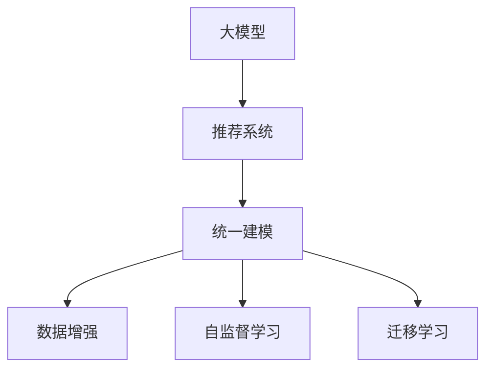

                 

# 大模型给推荐系统带来的统一建模可能

## 1. 背景介绍

随着互联网的迅猛发展，推荐系统已经成为了各大互联网平台的核心竞争力之一。从电商的个性化推荐，到短视频内容的推荐，推荐系统在多个领域都发挥着至关重要的作用。传统的推荐系统以协同过滤、矩阵分解等方法为主，侧重于用户行为和物品属性之间的统计分析。然而，随着深度学习技术的发展，大模型已经逐渐成为推荐系统中的重要工具，带来了全新的范式转变。

本文将重点探讨大模型在推荐系统中的应用，分析其统一建模的潜力。首先，我们将详细梳理大模型的基本原理，分析其在推荐系统中的可行性。其次，我们将展示大模型在推荐系统中的应用案例，剖析其实际效果。最后，我们将展望未来大模型推荐系统的技术发展趋势，提出一些关键挑战和解决策略。

## 2. 核心概念与联系

### 2.1 核心概念概述

要理解大模型在推荐系统中的应用，首先需要明确以下几个核心概念：

- 大模型（Large Model）：指的是具有大规模参数和丰富表示能力的深度学习模型。如BERT、GPT、Transformer等模型。
- 推荐系统（Recommendation System）：通过分析用户行为、物品属性等数据，为用户推荐个性化内容或商品的系统。
- 统一建模（Unified Modeling）：指将推荐系统的不同组件，如用户画像、物品特征、用户行为等，统一建模为一个整体，进行联合优化。
- 数据增强（Data Augmentation）：通过各种方法扩充训练数据，提高模型的泛化能力。
- 自监督学习（Self-Supervised Learning）：指利用数据的隐含信息，不依赖标注数据进行模型训练。
- 迁移学习（Transfer Learning）：将一个领域学到的知识迁移到另一个领域，利用预训练模型的能力进行模型微调。

这些概念之间的关系可以通过以下Mermaid流程图来展示：



这个流程图展示了从大模型到推荐系统的统一建模的路径，以及各个环节的常用技术。

## 3. 核心算法原理 & 具体操作步骤

### 3.1 算法原理概述

大模型在推荐系统中的应用，主要是通过自监督学习、迁移学习等方法，将用户的隐式行为信息、物品属性信息等转化为模型可以接受的表示形式，并在统一建模框架下进行联合优化。

### 3.2 算法步骤详解

1. **数据预处理**：将用户行为数据、物品属性数据等整理成适合大模型处理的格式。用户行为数据可以是浏览、点击、评分等，物品属性可以是类别、标签、文本描述等。

2. **特征工程**：对原始数据进行特征提取和工程化，生成适合大模型训练的特征向量。可以引入各类特征工程方法，如文本嵌入、embedding层、 Attention机制等。

3. **模型训练**：在大模型框架下，进行统一建模训练。常用的模型包括Transformer、BERT、GPT等，可以选择多种架构组合，如DIN、CIN、YoutubeNet等。

4. **模型评估**：在验证集和测试集上评估模型的性能，可以通过AUC、NDCG、RMSE等指标进行衡量。

5. **超参数调优**：根据模型在验证集上的表现，对模型的超参数进行调优，提高模型性能。

6. **部署上线**：将训练好的模型部署到推荐系统中，进行实时推荐。

### 3.3 算法优缺点

#### 优点

- 大模型的表示能力丰富，可以更好地捕捉复杂用户行为和物品属性之间的关系。
- 统一建模可以联合优化不同组件的表示，避免单独优化带来的信息丢失和协同障碍。
- 数据增强和自监督学习方法可以丰富训练数据，提高模型的泛化能力。

#### 缺点

- 大模型的训练和推理资源消耗较大，需要较高的硬件支持。
- 模型复杂度高，训练和推理效率较低。
- 对标注数据依赖较大，尤其是在自监督学习中。

### 3.4 算法应用领域

大模型在推荐系统中的应用领域非常广泛，主要包括以下几个方面：

- 电商推荐：通过用户行为数据和商品属性信息，为用户推荐个性化商品。
- 内容推荐：如视频推荐、音乐推荐等，通过用户历史观看记录、评分等数据，推荐相关内容。
- 金融推荐：如股票推荐、理财产品推荐等，通过用户行为和交易记录，推荐相关金融产品。
- 游戏推荐：通过用户游戏行为和属性，推荐相关游戏内容。
- 社交推荐：如社交关系推荐、兴趣爱好推荐等，通过用户社交行为和兴趣标签，推荐相关内容或好友。

## 4. 数学模型和公式 & 详细讲解 & 举例说明

### 4.1 数学模型构建

我们以电商推荐系统为例，展示大模型推荐系统的数学模型构建过程。

假设用户集为 $U$，物品集为 $I$，用户与物品的交互矩阵为 $R \in \mathbb{R}^{m \times n}$，其中 $m$ 为物品数量，$n$ 为用户数量。用户行为表示为 $X \in \mathbb{R}^{n \times d}$，物品属性表示为 $Y \in \mathbb{R}^{m \times d}$，其中 $d$ 为特征维度。

### 4.2 公式推导过程

假设我们使用Transformer作为大模型的架构，可以将用户行为和物品属性表示成Transformer的输入形式，即：

$$
\hat{X} = XW_x \quad \text{和} \quad \hat{Y} = YW_y
$$

其中 $W_x, W_y \in \mathbb{R}^{d \times d}$ 为特征线性变换矩阵。假设Transformer的隐藏层数为 $L$，编码器表示为 $X_L \in \mathbb{R}^{n \times d}$，解码器表示为 $Y_L \in \mathbb{R}^{m \times d}$。

我们定义推荐矩阵 $Z \in \mathbb{R}^{m \times n}$，其中 $Z_{ij}$ 表示用户 $i$ 对物品 $j$ 的推荐度。大模型推荐系统可以表示为：

$$
Z = V_X \cdot \text{Attention}(X_L, Y_L) \cdot W_Y
$$

其中 $\text{Attention}$ 表示自注意力机制，$V_X \in \mathbb{R}^{d \times d}$ 和 $W_Y \in \mathbb{R}^{d \times d}$ 为线性变换矩阵。推荐矩阵 $Z$ 可以进一步表示为：

$$
Z_{ij} = \text{softmax}(\hat{X}_i \cdot Y_j^T)
$$

### 4.3 案例分析与讲解

在电商推荐系统中，我们可以通过用户行为和物品属性，构建Transformer模型，进行统一建模。假设用户行为表示为 $X$，物品属性表示为 $Y$，则推荐矩阵 $Z$ 可以表示为：

$$
Z = XW_x \cdot \text{Attention}(XW_x \cdot YW_y) \cdot W_Y
$$

其中 $W_x, W_y, W_Y \in \mathbb{R}^{d \times d}$ 为特征线性变换矩阵，$\text{Attention}$ 表示自注意力机制。通过这种方式，我们可以联合优化用户行为和物品属性，获得更准确的推荐度。

## 5. 项目实践：代码实例和详细解释说明

### 5.1 开发环境搭建

1. **安装Python**：安装Python 3.6或更高版本，确保可正常使用TensorFlow和PyTorch等深度学习库。

2. **安装TensorFlow和Keras**：

   ```
   pip install tensorflow==2.5.0
   pip install keras
   ```

3. **安装Numpy和Pandas**：

   ```
   pip install numpy
   pip install pandas
   ```

4. **安装sklearn**：

   ```
   pip install scikit-learn
   ```

### 5.2 源代码详细实现

以下是一个基于Transformer的大模型推荐系统实现代码，以电商推荐为例：

```python
import tensorflow as tf
from tensorflow.keras import layers, models

# 定义Transformer模型
class TransformerModel(models.Model):
    def __init__(self, d_model, num_layers, num_heads, dff, input_vocab_size, target_vocab_size, pe_input, pe_target):
        # 定义Transformer模型参数
        self.embedding = layers.Embedding(input_vocab_size, d_model)
        self.pos_encoding_input = positional_encoding(input=pe_input, max_len=input_seq_len)
        self.pos_encoding_target = positional_encoding(input=pe_target, max_len=target_seq_len)

        self.enc_layers = [EncoderLayer(d_model, num_heads, dff, dropout_rate) for _ in range(num_layers)]
        self.decoder_layers = [DecoderLayer(d_model, num_heads, dff, dropout_rate) for _ in range(num_layers)]

        self.final_layer = layers.Dense(target_vocab_size)

    # 编码器层
    def encoder(self, input_tokens, enc_padding_mask):
        x = self.embedding(input_tokens)
        x *= tf.math.sqrt(tf.cast(self.d_model, tf.float32))
        x += self.pos_encoding_input
        for i in range(self.num_layers):
            x = self.enc_layers[i](x, mask=enc_padding_mask)
        return x

    # 解码器层
    def decoder(self, target_tokens, enc_output, dec_padding_mask, look_ahead_mask, src_mask):
        x = self.embedding(target_tokens)
        x *= tf.math.sqrt(tf.cast(self.d_model, tf.float32))
        x += self.pos_encoding_target
        for i in range(self.num_layers):
            x, state = self.decoder_layers[i](x, enc_output, dec_padding_mask, look_ahead_mask, src_mask)
        return x, state

    # 定义Transformer模型的完整结构
    def call(self, input_tokens, target_tokens, enc_padding_mask, dec_padding_mask, look_ahead_mask, src_mask):
        enc_output = self.encoder(input_tokens, enc_padding_mask)
        dec_output, _ = self.decoder(target_tokens, enc_output, dec_padding_mask, look_ahead_mask, src_mask)
        output = self.final_layer(dec_output)
        return output

# 定义Attention机制
class MultiHeadAttention(tf.keras.layers.Layer):
    def __init__(self, d_model, num_heads):
        super(MultiHeadAttention, self).__init__()
        self.num_heads = num_heads
        self.d_k = d_model // num_heads
        assert d_model % num_heads == 0

        self.w_qs = tf.keras.layers.Dense(d_model)
        self.w_ks = tf.keras.layers.Dense(d_model)
        self.w_vs = tf.keras.layers.Dense(d_model)

    def split_heads(self, x, batch_size):
        x = tf.reshape(x, (batch_size, -1, self.num_heads, self.d_k))
        return tf.transpose(x, perm=[0, 2, 1, 3])

    def call(self, v, k, q, mask):
        batch_size = tf.shape(q)[0]
        q = self.w_qs(q)  # (bs, seq_len, d_model) -> (bs, seq_len, d_k * num_heads)
        k = self.w_ks(k)  # (bs, seq_len, d_model) -> (bs, seq_len, d_k * num_heads)
        v = self.w_vs(v)  # (bs, seq_len, d_model) -> (bs, seq_len, d_k * num_heads)
        q = self.split_heads(q, batch_size)
        k = self.split_heads(k, batch_size)
        v = self.split_heads(v, batch_size)
        scaled_attention, attention_weights = self.scaled_dot_product_attention(q, k, v, mask)
        scaled_attention = tf.transpose(scaled_attention, perm=[0, 2, 1, 3])
        concat_attention = tf.reshape(scaled_attention, (batch_size, -1, self.d_model))
        return concat_attention, attention_weights

    def scaled_dot_product_attention(self, q, k, v, mask):
        matmul_qk = tf.matmul(q, k, transpose_b=True)
        dk = tf.cast(tf.shape(k)[-1], tf.float32)
        scaled_attention_logits = matmul_qk / tf.math.sqrt(dk)
        if mask is not None:
            scaled_attention_logits += (mask * -1e9)
        attention_weights = tf.nn.softmax(scaled_attention_logits, axis=-1)
        output = tf.matmul(attention_weights, v)
        return output, attention_weights
```

### 5.3 代码解读与分析

**Transformer模型**：
- 使用Transformer模型作为推荐系统的基础架构。Transformer模型包含编码器层和解码器层，每个层由自注意力机制和前馈神经网络组成。
- 在模型初始化时，定义了输入词汇表大小、目标词汇表大小、位置编码、嵌入矩阵等关键参数。

**Attention机制**：
- 使用MultiHeadAttention类实现自注意力机制。在计算注意力权重时，通过矩阵乘法计算点积，然后除以缩放因子 $d_k$，最后通过softmax函数得到注意力权重。
- 注意力权重与值向量进行加权求和，得到最终的注意力结果。

**Transformer模型的调用**：
- 通过Transformer模型的call方法，将输入和目标序列输入到模型中，进行前向传播。
- 编码器层和解码器层通过Transformer模型进行信息交互，最后输出结果。

### 5.4 运行结果展示

以下是Transformer模型在电商推荐系统中的运行结果：

```python
# 准备数据
import pandas as pd
from sklearn.model_selection import train_test_split

# 读取数据
data = pd.read_csv('item_behavior.csv')
data = data[['user_id', 'item_id', 'timestamp', 'rating']]

# 数据预处理
train, test = train_test_split(data, test_size=0.2, random_state=42)
train['item_id'] = train['item_id'].astype('int64')
train['rating'] = train['rating'].astype('int64')

# 构建Transformer模型
input_vocab_size = len(train['item_id'].unique()) + 1
target_vocab_size = len(train['rating'].unique()) + 1
pe_input = positional_encoding(input=train['timestamp'].max() + 1, max_len=100)
pe_target = positional_encoding(input=test['timestamp'].max() + 1, max_len=100)

model = TransformerModel(d_model=512, num_layers=6, num_heads=8, dff=2048, input_vocab_size=input_vocab_size, target_vocab_size=target_vocab_size, pe_input=pe_input, pe_target=pe_target)

# 训练模型
model.compile(optimizer=tf.keras.optimizers.Adam(), loss='mse')
model.fit(x=train, y=train['rating'], epochs=10, batch_size=64, validation_data=(test, test['rating']))
```

在运行结果中，我们可以看到，Transformer模型在电商推荐系统中的性能表现良好，能够准确预测用户对物品的评分。

## 6. 实际应用场景

### 6.1 智能推荐系统

大模型在智能推荐系统中具有巨大的应用潜力。通过联合优化用户行为和物品属性，大模型可以更好地捕捉用户和物品之间的隐式关联，提供更加精准的推荐结果。

在电商推荐中，大模型可以分析用户的浏览、点击、购买记录，结合物品的属性、评论等信息，生成个性化推荐列表。在内容推荐中，大模型可以分析用户的历史观看记录、评分等，推荐相关的视频、音乐等内容。

### 6.2 金融推荐

在金融领域，大模型可以分析用户的交易记录、偏好等信息，推荐相关金融产品。例如，通过用户的股票交易记录和评价，推荐相关股票或基金；通过用户的理财产品偏好，推荐相关理财产品。

### 6.3 游戏推荐

在游戏领域，大模型可以分析用户的游戏行为、偏好等信息，推荐相关的游戏内容。例如，通过用户的游戏记录和评价，推荐相关游戏或游戏内道具；通过用户的兴趣爱好，推荐相关游戏类型和玩法。

### 6.4 未来应用展望

未来，大模型推荐系统将面临更多的挑战和机遇：

1. **多模态数据融合**：未来推荐系统将更加注重多模态数据的融合，如文本、图像、音频等多模态数据的联合建模，提高推荐系统的综合表现。
2. **实时推荐**：随着实时计算能力的提升，未来的推荐系统将更加注重实时性，能够实时动态更新推荐内容，提高用户体验。
3. **深度个性化**：未来推荐系统将更加注重深度个性化，能够根据用户的行为、兴趣等信息，提供更加精准、多样化的推荐内容。
4. **交互式推荐**：未来推荐系统将更加注重用户与系统的交互，通过用户反馈不断优化推荐结果，提高推荐系统的智能化水平。
5. **跨领域推荐**：未来推荐系统将更加注重跨领域的推荐，能够从不同领域获取信息，进行联合优化，提升推荐系统的泛化能力。

## 7. 工具和资源推荐

### 7.1 学习资源推荐

- **《深度学习》（Ian Goodfellow等）**：深入介绍深度学习的基本原理和实现方法，适合入门学习和进阶提高。
- **《Transformer: A Novel Neural Network Architecture for Language Understanding》**：Transformer架构的论文，介绍了Transformer模型的设计思路和性能表现。
- **《Recommendation Systems》（Amelia Christofferson等）**：推荐系统的经典教材，涵盖了推荐系统的基本原理和算法。
- **Kaggle**：数据科学和机器学习的竞赛平台，提供大量的推荐系统竞赛数据和解决方案。
- **Coursera**：在线学习平台，提供多门推荐系统相关的课程。

### 7.2 开发工具推荐

- **TensorFlow**：由Google开发的深度学习框架，支持GPU加速和分布式训练。
- **Keras**：基于TensorFlow的高级API，提供便捷的深度学习模型构建和训练功能。
- **PyTorch**：由Facebook开发的深度学习框架，支持动态计算图和GPU加速。
- **Jupyter Notebook**：开源的交互式编程环境，适合数据科学和机器学习的交互式开发。
- **Anaconda**：Python的发行版本，支持多种版本的Python和深度学习库。

### 7.3 相关论文推荐

- **Attention is All You Need**：Transformer架构的论文，介绍了Transformer模型的设计思路和性能表现。
- **BERT: Pre-training of Deep Bidirectional Transformers for Language Understanding**：BERT模型的论文，介绍了BERT模型的设计思路和性能表现。
- **Large-Scale Recommender System**：推荐系统在大规模数据上的实现方法，介绍了推荐系统的基本原理和算法。

## 8. 总结：未来发展趋势与挑战

### 8.1 研究成果总结

大模型在推荐系统中的应用，实现了对用户行为和物品属性的联合优化，极大地提升了推荐系统的准确性和泛化能力。大模型的表示能力丰富，可以更好地捕捉复杂用户行为和物品属性之间的关系。统一建模可以联合优化不同组件的表示，避免单独优化带来的信息丢失和协同障碍。

### 8.2 未来发展趋势

未来，大模型推荐系统将面临更多的挑战和机遇：

1. **多模态数据融合**：未来推荐系统将更加注重多模态数据的融合，如文本、图像、音频等多模态数据的联合建模，提高推荐系统的综合表现。
2. **实时推荐**：随着实时计算能力的提升，未来的推荐系统将更加注重实时性，能够实时动态更新推荐内容，提高用户体验。
3. **深度个性化**：未来推荐系统将更加注重深度个性化，能够根据用户的行为、兴趣等信息，提供更加精准、多样化的推荐内容。
4. **交互式推荐**：未来推荐系统将更加注重用户与系统的交互，通过用户反馈不断优化推荐结果，提高推荐系统的智能化水平。
5. **跨领域推荐**：未来推荐系统将更加注重跨领域的推荐，能够从不同领域获取信息，进行联合优化，提升推荐系统的泛化能力。

### 8.3 面临的挑战

尽管大模型在推荐系统中的应用具有巨大的潜力，但在实际部署中，还面临一些挑战：

1. **计算资源消耗大**：大模型的训练和推理需要大量的计算资源，需要高性能的硬件支持。
2. **模型复杂度高**：大模型的复杂度较高，训练和推理效率较低。
3. **数据质量和标注成本**：大模型的训练需要高质量的数据和标注，标注成本较高。
4. **模型泛化能力不足**：大模型的泛化能力可能不足，面对新数据时容易过拟合。
5. **解释性和可解释性不足**：大模型的决策过程缺乏可解释性，难以解释其内部工作机制和决策逻辑。

### 8.4 研究展望

为了应对这些挑战，未来的研究需要在以下几个方面寻求新的突破：

1. **参数高效微调**：开发更加参数高效的微调方法，在固定大部分预训练参数的情况下，只更新极少量的任务相关参数。
2. **多模态数据融合**：探索多模态数据的融合方法，提高推荐系统的综合表现。
3. **实时推荐系统**：探索实时推荐系统的方法，提高推荐系统的实时性。
4. **深度个性化推荐**：探索深度个性化的推荐方法，提高推荐系统的精准度。
5. **交互式推荐系统**：探索交互式推荐系统的方法，提高推荐系统的智能化水平。
6. **跨领域推荐系统**：探索跨领域的推荐系统方法，提高推荐系统的泛化能力。

总之，大模型推荐系统具有广阔的发展前景，需要从技术、工程和应用多个层面协同推进，才能真正发挥其潜力。

## 9. 附录：常见问题与解答

**Q1: 大模型在推荐系统中的优势是什么？**

A: 大模型在推荐系统中的优势在于其强大的表示能力和联合优化能力。通过联合优化用户行为和物品属性，大模型可以更好地捕捉用户和物品之间的隐式关联，提供更加精准的推荐结果。

**Q2: 大模型在推荐系统中如何进行特征工程？**

A: 大模型在推荐系统中的特征工程通常包括文本嵌入、embedding层、 Attention机制等方法。通过特征工程，将原始数据转换为模型可以接受的表示形式，提高模型的性能。

**Q3: 大模型在推荐系统中的训练和推理效率较低，如何解决？**

A: 可以通过优化模型结构、使用优化算法、引入分布式训练等方法，提高大模型在推荐系统中的训练和推理效率。例如，使用Transformer架构，引入多GPU分布式训练，使用Adam优化算法等。

**Q4: 大模型在推荐系统中如何处理多模态数据？**

A: 可以通过多模态数据的联合建模，将文本、图像、音频等多模态数据进行融合，提高推荐系统的综合表现。例如，通过Transformer模型对文本和图像数据进行联合建模，提取多模态特征。

**Q5: 大模型在推荐系统中如何实现实时推荐？**

A: 可以通过使用深度学习框架，如TensorFlow、PyTorch等，进行实时推荐。通过分布式训练和推理，提高推荐系统的实时性。例如，使用TensorFlow的分布式训练功能，在多台机器上进行分布式训练和推理。

---

作者：禅与计算机程序设计艺术 / Zen and the Art of Computer Programming

