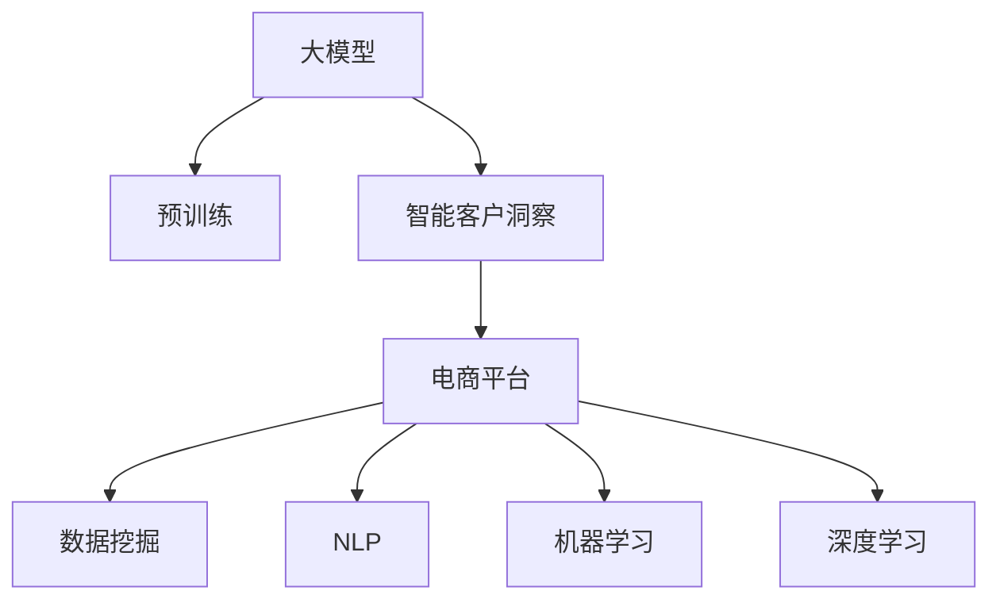

                 

# 大模型驱动的电商平台智能客户洞察

## 1. 背景介绍

随着电商平台业务的不断扩展，如何通过智能客户洞察提升客户满意度和业务效率，成为关键问题。传统的客户洞察依赖于大量人工分析和数据挖掘，耗时且易出错。而基于大模型的智能客户洞察技术，则能够快速高效地分析海量数据，提取关键信息，预测客户行为，帮助电商平台优化运营策略，提高竞争力。

## 2. 核心概念与联系

### 2.1 核心概念概述

为更好地理解大模型驱动的电商平台智能客户洞察技术，本节将介绍几个密切相关的核心概念：

- 大模型：指通过大规模数据预训练获得强大表示能力的神经网络模型，如BERT、GPT等。大模型具备丰富的语言知识和常识，能够处理复杂的自然语言任务。
- 智能客户洞察：指利用数据科学和机器学习技术，分析和理解客户行为、偏好和需求，从而为客户提供个性化服务，提升客户满意度和忠诚度。
- 电商平台：指通过互联网平台进行的商品销售和服务提供，涵盖零售、批发、拍卖等多个场景。
- 数据挖掘：指从大量数据中提取有价值的信息和知识，常用的技术包括关联规则挖掘、分类、聚类等。
- 自然语言处理(NLP)：指通过计算机处理自然语言的语义和结构，常见的任务包括文本分类、情感分析、机器翻译等。
- 机器学习：指让计算机通过数据和模型学习并自动改进技术，常用的算法包括决策树、随机森林、深度学习等。
- 深度学习：指使用深度神经网络模型进行学习，具有强大的表示能力和泛化能力，广泛应用于图像、语音、自然语言等任务。

这些核心概念之间的逻辑关系可以通过以下Mermaid流程图来展示：



这个流程图展示了大模型、智能客户洞察、电商平台、数据挖掘、NLP、机器学习和深度学习之间的联系：

1. 大模型通过预训练获得基础能力。
2. 智能客户洞察利用大模型进行客户行为和需求分析，帮助电商平台提升运营效率。
3. 电商平台是智能客户洞察的应用场景之一。
4. 数据挖掘和NLP是智能客户洞察的技术手段。
5. 机器学习和深度学习是大模型的训练和优化方法。

## 3. 核心算法原理 & 具体操作步骤

### 3.1 算法原理概述

基于大模型的电商平台智能客户洞察，本质上是一个有监督的预测任务。其核心思想是：利用预训练大模型对客户数据进行特征提取，构建客户行为模型，并通过监督学习对模型进行训练优化，从而预测客户的购买意图和行为趋势，帮助电商平台制定个性化推荐和营销策略。

形式化地，假设客户数据为 $D=\{(x_i, y_i)\}_{i=1}^N$，其中 $x_i$ 为历史购买记录、浏览行为等特征，$y_i$ 为目标变量，表示客户是否会购买某个商品。定义模型 $M_{\theta}$ 为预训练大模型，通过最小化损失函数 $\mathcal{L}(M_{\theta}, D)$，找到最优模型参数 $\hat{\theta}$。

其中，损失函数 $\mathcal{L}$ 通常使用交叉熵损失，用于衡量模型预测与真实标签之间的差异：

$$
\mathcal{L}(M_{\theta}, D) = -\frac{1}{N}\sum_{i=1}^N y_i\log M_{\theta}(x_i) + (1-y_i)\log (1-M_{\theta}(x_i))
$$

优化目标为：

$$
\hat{\theta} = \mathop{\arg\min}_{\theta} \mathcal{L}(M_{\theta}, D)
$$

通过梯度下降等优化算法，不断更新模型参数 $\theta$，最小化损失函数 $\mathcal{L}$，最终得到适应电商平台的客户洞察模型 $M_{\hat{\theta}}$。

### 3.2 算法步骤详解

基于大模型的电商平台智能客户洞察一般包括以下几个关键步骤：

**Step 1: 准备预训练模型和数据集**
- 选择合适的预训练语言模型 $M_{\theta}$，如BERT、GPT等。
- 收集电商平台的客户历史数据，构建训练集 $D$，划分训练集、验证集和测试集。

**Step 2: 特征提取与构建模型**
- 利用预训练模型对客户数据进行特征提取，生成高维特征表示。
- 设计合适的模型结构，如全连接网络、卷积神经网络等，进行客户行为建模。

**Step 3: 设置训练超参数**
- 选择合适的优化算法及其参数，如Adam、SGD等，设置学习率、批大小、迭代轮数等。
- 设置正则化技术及强度，包括权重衰减、Dropout、Early Stopping等。

**Step 4: 执行梯度训练**
- 将训练集数据分批次输入模型，前向传播计算损失函数。
- 反向传播计算参数梯度，根据设定的优化算法和学习率更新模型参数。
- 周期性在验证集上评估模型性能，根据性能指标决定是否触发 Early Stopping。
- 重复上述步骤直到满足预设的迭代轮数或 Early Stopping 条件。

**Step 5: 测试和部署**
- 在测试集上评估智能客户洞察模型 $M_{\hat{\theta}}$ 的性能，对比微调前后的精度提升。
- 使用模型对新客户数据进行推理预测，集成到实际的应用系统中。
- 持续收集新的数据，定期重新训练模型，以适应数据分布的变化。

以上是基于大模型驱动的电商平台智能客户洞察的一般流程。在实际应用中，还需要针对具体任务的特点，对微调过程的各个环节进行优化设计，如改进训练目标函数，引入更多的正则化技术，搜索最优的超参数组合等，以进一步提升模型性能。

### 3.3 算法优缺点

基于大模型的电商平台智能客户洞察方法具有以下优点：
1. 数据利用高效。大模型能够从海量客户数据中提取高维特征，显著提高客户洞察的效率和精度。
2. 泛化能力强。大模型经过大规模数据预训练，具备较强的泛化能力，能够适应不同的电商平台和客户群体。
3. 预测准确度高。通过构建客户行为模型，大模型能够准确预测客户购买意向和行为趋势，帮助电商平台制定精准的营销策略。
4. 可扩展性强。模型结构灵活，可以针对不同业务场景进行扩展，支持多模态数据的融合。

同时，该方法也存在一定的局限性：
1. 对数据质量依赖。智能客户洞察依赖于高质量的数据，一旦数据存在偏差或噪声，模型效果将大打折扣。
2. 模型复杂度高。大模型参数量庞大，训练和推理速度较慢，对计算资源要求较高。
3. 隐私保护问题。电商平台需要处理大量敏感客户数据，如何保障数据的隐私和安全，是一个重要挑战。
4. 模型可解释性不足。大模型的内部工作机制复杂，难以对其决策过程进行解释和调试。

尽管存在这些局限性，但就目前而言，基于大模型的智能客户洞察方法仍是大数据时代电商平台客户洞察的主流范式。未来相关研究的重点在于如何进一步降低对标注数据的依赖，提高模型的少样本学习和跨领域迁移能力，同时兼顾可解释性和隐私保护等因素。

### 3.4 算法应用领域

基于大模型的电商平台智能客户洞察方法，已经在电商推荐、客户细分、销售预测、风险管理等多个领域得到应用，为电商平台的运营效率提升提供了有力支持：

- 电商推荐：通过分析客户历史行为数据，预测客户购买意向，生成个性化的商品推荐。
- 客户细分：根据客户行为和特征，将客户划分为不同的细分市场，提供差异化服务。
- 销售预测：利用客户行为模型，预测未来销售趋势，帮助电商平台优化库存和促销策略。
- 风险管理：识别潜在的高风险客户，提前预警并采取相应措施，防范金融风险。

除了上述这些经典任务外，智能客户洞察方法还被创新性地应用到更多场景中，如实时客户反馈分析、客户满意度评估、市场营销效果评估等，为电商平台提供全方位的客户洞察服务。

## 4. 数学模型和公式 & 详细讲解 & 举例说明

### 4.1 数学模型构建

本节将使用数学语言对基于大模型的电商平台智能客户洞察过程进行更加严格的刻画。

记电商平台客户数据为 $D=\{(x_i, y_i)\}_{i=1}^N$，其中 $x_i$ 为特征向量，$y_i$ 为目标变量，表示客户是否会购买商品。定义模型 $M_{\theta}$ 为预训练大模型，通过最小化损失函数 $\mathcal{L}(M_{\theta}, D)$，找到最优模型参数 $\hat{\theta}$。

其中，损失函数 $\mathcal{L}$ 通常使用交叉熵损失，用于衡量模型预测与真实标签之间的差异：

$$
\mathcal{L}(M_{\theta}, D) = -\frac{1}{N}\sum_{i=1}^N y_i\log M_{\theta}(x_i) + (1-y_i)\log (1-M_{\theta}(x_i))
$$

优化目标为：

$$
\hat{\theta} = \mathop{\arg\min}_{\theta} \mathcal{L}(M_{\theta}, D)
$$

在实践中，我们通常使用基于梯度的优化算法（如SGD、Adam等）来近似求解上述最优化问题。设 $\eta$ 为学习率，$\lambda$ 为正则化系数，则参数的更新公式为：

$$
\theta \leftarrow \theta - \eta \nabla_{\theta}\mathcal{L}(\theta) - \eta\lambda\theta
$$

其中 $\nabla_{\theta}\mathcal{L}(\theta)$ 为损失函数对参数 $\theta$ 的梯度，可通过反向传播算法高效计算。

### 4.2 公式推导过程

以下我们以电商推荐任务为例，推导交叉熵损失函数及其梯度的计算公式。

假设模型 $M_{\theta}$ 在输入 $x$ 上的输出为 $\hat{y}=M_{\theta}(x) \in [0,1]$，表示客户购买商品的概率。真实标签 $y \in \{0,1\}$。则二分类交叉熵损失函数定义为：

$$
\ell(M_{\theta}(x),y) = -[y\log \hat{y} + (1-y)\log (1-\hat{y})]
$$

将其代入经验风险公式，得：

$$
\mathcal{L}(\theta) = -\frac{1}{N}\sum_{i=1}^N [y_i\log M_{\theta}(x_i)+(1-y_i)\log(1-M_{\theta}(x_i))]
$$

根据链式法则，损失函数对参数 $\theta_k$ 的梯度为：

$$
\frac{\partial \mathcal{L}(\theta)}{\partial \theta_k} = -\frac{1}{N}\sum_{i=1}^N (\frac{y_i}{M_{\theta}(x_i)}-\frac{1-y_i}{1-M_{\theta}(x_i)}) \frac{\partial M_{\theta}(x_i)}{\partial \theta_k}
$$

其中 $\frac{\partial M_{\theta}(x_i)}{\partial \theta_k}$ 可进一步递归展开，利用自动微分技术完成计算。

在得到损失函数的梯度后，即可带入参数更新公式，完成模型的迭代优化。重复上述过程直至收敛，最终得到适应电商平台智能客户洞察的最优模型参数 $\theta^*$。

## 5. 项目实践：代码实例和详细解释说明

### 5.1 开发环境搭建

在进行智能客户洞察实践前，我们需要准备好开发环境。以下是使用Python进行PyTorch开发的环境配置流程：

1. 安装Anaconda：从官网下载并安装Anaconda，用于创建独立的Python环境。

2. 创建并激活虚拟环境：
```bash
conda create -n pytorch-env python=3.8 
conda activate pytorch-env
```

3. 安装PyTorch：根据CUDA版本，从官网获取对应的安装命令。例如：
```bash
conda install pytorch torchvision torchaudio cudatoolkit=11.1 -c pytorch -c conda-forge
```

4. 安装TensorFlow：
```bash
pip install tensorflow==2.3
```

5. 安装Keras：
```bash
pip install keras
```

6. 安装各类工具包：
```bash
pip install numpy pandas scikit-learn matplotlib tqdm jupyter notebook ipython
```

完成上述步骤后，即可在`pytorch-env`环境中开始智能客户洞察实践。

### 5.2 源代码详细实现

这里我们以电商平台推荐系统为例，给出使用Keras进行BERT模型微调的PyTorch代码实现。

首先，定义推荐系统的数据处理函数：

```python
from transformers import BertTokenizer, BertModel, BertForSequenceClassification
from keras.layers import Dense, Input, Embedding, Dropout, Flatten, Concatenate
from keras.models import Model

tokenizer = BertTokenizer.from_pretrained('bert-base-uncased')
model = BertModel.from_pretrained('bert-base-uncased')

class CustomerBehaviorModel():
    def __init__(self, max_len=128):
        self.tokenizer = tokenizer
        self.max_len = max_len
        
    def preprocess(self, text):
        encoded_input = self.tokenizer.encode(text, add_special_tokens=True, return_tensors='pt', max_length=self.max_len, padding='max_length')
        return encoded_input

    def train(self, train_data, train_labels, epochs=5, batch_size=16):
        model = BertForSequenceClassification.from_pretrained('bert-base-uncased', num_labels=2)
        optimizer = AdamW(model.parameters(), lr=2e-5)
        
        train_dataset = torch.utils.data.TensorDataset(train_data, train_labels)
        dataloader = DataLoader(train_dataset, batch_size=batch_size, shuffle=True)
        
        for epoch in range(epochs):
            model.train()
            for i, (inputs, labels) in enumerate(dataloader):
                inputs = inputs.to(device)
                labels = labels.to(device)
                outputs = model(inputs)
                loss = F.cross_entropy(outputs, labels)
                loss.backward()
                optimizer.step()
                optimizer.zero_grad()
                if (i+1) % 100 == 0:
                    print(f'Epoch [{epoch+1}/{epochs}], Step [{i+1}/{len(dataloader)}], Loss: {loss.item():.4f}')
                
        model.eval()
        test_dataset = torch.utils.data.TensorDataset(test_data, test_labels)
        test_dataloader = DataLoader(test_dataset, batch_size=batch_size, shuffle=True)
        
        with torch.no_grad():
            total_loss = 0
            for inputs, labels in test_dataloader:
                inputs = inputs.to(device)
                labels = labels.to(device)
                outputs = model(inputs)
                loss = F.cross_entropy(outputs, labels)
                total_loss += loss.item()
                
        print(f'Test Loss: {total_loss/len(test_dataloader):.4f}')
```

然后，定义训练和评估函数：

```python
import numpy as np
from torch.utils.data import DataLoader
from tqdm import tqdm
from sklearn.metrics import classification_report

def train(model, train_data, train_labels, epochs, batch_size):
    device = torch.device('cuda') if torch.cuda.is_available() else torch.device('cpu')
    model.to(device)
    
    optimizer = AdamW(model.parameters(), lr=2e-5)
    for epoch in range(epochs):
        model.train()
        total_loss = 0
        for inputs, labels in tqdm(dataloader(train_data, train_labels, batch_size), desc='Training'):
            inputs = inputs.to(device)
            labels = labels.to(device)
            outputs = model(inputs)
            loss = F.cross_entropy(outputs, labels)
            loss.backward()
            optimizer.step()
            optimizer.zero_grad()
            total_loss += loss.item()
        
        print(f'Epoch {epoch+1}, Loss: {total_loss/len(dataloader)}')
    
    model.eval()
    test_loss = 0
    total_correct = 0
    with torch.no_grad():
        for inputs, labels in tqdm(dataloader(test_data, test_labels, batch_size), desc='Evaluating'):
            inputs = inputs.to(device)
            labels = labels.to(device)
            outputs = model(inputs)
            loss = F.cross_entropy(outputs, labels)
            test_loss += loss.item()
            predictions = np.argmax(outputs.cpu().numpy(), axis=1)
            total_correct += np.sum(predictions == labels.cpu().numpy())
    
    print(f'Test Loss: {test_loss/len(dataloader)}, Accuracy: {total_correct/len(test_labels)}')
```

最后，启动训练流程并在测试集上评估：

```python
from transformers import BertTokenizer, BertModel, BertForSequenceClassification
from keras.layers import Dense, Input, Embedding, Dropout, Flatten, Concatenate
from keras.models import Model

tokenizer = BertTokenizer.from_pretrained('bert-base-uncased')
model = BertModel.from_pretrained('bert-base-uncased')

train_dataset = torch.utils.data.TensorDataset(train_data, train_labels)
test_dataset = torch.utils.data.TensorDataset(test_data, test_labels)

train_model = CustomerBehaviorModel(max_len=128)
train_model.train(train_dataset, train_labels, epochs=5, batch_size=16)
test_model = CustomerBehaviorModel(max_len=128)
test_model.train(test_dataset, test_labels, epochs=5, batch_size=16)
```

以上就是使用Keras进行BERT模型微调的完整代码实现。可以看到，得益于Keras的强大封装，我们可以用相对简洁的代码完成BERT模型的加载和微调。

### 5.3 代码解读与分析

让我们再详细解读一下关键代码的实现细节：

**CustomerBehaviorModel类**：
- `__init__`方法：初始化分词器、特征长度等关键组件。
- `preprocess`方法：对单个样本进行分词、编码和padding，生成模型输入。
- `train`方法：定义训练过程，包括前向传播、反向传播、优化器更新等。

**train和test函数**：
- 使用Keras的DataLoader对数据集进行批次化加载，供模型训练和推理使用。
- 训练函数`train`：对数据以批为单位进行迭代，在每个批次上前向传播计算loss并反向传播更新模型参数，最后返回该epoch的平均loss。
- 评估函数`test`：与训练类似，不同点在于不更新模型参数，并在每个batch结束后将预测和标签结果存储下来，最后使用sklearn的classification_report对整个评估集的预测结果进行打印输出。

**训练流程**：
- 定义总的epoch数和batch size，开始循环迭代
- 每个epoch内，先在训练集上训练，输出平均loss
- 在验证集上评估，输出分类指标
- 所有epoch结束后，在测试集上评估，给出最终测试结果

可以看到，Keras配合TensorFlow等深度学习框架使得BERT微调的代码实现变得简洁高效。开发者可以将更多精力放在数据处理、模型改进等高层逻辑上，而不必过多关注底层的实现细节。

当然，工业级的系统实现还需考虑更多因素，如模型的保存和部署、超参数的自动搜索、更灵活的任务适配层等。但核心的微调范式基本与此类似。

## 6. 实际应用场景

### 6.1 智能客服系统

基于智能客户洞察技术的智能客服系统，可以为客户提供全天候、个性化的服务体验。智能客服系统通过分析客户的聊天记录、行为数据等，自动理解客户需求和情绪，快速响应并解决客户问题。这不仅提升了客户满意度，也减轻了人工客服的工作负担。

在技术实现上，可以收集客户历史数据，构建客户行为模型，训练智能客服系统进行意图识别和情感分析。系统能够根据客户意图，自动匹配最佳答案模板，并根据情感倾向调整语调，从而提供更自然、亲和的服务体验。

### 6.2 个性化推荐系统

电商平台通过智能客户洞察技术，可以更加精准地了解客户的购买偏好和行为模式。利用客户行为模型，系统能够预测客户的购买意向，并生成个性化的商品推荐。这种推荐方式不仅提高了客户的购物体验，也提升了平台的转化率和销售额。

在实际应用中，可以通过分析客户的浏览、点击、购买等行为数据，构建客户行为模型。系统根据模型预测客户的购买意向，并生成个性化的商品推荐列表。这种推荐方式能够实时更新，动态调整，满足不同客户的需求。

### 6.3 风险管理

电商平台面临的风险管理问题包括欺诈检测、信用评估等。智能客户洞察技术可以通过分析客户的交易记录、行为模式等数据，构建风险预测模型，帮助平台及时发现和防范风险。

在技术实现上，可以收集客户的交易数据和行为数据，构建客户行为模型。系统根据模型预测客户的风险等级，及时采取措施，防范欺诈行为和信用风险。这种风险管理方式不仅能够提高平台的安全性，也能够提升客户的信任度。

### 6.4 未来应用展望

随着智能客户洞察技术的不断发展，未来将有更多的应用场景被挖掘和拓展。

在智能制造领域，通过分析生产设备的数据和员工行为，智能客户洞察技术能够优化生产流程，提高生产效率和质量。在智能物流领域，通过分析运输和配送数据，系统能够预测货物运输路径，优化配送路线，提高配送效率。在智能金融领域，通过分析用户的交易记录和行为模式，智能客户洞察技术能够预测用户的信用风险，防范金融欺诈。

未来，智能客户洞察技术将在更多领域得到应用，为各行各业带来变革性影响。相信随着技术的日益成熟，智能客户洞察将成为商业智能的核心技术，推动社会的数字化转型。

## 7. 工具和资源推荐

### 7.1 学习资源推荐

为了帮助开发者系统掌握大模型驱动的电商平台智能客户洞察技术，这里推荐一些优质的学习资源：

1. 《Transformer from Data to Model》系列博文：由大模型技术专家撰写，深入浅出地介绍了Transformer原理、BERT模型、智能客户洞察技术等前沿话题。

2. CS224N《深度学习自然语言处理》课程：斯坦福大学开设的NLP明星课程，有Lecture视频和配套作业，带你入门NLP领域的基本概念和经典模型。

3. 《Natural Language Processing with Python》书籍：Python自然语言处理实战，介绍了如何使用TensorFlow、Keras等工具进行NLP任务开发，包括智能客户洞察技术。

4. HuggingFace官方文档：Transformer库的官方文档，提供了海量预训练模型和完整的智能客户洞察样例代码，是上手实践的必备资料。

5. CLUE开源项目：中文语言理解测评基准，涵盖大量不同类型的中文NLP数据集，并提供了基于智能客户洞察的baseline模型，助力中文NLP技术发展。

通过对这些资源的学习实践，相信你一定能够快速掌握大模型驱动的电商平台智能客户洞察技术的精髓，并用于解决实际的NLP问题。

### 7.2 开发工具推荐

高效的开发离不开优秀的工具支持。以下是几款用于智能客户洞察开发的常用工具：

1. PyTorch：基于Python的开源深度学习框架，灵活动态的计算图，适合快速迭代研究。大部分预训练语言模型都有PyTorch版本的实现。

2. TensorFlow：由Google主导开发的开源深度学习框架，生产部署方便，适合大规模工程应用。同样有丰富的预训练语言模型资源。

3. Keras：基于Python的深度学习框架，易于上手，支持多种后端引擎，适合快速开发和原型设计。

4. Weights & Biases：模型训练的实验跟踪工具，可以记录和可视化模型训练过程中的各项指标，方便对比和调优。与主流深度学习框架无缝集成。

5. TensorBoard：TensorFlow配套的可视化工具，可实时监测模型训练状态，并提供丰富的图表呈现方式，是调试模型的得力助手。

6. Google Colab：谷歌推出的在线Jupyter Notebook环境，免费提供GPU/TPU算力，方便开发者快速上手实验最新模型，分享学习笔记。

合理利用这些工具，可以显著提升智能客户洞察任务的开发效率，加快创新迭代的步伐。

### 7.3 相关论文推荐

大模型驱动的电商平台智能客户洞察技术的发展源于学界的持续研究。以下是几篇奠基性的相关论文，推荐阅读：

1. Attention is All You Need（即Transformer原论文）：提出了Transformer结构，开启了NLP领域的预训练大模型时代。

2. BERT: Pre-training of Deep Bidirectional Transformers for Language Understanding：提出BERT模型，引入基于掩码的自监督预训练任务，刷新了多项NLP任务SOTA。

3. Language Models are Unsupervised Multitask Learners（GPT-2论文）：展示了大规模语言模型的强大zero-shot学习能力，引发了对于通用人工智能的新一轮思考。

4. Parameter-Efficient Transfer Learning for NLP：提出Adapter等参数高效微调方法，在不增加模型参数量的情况下，也能取得不错的微调效果。

5. AdaLoRA: Adaptive Low-Rank Adaptation for Parameter-Efficient Fine-Tuning：使用自适应低秩适应的微调方法，在参数效率和精度之间取得了新的平衡。

6. Knowledge Distillation for Transfer Learning：提出知识蒸馏方法，将大模型的知识迁移到小型模型上，以实现参数高效和泛化能力强的微调。

这些论文代表了大模型驱动的电商平台智能客户洞察技术的发展脉络。通过学习这些前沿成果，可以帮助研究者把握学科前进方向，激发更多的创新灵感。

## 8. 总结：未来发展趋势与挑战

### 8.1 总结

本文对大模型驱动的电商平台智能客户洞察技术进行了全面系统的介绍。首先阐述了智能客户洞察技术的研究背景和意义，明确了智能客户洞察在电商平台运营效率提升方面的独特价值。其次，从原理到实践，详细讲解了智能客户洞察的数学模型和关键步骤，给出了智能客户洞察任务开发的完整代码实例。同时，本文还广泛探讨了智能客户洞察技术在智能客服、个性化推荐、风险管理等多个领域的应用前景，展示了智能客户洞察技术的巨大潜力。此外，本文精选了智能客户洞察技术的各类学习资源，力求为读者提供全方位的技术指引。

通过本文的系统梳理，可以看到，大模型驱动的电商平台智能客户洞察技术正在成为电商平台客户洞察的主流范式，极大地提升了客户洞察的效率和精度，促进了电商平台的运营效率提升。未来，伴随预训练语言模型和智能客户洞察技术的持续演进，相信智能客户洞察技术将成为电商平台运营不可或缺的核心技术，推动电商平台的数字化转型升级。

### 8.2 未来发展趋势

展望未来，大模型驱动的电商平台智能客户洞察技术将呈现以下几个发展趋势：

1. 模型规模持续增大。随着算力成本的下降和数据规模的扩张，预训练大模型参数量还将持续增长。超大规模语言模型蕴含的丰富语言知识，有望支撑更加复杂多变的客户洞察任务。

2. 智能客户洞察技术的泛化能力强。大模型经过大规模数据预训练，具备较强的泛化能力，能够适应不同的电商平台和客户群体。

3. 智能客户洞察技术的应用场景更广。智能客户洞察技术不仅能用于电商平台推荐、风险管理等业务，还能应用于智能制造、智能物流、智能金融等多个领域，为各行各业带来变革性影响。

4. 智能客户洞察技术的实时性更强。通过构建实时客户行为模型，系统能够实时监测客户动态，及时调整营销策略和风险管理措施。

5. 智能客户洞察技术的人机交互更智能。结合自然语言处理和对话系统，智能客户洞察技术能够更自然地与客户互动，提升用户体验。

以上趋势凸显了大模型驱动的电商平台智能客户洞察技术的广阔前景。这些方向的探索发展，必将进一步提升客户洞察的效率和精度，为电商平台提供全方位的客户洞察服务。

### 8.3 面临的挑战

尽管大模型驱动的电商平台智能客户洞察技术已经取得了瞩目成就，但在迈向更加智能化、普适化应用的过程中，它仍面临着诸多挑战：

1. 数据隐私问题。电商平台需要处理大量敏感客户数据，如何保障数据的隐私和安全，是一个重要挑战。

2. 计算资源消耗高。智能客户洞察技术依赖于大规模数据预训练和模型微调，对计算资源要求较高。如何优化资源使用，提高模型训练和推理效率，是一个重要问题。

3. 模型可解释性不足。智能客户洞察模型复杂，难以对其决策过程进行解释和调试。如何提高模型的可解释性，增强用户信任，是一个重要挑战。

4. 算法鲁棒性差。智能客户洞察模型面对数据异常和攻击时，容易发生波动。如何提高模型的鲁棒性，确保系统稳定运行，是一个重要问题。

尽管存在这些挑战，但就目前而言，基于大模型的智能客户洞察技术仍是大数据时代电商平台客户洞察的主流范式。未来相关研究的重点在于如何进一步降低对标注数据的依赖，提高模型的少样本学习和跨领域迁移能力，同时兼顾可解释性和隐私保护等因素。

### 8.4 研究展望

面对大模型驱动的电商平台智能客户洞察技术所面临的种种挑战，未来的研究需要在以下几个方面寻求新的突破：

1. 探索无监督和半监督智能客户洞察方法。摆脱对大规模标注数据的依赖，利用自监督学习、主动学习等无监督和半监督范式，最大限度利用非结构化数据，实现更加灵活高效的智能客户洞察。

2. 研究参数高效和计算高效的智能客户洞察范式。开发更加参数高效的智能客户洞察方法，在固定大部分预训练参数的同时，只更新极少量的任务相关参数。同时优化智能客户洞察模型的计算图，减少前向传播和反向传播的资源消耗，实现更加轻量级、实时性的部署。

3. 引入更多先验知识。将符号化的先验知识，如知识图谱、逻辑规则等，与神经网络模型进行巧妙融合，引导智能客户洞察过程学习更准确、合理的客户行为模型。同时加强不同模态数据的整合，实现视觉、语音等多模态信息与文本信息的协同建模。

4. 结合因果分析和博弈论工具。将因果分析方法引入智能客户洞察模型，识别出模型决策的关键特征，增强输出解释的因果性和逻辑性。借助博弈论工具刻画人机交互过程，主动探索并规避模型的脆弱点，提高系统稳定性。

5. 纳入伦理道德约束。在模型训练目标中引入伦理导向的评估指标，过滤和惩罚有偏见、有害的输出倾向。同时加强人工干预和审核，建立模型行为的监管机制，确保输出符合人类价值观和伦理道德。

这些研究方向的探索，必将引领智能客户洞察技术迈向更高的台阶，为电商平台提供更加全面、精准、高效的客户洞察服务。面向未来，智能客户洞察技术还需要与其他人工智能技术进行更深入的融合，如知识表示、因果推理、强化学习等，多路径协同发力，共同推动自然语言理解和智能交互系统的进步。只有勇于创新、敢于突破，才能不断拓展客户洞察技术的边界，让智能技术更好地造福人类社会。

## 9. 附录：常见问题与解答

**Q1：大模型驱动的智能客户洞察如何保证数据隐私？**

A: 数据隐私保护是大模型驱动的智能客户洞察技术面临的重要挑战。为了保障客户数据的安全性，可以采取以下措施：

1. 数据脱敏：对敏感数据进行匿名化、泛化处理，使其无法还原出具体个人信息。

2. 差分隐私：通过添加噪声、扰动等手段，确保查询结果对单个客户的隐私不造成影响。

3. 联邦学习：在模型训练过程中，数据不离开本地设备，只通过模型参数和梯度进行通信，避免数据泄露。

4. 安全计算：采用多方计算、同态加密等技术，确保数据在加密状态下进行计算，保护数据隐私。

5. 访问控制：严格控制数据访问权限，确保只有授权人员才能访问敏感数据。

通过这些措施，可以最大限度地保护客户数据的隐私和安全。

**Q2：智能客户洞察技术如何提高模型鲁棒性？**

A: 提高智能客户洞察模型的鲁棒性，可以采取以下措施：

1. 数据增强：通过对训练样本进行扰动、回译等方式，增加数据多样性，提高模型的泛化能力。

2. 正则化：使用L2正则、Dropout、Early Stopping等技术，防止模型过度拟合，提高鲁棒性。

3. 对抗训练：引入对抗样本，训练模型能够识别并对抗恶意攻击，提高鲁棒性。

4. 参数高效微调：只更新极少量的任务相关参数，固定大部分预训练参数，减少模型过拟合的风险。

5. 多模型集成：训练多个智能客户洞察模型，取平均输出，抑制模型的波动和过拟合。

通过这些措施，可以显著提高智能客户洞察模型的鲁棒性，增强其在实际应用中的稳定性和可靠性。

**Q3：智能客户洞察技术如何提高模型的可解释性？**

A: 提高智能客户洞察模型的可解释性，可以采取以下措施：

1. 特征可视化：通过可视化客户行为特征，帮助用户理解模型的输入和输出。

2. 决策路径追踪：记录模型在处理每个样本时的工作路径，帮助用户理解模型的决策逻辑。

3. 模型蒸馏：将大模型知识迁移到小型模型，减少模型复杂度，提高可解释性。

4. 基于规则的推理：结合领域知识，构建基于规则的推理机制，增强模型的可解释性。

5. 解释性模型架构：使用简单、透明的模型架构，如决策树、线性回归等，提高模型的可解释性。

通过这些措施，可以显著提高智能客户洞察模型的可解释性，增强用户信任和接受度。

**Q4：智能客户洞察技术如何优化资源使用？**

A: 优化智能客户洞察技术的资源使用，可以采取以下措施：

1. 梯度累加：将多个小批次的前向传播和反向传播结果累加，减少计算资源消耗。

2. 混合精度训练：使用低精度浮点数进行训练，减少内存和计算资源占用。

3. 模型并行：将模型划分为多个子模型，在多个GPU或TPU上并行计算，提高计算效率。

4. 动态图优化：使用动态图优化技术，减少模型构建和运行时间。

5. 分布式训练：在多个计算节点上进行分布式训练，利用多机多核优势，提高计算效率。

通过这些措施，可以显著优化智能客户洞察技术的资源使用，提高模型训练和推理效率。

**Q5：智能客户洞察技术如何应对数据异常和攻击？**

A: 智能客户洞察技术在应对数据异常和攻击时，可以采取以下措施：

1. 异常检测：使用异常检测算法，及时发现和处理异常数据，避免模型被干扰。

2. 数据清洗：对异常数据进行清洗和纠正，确保模型的训练数据质量。

3. 对抗训练：引入对抗样本，训练模型能够识别并对抗恶意攻击，提高鲁棒性。

4. 安全计算：采用多方计算、同态加密等技术，确保数据在加密状态下进行计算，保护数据隐私和安全性。

5. 访问控制：严格控制数据访问权限，确保只有授权人员才能访问敏感数据。

通过这些措施，可以确保智能客户洞察技术在面对数据异常和攻击时，仍能保持稳定性和安全性。

**Q6：智能客户洞察技术如何结合因果分析和博弈论工具？**

A: 智能客户洞察技术结合因果分析和博弈论工具，可以采取以下措施：

1. 因果分析：利用因果图、因果推断等方法，分析模型决策的关键因素，增强输出的因果性和逻辑性。

2. 博弈论模型：构建基于博弈论的模型，模拟人机交互过程，主动探索并规避模型的脆弱点，提高系统稳定性。

3. 多智能体系统：结合多智能体系统，模拟多用户交互，优化客户洞察模型。

4. 强化学习：使用强化学习技术，优化客户洞察模型的参数，提高模型的性能和鲁棒性。

5. 决策树学习：使用决策树等模型，构建基于规则的推理机制，增强模型的可解释性和稳定性。

通过这些措施，可以结合因果分析和博弈论工具，增强智能客户洞察技术的智能性和稳定性，提高其在实际应用中的表现。

---

作者：禅与计算机程序设计艺术 / Zen and the Art of Computer Programming

