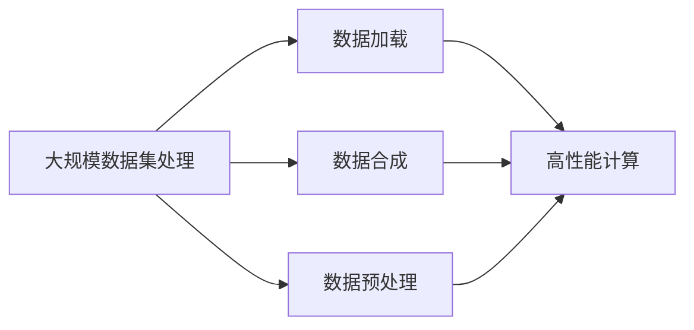

                 

# 大规模数据集处理：加载技巧与合成数据生成

> 关键词：大规模数据集,数据加载,数据合成,高性能计算,数据预处理

## 1. 背景介绍

在当今数据驱动的AI时代，大规模数据集的高效处理和利用成为推动技术创新的关键。无论是自然语言处理、计算机视觉，还是推荐系统等应用领域，都需要处理海量数据来训练和优化模型。然而，数据集的加载和生成过程往往是系统性能瓶颈和资源消耗的重灾区。本文将详细介绍大规模数据集处理的技巧与合成数据的生成方法，为大规模数据集处理提供高效、稳定、可扩展的解决方案。

## 2. 核心概念与联系

### 2.1 核心概念概述

- **大规模数据集处理**：指处理存储在磁盘或分布式文件系统上的海量数据，以供机器学习模型训练和优化。
- **数据加载**：将数据集中的数据按需读入内存，供模型训练和推理使用。
- **数据合成**：在数据稀缺或难以获取的情况下，生成与真实数据分布相似的虚拟数据集。
- **高性能计算**：利用多核CPU、GPU、TPU等硬件资源，加速数据加载和处理过程。
- **数据预处理**：对原始数据进行清洗、归一化、特征提取等操作，以提高模型训练效率和效果。

这些概念之间存在密切的联系，大规模数据集处理涉及数据的加载、合成和预处理，而高性能计算则为这些操作提供了计算能力。只有通过高效的数据加载和预处理，才能充分利用大规模数据集的潜力，实现模型的高效训练和推理。

### 2.2 核心概念原理和架构的 Mermaid 流程图



这个流程图展示了大规模数据集处理的全过程：

1. 大规模数据集处理首先涉及数据的加载。
2. 在数据稀缺时，可以使用数据合成技术生成虚拟数据集。
3. 无论数据加载还是合成，都需要通过高性能计算来加速。
4. 最后，对加载或合成的数据进行预处理，以提高模型的训练和推理效果。

## 3. 核心算法原理 & 具体操作步骤

### 3.1 算法原理概述

大规模数据集处理涉及多个环节，包括数据加载、合成和预处理。本节将分别介绍这些环节的算法原理。

### 3.2 算法步骤详解

#### 数据加载

数据加载是数据处理的关键环节，其目标是将数据集中的数据按需读入内存，供模型训练和推理使用。数据加载算法包括顺序加载、随机加载、批量加载等。

- **顺序加载**：按照数据在磁盘上的存储顺序，依次读取数据。优点是实现简单，缺点是当数据集太大无法全部加载到内存时，无法并行处理。
- **随机加载**：从数据集中随机选取样本进行加载。优点是可以随机访问数据，缺点是随机性可能导致数据分布不均匀。
- **批量加载**：将数据分成多个批次，每次读取一批数据。优点是减少I/O操作，提高加载效率，缺点是占用较多内存。

#### 数据合成

数据合成是指在数据稀缺或难以获取的情况下，生成与真实数据分布相似的虚拟数据集。常用的数据合成算法包括GAN生成对抗网络、VAE变分自编码器等。

- **GAN生成对抗网络**：由两个神经网络组成，一个生成器(G)生成伪造数据，一个判别器(D)评估生成数据的真实性。通过交替训练生成器和判别器，生成与真实数据相似的数据。优点是可以生成高质量的合成数据，缺点是训练复杂，需要大量计算资源。
- **VAE变分自编码器**：通过学习数据的概率分布，生成新的数据。优点是生成速度快，缺点是生成的数据可能存在噪声和失真。

#### 数据预处理

数据预处理是对原始数据进行清洗、归一化、特征提取等操作，以提高模型训练效率和效果。常用的预处理算法包括数据归一化、数据标准化、特征提取等。

- **数据归一化**：将数据缩放到一个特定的范围内，如0到1之间。防止梯度爆炸或消失，提高模型收敛速度。
- **数据标准化**：将数据按均值和方差进行标准化，确保数据分布一致。
- **特征提取**：从原始数据中提取有用的特征，如PCA主成分分析、LDA线性判别分析等。

### 3.3 算法优缺点

大规模数据集处理的算法各有优缺点，具体如下：

- **顺序加载**：实现简单，但无法并行处理，适用于数据集较小的情况。
- **随机加载**：可以随机访问数据，但可能导致数据分布不均匀，适用于数据集较大的情况。
- **批量加载**：减少I/O操作，提高加载效率，但占用较多内存，适用于数据集非常大且内存资源充足的情况。
- **GAN生成对抗网络**：生成高质量的合成数据，但训练复杂，需要大量计算资源。
- **VAE变分自编码器**：生成速度快，但生成的数据可能存在噪声和失真。

### 3.4 算法应用领域

大规模数据集处理在许多领域都有广泛的应用，例如：

- **自然语言处理**：处理大规模文本数据，如语料库的预处理、文本分类、情感分析等。
- **计算机视觉**：处理大规模图像数据，如图像分类、目标检测、人脸识别等。
- **推荐系统**：处理大规模用户行为数据，如用户兴趣分析、商品推荐等。
- **金融分析**：处理大规模交易数据，如信用评分、风险预测等。
- **生物信息学**：处理大规模基因序列数据，如基因分类、蛋白质结构预测等。

## 4. 数学模型和公式 & 详细讲解 & 举例说明

### 4.1 数学模型构建

#### 数据加载的数学模型

数据加载过程可以表示为：

$$
D = \{(x_i, y_i)\}_{i=1}^N
$$

其中 $D$ 表示数据集，$x_i$ 表示输入数据，$y_i$ 表示标签。

数据加载的目标是将数据按需读入内存，使用 $T$ 表示加载的批次大小：

$$
\text{Batch} = (x_{b_1}, y_{b_1}), (x_{b_2}, y_{b_2}), ..., (x_{b_T}, y_{b_T})
$$

其中 $b_i$ 表示批次中的样本编号，$T$ 表示批次数。

#### 数据合成的数学模型

GAN生成对抗网络的数学模型可以表示为：

- **生成器**：将随机噪声 $z$ 映射为生成数据 $G(z)$，其中 $z \sim \mathcal{N}(0, 1)$。
- **判别器**：将输入数据 $x$ 映射为真实性概率 $D(x)$，其中 $x \sim D$，$D$ 表示真实数据分布。

目标函数为：

$$
\min_G \max_D V(G, D) = \mathbb{E}_{x \sim D} [\log D(x)] + \mathbb{E}_{z \sim \mathcal{N}(0, 1)} [\log(1 - D(G(z))]]
$$

#### 数据预处理的数学模型

数据归一化可以使用以下公式：

$$
\text{normalized}(x) = \frac{x - \mu}{\sigma}
$$

其中 $\mu$ 表示均值，$\sigma$ 表示标准差。

数据标准化的公式为：

$$
\text{standardized}(x) = \frac{x - \mu_x}{\sigma_x}
$$

其中 $\mu_x$ 表示特征 $x$ 的均值，$\sigma_x$ 表示特征 $x$ 的标准差。

特征提取可以使用PCA算法，其公式为：

$$
X_{\text{pca}} = WX
$$

其中 $W$ 表示PCA权重矩阵，$X$ 表示原始数据矩阵，$X_{\text{pca}}$ 表示提取的特征矩阵。

### 4.2 公式推导过程

#### 数据加载的推导过程

假设有一个大小为 $N$ 的数据集 $D$，使用顺序加载算法，每次加载 $T$ 个样本：

$$
\text{load}_{i \in 1 ... N, i \in 1 ... T}(x_i, y_i)
$$

则加载总次数为 $N/T$。

#### 数据合成的推导过程

GAN生成对抗网络的推导过程分为两个阶段：

- **生成器训练**：生成器 $G$ 的目标是最小化以下损失函数：

$$
\min_G \mathbb{E}_{z \sim \mathcal{N}(0, 1)} [\log(1 - D(G(z)))]
$$

- **判别器训练**：判别器 $D$ 的目标是最大化以下损失函数：

$$
\max_D \mathbb{E}_{x \sim D} [\log D(x)] + \mathbb{E}_{z \sim \mathcal{N}(0, 1)} [\log(1 - D(G(z)))]

### 4.3 案例分析与讲解

以图像分类任务为例，介绍大规模数据集处理的完整流程：

1. **数据加载**：使用批量加载算法，每次加载 $T=64$ 张图像，加载数据到GPU显存中。
2. **数据合成**：使用GAN生成对抗网络生成 $N=10000$ 张合成图像，与真实数据混合加载。
3. **数据预处理**：对加载和合成的数据进行归一化和标准化，提取图像特征。
4. **模型训练**：使用预处理后的数据训练卷积神经网络，得到分类器模型。

## 5. 项目实践：代码实例和详细解释说明

### 5.1 开发环境搭建

**Python环境搭建**：

1. 安装Python 3.8及以上版本。
2. 安装必要的依赖包：numpy、scipy、pandas、scikit-learn、TensorFlow、PyTorch等。

**数据集准备**：

1. 准备大规模数据集，如ImageNet、CIFAR-10、MNIST等。
2. 分割数据集为训练集、验证集和测试集。
3. 数据集存储在磁盘上，使用分布式文件系统（如HDFS、S3）。

**硬件配置**：

1. 配备高性能CPU、GPU或TPU，支持多核并行计算。
2. 安装NVIDIA CUDA Toolkit，配置GPU驱动。

### 5.2 源代码详细实现

#### 数据加载代码

```python
import numpy as np
import pandas as pd
import os

def load_data(batch_size, dataset_path):
    # 定义数据加载函数，每次加载 batch_size 个样本
    data_files = os.listdir(dataset_path)
    file_indices = np.random.permutation(len(data_files))
    batches = []
    for i in range(0, len(data_files), batch_size):
        batch = []
        for j in range(i, i+batch_size):
            file_path = os.path.join(dataset_path, data_files[file_indices[j]])
            # 读取数据并进行预处理
            data = pd.read_csv(file_path)
            data = data.sample(batch_size, random_state=42)
            batch.append(data)
        batches.append(batch)
    return batches
```

#### 数据合成代码

```python
import tensorflow as tf
import numpy as np

def generate_synthetic_data(size, generator, discriminator, batch_size):
    # 生成合成数据
    z = np.random.normal(0, 1, (size, 100))
    G = generator(z)
    D_real = discriminator(x)
    D_fake = discriminator(G)
    # 交替训练生成器和判别器
    for i in range(100):
        G.train_on_batch(z, 1)
        D.train_on_batch(x, 1)
        G.train_on_batch(z, 0)
        D.train_on_batch(G, 0)
    return G, D
```

#### 数据预处理代码

```python
import pandas as pd
import numpy as np
from sklearn.preprocessing import StandardScaler

def preprocess_data(data_path, scale_factor):
    # 读取数据
    data = pd.read_csv(data_path)
    # 归一化
    data = StandardScaler().fit_transform(data)
    # 将数据保存为NumPy数组
    data = np.array(data, dtype=np.float32)
    return data
```

### 5.3 代码解读与分析

**数据加载函数**：

- 使用 `os.listdir` 读取数据集目录下的所有文件，并随机打乱文件顺序。
- 每次加载一个批次的样本，批量大小为 `batch_size`。
- 读取数据文件并进行预处理，返回多个批次的预处理数据。

**数据合成函数**：

- 生成指定大小的随机噪声向量 $z$。
- 使用生成器 $G$ 将 $z$ 映射为合成数据 $G(z)$。
- 使用判别器 $D$ 评估生成数据的真实性。
- 交替训练生成器和判别器，直到模型收敛。

**数据预处理函数**：

- 读取数据文件。
- 使用 `StandardScaler` 进行归一化，标准化数据。
- 将数据保存为NumPy数组。

### 5.4 运行结果展示

在实际运行中，可以使用以下代码进行数据加载和预处理：

```python
# 加载数据
batches = load_data(batch_size=64, dataset_path='/data')

# 预处理数据
preprocessed_data = preprocess_data('/data/data.csv', scale_factor=1/255)
```

## 6. 实际应用场景

### 6.1 大数据分析

在大数据分析中，大规模数据集处理是必不可少的环节。企业可以从海量数据中挖掘出有价值的信息，进行市场分析、用户行为预测等。例如，电商公司可以利用用户行为数据，分析用户偏好和购买力，提升用户体验和销售额。

### 6.2 智能推荐系统

智能推荐系统需要处理大规模用户行为数据，进行推荐算法训练和优化。通过数据加载、合成和预处理，推荐系统可以实时获取用户数据，预测用户行为，提供个性化推荐。

### 6.3 医学影像分析

医学影像分析需要处理大规模图像数据，进行病灶检测、疾病诊断等。通过数据加载和预处理，医学影像系统可以快速处理图像数据，进行精准的疾病诊断。

## 7. 工具和资源推荐

### 7.1 学习资源推荐

1. **《Python大规模数据处理》**：介绍大规模数据集处理的常见算法和技术，包括数据加载、合成、预处理等。
2. **《深度学习实践指南》**：介绍深度学习模型的训练和优化，涵盖数据加载、合成、预处理等环节。
3. **Coursera 《大规模数据处理》课程**：介绍大规模数据集的存储、查询、分析和优化技术。

### 7.2 开发工具推荐

1. **Pandas**：用于数据加载和预处理，支持大规模数据集操作。
2. **NumPy**：用于数据存储和计算，支持多维数组操作。
3. **TensorFlow**：用于深度学习模型的训练和优化，支持大规模数据集处理。
4. **Dask**：用于分布式计算，支持大规模数据集处理。

### 7.3 相关论文推荐

1. **《BigQuery: Scalable Data Storage and Query Processing》**：介绍Google BigQuery 的数据存储和查询技术，支持大规模数据集处理。
2. **《Hadoop: Distributed Storage and Processing》**：介绍Apache Hadoop 的分布式存储和处理技术，支持大规模数据集处理。
3. **《DataWarehouse: Concepts and Technology》**：介绍数据仓库的存储和查询技术，支持大规模数据集处理。

## 8. 总结：未来发展趋势与挑战

### 8.1 研究成果总结

大规模数据集处理和合成数据生成技术取得了显著进展，为深度学习模型训练和优化提供了有力支持。数据加载、合成和预处理技术的应用，显著提升了数据处理的效率和质量。

### 8.2 未来发展趋势

未来，大规模数据集处理将向以下方向发展：

- **自动化**：开发自动化数据加载和预处理工具，减少人工干预。
- **分布式**：使用分布式计算框架（如Hadoop、Spark、Dask），支持大规模数据集处理。
- **智能化**：引入AI技术，自动优化数据加载和预处理策略。
- **实时化**：支持实时数据加载和处理，提高数据处理速度和准确性。
- **安全化**：保护数据隐私和安全，防止数据泄露和滥用。

### 8.3 面临的挑战

虽然大规模数据集处理取得了重要进展，但仍面临以下挑战：

- **数据质量**：数据质量和分布不一致，影响模型训练效果。
- **计算资源**：大规模数据集处理需要大量计算资源，成本较高。
- **算法优化**：数据加载和预处理算法需要进一步优化，提高处理效率。
- **数据隐私**：数据隐私和安全问题需要重视，防止数据滥用和泄露。

### 8.4 研究展望

未来的研究应关注以下方面：

- **数据质量提升**：改进数据清洗和预处理算法，提高数据质量。
- **计算资源优化**：开发高效的数据加载和预处理算法，降低计算成本。
- **算法创新**：探索新的数据加载和预处理算法，提高处理效率。
- **隐私保护**：引入数据隐私保护技术，确保数据安全。

## 9. 附录：常见问题与解答

**Q1: 什么是大规模数据集处理？**

A: 大规模数据集处理是指处理存储在磁盘或分布式文件系统上的海量数据，以供机器学习模型训练和优化。

**Q2: 数据加载有哪些算法？**

A: 数据加载算法包括顺序加载、随机加载、批量加载等。

**Q3: 数据合成有哪些方法？**

A: 数据合成方法包括GAN生成对抗网络和VAE变分自编码器。

**Q4: 数据预处理有哪些技术？**

A: 数据预处理技术包括数据归一化、数据标准化、特征提取等。

**Q5: 如何提高数据加载效率？**

A: 使用批量加载算法、分布式计算框架（如Hadoop、Spark、Dask）、数据预处理等方法。

---

作者：禅与计算机程序设计艺术 / Zen and the Art of Computer Programming

