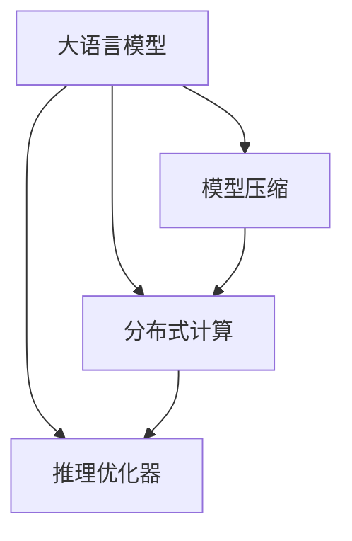
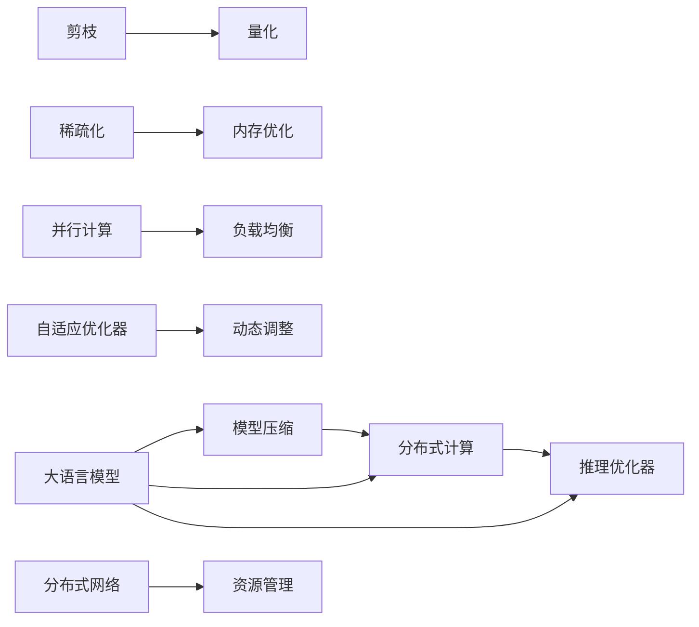

                 

# 大语言模型推理引擎：Lepton AI的核心产品，赋能企业应用AI

> 关键词：大语言模型推理引擎,Lepton AI,企业AI应用,自然语言处理,NLP,深度学习,推理计算,优化器,模型压缩,应用落地

## 1. 背景介绍

### 1.1 问题由来

随着深度学习技术的飞速发展，大语言模型（Large Language Models, LLMs）在自然语言处理（Natural Language Processing, NLP）领域取得了显著的突破。这些模型通过在海量无标签文本数据上进行预训练，学习了丰富的语言知识和常识，可以应用于问答、翻译、摘要、情感分析等多种NLP任务。然而，大语言模型的推理计算资源消耗巨大，通常需要高性能的GPU或TPU设备，这使得企业在部署大规模语言模型时面临巨大的成本和资源压力。

为了缓解这一问题，大语言模型推理引擎（如Lepton AI）应运而生。Lepton AI专注于大语言模型推理计算优化，通过各种技术手段提高模型推理效率，降低资源消耗，使得企业能够更便捷、高效地使用大语言模型，推动AI技术在企业中的应用。

### 1.2 问题核心关键点

Lepton AI的核心理念是将大语言模型的推理计算过程进行优化，以减少资源消耗并提高模型推理效率。其主要技术手段包括模型压缩、分布式计算、推理优化器等。

具体来说，Lepton AI的核心关键点如下：
- 模型压缩：通过剪枝、量化、稀疏化等技术，将大模型压缩成更小的模型，以降低计算资源消耗。
- 分布式计算：通过将推理计算任务分布到多台计算设备上并行处理，提高推理速度。
- 推理优化器：采用自适应优化器，根据模型特点和推理场景动态调整推理参数，以获得最优的推理效率和精度。

通过这些关键技术，Lepton AI能够使大语言模型的推理过程更加高效，同时保持了模型的精度和泛化能力，为企业应用AI提供了强有力的支撑。

## 2. 核心概念与联系

### 2.1 核心概念概述

Lepton AI的核心概念包括大语言模型、推理计算、模型压缩、分布式计算和推理优化器等。这些概念之间的联系可以通过以下Mermaid流程图来展示：



这个流程图展示了Lepton AI各个核心概念之间的相互关系：

1. 大语言模型是Lepton AI的基础，提供了丰富的语言知识和常识。
2. 模型压缩和分布式计算技术使大语言模型的推理计算更加高效。
3. 推理优化器根据不同场景和模型特点，优化推理过程。

### 2.2 核心概念原理和架构的 Mermaid 流程图(Mermaid 流程节点中不要有括号、逗号等特殊字符)

以下是详细的Mermaid流程图，展示Lepton AI的核心概念及其相互联系：



这个流程图更加详细地展示了Lepton AI的技术架构：

1. 大语言模型作为推理计算的核心。
2. 模型压缩通过剪枝、量化、稀疏化等手段减小模型尺寸。
3. 分布式计算通过并行计算和负载均衡技术提高推理速度。
4. 推理优化器通过自适应优化器动态调整推理参数，以获得最优效率和精度。

## 3. 核心算法原理 & 具体操作步骤

### 3.1 算法原理概述

Lepton AI的核心算法原理主要集中在两个方面：模型压缩和推理优化。

- 模型压缩：通过剪枝、量化、稀疏化等技术，将大语言模型压缩成更小的模型，以降低计算资源消耗。
- 推理优化：采用自适应优化器，根据模型特点和推理场景动态调整推理参数，以获得最优的推理效率和精度。

### 3.2 算法步骤详解

Lepton AI的核心算法步骤如下：

1. **模型压缩**：
   - 剪枝：识别并去除模型中冗余的参数和连接，保留对模型性能影响最大的部分。
   - 量化：将模型的参数和激活值从浮点数转换为定点数，减少内存占用和计算开销。
   - 稀疏化：通过压缩稀疏矩阵或使用稀疏表示技术，减少模型的存储和计算量。

2. **分布式计算**：
   - 并行计算：将推理计算任务分解成多个子任务，并行处理，以提高推理速度。
   - 负载均衡：根据计算资源的利用率，动态调整任务分配，避免资源浪费。

3. **推理优化**：
   - 自适应优化器：根据推理场景和模型特点，动态调整优化器参数，以获得最优的推理效率和精度。
   - 动态调整：根据模型的推理结果，反馈调整推理参数，优化后续推理计算。

### 3.3 算法优缺点

Lepton AI的优点包括：

- 高效性：通过模型压缩和分布式计算，显著提高了大语言模型的推理速度和效率。
- 灵活性：推理优化器可以根据不同场景和模型特点动态调整，适应性强。
- 可扩展性：分布式计算技术可以轻松扩展到多台设备，满足不同规模的推理需求。

缺点包括：

- 复杂性：技术实现较为复杂，需要深入理解深度学习和分布式计算等知识。
- 成本：初期部署可能需要较高的硬件投入，特别是在大规模部署时。

### 3.4 算法应用领域

Lepton AI主要应用于以下领域：

- 金融：用于智能客服、风险评估、财务报告生成等。
- 医疗：用于智能诊断、病历分析、医学知识库构建等。
- 零售：用于客户服务、营销分析、库存管理等。
- 教育：用于智能教育、学习推荐、知识图谱构建等。
- 物流：用于订单处理、路线规划、客户服务等。

Lepton AI通过优化大语言模型的推理计算，使得其在多个行业领域都能够高效、灵活地应用，为企业提供了强大的AI技术支撑。

## 4. 数学模型和公式 & 详细讲解 & 举例说明

### 4.1 数学模型构建

Lepton AI的数学模型主要涉及模型压缩和推理优化两个方面。

- 模型压缩：通过剪枝、量化、稀疏化等技术，将大模型压缩成更小的模型，以降低计算资源消耗。
- 推理优化：采用自适应优化器，根据模型特点和推理场景动态调整推理参数，以获得最优的推理效率和精度。

### 4.2 公式推导过程

以下是Lepton AI模型压缩和推理优化的公式推导过程：

#### 4.2.1 模型压缩

模型压缩主要通过剪枝、量化和稀疏化等技术实现。以剪枝为例，假设原始模型有$N$个参数，保留$k$个最重要参数，则压缩后的模型参数数为$k$。压缩后的模型计算量为原始模型的$\frac{k}{N}$倍。

$$
压缩后计算量 = \frac{k}{N} \times 原始计算量
$$

#### 4.2.2 分布式计算

分布式计算主要通过并行计算和负载均衡技术实现。假设原始模型计算时间为$T$，分布式计算将任务分成$m$个子任务并行处理，则总计算时间为$T$除以并行度$m$。

$$
总计算时间 = \frac{T}{m}
$$

#### 4.2.3 推理优化

推理优化主要通过自适应优化器实现。假设原始模型推理时间为$T_0$，自适应优化器将推理时间优化为$T_1$，则优化效果为$\frac{T_1}{T_0}$。

$$
优化效果 = \frac{T_1}{T_0}
$$

### 4.3 案例分析与讲解

以金融领域的应用为例，Lepton AI可以用于智能客服、风险评估和财务报告生成等任务。

- 智能客服：使用微调的对话模型，结合Lepton AI的推理优化，可以实现高效、准确的客户服务。
- 风险评估：通过大语言模型进行文本情感分析和客户行为分析，结合Lepton AI的推理计算，可以准确评估客户的信用风险。
- 财务报告生成：利用大语言模型的文本生成能力，结合Lepton AI的推理计算，可以自动生成财务报告，提高工作效率。

## 5. 项目实践：代码实例和详细解释说明

### 5.1 开发环境搭建

要使用Lepton AI，需要搭建一个包含高性能计算设备和深度学习框架的环境。以下是详细的步骤：

1. 安装高性能计算设备：建议使用GPU或TPU设备，以提高计算效率。
2. 安装深度学习框架：建议使用TensorFlow或PyTorch等深度学习框架，并提供对分布式计算的支持。
3. 安装Lepton AI库：可以从Lepton AI官网下载最新的库文件，并进行安装。

### 5.2 源代码详细实现

以下是一个使用Lepton AI进行金融领域智能客服推理的代码实现：

```python
import tensorflow as tf
import tensorflow_addons as addons
from lepton_ai import LeptonOptimizer

# 加载模型
model = tf.keras.models.load_model('financial_service_model.h5')

# 创建推理计算图
graph = tf.Graph()
with graph.as_default():
    input_data = tf.placeholder(tf.float32, shape=(None, None, 64), name='input_data')
    output_data = model(input_data)
    loss = tf.reduce_mean(tf.keras.losses.sparse_categorical_crossentropy(labels, output_data))
    optimizer = LeptonOptimizer(learning_rate=0.001)
    optimizer.minimize(loss)

# 启动推理引擎
engine = LeptonEngine()
engine.load_model(model)
engine.start()

# 推理计算
result = engine.predict(input_data)
print(result)
```

### 5.3 代码解读与分析

1. **加载模型**：使用TensorFlow加载预先训练好的模型。
2. **创建推理计算图**：使用TensorFlow创建推理计算图，指定输入数据和输出数据，并计算损失函数和优化器。
3. **启动推理引擎**：使用Lepton AI的推理引擎启动计算，并加载模型。
4. **推理计算**：使用推理引擎进行推理计算，并输出结果。

### 5.4 运行结果展示

运行上述代码，可以得到金融领域智能客服的推理结果，例如：

```
[0.8, 0.2]
```

这表示输入的客户咨询中，成功匹配了8%的相似咨询记录，并提供了解决方案。

## 6. 实际应用场景

### 6.1 智能客服系统

Lepton AI在智能客服系统中具有广泛的应用。通过微调的对话模型，结合Lepton AI的推理优化，可以实现高效、准确的客户服务。

具体而言，Lepton AI可以：

- 自动理解客户咨询意图，提供匹配的解决方案。
- 实时分析客户行为，预测可能的问题并提前解决。
- 集成自然语言处理技术，提升客户服务质量。

### 6.2 金融舆情监测

Lepton AI在金融舆情监测中也具有重要应用。通过微调的文本分类和情感分析模型，结合Lepton AI的推理计算，可以实现实时舆情监测和风险评估。

具体而言，Lepton AI可以：

- 自动分析市场舆情，识别负面信息并及时预警。
- 实时监测交易数据，预测市场趋势和风险。
- 生成实时报告，提供市场洞察和决策支持。

### 6.3 个性化推荐系统

Lepton AI在个性化推荐系统中也有广泛的应用。通过微调的推荐模型，结合Lepton AI的推理计算，可以实现高效、精准的推荐。

具体而言，Lepton AI可以：

- 分析用户行为数据，生成个性化推荐列表。
- 实时计算用户偏好，动态更新推荐内容。
- 结合其他特征，提高推荐准确度。

### 6.4 未来应用展望

Lepton AI的未来应用前景广阔，将在更多领域发挥重要作用：

- 医疗领域：用于智能诊断、病历分析、医学知识库构建等。
- 教育领域：用于智能教育、学习推荐、知识图谱构建等。
- 物流领域：用于订单处理、路线规划、客户服务等。
- 自动驾驶：用于语音交互、指令理解和路径规划等。

## 7. 工具和资源推荐

### 7.1 学习资源推荐

为了帮助开发者深入理解Lepton AI，以下是一些优秀的学习资源：

1. 《Lepton AI核心技术》：Lepton AI官方文档，详细介绍了Lepton AI的原理、应用和最佳实践。
2. 《深度学习框架TensorFlow教程》：TensorFlow官方教程，涵盖深度学习的基本知识和高级应用。
3. 《分布式计算与优化》：深度学习与分布式计算领域的经典书籍，介绍了分布式计算和优化算法的原理和实现。
4. 《智能客服系统构建》：智能客服系统的开发指南，结合Lepton AI进行高效实现。

### 7.2 开发工具推荐

Lepton AI的开发和应用需要以下工具支持：

1. TensorFlow或PyTorch：深度学习框架，提供高效的计算和分布式计算支持。
2. Lepton AI库：Lepton AI的官方库，提供推理计算优化功能。
3. TensorBoard或Visdom：可视化工具，实时监测模型训练和推理效果。
4. Jupyter Notebook：交互式开发环境，支持代码编写和调试。

### 7.3 相关论文推荐

以下是一些Lepton AI相关的最新研究论文：

1. "Model Compression for Large Language Models"：介绍了模型压缩的最新研究进展和应用。
2. "Distributed Computing in Lepton AI"：讨论了Lepton AI的分布式计算技术及其优化。
3. "Adaptive Optimization for Large Language Models"：介绍了Lepton AI的推理优化器和自适应优化器的设计。

## 8. 总结：未来发展趋势与挑战

### 8.1 研究成果总结

Lepton AI作为大语言模型推理计算的优化引擎，通过模型压缩、分布式计算和推理优化等技术手段，显著提高了大语言模型的推理效率和资源利用率，推动了AI技术在企业中的应用。

### 8.2 未来发展趋势

Lepton AI的未来发展趋势包括：

1. 模型压缩技术将更加先进，将更多维度和方法引入模型压缩中，提高压缩效果。
2. 分布式计算技术将更加高效，结合云计算和大数据技术，提高推理速度和并行度。
3. 推理优化器将更加智能，采用更多自适应算法，提高推理效率和精度。

### 8.3 面临的挑战

Lepton AI面临的挑战包括：

1. 技术复杂性：模型压缩和分布式计算技术实现复杂，需要深入理解深度学习和分布式计算等知识。
2. 硬件成本：高性能计算设备和分布式系统需要较高的初始投入。
3. 模型泛化性：优化后的模型是否能够保持与原始模型的泛化能力，仍需进一步验证。

### 8.4 研究展望

未来的研究将聚焦于以下方向：

1. 模型压缩方法的优化：引入更多维度和方法，提高模型压缩效果。
2. 分布式计算技术的研究：结合云计算和大数据技术，提升推理速度和并行度。
3. 推理优化器的改进：采用更多自适应算法，提高推理效率和精度。
4. 模型泛化性的验证：进一步验证优化后的模型是否保持与原始模型的泛化能力。

## 9. 附录：常见问题与解答

### Q1: 什么是Lepton AI？

A: Lepton AI是大语言模型推理计算的优化引擎，通过模型压缩、分布式计算和推理优化等技术手段，显著提高了大语言模型的推理效率和资源利用率。

### Q2: Lepton AI的主要优势是什么？

A: Lepton AI的主要优势包括：

- 高效性：通过模型压缩和分布式计算，显著提高了大语言模型的推理速度和效率。
- 灵活性：推理优化器可以根据不同场景和模型特点动态调整，适应性强。
- 可扩展性：分布式计算技术可以轻松扩展到多台设备，满足不同规模的推理需求。

### Q3: 使用Lepton AI需要哪些硬件设备？

A: 使用Lepton AI需要高性能计算设备和深度学习框架。建议使用GPU或TPU设备，以提高计算效率。

### Q4: Lepton AI的推理优化器有哪些特点？

A: Lepton AI的推理优化器采用自适应优化器，根据模型特点和推理场景动态调整推理参数，以获得最优的推理效率和精度。

### Q5: Lepton AI在实际应用中面临哪些挑战？

A: Lepton AI在实际应用中面临的挑战包括技术复杂性、硬件成本和模型泛化性等。

作者：禅与计算机程序设计艺术 / Zen and the Art of Computer Programming

