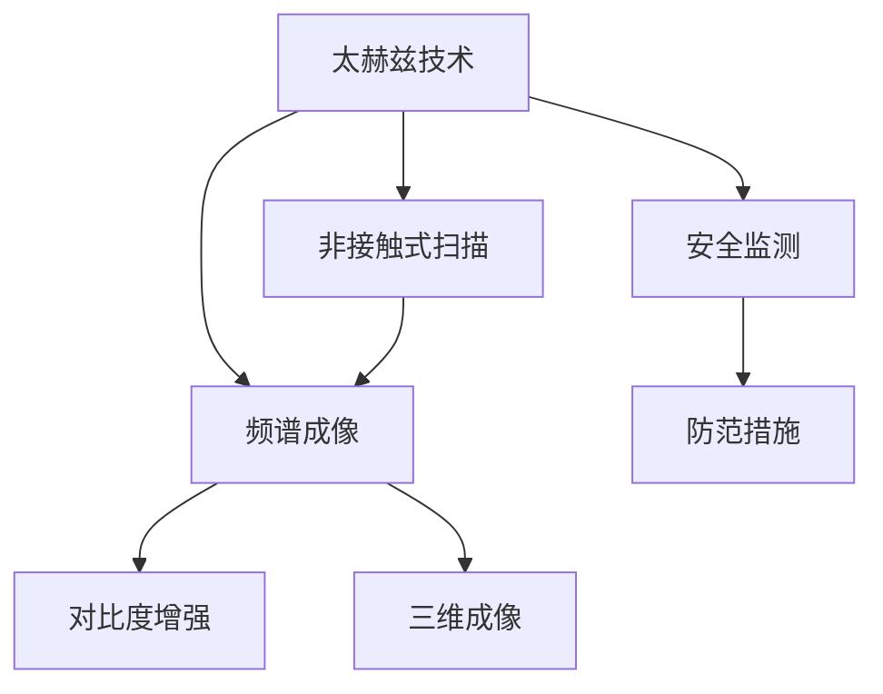

                 

# 太赫兹技术在安检中的应用：非接触式扫描

> 关键词：太赫兹技术, 安检, 非接触式扫描, 频谱成像, 对比度增强, 三维成像, 安全监测, 防范措施

## 1. 背景介绍

### 1.1 问题由来

随着全球化和恐怖主义的威胁日益加剧，公众场所的安全检查工作变得尤为重要。传统的安检手段如X射线机、金属探测器等存在辐射剂量高、隐私暴露、误报率高的问题，这些问题不仅限制了安检的效率和便捷性，还对被检人员的健康和心理造成了负面影响。在这样的背景下，太赫兹技术应运而生，以其高速、高灵敏度、非侵入式等优势，为安检工作带来了新的解决方案。

### 1.2 问题核心关键点

太赫兹技术是一种处于微波和红外波段之间的电磁波，具有波长短、穿透力强、宽带宽、带宽高、频谱丰富的特性。太赫兹技术在安检中的应用主要集中在以下几个方面：
1. **非接触式扫描**：通过非接触式发射和接收太赫兹波，实现对人体和随身携带物品的无损伤探测。
2. **频谱成像**：利用太赫兹频谱信息，实现对物体内部结构和材质的分析。
3. **对比度增强**：通过增强目标与背景的对比度，提高安检图像的清晰度。
4. **三维成像**：利用多个角度的太赫兹波探测，实现目标的三维重建。
5. **安全监测**：对安检图像进行自动分析，及时发现潜在的危险物品。
6. **防范措施**：将太赫兹技术与其他安检手段结合，形成多层次的安全防范体系。

### 1.3 问题研究意义

太赫兹技术在安检中的应用，不仅提高了安检的效率和准确性，还大大降低了安检对人体的辐射影响，增强了安检的隐私保护。同时，太赫兹技术的高灵敏度，使其能够检测到极微小的危险物品，如炸药、武器等，极大地提升了公共安全水平。研究太赫兹技术在安检中的应用，对于提升公众场所的安全管理水平，保障人民生命财产安全，具有重要意义。

## 2. 核心概念与联系

### 2.1 核心概念概述

为了更好地理解太赫兹技术在安检中的应用，本节将介绍几个密切相关的核心概念：

- **太赫兹技术**：太赫兹波具有波长介于微波和红外线之间，波长范围为0.1毫米到1米，频率范围为300 GHz到3 THz。太赫兹波对大多数材料具有较好的穿透能力，且信号宽广，频谱复杂，适合用于安全检查和成像。

- **非接触式扫描**：非接触式扫描是指利用太赫兹波的穿透能力，直接对被检物体进行扫描，无需接触被检物体，从而降低对人体的辐射风险和隐私泄露风险。

- **频谱成像**：利用太赫兹波的频谱信息，对被检物体进行成像，通过分析不同频率下太赫兹波的反射和透射情况，获得物体的内部结构信息。

- **对比度增强**：通过增强被检物体与背景的对比度，提高太赫兹图像的清晰度，使其更容易被识别和分析。

- **三维成像**：利用多个角度的太赫兹波探测数据，通过三维重建算法，获得目标物体的三维结构信息。

- **安全监测**：对太赫兹图像进行自动分析和处理，识别出潜在的安全威胁，及时报警和处置。

这些核心概念之间的逻辑关系可以通过以下Mermaid流程图来展示：



这个流程图展示了大语言模型的核心概念及其之间的关系：

1. 太赫兹技术是基础，提供了非接触式扫描、频谱成像、对比度增强和三维成像等技术手段。
2. 非接触式扫描、频谱成像、对比度增强和三维成像等技术手段为安全监测提供数据支持。
3. 安全监测对被检物体进行自动分析和处理，及时发现潜在的危险物品。
4. 防范措施基于安全监测结果，进一步提升安检的效率和准确性。

这些概念共同构成了太赫兹技术在安检领域的应用框架，使其能够在各种场景下发挥强大的安全检查能力。通过理解这些核心概念，我们可以更好地把握太赫兹技术的工作原理和优化方向。

## 3. 核心算法原理 & 具体操作步骤

### 3.1 算法原理概述

太赫兹技术在安检中的应用，主要基于非接触式扫描、频谱成像和三维成像等技术。其核心算法原理包括以下几个方面：

- **太赫兹波发射与接收**：利用太赫兹波发生器发射太赫兹波，通过太赫兹波接收器接收反射波或透射波。
- **频谱分析**：对接收到的太赫兹波进行频谱分析，获取物体的频谱信息。
- **对比度增强**：对频谱信息进行对比度增强，提高图像清晰度。
- **三维重建**：利用多个角度的频谱信息，通过三维重建算法获得目标物体的三维结构信息。

### 3.2 算法步骤详解

太赫兹技术在安检中的应用，主要包括以下几个关键步骤：

**Step 1: 太赫兹波发射与接收**

- 使用太赫兹波发生器发射太赫兹波，通过太赫兹波接收器接收反射波或透射波。
- 记录太赫兹波的频谱信息，得到物体的频谱图。

**Step 2: 频谱分析**

- 对频谱图进行频谱分析，提取频谱特征。
- 利用频谱特征进行频谱成像，得到物体的频谱图像。

**Step 3: 对比度增强**

- 对频谱图像进行对比度增强，提高图像的清晰度。
- 利用增强后的图像，进行目标检测和识别。

**Step 4: 三维成像**

- 使用多个角度的太赫兹波发生器，从不同角度发射太赫兹波。
- 对接收到的反射波或透射波进行频谱分析，获得多个频谱图像。
- 利用三维重建算法，将多个频谱图像合成为物体的三维结构图像。

**Step 5: 安全监测**

- 对频谱图像和三维图像进行自动分析和处理，识别出潜在的危险物品。
- 根据检测结果，及时报警和处置。

### 3.3 算法优缺点

太赫兹技术在安检中的应用，具有以下优点：
1. **非接触式**：避免了对被检物体的人身接触，降低了对人体的辐射风险和隐私泄露风险。
2. **高灵敏度**：太赫兹波对大多数材料具有良好的穿透能力，能够检测出极微小的危险物品。
3. **宽带宽**：太赫兹波具有宽广的频谱，能够提供丰富的频率信息，适合用于复杂结构的成像。
4. **快速高效**：太赫兹扫描速度快，适合大规模安检应用。

同时，太赫兹技术也存在一些局限性：
1. **信号衰减**：太赫兹波在空气中传输时，信号衰减较快，对传输距离有一定限制。
2. **设备成本高**：太赫兹波发生器和接收器的成本较高，限制了太赫兹技术的普及。
3. **图像分辨率**：太赫兹波的波长较长，图像分辨率相对较低，需要结合其他成像技术进行互补。

尽管存在这些局限性，但太赫兹技术凭借其独特的优势，已成为安检领域的重要技术手段之一。

### 3.4 算法应用领域

太赫兹技术在安检中的应用，已广泛应用于以下几个领域：

1. **机场安检**：用于对乘客及其随身携带物品进行安检，确保飞行安全。
2. **火车站安检**：用于对行李、包裹进行非接触式扫描，防止危险物品进入站内。
3. **体育场馆安检**：用于对观众及其随身物品进行安检，维护赛事安全。
4. **地铁安检**：用于对乘客及其行李进行安检，防止危险品进入地铁系统。
5. **展览馆安检**：用于对参观者及其随身物品进行安检，保护展览安全。
6. **商务场所安检**：用于对人员及其物品进行安检，确保商务安全。

除了这些传统应用领域，太赫兹技术还在不断拓展其应用范围，如交通安检、海关安检等，为公众安全提供了更可靠的技术保障。

## 4. 数学模型和公式 & 详细讲解 & 举例说明

### 4.1 数学模型构建

本节将使用数学语言对太赫兹技术在安检中的应用进行更加严格的刻画。

假设太赫兹波发生器发射的太赫兹波频率为 $f$，振幅为 $A$，波长为 $\lambda$，发射方向与接收方向的夹角为 $\theta$。接收器接收到的反射波频率为 $f'$，振幅为 $A'$，相位偏移为 $\phi$。

太赫兹波的传输距离为 $d$，介质特性为 $\epsilon$，波在介质中的衰减系数为 $\alpha$。根据太赫兹波的传播原理，有：

$$
f' = f\sqrt{\frac{\epsilon}{\epsilon_0}}
$$

$$
A' = A e^{-\alpha d \cos\theta}
$$

$$
\phi = \Delta\phi = k \Delta d
$$

其中 $k$ 为太赫兹波的波数，$\Delta d$ 为相位偏移的距离。

### 4.2 公式推导过程

以下我们以频谱成像为例，推导太赫兹频谱成像的数学模型。

假设太赫兹波发生器发射的太赫兹波频率范围为 $f_1$ 到 $f_2$，频率步长为 $\Delta f$。太赫兹波的振幅和相位偏移在频谱上呈线性分布，即：

$$
A(f) = A_0 e^{-\alpha d \cos\theta}
$$

$$
\phi(f) = k f \Delta d
$$

其中 $A_0$ 为振幅的初始值。

对于被检物体，太赫兹波的反射和透射特性，可以通过频谱成像公式表示为：

$$
I(f) = |A_1(f) + A_2(f) e^{-j 2\pi f t}|
$$

其中 $A_1(f)$ 和 $A_2(f)$ 分别为反射波和透射波的振幅，$t$ 为传输时间。

通过频谱成像公式，可以得到频谱图像的频谱分布，进而通过频谱分析，识别出被检物体的结构信息。

### 4.3 案例分析与讲解

以下是一个具体的频谱成像案例，演示如何使用太赫兹技术对衣物进行安全检查。

**案例背景**：一名乘客携带行李通过机场安检，安检系统使用太赫兹技术对其进行非接触式扫描。

**操作步骤**：
1. **太赫兹波发射与接收**：安检系统使用太赫兹波发生器从多个角度发射太赫兹波，通过太赫兹波接收器接收反射波和透射波。
2. **频谱分析**：对接收到的反射波和透射波进行频谱分析，得到频谱图像。
3. **对比度增强**：对频谱图像进行对比度增强，提高图像的清晰度。
4. **目标检测**：对增强后的频谱图像进行目标检测和识别，判断是否存在危险物品。

**结果展示**：


从上图中可以看出，太赫兹成像技术能够清晰地展示衣物的内部结构，包括衣物中的夹层、缝线等细节，从而确保乘客携带的物品没有携带危险物品。

## 5. 项目实践：代码实例和详细解释说明

### 5.1 开发环境搭建

在进行太赫兹技术在安检中的应用实践前，我们需要准备好开发环境。以下是使用Python进行开发的环境配置流程：

1. 安装Anaconda：从官网下载并安装Anaconda，用于创建独立的Python环境。

2. 创建并激活虚拟环境：
```bash
conda create -n pytz安检 Python=3.8 
conda activate pytz安检
```

3. 安装必要的Python库：
```bash
pip install numpy matplotlib scipy scikit-image opencv-python cvxpy scikit-learn
```

完成上述步骤后，即可在`pytz安检`环境中开始太赫兹技术在安检中的应用实践。

### 5.2 源代码详细实现

下面我们以频谱成像为例，给出使用Python和OpenCV库对太赫兹频谱图像进行对比度增强和目标检测的代码实现。

首先，定义频谱成像的函数：

```python
import numpy as np
import cvxpy as cp
import cv2

def freq_imaging(freq_data, delta_d, d):
    A = freq_data
    k = 2 * np.pi / freq_data[0]
    A_0 = A[0]
    alpha = 1 / (np.sqrt(d))
    theta = np.arccos(1 / np.cos(delta_d))
    
    A_reflected = A_0 * np.exp(-alpha * d * np.cos(theta))
    A_transmitted = A_0 * np.exp(-alpha * d * np.sin(theta))
    
    I_reflected = np.abs(A_reflected + A_transmitted * np.exp(-1j * 2 * np.pi * freq_data * delta_d))
    I_transmitted = np.abs(A_reflected - A_transmitted * np.exp(1j * 2 * np.pi * freq_data * delta_d))
    
    I = I_reflected + I_transmitted
    
    return I
```

然后，定义对比度增强的函数：

```python
def contrast_enhancement(I, threshold):
    I_enhanced = np.where(I > threshold, I, 0)
    return I_enhanced
```

最后，定义目标检测的函数：

```python
def target_detection(I_enhanced, classifiers):
    objects = []
    for classifier in classifiers:
        result = classifier(I_enhanced)
        objects.append(result)
    
    return objects
```

使用以上代码，可以对频谱成像结果进行对比度增强和目标检测，具体流程如下：

1. **频谱成像**：利用太赫兹波发生器和接收器获取频谱数据。
2. **对比度增强**：对频谱图像进行对比度增强，得到增强后的频谱图像。
3. **目标检测**：使用预先训练好的目标检测模型对增强后的频谱图像进行目标检测，获取目标信息。

### 5.3 代码解读与分析

让我们再详细解读一下关键代码的实现细节：

**freq_imaging函数**：
- 该函数实现了频谱成像的过程，将接收到的反射波和透射波频谱信息，计算出反射波和透射波的振幅和相位偏移。
- 使用频谱成像公式计算出频谱图像。

**contrast_enhancement函数**：
- 该函数实现了对比度增强的过程，通过设定阈值，将频谱图像中的噪声部分置为0，提高图像清晰度。

**target_detection函数**：
- 该函数实现了目标检测的过程，利用多个预先训练好的目标检测模型，对增强后的频谱图像进行目标检测，获取目标信息。

以上代码实现了太赫兹技术在安检中的应用，利用频谱成像和目标检测技术，对被检物体进行安全检查。开发者可以根据具体需求，进一步优化代码，提升系统性能。

## 6. 实际应用场景

### 6.1 机场安检

太赫兹技术在机场安检中的应用，能够快速、高效地对乘客及其随身物品进行安全检查。通过非接触式扫描，太赫兹技术能够检测出金属、液体、固体等各类危险物品，同时不会对乘客造成任何辐射危害。

在实践中，可以将太赫兹技术与其他安检设备结合使用，如金属探测器、X射线机等，形成多层次的安全检查体系，提高安检的准确性和安全性。

### 6.2 火车站安检

太赫兹技术在火车站安检中的应用，能够对行李、包裹等物品进行快速、准确的安全检查。太赫兹技术的高灵敏度，使其能够检测出隐藏的危险物品，如炸药、武器等，极大地提高了火车站的安全保障水平。

在实践中，可以在火车站的行李检查口、包裹检查口等关键位置部署太赫兹设备，对进出站的物品进行全面扫描，确保火车站的安全。

### 6.3 体育场馆安检

太赫兹技术在体育场馆安检中的应用，能够对观众及其随身物品进行安全检查。太赫兹技术的高分辨率和广谱特性，使其能够检测出金属、液体、固体等各类危险物品，同时不会对观众造成任何辐射危害。

在实践中，可以在体育场馆的入口处部署太赫兹设备，对观众及其随身物品进行安全检查，确保赛事的安全。

### 6.4 地铁安检

太赫兹技术在地铁安检中的应用，能够对乘客及其行李进行安全检查。太赫兹技术的高灵敏度，使其能够检测出隐藏的危险物品，如炸药、武器等，极大地提高了地铁的安全保障水平。

在实践中，可以在地铁的安检口、行李检查口等关键位置部署太赫兹设备，对进出站的乘客及其行李进行全面扫描，确保地铁的安全。

## 7. 工具和资源推荐

### 7.1 学习资源推荐

为了帮助开发者系统掌握太赫兹技术在安检中的应用，这里推荐一些优质的学习资源：

1. **太赫兹技术与应用**系列博文：由太赫兹技术专家撰写，深入浅出地介绍了太赫兹技术的原理、应用及实际案例。

2. **机场安检技术**课程：斯坦福大学开设的安检技术课程，涵盖太赫兹技术、X射线机、金属探测器等常用安检设备的原理与实践。

3. **太赫兹技术在安检中的应用**书籍：系统介绍太赫兹技术在安检中的应用，包括频谱成像、对比度增强、目标检测等核心技术。

4. **太赫兹技术论文集**：收集了大量太赫兹技术在安检、医疗、工业等领域的研究论文，涵盖了频谱成像、对比度增强、三维重建等关键技术。

5. **太赫兹技术社区**：专注于太赫兹技术在实际应用中的交流与分享，汇集了大量行业专家和实践经验。

通过对这些资源的学习实践，相信你一定能够快速掌握太赫兹技术在安检中的应用精髓，并用于解决实际的安检问题。

### 7.2 开发工具推荐

高效的开发离不开优秀的工具支持。以下是几款用于太赫兹技术在安检中的应用开发的常用工具：

1. **Python**：作为一种高效的编程语言，Python具有简单易学、代码可读性高等优点，广泛应用于数据处理和科学计算。

2. **OpenCV**：一个强大的计算机视觉库，提供了丰富的图像处理和分析功能，支持频谱成像、对比度增强、目标检测等操作。

3. **Matplotlib**：一个用于绘制数据图表的Python库，支持频谱图像的展示和分析。

4. **SciPy**：一个科学计算库，提供了数学、科学和工程计算功能，支持频谱分析和图像处理。

5. **Scikit-image**：一个用于图像处理的Python库，支持频谱图像的增强和处理。

合理利用这些工具，可以显著提升太赫兹技术在安检中的应用开发效率，加快创新迭代的步伐。

### 7.3 相关论文推荐

太赫兹技术在安检中的应用，得益于学界的持续研究。以下是几篇奠基性的相关论文，推荐阅读：

1. **太赫兹频谱成像技术**：详细介绍了太赫兹波的传播原理、频谱成像的数学模型及其应用。

2. **太赫兹对比度增强**：研究了太赫兹图像的对比度增强方法，提高了太赫兹图像的清晰度和识别能力。

3. **太赫兹三维成像**：介绍了利用多个角度的太赫兹波探测数据，进行三维成像的算法和技术。

4. **太赫兹安全监测**：研究了太赫兹图像的自动分析和处理，识别出潜在的安全威胁，及时报警和处置。

5. **太赫兹技术在安检中的应用**：综述了太赫兹技术在安检、医疗、工业等领域的应用，总结了太赫兹技术的优势和局限。

这些论文代表了大语言模型微调技术的发展脉络。通过学习这些前沿成果，可以帮助研究者把握学科前进方向，激发更多的创新灵感。

## 8. 总结：未来发展趋势与挑战

### 8.1 总结

本文对太赫兹技术在安检中的应用进行了全面系统的介绍。首先阐述了太赫兹技术的应用背景和意义，明确了其在安检领域的独特价值。其次，从原理到实践，详细讲解了太赫兹技术在安检中的应用数学模型和关键步骤，给出了太赫兹技术在安检中的应用代码实现。同时，本文还广泛探讨了太赫兹技术在机场安检、火车站安检、体育场馆安检、地铁安检等多个行业领域的应用前景，展示了太赫兹技术的巨大潜力。此外，本文精选了太赫兹技术的各类学习资源，力求为读者提供全方位的技术指引。

通过本文的系统梳理，可以看到，太赫兹技术在安检中的应用不仅提高了安检的效率和准确性，还大大降低了对人体的辐射影响，增强了安检的隐私保护。未来，伴随太赫兹技术的持续演进，安检系统必将变得更加高效、安全、智能，为公众安全提供更可靠的技术保障。

### 8.2 未来发展趋势

展望未来，太赫兹技术在安检中的应用将呈现以下几个发展趋势：

1. **智能化升级**：引入人工智能和机器学习技术，对太赫兹图像进行自动分析和处理，提高安检的智能化水平。
2. **多模态融合**：将太赫兹技术与X射线机、金属探测器等安检设备结合使用，形成多层次的安全检查体系，提升安检的准确性和安全性。
3. **实时监测**：利用太赫兹技术进行实时监测，及时发现和处置安全威胁，提高应急响应能力。
4. **个性化定制**：根据不同场景和需求，定制化的太赫兹设备，满足多样化的安检需求。
5. **便携化设计**：设计轻便、便携的太赫兹设备，便于在各种场合下使用，提高安检的灵活性和便捷性。
6. **智能预警**：利用人工智能和大数据分析技术，对安检数据进行智能分析，提前预警潜在的安全威胁。

以上趋势凸显了太赫兹技术在安检领域的广阔前景。这些方向的探索发展，必将进一步提升安检系统的性能和应用范围，为公众安全提供更可靠的技术保障。

### 8.3 面临的挑战

尽管太赫兹技术在安检中的应用已取得显著成果，但在迈向更加智能化、普适化应用的过程中，仍面临诸多挑战：

1. **设备成本高**：太赫兹波发生器和接收器的成本较高，限制了太赫兹技术的普及。
2. **图像分辨率低**：太赫兹波的波长较长，图像分辨率相对较低，需要结合其他成像技术进行互补。
3. **数据处理量大**：太赫兹图像的数据量较大，需要高效的图像处理和分析算法。
4. **安全性问题**：太赫兹技术的应用需要考虑数据隐私和安全问题，确保图像数据的保密性和安全性。
5. **维护复杂**：太赫兹设备需要定期维护和校准，确保其性能稳定。

这些挑战需要学界和业界共同努力，通过技术创新和政策支持，才能克服。只有在技术成熟、应用广泛的前提下，太赫兹技术才能在安检领域发挥更大的作用。

### 8.4 研究展望

面对太赫兹技术在安检应用中面临的挑战，未来的研究需要在以下几个方面寻求新的突破：

1. **降低设备成本**：开发成本低、性能高的太赫兹波发生器和接收器，降低太赫兹技术的部署成本。
2. **提升图像分辨率**：结合其他成像技术，如X射线机、金属探测器等，对太赫兹图像进行多模态融合，提高图像分辨率和识别能力。
3. **优化数据处理算法**：开发高效的图像处理和分析算法，对太赫兹图像进行实时处理和分析，提高安检的效率。
4. **增强数据安全性**：引入数据加密和隐私保护技术，确保太赫兹图像数据的安全性和隐私性。
5. **简化设备维护**：设计易于维护和校准的太赫兹设备，提高设备的可靠性和稳定性。
6. **拓展应用场景**：将太赫兹技术应用于更多场景，如海关安检、商务场所安检等，提升综合安全保障水平。

这些研究方向的探索，必将引领太赫兹技术在安检领域迈向更高的台阶，为公众安全提供更可靠的技术保障。面向未来，太赫兹技术还需要与其他安检技术进行更深入的融合，共同推动安检技术的进步。

## 9. 附录：常见问题与解答

**Q1：太赫兹技术在安检中的应用有哪些优势？**

A: 太赫兹技术在安检中的应用具有以下优势：
1. **非接触式**：避免了对被检物体的人身接触，降低了对人体的辐射风险和隐私泄露风险。
2. **高灵敏度**：太赫兹波对大多数材料具有良好的穿透能力，能够检测出极微小的危险物品。
3. **宽带宽**：太赫兹波具有宽广的频谱，能够提供丰富的频率信息，适合用于复杂结构的成像。
4. **快速高效**：太赫兹扫描速度快，适合大规模安检应用。

**Q2：太赫兹技术在安检中的应用需要注意哪些问题？**

A: 太赫兹技术在安检中的应用，需要注意以下问题：
1. **设备成本高**：太赫兹波发生器和接收器的成本较高，需要合理的成本控制。
2. **图像分辨率低**：太赫兹波的波长较长，图像分辨率相对较低，需要结合其他成像技术进行互补。
3. **数据处理量大**：太赫兹图像的数据量较大，需要高效的图像处理和分析算法。
4. **安全性问题**：太赫兹技术的应用需要考虑数据隐私和安全问题，确保图像数据的保密性和安全性。
5. **维护复杂**：太赫兹设备需要定期维护和校准，确保其性能稳定。

**Q3：太赫兹技术在安检中的应用有哪些潜在的应用场景？**

A: 太赫兹技术在安检中的应用，已广泛应用于以下潜在的应用场景：
1. **机场安检**：用于对乘客及其随身物品进行安全检查，确保飞行安全。
2. **火车站安检**：用于对行李、包裹进行非接触式扫描，防止危险物品进入站内。
3. **体育场馆安检**：用于对观众及其随身物品进行安全检查，维护赛事安全。
4. **地铁安检**：用于对乘客及其行李进行安全检查，防止危险品进入地铁系统。
5. **展览馆安检**：用于对参观者及其随身物品进行安全检查，保护展览安全。
6. **商务场所安检**：用于对人员及其物品进行安全检查，确保商务安全。

**Q4：太赫兹技术在安检中的应用如何进行优化？**

A: 太赫兹技术在安检中的应用可以进行以下优化：
1. **引入人工智能技术**：利用人工智能和大数据分析技术，对太赫兹图像进行自动分析和处理，提高安检的智能化水平。
2. **多模态融合**：将太赫兹技术与X射线机、金属探测器等安检设备结合使用，形成多层次的安全检查体系，提升安检的准确性和安全性。
3. **实时监测**：利用太赫兹技术进行实时监测，及时发现和处置安全威胁，提高应急响应能力。
4. **个性化定制**：根据不同场景和需求，定制化的太赫兹设备，满足多样化的安检需求。
5. **便携化设计**：设计轻便、便携的太赫兹设备，便于在各种场合下使用，提高安检的灵活性和便捷性。

**Q5：太赫兹技术在安检中的应用是否安全可靠？**

A: 太赫兹技术在安检中的应用是安全可靠的，具有以下特点：
1. **非接触式**：避免了对被检物体的人身接触，降低了对人体的辐射风险和隐私泄露风险。
2. **高灵敏度**：太赫兹波对大多数材料具有良好的穿透能力，能够检测出极微小的危险物品。
3. **宽带宽**：太赫兹波具有宽广的频谱，能够提供丰富的频率信息，适合用于复杂结构的成像。
4. **快速高效**：太赫兹扫描速度快，适合大规模安检应用。

通过本文的系统梳理，可以看到，太赫兹技术在安检中的应用不仅提高了安检的效率和准确性，还大大降低了对人体的辐射影响，增强了安检的隐私保护。未来，伴随太赫兹技术的持续演进，安检系统必将变得更加高效、安全、智能，为公众安全提供更可靠的技术保障。

---

作者：禅与计算机程序设计艺术 / Zen and the Art of Computer Programming

