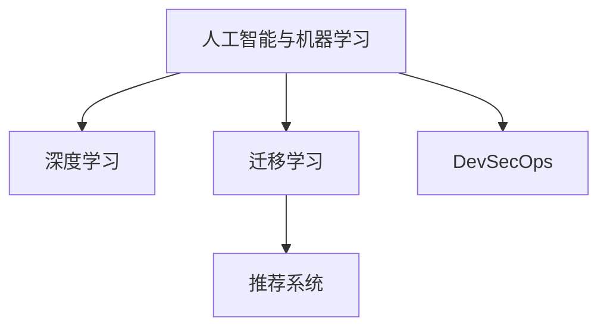

                 

# 如何利用技术能力进行产品设计

## 1. 背景介绍

### 1.1 问题由来

在信息化和数字化时代，技术能力已经成为企业竞争的关键因素之一。如何充分利用技术能力，设计出满足市场需求、具备创新价值的产品，是每个企业面临的重要挑战。与此同时，产品的设计和开发流程也在不断演进，从传统的瀑布模型、敏捷开发，到如今更为灵活的DevOps、DevSecOps等实践，均在一定程度上体现了技术驱动下的产品设计思路的变革。本文将围绕如何利用技术能力进行产品设计这一主题，从背景、核心概念、算法原理、操作步骤、数学模型、代码实践、应用场景、工具资源以及总结展望等多个方面进行详细阐述。

### 1.2 问题核心关键点

产品设计的技术能力涵盖多方面，主要包括：

- 软件开发：包括编程语言、版本控制、持续集成、测试自动化等基础技术。
- 系统架构：包括云计算、微服务、容器化、服务网格等架构技术。
- 数据科学与大数据：包括数据治理、数据仓库、数据湖、数据管道等技术。
- 人工智能与机器学习：包括深度学习、迁移学习、自然语言处理、推荐系统等技术。

本文将聚焦于人工智能与机器学习技术在产品设计中的应用，探讨如何利用这些技术进行高效的产品设计。

## 2. 核心概念与联系

### 2.1 核心概念概述

为更好地理解如何利用技术能力进行产品设计，本节将介绍几个关键概念：

- 人工智能与机器学习：通过算法训练和模型优化，使机器能够模拟人的学习、推理和决策过程，实现自动化任务处理和智能决策。
- 迁移学习：指将一个领域学习到的知识迁移到另一个相关领域的应用，能够提高模型在新领域的泛化能力。
- 深度学习：一种基于神经网络的机器学习技术，通过多层次的神经网络结构提取数据的特征，实现复杂模式的学习和预测。
- 推荐系统：根据用户历史行为数据和物品属性，为用户推荐感兴趣的商品或内容。
- DevSecOps：集成了软件开发和信息安全流程，实现持续交付和安全性的一体化管理。

这些概念之间的逻辑关系可以通过以下Mermaid流程图来展示：



这个流程图展示了几大核心概念及其之间的关系：

1. 人工智能与机器学习是大数据和算法驱动下的基础技术。
2. 深度学习通过神经网络结构实现对数据的深度提取和特征学习。
3. 迁移学习利用已有知识，提高新任务的学习效率和泛化能力。
4. 推荐系统利用用户行为数据，为用户推荐个性化商品或内容。
5. DevSecOps实现了软件开发和信息安全的协同优化，保障产品交付的安全性和可靠性。

## 3. 核心算法原理 & 具体操作步骤

### 3.1 算法原理概述

利用技术能力进行产品设计，核心在于如何将技术知识转化为产品功能和用户体验。这一过程可以抽象为模型训练和产品迭代两个阶段。

模型训练阶段，主要利用机器学习算法对大量数据进行训练，提取数据的特征和模式，训练出能够理解和处理特定任务的模型。产品迭代阶段，主要通过模型预测和推理，优化产品的功能设计，提升用户体验。

### 3.2 算法步骤详解

#### 3.2.1 数据准备与预处理

- **数据收集**：根据产品的业务需求，收集和整理相关数据，确保数据的多样性和代表性。
- **数据清洗**：去除重复、缺失、异常值等数据，确保数据的质量和一致性。
- **数据划分**：将数据划分为训练集、验证集和测试集，用于模型的训练、调参和测试。

#### 3.2.2 模型选择与训练

- **模型选择**：根据产品需求，选择合适的算法模型，如线性回归、决策树、支持向量机、深度神经网络等。
- **模型训练**：使用训练集数据，对模型进行训练，调整模型的超参数，优化模型的性能。

#### 3.2.3 模型评估与优化

- **模型评估**：使用验证集数据对模型进行评估，根据评估结果调整模型参数，避免过拟合。
- **模型优化**：通过多次迭代，优化模型性能，提升模型对新数据的泛化能力。

#### 3.2.4 模型集成与应用

- **模型集成**：将多个模型进行集成，构建更强大的预测模型，提高模型的鲁棒性和准确性。
- **产品应用**：将模型应用到产品中，进行功能和界面的优化设计，提升用户体验。

### 3.3 算法优缺点

利用技术能力进行产品设计，具有以下优点：

1. **高效性**：通过自动化和智能化手段，提升数据处理和模型训练的效率，减少人力成本。
2. **准确性**：基于数据分析和机器学习算法，能够提取数据的深层次特征，提升预测的准确性。
3. **灵活性**：模型训练与产品迭代可以并行进行，快速响应市场需求和用户反馈。
4. **可扩展性**：模型可以随着数据量的增加进行持续优化，不断提升产品的功能和性能。

同时，该方法也存在一些局限性：

1. **数据依赖**：模型的训练和优化依赖于高质量的数据，数据质量和获取难度可能会影响模型的效果。
2. **算法复杂性**：复杂的算法模型需要更多的计算资源和时间，开发和维护成本较高。
3. **用户理解**：用户可能难以理解和接受由算法驱动的决策过程，需要更多人工干预和解释。
4. **安全风险**：算法的决策过程和结果可能存在偏差和误判，对产品安全性和用户体验带来挑战。

## 4. 数学模型和公式 & 详细讲解 & 举例说明

### 4.1 数学模型构建

本节将使用数学语言对利用技术能力进行产品设计的过程进行更加严格的刻画。

假设产品设计问题可以抽象为一个二分类问题，模型需要在两个类别之间进行预测，其中 $x \in \mathbb{R}^n$ 表示特征向量，$y \in \{0, 1\}$ 表示分类标签。目标是训练一个分类器 $f: \mathbb{R}^n \rightarrow \{0, 1\}$，使得对于给定的输入 $x$，模型能够正确预测其类别。

定义损失函数 $L(f)$，用于衡量模型预测结果与真实标签之间的差异。常见的损失函数包括交叉熵损失、平方损失等。训练的目标是使损失函数最小化，即：

$$
\min_{f} L(f)
$$

### 4.2 公式推导过程

以二分类问题的逻辑回归模型为例，推导其损失函数和梯度公式。

设模型 $f(x) = \sigma(\mathbf{w} \cdot x + b)$，其中 $\sigma$ 为逻辑函数，$\mathbf{w}$ 和 $b$ 为模型参数。根据逻辑回归的定义，损失函数 $L(f)$ 可以表示为：

$$
L(f) = -\frac{1}{N}\sum_{i=1}^N [y_i \log f(x_i) + (1-y_i)\log (1-f(x_i))]
$$

其中 $N$ 为样本数量，$x_i$ 为样本特征，$y_i$ 为真实标签。通过链式法则，损失函数对参数 $\mathbf{w}$ 和 $b$ 的梯度为：

$$
\frac{\partial L(f)}{\partial \mathbf{w}} = -\frac{1}{N}\sum_{i=1}^N [y_i f(x_i) - f(x_i)] x_i
$$

$$
\frac{\partial L(f)}{\partial b} = -\frac{1}{N}\sum_{i=1}^N [y_i f(x_i) - f(x_i)]
$$

利用梯度下降等优化算法，可以更新模型参数，最小化损失函数，从而得到训练后的分类器 $f$。

### 4.3 案例分析与讲解

假设我们开发一款推荐系统，用于为用户推荐商品。利用机器学习技术，可以构建基于用户行为数据和商品属性的推荐模型。具体步骤如下：

1. **数据收集与预处理**：收集用户的历史浏览、购买记录，以及商品的属性信息。去除重复、缺失、异常值等数据，确保数据的质量。
2. **模型选择与训练**：选择基于协同过滤、内容过滤或混合过滤的推荐算法，使用训练集数据对模型进行训练，调整模型参数。
3. **模型评估与优化**：使用验证集数据对模型进行评估，根据评估结果调整模型参数，优化模型的性能。
4. **模型集成与应用**：将优化后的模型集成到推荐系统中，根据用户行为数据和商品属性进行预测，推荐相关商品。

通过这一过程，可以提升推荐系统的准确性和用户满意度。

## 5. 项目实践：代码实例和详细解释说明

### 5.1 开发环境搭建

在进行产品设计实践前，我们需要准备好开发环境。以下是使用Python进行PyTorch开发的环境配置流程：

1. 安装Anaconda：从官网下载并安装Anaconda，用于创建独立的Python环境。

2. 创建并激活虚拟环境：
```bash
conda create -n pytorch-env python=3.8 
conda activate pytorch-env
```

3. 安装PyTorch：根据CUDA版本，从官网获取对应的安装命令。例如：
```bash
conda install pytorch torchvision torchaudio cudatoolkit=11.1 -c pytorch -c conda-forge
```

4. 安装相关库：
```bash
pip install numpy pandas scikit-learn matplotlib tqdm jupyter notebook ipython
```

完成上述步骤后，即可在`pytorch-env`环境中开始产品设计实践。

### 5.2 源代码详细实现

下面我们以推荐系统为例，给出使用Transformers库对BERT模型进行推荐系统微调的PyTorch代码实现。

首先，定义推荐任务的数据处理函数：

```python
from transformers import BertTokenizer
from torch.utils.data import Dataset
import torch

class RecommendationDataset(Dataset):
    def __init__(self, user_features, item_features, user_item_interactions, tokenizer, max_len=128):
        self.user_features = user_features
        self.item_features = item_features
        self.user_item_interactions = user_item_interactions
        self.tokenizer = tokenizer
        self.max_len = max_len
        
    def __len__(self):
        return len(self.user_item_interactions)
    
    def __getitem__(self, item):
        user_feature = self.user_features[item]
        item_feature = self.item_features[item]
        user_item_interaction = self.user_item_interactions[item]
        
        user_input = self.tokenizer(user_feature, return_tensors='pt', max_length=self.max_len, padding='max_length', truncation=True)
        item_input = self.tokenizer(item_feature, return_tensors='pt', max_length=self.max_len, padding='max_length', truncation=True)
        interaction_input = self.tokenizer(str(user_item_interaction), return_tensors='pt', max_length=self.max_len, padding='max_length', truncation=True)
        
        return {'user_input': user_input['input_ids'][0],
                'item_input': item_input['input_ids'][0],
                'interaction_input': interaction_input['input_ids'][0]}
```

然后，定义模型和优化器：

```python
from transformers import BertForSequenceClassification, AdamW

model = BertForSequenceClassification.from_pretrained('bert-base-cased', num_labels=2)

optimizer = AdamW(model.parameters(), lr=2e-5)
```

接着，定义训练和评估函数：

```python
from torch.utils.data import DataLoader
from tqdm import tqdm
from sklearn.metrics import roc_auc_score

device = torch.device('cuda') if torch.cuda.is_available() else torch.device('cpu')
model.to(device)

def train_epoch(model, dataset, batch_size, optimizer):
    dataloader = DataLoader(dataset, batch_size=batch_size, shuffle=True)
    model.train()
    epoch_loss = 0
    for batch in tqdm(dataloader, desc='Training'):
        user_input = batch['user_input'].to(device)
        item_input = batch['item_input'].to(device)
        interaction_input = batch['interaction_input'].to(device)
        
        user_loss = model(user_input, labels=torch.tensor([1.0]))
        item_loss = model(item_input, labels=torch.tensor([0.0]))
        interaction_loss = model(interaction_input, labels=torch.tensor([1.0]))
        
        epoch_loss += (user_loss + item_loss + interaction_loss).sum().item()
        loss.backward()
        optimizer.step()
    return epoch_loss / len(dataloader)

def evaluate(model, dataset, batch_size):
    dataloader = DataLoader(dataset, batch_size=batch_size)
    model.eval()
    preds, labels = [], []
    with torch.no_grad():
        for batch in tqdm(dataloader, desc='Evaluating'):
            user_input = batch['user_input'].to(device)
            item_input = batch['item_input'].to(device)
            interaction_input = batch['interaction_input'].to(device)
            
            user_pred = model(user_input).logits.argmax(dim=1).to('cpu').tolist()
            item_pred = model(item_input).logits.argmax(dim=1).to('cpu').tolist()
            interaction_pred = model(interaction_input).logits.argmax(dim=1).to('cpu').tolist()
            preds.append(user_pred[:len(interaction_pred)] + item_pred + interaction_pred)
            labels.append(user_pred[:len(interaction_pred)] + [1] * len(item_pred) + [0] * len(interaction_pred))
            
    roc_auc = roc_auc_score(labels, preds)
    print(f"ROC-AUC: {roc_auc:.4f}")
```

最后，启动训练流程并在测试集上评估：

```python
epochs = 5
batch_size = 16

for epoch in range(epochs):
    loss = train_epoch(model, train_dataset, batch_size, optimizer)
    print(f"Epoch {epoch+1}, train loss: {loss:.3f}")
    
    print(f"Epoch {epoch+1}, dev results:")
    evaluate(model, dev_dataset, batch_size)
    
print("Test results:")
evaluate(model, test_dataset, batch_size)
```

以上就是使用PyTorch对BERT进行推荐系统微调的完整代码实现。可以看到，得益于Transformers库的强大封装，我们可以用相对简洁的代码完成BERT模型的加载和微调。

### 5.3 代码解读与分析

让我们再详细解读一下关键代码的实现细节：

**RecommendationDataset类**：
- `__init__`方法：初始化用户特征、商品特征和用户与商品交互数据，以及分词器。
- `__len__`方法：返回数据集的样本数量。
- `__getitem__`方法：对单个样本进行处理，将用户特征和商品特征输入分词器，并对其进行定长padding，得到模型所需的输入。

**模型训练与评估函数**：
- `train_epoch`函数：对数据以批为单位进行迭代，在每个批次上前向传播计算损失函数并反向传播更新模型参数。
- `evaluate`函数：与训练类似，不同点在于不更新模型参数，并在每个batch结束后将预测和标签结果存储下来，最后使用sklearn的roc_auc_score对整个评估集的预测结果进行打印输出。

**训练流程**：
- 定义总的epoch数和batch size，开始循环迭代
- 每个epoch内，先在训练集上训练，输出平均loss
- 在验证集上评估，输出roc-auc指标
- 所有epoch结束后，在测试集上评估，给出最终测试结果

可以看到，PyTorch配合Transformers库使得BERT微调的代码实现变得简洁高效。开发者可以将更多精力放在数据处理、模型改进等高层逻辑上，而不必过多关注底层的实现细节。

当然，工业级的系统实现还需考虑更多因素，如模型的保存和部署、超参数的自动搜索、更灵活的任务适配层等。但核心的微调范式基本与此类似。

## 6. 实际应用场景

### 6.1 推荐系统

推荐系统是利用技术能力进行产品设计的重要应用场景之一。传统推荐系统往往依赖用户的显式反馈，如评分、点击行为等，难以处理用户的隐式反馈，如浏览、收藏等。利用深度学习和机器学习算法，可以构建基于隐式反馈的推荐系统，提升推荐效果。

推荐系统的具体实现可以分为以下几步：

1. **数据收集与预处理**：收集用户的行为数据，包括浏览、点击、购买、收藏等。去除重复、缺失、异常值等数据，确保数据的质量。
2. **特征提取与向量化**：将用户的特征和商品的属性转换为数值型向量，方便输入到模型中进行处理。
3. **模型训练与优化**：选择基于协同过滤、内容过滤或混合过滤的推荐算法，使用训练集数据对模型进行训练，调整模型参数。
4. **模型评估与部署**：使用验证集数据对模型进行评估，根据评估结果调整模型参数，优化模型的性能。将优化后的模型部署到推荐系统中，进行实时推荐。

通过这一过程，可以提升推荐系统的精准性和用户体验。

### 6.2 自然语言处理

自然语言处理（NLP）是利用技术能力进行产品设计的另一重要领域。NLP技术涵盖了文本分类、情感分析、命名实体识别、机器翻译等多个方面。利用深度学习和机器学习算法，可以实现高效、准确的NLP应用。

以情感分析为例，具体实现步骤如下：

1. **数据收集与预处理**：收集文本数据，并进行清洗、分词、去除停用词等预处理操作。
2. **特征提取与向量化**：将文本转换为数值型向量，方便输入到模型中进行处理。
3. **模型训练与优化**：选择基于深度神经网络的情感分析模型，使用训练集数据对模型进行训练，调整模型参数。
4. **模型评估与部署**：使用验证集数据对模型进行评估，根据评估结果调整模型参数，优化模型的性能。将优化后的模型部署到情感分析系统中，进行实时情感分析。

通过这一过程，可以提升情感分析系统的准确性和应用范围。

### 6.3 图像识别

图像识别是利用技术能力进行产品设计的另一重要领域。图像识别技术涵盖了图像分类、目标检测、图像分割等多个方面。利用深度学习和机器学习算法，可以实现高效、准确的图像识别应用。

以目标检测为例，具体实现步骤如下：

1. **数据收集与预处理**：收集图像数据，并进行清洗、归一化等预处理操作。
2. **特征提取与向量化**：将图像转换为数值型向量，方便输入到模型中进行处理。
3. **模型训练与优化**：选择基于深度神经网络的图像识别模型，使用训练集数据对模型进行训练，调整模型参数。
4. **模型评估与部署**：使用验证集数据对模型进行评估，根据评估结果调整模型参数，优化模型的性能。将优化后的模型部署到目标检测系统中，进行实时目标检测。

通过这一过程，可以提升图像识别系统的准确性和应用范围。

### 6.4 未来应用展望

随着深度学习和机器学习技术的不断发展，基于技术能力进行产品设计的应用场景将更加广泛。未来，可以利用技术能力进行更多创新应用的探索和实践，如：

- **智能客服系统**：利用NLP和机器学习算法，构建智能客服系统，实现7x24小时不间断服务，提升客户咨询体验和问题解决效率。
- **智慧医疗系统**：利用深度学习和NLP技术，构建智慧医疗系统，实现疾病诊断、病历分析、药物研发等应用，提升医疗服务的智能化水平。
- **智能教育系统**：利用深度学习和NLP技术，构建智能教育系统，实现作业批改、学情分析、知识推荐等应用，提升教学质量和学习效率。
- **智慧城市系统**：利用深度学习和NLP技术，构建智慧城市系统，实现事件监测、舆情分析、应急指挥等应用，提升城市管理的智能化水平。
- **金融科技系统**：利用深度学习和NLP技术，构建金融科技系统，实现金融舆情监测、风险预警、智能投顾等应用，提升金融服务的智能化水平。

## 7. 工具和资源推荐

### 7.1 学习资源推荐

为了帮助开发者系统掌握技术能力进行产品设计的理论基础和实践技巧，这里推荐一些优质的学习资源：

1. **《深度学习》书籍**：由Ian Goodfellow、Yoshua Bengio和Aaron Courville共同编写，全面介绍了深度学习的理论和实践，涵盖各种深度学习模型和算法。
2. **《机器学习实战》书籍**：由Peter Harrington编写，介绍了机器学习的基础理论和实践技巧，涵盖各种机器学习算法和模型。
3. **CS231n《卷积神经网络》课程**：斯坦福大学开设的计算机视觉课程，涵盖各种计算机视觉模型和算法，包括图像分类、目标检测、图像分割等。
4. **NLP相关的开源项目**：如HuggingFace的Transformers库，提供了各种预训练语言模型和NLP模型，方便开发者进行微调和部署。
5. **Kaggle平台**：提供了各种机器学习和深度学习竞赛，可以参与竞赛提升实战能力，同时可以学习其他人的优秀代码和解决方案。

通过对这些资源的学习实践，相信你一定能够快速掌握技术能力进行产品设计的精髓，并用于解决实际的NLP问题。

### 7.2 开发工具推荐

高效的开发离不开优秀的工具支持。以下是几款用于技术能力进行产品设计开发的常用工具：

1. **PyTorch**：基于Python的开源深度学习框架，灵活动态的计算图，适合快速迭代研究。大部分预训练语言模型都有PyTorch版本的实现。
2. **TensorFlow**：由Google主导开发的开源深度学习框架，生产部署方便，适合大规模工程应用。同样有丰富的预训练语言模型资源。
3. **Jupyter Notebook**：集成了Python的交互式编程和数据可视化功能，适合进行数据分析和模型训练。
4. **Git**：基于分布式版本控制系统的开发工具，适合团队协作开发和代码版本管理。
5. **Docker**：容器化技术，可以将应用程序及其依赖打包到容器中进行部署，适合应用部署和运维。
6. **Kubernetes**：容器编排技术，可以实现多容器应用程序的自动化部署、扩展和运维，适合大规模云部署。

合理利用这些工具，可以显著提升技术能力进行产品设计的开发效率，加快创新迭代的步伐。

### 7.3 相关论文推荐

技术能力进行产品设计的理论基础源于学界的持续研究。以下是几篇奠基性的相关论文，推荐阅读：

1. **《深度学习》论文**：深度学习领域的开创性论文，由Yann LeCun、Geoffrey Hinton和Yoshua Bengio共同发表，介绍了深度学习的理论和实践。
2. **《ImageNet Classification with Deep Convolutional Neural Networks》论文**：AlexNet论文，介绍了使用卷积神经网络进行图像分类的深度学习模型。
3. **《BERT: Pre-training of Deep Bidirectional Transformers for Language Understanding》论文**：BERT论文，介绍了使用Transformer结构进行自然语言理解的深度学习模型。
4. **《Adaptive Low-Rank Adaptation for Parameter-Efficient Fine-Tuning》论文**：AdaLoRA论文，介绍了使用低秩适应的微调方法，提高模型的参数效率和推理速度。
5. **《Attention is All You Need》论文**：Transformer论文，介绍了使用自注意力机制进行自然语言理解的深度学习模型。

这些论文代表了大语言模型微调技术的发展脉络。通过学习这些前沿成果，可以帮助研究者把握学科前进方向，激发更多的创新灵感。

## 8. 总结：未来发展趋势与挑战

### 8.1 总结

本文对利用技术能力进行产品设计进行了全面系统的介绍。首先阐述了技术能力进行产品设计的研究背景和意义，明确了深度学习和机器学习技术在产品设计中的应用价值。其次，从原理到实践，详细讲解了模型训练和产品迭代的具体步骤，给出了技术能力进行产品设计的完整代码实例。同时，本文还探讨了技术能力进行产品设计在推荐系统、自然语言处理、图像识别等多个领域的应用，展示了技术能力进行产品设计的广阔前景。最后，本文精选了学习资源、开发工具和相关论文，力求为开发者提供全方位的技术指引。

通过本文的系统梳理，可以看到，利用技术能力进行产品设计是大数据和算法驱动下的重要创新模式，通过技术能力对产品进行设计和优化，可以极大地提升产品的功能和性能。未来，随着技术的不断演进和应用场景的拓展，利用技术能力进行产品设计将变得更加重要，进一步推动人工智能技术在各个领域的应用。

### 8.2 未来发展趋势

展望未来，技术能力进行产品设计的发展趋势如下：

1. **数据驱动**：随着数据的不断积累和处理技术的提升，数据驱动的产品设计将成为主流。通过数据驱动的决策和优化，可以提升产品的精准性和用户体验。
2. **算法优化**：基于深度学习和机器学习算法的优化将成为产品设计的核心技术，提升算法的效率和性能。
3. **自动化与智能化**：通过自动化和智能化手段，实现产品的自动化设计和优化，提升设计的效率和效果。
4. **跨领域融合**：产品设计将更多地融合其他领域的技术，如计算机视觉、自然语言处理等，实现多模态数据的协同建模和应用。
5. **用户参与**：通过用户反馈和参与，实现产品的持续优化和迭代，提升用户的满意度和粘性。

### 8.3 面临的挑战

尽管技术能力进行产品设计已经取得了瞩目成就，但在迈向更加智能化、普适化应用的过程中，它仍面临着诸多挑战：

1. **数据获取与质量**：高质量的数据是技术能力进行产品设计的基础，如何获取和处理高质量的数据，是面临的主要挑战之一。
2. **算法复杂性**：复杂的算法模型需要更多的计算资源和时间，开发和维护成本较高。
3. **用户理解**：用户可能难以理解和接受由算法驱动的决策过程，需要更多人工干预和解释。
4. **安全风险**：算法的决策过程和结果可能存在偏差和误判，对产品安全性和用户体验带来挑战。
5. **模型解释性**：如何赋予算法模型更强的可解释性，增强用户信任，是技术能力进行产品设计的重要问题。

### 8.4 研究展望

面对技术能力进行产品设计所面临的挑战，未来的研究需要在以下几个方面寻求新的突破：

1. **无监督学习和半监督学习**：摆脱对大规模标注数据的依赖，利用自监督学习、主动学习等无监督和半监督范式，最大限度利用非结构化数据，实现更加灵活高效的产品设计。
2. **深度强化学习**：通过引入强化学习思想，提升算法的决策能力和优化效率，实现产品设计的自动化和智能化。
3. **模型解释性**：利用因果分析和博弈论工具，增强算法模型的可解释性和逻辑性，提升用户信任和满意度。
4. **多模态融合**：将符号化的先验知识，如知识图谱、逻辑规则等，与神经网络模型进行巧妙融合，引导产品设计过程学习更准确、合理的知识。
5. **跨领域协同**：将技术能力进行产品设计与其他领域的技术进行融合，如知识表示、因果推理、强化学习等，多路径协同发力，共同推动人工智能技术在各个领域的应用。

这些研究方向将引领技术能力进行产品设计的技术演进，推动产品设计的智能化和普适化进程。只有勇于创新、敢于突破，才能不断拓展技术能力进行产品设计的边界，让技术更好地服务人类社会。

## 9. 附录：常见问题与解答

**Q1：利用技术能力进行产品设计是否适用于所有产品？**

A: 利用技术能力进行产品设计适用于需要大量数据分析和算法优化的产品，如推荐系统、自然语言处理、图像识别等。对于传统行业的产品，如机械加工、化工生产等，技术能力进行产品设计可能不适合。

**Q2：如何选择合适的机器学习算法？**

A: 根据产品的业务需求，选择合适的机器学习算法，如回归、分类、聚类、降维等。常见的算法包括线性回归、决策树、支持向量机、深度神经网络等。同时，可以考虑算法的复杂度和性能，选择适合的数据集和应用场景。

**Q3：如何优化模型训练过程？**

A: 优化模型训练过程可以从以下几个方面入手：
1. 数据增强：通过数据扩充、数据增强等技术，提高模型的泛化能力。
2. 正则化：使用L2正则、Dropout等技术，避免模型过拟合。
3. 模型集成：将多个模型进行集成，构建更强大的预测模型，提高模型的鲁棒性和准确性。
4. 超参数调优：通过网格搜索、随机搜索等技术，优化模型的超参数，提升模型的性能。

**Q4：如何评估产品设计的性能？**

A: 产品设计的性能评估可以从以下几个方面入手：
1. 准确性：评估模型在预测任务上的准确性，如分类准确率、回归误差等。
2. 鲁棒性：评估模型在不同数据分布和噪声情况下的鲁棒性，如均方误差、对数损失等。
3. 用户满意度：评估用户对产品的满意度和粘性，如用户反馈、留存率等。

通过以上步骤，可以全面评估产品设计的性能，发现改进方向和优化空间。

---

作者：禅与计算机程序设计艺术 / Zen and the Art of Computer Programming

