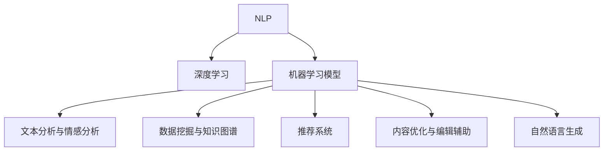

                 

# 如何利用技术能力进行内容创作

> 关键词：技术驱动,内容创作,人工智能,机器学习,自然语言处理,NLP,深度学习,机器学习模型,数据挖掘,文本分析,自动化,自然语言生成,语言模型

## 1. 背景介绍

### 1.1 问题由来
随着互联网和移动互联网的快速发展，内容创作正成为数字时代的重要活动。传统的内容创作方式依赖于专业作者，成本高、效率低。而利用技术能力进行内容创作，可以大大降低创作门槛，提升创作效率，推动内容创作向规模化、个性化方向发展。

### 1.2 问题核心关键点
利用技术能力进行内容创作，主要包括以下几个关键点：
- 自动化内容生成：通过机器学习模型，实现自动生成新闻、文章、广告等内容。
- 文本分析与情感分析：利用自然语言处理(NLP)技术，对文本进行语义理解、情感判断等分析。
- 数据挖掘与知识图谱：从海量数据中挖掘有价值的信息，构建知识图谱，辅助内容创作。
- 个性化推荐与推荐系统：根据用户兴趣，推荐相关内容，增强用户粘性。
- 内容优化与编辑辅助：利用模型识别内容瑕疵，自动校对和优化，提升内容质量。
- 语言模型与自然语言生成：通过深度学习模型，实现文本生成、自动翻译等任务。

这些技术能力的综合应用，将极大提升内容创作的效率和质量，推动内容产业的数字化转型。

## 2. 核心概念与联系

### 2.1 核心概念概述

为更好地理解利用技术能力进行内容创作的方法，本节将介绍几个关键概念：

- 自然语言处理(Natural Language Processing, NLP)：涉及计算机与人类语言交互，涵盖语言模型、文本分析、情感分析、机器翻译等技术。
- 深度学习(Deep Learning)：一种基于神经网络的机器学习技术，擅长处理高维、非线性数据。
- 机器学习模型：包括监督学习、无监督学习、强化学习等多种方法，用于处理分类、回归、聚类等任务。
- 文本分析与情感分析：从文本中提取特征、理解语义、判断情感的方法。
- 数据挖掘与知识图谱：从数据中提取知识，构建实体关系图谱的技术。
- 推荐系统：利用算法推荐用户可能感兴趣的内容，提升用户满意度。
- 内容优化与编辑辅助：利用模型识别内容瑕疵、提供优化建议的方法。
- 自然语言生成(Natural Language Generation, NLG)：通过模型生成自然语言文本的技术。

这些概念之间通过以下Mermaid流程图展示其相互联系：



## 3. 核心算法原理 & 具体操作步骤
### 3.1 算法原理概述

利用技术能力进行内容创作的根本在于，通过机器学习模型，将文本数据转换为知识表示，并利用这些知识进行自动化生成、情感分析、推荐等任务。核心算法包括：

- 自然语言处理(NLP)：通过词向量表示、语言模型、序列标注等技术，对文本进行语义理解和特征提取。
- 深度学习模型：如循环神经网络(RNN)、长短期记忆网络(LSTM)、注意力机制(Attention)、Transformer等，用于处理序列数据和捕捉上下文信息。
- 机器学习算法：如分类算法、聚类算法、推荐算法等，用于对文本数据进行分类、聚类、推荐等任务。
- 自然语言生成(NLG)：通过序列生成模型，如Seq2Seq模型、变分自编码器(VAE)、生成对抗网络(GAN)等，实现文本生成和翻译等任务。

这些算法的组合应用，可以完成从文本分析到内容生成的全流程自动化操作，大幅提升内容创作的效率和质量。

### 3.2 算法步骤详解

基于技术能力进行内容创作的流程大致包括以下几个步骤：

**Step 1: 数据准备**
- 收集文本数据，包括新闻、文章、社交媒体内容等。
- 进行文本清洗、分词、词向量表示等预处理。
- 对数据进行标注，如情感分类、主题分类、实体关系标注等。

**Step 2: 模型训练**
- 选择适当的深度学习模型，如BERT、GPT、GRU等，进行预训练或微调。
- 使用标注数据进行监督学习，优化模型参数，使其能够进行自动文本分类、情感分析、推荐等任务。

**Step 3: 内容生成与优化**
- 利用训练好的模型，对文本进行自动化生成、情感分析、推荐等操作。
- 根据生成的内容进行校对、优化，确保内容质量。
- 进行A/B测试，评估不同算法、模型、策略的效果，不断迭代改进。

**Step 4: 集成与部署**
- 将优化后的模型集成到内容创作系统中。
- 部署到服务器或云平台，确保系统稳定运行。
- 提供API接口，支持第三方调用和集成。

### 3.3 算法优缺点

利用技术能力进行内容创作的方法具有以下优点：
1. 提高效率：自动化生成、情感分析、推荐等操作大幅缩短内容创作时间。
2. 降低成本：大幅减少对专业作者的需求，降低创作成本。
3. 提高质量：利用深度学习模型，可以生成高质量、多样化的文本内容。
4. 增强个性化：根据用户兴趣，推荐个性化内容，提升用户满意度。

同时，该方法也存在一定的局限性：
1. 依赖数据质量：模型的性能很大程度上取决于数据的质量和标注的准确性。
2. 模型复杂度高：深度学习模型训练复杂，计算资源需求高。
3. 可解释性不足：深度学习模型的黑盒特性，使得结果难以解释和调试。
4. 输出依赖上下文：模型生成的文本可能依赖特定的上下文，泛化能力有限。
5. 需要持续优化：需要不断收集反馈，对模型进行迭代优化，才能保持其性能。

尽管存在这些局限性，但就目前而言，利用技术能力进行内容创作的方法已经在大规模内容平台得到广泛应用，成为内容创作的主要手段。未来相关研究的重点在于如何进一步降低数据依赖，提高模型的鲁棒性和可解释性，以及增强其跨领域迁移能力。

### 3.4 算法应用领域

利用技术能力进行内容创作的方法已经在多个领域得到应用，以下是几个典型的应用场景：

- 新闻和内容聚合：利用文本分类和情感分析技术，自动筛选和推荐新闻、文章等优质内容，提升用户体验。
- 社交媒体内容生成：通过自动生成和推荐技术，辅助用户生成有趣的社交媒体内容，增强平台粘性。
- 广告创意生成：利用自然语言生成技术，自动生成广告文案，提升广告效果。
- 博客和文章创作：使用文本生成技术，辅助用户创作高质量的博客和文章，提升创作效率。
- 个性化推荐系统：根据用户兴趣和行为，推荐相关内容，提升用户满意度。
- 内容审核与优化：利用文本分析技术，自动识别和校对文本内容，提高内容质量。

除了上述这些经典应用外，技术能力还在诸多领域得到创新性的应用，如可控文本生成、主题建模、问答系统等，为内容创作带来新的突破。随着预训练语言模型和微调方法的不断进步，相信内容创作技术将在更广阔的应用领域大放异彩。

## 4. 数学模型和公式 & 详细讲解  
### 4.1 数学模型构建

本文以文本分类和情感分析为例，介绍基于技术能力进行内容创作的数学模型构建过程。

记文本数据为 $D=\{(x_i,y_i)\}_{i=1}^N$，其中 $x_i$ 表示文本，$y_i \in \{1,2,...,K\}$ 表示分类标签。

定义模型 $M$ 在输入 $x$ 上的输出为 $\hat{y}=M(x)$，表示预测的分类标签。

模型 $M$ 在训练集 $D$ 上的经验风险为：

$$
\mathcal{L}(M)=\frac{1}{N}\sum_{i=1}^N \ell(M(x_i),y_i)
$$

其中 $\ell$ 为损失函数，如交叉熵损失函数：

$$
\ell(M(x_i),y_i)=-\log\frac{M(x_i)}{\sum_{j=1}^K M(x_i)}
$$

目标是最小化经验风险，即找到最优参数 $\theta$：

$$
\theta^* = \mathop{\arg\min}_{\theta} \mathcal{L}(M_{\theta})
$$

其中 $M_{\theta}$ 表示参数为 $\theta$ 的模型。

### 4.2 公式推导过程

以基于BERT模型的情感分类为例，推导情感分析的公式：

首先，将文本 $x$ 输入BERT模型，得到表示为 $h(x)$。

定义分类器 $C$ 为线性分类器：

$$
C(h(x))=W^Th(x)+b
$$

其中 $W^T$ 和 $b$ 为分类器参数。

定义损失函数为交叉熵损失：

$$
\ell(M(x_i),y_i)=-[y_i\log\sigma(C(h(x_i)))+(1-y_i)\log(1-\sigma(C(h(x_i))))
$$

其中 $\sigma(z)=1/(1+e^{-z})$ 为sigmoid函数。

最小化经验风险，求解最优参数 $W^T$ 和 $b$：

$$
W^T,b = \mathop{\arg\min}_{W^T,b} \mathcal{L}(M_{W^T,b})
$$

### 4.3 案例分析与讲解

以情感分析为例，介绍BERT模型的应用。

**数据准备**
- 收集电影评论数据，将评论和情感标签组成标注数据集。
- 对数据进行预处理，包括分词、去除停用词等。

**模型训练**
- 使用预训练的BERT模型，通过微调的方式进行训练。
- 在训练过程中，调整分类器参数 $W^T$ 和 $b$，最小化交叉熵损失。

**内容生成与优化**
- 利用训练好的模型，对新的评论文本进行情感分析，输出情感标签。
- 根据模型预测结果，对文本进行优化和调整，确保情感分析准确性。

**集成与部署**
- 将模型集成到情感分析系统中，支持API调用。
- 部署到服务器，提供实时情感分析服务。

## 5. 项目实践：代码实例和详细解释说明
### 5.1 开发环境搭建

在进行内容创作技术实践前，我们需要准备好开发环境。以下是使用Python进行PyTorch开发的环境配置流程：

1. 安装Anaconda：从官网下载并安装Anaconda，用于创建独立的Python环境。

2. 创建并激活虚拟环境：
```bash
conda create -n pytorch-env python=3.8 
conda activate pytorch-env
```

3. 安装PyTorch：根据CUDA版本，从官网获取对应的安装命令。例如：
```bash
conda install pytorch torchvision torchaudio cudatoolkit=11.1 -c pytorch -c conda-forge
```

4. 安装Transformers库：
```bash
pip install transformers
```

5. 安装各类工具包：
```bash
pip install numpy pandas scikit-learn matplotlib tqdm jupyter notebook ipython
```

完成上述步骤后，即可在`pytorch-env`环境中开始内容创作技术的实践。

### 5.2 源代码详细实现

这里我们以利用BERT模型进行情感分析为例，给出使用PyTorch进行代码实现的详细流程：

首先，定义情感分类任务的数据处理函数：

```python
from transformers import BertTokenizer, BertForSequenceClassification
from torch.utils.data import Dataset
import torch

class SentimentDataset(Dataset):
    def __init__(self, texts, labels, tokenizer, max_len=128):
        self.texts = texts
        self.labels = labels
        self.tokenizer = tokenizer
        self.max_len = max_len
        
    def __len__(self):
        return len(self.texts)
    
    def __getitem__(self, item):
        text = self.texts[item]
        label = self.labels[item]
        
        encoding = self.tokenizer(text, return_tensors='pt', max_length=self.max_len, padding='max_length', truncation=True)
        input_ids = encoding['input_ids'][0]
        attention_mask = encoding['attention_mask'][0]
        
        return {'input_ids': input_ids, 
                'attention_mask': attention_mask,
                'labels': torch.tensor(label, dtype=torch.long)}
```

然后，定义模型和优化器：

```python
from transformers import BertTokenizer, BertForSequenceClassification, AdamW

model = BertForSequenceClassification.from_pretrained('bert-base-cased', num_labels=2)

optimizer = AdamW(model.parameters(), lr=2e-5)
```

接着，定义训练和评估函数：

```python
from torch.utils.data import DataLoader
from tqdm import tqdm
from sklearn.metrics import accuracy_score

device = torch.device('cuda') if torch.cuda.is_available() else torch.device('cpu')
model.to(device)

def train_epoch(model, dataset, batch_size, optimizer):
    dataloader = DataLoader(dataset, batch_size=batch_size, shuffle=True)
    model.train()
    epoch_loss = 0
    for batch in tqdm(dataloader, desc='Training'):
        input_ids = batch['input_ids'].to(device)
        attention_mask = batch['attention_mask'].to(device)
        labels = batch['labels'].to(device)
        model.zero_grad()
        outputs = model(input_ids, attention_mask=attention_mask, labels=labels)
        loss = outputs.loss
        epoch_loss += loss.item()
        loss.backward()
        optimizer.step()
    return epoch_loss / len(dataloader)

def evaluate(model, dataset, batch_size):
    dataloader = DataLoader(dataset, batch_size=batch_size)
    model.eval()
    preds, labels = [], []
    with torch.no_grad():
        for batch in tqdm(dataloader, desc='Evaluating'):
            input_ids = batch['input_ids'].to(device)
            attention_mask = batch['attention_mask'].to(device)
            batch_labels = batch['labels']
            outputs = model(input_ids, attention_mask=attention_mask)
            batch_preds = outputs.logits.argmax(dim=1).to('cpu').tolist()
            batch_labels = batch_labels.to('cpu').tolist()
            for pred, label in zip(batch_preds, batch_labels):
                preds.append(pred)
                labels.append(label)
                
    print("Accuracy: {:.2f}%".format(accuracy_score(labels, preds)))
```

最后，启动训练流程并在测试集上评估：

```python
epochs = 5
batch_size = 16

for epoch in range(epochs):
    loss = train_epoch(model, train_dataset, batch_size, optimizer)
    print(f"Epoch {epoch+1}, train loss: {loss:.3f}")
    
    print(f"Epoch {epoch+1}, dev accuracy: {:.2f}%".format(accuracy_score(dev_labels, dev_preds)))
    
print("Test accuracy: {:.2f}%".format(accuracy_score(test_labels, test_preds)))
```

以上就是利用BERT模型进行情感分析的完整代码实现。可以看到，PyTorch和Transformers库使得模型训练和评估变得简洁高效。

### 5.3 代码解读与分析

让我们再详细解读一下关键代码的实现细节：

**SentimentDataset类**：
- `__init__`方法：初始化文本、标签、分词器等关键组件。
- `__len__`方法：返回数据集的样本数量。
- `__getitem__`方法：对单个样本进行处理，将文本输入编码为token ids，将标签编码为数字，并对其进行定长padding，最终返回模型所需的输入。

**model、optimizer定义**：
- 使用BertForSequenceClassification定义情感分类模型，指定标签数为2。
- 使用AdamW优化器，设置学习率为2e-5。

**训练和评估函数**：
- 使用PyTorch的DataLoader对数据集进行批次化加载，供模型训练和推理使用。
- 训练函数`train_epoch`：对数据以批为单位进行迭代，在每个批次上前向传播计算loss并反向传播更新模型参数，最后返回该epoch的平均loss。
- 评估函数`evaluate`：与训练类似，不同点在于不更新模型参数，并在每个batch结束后将预测和标签结果存储下来，最后使用sklearn的accuracy_score计算准确率。

**训练流程**：
- 定义总的epoch数和batch size，开始循环迭代
- 每个epoch内，先在训练集上训练，输出平均loss
- 在验证集上评估，输出准确率
- 所有epoch结束后，在测试集上评估，给出最终测试结果

可以看到，PyTorch配合Transformers库使得BERT情感分析的代码实现变得简洁高效。开发者可以将更多精力放在数据处理、模型改进等高层逻辑上，而不必过多关注底层的实现细节。

当然，工业级的系统实现还需考虑更多因素，如模型的保存和部署、超参数的自动搜索、更灵活的任务适配层等。但核心的情感分析范式基本与此类似。

## 6. 实际应用场景
### 6.1 智能客服系统

基于内容创作技术，智能客服系统可以实现更加高效、智能的客户服务。利用自然语言处理技术，智能客服可以快速理解和回应客户问题，提升客户满意度。

在技术实现上，可以收集企业内部的历史客服对话记录，利用文本分类和情感分析技术，对常见问题进行分类和标注。在此基础上，利用预训练模型进行微调，使得智能客服系统能够自动理解客户意图，匹配最合适的答案模板进行回复。对于客户提出的新问题，还可以接入检索系统实时搜索相关内容，动态组织生成回答。如此构建的智能客服系统，能大幅提升客户咨询体验和问题解决效率。

### 6.2 金融舆情监测

金融机构需要实时监测市场舆论动向，以便及时应对负面信息传播，规避金融风险。传统的人工监测方式成本高、效率低，难以应对网络时代海量信息爆发的挑战。利用情感分析技术，金融舆情监测系统可以自动识别和分类新闻、评论等文本，快速判断舆情情绪和趋势，及时预警，帮助金融机构快速应对潜在风险。

在技术实现上，可以收集金融领域相关的新闻、报道、评论等文本数据，利用情感分析技术对文本进行情绪判断，提取关键信息，构建舆情画像。将舆情画像与预设的阈值进行比较，一旦发现情绪波动异常，系统便会自动预警，帮助金融机构快速应对。

### 6.3 个性化推荐系统

当前的推荐系统往往只依赖用户的历史行为数据进行物品推荐，无法深入理解用户的真实兴趣偏好。利用内容创作技术，个性化推荐系统可以更好地挖掘用户行为背后的语义信息，从而提供更精准、多样的推荐内容。

在技术实现上，可以收集用户浏览、点击、评论、分享等行为数据，提取和用户交互的物品标题、描述、标签等文本内容。利用预训练语言模型对文本内容进行语义理解，提取用户兴趣点。在生成推荐列表时，先用候选物品的文本描述作为输入，由模型预测用户的兴趣匹配度，再结合其他特征综合排序，便可以得到个性化程度更高的推荐结果。

### 6.4 未来应用展望

随着内容创作技术的不断发展，未来的应用场景将更加广泛。以下列举几个具有潜力的未来应用方向：

- 智能新闻编辑：利用自动生成和情感分析技术，辅助新闻编辑生成高质量新闻报道。
- 自动广告创意：利用文本生成技术，自动生成广告文案，提升广告效果。
- 虚拟播报人：利用自然语言生成技术，创建虚拟播报人，实现新闻播报、天气预报等功能。
- 自动生成书籍：利用文本生成技术，自动生成小说、散文等文学作品。
- 智能客户访谈：利用自动生成和情感分析技术，创建智能客户访谈机器人，实现客户反馈收集和情感分析。
- 自动化研究报告：利用文本生成和情感分析技术，自动化生成研究报告，提升研究效率。

## 7. 工具和资源推荐
### 7.1 学习资源推荐

为了帮助开发者系统掌握内容创作技术的理论基础和实践技巧，这里推荐一些优质的学习资源：

1. 《深度学习与自然语言处理》系列书籍：详细介绍了深度学习模型在自然语言处理中的应用，包括文本分类、情感分析、机器翻译等任务。

2. 《自然语言处理综论》课程：由斯坦福大学开设，涵盖NLP的各个方面，包括语义理解、情感分析、语言生成等。

3. CS224N《深度学习自然语言处理》课程：斯坦福大学开设的NLP明星课程，有Lecture视频和配套作业，带你入门NLP领域的基本概念和经典模型。

4. HuggingFace官方文档：提供大量预训练语言模型和微调范式，帮助你快速上手NLP任务开发。

5. 《自然语言处理教程》：系统介绍NLP的各种技术和应用，涵盖文本分类、情感分析、命名实体识别等任务。

通过对这些资源的学习实践，相信你一定能够快速掌握内容创作技术的精髓，并用于解决实际的NLP问题。
###  7.2 开发工具推荐

高效的开发离不开优秀的工具支持。以下是几款用于内容创作技术开发的常用工具：

1. PyTorch：基于Python的开源深度学习框架，灵活动态的计算图，适合快速迭代研究。大部分预训练语言模型都有PyTorch版本的实现。

2. TensorFlow：由Google主导开发的开源深度学习框架，生产部署方便，适合大规模工程应用。同样有丰富的预训练语言模型资源。

3. Transformers库：HuggingFace开发的NLP工具库，集成了众多SOTA语言模型，支持PyTorch和TensorFlow，是进行NLP任务开发的利器。

4. Weights & Biases：模型训练的实验跟踪工具，可以记录和可视化模型训练过程中的各项指标，方便对比和调优。与主流深度学习框架无缝集成。

5. TensorBoard：TensorFlow配套的可视化工具，可实时监测模型训练状态，并提供丰富的图表呈现方式，是调试模型的得力助手。

6. Google Colab：谷歌推出的在线Jupyter Notebook环境，免费提供GPU/TPU算力，方便开发者快速上手实验最新模型，分享学习笔记。

合理利用这些工具，可以显著提升内容创作技术的开发效率，加快创新迭代的步伐。

### 7.3 相关论文推荐

内容创作技术的不断发展源于学界的持续研究。以下是几篇奠基性的相关论文，推荐阅读：

1. Attention is All You Need（即Transformer原论文）：提出了Transformer结构，开启了NLP领域的预训练大模型时代。

2. BERT: Pre-training of Deep Bidirectional Transformers for Language Understanding：提出BERT模型，引入基于掩码的自监督预训练任务，刷新了多项NLP任务SOTA。

3. Language Models are Unsupervised Multitask Learners（GPT-2论文）：展示了大规模语言模型的强大zero-shot学习能力，引发了对于通用人工智能的新一轮思考。

4. Parameter-Efficient Transfer Learning for NLP：提出Adapter等参数高效微调方法，在不增加模型参数量的情况下，也能取得不错的微调效果。

5. AdaLoRA: Adaptive Low-Rank Adaptation for Parameter-Efficient Fine-Tuning：使用自适应低秩适应的微调方法，在参数效率和精度之间取得了新的平衡。

这些论文代表了大语言模型微调技术的发展脉络。通过学习这些前沿成果，可以帮助研究者把握学科前进方向，激发更多的创新灵感。

## 8. 总结：未来发展趋势与挑战

### 8.1 总结

本文对利用技术能力进行内容创作的方法进行了全面系统的介绍。首先阐述了内容创作技术的研究背景和意义，明确了自动文本生成、文本分析、推荐系统等技术在内容创作中的关键作用。其次，从原理到实践，详细讲解了内容创作技术的数学模型和关键步骤，给出了基于BERT模型的情感分析完整代码实例。同时，本文还广泛探讨了内容创作技术在智能客服、金融舆情、个性化推荐等多个行业领域的应用前景，展示了技术能力对内容创作的巨大推动作用。最后，本文精选了内容创作技术的各类学习资源，力求为读者提供全方位的技术指引。

通过本文的系统梳理，可以看到，利用技术能力进行内容创作的方法正在成为NLP领域的重要范式，极大地提升了内容创作的效率和质量，推动内容产业的数字化转型。未来，伴随预训练语言模型和微调方法的不断进步，相信内容创作技术将在更广阔的应用领域大放异彩，深刻影响人类的生产生活方式。

### 8.2 未来发展趋势

展望未来，内容创作技术将呈现以下几个发展趋势：

1. 自动化程度提升：内容创作将更多依赖机器学习模型，而非人工干预。自然语言生成和情感分析等技术将逐步实现全自动，大幅提升创作效率。
2. 智能交互增强：智能客服、智能客服系统、虚拟播报人等技术将更广泛应用，实现人机互动的智能化。
3. 个性化推荐系统深化：利用深度学习模型，实现更精准、更多样的个性化推荐。
4. 多模态融合：结合图像、视频、语音等多模态信息，构建更全面的内容创作平台。
5. 领域特定模型发展：针对不同领域，开发专门的语言模型，提升任务处理能力。
6. 可解释性和公平性提升：在内容创作中引入可解释性和公平性约束，确保内容质量和伦理道德。

这些趋势凸显了内容创作技术的广阔前景。这些方向的探索发展，必将进一步提升内容创作的效率和质量，推动内容产业的智能化、个性化、普适化发展。

### 8.3 面临的挑战

尽管内容创作技术已经取得了显著成就，但在迈向更加智能化、普适化应用的过程中，它仍面临诸多挑战：

1. 数据质量依赖：模型的性能很大程度上取决于数据的质量和标注的准确性，数据获取和标注成本较高。
2. 模型复杂度高：深度学习模型训练复杂，计算资源需求高，模型推理速度慢。
3. 可解释性不足：深度学习模型的黑盒特性，使得结果难以解释和调试，不利于用户信任。
4. 输出依赖上下文：模型生成的文本可能依赖特定的上下文，泛化能力有限，适应性差。
5. 安全性和隐私保护：内容创作技术需确保用户隐私和数据安全，避免模型被恶意利用。
6. 法律和伦理问题：内容创作技术需遵守法律法规，确保内容合规，避免误导性信息传播。

尽管存在这些挑战，但通过持续的技术创新和优化，内容创作技术必将在未来不断突破，为内容产业带来更多可能。相信伴随深度学习技术的不断进步，内容创作技术将在更广泛的领域得到应用，促进信息传播、文化交流和社会进步。

### 8.4 研究展望

面对内容创作技术面临的种种挑战，未来的研究需要在以下几个方面寻求新的突破：

1. 无监督和半监督学习技术：摆脱对大规模标注数据的依赖，利用自监督学习、主动学习等方法，最大限度利用非结构化数据，实现更加灵活高效的创作。
2. 多任务学习技术：在训练过程中同时优化多个任务，提升模型在多任务上的性能。
3. 跨模态融合技术：结合图像、视频、语音等多模态信息，构建更全面、更智能的内容创作平台。
4. 可解释性和公平性技术：引入因果推断、对比学习、对抗训练等方法，提高模型可解释性和公平性。
5. 多领域特定模型：针对不同领域，开发专门的语言模型，提升任务处理能力。
6. 深度融合人机协作：在内容创作中结合人机协作，提升内容质量和创作体验。

这些研究方向的探索，必将引领内容创作技术迈向更高的台阶，为构建智能、高效、个性化、普适化内容创作系统铺平道路。面向未来，内容创作技术还需要与其他人工智能技术进行更深入的融合，如知识表示、因果推理、强化学习等，共同推动内容创作技术的创新与发展。

## 9. 附录：常见问题与解答

**Q1：如何选择合适的语言模型进行内容创作？**

A: 选择合适的语言模型需考虑以下几个因素：
1. 任务类型：不同任务适合不同模型，如文本分类适合BERT，文本生成适合GPT。
2. 数据规模：数据量较大适合使用大规模预训练模型，如GPT-3。
3. 部署环境：GPU资源充足时适合使用大模型，否则可以考虑参数高效微调方法，如Adapter、LoRA等。
4. 性能要求：对实时性要求高的应用适合使用轻量级模型，否则可以使用全参数微调。

**Q2：在内容创作中如何进行数据预处理？**

A: 数据预处理是内容创作的重要环节，主要包括以下步骤：
1. 文本清洗：去除噪音、标点、停用词等，只保留有用的信息。
2. 分词处理：将文本切分成单词或词语，便于模型处理。
3. 词向量表示：将单词或词语转化为词向量，便于模型理解。
4. 定长padding：将文本统一长度，便于模型批量处理。
5. 特征提取：提取文本特征，如TF-IDF、词频等，用于模型训练和优化。

**Q3：如何在内容创作中实现自动化生成？**

A: 实现自动化生成需结合自然语言生成技术，主要包括以下步骤：
1. 数据准备：收集文本数据，并进行预处理。
2. 模型选择：选择合适的自然语言生成模型，如Seq2Seq、GAN等。
3. 模型训练：在标注数据上对模型进行训练，调整模型参数。
4. 内容生成：利用训练好的模型，对输入文本进行生成。
5. 结果后处理：对生成结果进行后处理，如校对、优化等。

**Q4：如何评估内容创作的性能？**

A: 评估内容创作的性能需结合具体任务，主要包括以下指标：
1. 准确率：适用于文本分类、情感分析等任务。
2. 生成质量：适用于文本生成、翻译等任务。
3. 用户满意度：适用于智能客服、推荐系统等任务。
4. 创造性：适用于文学创作、广告创意等任务。

**Q5：如何提高内容创作的效率？**

A: 提高内容创作的效率需结合技术和策略，主要包括以下方法：
1. 自动化：利用自然语言生成、情感分析等技术，实现自动文本创作。
2. 多任务学习：同时优化多个任务，提升模型在多任务上的性能。
3. 预训练-微调：利用预训练模型进行微调，提升模型性能。
4. 分布式训练：利用分布式计算技术，加快模型训练速度。
5. 缓存优化：对模型输出进行缓存，减少重复计算。

通过上述问题解答，希望能为你提供内容创作技术实践的更多参考和指导。

