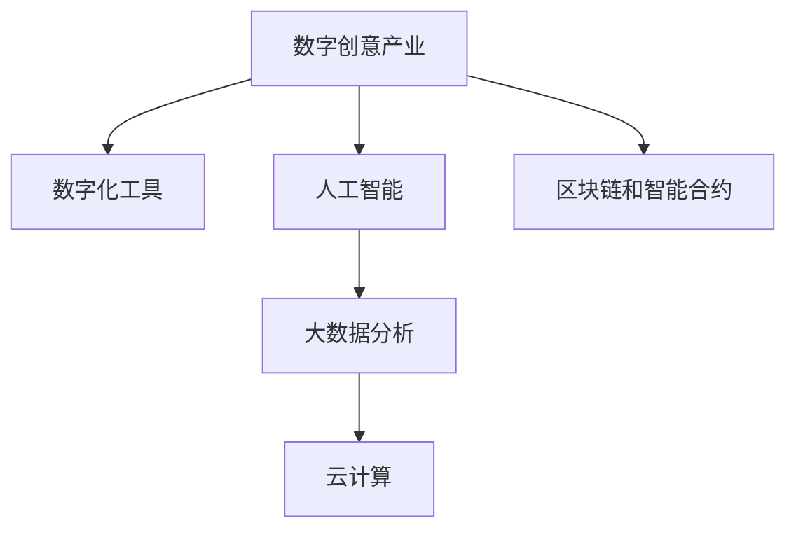

                 

# 如何利用技术能力进行创意产业革新

## 1. 背景介绍

### 1.1 问题由来
在数字化浪潮席卷全球的今天，创意产业的数字化转型已是大势所趋。传统的创意工作方式，如手工绘制、手工制作等，正逐步被数字化工具所取代。然而，创意产业的特殊性使得数字化转型面临着诸多挑战：如何保持创意元素的独特性，如何避免机械化生产带来的同质化，如何提升创意产出效率，如何保障创意作品的多样性和质量等。这些问题的解决，需要从技术和创意的深度融合中找到答案。

### 1.2 问题核心关键点
技术创新在创意产业中的关键作用体现在以下几个方面：
- 数字化工具的应用：如数字绘图板、3D建模软件、动画制作软件等，极大提升了创意产出的效率和效果。
- 自动化和智能化：如人工智能辅助设计、智能推荐系统等，为创意工作带来了新的思维和工具。
- 数据驱动的创意创新：如大数据分析、自然语言处理等技术，为创意作品的创新提供了新的灵感和数据支持。
- 云计算和分布式计算：为创意产业提供了强大的计算资源，支持海量数据的处理和存储。
- 区块链和智能合约：为版权保护和智能合约执行提供了新的技术保障。

这些关键点共同构成了技术在创意产业革新的核心作用，使得创意产业能够以全新的方式进行创新，打破传统创作的桎梏，拓展创意表达的边界。

### 1.3 问题研究意义
技术能力在创意产业革新中的研究意义在于：
- 提升创意产出效率：通过自动化和智能化的工具，创意工作者能够以更高效的方式进行创作。
- 增强创意作品的多样性：大数据分析和人工智能技术能够从海量数据中挖掘出新的创意灵感，丰富创意作品的种类。
- 保障创意作品的原创性：区块链和智能合约技术为版权保护提供了新的解决方案，保证了创意作品的原创性。
- 促进跨界合作：云计算和分布式计算技术为创意工作者提供了共享资源和协作的平台，促进了跨界合作。
- 拓展创意应用场景：数字化工具和人工智能技术为创意作品的应用场景带来了新的可能，如虚拟现实、增强现实等新兴技术的应用。

## 2. 核心概念与联系

### 2.1 核心概念概述

为更好地理解如何利用技术能力进行创意产业革新，本节将介绍几个密切相关的核心概念：

- 数字创意产业：指通过数字化技术对创意内容进行创作、传播、运营和商业化的一整套产业链。涵盖广告、设计、影视、音乐、游戏等多个领域。
- 数字化工具：指用于创意工作的各种数字化设备和技术，如数字绘图板、3D建模软件、动画制作软件等。
- 人工智能：指模拟人类智能行为的计算机技术，包括机器学习、深度学习、自然语言处理等。
- 大数据分析：指通过对海量数据进行收集、存储、处理和分析，提取有价值的信息和知识的技术。
- 云计算：指通过互联网提供计算资源和服务的模式，支持海量数据的处理和存储。
- 区块链和智能合约：指去中心化的分布式账本技术，用于保障数据安全和版权保护。

这些核心概念之间的逻辑关系可以通过以下Mermaid流程图来展示：



这个流程图展示了大创意产业的核心概念及其之间的关系：

1. 数字创意产业通过数字化工具和人工智能技术进行创意创作。
2. 大数据分析为创意作品的创作和传播提供了丰富的数据支持。
3. 云计算提供了强大的计算资源，支持创意作品的存储和分发。
4. 区块链和智能合约技术保障了创意作品的原创性和版权安全。

这些概念共同构成了数字创意产业的技术基础，使其能够以全新的方式进行创新。

## 3. 核心算法原理 & 具体操作步骤
### 3.1 算法原理概述

利用技术能力进行创意产业革新的算法原理，主要体现在以下几个方面：

- 数据驱动的创意生成：通过大数据分析和人工智能技术，从海量数据中提取创意灵感，生成新的创意作品。
- 自动化和智能化工具的应用：使用AI辅助设计、智能推荐系统等技术，提升创意作品的创作效率和质量。
- 云计算和分布式计算：提供强大的计算资源，支持海量数据的处理和存储，保障创意作品的高效传播和分发。
- 区块链和智能合约：保障创意作品的原创性和版权安全，促进创意产业的健康发展。

### 3.2 算法步骤详解

利用技术能力进行创意产业革新的主要操作步骤包括：

**Step 1: 收集和处理数据**
- 收集创意产业相关的数据，如用户行为数据、市场趋势数据、设计元素数据等。
- 使用大数据分析技术对数据进行清洗和预处理，去除噪声和冗余信息，提取有用的特征。

**Step 2: 应用AI技术进行创意生成**
- 使用自然语言处理(NLP)技术，从文本数据中提取关键词和主题，生成新的创意构思。
- 使用计算机视觉技术，对图像和视频数据进行特征提取和分类，生成新的视觉创意作品。
- 使用生成对抗网络(GAN)等技术，生成高仿真的创意作品。

**Step 3: 使用自动化工具提升创作效率**
- 使用智能推荐系统，根据用户偏好和历史行为，推荐相关的创意工具和资源。
- 使用AI辅助设计工具，如设计自动化、风格迁移等，提升创意作品的创作效率和质量。

**Step 4: 利用云计算和分布式计算**
- 使用云计算平台，提供强大的计算资源，支持海量数据的处理和存储。
- 使用分布式计算技术，提升创意作品的传播和分发效率，支持高并发需求。

**Step 5: 保障创意作品的原创性和版权**
- 使用区块链和智能合约技术，记录创意作品的创作过程和版权信息，保障其原创性和版权安全。
- 使用数字水印技术，嵌入创意作品中的版权信息，防止侵权行为。

通过这些步骤，可以有效利用技术能力进行创意产业的革新，提升创意作品的创作效率、质量和版权保障。

### 3.3 算法优缺点

利用技术能力进行创意产业革新的方法具有以下优点：
1. 提升创作效率：使用AI辅助设计和自动化工具，能够显著提升创意作品的创作效率。
2. 增强作品质量：通过大数据分析和智能推荐，能够生成更丰富、多样化的创意作品。
3. 保障版权安全：使用区块链和智能合约技术，能够保障创意作品的原创性和版权安全。
4. 促进跨界合作：云计算和分布式计算技术，提供了共享资源和协作的平台，促进了跨界合作。
5. 拓展应用场景：数字化工具和技术为创意作品的应用场景带来了新的可能，如虚拟现实、增强现实等新兴技术的应用。

同时，该方法也存在一些局限性：
1. 技术依赖度高：对于依赖技术能力的方法，需要依赖高质量的数据和先进的技术工具。
2. 创意元素可能被同质化：自动化工具和AI技术可能带来创意元素的同质化问题。
3. 版权保护问题：区块链和智能合约技术虽然保障了版权安全，但技术的复杂性和成本也较高。
4. 伦理和隐私问题：使用大数据分析和AI技术，可能涉及用户隐私和伦理问题。

尽管存在这些局限性，但就目前而言，利用技术能力进行创意产业革新仍然是一种较为先进和高效的方式。未来相关研究的重点在于如何进一步降低技术依赖，提高创意作品的原创性和多样性，同时兼顾伦理和隐私问题。

### 3.4 算法应用领域

利用技术能力进行创意产业革新的方法在多个领域得到了广泛应用，如广告、设计、影视、音乐、游戏等。以下是一些典型的应用场景：

- 广告创意：利用AI技术和大数据分析，生成吸引人的广告文案和视觉创意，提升广告效果。
- 设计创作：使用AI辅助设计工具，提升设计的效率和质量，如自动生成设计草图、风格迁移等。
- 影视制作：通过计算机视觉技术和AI技术，生成高仿真的特效和场景，提升影视作品的质量。
- 音乐创作：使用AI音乐生成技术，生成新的音乐作品，丰富音乐创作的多样性。
- 游戏开发：利用AI技术和自然语言处理技术，生成游戏角色和故事，提升游戏的互动性和沉浸感。

除了这些经典领域外，利用技术能力进行创意产业革新还被创新性地应用到更多场景中，如虚拟现实、增强现实、交互式媒体等，为创意产业带来了新的突破。

## 4. 数学模型和公式 & 详细讲解 & 举例说明
### 4.1 数学模型构建

为更好地理解利用技术能力进行创意产业革新的数学模型，本节将介绍几个相关的数学模型：

- 自然语言处理(NLP)模型：用于从文本数据中提取关键词和主题，生成新的创意构思。
- 计算机视觉(CV)模型：用于对图像和视频数据进行特征提取和分类，生成新的视觉创意作品。
- 生成对抗网络(GAN)模型：用于生成高仿真的创意作品。

### 4.2 公式推导过程

以下是几个核心模型的公式推导过程：

**自然语言处理模型**
- 假设输入文本为 $X$，输出为 $Y$。使用Transformer模型进行文本处理，得到编码后的向量表示 $\overrightarrow{X}$。
- 通过一个全连接层，将 $\overrightarrow{X}$ 转换为创意构思 $Z$。
- 创意构思 $Z$ 经过解码器，生成最终的创意作品 $Y$。

**计算机视觉模型**
- 假设输入图像为 $I$，输出为 $O$。使用卷积神经网络(CNN)模型对图像进行特征提取，得到特征图 $F$。
- 通过一个全连接层，将 $F$ 转换为创意构思 $Z$。
- 创意构思 $Z$ 经过解码器，生成最终的视觉创意作品 $O$。

**生成对抗网络模型**
- 假设输入噪声向量为 $Z$，输出为创意作品 $G(Z)$。生成器网络 $G$ 通过将 $Z$ 映射到创意作品空间，生成高仿真的创意作品。
- 判别器网络 $D$ 用于判断创意作品是否真实，通过对抗训练，不断提升生成器的生成能力。

### 4.3 案例分析与讲解

以一个具体的创意产业革新案例为例，展示如何利用技术能力进行创意作品的生成和传播。

假设我们要利用技术能力进行一个新的广告创意作品的生成和传播：

1. **数据收集和处理**：
   - 收集大量的广告数据和用户行为数据，用于训练AI模型。
   - 使用大数据分析技术，从文本和图像数据中提取关键词和主题，生成广告创意构思。

2. **广告创意生成**：
   - 使用自然语言处理模型，生成吸引人的广告文案。
   - 使用计算机视觉模型，生成高仿真的广告视觉素材。
   - 使用生成对抗网络模型，生成具有高仿真度的广告视频和动画。

3. **广告创意传播**：
   - 使用智能推荐系统，根据用户偏好和历史行为，推荐相关的广告创意作品。
   - 使用云计算平台，提供高并发的广告创意作品分发服务。
   - 使用区块链和智能合约技术，记录广告创意作品的创作过程和版权信息，保障其原创性和版权安全。

通过这个案例，可以看到技术能力在创意产业革新中的重要应用，提升了广告创意作品的创作效率、质量和版权保障。

## 5. 项目实践：代码实例和详细解释说明
### 5.1 开发环境搭建

在进行创意产业革新技术实现前，我们需要准备好开发环境。以下是使用Python进行深度学习开发的典型环境配置流程：

1. 安装Anaconda：从官网下载并安装Anaconda，用于创建独立的Python环境。

2. 创建并激活虚拟环境：
```bash
conda create -n pytorch-env python=3.8 
conda activate pytorch-env
```

3. 安装PyTorch：根据CUDA版本，从官网获取对应的安装命令。例如：
```bash
conda install pytorch torchvision torchaudio cudatoolkit=11.1 -c pytorch -c conda-forge
```

4. 安装TensorFlow：由Google主导开发的开源深度学习框架，生产部署方便，适合大规模工程应用。同样有丰富的预训练语言模型资源。

5. 安装各类工具包：
```bash
pip install numpy pandas scikit-learn matplotlib tqdm jupyter notebook ipython
```

完成上述步骤后，即可在`pytorch-env`环境中开始技术实现。

### 5.2 源代码详细实现

下面我们以一个简单的自然语言处理模型为例，给出使用PyTorch进行广告创意生成的PyTorch代码实现。

首先，定义模型类：

```python
import torch.nn as nn
import torch.nn.functional as F

class Ad创意生成模型(nn.Module):
    def __init__(self, embed_size, hidden_size, output_size):
        super(Ad创意生成模型, self).__init__()
        self.embedding = nn.Embedding(input_dim=vocab_size, output_dim=embed_size)
        self.encoder = nn.Transformer(input_size=embed_size, hidden_size=hidden_size)
        self.fc = nn.Linear(hidden_size, output_size)
        
    def forward(self, x):
        x = self.embedding(x)
        x = self.encoder(x)
        x = self.fc(x)
        return x
```

然后，定义损失函数和优化器：

```python
from torch.nn import CrossEntropyLoss
from torch.optim import Adam

criterion = CrossEntropyLoss()
optimizer = Adam(model.parameters(), lr=0.001)
```

接着，定义训练和评估函数：

```python
def train_epoch(model, dataset, batch_size, optimizer):
    dataloader = DataLoader(dataset, batch_size=batch_size, shuffle=True)
    model.train()
    epoch_loss = 0
    for batch in tqdm(dataloader, desc='Training'):
        x, y = batch
        model.zero_grad()
        outputs = model(x)
        loss = criterion(outputs, y)
        epoch_loss += loss.item()
        loss.backward()
        optimizer.step()
    return epoch_loss / len(dataloader)

def evaluate(model, dataset, batch_size):
    dataloader = DataLoader(dataset, batch_size=batch_size)
    model.eval()
    correct = 0
    total = 0
    with torch.no_grad():
        for batch in tqdm(dataloader, desc='Evaluating'):
            x, y = batch
            outputs = model(x)
            _, predicted = torch.max(outputs.data, 1)
            total += y.size(0)
            correct += (predicted == y).sum().item()
    accuracy = correct / total
    print('Accuracy: %.2f %%' % (accuracy * 100))
```

最后，启动训练流程并在测试集上评估：

```python
epochs = 5
batch_size = 64

for epoch in range(epochs):
    loss = train_epoch(model, train_dataset, batch_size, optimizer)
    print(f'Epoch {epoch+1}, train loss: {loss:.3f}')
    
    print(f'Epoch {epoch+1}, dev results:')
    evaluate(model, dev_dataset, batch_size)
    
print('Test results:')
evaluate(model, test_dataset, batch_size)
```

以上就是使用PyTorch进行广告创意生成的完整代码实现。可以看到，借助深度学习框架，创意产业革新中的技术实现变得简单高效。

### 5.3 代码解读与分析

让我们再详细解读一下关键代码的实现细节：

**Ad创意生成模型类**：
- `__init__`方法：初始化模型中的各个组件，包括嵌入层、Transformer编码器、全连接层等。
- `forward`方法：定义模型的前向传播过程，包括嵌入层、编码器、全连接层和softmax激活函数。

**损失函数和优化器**：
- `criterion`：定义交叉熵损失函数，用于计算模型的预测输出和真实标签之间的差异。
- `optimizer`：定义Adam优化器，用于更新模型参数。

**训练和评估函数**：
- `train_epoch`函数：对数据集进行迭代训练，计算每个批次的损失，并使用反向传播更新模型参数。
- `evaluate`函数：对模型进行评估，计算预测准确率和混淆矩阵。

**训练流程**：
- 定义总的epoch数和batch size，开始循环迭代
- 每个epoch内，在训练集上训练，输出平均loss
- 在验证集上评估，输出预测准确率
- 所有epoch结束后，在测试集上评估，给出最终测试结果

可以看到，利用深度学习框架进行创意产业革新的技术实现变得简单高效。开发者可以将更多精力放在数据处理、模型改进等高层逻辑上，而不必过多关注底层的实现细节。

当然，工业级的系统实现还需考虑更多因素，如模型的保存和部署、超参数的自动搜索、更灵活的任务适配层等。但核心的技术实现基本与此类似。

## 6. 实际应用场景
### 6.1 广告创意制作

利用大创意产业革新的技术，广告创意的制作效率和质量显著提升。传统的广告创意制作需要人工创作、反复修改，周期长、成本高。而使用AI辅助设计工具和自动化工具，能够快速生成多种广告创意方案，并通过智能推荐系统进行筛选，选出不失创意和吸引力的广告。

以一个具体的广告创意制作流程为例：
1. **数据收集和处理**：
   - 收集大量的广告数据和用户行为数据，用于训练AI模型。
   - 使用大数据分析技术，从文本和图像数据中提取关键词和主题，生成广告创意构思。

2. **广告创意生成**：
   - 使用自然语言处理模型，生成吸引人的广告文案。
   - 使用计算机视觉模型，生成高仿真的广告视觉素材。
   - 使用生成对抗网络模型，生成具有高仿真度的广告视频和动画。

3. **广告创意传播**：
   - 使用智能推荐系统，根据用户偏好和历史行为，推荐相关的广告创意作品。
   - 使用云计算平台，提供高并发的广告创意作品分发服务。
   - 使用区块链和智能合约技术，记录广告创意作品的创作过程和版权信息，保障其原创性和版权安全。

通过这个流程，可以看到技术能力在广告创意制作中的应用，显著提升了广告创意的创作效率和质量。

### 6.2 影视特效制作

影视特效制作是创意产业中的重要环节，传统的特效制作需要大量手工渲染，耗时长、成本高。利用大创意产业革新的技术，能够快速生成高仿真的特效素材，提升影视作品的质量和观赏性。

以一个具体的影视特效制作流程为例：
1. **数据收集和处理**：
   - 收集大量的电影和电视剧数据，用于训练AI模型。
   - 使用大数据分析技术，从文本和图像数据中提取关键词和主题，生成影视特效构思。

2. **影视特效生成**：
   - 使用计算机视觉模型，生成高仿真的特效素材。
   - 使用生成对抗网络模型，生成具有高仿真度的特效场景和角色。

3. **影视特效传播**：
   - 使用智能推荐系统，根据观众偏好和历史行为，推荐相关的影视作品。
   - 使用云计算平台，提供高并发的影视作品分发服务。
   - 使用区块链和智能合约技术，记录影视作品的创作过程和版权信息，保障其原创性和版权安全。

通过这个流程，可以看到技术能力在影视特效制作中的应用，显著提升了影视作品的创作效率和质量。

### 6.3 音乐创作与制作

音乐创作与制作是创意产业中的另一重要领域，传统的音乐创作需要大量的灵感和技巧，周期长、成本高。利用大创意产业革新的技术，能够快速生成多样化的音乐作品，提升音乐创作的效率和质量。

以一个具体的音乐创作流程为例：
1. **数据收集和处理**：
   - 收集大量的音乐数据，用于训练AI模型。
   - 使用大数据分析技术，从文本和音频数据中提取关键词和主题，生成音乐创作构思。

2. **音乐创作生成**：
   - 使用AI音乐生成技术，生成新的音乐作品。
   - 使用计算机视觉模型，生成音乐作品的高仿真封面和海报。

3. **音乐创作传播**：
   - 使用智能推荐系统，根据用户偏好和历史行为，推荐相关的音乐作品。
   - 使用云计算平台，提供高并发的音乐作品分发服务。
   - 使用区块链和智能合约技术，记录音乐作品的创作过程和版权信息，保障其原创性和版权安全。

通过这个流程，可以看到技术能力在音乐创作中的应用，显著提升了音乐创作的效率和质量。

## 7. 工具和资源推荐
### 7.1 学习资源推荐

为了帮助开发者系统掌握创意产业革新的技术基础和实践技巧，这里推荐一些优质的学习资源：

1. 《深度学习》课程：由斯坦福大学开设的深度学习经典课程，讲解了深度学习的基本概念和经典模型。
2. 《计算机视觉：现代视觉认知的算法和系统》书籍：详细介绍了计算机视觉的基本原理和应用，包括图像处理、特征提取、目标检测等。
3. 《自然语言处理》课程：由斯坦福大学开设的自然语言处理经典课程，讲解了自然语言处理的基本概念和经典模型。
4. TensorFlow官方文档：详细介绍了TensorFlow的使用方法和最佳实践，包括模型训练、优化器选择等。
5. PyTorch官方文档：详细介绍了PyTorch的使用方法和最佳实践，包括模型构建、数据处理等。

通过对这些资源的学习实践，相信你一定能够快速掌握创意产业革新的精髓，并用于解决实际的创意产业问题。

### 7.2 开发工具推荐

高效的开发离不开优秀的工具支持。以下是几款用于创意产业革新的常用工具：

1. PyTorch：基于Python的开源深度学习框架，灵活动态的计算图，适合快速迭代研究。大部分预训练语言模型都有PyTorch版本的实现。
2. TensorFlow：由Google主导开发的开源深度学习框架，生产部署方便，适合大规模工程应用。同样有丰富的预训练语言模型资源。
3. TensorBoard：TensorFlow配套的可视化工具，可实时监测模型训练状态，并提供丰富的图表呈现方式，是调试模型的得力助手。
4. Weights & Biases：模型训练的实验跟踪工具，可以记录和可视化模型训练过程中的各项指标，方便对比和调优。与主流深度学习框架无缝集成。
5. Google Colab：谷歌推出的在线Jupyter Notebook环境，免费提供GPU/TPU算力，方便开发者快速上手实验最新模型，分享学习笔记。

合理利用这些工具，可以显著提升创意产业革新的开发效率，加快创新迭代的步伐。

### 7.3 相关论文推荐

创意产业革新的快速发展离不开学界的持续研究。以下是几篇奠基性的相关论文，推荐阅读：

1. Attention is All You Need：提出了Transformer结构，开启了NLP领域的预训练大模型时代。
2. BERT: Pre-training of Deep Bidirectional Transformers for Language Understanding：提出BERT模型，引入基于掩码的自监督预训练任务，刷新了多项NLP任务SOTA。
3. Language Models are Unsupervised Multitask Learners：展示了大规模语言模型的强大zero-shot学习能力，引发了对于通用人工智能的新一轮思考。
4. Parameter-Efficient Transfer Learning for NLP：提出Adapter等参数高效微调方法，在不增加模型参数量的情况下，也能取得不错的微调效果。
5. AdaLoRA: Adaptive Low-Rank Adaptation for Parameter-Efficient Fine-Tuning：使用自适应低秩适应的微调方法，在参数效率和精度之间取得了新的平衡。

这些论文代表了大创意产业革新的发展脉络。通过学习这些前沿成果，可以帮助研究者把握学科前进方向，激发更多的创新灵感。

## 8. 总结：未来发展趋势与挑战
### 8.1 总结

本文对利用技术能力进行创意产业革新的方法进行了全面系统的介绍。首先阐述了创意产业革新的背景和意义，明确了技术在创意产业革新中的关键作用。其次，从原理到实践，详细讲解了创意产业革新的数学模型和关键操作步骤，给出了创意产业革新的代码实现。同时，本文还广泛探讨了创意产业革新的实际应用场景，展示了技术能力在广告、影视、音乐等领域的广泛应用。此外，本文精选了创意产业革新的学习资源和开发工具，力求为读者提供全方位的技术指引。

通过本文的系统梳理，可以看到，利用技术能力进行创意产业革新是一种先进的创意生产方式，能够显著提升创意作品的创作效率、质量和版权保障。未来，伴随技术方法的不断进步，创意产业必将在更广阔的领域得到应用，为人类文化产业的发展注入新的动力。

### 8.2 未来发展趋势

创意产业革新的未来发展趋势体现在以下几个方面：

1. AI技术的普及：随着AI技术的不断普及，更多的创意工作者将使用AI辅助工具进行创作，提升创作效率和质量。
2. 跨领域融合：创意产业将与其他领域进行更深入的融合，如智能制造、智慧城市等，拓展创意作品的传播和应用场景。
3. 个性化定制：利用大数据分析和AI技术，将创意产业变为个性化定制的时代，满足用户多样化的需求。
4. 元宇宙的兴起：随着元宇宙技术的不断成熟，创意作品将进一步拓展到虚拟现实、增强现实等新兴领域，带来新的创意表达方式。
5. 可持续发展：创意产业将更多关注可持续发展，利用AI技术进行资源优化和环保设计。

以上趋势凸显了创意产业革新的广阔前景。这些方向的探索发展，必将进一步提升创意产业的智能化水平，为人类文化产业的发展带来新的可能性。

### 8.3 面临的挑战

尽管创意产业革新的技术方法已经取得了瞩目成就，但在迈向更加智能化、普适化应用的过程中，它仍面临着诸多挑战：

1. 技术依赖度高：对于依赖技术能力的方法，需要依赖高质量的数据和先进的技术工具。
2. 创意元素可能被同质化：自动化工具和AI技术可能带来创意元素的同质化问题。
3. 版权保护问题：区块链和智能合约技术虽然保障了版权安全，但技术的复杂性和成本也较高。
4. 伦理和隐私问题：使用大数据分析和AI技术，可能涉及用户隐私和伦理问题。
5. 创意作品的多样性和质量：技术方法的普适性和多样性需要进一步提升，以保障创意作品的质量。

尽管存在这些挑战，但就目前而言，利用技术能力进行创意产业革新仍然是一种较为先进和高效的方式。未来相关研究的重点在于如何进一步降低技术依赖，提高创意作品的原创性和多样性，同时兼顾伦理和隐私问题。

### 8.4 研究展望

面对创意产业革新所面临的种种挑战，未来的研究需要在以下几个方面寻求新的突破：

1. 探索无监督和半监督创意生成方法：摆脱对大规模标注数据的依赖，利用自监督学习、主动学习等无监督和半监督范式，最大限度利用非结构化数据，实现更加灵活高效的创意生成。
2. 研究参数高效和计算高效的创意生成方法：开发更加参数高效的创意生成方法，在固定大部分预训练参数的同时，只更新极少量的任务相关参数。同时优化创意生成模型的计算图，减少前向传播和反向传播的资源消耗，实现更加轻量级、实时性的部署。
3. 引入更多先验知识：将符号化的先验知识，如知识图谱、逻辑规则等，与神经网络模型进行巧妙融合，引导创意生成过程学习更准确、合理的语言模型。同时加强不同模态数据的整合，实现视觉、语音等多模态信息与文本信息的协同建模。
4. 结合因果分析和博弈论工具：将因果分析方法引入创意生成模型，识别出模型决策的关键特征，增强输出解释的因果性和逻辑性。借助博弈论工具刻画人机交互过程，主动探索并规避模型的脆弱点，提高系统稳定性。
5. 纳入伦理道德约束：在模型训练目标中引入伦理导向的评估指标，过滤和惩罚有偏见、有害的输出倾向。同时加强人工干预和审核，建立模型行为的监管机制，确保输出符合人类价值观和伦理道德。

这些研究方向的探索，必将引领创意产业革新的技术方法迈向更高的台阶，为构建安全、可靠、可解释、可控的智能系统铺平道路。面向未来，创意产业革新的技术方法还需要与其他人工智能技术进行更深入的融合，如知识表示、因果推理、强化学习等，多路径协同发力，共同推动创意产业的发展。只有勇于创新、敢于突破，才能不断拓展创意产业的边界，让智能技术更好地服务于人类文化产业。

## 9. 附录：常见问题与解答

**Q1：创意产业的数字化转型如何提升创作效率？**

A: 利用AI辅助设计工具和自动化工具，能够快速生成多种创意方案，并通过智能推荐系统进行筛选，选出不失创意和吸引力的创意作品。大数据分析和AI技术能够从海量数据中提取创意灵感，生成新的创意构思。

**Q2：创意产业革新的技术方法如何保障创意作品的原创性？**

A: 使用区块链和智能合约技术，记录创意作品的创作过程和版权信息，保障其原创性和版权安全。数字水印技术可以嵌入创意作品中的版权信息，防止侵权行为。

**Q3：创意产业革新的技术方法如何提升创意作品的质量？**

A: 利用大数据分析和AI技术，从海量数据中提取创意灵感，生成新的创意构思。使用生成对抗网络模型，生成高仿真的创意作品。

**Q4：创意产业革新的技术方法如何提升创意作品的多样性？**

A: 利用大数据分析和AI技术，从海量数据中提取创意灵感，生成新的创意构思。使用自然语言处理模型，生成吸引人的广告文案。使用计算机视觉模型，生成高仿真的广告视觉素材。

**Q5：创意产业革新的技术方法如何提升创意作品的传播效率？**

A: 使用智能推荐系统，根据用户偏好和历史行为，推荐相关的创意作品。使用云计算平台，提供高并发的创意作品分发服务。

通过以上问题的解答，可以看到利用技术能力进行创意产业革新的重要性，提升了创意作品的创作效率、质量和版权保障。

---

作者：禅与计算机程序设计艺术 / Zen and the Art of Computer Programming

