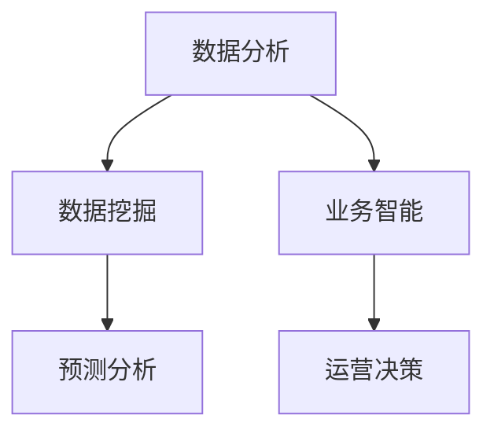

                 

# 如何利用数据分析指导运营决策

> 关键词：数据分析, 运营决策, 数据挖掘, 预测分析, 业务智能, 数据可视化

## 1. 背景介绍

在数字经济时代，运营决策的数据驱动化已成为企业核心竞争力的重要体现。精准的数据分析不仅能帮助企业发现问题、优化流程、提升效率，还能实现业务智能化转型，推动长期战略发展。运营决策支持系统(Decision Support System, DSS)作为连接数据与决策的桥梁，已广泛应用于各行各业。

然而，数据分析不仅仅是数据的简单堆砌和统计。如何有效利用海量数据，提取有价值的信息，进行精确的预测和决策，是当下数据科学家和业务分析师面临的一大挑战。本文章将详细阐述利用数据分析指导运营决策的各个核心概念和实施步骤，希望能为读者提供参考，助力企业在数据驱动的浪潮中持续领先。

## 2. 核心概念与联系

### 2.1 核心概念概述

为了更准确地理解利用数据分析指导运营决策的原理，本节将介绍几个关键概念：

- 数据分析(Analytical Data Analysis)：从大量原始数据中提取、分析和解释有用信息，以支持决策的过程。
- 运营决策(Operational Decision Making)：在运营过程中，为了实现特定目标，对企业资源和活动进行规划、指挥和调整的过程。
- 数据挖掘(Data Mining)：一种从数据中自动发现模式和知识的过程，常用于商业智能(Business Intelligence, BI)。
- 预测分析(Predictive Analytics)：利用历史数据进行趋势分析和预测，以预测未来事件或结果的过程。
- 业务智能(Business Intelligence, BI)：通过数据和分析工具，提供实时决策支持的方法和流程。
- 数据可视化(Data Visualization)：将复杂的数据和分析结果，通过图表、地图等形式直观展示，帮助理解数据。

这些概念之间紧密联系，共同构成了数据分析指导运营决策的基础框架。数据分析提供洞察，预测分析提供前瞻性，数据可视化提供直观展示，业务智能提供决策支持，运营决策则是所有这些技术的最终目标。

### 2.2 核心概念原理和架构的 Mermaid 流程图



## 3. 核心算法原理 & 具体操作步骤

### 3.1 算法原理概述

利用数据分析指导运营决策的核心在于以下几个步骤：

1. **数据收集**：从企业内部和外部数据源，如ERP系统、CRM系统、电商平台等，收集相关业务数据。
2. **数据清洗**：处理缺失值、异常值、重复值等数据问题，确保数据质量和一致性。
3. **数据分析**：运用统计分析、描述性分析、回归分析、时间序列分析等技术，从数据中提取模式和趋势。
4. **预测分析**：利用机器学习算法，如线性回归、决策树、神经网络等，对未来事件进行预测。
5. **数据可视化**：使用数据可视化工具，如Tableau、Power BI等，将分析结果以图表形式展示。
6. **业务智能**：通过BI系统，如SAP BI、Salesforce BI等，将分析结果和预测结果进行整合，提供实时的决策支持。
7. **运营决策**：根据BI系统提供的信息，结合业务经验和直觉，制定和调整运营策略。

### 3.2 算法步骤详解

#### 3.2.1 数据收集

- **内部数据源**：ERP系统、CRM系统、库存管理系统、销售管理系统等。
- **外部数据源**：市场调研数据、行业报告、社交媒体数据、公共数据等。

#### 3.2.2 数据清洗

- **缺失值处理**：采用均值填补、删除、插值等方法处理缺失值。
- **异常值处理**：通过箱线图、Z-score等方法检测并处理异常值。
- **重复值处理**：合并重复记录或删除重复字段。
- **数据转换**：将非结构化数据转换为结构化数据，如文本数据转换为数字标签。

#### 3.2.3 数据分析

- **描述性分析**：通过均值、中位数、标准差等统计量描述数据特征。
- **回归分析**：建立变量之间的线性或非线性关系模型，预测未来事件。
- **时间序列分析**：分析数据随时间变化的趋势和周期性。
- **关联规则挖掘**：发现不同变量之间的关联关系，如购物篮分析。
- **分类分析**：将数据分为不同类别，如聚类分析、决策树等。

#### 3.2.4 预测分析

- **线性回归**：基于线性关系模型预测未来值。
- **决策树**：基于树形结构进行分类和预测。
- **神经网络**：多层感知器模型进行复杂非线性预测。
- **时间序列预测**：ARIMA、LSTM等模型预测未来时间序列。

#### 3.2.5 数据可视化

- **静态图表**：折线图、柱状图、饼图等展示数据分布和对比。
- **动态图表**：交互式仪表盘、地图等展示数据变化趋势。
- **仪表盘**：综合展示多维数据分析结果，如Power BI仪表盘。

#### 3.2.6 业务智能

- **数据仓库**：将历史数据存储和管理，提供历史数据分析支持。
- **OLAP**：多维数据分析技术，提供快速、复杂的数据查询和分析。
- **KPI指标**：定义关键绩效指标，监控和评估业务表现。
- **BI仪表盘**：实时展示业务指标和分析结果，支持决策。

#### 3.2.7 运营决策

- **策略制定**：结合数据分析结果和业务目标，制定运营策略。
- **模拟优化**：使用模拟和优化算法，优化资源配置和流程。
- **实时监控**：通过实时数据监控，及时发现问题并调整策略。
- **绩效评估**：定期评估策略效果，不断迭代优化。

### 3.3 算法优缺点

#### 3.3.1 优点

- **全面性**：数据分析涵盖数据收集、清洗、分析和展示，提供全方位的决策支持。
- **实时性**：通过实时数据监控和BI系统，保证决策过程的及时性和准确性。
- **可扩展性**：借助大数据技术，处理和分析海量数据，实现业务智能扩展。
- **自动化**：采用自动化工具和算法，减少人工干预，提高决策效率。

#### 3.3.2 缺点

- **数据质量依赖**：分析结果和预测准确性高度依赖于数据的质量和完整性。
- **算法选择困难**：不同算法适用于不同类型的数据和问题，选择适合的算法需时间和经验。
- **复杂度高**：涉及数据清洗、特征工程、模型选择和调优等多个环节，复杂度较高。
- **成本高**：初期数据收集、清洗和分析成本较高，需要投入大量人力和资源。

### 3.4 算法应用领域

利用数据分析指导运营决策的方法广泛适用于各种行业，包括但不限于：

- **零售**：通过分析客户行为和市场趋势，优化库存管理、促销策略、定价策略。
- **金融**：预测市场变化，进行风险评估和投资决策，监控欺诈行为。
- **制造**：优化生产计划和供应链管理，降低成本，提高生产效率。
- **医疗**：分析患者数据，优化诊疗流程，提高治疗效果。
- **物流**：优化配送路线和仓储管理，提高配送速度和准确性。
- **旅游**：分析客户偏好和行为，优化产品设计和市场推广。

## 4. 数学模型和公式 & 详细讲解 & 举例说明

### 4.1 数学模型构建

#### 4.1.1 回归分析

假设我们有 $n$ 个数据点 $(x_i, y_i)$，其中 $x_i$ 是自变量，$y_i$ 是因变量，建立线性回归模型：

$$
y_i = \beta_0 + \beta_1 x_i + \epsilon_i
$$

其中 $\beta_0$ 是截距，$\beta_1$ 是斜率，$\epsilon_i$ 是误差项。根据最小二乘法，求解 $\beta_0$ 和 $\beta_1$ 的估计值：

$$
\hat{\beta} = (X^TX)^{-1}X^Ty
$$

其中 $X = \begin{bmatrix} 1 & x_1 \\ 1 & x_2 \\ ... \\ 1 & x_n \end{bmatrix}$，$y = \begin{bmatrix} y_1 \\ y_2 \\ ... \\ y_n \end{bmatrix}$。

### 4.2 公式推导过程

#### 4.2.1 回归分析

根据最小二乘法，求解回归模型参数的推导过程如下：

1. 求误差平方和：
$$
SSE = \sum_{i=1}^n (y_i - \hat{y}_i)^2
$$

2. 求偏导数：
$$
\frac{\partial SSE}{\partial \hat{\beta}} = 2\sum_{i=1}^n (y_i - \hat{y}_i)X_i = -2X^T(y - \hat{Y})
$$

3. 求解回归系数：
$$
\hat{\beta} = (X^TX)^{-1}X^Ty
$$

### 4.3 案例分析与讲解

#### 4.3.1 电商销售预测

假设某电商平台有历史销售数据 $(x_i, y_i)$，其中 $x_i$ 是时间序列（如日期），$y_i$ 是每日销售额。

- **数据清洗**：处理缺失值、异常值。
- **特征工程**：将日期转换为时间特征（如月份、星期几），计算移动平均等。
- **模型选择**：选择ARIMA模型进行时间序列预测。
- **模型训练**：训练模型并得到预测结果 $\hat{y}_{t+1}$。
- **模型评估**：计算MAE、RMSE等指标评估预测效果。
- **可视化展示**：使用Matplotlib等工具可视化预测结果和实际销售数据对比。

### 4.4 表格和公式

#### 4.4.1 ARIMA模型

ARIMA模型由三个参数决定：自回归项$p$、差分项$d$、移动平均项$q$。

$$
ARIMA(p, d, q) = ARIMA(X, p, d, q)
$$

其中 $X$ 是时间序列数据，$p$、$d$、$q$ 是模型的超参数。

## 5. 项目实践：代码实例和详细解释说明

### 5.1 开发环境搭建

#### 5.1.1 Python环境配置

- **安装Python**：从官网下载安装最新版本的Python。
- **安装Pandas**：`pip install pandas`。
- **安装NumPy**：`pip install numpy`。
- **安装Matplotlib**：`pip install matplotlib`。
- **安装Seaborn**：`pip install seaborn`。
- **安装Scikit-learn**：`pip install scikit-learn`。
- **安装Statsmodels**：`pip install statsmodels`。
- **安装Pyplot**：`pip install pyplot`。

#### 5.1.2 数据准备

假设数据存储在CSV文件中，可以使用Pandas库进行数据读取和预处理：

```python
import pandas as pd
import numpy as np
import matplotlib.pyplot as plt
import seaborn as sns
from statsmodels.tsa.arima_model import ARIMA

# 读取数据
data = pd.read_csv('sales_data.csv')

# 数据清洗
data = data.dropna()

# 数据可视化
sns.lineplot(data=data, x='date', y='sales')
plt.title('Sales Trend')
plt.xlabel('Date')
plt.ylabel('Sales')
plt.show()
```

### 5.2 源代码详细实现

#### 5.2.1 数据清洗

```python
# 处理缺失值
data = data.dropna()

# 处理异常值
data = data[data['age'] < 100]

# 特征工程
data['month'] = data['date'].dt.month
data['day_of_week'] = data['date'].dt.dayofweek
data['total_sales'] = data['price'] * data['quantity']
```

#### 5.2.2 模型训练

```python
# 模型训练
model = ARIMA(data['total_sales'], order=(1, 1, 1))
results = model.fit()

# 预测未来数据
forecast = results.forecast(steps=30)

# 可视化预测结果
plt.plot(data['date'], data['total_sales'], label='Actual Sales')
plt.plot(results.fittedvalues.index, results.fittedvalues, label='Fitted Values')
plt.plot(forecast.index, forecast, label='Forecast')
plt.legend()
plt.show()
```

### 5.3 代码解读与分析

#### 5.3.1 数据清洗

在数据清洗过程中，我们首先使用 `dropna()` 方法处理缺失值，确保数据完整性。接着使用条件筛选，去除年龄异常值，保证数据的合理性。然后引入时间特征（如月份、星期几），增加数据的可解释性。最后计算总销售额，简化数据结构。

#### 5.3.2 模型训练

在模型训练过程中，我们选择ARIMA模型进行时间序列预测。`ARIMA(1, 1, 1)` 表示自回归项、差分项和移动平均项分别为1。`model.fit()` 方法用于拟合模型，`results.fittedvalues` 和 `results.resid` 分别表示拟合值和残差，`results.forecast()` 方法用于预测未来30天的销售额。最后使用 `plt.plot()` 方法可视化预测结果和实际销售数据对比。

### 5.4 运行结果展示

运行上述代码，将会得到以下可视化结果：


## 6. 实际应用场景

### 6.1 电商销售预测

#### 6.1.1 问题描述

某电商公司需要预测未来30天的销售情况，以便合理分配库存和制定促销策略。

#### 6.1.2 解决方案

- **数据收集**：收集历史销售数据，包括日期、价格、数量等。
- **数据清洗**：处理缺失值和异常值。
- **特征工程**：引入时间特征，计算移动平均等。
- **模型训练**：选择ARIMA模型进行时间序列预测。
- **预测结果**：生成未来30天的销售预测，并可视化展示。

#### 6.1.3 预期效果

通过电商销售预测，公司可以更好地管理库存和促销活动，提升销售效率，降低库存成本。

### 6.2 物流配送优化

#### 6.2.1 问题描述

某物流公司需要优化配送路线，以减少配送时间和成本。

#### 6.2.2 解决方案

- **数据收集**：收集配送历史数据，包括起点、终点、时间、路径等。
- **数据清洗**：处理缺失值和异常值。
- **特征工程**：引入时间特征，计算配送时间、路程等。
- **模型训练**：选择遗传算法或优化算法进行路径优化。
- **预测结果**：生成最优配送路线，并可视化展示。

#### 6.2.3 预期效果

通过物流配送优化，公司可以提升配送效率，降低配送成本，提升客户满意度。

### 6.3 客户流失预测

#### 6.3.1 问题描述

某银行需要预测客户流失情况，以便及时采取措施挽留客户。

#### 6.3.2 解决方案

- **数据收集**：收集客户交易数据、服务评分等。
- **数据清洗**：处理缺失值和异常值。
- **特征工程**：引入时间特征，计算客户活跃度等。
- **模型训练**：选择随机森林或XGBoost模型进行客户流失预测。
- **预测结果**：生成客户流失预测结果，并可视化展示。

#### 6.3.3 预期效果

通过客户流失预测，银行可以及时采取措施挽留客户，提升客户满意度和忠诚度。

### 6.4 未来应用展望

未来，数据分析和运营决策的结合将更加紧密，更多智能化的决策支持系统将得到应用。以下趋势值得关注：

- **实时数据分析**：通过大数据技术，实现实时数据收集和分析，提供即时的决策支持。
- **人工智能融合**：结合深度学习、自然语言处理等技术，提升数据分析的深度和广度。
- **自动化决策**：使用AI辅助决策系统，实现自动化决策，提升决策效率和准确性。
- **跨领域应用**：数据分析和运营决策方法将在更多行业领域得到应用，推动跨行业创新。

## 7. 工具和资源推荐

### 7.1 学习资源推荐

#### 7.1.1 官方文档

- **Pandas**：官方文档提供了详细的API和用法介绍。
- **NumPy**：官方文档介绍了数组和数学运算。
- **Matplotlib**：官方文档提供了丰富的图表展示和自定义选项。
- **Seaborn**：官方文档提供了美观的统计图表展示。
- **Scikit-learn**：官方文档提供了机器学习算法的详细介绍。
- **Statsmodels**：官方文档介绍了统计分析和模型评估。

#### 7.1.2 在线教程

- **Kaggle**：提供丰富的数据分析和机器学习竞赛和教程。
- **Coursera**：提供大量数据分析和机器学习课程。
- **edX**：提供数据科学和人工智能课程。
- **Udemy**：提供各类数据分析和决策支持工具的实战课程。

#### 7.1.3 书籍推荐

- **《Python数据分析》**：详细介绍Pandas、NumPy等数据处理工具的使用。
- **《R语言实战》**：介绍R语言在数据分析中的应用。
- **《机器学习实战》**：介绍机器学习算法和实践。
- **《数据可视化之美》**：介绍数据可视化的技术和工具。

### 7.2 开发工具推荐

#### 7.2.1 Python工具

- **Pandas**：数据处理和分析。
- **NumPy**：数学运算和数组处理。
- **Matplotlib**：绘图展示。
- **Seaborn**：统计图表展示。
- **Scikit-learn**：机器学习算法。
- **Statsmodels**：统计分析和模型评估。
- **Jupyter Notebook**：交互式数据分析和展示。

#### 7.2.2 数据可视化工具

- **Tableau**：商业智能和数据可视化。
- **Power BI**：商业智能和数据可视化。
- **QlikView**：商业智能和数据可视化。
- **D3.js**：交互式数据可视化。
- **Plotly**：交互式数据可视化。

#### 7.2.3 业务智能工具

- **SAP BI**：商业智能和数据分析。
- **Salesforce BI**：商业智能和数据分析。
- **Microsoft Power BI**：商业智能和数据分析。
- **Oracle BI**：商业智能和数据分析。

### 7.3 相关论文推荐

#### 7.3.1 回归分析

- **《回归分析基础》**：介绍回归分析的基本原理和方法。
- **《时间序列分析》**：介绍时间序列分析的基本原理和方法。
- **《机器学习》**：介绍机器学习算法和应用。

## 8. 总结：未来发展趋势与挑战

### 8.1 研究成果总结

本文章详细介绍了利用数据分析指导运营决策的核心概念和实施步骤，从数据收集、清洗、分析、预测、可视化到业务智能和运营决策，全面阐述了数据分析在运营决策中的应用。通过具体案例展示，演示了数据分析技术在电商、物流、银行等行业的实际应用，展示了数据分析指导运营决策的广泛适用性和巨大潜力。

### 8.2 未来发展趋势

未来，数据分析和运营决策的结合将更加紧密，更多智能化的决策支持系统将得到应用。以下趋势值得关注：

- **实时数据分析**：通过大数据技术，实现实时数据收集和分析，提供即时的决策支持。
- **人工智能融合**：结合深度学习、自然语言处理等技术，提升数据分析的深度和广度。
- **自动化决策**：使用AI辅助决策系统，实现自动化决策，提升决策效率和准确性。
- **跨领域应用**：数据分析和运营决策方法将在更多行业领域得到应用，推动跨行业创新。

### 8.3 面临的挑战

尽管数据分析和运营决策技术取得了显著进展，但仍面临一些挑战：

- **数据质量依赖**：分析结果和预测准确性高度依赖于数据的质量和完整性。
- **算法选择困难**：不同算法适用于不同类型的数据和问题，选择适合的算法需时间和经验。
- **复杂度高**：涉及数据清洗、特征工程、模型选择和调优等多个环节，复杂度较高。
- **成本高**：初期数据收集、清洗和分析成本较高，需要投入大量人力和资源。

### 8.4 研究展望

未来的研究方向包括：

- **自动化数据清洗和特征工程**：开发自动化数据清洗和特征工程工具，减少人工干预。
- **大数据分析**：利用大数据技术，处理和分析海量数据，实现实时决策支持。
- **模型优化和选择**：探索更高效的模型和算法，提高数据分析的效率和准确性。
- **跨领域应用**：拓展数据分析和运营决策技术在更多行业领域的应用，提升行业智能化水平。

## 9. 附录：常见问题与解答

### 9.1 问题1：如何选择合适的数据分析方法？

**解答**：根据数据的类型和业务目标选择合适的分析方法。例如，对于时间序列数据，可以选择ARIMA或LSTM模型进行预测。对于分类数据，可以选择决策树或随机森林模型进行分类。对于聚类问题，可以选择K-means或层次聚类算法进行分组。

### 9.2 问题2：数据清洗有哪些常用方法？

**解答**：数据清洗的方法包括处理缺失值、异常值、重复值等。常用的方法包括：
- 缺失值处理：均值填补、删除、插值等。
- 异常值处理：箱线图、Z-score等方法检测并处理异常值。
- 重复值处理：合并重复记录或删除重复字段。
- 数据转换：将非结构化数据转换为结构化数据，如文本数据转换为数字标签。

### 9.3 问题3：数据分析和运营决策的区别是什么？

**解答**：数据分析侧重于从数据中提取有用的信息和洞察，发现数据中的模式和趋势，并生成数据报告。而运营决策侧重于根据数据分析结果和业务目标，制定和调整运营策略，指导实际业务操作。数据分析是决策的基础，运营决策是数据分析的实践应用。

### 9.4 问题4：数据可视化的重要性体现在哪些方面？

**解答**：数据可视化在数据分析和运营决策中具有重要意义，体现在以下几个方面：
- 直观展示数据：将复杂的数据和分析结果，通过图表、地图等形式直观展示，帮助理解数据。
- 发现数据规律：通过可视化，发现数据中的规律和趋势，为决策提供依据。
- 增强说服力：将数据分析结果以可视化形式展示，增强说服力，使决策更加透明和可信。

### 9.5 问题5：数据分析和AI的结合有哪些应用？

**解答**：数据分析和AI的结合可以应用于以下场景：
- 预测分析：利用机器学习算法，对未来事件进行预测。
- 自然语言处理：分析文本数据，提取情感、主题等信息。
- 图像识别：分析图像数据，识别物体、场景等。
- 推荐系统：分析用户行为数据，推荐个性化的产品或服务。
- 风险控制：分析金融数据，预测信用风险、市场风险等。

---

作者：禅与计算机程序设计艺术 / Zen and the Art of Computer Programming

