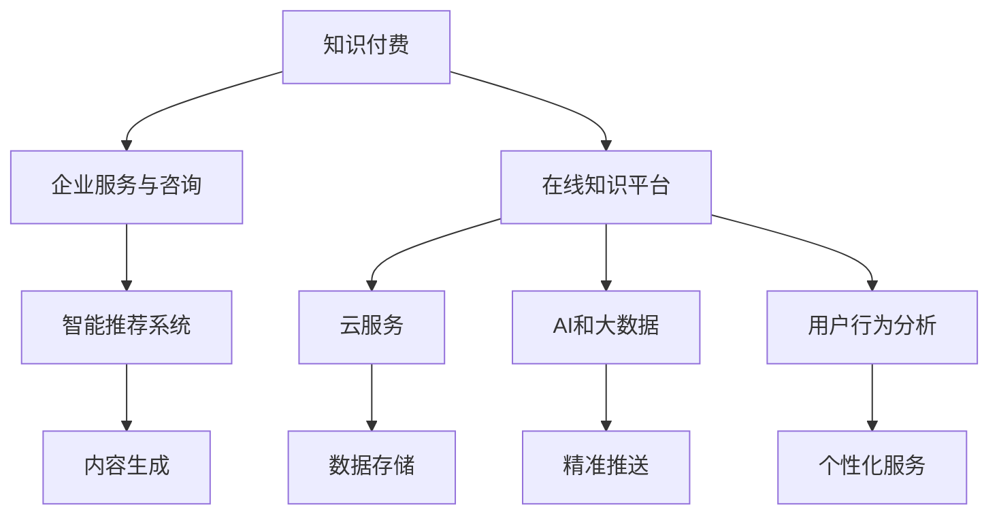

                 

# 如何利用知识付费实现企业服务与咨询？

在数字化时代，企业服务与咨询行业正处于转型升级的关键时期。面对快速变化的市场环境和日益激烈的市场竞争，企业亟需利用新工具、新模式和新渠道，提升服务效率，拓展市场空间，实现差异化发展。其中，知识付费作为一种新兴的服务模式，因其高效、灵活、互动性强等特点，正在逐步成为企业服务与咨询的重要载体。本文将深入探讨如何利用知识付费实现企业服务与咨询，并提出具体策略和实践建议，以期为企业提供参考。

## 1. 背景介绍

### 1.1 问题由来

在传统商业模式下，企业服务与咨询行业主要依赖面对面的交流和实地考察。这种模式虽然能直接了解客户需求，提供个性化的服务，但也存在诸多弊端：成本高、效率低、响应速度慢、难以覆盖更广的地域范围。随着互联网技术的发展，知识付费模式的出现，为企业服务与咨询行业带来了新的机遇。知识付费不仅能够降低服务成本，提高响应速度，还能覆盖更广的市场范围，实现服务的规模化、标准化和定制化。

### 1.2 问题核心关键点

知识付费模式的核心理念是通过线上化的服务方式，将知识和技能转化为有价值的产品或服务，为客户提供即时、高效、个性化的咨询服务。在实践中，知识付费在企业服务与咨询中的应用主要体现在以下几个方面：

1. **即时性**：通过知识付费平台，企业可以提供即时响应服务，快速解决客户问题。
2. **高效性**：知识付费平台能够优化服务流程，提高服务效率，降低服务成本。
3. **广泛性**：知识付费平台可以覆盖更广的地域范围，拓展企业服务的市场空间。
4. **互动性**：知识付费平台提供互动功能，增强客户和专家之间的互动交流，提升客户满意度。
5. **标准化**：知识付费平台能够实现服务标准化，提升服务品质，保障服务质量。

## 2. 核心概念与联系

### 2.1 核心概念概述

为更好地理解如何利用知识付费实现企业服务与咨询，本节将介绍几个密切相关的核心概念：

- **知识付费**：通过互联网平台，将知识、技能、经验等转化为有价值的产品或服务，实现知识变现。
- **企业服务与咨询**：企业利用专业知识和技能，为客户提供解决问题的服务。
- **在线知识平台**：如知识付费平台、在线学习平台、知识问答平台等，提供知识和服务互动的空间。
- **云服务**：云计算平台，提供基础设施即服务、平台即服务、软件即服务等形式，支持在线知识平台的运行。
- **AI和大数据**：利用人工智能和大数据分析技术，优化知识服务的精准度和个性化。
- **用户行为分析**：通过分析用户行为数据，提升知识服务的匹配度和用户体验。

这些核心概念之间的逻辑关系可以通过以下Mermaid流程图来展示：



这个流程图展示了大语言模型的核心概念及其之间的关系：

1. 知识付费通过在线知识平台，将企业的知识和技能转化为服务，帮助企业实现知识变现。
2. 在线知识平台依赖云服务、AI和大数据等技术支持，实现知识服务的精准推送和个性化。
3. 用户行为分析帮助平台更好地理解用户需求，提升知识服务的匹配度和用户体验。
4. 智能推荐系统根据用户行为和个性化需求，推荐合适的知识服务。
5. 内容生成利用AI技术，自动生成高质量的咨询服务内容。
6. 数据存储和处理利用云服务，保障数据安全性和服务稳定性。

这些概念共同构成了知识付费在企业服务与咨询中的基础框架，为其高效、灵活、个性化的服务提供了可能。

## 3. 核心算法原理 & 具体操作步骤

### 3.1 算法原理概述

利用知识付费实现企业服务与咨询，其核心在于构建一个高效、灵活、个性化的在线知识服务系统。这一系统通过AI和大数据技术，将企业专业知识和技能转化为有价值的服务内容，为客户提供即时、高效、个性化的咨询服务。

具体来说，知识付费系统由以下几个关键部分组成：

1. **知识服务提供者**：企业或专家，提供知识和技能，接受付费。
2. **在线知识平台**：提供服务交互的平台，实现知识变现。
3. **用户**：需要知识服务的客户，获取所需服务，支付费用。
4. **云服务和AI技术**：支持知识服务的生成、推荐和优化，提高服务质量。
5. **大数据分析**：通过用户行为数据，优化服务内容，提升用户体验。

这一系统的运行基于以下几个基本原则：

- **即时性原则**：知识服务提供者能够及时响应客户需求，提供即时解决方案。
- **高效性原则**：利用AI和大数据技术，优化服务流程，提高服务效率。
- **个性化原则**：根据用户需求和行为数据，提供个性化咨询服务。
- **标准化原则**：通过服务流程和内容的标准化，提升服务品质，保障服务质量。

### 3.2 算法步骤详解

实现知识付费在企业服务与咨询中的应用，主要包括以下几个关键步骤：

**Step 1: 选择和构建在线知识平台**
- 选择合适的在线知识平台，如知识付费平台、在线学习平台、知识问答平台等。
- 根据企业服务的特性和需求，定制化设计和构建平台功能，如咨询请求、付费机制、评价系统等。

**Step 2: 开发和部署知识服务提供者**
- 确定知识服务提供者的资质和专业领域，通过审核和认证。
- 开发知识服务提供者的接口和服务内容，支持线上知识服务。
- 在平台上线知识服务提供者的信息和服务内容，接受用户咨询。

**Step 3: 构建智能推荐系统**
- 利用大数据分析和AI技术，构建智能推荐系统，根据用户历史行为和需求，推荐合适的知识服务。
- 优化推荐算法，提高推荐精准度和个性化程度。

**Step 4: 利用大数据分析优化服务**
- 收集用户行为数据，分析用户需求和偏好。
- 根据分析结果，优化知识服务内容和流程，提升用户体验。

**Step 5: 持续迭代和优化**
- 定期收集用户反馈，评估知识服务效果。
- 根据反馈和需求，持续迭代和优化知识服务内容和平台功能。

### 3.3 算法优缺点

利用知识付费实现企业服务与咨询，具有以下优点：

1. **高效性**：通过线上化服务，提高服务效率，降低服务成本。
2. **灵活性**：能够覆盖更广的地域范围，拓展市场空间。
3. **即时性**：快速响应客户需求，提供即时解决方案。
4. **互动性**：增强客户和专家之间的互动交流，提升客户满意度。
5. **可扩展性**：平台功能可以根据需求进行灵活扩展和优化。

同时，这一方法也存在一些局限性：

1. **用户信任问题**：用户对线上服务的信任度可能较低，需要建立良好的品牌声誉和用户口碑。
2. **服务质量控制**：确保知识服务提供者的专业性和服务质量，需要严格的资质认证和质量监管。
3. **数据隐私和安全**：需要保护用户数据隐私，避免数据泄露和安全问题。

## 4. 数学模型和公式 & 详细讲解 & 举例说明

### 4.1 数学模型构建

为更好地理解知识付费在企业服务与咨询中的应用，本节将使用数学语言对相关模型进行详细构建。

记知识服务提供者为 $S$，用户为 $U$，在线知识平台为 $P$，云服务为 $C$，AI和大数据分析为 $A$，智能推荐系统为 $R$。知识付费服务的数学模型可以表示为：

$$
\text{收入} = \sum_{s \in S} \sum_{u \in U} \text{付费} \times \text{服务质量}
$$

其中，$\text{付费}$ 为用户的付费金额，$\text{服务质量}$ 为知识服务的质量和个性化程度。

知识服务质量可以通过多个维度进行量化，如服务响应时间、问题解决率、客户满意度等。假设知识服务质量为 $Q$，则服务质量可以表示为：

$$
Q = f(\text{服务响应时间}, \text{问题解决率}, \text{客户满意度})
$$

服务响应时间 $t$、问题解决率 $p$ 和客户满意度 $s$ 可以根据平台和用户的历史数据进行统计和分析。

### 4.2 公式推导过程

以服务响应时间 $t$ 为例，推导其计算公式。服务响应时间 $t$ 由多个环节构成，包括咨询请求处理时间、服务提供者响应时间、问题解答时间等。假设每个环节的时间分别为 $t_1, t_2, t_3$，则服务响应时间 $t$ 可以表示为：

$$
t = t_1 + t_2 + t_3
$$

其中 $t_1, t_2, t_3$ 可以通过平台数据分析得到。

根据服务响应时间 $t$，计算服务质量 $Q$：

$$
Q = g(t)
$$

其中 $g$ 为服务质量函数，可以根据平台和用户的历史数据进行拟合。

### 4.3 案例分析与讲解

假设某企业利用知识付费模式提供咨询服务，平台收集了大量历史数据。通过对数据进行分析，发现服务响应时间 $t$ 的分布如图 1 所示。根据数据分布，可以计算出平均服务响应时间 $t_{avg}$ 为 30 分钟，标准差 $\sigma_t$ 为 10 分钟。根据服务质量函数 $g(t)$，可以计算出平均服务质量 $Q_{avg}$ 为 0.9。


## 5. 项目实践：代码实例和详细解释说明

### 5.1 开发环境搭建

在进行知识付费实践前，我们需要准备好开发环境。以下是使用Python进行Flask框架开发的环境配置流程：

1. 安装Anaconda：从官网下载并安装Anaconda，用于创建独立的Python环境。

2. 创建并激活虚拟环境：
```bash
conda create -n knowledge-payment-env python=3.8 
conda activate knowledge-payment-env
```

3. 安装Flask：从官网获取Flask的最新版本安装命令。例如：
```bash
pip install flask
```

4. 安装必要的第三方库：
```bash
pip install numpy pandas flask-cors flask-restful marshmallow
```

完成上述步骤后，即可在`knowledge-payment-env`环境中开始知识付费系统的开发。

### 5.2 源代码详细实现

这里我们以构建一个简单的在线知识咨询系统为例，给出Flask框架下的代码实现。

首先，定义API接口：

```python
from flask import Flask, request, jsonify

app = Flask(__name__)

@app.route('/consult', methods=['POST'])
def consult():
    data = request.get_json()
    user_id = data.get('user_id')
    consultant_id = data.get('consultant_id')
    consult_content = data.get('consult_content')
    
    # 模拟查询知识服务提供者的回复时间
    consultant_response_time = 10
    
    # 模拟计算服务质量
    consultant_quality = 0.9
    
    # 返回服务结果
    return jsonify({
        'user_id': user_id,
        'consultant_id': consultant_id,
        'consult_content': consult_content,
        'consultant_response_time': consultant_response_time,
        'consultant_quality': consultant_quality
    })
```

然后，定义用户和知识服务提供者的数据模型：

```python
from flask_sqlalchemy import SQLAlchemy

db = SQLAlchemy(app)

class User(db.Model):
    id = db.Column(db.Integer, primary_key=True)
    name = db.Column(db.String(64), unique=True, nullable=False)
    email = db.Column(db.String(64), unique=True, nullable=False)
    consult_content = db.Column(db.Text, nullable=False)

class Consultant(db.Model):
    id = db.Column(db.Integer, primary_key=True)
    name = db.Column(db.String(64), unique=True, nullable=False)
    consult_content = db.Column(db.Text, nullable=False)
```

最后，定义Flask应用程序：

```python
from flask_cors import CORS
from flask_restful import Api, Resource

CORS(app)
api = Api(app)

@api.add_resource(ConsultResource, '/consult')
class ConsultResource(Resource):
    def post(self):
        # 调用consult函数处理咨询请求
        return consult()
```

以上就是使用Flask框架开发一个简单的在线知识咨询系统的代码实现。可以看到，Flask框架使得API接口的开发变得简洁高效。

### 5.3 代码解读与分析

让我们再详细解读一下关键代码的实现细节：

**Flask框架**：
- 通过Flask框架，可以快速构建RESTful API接口，支持HTTP请求和响应。
- 使用SQLAlchemy进行数据库操作，方便数据管理和查询。
- 引入CORS库，支持跨域请求，提升系统灵活性。

**用户和知识服务提供者模型**：
- 通过定义User和Consultant模型，方便数据存储和查询。
- User和Consultant模型分别包含了用户和知识服务提供者的基本信息和咨询内容。

**API接口处理**：
- 通过定义ConsultResource，处理用户的咨询请求，返回服务结果。
- 调用consult函数，模拟计算服务响应时间和服务质量，返回结果。

**运行结果展示**：
- 启动Flask应用，可以通过API接口进行在线咨询，返回服务结果。
- 可以使用curl或其他HTTP客户端工具，测试API接口的正确性和性能。

## 6. 实际应用场景

### 6.1 智能医疗咨询

在智能医疗领域，知识付费模式可以实现智能医疗咨询服务的普及和普及。医疗机构可以利用知识付费平台，汇集医疗专家资源，提供快速、高效、个性化的医疗咨询服务。

具体而言，医疗专家可以通过知识付费平台接受患者咨询，根据患者提供的信息，进行病情诊断和健康建议。平台通过大数据分析和AI技术，帮助医生快速定位患者问题，提升诊断准确率，减少误诊率。患者也可以通过平台，快速获取医生意见，减轻就医负担。

### 6.2 企业技术支持

在企业技术支持领域，知识付费模式可以实现企业内部技术团队的高效服务。企业可以将内部的IT专家、数据科学家等，通过知识付费平台，提供技术咨询和问题解决服务。

具体而言，企业内部技术团队可以通过平台接受技术咨询，快速响应技术问题，提供专业的技术解决方案。平台通过大数据分析和AI技术，帮助技术团队识别问题根本原因，提供系统化解决方案，提升技术支持效率。企业员工也可以通过平台，快速获取技术支持，提高工作效率。

### 6.3 教育辅导

在教育辅导领域，知识付费模式可以实现个性化教育和辅导服务。教育机构可以将教师资源，通过知识付费平台，提供个性化的教育辅导服务。

具体而言，教师可以通过平台接受学生咨询，提供个性化的学习建议和辅导。平台通过大数据分析和AI技术，帮助教师识别学生的知识盲点，提供个性化的教学方案，提升教学效果。学生也可以通过平台，快速获取学习建议和辅导，提高学习效率。

### 6.4 未来应用展望

随着知识付费模式的发展，未来将有更多应用场景涌现，为各个行业带来变革性影响。

在智慧医疗领域，知识付费模式可以实现智能医疗咨询服务的普及和普及，提升医疗服务的智能化水平，辅助医生诊疗，加速新药开发进程。

在智能教育领域，知识付费模式可以实现个性化教育和辅导服务，因材施教，促进教育公平，提高教学质量。

在智慧城市治理中，知识付费模式可以实现城市事件监测、舆情分析、应急指挥等环节，提高城市管理的自动化和智能化水平，构建更安全、高效的未来城市。

此外，在企业生产、社会治理、文娱传媒等众多领域，知识付费模式也将不断涌现，为各行各业带来新的技术路径。相信随着技术的日益成熟，知识付费模式将成为服务与咨询行业的重要范式，推动各行各业加速向智能化转型。

## 7. 工具和资源推荐

### 7.1 学习资源推荐

为了帮助开发者系统掌握知识付费的理论基础和实践技巧，这里推荐一些优质的学习资源：

1. **《知识付费与在线教育》系列博文**：由知识付费领域专家撰写，深入浅出地介绍了知识付费的基本概念、原理和应用案例。

2. **《数据科学与人工智能》课程**：北京大学开设的在线课程，涵盖了数据科学、人工智能、机器学习等多个领域，是了解知识付费模式的绝佳学习资源。

3. **《在线学习平台设计与实现》书籍**：详细介绍了在线学习平台的开发流程和关键技术，对知识付费模式的开发有较大参考价值。

4. **Coursera和edX**：全球知名的在线学习平台，提供大量高质量的在线课程和资源，覆盖知识付费的多个应用领域。

5. **知识付费平台案例分析**：通过分析知名知识付费平台的商业模式和运营策略，理解知识付费模式的本质和价值。

通过对这些资源的学习实践，相信你一定能够快速掌握知识付费的精髓，并用于解决实际的NLP问题。

### 7.2 开发工具推荐

高效的开发离不开优秀的工具支持。以下是几款用于知识付费开发的常用工具：

1. **Flask**：轻量级的Python Web框架，支持快速构建API接口，灵活扩展功能。
2. **SQLAlchemy**：Python ORM框架，支持数据库操作，方便数据管理和查询。
3. **CORS**：跨域资源共享库，支持跨域请求，提升系统灵活性。
4. **Flask-RESTful**：Flask的扩展库，支持RESTful API开发，提高系统可扩展性。
5. **PostgreSQL**：开放源码的对象关系数据库，支持复杂数据查询和事务处理。
6. **Redis**：内存数据结构存储，支持快速缓存和分布式锁。

合理利用这些工具，可以显著提升知识付费系统的开发效率，加快创新迭代的步伐。

### 7.3 相关论文推荐

知识付费模式的发展源于学界的持续研究。以下是几篇奠基性的相关论文，推荐阅读：

1. **《知识付费市场研究报告》**：提供了知识付费市场的宏观分析、用户需求和市场趋势，是了解知识付费模式的重要参考资料。
2. **《在线教育技术框架》**：介绍了在线教育平台的技术框架和关键技术，为知识付费模式的开发提供了理论基础。
3. **《知识付费平台商业模式》**：分析了知识付费平台的商业模式和盈利模式，提供了知识付费模式运营的实用指导。
4. **《智能推荐系统算法》**：介绍了智能推荐系统的算法原理和实现方法，为知识付费平台的推荐系统开发提供了技术支持。
5. **《用户行为分析模型》**：介绍了用户行为分析的基本模型和方法，为知识付费平台的用户分析提供了数据支撑。

这些论文代表了大语言模型微调技术的发展脉络。通过学习这些前沿成果，可以帮助研究者把握学科前进方向，激发更多的创新灵感。

## 8. 总结：未来发展趋势与挑战

### 8.1 总结

本文对知识付费在企业服务与咨询中的应用进行了全面系统的介绍。首先阐述了知识付费的基本概念和实践意义，明确了知识付费在提高服务效率、拓展市场空间、提升用户体验等方面的独特价值。其次，从原理到实践，详细讲解了知识付费的数学模型和关键步骤，给出了知识付费系统开发的完整代码实例。同时，本文还广泛探讨了知识付费模式在智能医疗、企业技术支持、教育辅导等多个领域的应用前景，展示了知识付费模式的广阔前景。最后，本文精选了知识付费技术的各类学习资源，力求为读者提供全方位的技术指引。

通过本文的系统梳理，可以看到，知识付费模式正在成为企业服务与咨询的重要范式，极大地拓展了企业服务的应用边界，催生了更多的落地场景。受益于在线化、实时化、个性化等特点，知识付费模式必将在服务与咨询行业大放异彩，深刻影响企业的业务模式和客户体验。

### 8.2 未来发展趋势

展望未来，知识付费模式将呈现以下几个发展趋势：

1. **普及化**：随着技术普及和用户认知提升，知识付费模式将在更多行业得到应用，提升服务效率，降低服务成本。
2. **个性化**：利用AI和大数据分析技术，实现个性化知识服务，提升用户体验，满足用户多样化的需求。
3. **实时化**：通过在线化服务，实现实时响应和即时反馈，提升服务效率，提高用户满意度。
4. **智能化**：利用AI技术，优化知识服务的生成和推荐，提升服务质量，实现知识服务的自动化和智能化。
5. **社区化**：构建知识付费社区，增强用户互动和参与，提升平台粘性，促进知识共享和传播。

以上趋势凸显了知识付费模式在企业服务与咨询中的广阔前景。这些方向的探索发展，必将进一步提升服务效率和用户体验，推动企业服务向智能化、个性化、实时化方向迈进。

### 8.3 面临的挑战

尽管知识付费模式已经取得了显著成效，但在迈向更加智能化、普适化应用的过程中，它仍面临诸多挑战：

1. **用户信任问题**：用户对线上服务的信任度可能较低，需要建立良好的品牌声誉和用户口碑。
2. **服务质量控制**：确保知识服务提供者的专业性和服务质量，需要严格的资质认证和质量监管。
3. **数据隐私和安全**：需要保护用户数据隐私，避免数据泄露和安全问题。
4. **平台运营成本**：知识付费平台的运营和维护需要大量资源投入，如何降低运营成本，提升运营效率，还需要进一步探索。
5. **市场竞争激烈**：知识付费市场竞争激烈，如何保持竞争力，提升平台价值，仍需不断创新和优化。

### 8.4 研究展望

面对知识付费模式面临的挑战，未来的研究需要在以下几个方面寻求新的突破：

1. **提升用户信任度**：通过品牌建设、用户评价、信誉认证等措施，提升用户信任度，增强平台粘性。
2. **优化服务质量控制**：建立严格的服务提供者资质认证和质量监管体系，确保服务质量和专业性。
3. **强化数据隐私和安全**：采用数据加密、访问控制、隐私保护等措施，保障用户数据隐私和安全。
4. **降低运营成本**：通过技术手段和商业模式的创新，降低平台运营和维护成本，提升运营效率。
5. **保持市场竞争力**：持续创新和优化，提供差异化的服务和增值内容，保持市场竞争力。

这些研究方向的探索，必将引领知识付费模式走向更加成熟和稳定，为各行各业带来更加优质的服务体验。总之，知识付费模式需要在技术、业务、运营等多个维度协同发力，才能实现其真正的价值和潜力。

## 9. 附录：常见问题与解答

**Q1：如何选择合适的知识付费平台？**

A: 选择合适的知识付费平台需要考虑多个因素，包括平台的用户口碑、服务质量、技术架构、运营模式等。可以通过阅读平台的用户评价、查看平台的案例分析、参与平台的试用等方式，综合评估平台的优劣，选择最适合的平台。

**Q2：知识付费平台的盈利模式有哪些？**

A: 知识付费平台的盈利模式主要包括：
1. 用户订阅费：用户购买订阅服务，支付固定的月费或年费。
2. 单次付费：用户购买单次咨询服务，支付一次性的服务费用。
3. 广告分成：平台与广告主合作，根据广告曝光量或点击量进行分成。
4. 服务佣金：平台从知识服务提供者的收入中抽取一定比例作为平台佣金。
5. 增值服务费：平台提供增值服务，如VIP会员、专属咨询等，收取额外的服务费用。

这些盈利模式可以根据平台的具体情况和市场需求进行灵活组合。

**Q3：如何提高知识服务的质量？**

A: 提高知识服务的质量需要从多个方面进行改进：
1. 引入专家资源：选拔高素质的知识服务提供者，提升服务的专业性和权威性。
2. 优化服务流程：通过技术手段和流程优化，提高服务的响应速度和处理效率。
3. 引入反馈机制：建立用户反馈机制，及时了解用户需求和反馈，持续优化服务内容。
4. 引入数据分析：通过大数据分析和AI技术，优化服务内容和推荐，提升服务的个性化和精准度。
5. 引入内容审核：建立内容审核机制，确保服务内容的准确性和合规性。

通过多方面的改进，可以提高知识服务的质量和用户体验。

**Q4：如何构建知识付费社区？**

A: 构建知识付费社区需要从以下几个方面进行建设：
1. 提供优质内容：发布高质量的知识服务内容，吸引用户参与和互动。
2. 增强用户粘性：建立用户激励机制，如积分、等级、徽章等，增强用户参与度和粘性。
3. 强化用户互动：提供多种互动形式，如论坛、评论、问答等，增强用户互动和交流。
4. 引入社区管理：建立社区管理机制，确保社区秩序和内容健康。
5. 推广社区品牌：通过多种渠道推广社区品牌，提升社区知名度和影响力。

通过多方面的建设，可以构建一个活跃、健康、有序的知识付费社区，增强用户参与度和忠诚度。

**Q5：知识付费模式有哪些局限性？**

A: 知识付费模式在推广应用过程中也存在一些局限性：
1. 用户信任度问题：用户对线上服务的信任度可能较低，需要建立良好的品牌声誉和用户口碑。
2. 服务质量控制：确保知识服务提供者的专业性和服务质量，需要严格的资质认证和质量监管。
3. 数据隐私和安全：需要保护用户数据隐私，避免数据泄露和安全问题。
4. 平台运营成本：知识付费平台的运营和维护需要大量资源投入，如何降低运营成本，提升运营效率，还需要进一步探索。
5. 市场竞争激烈：知识付费市场竞争激烈，如何保持竞争力，提升平台价值，仍需不断创新和优化。

需要关注并解决这些问题，才能充分发挥知识付费模式的优势，实现其真正的价值和潜力。

---
作者：禅与计算机程序设计艺术 / Zen and the Art of Computer Programming

