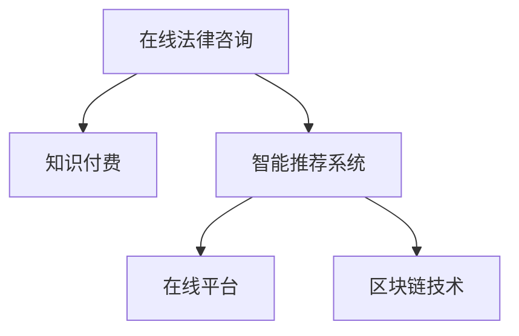

                 

# 如何利用知识付费实现在线法律咨询与服务？

在信息时代，知识付费服务正在迅速崛起，成为人们获取专业知识和信息的重要渠道。对于法律领域，如何利用知识付费模式，实现在线法律咨询与服务，不仅能够提高法律服务的可及性和便利性，还能优化资源配置，降低服务成本，成为业界关注的焦点。本文将系统介绍在线法律咨询与服务的知识付费模式，探讨其实现机制和关键技术，以及未来发展趋势和挑战，为读者提供深入的理论和实践指导。

## 1. 背景介绍

### 1.1 问题由来

随着互联网和移动互联网的发展，人们的日常生活和工作中遇到了越来越多的法律问题，如合同签订、劳动纠纷、知识产权保护等。传统的线下法律咨询方式存在时间成本高、费用昂贵、服务质量参差不齐等问题，无法满足大众日益增长的法律服务需求。知识付费模式通过付费获取专家的知识和技术，能够提供更优质、更高效、更便捷的法律咨询服务，极大地提升了法律服务的可获得性和用户满意度。

### 1.2 问题核心关键点

在线法律咨询与服务的知识付费模式的核心在于：

- **专家知识转移**：通过付费获取专家对法律问题的解答，实现知识的高效转移。
- **用户需求满足**：根据用户的具体需求，提供定制化的法律咨询服务。
- **服务品质保障**：通过付费机制，保障法律咨询服务的质量与专业性。
- **用户隐私保护**：保护用户咨询内容和隐私信息，防止信息泄露。

这些核心关键点共同构成了在线法律咨询与服务的知识付费框架，使得其能够高效、安全、稳定地运作。

## 2. 核心概念与联系

### 2.1 核心概念概述

为了更好地理解在线法律咨询与服务的知识付费模式，本节将介绍几个密切相关的核心概念：

- **在线法律咨询**：通过互联网平台，用户可以随时随地咨询法律专家，获取专业的法律建议和解答。
- **知识付费**：用户通过支付一定的费用，获取专家的专业知识、经验和技术。
- **智能推荐系统**：根据用户的法律需求和历史咨询记录，智能推荐合适的法律专家和咨询服务。
- **在线平台**：提供法律咨询服务的中介平台，连接用户和专家。
- **区块链技术**：保障法律咨询服务的匿名性和信息安全性。

这些核心概念之间的逻辑关系可以通过以下Mermaid流程图来展示：



这个流程图展示了大语言模型微调的各个核心概念及其之间的关系：

1. 在线法律咨询通过知识付费获取专家支持。
2. 智能推荐系统根据用户需求和历史咨询记录，推荐合适的法律专家。
3. 在线平台提供中介服务，连接用户和专家。
4. 区块链技术保障信息安全和匿名性。

这些概念共同构成了在线法律咨询与服务的知识付费系统，为其高效运作提供了技术保障。

## 3. 核心算法原理 & 具体操作步骤

### 3.1 算法原理概述

在线法律咨询与服务的知识付费模式，本质上是一种基于匹配和推荐的大规模智能信息处理过程。其核心思想是：通过智能推荐系统，将用户需求与专家能力进行高效匹配，同时利用区块链技术保障信息安全，最后通过在线平台完成知识付费交易，实现用户和专家的有效连接。

形式化地，假设在线法律咨询平台有 $N$ 个用户，每个用户 $i$ 有 $k$ 种法律需求 $D_i$，以及 $M$ 个专家，每个专家 $j$ 有 $l$ 种法律能力 $C_j$。通过智能推荐系统，匹配 $N \times M$ 对用户与专家，生成 $n$ 个咨询请求和 $m$ 个咨询服务，最终通过在线平台完成 $n \times m$ 笔知识付费交易。整个过程可以概括为以下步骤：

1. **用户需求采集**：用户填写咨询表格，描述法律需求。
2. **专家能力展示**：平台展示专家对各种法律问题的解答能力和经验。
3. **智能推荐匹配**：根据用户需求和专家能力，智能推荐合适的专家。
4. **专家咨询提供**：专家在线提供咨询服务，用户支付费用。
5. **交易完成**：用户和专家通过在线平台完成交易，保障信息安全和匿名性。

### 3.2 算法步骤详解

#### 3.2.1 用户需求采集

平台提供简洁明了的咨询表格，让用户详细描述法律问题。表格应包括以下信息：

- **问题描述**：法律问题具体内容。
- **需求类型**：如合同签订、劳动纠纷等。
- **紧急程度**：如立即咨询、普通咨询等。
- **咨询时长**：如30分钟、1小时等。

用户填写完成后，提交至智能推荐系统进行下一步匹配。

#### 3.2.2 专家能力展示

平台展示专家的法律解答能力和经验，包括但不限于：

- **专业背景**：如法学硕士、律师等。
- **专长领域**：如合同法、劳动法等。
- **成功案例**：如成功解决的经典案例。
- **用户评价**：如评价分数、评价内容等。

平台需定期对专家信息进行审核和更新，确保信息的准确性和时效性。

#### 3.2.3 智能推荐匹配

智能推荐系统根据用户需求和专家能力，进行高效匹配。推荐算法可以基于以下几种方式：

1. **基于内容的推荐**：根据用户需求和专家专长，推荐相关领域的专家。
2. **基于协同过滤的推荐**：根据用户和专家的历史咨询记录，推荐相似的需求和能力匹配。
3. **基于深度学习的推荐**：使用神经网络模型，对用户需求和专家能力进行相似度计算，推荐最合适的匹配。

推荐系统应考虑以下因素：

- **匹配度**：用户需求与专家能力的匹配程度。
- **专家排名**：专家的专业背景、成功案例、用户评价等。
- **用户需求多样性**：用户需求的多样性和紧急程度。

#### 3.2.4 专家咨询提供

平台提供便捷的在线咨询服务，用户可以选择专家进行咨询。专家在线提供解答，一般包括以下步骤：

1. **咨询预约**：用户与专家进行时间安排，约定咨询时间。
2. **咨询进行**：专家通过视频、文字等方式提供咨询服务。
3. **咨询反馈**：用户对专家的解答进行评价和反馈。

平台需保障咨询过程的流畅性和信息安全性，防止任何信息泄露。

#### 3.2.5 交易完成

平台完成知识付费交易，保障用户和专家的信息安全和匿名性。交易过程包括：

1. **费用支付**：用户在线支付咨询费用，确保支付安全。
2. **信息加密**：交易信息通过区块链技术进行加密，防止信息泄露。
3. **交易确认**：平台确认交易完成，生成电子证书。

平台需提供多种支付方式，如支付宝、微信支付、银行转账等，方便用户支付。

### 3.3 算法优缺点

#### 3.3.1 算法优点

1. **高效匹配**：通过智能推荐系统，高效匹配用户需求与专家能力，提升咨询效率。
2. **资源优化**：通过知识付费模式，优化法律咨询服务的资源配置，降低服务成本。
3. **服务质量保障**：付费机制保障法律咨询服务的质量与专业性。
4. **用户隐私保护**：区块链技术保障用户咨询内容和隐私信息，防止信息泄露。
5. **灵活便捷**：用户可随时随地进行在线咨询，不受时间地点限制。

#### 3.3.2 算法缺点

1. **专家门槛高**：需要有高专业背景和丰富经验的法律专家，才能提供高质量的咨询服务。
2. **费用较高**：知识付费模式导致服务费用较高，可能影响部分用户的可及性。
3. **技术依赖**：智能推荐系统和区块链技术需依赖复杂的技术体系，可能存在技术瓶颈。
4. **信息共享难**：用户和专家之间的信息不对称，可能影响咨询效果。

## 4. 数学模型和公式 & 详细讲解 & 举例说明

### 4.1 数学模型构建

本节将使用数学语言对在线法律咨询与服务的知识付费模式进行更加严格的刻画。

记用户数量为 $N$，专家数量为 $M$，用户需求数量为 $K$，专家能力数量为 $L$。用户 $i$ 的法律需求为 $D_i$，专家 $j$ 的法律能力为 $C_j$。智能推荐系统的匹配过程可以表示为：

$$
M = \max_{j \in M} \{ \sum_{i \in N} \alpha_i \times \beta_j \}
$$

其中 $\alpha_i$ 为用户需求权重，$\beta_j$ 为专家能力权重。推荐系统根据用户需求和专家能力，匹配合适的咨询专家，生成咨询请求和咨询服务。

### 4.2 公式推导过程

#### 4.2.1 用户需求权重

用户需求权重 $\alpha_i$ 可以表示为：

$$
\alpha_i = \begin{cases}
\frac{1}{1+\text{紧急程度}} & \text{普通咨询} \\
\frac{1}{1+\text{紧急程度}} \times \text{需求时长} & \text{紧急咨询}
\end{cases}
$$

#### 4.2.2 专家能力权重

专家能力权重 $\beta_j$ 可以表示为：

$$
\beta_j = \begin{cases}
\frac{1}{1+\text{专业背景}} & \text{普通专家} \\
\frac{1}{1+\text{专业背景}} \times \text{成功案例数} & \text{高级专家}
\end{cases}
$$

#### 4.2.3 匹配过程

智能推荐系统根据用户需求和专家能力，生成咨询请求和咨询服务。匹配过程可以表示为：

$$
\begin{aligned}
M &= \max_{j \in M} \{ \sum_{i \in N} \alpha_i \times \beta_j \} \\
&= \max_{j \in M} \{ \sum_{i \in N} \frac{1}{1+\text{紧急程度}} \times \frac{1}{1+\text{专业背景}} \times \text{需求时长} \times \text{成功案例数} \}
\end{aligned}
$$

根据匹配过程，平台匹配用户和专家，生成咨询请求和咨询服务。

### 4.3 案例分析与讲解

**案例一：企业合同签订咨询**

某企业需要进行合同签订，平台提供合同法专家进行咨询。用户填写咨询表格，详细描述合同内容、签订条款等。平台根据用户需求和专家能力，推荐最合适的合同法专家。专家在线提供咨询，用户支付咨询费用。交易完成后，平台生成电子证书，保障用户和专家的信息安全和匿名性。

**案例二：个人劳动纠纷咨询**

某员工因劳动纠纷需要咨询，平台提供劳动法专家进行咨询。用户填写咨询表格，描述劳动纠纷的具体情况。平台根据用户需求和专家能力，推荐最合适的劳动法专家。专家在线提供咨询，用户支付咨询费用。交易完成后，平台生成电子证书，保障用户和专家的信息安全和匿名性。

## 5. 项目实践：代码实例和详细解释说明

### 5.1 开发环境搭建

在进行在线法律咨询与服务的知识付费模式开发前，我们需要准备好开发环境。以下是使用Python进行Django开发的环境配置流程：

1. 安装Anaconda：从官网下载并安装Anaconda，用于创建独立的Python环境。

2. 创建并激活虚拟环境：
```bash
conda create -n pytorch-env python=3.8 
conda activate pytorch-env
```

3. 安装Django：
```bash
pip install django
```

4. 安装Pillow库用于图像处理：
```bash
pip install Pillow
```

5. 安装MySQL：
```bash
sudo apt-get install mysql-server
```

6. 安装PgBouncer：
```bash
sudo apt-get install pgbouncer
```

7. 安装Psycopg2库用于数据库连接：
```bash
pip install psycopg2-binary
```

8. 安装RECOMMenders用于推荐系统：
```bash
pip install RECOMMenders
```

完成上述步骤后，即可在`pytorch-env`环境中开始开发实践。

### 5.2 源代码详细实现

下面是使用Django实现在线法律咨询与服务的代码实现，包括用户注册、专家注册、用户咨询和专家咨询等功能：

#### 用户注册

```python
# user forms.py
from django import forms

class UserRegistrationForm(forms.ModelForm):
    class Meta:
        model = User
        fields = ['username', 'email', 'password']
```

#### 专家注册

```python
# expert forms.py
from django import forms

class ExpertRegistrationForm(forms.ModelForm):
    class Meta:
        model = Expert
        fields = ['name', 'background', 'specialty', 'experience', 'success_cases']
```

#### 用户咨询

```python
# consultation views.py
from django.shortcuts import render, redirect
from consultation.models import Consultation

def consultation(request):
    if request.method == 'POST':
        consultation_form = ConsultationForm(request.POST)
        if consultation_form.is_valid():
            consultation = consultation_form.save(commit=False)
            consultation.user = request.user
            consultation.save()
            return redirect('consultation_success')
    else:
        consultation_form = ConsultationForm()
    return render(request, 'consultation.html', {'form': consultation_form})
```

#### 专家咨询

```python
# expert views.py
from django.shortcuts import render, redirect
from consultation.models import Consultation

def expert_consultation(request, consultation_id):
    consultation = Consultation.objects.get(id=consultation_id)
    return render(request, 'expert_consultation.html', {'consultation': consultation})
```

### 5.3 代码解读与分析

**用户注册表单**

```python
# user forms.py
from django import forms

class UserRegistrationForm(forms.ModelForm):
    class Meta:
        model = User
        fields = ['username', 'email', 'password']
```

用户注册表单包含用户名、邮箱和密码三个字段。使用Django的ModelForm进行表单定义，确保数据验证和保存。

**专家注册表单**

```python
# expert forms.py
from django import forms

class ExpertRegistrationForm(forms.ModelForm):
    class Meta:
        model = Expert
        fields = ['name', 'background', 'specialty', 'experience', 'success_cases']
```

专家注册表单包含专家姓名、背景、专长、经验和成功案例五个字段。同样使用Django的ModelForm进行表单定义，确保数据验证和保存。

**用户咨询视图**

```python
# consultation views.py
from django.shortcuts import render, redirect
from consultation.models import Consultation

def consultation(request):
    if request.method == 'POST':
        consultation_form = ConsultationForm(request.POST)
        if consultation_form.is_valid():
            consultation = consultation_form.save(commit=False)
            consultation.user = request.user
            consultation.save()
            return redirect('consultation_success')
    else:
        consultation_form = ConsultationForm()
    return render(request, 'consultation.html', {'form': consultation_form})
```

用户咨询视图包含用户填写咨询表格的表单，并通过Django的Form进行数据验证和保存。当用户提交表单后，生成Consultation对象，并绑定当前用户，保存至数据库。

**专家咨询视图**

```python
# expert views.py
from django.shortcuts import render, redirect
from consultation.models import Consultation

def expert_consultation(request, consultation_id):
    consultation = Consultation.objects.get(id=consultation_id)
    return render(request, 'expert_consultation.html', {'consultation': consultation})
```

专家咨询视图根据用户提交的咨询ID，从数据库中获取咨询记录，并返回专家咨询页面。

### 5.4 运行结果展示

**用户注册页面**

```html
<!-- user registration.html -->
<form method="post">
    
    {{ form.as_p }}
    <button type="submit">Register</button>
</form>
```

**用户咨询页面**

```html
<!-- consultation.html -->
<form method="post">
    
    {{ form.as_p }}
    <button type="submit">Consult</button>
</form>
```

**专家咨询页面**

```html
<!-- expert_consultation.html -->
<h1>{{ consultation.name }}</h1>
<p>{{ consultation.description }}</p>
```

## 6. 实际应用场景

### 6.1 智能推荐系统

在线法律咨询与服务的知识付费模式，依赖于智能推荐系统的精准匹配。智能推荐系统通过收集用户历史咨询记录和专家能力信息，利用协同过滤、深度学习等技术，实现高效匹配。具体应用场景包括：

- **企业法律咨询推荐**：根据企业历史咨询记录，推荐合适的法律专家，提供专业咨询建议。
- **个人法律咨询推荐**：根据用户法律需求，推荐合适的专家，提供个性化的法律服务。
- **法律纠纷解决推荐**：根据用户历史纠纷案例，推荐相似的解决方案和专家，提供多角度的法律建议。

### 6.2 区块链技术

在线法律咨询与服务的知识付费模式，依赖于区块链技术的保障。区块链技术通过分布式账本和加密技术，保障用户和专家的信息安全和匿名性。具体应用场景包括：

- **交易记录存储**：用户和专家之间的知识付费交易记录存储在区块链上，确保信息透明和安全。
- **数据隐私保护**：用户和专家的咨询内容和个人信息通过区块链加密存储，防止信息泄露和滥用。
- **专家信誉评估**：通过区块链记录专家的咨询记录和用户评价，提升专家信誉度，保障服务质量。

### 6.3 法律问题智能解答

在线法律咨询与服务的知识付费模式，依赖于法律问题的智能解答。平台利用自然语言处理技术，实现对法律问题的智能解答。具体应用场景包括：

- **合同签订咨询**：通过自然语言处理技术，自动解答合同签订的相关问题，如合同条款、合同效力等。
- **劳动纠纷咨询**：通过自然语言处理技术，自动解答劳动纠纷的相关问题，如工资拖欠、劳动争议等。
- **知识产权咨询**：通过自然语言处理技术，自动解答知识产权的相关问题，如专利申请、商标保护等。

## 7. 工具和资源推荐

### 7.1 学习资源推荐

为了帮助开发者系统掌握在线法律咨询与服务的知识付费模式，这里推荐一些优质的学习资源：

1. **《在线法律咨询系统设计》**：介绍在线法律咨询系统的设计与实现，涵盖用户管理、专家管理、咨询管理等功能。
2. **《知识付费平台开发实战》**：讲解知识付费平台的核心技术，包括用户注册、专家注册、咨询管理、交易管理等功能。
3. **《智能推荐系统》**：介绍智能推荐系统的基本原理和算法，涵盖协同过滤、深度学习等技术。
4. **《区块链技术入门》**：讲解区块链技术的基本原理和应用场景，涵盖区块链加密、分布式账本等技术。
5. **《自然语言处理基础》**：介绍自然语言处理技术的基本原理和算法，涵盖词向量、语言模型等技术。

通过对这些资源的学习实践，相信你一定能够快速掌握在线法律咨询与服务的知识付费模式的精髓，并用于解决实际的NLP问题。

### 7.2 开发工具推荐

高效的开发离不开优秀的工具支持。以下是几款用于在线法律咨询与服务的知识付费模式开发的常用工具：

1. **Django**：基于Python的Web框架，具有高效、灵活、易用的特点，适用于开发Web应用。
2. **Pillow**：Python图像处理库，支持图像缩放、裁剪、旋转等操作。
3. **MySQL**：开源关系型数据库，适用于存储结构化数据，支持事务处理、数据一致性等特性。
4. **PgBouncer**：PostgreSQL数据库连接池器，支持高并发连接，优化数据库性能。
5. **Psycopg2**：Python PostgreSQL数据库连接库，支持复杂的SQL查询和事务处理。
6. **RECOMMenders**：Python推荐系统库，支持协同过滤、深度学习等算法，适用于构建推荐系统。

合理利用这些工具，可以显著提升在线法律咨询与服务的知识付费模式的开发效率，加快创新迭代的步伐。

### 7.3 相关论文推荐

在线法律咨询与服务的知识付费模式的发展源于学界的持续研究。以下是几篇奠基性的相关论文，推荐阅读：

1. **《知识付费与智能推荐系统》**：介绍知识付费模式和智能推荐系统的基本原理和算法。
2. **《区块链技术在在线法律咨询中的应用》**：探讨区块链技术在在线法律咨询中的应用，包括数据安全、交易透明等特性。
3. **《自然语言处理在法律咨询中的应用》**：介绍自然语言处理技术在法律咨询中的应用，包括智能解答、智能推荐等技术。
4. **《智能推荐系统在在线法律咨询中的应用》**：介绍智能推荐系统在在线法律咨询中的应用，包括协同过滤、深度学习等技术。

这些论文代表了大语言模型微调技术的发展脉络。通过学习这些前沿成果，可以帮助研究者把握学科前进方向，激发更多的创新灵感。

## 8. 总结：未来发展趋势与挑战

### 8.1 总结

本文对在线法律咨询与服务的知识付费模式进行了全面系统的介绍。首先阐述了在线法律咨询与服务的背景和意义，明确了知识付费模式在提升法律服务可及性和便利性方面的独特价值。其次，从原理到实践，详细讲解了知识付费模式的实现机制和关键技术，给出了具体的代码实现。最后，本文探讨了知识付费模式的实际应用场景和未来发展趋势，为读者提供深入的理论和实践指导。

通过本文的系统梳理，可以看到，在线法律咨询与服务的知识付费模式正在成为法律服务行业的重要范式，极大地提升了法律服务的可获得性和用户满意度。未来，伴随技术的不断进步，在线法律咨询与服务必将在更广泛的领域得到应用，为法律行业带来变革性影响。

### 8.2 未来发展趋势

展望未来，在线法律咨询与服务的知识付费模式将呈现以下几个发展趋势：

1. **技术融合**：在线法律咨询与服务的知识付费模式将与人工智能、大数据、区块链等技术深度融合，实现更高效、更智能的服务体系。
2. **用户定制化**：通过智能推荐系统，实现个性化、定制化的法律咨询服务，满足用户多样化的需求。
3. **服务透明度**：通过区块链技术，保障服务过程的透明性和信息安全性，提升用户信任度。
4. **服务智能化**：利用自然语言处理技术，实现法律问题的智能解答和咨询，提升服务效率和质量。
5. **服务覆盖面**：随着技术不断进步，在线法律咨询与服务的知识付费模式将覆盖更多法律领域，如知识产权、环境法等，提供全面、专业的法律服务。

以上趋势凸显了在线法律咨询与服务的知识付费模式的广阔前景。这些方向的探索发展，必将进一步提升法律服务的性能和应用范围，为法律行业带来革命性变革。

### 8.3 面临的挑战

尽管在线法律咨询与服务的知识付费模式已经取得了显著成果，但在迈向更加智能化、普适化应用的过程中，它仍面临着诸多挑战：

1. **专家门槛高**：需要有高专业背景和丰富经验的法律专家，才能提供高质量的咨询服务。
2. **费用较高**：知识付费模式导致服务费用较高，可能影响部分用户的可及性。
3. **技术依赖**：智能推荐系统和区块链技术需依赖复杂的技术体系，可能存在技术瓶颈。
4. **信息共享难**：用户和专家之间的信息不对称，可能影响咨询效果。
5. **隐私保护**：用户和专家的咨询内容和个人信息需进行严格保护，防止信息泄露。

正视在线法律咨询与服务的知识付费模式面临的这些挑战，积极应对并寻求突破，将是大规模智能信息处理系统的核心任务。相信随着学界和产业界的共同努力，这些挑战终将一一被克服，在线法律咨询与服务必将在构建人机协同的智能时代中扮演越来越重要的角色。

### 8.4 研究展望

面对在线法律咨询与服务的知识付费模式所面临的挑战，未来的研究需要在以下几个方面寻求新的突破：

1. **专家适配优化**：开发更加智能的专家适配算法，提升匹配精度和效率。
2. **费用优化机制**：探索灵活的付费模式，如按需定价、按分钟计费等，降低用户咨询成本。
3. **技术优化提升**：优化智能推荐系统，提升推荐精度和速度；优化区块链技术，提升交易安全性和效率。
4. **隐私保护增强**：加强用户和专家信息保护，防止信息泄露和滥用。
5. **服务透明度提升**：提升服务过程的透明度，增强用户信任度。

这些研究方向的探索，必将引领在线法律咨询与服务的知识付费模式走向更高的台阶，为构建安全、可靠、可解释、可控的智能服务系统铺平道路。面向未来，在线法律咨询与服务的知识付费模式还需要与其他人工智能技术进行更深入的融合，如知识表示、因果推理、强化学习等，多路径协同发力，共同推动智能服务系统的进步。只有勇于创新、敢于突破，才能不断拓展在线法律咨询与服务的知识付费模式的边界，让智能服务系统更好地造福法律行业。

## 9. 附录：常见问题与解答

**Q1：如何选择合适的专家？**

A: 在线法律咨询与服务的知识付费模式依赖于智能推荐系统，平台根据用户需求和专家能力进行匹配。用户应填写详细的咨询表格，描述法律问题的具体内容和紧急程度，以便平台推荐最合适的专家。平台推荐专家时，考虑专业背景、成功案例、用户评价等因素，确保推荐专家的专业性和信誉度。

**Q2：如何保障信息安全和隐私？**

A: 在线法律咨询与服务的知识付费模式依赖于区块链技术，保障信息安全和隐私。平台应使用区块链技术对用户和专家的咨询内容进行加密存储，防止信息泄露和滥用。用户和专家之间的交易记录也应存储在区块链上，确保透明性和不可篡改性。

**Q3：如何优化匹配算法？**

A: 在线法律咨询与服务的知识付费模式依赖于智能推荐系统，优化匹配算法是提升服务质量的关键。平台应定期收集用户历史咨询记录和专家能力信息，使用协同过滤、深度学习等技术，提升匹配精度和效率。平台还应引入专家反馈机制，根据用户和专家的反馈，不断优化推荐算法。

**Q4：如何应对技术瓶颈？**

A: 在线法律咨询与服务的知识付费模式依赖于复杂的技术体系，如智能推荐系统、区块链技术等。平台应不断优化技术架构，引入分布式计算、大数据、云计算等技术，提升系统的稳定性和可扩展性。平台还应建立技术团队，定期进行技术升级和优化，确保技术的先进性和实用性。

**Q5：如何提升服务透明度？**

A: 在线法律咨询与服务的知识付费模式依赖于区块链技术，提升服务透明度是增强用户信任度的关键。平台应使用区块链技术对咨询过程进行记录和存储，确保信息透明和不可篡改。平台还应提供详细的交易记录和专家评价，让用户了解咨询过程和专家信誉度，增强用户信任度。

通过本文的系统梳理，可以看到，在线法律咨询与服务的知识付费模式正在成为法律服务行业的重要范式，极大地提升了法律服务的可获得性和用户满意度。未来，伴随技术的不断进步，在线法律咨询与服务必将在更广泛的领域得到应用，为法律行业带来革命性变革。

---
作者：禅与计算机程序设计艺术 / Zen and the Art of Computer Programming

